# Qwen

## 1. Qwen이 뭔지부터 정리

Qwen은 알리바바 클라우드(Alibaba Cloud) 산하 통이천원(通义千问, Tongyi Qianwen) 팀이 만드는 LLM 패밀리다. 2023년 8월 첫 공개 이후 2~3개월 주기로 새 버전이 떨어진다. 2026년 5월 현재 메인 라인은 Qwen3.6 계열이고, 그 아래로 멀티모달(Qwen-VL), 코딩 특화(Qwen-Coder), 오디오(Qwen-Audio), 임베딩(Qwen3-Embedding) 같은 변종이 깔려 있다.

오픈소스 LLM 시장에서 Qwen이 차지하는 위치는 살짝 독특하다. Meta Llama처럼 "허깅페이스 한 번 받아서 끝나는" 라이센스도 아니고, OpenAI처럼 "API만 쓰라"는 입장도 아니다. 가중치는 대부분 공개되지만 라이센스 조건이 모델 크기마다 다르고, 동시에 알리바바가 운영하는 DashScope라는 매니지드 API도 같이 굴러간다. 자체 호스팅을 하든 API를 쓰든 둘 다 선택지가 열려 있다는 게 실무 입장에서 가장 큰 차이점이다.

벤치마크 점수만 보면 Llama 3.3 70B, DeepSeek-V3와 비슷한 구간에 있고, 한국어/중국어 처리는 Llama 계열보다 확실히 낫다. 회사 인프라가 중국 본토에 있거나 한국어 토큰화 효율이 중요한 워크로드면 우선순위가 올라가는 모델이다.

---

## 2. 모델 패밀리 구조

세대를 시간순으로 정리한다. 숫자가 헷갈리기 쉬워서 한 번 짚고 가는 게 낫다.

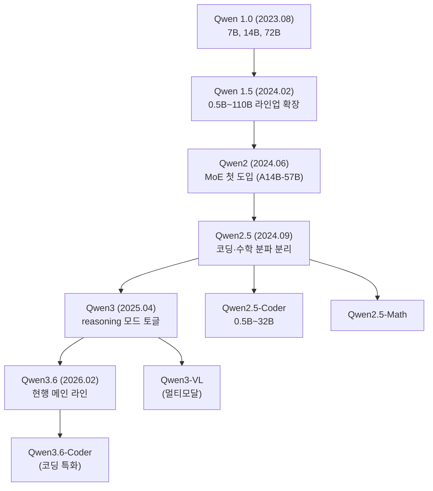
```mermaid
graph TD
    Q1["Qwen 1.0 (2023.08)<br/>7B, 14B, 72B"]
    Q15["Qwen 1.5 (2024.02)<br/>0.5B~110B 라인업 확장"]
    Q2["Qwen2 (2024.06)<br/>MoE 첫 도입 (A14B-57B)"]
    Q25["Qwen2.5 (2024.09)<br/>코딩·수학 분파 분리"]
    Q3["Qwen3 (2025.04)<br/>reasoning 모드 토글"]
    Q36["Qwen3.6 (2026.02)<br/>현행 메인 라인"]

    Q1 --> Q15 --> Q2 --> Q25 --> Q3 --> Q36

    Q25 --> Q25C["Qwen2.5-Coder<br/>0.5B~32B"]
    Q25 --> Q25M["Qwen2.5-Math"]
    Q3 --> Q3VL["Qwen3-VL<br/>(멀티모달)"]
    Q36 --> Q36C["Qwen3.6-Coder<br/>(코딩 특화)"]
```

세대별로 실무에서 알아야 할 차이점만 짚는다.

### 2.1 Qwen2.5

가장 많이 쓰이는 안정 라인이다. 한국어 처리 품질이 Qwen2 대비 눈에 띄게 개선된 첫 세대고, fine-tuning 생태계도 가장 두껍다. 0.5B/1.5B/3B/7B/14B/32B/72B로 사이즈가 촘촘하게 깔려 있어서 엣지 디바이스부터 H100 서버까지 한 패밀리로 묶을 수 있다.

코딩 변종인 Qwen2.5-Coder는 HumanEval/MBPP 점수가 GPT-4o에 근접하는 구간(32B 기준)까지 올라왔고, 32K 컨텍스트와 fill-in-the-middle 토큰을 지원해서 IDE 통합용으로 쓰기 좋다.

### 2.2 Qwen3

가장 큰 변화는 reasoning 모드 토글이다. 모든 Qwen3 모델은 `enable_thinking` 플래그로 `<think>...</think>` 블록을 켜고 끌 수 있다. 켜면 응답 전에 내부 추론 토큰을 뿜고 끄면 바로 답한다. DeepSeek-R1처럼 별도 모델로 분리하지 않고 한 모델에서 토글로 처리하는 방식이 Qwen3의 특징이다.

MoE 변종도 이 세대에서 본격화됐다. `Qwen3-A3B`(3B active, 30B total), `Qwen3-A22B`(22B active, 235B total) 같은 모델이 등장했다. 이름의 `A` 뒤 숫자가 토큰 하나를 처리할 때 실제로 계산에 참여하는 파라미터(active)이고, 앞의 `30B`, `235B`가 가중치 전체(total)다.

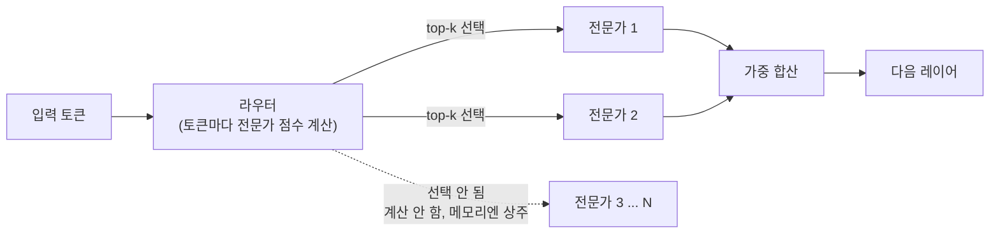
```mermaid
graph LR
    T["입력 토큰"] --> R["라우터<br/>(토큰마다 전문가 점수 계산)"]
    R -->|"top-k 선택"| E1["전문가 1"]
    R -->|"top-k 선택"| E2["전문가 2"]
    R -.->|"선택 안 됨<br/>계산 안 함, 메모리엔 상주"| E3["전문가 3 ... N"]
    E1 --> M["가중 합산"]
    E2 --> M
    M --> O["다음 레이어"]
```

라우터는 레이어마다, 토큰마다 전문가 N개 중 k개만 고른다. 선택되지 않은 전문가는 이 토큰에서 계산하지 않지만 다른 토큰이 언제 고를지 모르기 때문에 가중치는 전부 VRAM에 올라가 있어야 한다. 그래서 연산량은 active 기준, 메모리는 total 기준으로 잡힌다.

| 모델 | total | active | 계산량 감각 | bf16 VRAM(가중치만) |
|------|-------|--------|------------|--------------------|
| Qwen3-A3B | 30B | 3B | 3B dense와 비슷 | 약 60GB |
| Qwen3-A22B | 235B | 22B | 22B dense와 비슷 | 약 470GB |

"3B만 쓰니까 3B 모델용 GPU면 된다"고 오해하기 쉬운데, A3B도 가중치는 30B라서 24GB 카드 한 장에는 양자화 없이 올라가지 않는다. 동시 요청이 많은 서버에서 처리량이 잘 나오는 쪽이고, 요청이 하나씩 드문드문 들어오는 환경에서는 메모리만 먹는 구성이 된다. 전문가 개수와 토큰당 선택 개수는 모델 카드의 `config.json`(`num_experts`, `num_experts_per_tok`)에서 직접 확인한다.

### 2.3 Qwen3.6 (현행)

2026년 2월에 떨어진 현행 메인이다. 핵심 변경은 세 가지다.

- 32K가 기본 컨텍스트, YaRN 스케일링으로 131K까지 확장
- reasoning 모드의 토큰 효율이 개선됨. 같은 문제에서 Qwen3보다 추론 토큰이 줄었다는 게 릴리스 노트의 설명인데, 줄어드는 폭은 문제 유형마다 달라서 숫자를 믿지 말고 자기 프롬프트 20~30개로 `usage.completion_tokens`를 비교해 보는 게 맞다
- 도구 호출(tool calling) JSON 출력 안정성 강화. 도구 호출 설계는 [Qwen 도구 호출과 Agent](Qwen_Tool_Calling_Agent.md)에서 다룬다

dense는 0.5B/1.7B/4B/8B/14B/27B/72B, MoE는 A3B-30B와 A22B-235B 두 종이 있다. 72B는 Hugging Face 비공개고 DashScope API로만 쓸 수 있다는 게 함정이다.

### 2.4 Qwen-VL (멀티모달)

이미지를 함께 받는 비전-언어 모델 라인이다. 2026년 5월 기준 현행은 Qwen3-VL이고, 사이즈는 2B/8B/72B다. 차트나 표가 들어간 PDF 처리, 화면 캡처 기반 UI 자동화, OCR 대체 같은 용도로 쓴다. GPT-4o 비전과 비교하면 영어 자료에서는 약간 밀리지만, 중국어와 한국어가 섞인 문서에서는 Qwen3-VL이 더 안정적인 결과를 낸다.

영상 입력은 Qwen2.5-VL부터 지원되기 시작했는데, 실무에서는 프레임을 잘라서 이미지 시퀀스로 넣는 방식이 여전히 더 안정적이다. 영상 직접 입력은 길이 제한과 토큰 비용 계산이 까다로워서 프로덕션 도입 전에 꼭 테스트해봐야 한다.

### 2.5 Qwen-Coder

코드 작성·디버깅·리포지토리 이해에 특화된 라인이다. Qwen2.5-Coder가 가장 널리 쓰였고, 2026년 들어 Qwen3-Coder(A35B MoE)가 나왔다. 차별점은 두 가지다.

- 코드 + 자연어 + reasoning 모드를 한 모델에서 처리
- repo-level 학습 데이터 비중이 크다. 단일 파일이 아니라 다중 파일 컨텍스트에서 import 관계와 호출 흐름을 따라가는 능력이 일반 모델 대비 우수하다

Cursor나 Continue 같은 IDE 도구에서 Qwen-Coder를 셀프 호스팅 옵션으로 두는 경우가 늘고 있는 이유가 이쪽이다.

### 2.6 Qwen-Omni

텍스트·이미지·오디오·영상을 입력으로 받고, 출력도 텍스트와 음성 두 가지를 낸다. 같은 이름 아래 여러 세대가 나와 있어서 쓰려는 버전의 모델 카드를 먼저 확인해야 한다. Qwen-VL이 "이미지를 읽고 글로 답하는" 모델이라면 Omni는 음성 대화(음성 입력 → 음성 응답)를 한 모델이 끝내는 구성이다. STT → LLM → TTS 세 단계를 직렬로 붙이면 단계마다 지연이 쌓이는데, Omni는 이 파이프라인을 하나로 줄이려는 목적이다.

실무에서는 두 가지가 걸린다. 첫째, 음성 출력까지 쓰려면 일반 텍스트 LLM보다 서빙 구성이 복잡하다. vLLM이 텍스트 출력 경로는 지원해도 음성 생성 경로는 별도 런타임이 필요한 경우가 있어서 "텍스트만 받는다"로 시작하는 편이 안전하다. 둘째, 오디오·영상 입력은 토큰으로 환산되는 길이가 크다. 영상 한 편을 그대로 넣기 전에 입력 토큰이 얼마나 나오는지부터 재야 한다.

### 2.7 Qwen3-Embedding과 Reranker

Qwen 본체와 별개로 임베딩 모델과 리랭커 모델이 따로 나온다. 둘은 RAG 검색 파이프라인의 서로 다른 단계를 맡는다.

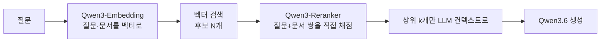
```mermaid
flowchart LR
    Q["질문"] --> E["Qwen3-Embedding<br/>질문·문서를 벡터로"]
    E --> V["벡터 검색<br/>후보 N개"]
    V --> RR["Qwen3-Reranker<br/>질문+문서 쌍을 직접 채점"]
    RR --> TOP["상위 k개만 LLM 컨텍스트로"]
    TOP --> L["Qwen3.6 생성"]
```

임베딩은 문서를 미리 벡터로 만들어 두고 빠르게 후보를 추리는 단계라 정밀도가 낮고, 리랭커는 질문과 문서를 한 쌍으로 모델에 넣어서 점수를 매기니 느리지만 정확하다. 그래서 후보 수십 개를 임베딩으로 뽑고 리랭커로 몇 개만 남기는 순서로 쓴다. 한국어 문서 검색에서 임베딩만 쓰다가 리랭커를 붙이면 상위 결과의 질이 달라지는 경우가 있지만, 얼마나 달라지는지는 코퍼스마다 다르다. 서빙 방법과 한국어 평가 방법은 [Qwen Embedding과 Reranker](Qwen_Embedding_Reranker.md)에 따로 정리했다.

### 2.8 Qwen-Agent

Qwen 팀이 공개한 에이전트 프레임워크다. 함수 호출, 코드 인터프리터, RAG, MCP 연동을 Qwen 모델에 맞춰 묶어 놓은 라이브러리여서 LangChain 같은 범용 프레임워크 없이도 도구 호출 루프를 빠르게 돌려볼 수 있다. 반대로 Qwen 외 모델과 섞어 쓰거나 이미 LangGraph 같은 오케스트레이션을 쓰고 있다면 굳이 갈아탈 이유는 없다. 이 경우엔 Qwen을 OpenAI 호환 엔드포인트로 붙이고 도구 호출 형식만 맞추면 된다. 프롬프트 형식과 파서 문제는 [Qwen 도구 호출과 Agent](Qwen_Tool_Calling_Agent.md)에 있다.

---

## 3. 라이선스가 헷갈리는 이유

Qwen 라이선스는 모델 크기와 세대마다 다르다. 한 번 정리해두지 않으면 사고가 난다.

| 모델 | 라이선스 | 상업 사용 |
|------|---------|----------|
| Qwen2.5 (0.5B~14B) | Apache 2.0 | 자유 |
| Qwen2.5 (32B) | Apache 2.0 | 자유 |
| Qwen2.5 (72B) | Qwen License | 월 활성 사용자 1억 이상이면 별도 계약 필요 |
| Qwen2.5-Coder (전 사이즈) | Apache 2.0 | 자유 |
| Qwen3 (0.5B~14B) | Apache 2.0 | 자유 |
| Qwen3 (32B, A22B) | Apache 2.0 | 자유 |
| Qwen3 (72B) | Qwen License | 1억 MAU 조항 |
| Qwen3.6 (0.5B~27B) | Apache 2.0 | 자유 |
| Qwen3.6 (72B) | API 전용 (가중치 비공개) | DashScope만 |

72B 라인이 항상 까칠하다는 게 핵심이다. 자체 호스팅으로 상업 서비스에 박을 거면 27B 이하로 가거나 MoE 변종(A22B)을 쓰는 게 사고가 없다. 72B를 꼭 써야 한다면 그냥 DashScope API를 호출하는 쪽이 라이선스 관리 비용 면에서 싸다.

위 표를 모델 하나를 고를 때 따라가는 순서로 바꾸면 이렇다. 사이즈를 먼저 정하고 세대를 보는 순서다.

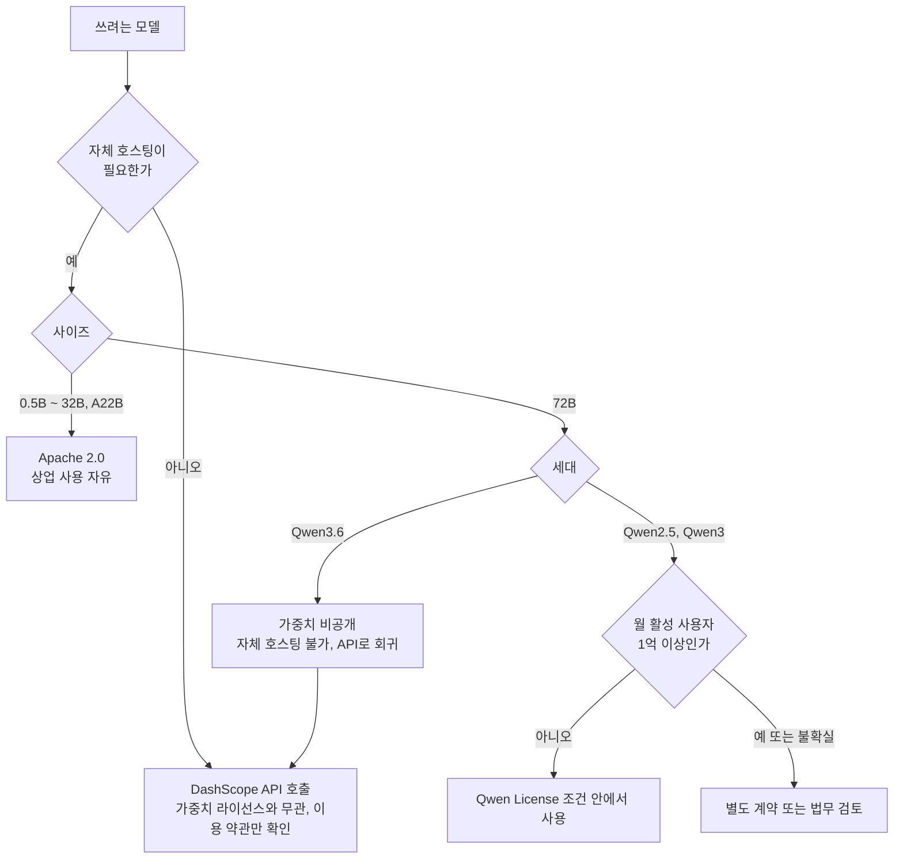
```mermaid
flowchart TD
    S["쓰려는 모델"] --> H{"자체 호스팅이<br/>필요한가"}
    H -->|"아니오"| API["DashScope API 호출<br/>가중치 라이선스와 무관, 이용 약관만 확인"]
    H -->|"예"| SZ{"사이즈"}
    SZ -->|"0.5B ~ 32B, A22B"| AP["Apache 2.0<br/>상업 사용 자유"]
    SZ -->|"72B"| G{"세대"}
    G -->|"Qwen2.5, Qwen3"| QL{"월 활성 사용자<br/>1억 이상인가"}
    QL -->|"아니오"| OK["Qwen License 조건 안에서 사용"]
    QL -->|"예 또는 불확실"| LG["별도 계약 또는 법무 검토"]
    G -->|"Qwen3.6"| NW["가중치 비공개<br/>자체 호스팅 불가, API로 회귀"]
    NW --> API
```

두 번 갈라지는 지점이 실제로 사고가 나는 자리다. 사이즈에서 72B로 빠졌는데 세대를 안 보면 "공개된 가중치겠지" 하고 Hugging Face를 뒤지다가 시간을 쓴다. Qwen3.6 72B는 받을 가중치가 아예 없다. 또 라이선스 표는 릴리스마다 바뀔 수 있어서 모델 카드의 `LICENSE` 파일을 받는 시점에 직접 읽어야 한다. 이 문서의 표는 작성 시점 기준이다.

Qwen License 조항을 더 자세히 읽어보면 "월 1억 MAU"라는 기준이 살짝 모호한 표현이 있다. 한국 시장만 보면 거의 모든 회사가 해당이 안 되는데, 글로벌 서비스라면 법무 검토를 받아두는 게 안전하다.

---

## 4. API 호출 방법

Qwen API는 두 가지 인터페이스를 제공한다. 알리바바 자체 SDK인 DashScope와, OpenAI 호환 엔드포인트다. 같은 모델을 둘 다로 호출할 수 있고, 응답 포맷도 거의 비슷하다. 실무에서는 OpenAI 호환 쪽을 더 자주 쓴다. 기존 OpenAI SDK 코드를 base URL만 바꿔서 쓸 수 있어서 마이그레이션이 쉽다.

여기에 자체 호스팅(vLLM)까지 합치면 클라이언트가 붙는 경로는 세 개다. 어느 경로든 클라이언트 쪽 코드는 OpenAI SDK 하나로 맞출 수 있는지가 첫 분기다.

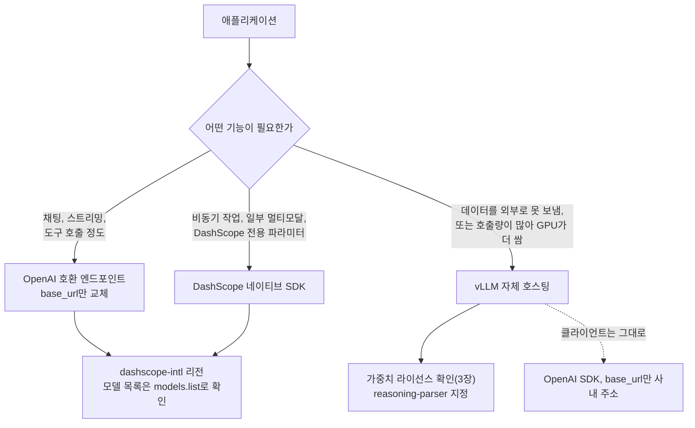
```mermaid
flowchart TD
    APP["애플리케이션"] --> D{"어떤 기능이 필요한가"}
    D -->|"채팅, 스트리밍,<br/>도구 호출 정도"| OAI["OpenAI 호환 엔드포인트<br/>base_url만 교체"]
    D -->|"비동기 작업, 일부 멀티모달,<br/>DashScope 전용 파라미터"| DS["DashScope 네이티브 SDK"]
    D -->|"데이터를 외부로 못 보냄,<br/>또는 호출량이 많아 GPU가 더 쌈"| SELF["vLLM 자체 호스팅"]
    OAI --> C1["dashscope-intl 리전<br/>모델 목록은 models.list로 확인"]
    DS --> C1
    SELF --> C2["가중치 라이선스 확인(3장)<br/>reasoning-parser 지정"]
    SELF -.->|"클라이언트는 그대로"| OAI2["OpenAI SDK, base_url만 사내 주소"]
```

OpenAI 호환 경로와 vLLM 경로는 클라이언트 코드가 같아서 개발 중에는 API로 붙이고 나중에 자체 호스팅으로 옮기는 일이 가능하다. 다만 `enable_thinking` 같은 Qwen 고유 파라미터는 경로마다 넘기는 위치가 다르다. DashScope 네이티브는 최상위 인자, OpenAI 호환은 `extra_body`, vLLM은 `chat_template_kwargs`로 넘긴다. 옮길 때 이 부분이 조용히 무시되는 게 가장 흔한 사고다.

### 4.1 OpenAI 호환 엔드포인트

```python
from openai import OpenAI

client = OpenAI(
    api_key="sk-xxxxxxxxxxxxxxxxxxxxxxxxxxxxxxxx",
    base_url="https://dashscope-intl.aliyuncs.com/compatible-mode/v1",
)

response = client.chat.completions.create(
    model="qwen3.6-27b-instruct",
    messages=[
        {"role": "system", "content": "당신은 백엔드 개발자입니다."},
        {"role": "user", "content": "FastAPI에서 미들웨어 실행 순서를 설명해주세요."},
    ],
    temperature=0.7,
    max_tokens=2048,
)

print(response.choices[0].message.content)
```

엔드포인트 URL이 두 종류다. `dashscope.aliyuncs.com`은 중국 본토 리전, `dashscope-intl.aliyuncs.com`은 싱가포르 리전이다. 한국에서 호출하면 본토 리전보다 지리적으로 가까운 intl 쪽이 왕복 시간이 짧다. 환경마다 차이가 나니 두 엔드포인트에 같은 요청을 몇 번 보내 직접 재 보면 되고, 특별한 이유가 없으면 intl로 붙는다.

리전마다 사용 가능한 모델 리스트가 다르다는 게 함정이다. 중국 본토에 깔린 신규 모델이 intl에는 1~2주 늦게 들어오는 경우가 많고, 일부 비전 모델은 intl 미지원인 적도 있었다. 모델 사용 가능 여부는 `client.models.list()`로 먼저 확인하는 습관을 들이는 게 낫다.

### 4.2 DashScope 네이티브 SDK

DashScope 고유 기능(예: 일부 멀티모달 모달리티, 비동기 작업)이 필요하면 네이티브 SDK를 써야 한다.

```python
import dashscope
from dashscope import Generation

dashscope.api_key = "sk-xxxxxxxxxxxxxxxxxxxxxxxxxxxxxxxx"
dashscope.base_http_api_url = "https://dashscope-intl.aliyuncs.com/api/v1"

response = Generation.call(
    model="qwen3.6-27b-instruct",
    messages=[
        {"role": "user", "content": "분산 락 구현 방법을 알려주세요."},
    ],
    result_format="message",
    enable_thinking=False,
)

print(response.output.choices[0].message.content)
```

`enable_thinking` 플래그가 OpenAI 호환 쪽에서는 표준 파라미터가 아니라 `extra_body`로 넘겨야 한다는 게 자주 빠지는 함정이다.

```python
response = client.chat.completions.create(
    model="qwen3.6-27b-instruct",
    messages=[...],
    extra_body={"enable_thinking": True},
)
```

### 4.3 자체 호스팅 시 vLLM 사용

Hugging Face 가중치를 받아서 vLLM으로 서빙하면 OpenAI 호환 서버가 자동으로 떨어진다.

```bash
vllm serve Qwen/Qwen3.6-27B-Instruct \
    --tensor-parallel-size 2 \
    --max-model-len 32768 \
    --enable-reasoning \
    --reasoning-parser qwen3
```

`--reasoning-parser qwen3` 옵션이 핵심이다. 이걸 안 주면 `<think>` 블록이 그대로 응답에 섞여 나오고, 클라이언트가 reasoning과 최종 답변을 분리하지 못한다. 이 파서가 없는 구버전 vLLM이 있어서 `vllm serve --help`에 `qwen3`가 나오는지 먼저 본다. 버전에 따라 `--enable-reasoning` 플래그가 이미 제거됐을 수도 있으니 도움말에 없으면 빼고 `--reasoning-parser`만 준다.

GPU 메모리 계산은 파라미터 수 × 바이트 수가 출발점이다. 27B bf16이면 가중치만 약 54GB, 4bit 양자화면 그 4분의 1 수준인 14~16GB 정도다. 여기에 KV 캐시와 활성화 메모리가 별도로 붙기 때문에 40GB 카드 한 장에 양자화 버전은 올라가도, bf16은 80GB급(A100 80GB, H100)이 있어야 컨텍스트를 길게 잡을 여유가 생긴다. 서빙 옵션과 튜닝은 [Qwen vLLM 자체 호스팅](Qwen_Self_Hosting_v_LLM.md)에서 이어진다.

---

## 5. Reasoning 모드 동작 방식

Qwen3부터 도입된 reasoning 모드는 모델 가중치 자체에 추론 동작이 학습된 결과다. DeepSeek-R1처럼 별도 모델로 분리한 게 아니라 같은 가중치에서 토글로 동작한다.

켰을 때 응답 구조는 이렇게 생겼다.

```
<think>
사용자가 분산 락 구현을 물었다. 옵션은 세 가지다.
1. Redis SETNX 기반 - 단순하지만 fencing token 필요
2. Redlock - 분산 환경에서 안전하지만 논쟁이 있음
3. Zookeeper/etcd - 강한 일관성이지만 인프라 부담

먼저 사용 환경부터 확인해야 한다...
</think>

분산 락을 구현하는 방법은 크게 세 가지가 있습니다...
```

`<think>` 블록은 사용자에게 노출하지 않는 게 일반적이다. 토큰은 청구되지만 최종 답변 품질을 위한 내부 사고 과정이다.

### 5.1 요청 하나가 거치는 경로

토글 한 번으로 모델이 생성하는 토큰 구성이 달라진다. 아래 시퀀스에서 켠 쪽은 최종 답변 앞에 사고 토큰이 한 덩어리 더 생성되는 것을 본다.

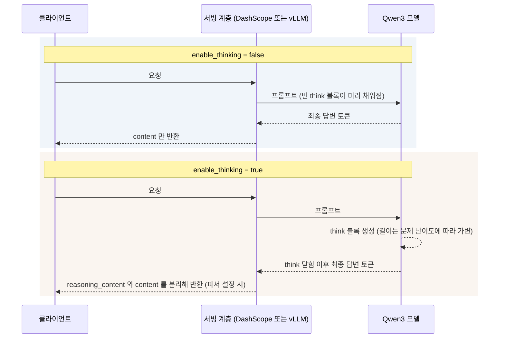
```mermaid
sequenceDiagram
    participant C as 클라이언트
    participant S as 서빙 계층 (DashScope 또는 vLLM)
    participant M as Qwen3 모델

    rect rgb(240, 245, 250)
    Note over C,M: enable_thinking = false
    C->>S: 요청
    S->>M: 프롬프트 (빈 think 블록이 미리 채워짐)
    M-->>S: 최종 답변 토큰
    S-->>C: content 만 반환
    end

    rect rgb(250, 245, 240)
    Note over C,M: enable_thinking = true
    C->>S: 요청
    S->>M: 프롬프트
    M-->>M: think 블록 생성 (길이는 문제 난이도에 따라 가변)
    M-->>S: think 닫힘 이후 최종 답변 토큰
    S-->>C: reasoning_content 와 content 를 분리해 반환 (파서 설정 시)
    end
```

켜진 경로에서 사고 토큰은 입출력 토큰으로 똑같이 과금되고, 최종 답변의 첫 글자가 나오기 전에 모델이 사고 토큰을 먼저 다 뱉어야 한다. 스트리밍으로 받으면 `reasoning_content` 델타가 먼저 흐르고 `content` 델타가 나중에 시작된다. 사용자 입장에서는 한동안 아무 글자도 안 보이다가 답이 나오는 모양이 된다. 파서 설정이 빠진 vLLM이면 이 구분이 없어서 `content` 앞쪽에 사고 내용이 통째로 섞인다.

| 항목 | 끔 | 켬 |
|------|----|----|
| 생성 토큰 | 답변 분량만 | 사고 토큰 + 답변. 단순 질문에서도 몇 배가 되는 경우가 있다 |
| 첫 글자까지 시간 | 짧다 | 사고가 끝날 때까지 `content`가 비어 있다 |
| 전체 응답 시간 | 답변 길이에 비례 | 사고 길이만큼 추가 |
| 비용 | 답변 분량 | 사고 분량 포함, 예측이 어렵다 |
| 출력 형식 강제 | 잘 지켜진다 | 가끔 무너진다 |

켰을 때 몇 배가 되는지는 프롬프트와 모델 크기에 따라 다르다. 같은 프롬프트 세트를 끄고 켜서 두 번 돌려 `usage`를 비교하는 스크립트를 먼저 만들어 두면 이후 판단이 쉬워진다.

```python
def thinking_cost(client, model, prompts):
    rows = []
    for p in prompts:
        r = {}
        for flag in (False, True):
            res = client.chat.completions.create(
                model=model,
                messages=[{"role": "user", "content": p}],
                max_tokens=8192,
                extra_body={"enable_thinking": flag},
                stream=True,
                stream_options={"include_usage": True},
            )
            usage = None
            for chunk in res:
                if chunk.usage:
                    usage = chunk.usage
            r[flag] = usage.completion_tokens
        rows.append((p[:30], r[False], r[True]))
    return rows
```

스트리밍으로 돌리는 이유가 있다. 모델과 리전에 따라 thinking을 켠 비스트리밍 호출을 막아 두는 경우가 있어서다. 또 같은 코드로 vLLM에 붙일 때는 `extra_body={"chat_template_kwargs": {"enable_thinking": flag}}`로 바꿔야 한다. 프롬프트 안에서 `/think`, `/no_think` 문구로 턴마다 바꾸는 방법도 Qwen3 계열에 있는데, 시스템 프롬프트 규칙과 부딪히면 어느 쪽이 이길지 예측이 어려워서 API 파라미터를 우선한다.

### 5.2 system 프롬프트 설계에서 걸리는 점

reasoning 모드에서는 system 프롬프트의 지시사항을 모델이 추론 과정에서 재해석하는 경향이 있다. 형식 강제(예: "JSON만 출력")는 reasoning 모드에서 가끔 무너진다. 출력 형식이 엄격히 정해진 작업이면 reasoning을 끄거나 응답 후처리로 잡아주는 게 안전하다.

비용 측면에서 reasoning을 켠 응답은 예상보다 길어진다. 단순 질문에 켜 놓으면 200토큰이면 끝날 답에 사고 토큰이 몇 배로 붙기도 한다. 그래서 요청 단위로 토글해서 쓰는 쪽이 맞고, UI가 있다면 reasoning 블록을 접어서 보여주는 식의 처리가 필요하다.

### 5.3 토글 판단

작업 유형마다 켜고 끄는 기준을 분기로 놓으면 이렇다. 위에서부터 걸리는 조건대로 내려간다.

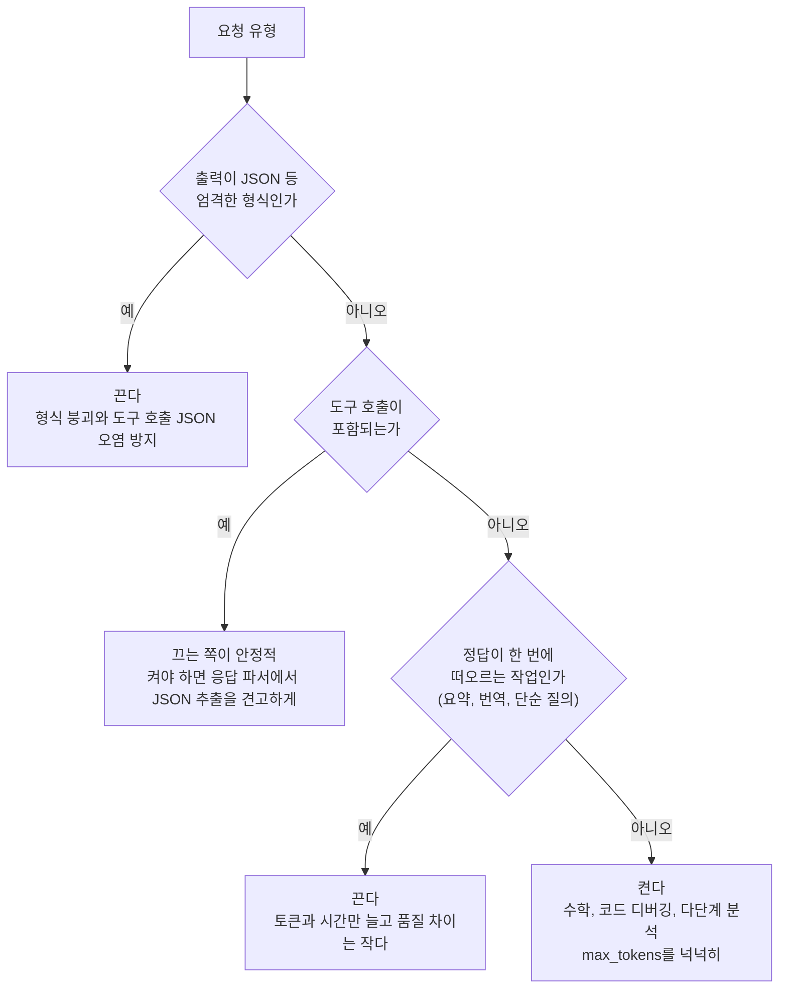
```mermaid
flowchart TD
    A["요청 유형"] --> F{"출력이 JSON 등<br/>엄격한 형식인가"}
    F -->|"예"| OFF1["끈다<br/>형식 붕괴와 도구 호출 JSON 오염 방지"]
    F -->|"아니오"| T{"도구 호출이<br/>포함되는가"}
    T -->|"예"| OFF2["끄는 쪽이 안정적<br/>켜야 하면 응답 파서에서 JSON 추출을 견고하게"]
    T -->|"아니오"| K{"정답이 한 번에<br/>떠오르는 작업인가<br/>(요약, 번역, 단순 질의)"}
    K -->|"예"| OFF3["끈다<br/>토큰과 시간만 늘고 품질 차이는 작다"]
    K -->|"아니오"| ON["켠다<br/>수학, 코드 디버깅, 다단계 분석<br/>max_tokens를 넉넉히"]
```

도구 호출 노드에서 켜지 말라고 한 이유는 §8.4에서 다시 다룬다. reasoning이 켜진 상태에서는 도구 호출 JSON 직전에 자연어가 끼는 경우가 종종 있다. 도구 호출이 많은 에이전트에서 정말로 사고가 필요한 단계가 있다면, 계획 수립 요청은 켜고 실제 도구 호출 요청은 끄는 식으로 요청을 둘로 쪼갠다.

---

## 6. 한국어 처리 특성

Qwen 토크나이저는 tiktoken 스타일 BPE를 쓰는데, 한글이 들어간 어휘가 vocab에 상당수 포함돼 있다. 같은 한국어 문장이 모델마다 토큰 몇 개로 쪼개지는지가 다르고, 이 차이가 곧 같은 컨텍스트 길이에 담기는 문서량과 API 입력 비용 차이로 이어진다. Llama 3 계열과 비교하면 Qwen 쪽이 토큰을 덜 쓰는 경향이 있다. 얼마나 덜 쓰는지는 텍스트 종류(일상 대화, 법률 문서, 코드 섞인 문서)에 따라 달라서 일반론으로 숫자를 말하기 어렵다. 자기 데이터로 재는 게 정확하다.

```python
from transformers import AutoTokenizer

samples = open("sample_ko.txt", encoding="utf-8").read().split("\n\n")
for name in ["Qwen/Qwen3-8B", "meta-llama/Llama-3.1-8B"]:
    tok = AutoTokenizer.from_pretrained(name)
    total = sum(len(tok.encode(s)) for s in samples)
    chars = sum(len(s) for s in samples)
    print(f"{name}: {total} 토큰, 글자당 {total / chars:.2f}")
```

Llama 쪽은 Hugging Face 접근 승인이 필요하고, 실제 서비스 문서 수십 건을 `sample_ko.txt`에 넣고 돌리면 된다. 글자당 토큰 비율이 곧 컨텍스트 효율이다. 한국어 문서 검색이나 긴 코드 리뷰처럼 입력이 긴 작업에서는 이 비율 차이가 같은 32K 컨텍스트의 실효 정보량을 가른다.

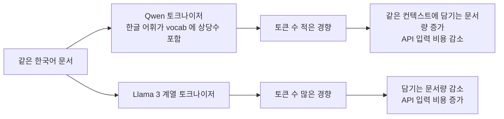
```mermaid
flowchart LR
    TXT["같은 한국어 문서"] --> QT["Qwen 토크나이저<br/>한글 어휘가 vocab 에 상당수 포함"]
    TXT --> LT["Llama 3 계열 토크나이저"]
    QT --> QN["토큰 수 적은 경향"]
    LT --> LN["토큰 수 많은 경향"]
    QN --> EFF["같은 컨텍스트에 담기는 문서량 증가<br/>API 입력 비용 감소"]
    LN --> EFF2["담기는 문서량 감소<br/>API 입력 비용 증가"]
```

위 흐름에서 갈리는 지점은 토큰 수 하나이고, 그 차이가 컨텍스트와 비용 양쪽으로 번진다.

품질 측면에서는 몇 가지 특징이 있다.

존댓말과 반말 일관성은 모델 사이즈에 따라 갈린다. 14B 이하에서는 system 프롬프트에 "존댓말로 답하세요"를 명시해도 중간에 반말이 섞여 나오는 경우가 있다. 27B 이상부터는 거의 안정적이다.

한자어 비중이 높은 법률·의료 문서에서 강점이 있다. 중국어 학습 데이터 비중이 크다 보니 한자 기반 전문 용어 인식이 Llama보다 정확하다. 다만 외래어 표기는 영문을 그대로 쓰는 경향이 있어서 "API"를 "API"로 쓰지 "에이피아이"로 쓰지는 않는다.

번역 작업에서 한↔중은 GPT-4o에 근접하는 품질이 나오고, 한↔영은 GPT-4o 대비 약간 떨어진다. 동남아 언어(베트남어, 태국어)는 의외로 Qwen 쪽이 더 안정적인 결과를 내는데, 알리바바가 동남아 시장을 적극 공략하면서 학습 데이터를 늘린 영향으로 보인다.

한국어 fine-tuning을 따로 하지 않아도 쓸 만한 수준이다. 도메인 특화가 필요하면 전체 파라미터 학습보다 LoRA부터 시도한다. 얼마나 오르는지는 데이터 품질과 평가 기준에 따라 크게 갈려서 일반적인 숫자를 믿기 어렵고, 학습 전에 도메인 평가셋(수십~수백 건)을 먼저 만들어 베이스 모델 점수를 재 두어야 학습 후 개선폭을 말할 수 있다. 학습 설정과 평가 방법은 [Qwen Fine-tuning](Qwen_Fine_Tuning.md)에 정리했다.

---

## 7. 다른 오픈소스 LLM과의 비교

실무에서 모델 선택 기준은 사이즈/라이선스/품질/추론 속도 네 가지다. 같은 구간에서 비교한다.

아래 표들의 결론을 워크로드 기준으로 먼저 요약하면 이렇다. 세부 수치는 각 절의 표에서 확인한다.

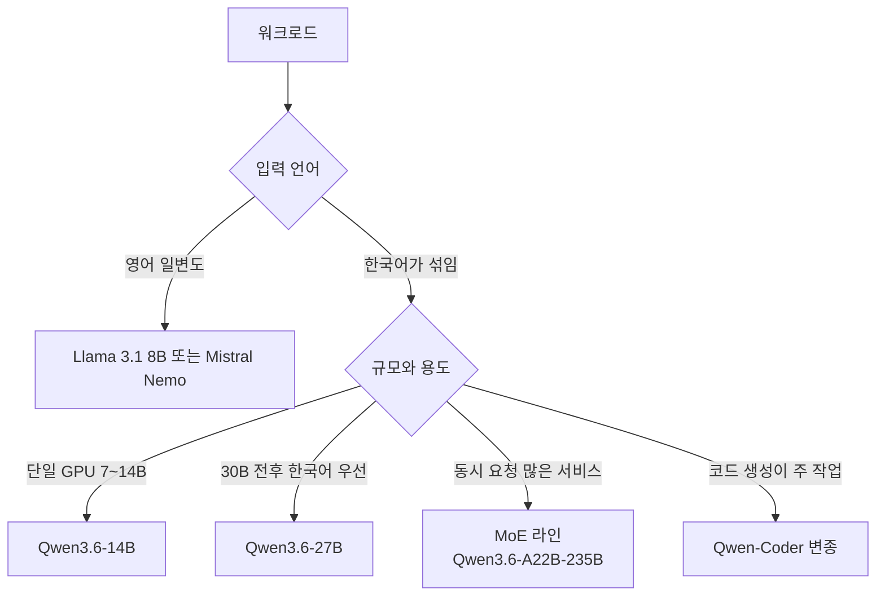
```mermaid
flowchart TD
    W["워크로드"] --> L{"입력 언어"}
    L -->|"영어 일변도"| EN["Llama 3.1 8B 또는 Mistral Nemo"]
    L -->|"한국어가 섞임"| KO{"규모와 용도"}
    KO -->|"단일 GPU 7~14B"| Q14["Qwen3.6-14B"]
    KO -->|"30B 전후 한국어 우선"| Q27["Qwen3.6-27B"]
    KO -->|"동시 요청 많은 서비스"| MOE["MoE 라인<br/>Qwen3.6-A22B-235B"]
    KO -->|"코드 생성이 주 작업"| CODER["Qwen-Coder 변종"]
```

### 7.1 30B 전후 dense 모델

| 항목 | Qwen3.6-27B | Llama 3.3 70B (Q4) | DeepSeek-V3 (A37B MoE) | Mistral Large 2 |
|------|------------|---------------------|------------------------|-----------------|
| 라이선스 | Apache 2.0 | Llama 3 Community | MIT | Mistral Research/Commercial |
| 컨텍스트 | 32K (131K with YaRN) | 128K | 64K | 128K |
| 한국어 품질 | 상 | 중 | 중상 | 중 |
| 코드 품질 | 중상 | 중 | 상 | 중상 |
| reasoning 모드 | 내장 토글 | 없음 | DeepSeek-R1 별도 | 없음 |
| 자체 호스팅 VRAM | 54GB (bf16) | 40GB (Q4) | 670GB (full) | 240GB (full) |

한국어 워크로드가 우선이면 Qwen3.6-27B가 첫 선택이다. Llama 3.3 70B를 Q4 양자화로 띄우면 메모리는 비슷한데 한국어 품질이 떨어진다. DeepSeek-V3는 품질은 좋지만 self-host가 사실상 불가능한 사이즈고, API로 가야 한다.

### 7.2 7~14B 구간

이 구간이 실무에서 가장 많이 쓰인다. 단일 GPU에서 돌고 추론 속도도 빠르다.

| 항목 | Qwen3.6-14B | Llama 3.1 8B | Mistral Nemo 12B | Gemma 2 9B |
|------|------------|--------------|------------------|------------|
| 라이선스 | Apache 2.0 | Llama 3 Community | Apache 2.0 | Gemma License |
| 한국어 품질 | 중상 | 중하 | 중 | 중 |
| 영어 품질 | 중상 | 상 | 상 | 상 |
| 코드 품질 | 중 | 중하 | 중 | 중 |
| 다국어 학습 비중 | 큼 | 작음 | 중 | 중 |

영어 일변도면 Llama 3.1 8B나 Mistral Nemo가 더 낫다. 한국어가 섞인 워크로드면 Qwen3.6-14B로 가는 게 안정적이다. Gemma 2는 라이선스 조항이 까다로워서 회사 법무 통과가 어렵다.

### 7.3 MoE 라인

MoE는 dense보다 추론 처리량이 좋아서 동시 요청이 많은 서비스에 쓴다.

| 항목 | Qwen3.6-A22B-235B | DeepSeek-V3 (A37B-671B) | Mixtral 8x22B (A39B) |
|------|-------------------|--------------------------|-----------------------|
| 라이선스 | Apache 2.0 | MIT | Apache 2.0 |
| 활성 파라미터 | 22B | 37B | 39B |
| 전체 파라미터 | 235B | 671B | 141B |
| VRAM (full) | 470GB | 1.3TB | 280GB |
| 추론 처리량 | 상 | 중 | 상 |

자체 호스팅 가능 여부가 가장 큰 변수다. Qwen3.6-A22B-235B는 H100 8장 노드 하나면 올라가는데, DeepSeek-V3는 두 노드 이상이 필요하다. 회사에서 LLM 인프라를 구성한다면 이 차이가 운영 비용에 큰 영향을 준다.

### 7.4 코딩 특화

Qwen-Coder, DeepSeek-Coder, Codestral이 직접 경쟁한다.

| 항목 | Qwen2.5-Coder-32B | DeepSeek-Coder-V2-Lite (A2.4B-16B) | Codestral 22B |
|------|-------------------|--------------------------------------|---------------|
| HumanEval | 92.7 | 81.1 | 81.1 |
| 컨텍스트 | 32K | 128K | 32K |
| FIM 지원 | O | O | O |
| 라이선스 | Apache 2.0 | DeepSeek License | Mistral Non-Production |

HumanEval 수치는 Qwen 팀이 발표한 값이고([Qwen2.5-Coder Technical Report](https://arxiv.org/abs/2409.12186)) 직접 재현한 값이 아니다. 비교 모델 점수도 같은 조건으로 돌린 결과인지는 논문 표에서 확인해야 한다. 벤치마크 점수만 보면 Qwen2.5-Coder-32B가 가장 높지만, 실제로 IDE에 붙여서 써보면 차이가 그렇게 극적이지 않다. FIM(fill-in-the-middle) 응답 latency는 DeepSeek 쪽이 빠르고, 긴 컨텍스트 처리에서는 DeepSeek-Coder-V2가 유리하다. Codestral은 라이선스 때문에 프로덕션 도입이 막혀서 보통 후보에서 빠진다.

---

## 8. 실무에서 자주 마주치는 함정

### 8.1 chat template 누락

Qwen은 ChatML 변종을 쓴다. `<|im_start|>`, `<|im_end|>` 특수 토큰이 있고, system/user/assistant 롤이 명시된다. Hugging Face에서 받은 가중치를 vLLM이나 llama.cpp로 변환할 때 chat template가 누락되면 모델이 입력을 이해 못하고 이상한 응답을 뱉는다.

특히 GGUF 변환 직후에 `apply_chat_template`이 빈 문자열을 반환하면 거의 100% 이 문제다. `tokenizer_config.json`의 `chat_template` 필드를 확인하고, 비어 있으면 Qwen 공식 저장소에서 가져와서 채워야 한다.

8.1과 8.3은 증상이 다르지만 둘 다 변환·토크나이저 단계에서 생기므로, 증상부터 보고 갈래를 타면 된다.

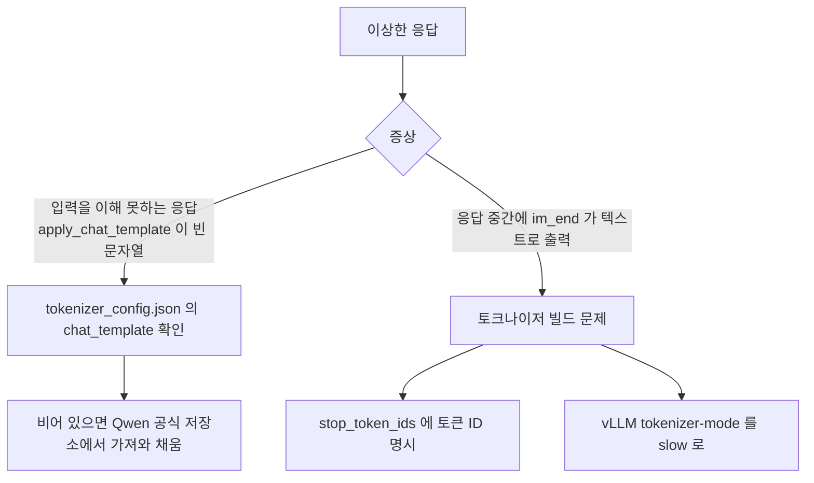
```mermaid
flowchart TD
    S["이상한 응답"] --> Q{"증상"}
    Q -->|"입력을 이해 못하는 응답<br/>apply_chat_template 이 빈 문자열"| T1["tokenizer_config.json 의 chat_template 확인"]
    T1 --> T2["비어 있으면 Qwen 공식 저장소에서 가져와 채움"]
    Q -->|"응답 중간에 im_end 가 텍스트로 출력"| K1["토크나이저 빌드 문제"]
    K1 --> K2["stop_token_ids 에 토큰 ID 명시"]
    K1 --> K3["vLLM tokenizer-mode 를 slow 로"]
```

### 8.2 reasoning 모드 토큰 폭주

reasoning을 켜고 system 프롬프트에 "단계별로 설명해줘" 같은 지시까지 넣으면 모델이 사고 블록 안에서 한 번, 답변에서 한 번 단계를 풀어서 응답 토큰이 크게 늘어난다. max_tokens 제한을 안 걸어두면 청구 토큰이 예상을 한참 넘는다. 반대로 max_tokens를 너무 낮게 잡으면 사고 도중에 잘려서 `content`가 빈 채로 `finish_reason`이 `length`로 끝나는 일이 생긴다. reasoning 모드에서는 5.1의 측정 스크립트로 자기 작업의 사고 토큰 분포를 본 뒤 그 상위 구간에 맞춰 max_tokens를 잡고, system 프롬프트에서 추론 방식 지시는 빼는 게 낫다.

max_tokens를 어느 쪽으로 잘못 잡느냐에 따라 증상이 정반대로 나온다. 아래 흐름에서 두 갈래의 끝을 비교해 본다.

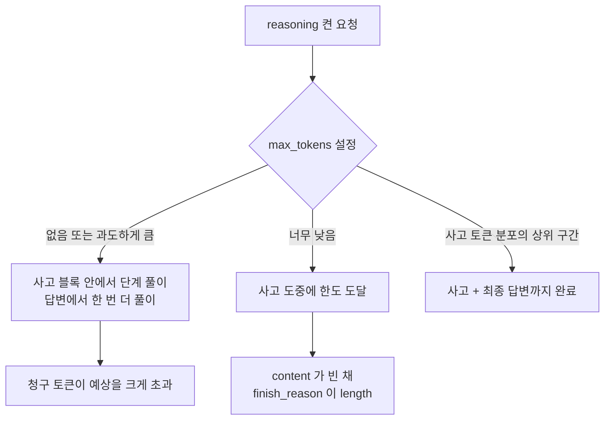
```mermaid
flowchart TD
    R["reasoning 켠 요청"] --> MT{"max_tokens 설정"}
    MT -->|"없음 또는 과도하게 큼"| BIG["사고 블록 안에서 단계 풀이<br/>답변에서 한 번 더 풀이"]
    BIG --> COST["청구 토큰이 예상을 크게 초과"]
    MT -->|"너무 낮음"| LOW["사고 도중에 한도 도달"]
    LOW --> EMPTY["content 가 빈 채<br/>finish_reason 이 length"]
    MT -->|"사고 토큰 분포의 상위 구간"| OK["사고 + 최종 답변까지 완료"]
```

### 8.3 한국어 stop token 깨짐

특수 토큰을 BPE 합치는 과정에서 종종 문제가 생긴다. 응답 중간에 `<|im_end|>`가 그대로 텍스트로 나오면 토크나이저 빌드가 잘못된 거다. 이때는 stop_token_ids에 명시적으로 토큰 ID를 박아주거나, vLLM의 경우 `--tokenizer-mode auto`가 아니라 `slow`로 띄워야 해결되는 경우가 있다.

### 8.4 함수 호출 JSON 깨짐

reasoning 모드 활성화 상태에서 function calling을 시키면 JSON 직전에 `</think>` 토큰이 빠지거나, JSON 안에 자연어가 섞이는 일이 가끔 있다. function calling이 필요한 워크로드에서는 reasoning을 끄는 게 안전하다. 굳이 둘 다 켜야 한다면 응답 파서에서 JSON 추출 로직을 견고하게 짜야 한다.

### 8.5 DashScope intl 리전 모델 누락

새로 발표된 모델이 며칠~몇 주 동안 intl 리전에서 호출이 안 되는 경우가 있다. 공식 발표에는 "available now"라고 떠 있어도 intl 엔드포인트로 호출하면 `Model not found` 에러가 떨어진다. 이때는 `https://dashscope.console.aliyun.com/`에서 intl 리전 모델 카탈로그를 직접 확인하거나, 본토 리전으로 우회해야 한다. 본토 리전은 한국에서 호출하면 왕복 거리가 길어져 latency가 늘고, 서비스 구간에서 쓰기엔 부담이 된다.

---

## 9. 정리

Qwen을 도입할지 판단할 때 실제로 갈리는 조건은 네 가지다. 순서대로 확인하면 된다.

가중치를 직접 받아 서빙해야 하는지가 처음이다. 그렇다면 3장 흐름도대로 사이즈와 세대를 보고, 72B는 후보에서 뺀다. 자체 호스팅이 필요 없으면 라이선스 걱정 없이 API로 가고, 이때 한국에서는 intl 리전과 `models.list` 확인이 선행된다.

다음은 입력 언어와 길이다. 한국어·중국어 문서가 길게 들어가는 작업이면 같은 컨텍스트에 담기는 양이 다르니 자기 데이터로 토큰 비율을 재 보고 Llama 계열과 비교한다. 영어 일변도 서비스면 Qwen을 고를 근거가 약하다.

세 번째는 reasoning 토글이다. 형식이 엄격하거나 도구 호출이 끼면 끄고, 수학·디버깅·다단계 분석이면 켠다. 켜는 요청에는 max_tokens를 넉넉히 주고 사고 토큰 분포를 로그로 남겨 둔다. 비용은 대부분 여기서 새 나간다.

마지막은 서빙 비용이다. MoE는 연산량이 active 기준이라 동시 요청이 많을 때 이득이고, 메모리는 total 기준이라 요청이 적으면 손해다. 요청량을 재 보기 전에 A22B 노드를 먼저 구성하지 않는다.

세대는 새 프로젝트면 Qwen3.6, 이미 Qwen2.5 위에서 fine-tuning 자산이 있으면 그대로 두고, 코드 생성이 주 작업이면 Coder 변종을 쓴다. 후속 문서는 다음 순서로 읽는다.

| 지금 막힌 지점 | 문서 |
|---------------|------|
| 도구 호출 JSON이 깨지거나 Agent 루프를 만든다 | [Qwen 도구 호출과 Agent](Qwen_Tool_Calling_Agent.md) |
| RAG 검색 품질을 올린다 | [Qwen Embedding과 Reranker](Qwen_Embedding_Reranker.md) |
| 자체 서빙 옵션과 GPU 구성을 정한다 | [Qwen vLLM 자체 호스팅](Qwen_Self_Hosting_v_LLM.md) |
| 도메인 데이터로 학습한다 | [Qwen Fine-tuning](Qwen_Fine_Tuning.md) |
| 양자화 빌드를 로컬에서 돌린다 | [Unsloth Qwen3 GGUF 로컬 구동](../Concepts/Unsloth_Qwen3_GGUF.md) |
