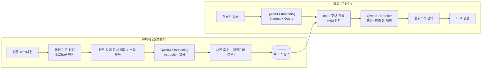
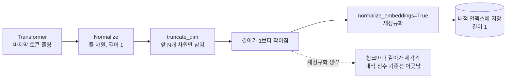
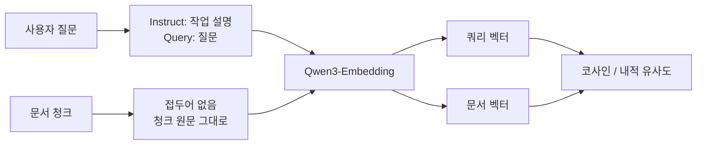
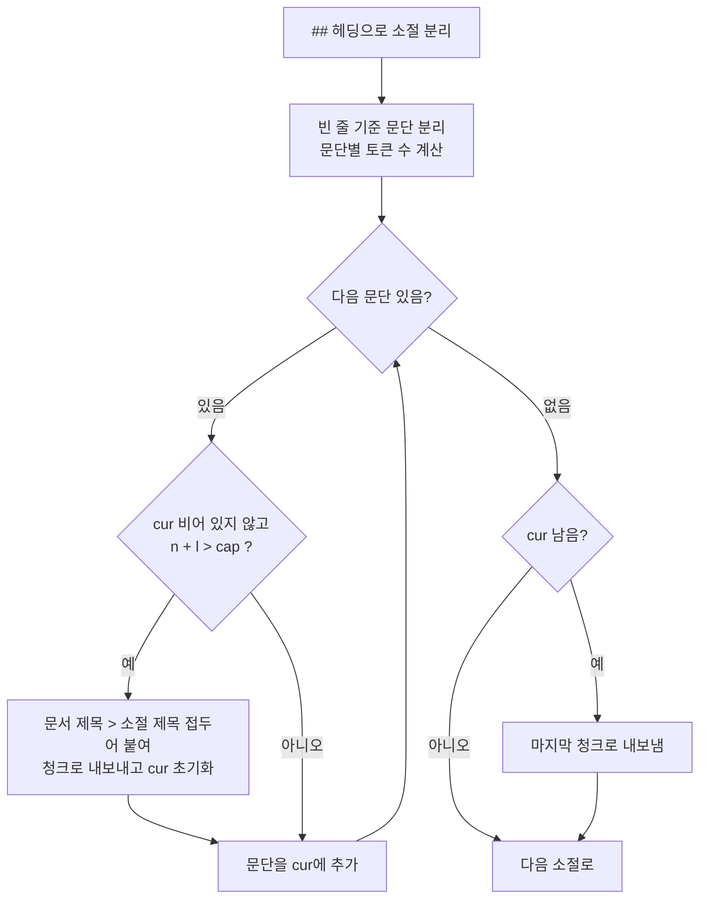
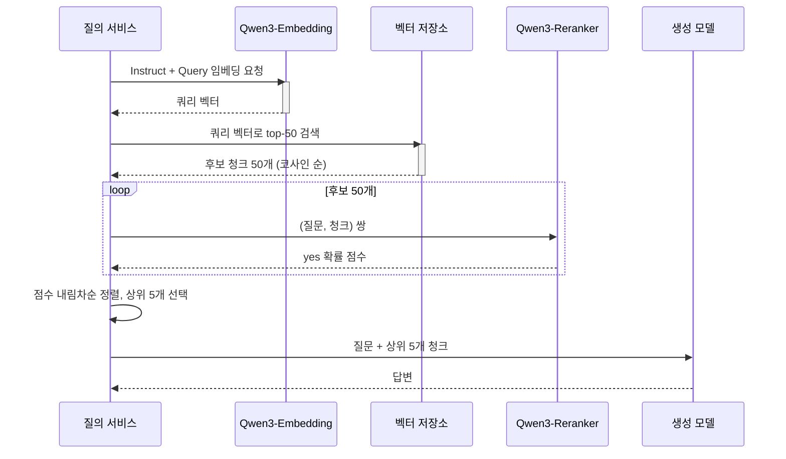
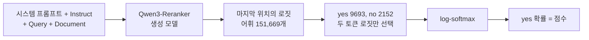

# Qwen3-Embedding과 Reranker를 RAG에 붙이기

Qwen3-Embedding은 모델만 바꿔 끼우면 되는 임베딩이 아니다. 쿼리 쪽에만 instruction을 붙여야 하고, 차원을 줄일 때 다시 정규화해야 하고, 서빙 런타임마다 이 두 가지를 알아서 해 주는 정도가 다르다. 어느 쪽을 빼먹어도 에러는 안 나고 검색 결과만 조금씩 나빠진다. 이 문서는 그 지점과, 한국어 문서를 청킹할 때 토큰 길이를 어떻게 봐야 하는지를 다룬다.

먼저 확인 범위를 밝혀 둔다. 이 문서를 쓴 환경에는 GPU가 없고 디스크가 가득 차 있어서 PyTorch를 설치하지 못했다. Qwen3-Embedding과 Reranker 모델은 한 번도 로드하지 못했다. 그래서 검색 정확도(recall, MRR)나 지연 시간 수치는 이 문서에 하나도 없다. 직접 돌린 것은 두 가지다.

- Qwen3-Embedding-0.6B와 bge-m3의 `tokenizer.json`을 `tokenizers`로 불러서, 이 저장소의 한국어 문서 1,274개를 토큰으로 센 결과
- 같은 문서를 아래 청커로 잘라서 얻은 청크 개수와 토큰 분포

나머지는 읽은 것이다. 모델 카드와 `config.json`, `config_sentence_transformers.json`, sentence-transformers 6.1.0 소스, vLLM main 브랜치의 문서와 소스를 읽었고, 그 내용은 출처를 밝히고 "소스상 그렇게 읽힌다"는 식으로 구분해서 적었다. 정확도 비교는 마지막 절의 스크립트를 자기 코퍼스에 돌려서 확인하면 된다.

측정에 쓴 코퍼스는 한국어 기술 문서이고 영어 용어가 많이 섞여 있다. 코드 블록과 표는 뺐다. 다른 도메인에서는 숫자가 달라진다.

## 전체 흐름

문서를 청크로 잘라 벡터로 만들어 저장하는 인덱싱과, 질문이 들어왔을 때 검색하고 재순위한 뒤 생성하는 질의 경로는 쓰는 모델과 입력 형식이 다르다. 임베딩 모델은 양쪽에서 쓰이지만 문서 쪽에는 instruction이 없고 쿼리 쪽에만 있다.



그림에서 `Qwen3-Embedding`이 두 번 나오는 이유가 이 문서의 절반이다. 같은 모델이 문서 쪽과 쿼리 쪽에서 입력 형식이 다르고, 차원 축소는 양쪽에 똑같이 적용해야 한다.

## 사이즈와 차원 선택

세 모델의 구조는 `config.json`에서 읽은 값이다.

| 모델 | 레이어 | hidden_size(=기본 출력 차원) | 출력 차원 지정 범위 | 컨텍스트(모델 카드) |
|---|---|---|---|---|
| Qwen3-Embedding-0.6B | 28 | 1024 | 32 ~ 1024 | 32K |
| Qwen3-Embedding-4B | 36 | 2560 | 32 ~ 2560 | 32K |
| Qwen3-Embedding-8B | 36 | 4096 | 32 ~ 4096 | 32K |

Reranker는 0.6B, 4B, 8B가 있고 `config.json` 기준으로 0.6B가 hidden 1024에 28레이어, 4B가 hidden 2560에 36레이어다. 벡터를 내지 않으니 차원 개념이 없다.

세 모델 모두 `Qwen3ForCausalLM` 아키텍처로 올라온다. 디코더 모델의 마지막 토큰 hidden state를 풀링해서 벡터로 쓰는 구조(`1_Pooling/config.json`에 `pooling_mode_lasttoken: true`)라서, BERT 계열 임베딩과 입력 처리가 다르다. 이 차이가 뒤의 instruction과 EOS 절에서 문제가 된다.

가중치 메모리는 bf16이면 파라미터 수 곱하기 2바이트로 어림하면 0.6B가 1.2GB, 4B가 8GB, 8B가 16GB 안팎이다. 활성값과 KV 캐시는 별도다. 크기 선택은 대략 이렇게 갈린다.

- 0.6B: 임베딩 서버를 CPU나 작은 GPU 한 장에 같이 올려야 할 때. 청크가 수만 개 수준이면 인덱싱 시간도 문제되지 않는다.
- 4B: 리랭커를 따로 두지 않고 임베딩 품질로 버티려 할 때 고려한다. 벡터가 2560차원이라 저장소 비용이 같이 커진다.
- 8B: 쿼리도 같은 8B로 임베딩해야 하므로 모델 크기가 온라인 요청 경로에 그대로 들어온다. 인덱싱만 오프라인에서 8B로 하고 쿼리는 작은 모델로 하는 조합은 안 된다.

"큰 모델이 더 좋다"는 모델 카드 벤치마크로는 사실이지만, 그 수치는 한국어 코퍼스에서 내가 돌린 값이 아니어서 여기 옮기지 않는다. 모델 카드의 MTEB 표는 [Qwen/Qwen3-Embedding-0.6B](https://huggingface.co/Qwen/Qwen3-Embedding-0.6B)에서 볼 수 있다. 크기를 정하려면 자기 질문 100~200개로 0.6B와 4B를 같은 조건에서 돌려 보는 편이 빠르다.

### 저장소 용량

이 저장소의 한국어 문서를 아래 청커로 자르면 청크가 15,933개 나온다. 이 개수로 계산한 벡터 용량이다(float32는 4바이트, int8은 1바이트, 인덱스 오버헤드 제외).

| 차원 | float32 | int8 |
|---|---|---|
| 4096 | 261MB | 65MB |
| 2560 | 163MB | 41MB |
| 1024 | 65MB | 16MB |
| 512 | 33MB | 8MB |
| 256 | 16MB | 4MB |

청크 1.6만 개에서는 8B 벡터를 전부 메모리에 올려도 261MB다. 차원 축소가 의미 있는 규모는 청크가 수천만 개 이상일 때다. 1.6만 개짜리 인덱스에서 차원을 줄여 얻는 이득은 거의 없고, 줄이면 잃을 수 있는 것만 생긴다.

## Matryoshka 차원 축소

Qwen3-Embedding은 MRL(Matryoshka Representation Learning)로 학습돼서, 벡터 앞쪽 N개 차원만 잘라 써도 의미가 유지되도록 만들어져 있다. 모델 카드 표에 `MRL Support: Yes`로 나오고 0.6B는 32~1024 사이 임의 차원을 지원한다고 적혀 있다.

### 자른 뒤 다시 정규화해야 한다

sentence-transformers에서는 `truncate_dim`을 주면 된다. 그런데 이 모델의 `modules.json`은 Transformer, Pooling, Normalize 순서다. 정규화가 풀 차원에서 먼저 일어나고, 그 결과를 잘라내면 벡터 길이가 1보다 작아진다. 6.1.0 소스(`sentence_transformer/model.py`)의 `encode`를 읽으면 `truncate_dim` 처리가 945번째 줄 부근이고, `normalize_embeddings` 처리가 969번째 줄 부근이라 잘라낸 다음에야 정규화가 걸린다. `normalize_embeddings=True`를 같이 줘야 길이가 1로 돌아온다.

아래 그림에서 모듈 안의 Normalize가 자르기보다 앞에 있다는 점을 보면 된다. 자르기 뒤에 정규화를 한 번 더 거쳐야 길이가 1이 된다.



```python
from sentence_transformers import SentenceTransformer

model = SentenceTransformer("Qwen/Qwen3-Embedding-0.6B", truncate_dim=256)

docs = model.encode(chunks, normalize_embeddings=True, batch_size=32)
q = model.encode(["카프카 컨슈머 리밸런싱 중 중복 소비 막는 방법"],
                 prompt_name="query", normalize_embeddings=True)
```

코사인 유사도만 쓰는 저장소는 길이가 달라도 결과가 같아서 이걸 빼먹어도 티가 안 난다. 내적(inner product) 인덱스가 문제다. pgvector의 `<#>`나 Faiss `IndexFlatIP`는 길이가 그대로 점수에 반영된다. 길이가 제각각인 잘린 벡터끼리 내적을 내면 청크마다 점수의 기준선이 달라지고, 하이브리드 검색에서 BM25 점수와 합칠 때도 스케일이 어긋난다.

### vLLM에서는 차원 지정이 막혀 있을 수 있다

vLLM의 `/v1/embeddings`는 `dimensions` 파라미터를 지원하지만, 문서에 따르면 Matryoshka를 지원하지 않는 모델에는 에러를 돌려준다(bge-m3에 지정하면 400 에러가 나는 예시가 문서에 있다). 판정 기준은 `config.json`의 `is_matryoshka` 또는 `matryoshka_dimensions` 키다(`vllm/config/model.py`의 `is_matryoshka` 프로퍼티). 위에서 받은 Qwen3-Embedding 세 모델의 `config.json`에는 둘 다 없다. 소스상으로는 `dimensions`를 쓰려면 아래처럼 override를 줘야 하는 걸로 읽히는데, 서버를 띄워서 확인하지는 못했다.

```bash
vllm serve Qwen/Qwen3-Embedding-0.6B --runner pooling \
  --hf-overrides '{"is_matryoshka": true}'
```

override가 번거로우면 서버에서는 풀 차원을 받고 클라이언트에서 자르는 편이 단순하다.

```python
import numpy as np

def shrink(vecs: np.ndarray, dim: int) -> np.ndarray:
    v = vecs[:, :dim]
    return v / np.linalg.norm(v, axis=1, keepdims=True)
```

풀 차원 벡터를 오브젝트 스토리지에 따로 보관해 두면 나중에 차원을 바꿀 때 다시 임베딩하지 않아도 된다. 청크 1.6만 개 기준으로 8B 풀 차원 float32가 261MB라 보관 비용은 문제가 안 된다.

### 차원을 바꾸면 색인을 다시 만든다

차원은 벡터 컬럼의 스키마다. pgvector `vector(1024)`를 `vector(256)`으로 바꾸려면 컬럼을 다시 만들어야 하고, Qdrant나 Milvus 컬렉션도 생성 시점에 차원이 고정된다. 쿼리와 문서는 같은 차원이어야 한다. 한쪽만 줄이면 보통 저장소가 차원 불일치 에러를 내지만, 문서 쪽과 쿼리 쪽 차원 설정이 따로 있으면 어긋날 여지가 생기므로 차원을 설정 한 곳에서만 읽게 만들어 둔다.

256과 1024의 검색 품질 차이는 직접 재 보지 못했다. 재는 방법은 마지막 절에 있다.

## instruction은 쿼리 쪽에만 붙인다

Qwen3-Embedding은 쿼리에 한 줄짜리 작업 설명을 붙여서 임베딩한다. 형식은 모델 카드의 `get_detailed_instruct`가 그대로 보여 준다.

```python
def get_detailed_instruct(task_description: str, query: str) -> str:
    return f"Instruct: {task_description}\nQuery:{query}"

task = "Given a web search query, retrieve relevant passages that answer the query"
```

`Query:` 뒤에 공백이 없다. sentence-transformers의 `config_sentence_transformers.json`에 들어 있는 `query` 프롬프트도 `"Instruct: Given a web search query, retrieve relevant passages that answer the query\nQuery:"`로 같은 형태이고, `document` 프롬프트는 빈 문자열이다. 규칙은 이렇다.

| 입력 | instruction | 이유 |
|---|---|---|
| 쿼리 | 붙인다 | 학습 때 쿼리 쪽에만 작업 설명이 있었다 |
| 문서 청크 | 붙이지 않는다 | 모델 카드 코드 주석에 "No need to add instruction for retrieval documents" |

두 입력이 같은 모델로 들어가지만 앞에 붙는 문자열이 다르다는 점을 그림으로 보면 이렇다.



instruction은 작업마다 바꿔도 되는데, 모델 카드는 다국어 상황에서도 instruction을 영어로 쓰라고 권한다. 학습 때 쓴 instruction이 대부분 영어였기 때문이라고 한다. 한국어 질문 앞에 영어 한 줄이 붙는 모양이 된다. 한국어로 바꿔 쓰면 어떻게 되는지는 확인하지 못했다.

문서 쪽에는 instruction이 없으므로, instruction 문구를 바꿔 가며 튜닝해도 문서 벡터를 다시 만들 필요가 없다. 재인덱싱이 필요한 변경은 모델, 청킹, 차원, 문서 앞 제목 접두어다. 쿼리 쪽 instruction만 바꾸는 실험은 쿼리 몇 백 개를 다시 임베딩하는 비용으로 끝난다.

### 빼먹기 쉬운 자리

instruction이 빠져도 에러가 나지 않는다. 벡터는 정상으로 나오고 유사도도 계산되고 결과도 돌아온다. 소스와 설정에서 빠지기 쉬운 자리를 찾아 보면 이렇다.

**sentence-transformers의 `default_prompt_name`이 null이다.** 임베딩 모델의 `config_sentence_transformers.json`에서 `default_prompt_name`이 `null`이다. `model.encode(queries)`만 호출하면 프롬프트가 안 붙는다. 반드시 `prompt_name="query"`를 줘야 한다. 이 모델을 불러온 뒤 `model.prompts`로 `query`와 `document` 키가 있는지 먼저 출력해 보면 확인이 빠르다. 같은 구조인 Reranker 쪽은 `default_prompt_name`이 `"query"`로 설정돼 있어서 기본값이 반대다. 두 모델을 같은 습관으로 쓰다가 임베딩 쪽에서만 빠뜨리기 쉽다.

**OpenAI 호환 엔드포인트는 어느 쪽 입력인지 모른다.** vLLM `/v1/embeddings`나 TEI `/embed`는 문자열을 받아 벡터를 줄 뿐이다. 모델 카드의 TEI 예시도 instruction을 클라이언트가 문자열에 직접 붙여서 보낸다. 서버 쪽에서 붙여 주지 않으므로 질의 서비스 코드에서 붙여야 한다.

**문서 인덱싱 코드가 쿼리 경로와 같은 함수를 쓴다.** `embed(text, is_query=True)` 같은 래퍼 하나로 양쪽을 처리하다가 기본값이 `True`로 잡히면 문서에 instruction이 붙는다. 이때도 에러가 없고 검색은 계속 결과를 돌려준다. 래퍼의 `is_query` 인자는 기본값 없이 필수로 받게 하는 쪽이 낫다.

**쿼리 임베딩 캐시 키가 원문 쿼리다.** 같은 질문의 벡터를 캐시하는 서비스에서 instruction 문구를 바꿨는데 캐시가 남아 있으면, 옛 문구로 만든 벡터가 계속 쓰인다. 키에 instruction 문자열 해시를 넣는다.

**EOS 토큰이 빠진다.** 이건 직접 확인한 것이다. Qwen3-Embedding 토크나이저로 `"안녕하세요 검색 테스트"`를 인코딩하면 마지막 토큰이 `<|endoftext|>`로 붙는다(9개 중 마지막). bge-m3는 앞에 `<s>`, 뒤에 `</s>`가 붙는다. 마지막 토큰 풀링은 이 `<|endoftext|>` 위치의 hidden state를 벡터로 쓰는 구조라서, 토큰화를 직접 하면서 `add_special_tokens=False`를 주면 EOS가 사라지고 마지막 본문 토큰의 hidden state가 벡터가 된다. 모델 카드의 transformers 예시처럼 `tokenizer(...)`를 기본값으로 호출하면 EOS가 붙는다. 길이 제한을 직접 맞추려고 토큰 리스트를 잘라 쓰는 코드를 짜다가 EOS까지 잘라 버리는 경우가 이 문제의 입구다. 이게 점수에 얼마나 영향을 주는지는 모델을 못 돌려서 모른다.

### 토큰 비용

instruction은 쿼리마다 토큰을 더한다. 한국어 질문 세 개로 센 값이다.

| 쿼리 | 쿼리만 | instruction 포함 |
|---|---|---|
| Redis 캐시 만료 정책이 뭐야 | 13 | 32 |
| 카프카 컨슈머 리밸런싱 중 중복 소비 막는 방법 | 20 | 39 |
| JWT 리프레시 토큰 탈취 대응 | 15 | 34 |

instruction이 19토큰이라 짧은 쿼리는 입력의 절반 이상이 고정 문구다. 쿼리 임베딩 지연은 이 정도 길이에서는 토큰 수보다 호출 오버헤드가 지배적이어서 체감되는 차이는 없을 가능성이 높지만, 측정한 값은 아니다.

## 한국어 청킹과 임베딩 정합성

### 한국어는 토큰이 더 많이 든다

같은 한국어 문서 255개(문자 1,884,314자, 전체 1,274개에서 5개마다 하나씩 뽑았다)를 두 토크나이저로 센 결과다.

| 토크나이저 | 토큰 수 | 문자/토큰 |
|---|---|---|
| Qwen3-Embedding | 1,052,543 | 1.79 |
| bge-m3 | 918,961 | 2.05 |

Qwen 쪽이 토큰을 약 14.5% 더 쓴다. 같은 512토큰 상한이라도 Qwen에서는 한 청크에 들어가는 글자가 bge-m3보다 적다. bge-m3에서 쓰던 청크 설정(예: 512토큰)을 Qwen에 그대로 가져오면 청크가 같은 글자 수 기준으로 더 잘게 쪼개진다. 청크 크기는 글자 수가 아니라 쓸 모델의 토크나이저로 센 토큰 수로 정한다.

### 고정 글자 수 청킹은 문장 중간에서 끊긴다

문서를 1,000자 단위로 자른 8,848개의 경계 중 8,194개(92.6%)는 직전 글자가 `.`, `다`, `요`, `함`, `!`, `?`, 줄바꿈 중 어느 것도 아니었다. 이 검사는 단순해서 문장 중간에서 우연히 `다`나 `요`로 끊긴 경우도 문장 끝으로 셌으니, 실제 문장 중간 절단은 이보다 많다. 한국어는 어미가 문장 끝과 연결 어미에 모두 쓰여서 글자만 보고 문장 경계를 판단하기 어렵다. 헤딩과 빈 줄 같은 구조 경계로 자르는 것이 안전하다.

### 헤딩 기준으로 자르면 길이가 어떻게 나오나

같은 1,274개 문서를 `## ` 헤딩으로 나눈 소절 11,828개의 토큰 분포다(코드 블록·표 제외).

| 구분 | 값 |
|---|---|
| 중앙값 | 359 |
| p90 | 810 |
| p99 | 1,676 |
| 최대 | 5,916 |
| 512토큰 초과 | 3,390개 (28.7%) |
| 1,024토큰 초과 | 589개 (5.0%) |
| 2,048토큰 초과 | 67개 (0.6%) |

소절 중앙값이 359토큰이라 절반은 소절 하나가 한 청크로 충분하다. 소절의 28.7%는 512토큰을 넘어서 더 쪼개야 한다. 모델 컨텍스트는 32K라 기술적으로 이 길이를 통째로 넣을 수 있지만, 긴 입력은 한 벡터에 여러 주제가 섞여서 질문과의 유사도가 흐려진다. 512토큰이 적당한지는 모델 카드가 말해 주지 않으므로 자기 코퍼스로 256, 512, 1024를 비교해야 한다.

### 사용한 청커

소절을 문단 단위로 채우다가 상한을 넘으면 새 청크를 시작한다. 각 청크 앞에는 `문서 제목 > 소절 제목` 한 줄을 붙인다.

```python
import re
from tokenizers import Tokenizer

tok = Tokenizer.from_file("tokenizer.json")  # Qwen3-Embedding 것
def ntok(s): return len(tok.encode(s, add_special_tokens=False).ids)

def chunk_doc(title: str, body: str, cap: int = 512):
    chunks = []
    for sec in re.split(r"^## ", body, flags=re.M)[1:]:
        head, _, rest = sec.partition("\n")
        paras = [p.strip() for p in re.split(r"\n\s*\n", rest) if p.strip()]
        lens = [len(e.ids) for e in tok.encode_batch(paras, add_special_tokens=False)]
        cur, n = [], 0
        for p, l in zip(paras, lens):
            if cur and n + l > cap:
                chunks.append(f"{title} > {head}\n" + "\n\n".join(cur))
                cur, n = [], 0
            cur.append(p); n += l
        if cur:
            chunks.append(f"{title} > {head}\n" + "\n\n".join(cur))
    return chunks
```

위 코드의 분기를 순서대로 그리면 아래와 같다. 소절 하나 안에서 문단을 하나씩 넣다가 `cap`을 넘기는 순간 지금까지 모은 것을 청크로 내보내는 구조이고, 문단 하나가 `cap`보다 긴 경우에는 이를 쪼개는 분기가 없다는 점이 뒤에 나오는 초과 청크 11개의 원인이다.



이 청커를 문서 1,274개에 돌렸을 때(제목 접두어 제외, 30토큰 미만 꼬리 청크는 버림) 청크 15,933개가 나왔고, 토큰 중앙값 328, 평균 316, p10 110, p90 491이었다. 상한 512를 넘는 청크가 11개 있었는데, 문단 하나가 512토큰을 넘는 경우(최대 4,660토큰)다. 문단 단위로만 자르니 이런 청크가 남는다. 이런 문단은 문장 단위로 한 번 더 자르는 분기가 필요하다. 실제로 인덱싱할 때는 최대 길이를 넘는 청크를 에러로 막아 두는 쪽이 낫다.

제목 접두어 `문서 제목 > 소절 제목`은 청크 앞에 평균 19.8토큰, 최대 46토큰이 붙는다. 소절 안에 "이 설정은 기본값이 아니다"처럼 대상이 생략된 문장이 많으면 제목 없이는 어느 기술 이야기인지 청크만 봐서는 알 수 없다. 접두어를 붙일지는 코퍼스에 따라 갈릴 텐데, 붙였을 때와 안 붙였을 때의 검색 결과는 비교해 보지 못했다.

### 임베딩에 넣은 텍스트와 리랭커·LLM에 보여 주는 텍스트

임베딩할 때 붙인 제목 접두어까지 포함한 텍스트를 저장소에 같이 보관해서, 리랭커와 LLM에도 같은 문자열을 넘긴다. 임베딩은 접두어를 봤는데 리랭커는 접두어 없는 본문만 보면 두 단계가 서로 다른 텍스트를 평가하게 된다. 반대로 마크다운 표나 코드 블록을 임베딩 입력에서 빼면서 LLM에는 포함해서 보내면, 코드를 찾는 질문이 검색에서 놓친다. 이 문서의 측정은 코드와 표를 뺀 텍스트 기준이라, 코드 비중이 큰 문서에서는 실제 토큰 수가 훨씬 크다.

## 2단계 검색에 Reranker 넣기

임베딩 검색은 질문과 문서를 따로 벡터로 만든 뒤 거리만 비교한다. 질문과 문서가 서로를 보지 못한다. Reranker는 질문과 청크를 한 입력에 같이 넣어서 모델이 직접 "이 청크가 질문의 답을 담고 있나"를 판단한다. 정확하지만 후보마다 모델을 한 번씩 돌려야 해서 전체 코퍼스에 쓸 수 없다. 그래서 임베딩으로 후보를 추리고 리랭커로 순서를 다시 매긴다.



1단계가 돌려준 코사인 순서와 2단계 점수 순서는 다르다. 리랭커는 1단계가 가져온 50개 안에서만 순서를 바꿀 수 있어서, 정답 청크가 50등 밖이면 리랭커는 볼 수 없다. 리랭커를 붙인 뒤에도 정답이 안 나오면 먼저 1단계 recall@50을 확인해야 한다. 리랭커 문제가 아니라 청킹이나 instruction 문제인 경우가 많다.

### 리랭커는 yes/no 로짓을 점수로 쓴다

Qwen3-Reranker는 분류 헤드가 있는 모델이 아니라 생성 모델이다. 입력에 시스템 프롬프트를 붙여서 "Document가 Query와 Instruct의 요구에 맞는지 yes나 no로만 답하라"고 시키고, 마지막 위치에서 `yes`와 `no` 토큰의 로짓만 꺼내 log-softmax를 취한 뒤 `yes` 확률을 점수로 쓴다. 모델 카드의 transformers 예시가 그렇게 짜여 있다. 템플릿 길이를 세어 보면(Qwen3 토크나이저) 접두 39토큰, 접미 9토큰이고, 한국어 질문 하나와 instruction이 들어간 본문 틀이 46토큰이다. 청크를 빼고도 쌍마다 94토큰이 고정으로 들어간다. 이 토큰 수는 Embedding-0.6B의 토크나이저로 센 값이고(어휘 크기 151,669로 Reranker-0.6B와 같다), 이 토크나이저에서 `yes`는 토큰 id 9693, `no`는 2152다.

점수가 나오기까지의 경로는 다음과 같다. 어휘 전체 로짓 중 `yes`와 `no` 두 개만 꺼낸다는 점이 포인트이고, vLLM 절에서 시퀀스 분류 모델로 바꿔 올리는 이유도 여기서 나온다.



비용을 어림해 보면, 후보 50개에 청크 평균 316토큰을 곱하고 쌍마다 94토큰을 더하면 질문 하나에 약 20,500토큰을 리랭커가 읽는다. instruction을 포함한 쿼리 임베딩 입력이 30토큰대인 것과 비교하면 수백 배다. 질의 지연의 대부분이 이 단계에서 나올 가능성이 높은데, 시간으로 잰 값은 아니다. 후보 수 k는 지연과 recall 사이의 손잡이다. 청크가 짧을수록 k를 늘리기 쉽다.

### 점수 스케일이 구현마다 다르다

모델 카드에서 같은 모델인데 점수의 의미가 다른 예시가 둘 있다.

- sentence-transformers `CrossEncoder`의 기본 출력은 로짓 차이다. 카드 예시 출력이 `[ 7.625 -11.375]`다. 0~1이 필요하면 `activation_fn=torch.nn.Sigmoid()`를 넘긴다.
- transformers 예시와 vLLM 예시는 `yes` 확률을 0~1로 돌려준다.

그래서 점수 임계값("0.5 미만이면 버린다")을 한 런타임에서 정하고 다른 런타임으로 옮기면 기준이 완전히 어긋난다. 로짓 차이 0.5를 시그모이드에 넣으면 확률 0.62라서, 같은 0.5라도 의미가 다르다. 런타임을 바꾸면 임계값을 다시 보정한다.

### instruction은 리랭커에도 있다

리랭커에도 instruction이 있다. sentence-transformers 설정의 기본 프롬프트가 `"Given a web search query, retrieve relevant passages that answer the query"`이고 `default_prompt_name`이 `"query"`다. 임베딩과 달리 문서 쪽 개념이 없고 쌍 전체에 하나가 들어간다. RAG에서 "정답이 있는 청크인가"를 판단시키고 싶으면 이 문구를 작업에 맞게 바꿀 수 있다.

## 실행 코드

### sentence-transformers

```python
# transformers>=4.51.0 필요. 낮으면 KeyError: 'qwen3' 가 난다.
from sentence_transformers import SentenceTransformer, CrossEncoder

emb = SentenceTransformer(
    "Qwen/Qwen3-Embedding-0.6B",
    tokenizer_kwargs={"padding_side": "left"},
)
print(emb.prompts)   # {'query': 'Instruct: ...\nQuery:', 'document': ''}

doc_vecs = emb.encode(chunks, batch_size=32, normalize_embeddings=True)
q_vec = emb.encode([question], prompt_name="query", normalize_embeddings=True)

scores = emb.similarity(q_vec, doc_vecs)[0]
cand = scores.argsort(descending=True)[:50].tolist()

rr = CrossEncoder("Qwen/Qwen3-Reranker-0.6B")
pairs = [(question, chunks[i]) for i in cand]
rr_scores = rr.predict(pairs, batch_size=8)       # 로짓 차이
top = sorted(zip(cand, rr_scores), key=lambda x: x[1], reverse=True)[:5]
```

모델 카드는 flash_attention_2를 켜고 `padding_side`를 `left`로 두라고 권한다. 마지막 토큰 풀링이라 오른쪽 패딩이면 패딩 위치를 건너뛰는 계산이 따로 필요하고, 왼쪽 패딩이면 마지막 위치가 항상 실제 토큰이라 단순하다. 카드의 `last_token_pool` 함수가 이 두 경우를 나눠서 처리한다.

Reranker 설정 파일은 `sentence_transformers` 5.4.0으로 저장돼 있고 `sentence_transformers.base.modules.transformer.Transformer` 같은 모듈 경로를 쓴다. 이 경로가 있는 버전 이상이 필요한 것으로 보이는데, 낮은 버전에서 로드가 실패하는지는 확인하지 못했다.

### vLLM 임베딩

vLLM main 문서 기준 오프라인 API는 `runner="pooling"`과 `LLM.embed`다. 모델 카드가 `task="embed"`로 적은 옛 예시와 다르다. 설치된 버전에서 어느 인자가 받아지는지는 확인해야 한다.

```python
import torch
from vllm import LLM

task = "Given a web search query, retrieve relevant passages that answer the query"
def q_text(q): return f"Instruct: {task}\nQuery:{q}"

llm = LLM(model="Qwen/Qwen3-Embedding-0.6B", runner="pooling")

doc_out = llm.embed(chunks)                         # 문서는 그대로
q_out = llm.embed([q_text(question)])               # 쿼리만 instruction

doc_vecs = torch.tensor([o.outputs.embedding for o in doc_out])
q_vec = torch.tensor([q_out[0].outputs.embedding])
sim = (q_vec @ doc_vecs.T)[0]
```

vLLM이 자동 변환할 때 문서 설명대로 마지막 토큰의 정규화된 hidden state를 쓰므로 정규화는 서버 쪽에서 된 상태다. 모델 카드가 같은 문장 쌍에 대해 sentence-transformers 결과와 vLLM 결과를 따로 적어 두었는데 `0.7646`과 `0.7620`으로 소수 셋째 자리부터 다르다. 같은 모델이어도 런타임이 바뀌면 점수가 조금 달라지니, 인덱싱은 한 런타임으로 하고 질의 때 다른 런타임을 쓰는 구성은 피하는 게 안전하다.

온라인 서빙은 OpenAI 호환 API를 쓴다.

```bash
vllm serve Qwen/Qwen3-Embedding-0.6B --runner pooling --port 8001
```

```python
from openai import OpenAI
c = OpenAI(base_url="http://localhost:8001/v1", api_key="none")
r = c.embeddings.create(model="Qwen/Qwen3-Embedding-0.6B",
                        input=[f"Instruct: {task}\nQuery:{question}"])
```

### vLLM 리랭커

원본 `Qwen/Qwen3-Reranker`는 생성 모델이라 로짓을 읽으려면 어휘 전체(151,669개)에 대해 로짓을 계산해야 한다. vLLM 예제의 설명도 이 점을 비효율의 이유로 든다. 그래서 vLLM은 `yes`/`no` 두 토큰만 쓰는 시퀀스 분류 모델로 바꿔 올리는 override를 제공한다.

```bash
vllm serve Qwen/Qwen3-Reranker-0.6B --runner pooling \
  --hf_overrides '{"architectures": ["Qwen3ForSequenceClassification"],"classifier_from_token": ["no", "yes"],"is_original_qwen3_reranker": true}' \
  --chat-template examples/pooling/score/template/qwen3_reranker.jinja
```

`--chat-template` 경로는 vLLM 저장소의 예제 템플릿이다. 이걸 빼면 프롬프트 형식이 모델이 학습한 것과 달라진다. 이미 변환된 `tomaarsen/Qwen3-Reranker-0.6B-seq-cls`를 쓰면 override 없이 `--chat-template`만 주면 된다. 요청은 `/score` 엔드포인트에 `queries`와 `documents` 목록을 보낸다.

## bge-m3와 비교

한국어 RAG에서 먼저 비교 대상이 되는 모델이다. 읽은 스펙만 정리한다.

| 항목 | Qwen3-Embedding-0.6B | bge-m3 |
|---|---|---|
| 아키텍처 | Qwen3 디코더, 28레이어 | XLM-RoBERTa, 24레이어 |
| 풀링 | 마지막 토큰 | CLS |
| 출력 차원 | 1024 (32~1024 지정 가능) | 1024 |
| 최대 길이 | 32K(카드) | 8,192 |
| 쿼리 instruction | 필요 | 불필요 |
| 차원 축소 | MRL 지원 | vLLM 문서상 미지원 |
| 검색 방식 | dense | dense, sparse, multi-vector를 한 모델에서 |
| 한국어 문서 토큰 수 | 1,052,543 (이 코퍼스) | 918,961 (이 코퍼스) |

bge-m3의 장점은 쿼리 instruction이 없어서 위에서 다룬 실수 자리가 줄어든다는 것과, sparse 가중치와 ColBERT 벡터를 같이 낼 수 있어서 키워드 매칭을 별도 BM25 없이 하이브리드로 구성할 수 있다는 것이다. 모델 카드가 dense, sparse, multi-vector 세 가지를 한 모델이 지원한다고 적는다. 한국어 기술 문서처럼 `kafka.consumer.group.id` 같은 정확한 식별자를 찾는 질문이 많으면 이 쪽이 쓸모 있다. 다만 vLLM에서는 sparse와 ColBERT 출력에 별도 설정이 필요한 것으로 문서에 적혀 있다.

Qwen3-Embedding은 차원 축소와 instruction으로 작업별 조정을 할 수 있고 크기를 4B, 8B로 올릴 여지가 있다. 같은 계열의 리랭커가 붙는 것도 있다. 리랭커는 BGE 쪽에도 `bge-reranker-v2-m3`이 있어서, 임베딩은 bge-m3로 두고 리랭커만 바꿔 보는 조합도 가능하다.

어느 쪽이 한국어에서 더 낫다고 말할 수 있는 수치는 내가 갖고 있지 않다. 모델 카드 MTEB 표에서 bge-m3와 Qwen3-Embedding-0.6B가 같은 크기 급으로 나란히 올라와 있지만 한국어 검색 전용 평가가 아니다.

## 자기 코퍼스로 비교하기

바꾸는 변수는 한 번에 하나씩 둔다. 질문 100~200개에 정답 청크 id를 붙여 두고, 같은 평가 함수로 설정만 바꿔 돌린다.

```python
def recall_mrr(ranked_ids, gold, k=10):
    hit = [i for i, d in enumerate(ranked_ids[:k]) if d in gold]
    return (1.0 if hit else 0.0), (1.0 / (hit[0] + 1) if hit else 0.0)

def evaluate(search, qrels, k=10):
    r = m = 0.0
    for q, gold in qrels:
        a, b = recall_mrr(search(q), set(gold), k)
        r += a; m += b
    return r / len(qrels), m / len(qrels)

# qrels = [("카프카 리밸런싱 중복 소비", ["chunk_123", "chunk_124"]), ...]
# 비교할 설정마다 search 함수만 바꿔서 evaluate 를 돌린다.
```

이 함수는 가짜 순위 목록으로 돌려서 recall 2/3, MRR 0.5가 의도대로 나오는 것까지만 확인했다. 임베딩 모델이 붙은 `search`는 돌려 보지 못했다.

비교하면 좋은 축은 이렇다.

| 바꾸는 것 | 확인할 것 |
|---|---|
| 쿼리 instruction 유무 | recall@10 변화. 문서 재인덱싱 불필요 |
| 출력 차원 1024 / 512 / 256 | 재정규화 포함 여부를 고정하고 비교 |
| 청크 상한 256 / 512 / 1024 | 재인덱싱 필요. 토큰 수는 Qwen 토크나이저로 |
| 제목 접두어 유무 | 재인덱싱 필요 |
| 리랭커 유무, k=20 / 50 / 100 | 1단계 recall@k와 최종 MRR을 같이 |
| 임베딩 0.6B / 4B | 벡터 용량과 쿼리 지연도 같이 기록 |

1단계 recall@50이 낮으면 리랭커를 아무리 바꿔도 소용이 없다. 반대로 recall@50이 높은데 최종 MRR이 낮으면 리랭커 쪽 문제다. 두 숫자를 분리해서 기록해 두면 어느 단계를 손볼지 바로 갈린다.
