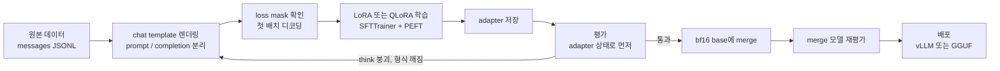
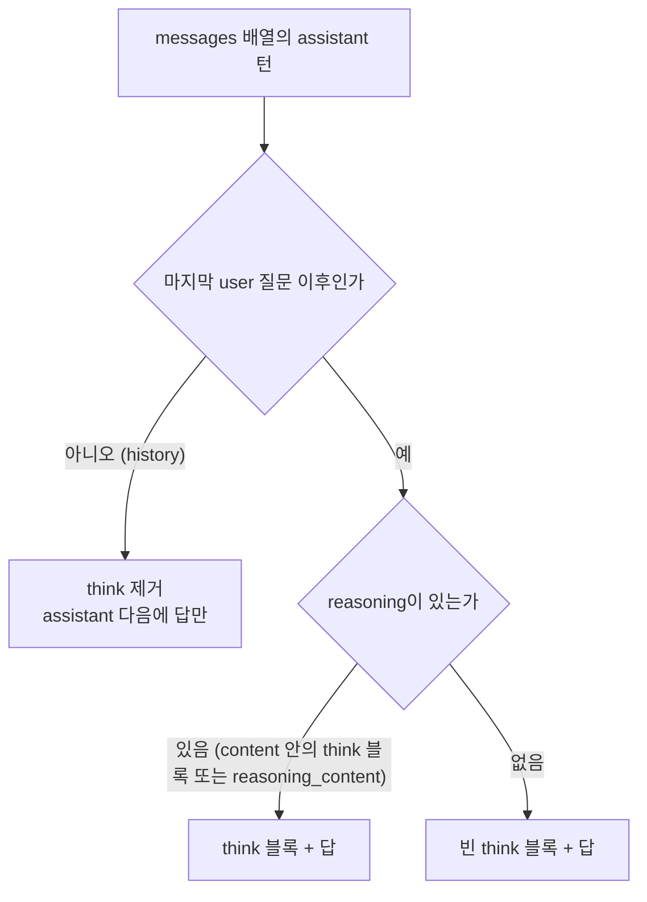
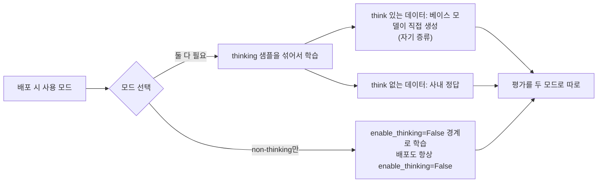
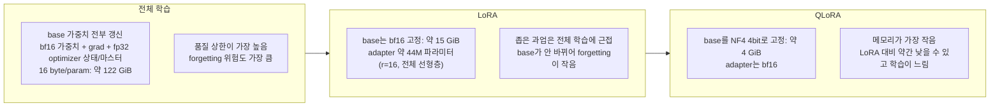
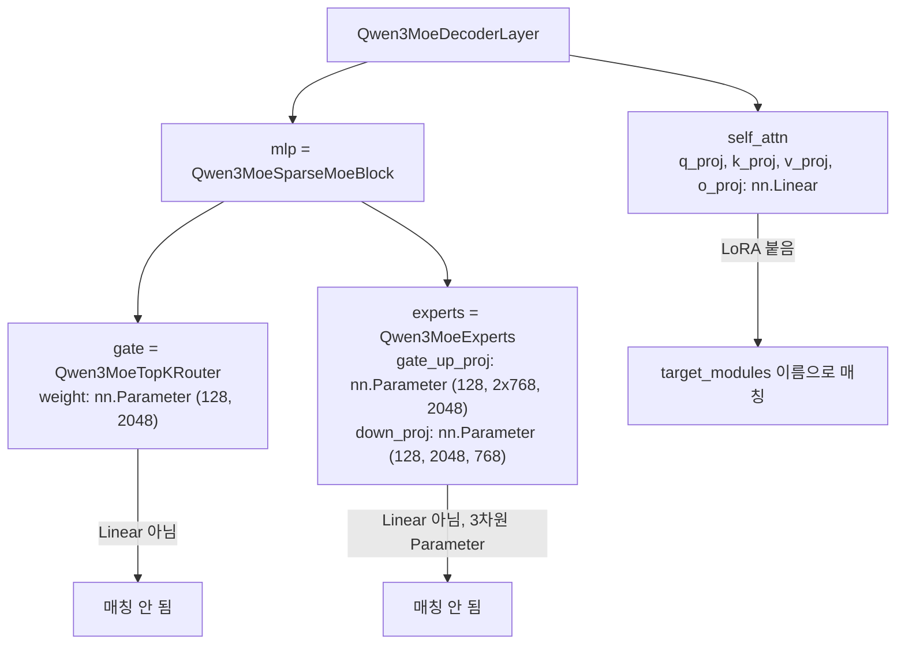

# Qwen Fine-tuning 실무

Qwen3를 한국어 도메인 데이터로 LoRA 학습시키면 loss는 잘 내려가는데 배포하고 나서 이상한 일이 생긴다. 응답이 `<think>` 없이 바로 나오거나, 반대로 빈 `<think></think>` 블록만 찍고 답하거나, 멀티턴 대화에서 두 번째 턴부터 말투가 틀어진다. 원인은 대부분 학습 코드가 아니라 데이터를 문자열로 바꾸는 단계에 있다. Qwen3는 chat template이 `<think>` 블록을 위치에 따라 다르게 다루기 때문에, Llama용으로 짜 둔 파이프라인을 그대로 가져오면 조용히 어긋난다.

LoRA의 수식, rank와 alpha의 일반적인 감각, catastrophic forgetting은 [LLM 파인튜닝 실무](../Concepts/LLM_Fine_Tuning.md)에 정리돼 있어서 여기서는 다시 쓰지 않는다. 학습이 끝난 뒤 GGUF로 내보내는 과정은 [Unsloth Qwen3 GGUF](../Concepts/Unsloth_Qwen3_GGUF.md)가 다룬다. 이 문서는 그 사이, 즉 Qwen 계열에서만 생기는 데이터 렌더링, think 모드, MoE, loss mask 문제를 다룬다.

## 확인한 범위

이 문서를 쓴 환경에는 GPU가 없고 디스크도 꽉 차서 torch, TRL, PEFT를 설치하지 못했다. 그래서 확인한 것과 못 한 것을 나눠 적는다.

| 항목 | 상태 |
|------|------|
| `Qwen/Qwen3-8B`의 chat template 렌더링, 토큰 id, 마스크 경계 | 실제로 실행 (transformers 5.18.0, tokenizers 0.23.2, 토크나이저 파일을 Hugging Face에서 받아서) |
| `Qwen/Qwen3-30B-A3B` config, transformers 5.18의 `qwen3_moe` 모델링 소스 | 파일을 직접 읽어 확인 |
| LoRA 파라미터 수, VRAM 수치 | config 값으로 계산한 산술값. 측정값이 아니다 |
| TRL `SFTTrainer`, PEFT 코드 | 실행하지 못했다. 인자 이름은 transformers 5.18 소스와 대조했고 TRL·PEFT 쪽은 버전에 따라 달라질 수 있어 첫 배치 확인 코드를 같이 둔다 |
| 학습 후 품질, think 모드가 얼마나 망가지는지 | 측정하지 못했다. 메커니즘까지만 쓰고 수치는 쓰지 않는다 |

Qwen3.6 계열의 chat template은 따로 받아 보지 않았다. 대상 모델을 바꾸면 아래 "렌더링 확인"의 세 줄을 그 모델 토크나이저로 먼저 돌려야 한다.

## 전체 흐름

데이터 준비에서 배포까지 한 번에 도는 순서다. 사고는 거의 앞쪽 두 칸(렌더링, 마스크)에서 나고, 뒤쪽 두 칸(평가, merge)에서 발견된다.



평가에서 실패하면 하이퍼파라미터보다 B로 먼저 돌아가야 한다. 학습률을 내리고 epoch를 줄여도 렌더링이 틀린 데이터는 틀린 채로 학습된다.

## 데이터 포맷과 chat template

### 한국어 instruction 데이터 한 줄

Qwen은 ChatML 계열이라 `<|im_start|>role\n...<|im_end|>\n` 형태로 대화를 만든다. 직접 이 문자열을 이어 붙이지 말고 데이터는 `messages` 배열로 저장해 두고 토크나이저의 `apply_chat_template`에 맡긴다.

```json
{"messages": [
  {"role": "system", "content": "고객 문의 분류기다. 카테고리 한 단어로만 답한다."},
  {"role": "user", "content": "환불 언제 돼요?"},
  {"role": "assistant", "content": "결제"}
]}
```

Alpaca식 `instruction/input/output`으로 가진 데이터는 `instruction`과 `input`을 합쳐 user로, `output`을 assistant로 옮기는 변환 한 번이면 된다. 변환을 두 번 하다가(Alpaca에서 ShareGPT로, 다시 messages로) 역할 이름이 `human`/`gpt`로 남아 있으면, Qwen template은 user·assistant·system·tool 외의 role을 렌더링하지 않고 건너뛴다. 에러 없이 해당 턴이 통째로 사라진다. 변환 직후 role 집합을 한 번 출력해 보는 것이 가장 싸다.

### 렌더링 확인

Qwen3-8B 토크나이저로 같은 대화를 세 가지로 렌더링한 결과다. 직접 돌린 출력이고 줄바꿈은 `\n`으로 표시했다.

```python
msgs = [
    {"role": "system", "content": "고객 문의 분류기다."},
    {"role": "user", "content": "환불 언제 돼요?"},
    {"role": "assistant", "content": "결제 취소 후 3~5영업일 걸립니다."},
]
tok.apply_chat_template(msgs, tokenize=False)                                   # 1) 학습용
tok.apply_chat_template(msgs[:2], tokenize=False, add_generation_prompt=True)   # 2) 추론용, 기본
tok.apply_chat_template(msgs[:2], tokenize=False, add_generation_prompt=True,
                        enable_thinking=False)                                  # 3) 추론용, think 끔
```

```text
1) <|im_start|>system\n고객 문의 분류기다.<|im_end|>\n<|im_start|>user\n환불 언제 돼요?<|im_end|>\n<|im_start|>assistant\n<think>\n\n</think>\n\n결제 취소 후 3~5영업일 걸립니다.<|im_end|>\n
2) <|im_start|>system\n고객 문의 분류기다.<|im_end|>\n<|im_start|>user\n환불 언제 돼요?<|im_end|>\n<|im_start|>assistant\n
3) <|im_start|>system\n고객 문의 분류기다.<|im_end|>\n<|im_start|>user\n환불 언제 돼요?<|im_end|>\n<|im_start|>assistant\n<think>\n\n</think>\n\n
```

1번이 핵심이다. assistant 메시지에 `<think>`가 없었는데도 학습용 렌더링은 `<think>\n\n</think>\n\n`을 자동으로 끼워 넣는다. 이 빈 블록은 3번(`enable_thinking=False`)의 프롬프트와 정확히 같은 모양이라, non-thinking 모드로 배포할 거라면 학습과 추론이 맞아떨어진다. 반대로 2번(기본, think 켬)은 프롬프트가 `assistant\n`에서 끝나고 모델이 `<think>`를 직접 생성해야 한다. 빈 블록이 박힌 데이터로만 학습하면 모델은 `assistant\n` 다음에 곧바로 빈 블록을 내도록 배운다. 다음 절의 문제가 이것이다.

`<think>`와 `</think>`는 토큰 id 151667, 151668인 일반 added token이고 special이 아니다. 그래서 `skip_special_tokens=True`로 디코딩해도 `<think>`는 지워지지 않는다. 평가에서 출력 앞부분을 문자열로 검사할 때 이 점을 알아야 한다. `<|im_start|>`, `<|im_end|>`, `<|endoftext|>`는 special이고 id가 151644, 151645, 151643이다. 이 토크나이저의 `eos_token`은 `<|im_end|>`, `pad_token`은 `<|endoftext|>`이고 `padding_side`는 right다.

### 멀티턴에서는 마지막 assistant 턴에만 think가 붙는다

template은 마지막 user 질문 이후의 assistant 턴에만 `<think>` 블록을 렌더링하고, 그 이전 턴의 think는 지운다. 두 턴짜리 대화에 양쪽 모두 think를 넣어 렌더링해 본 결과다.

```text
<|im_start|>user\nQ1<|im_end|>\n<|im_start|>assistant\n답1<|im_end|>\n
<|im_start|>user\nQ2<|im_end|>\n<|im_start|>assistant\n<think>\n생각2\n</think>\n\n답2<|im_end|>\n
```

`생각1`은 사라졌고 첫 assistant 턴은 `답1`만 남았다. non-thinking 데이터를 멀티턴으로 렌더링하면 첫 턴은 `<think>` 없이, 마지막 턴만 빈 블록이 붙는다. 한 샘플 안에서 assistant 턴의 모양이 둘로 갈린다.



전체 assistant 토큰에 loss를 걸면 history 턴은 "think 없이 답한다"를, 마지막 턴은 "빈 think 후 답한다"를 동시에 배운다. thinking 모드를 쓸 모델이라면 둘 다 위험하다. 멀티턴 대화는 assistant 턴 하나당 샘플 하나로 펼치는 편이 안전하다. 턴 k를 정답으로 두고 그 앞의 turn 1~k-1은 history로 넣는다. 이러면 모든 정답 턴이 "마지막 턴"이 돼서 template이 학습·추론에서 똑같이 동작한다.

`reasoning_content` 필드를 쓰는 형태도 렌더링된다.

```python
{"role": "assistant", "reasoning_content": "카드 결제면 영업일 기준.", "content": "결제 취소 후 3~5영업일 걸립니다."}
# -> <think>\n카드 결제면 영업일 기준.\n</think>\n\n결제 취소 후 3~5영업일 걸립니다.
```

content 안에 `<think>...</think>`를 직접 넣어도 같은 결과가 나온다. 데이터 팀과 필드를 합의할 때는 한 방식으로만 통일한다. 한 파일에 두 방식이 섞이면 `</think>`가 content에 남은 샘플만 조용히 다르게 처리된다.

## think가 있는 모델을 non-thinking 데이터로만 학습하면

Qwen3는 한 모델이 두 모드를 가진다. 사내 데이터는 거의 전부 "질문, 정답" 형태라 `<think>`가 없고, 그걸로만 학습하면 두 가지가 같이 일어난다.

첫째, 빈 `<think></think>` 블록이 모든 샘플에 들어간다(위 1번 렌더링). loss 경계를 `add_generation_prompt=True` 기본 프롬프트에 맞추면 이 빈 블록 토큰이 loss에 포함되고, 모델은 기본 모드에서도 `assistant\n` 직후에 빈 블록을 내는 쪽으로 이동한다. thinking 모드에서 사고 과정이 사라진다.

둘째, loss 경계를 `enable_thinking=False` 프롬프트에 맞추면 빈 블록은 프롬프트로 빠져서 loss 대상이 아니다. 이 경우 think 토큰 자체는 직접 학습되지 않는다. 그래도 가중치는 "think 없이 바로 답하는 분포"로만 갱신되기 때문에 thinking 모드의 추론 길이와 품질이 변할 수 있다. 얼마나 변하는지는 이 환경에서 재지 못했다. 변할 수 있다는 것과, 변했는지는 평가셋 두 벌(think 켬/끔)로 확인해야 한다는 것까지만 확실하다.

각 경계에서 loss가 걸리는 구간을 실제로 뽑은 결과다. 같은 non-thinking 샘플인데 경계에 따라 학습 대상이 달라진다.

```text
[non-thinking 샘플, enable_thinking=False 경계]  total=37 prompt=19 loss=18
  loss 구간: '결제 취소 후 3~5영업일 걸립니다.<|im_end|>\n'

[같은 샘플, 기본 프롬프트 경계]                    total=37 prompt=15 loss=22
  loss 구간: '<think>\n\n</think>\n\n결제 취소 후 3~5영업일 걸립니다.<|im_end|>\n'

[thinking 샘플, 기본 프롬프트 경계]                 total=52 prompt=15 loss=37
  loss 구간: '<think>\n카드 결제면 취소 후 영업일 기준이다.\n</think>\n\n결제 취소 후 3~5영업일 걸립니다.<|im_end|>\n'
```



대응은 배포 모드로 갈린다.

| 상황 | 대응 | 주의 |
|------|------|------|
| non-thinking으로만 쓴다 | `enable_thinking=False` 경계로 학습하고 서빙도 같은 옵션으로 고정 | 서빙 쪽 요청이 이 옵션을 빠뜨리면 학습과 다른 프롬프트가 들어간다. 호출 코드와 게이트웨이를 확인한다 |
| thinking도 쓴다 | 같은 프롬프트로 베이스 모델을 thinking 켠 채 돌려 응답을 만들고, 사내 정답과 맞는 것만 남겨 think 포함 샘플로 쓴다 | 정답 필터 없이 쓰면 틀린 추론이 학습된다. 생성 비용이 학습 비용보다 클 수 있다 |
| 모드를 사용자가 고른다 | Qwen3 모델 카드에 설명된 `/think`, `/no_think` 소프트 스위치를 user 메시지에 붙여 두 종류를 섞는다 | template이 이 문자열을 처리하는 게 아니라 모델이 배운 동작이라 학습 후에도 잘 먹는지 직접 확인한다 |
| 어느 쪽인지 정하지 못했다 | 낮은 rank, 낮은 학습률, 1 epoch로 시작해 두 모드를 모두 평가 | 조건이 약하면 둘 다 덜 바뀐다. 목적 모드가 안 오르면 올리고 나서 다른 모드를 확인한다 |

Qwen3 이후에 나온 non-thinking 전용(Instruct) 변종이나 thinking 전용 변종은 모드 전환이 없어서 이 문제가 줄어든다. 그래도 template이 think를 어떻게 다루는지는 모델마다 달라서 먼저 렌더링해 본다.

## loss mask를 assistant 토큰에만 거는 방법

system과 user 토큰에 loss를 걸면 질문을 따라 쓰는 법까지 학습한다. 시스템 프롬프트가 길고 고정인 데이터에서는 학습 토큰의 대부분이 그 문구라서, loss 곡선이 빨리 내려가 잘 되는 것처럼 보인다. 곡선이 예쁘게 내려갈수록 의심해야 하는 경우다.

TRL의 `assistant_only_loss=True`는 template에 `` 블록이 있어야 동작한다. Qwen3-8B template에는 이 블록이 없다. `return_assistant_tokens_mask=True`로 확인해 보면 transformers가 경고를 내고 마스크가 전부 0이다.

```text
[transformers] return_assistant_tokens_mask==True but chat template does not contain `` keyword.
mask 합: 0 / 51 토큰
```

마스크가 비면 학습할 토큰이 하나도 없다. TRL이 이 상태를 에러로 멈추는지, 경고만 내고 진행하는지는 버전마다 달라서 확인하지 못했다. template을 고쳐 ``을 끼우는 방법도 있지만, 추론 때 쓰는 template과 학습 template이 갈라지는 부담이 생긴다. 프롬프트와 정답을 문자열로 나누는 쪽이 단순하다. 렌더링 결과 전체에서 프롬프트 부분을 잘라 내는 방식이고, 프롬프트는 추론 때 쓸 것과 같은 호출로 만든다.

```python
from transformers import AutoTokenizer
tok = AutoTokenizer.from_pretrained("Qwen/Qwen3-8B")

def split_prompt_completion(messages, thinking):
    """마지막 assistant 턴만 정답으로 둔다. 경계는 추론 때 프롬프트가 끝나는 지점."""
    assert messages[-1]["role"] == "assistant"
    full = tok.apply_chat_template(messages, tokenize=False)
    prompt = tok.apply_chat_template(
        messages[:-1], tokenize=False, add_generation_prompt=True,
        enable_thinking=thinking,
    )
    assert full.startswith(prompt), "렌더링이 prefix 관계가 아니다"
    return {"prompt": prompt, "completion": full[len(prompt):]}
```

`thinking=False`이면 빈 think 블록이 prompt 쪽에 들어가고, `thinking=True`이면 completion 쪽에 들어간다. 위 "loss 구간" 출력이 이 함수의 결과다. `assert full.startswith(prompt)`는 template이 바뀌었거나 예외적인 샘플이 섞였을 때 경계가 어긋나는 것을 잡는 안전장치다. Qwen3-8B template과 위 예시 대화에서는 통과하는 것을 확인했고, tool 호출이 낀 샘플은 돌려 보지 않았다.

completion 끝이 `<|im_end|>\n`이라 개행 한 토큰도 loss에 들어간다. 추론은 `<|im_end|>`(eos)에서 멈추므로 개행은 영향이 없다. 신경 쓰이면 completion에서 마지막 `\n`을 잘라도 된다.

학습을 돌리기 전에 첫 배치에서 loss가 걸린 토큰을 디코딩해 본다. 이것만으로 이 절의 사고는 대부분 잡힌다.

```python
def show_loss_tokens(batch, tok, n=1):
    for ids, labels in zip(batch["input_ids"][:n], batch["labels"][:n]):
        tgt = [t for t, l in zip(ids.tolist(), labels.tolist()) if l != -100]
        print(len(ids), "중", len(tgt), "토큰에 loss")
        print(repr(tok.decode(tgt)))
```

출력이 `assistant` 정답 부분만, 그리고 `<|im_end|>`까지 나와야 한다. `<|im_start|>user`가 보이거나 `<|im_end|>`가 없으면 학습을 중단한다. `<|im_end|>`가 loss에 없으면 모델이 멈추는 법을 못 배워서 배포 후 응답이 끝없이 이어진다.

## 전체 학습, LoRA, QLoRA

세 방식은 base 가중치를 얼마나 학습시키고 어떤 정밀도로 들고 있느냐가 다르다. Qwen3-8B(config 기준 hidden 4096, 36 layer, 약 8.19B 파라미터)로 계산한 값이다.



수치는 가중치와 optimizer 상태만 센 값이고 activation은 빠져 있다. 전체 학습의 122 GiB는 AdamW의 fp32 상태 8 byte와 fp32 마스터 가중치 4 byte, bf16 가중치와 grad 4 byte를 합한 16 byte/param에 8.19B를 곱한 것이다. 마스터 가중치를 두지 않고 순수 bf16으로 돌리면 8 byte/param으로 약 61 GiB까지 내려가지만 수렴이 불안정해질 수 있다. 어느 쪽이든 80GB 카드 한 장에는 들어가지 않아서, 전체 학습은 ZeRO-3나 FSDP로 카드 여러 장에 상태를 나눠야 시작할 수 있다.

LoRA의 base 15 GiB는 8.19B에 2 byte를 곱한 값이고, QLoRA의 4 GiB는 0.5 byte/param의 근사다(양자화 상수는 별도). adapter, adapter의 grad와 optimizer 상태는 44M 개 규모라 합쳐서 1 GiB 아래다. 실제로 메모리를 잡아먹는 것은 activation과 logits다. 어휘 크기가 151,936이라서 로짓 텐서만 시퀀스 4096 토큰, fp32 기준으로 시퀀스 하나에 약 2.3 GiB(151,936 x 4,096 x 4 byte)다. 배치를 4로 올리면 로짓만 9 GiB를 넘는다. 24GB 카드에서 QLoRA가 도는데 `max_length`를 4096으로 올리자마자 OOM이 나는 경우가 이래서 생긴다. gradient checkpointing을 켜도 로짓은 줄지 않으므로 `per_device_train_batch_size`를 줄이고 gradient accumulation으로 보충한다.

품질 칸은 측정값이 아니라 방향이다. 좁은 분류·추출·형식 변환 과업은 LoRA와 전체 학습의 차이가 작고, 새로운 지식을 대량으로 주입하는 용도는 LoRA가 부족한 경우가 많다. 이 비교는 개별 데이터에서 달라지므로 자기 평가셋 수십~수백 건으로 직접 재야 한다. QLoRA를 고르는 기준은 품질이 아니라 카드 한 장에 올라가느냐다. 올라가면 LoRA, 안 올라가면 QLoRA로 정하면 된다.

## rank와 target_modules

Qwen3-8B에서 target 조합별 adapter 크기를 config 값으로 계산했다. `r x (in + out)`을 레이어마다 더한 값이다.

| target | r=8 | r=16 | r=64 |
|--------|-----|------|------|
| attention 4개 (q, k, v, o) | 7.7M | 15.3M | 61.3M |
| 전체 선형층 (attention 4 + gate, up, down) | 21.8M | 43.6M | 174.6M |

r=16 전체 선형층이 base의 약 0.53%다. k_proj, v_proj는 GQA 때문에 출력 차원이 1024(KV 헤드 8 x head_dim 128)로 작아서 다른 층보다 adapter가 작다. r을 올려서 크기가 4배가 되어도 base 대비 2% 남짓이다. 크기가 문제가 아니라, r이 클수록 소량 데이터에서 과적합과 forgetting이 커진다는 점이 문제다.

시작점은 `r=16, lora_alpha=32, lora_dropout=0.05`에 전체 선형층이다. 한국어 말투나 출력 형식을 맞추는 정도라면 `r=8`로 충분한 경우가 많고, 이 값들은 일반적으로 쓰는 시작점이지 Qwen에서 측정한 최적값이 아니다. 데이터가 천 건 아래면 r을 올리기 전에 데이터를 늘리거나 epoch를 줄인다. attention만 붙이면 형식·말투는 따라오지만 도메인 지식이 필요한 과업에서는 MLP까지 붙인 쪽이 학습이 잘 된다. 둘 중 모르겠으면 전체 선형층으로 시작한다.

PEFT의 `target_modules="all-linear"`는 출력층(`lm_head`)을 빼고 모든 `nn.Linear`에 붙는다. dense 모델에서는 편하지만 MoE에서는 의도하지 않은 곳에 붙거나 아무 데도 안 붙을 수 있다. 다음 절에서 다룬다.

## TRL SFTTrainer와 PEFT 코드

dense 모델 기준이다. 이 코드는 실행하지 못했고, `dtype`, `eval_strategy`, `warmup_steps`는 transformers 5.18 소스에서 이름을 확인했다. 예전 transformers는 `torch_dtype`, `evaluation_strategy`, `warmup_ratio`를 쓰고, TRL도 `max_length`가 예전에는 `max_seq_length`였다. 버전이 다르면 인자 이름부터 맞춘다.

```python
import torch
from datasets import load_dataset
from peft import LoraConfig
from transformers import AutoModelForCausalLM, AutoTokenizer
from trl import SFTConfig, SFTTrainer

MODEL = "Qwen/Qwen3-8B"
tok = AutoTokenizer.from_pretrained(MODEL)

raw = load_dataset("json", data_files={"train": "train.jsonl", "eval": "eval.jsonl"})
ds = raw.map(
    lambda ex: split_prompt_completion(ex["messages"], thinking=False),
    remove_columns=raw["train"].column_names,
)

model = AutoModelForCausalLM.from_pretrained(MODEL, dtype=torch.bfloat16, device_map="auto")

peft_config = LoraConfig(
    r=16,
    lora_alpha=32,
    lora_dropout=0.05,
    target_modules=["q_proj", "k_proj", "v_proj", "o_proj", "gate_proj", "up_proj", "down_proj"],
    task_type="CAUSAL_LM",
)

args = SFTConfig(
    output_dir="out/qwen3-8b-ko-lora",
    per_device_train_batch_size=2,
    gradient_accumulation_steps=8,
    learning_rate=1e-4,
    num_train_epochs=2,
    lr_scheduler_type="cosine",
    warmup_steps=30,
    bf16=True,
    gradient_checkpointing=True,
    max_length=4096,
    logging_steps=10,
    eval_strategy="steps",
    eval_steps=100,
    save_steps=100,
    save_total_limit=3,
)

trainer = SFTTrainer(
    model=model,
    args=args,
    train_dataset=ds["train"],
    eval_dataset=ds["eval"],
    processing_class=tok,
    peft_config=peft_config,
)
trainer.model.print_trainable_parameters()
```

`prompt`와 `completion` 두 컬럼이 있는 데이터셋은 TRL이 completion 쪽에만 loss를 거는 것으로 알고 있지만, 이 동작과 eos 토큰 처리를 이 환경에서 확인하지 못했다. 렌더링된 completion이 이미 `<|im_end|>\n`으로 끝나므로 TRL이 eos를 한 번 더 붙이는지 봐야 한다. `trainer.train()` 전에 앞 절의 `show_loss_tokens`로 `trainer.get_train_dataloader()`의 첫 배치를 디코딩한다. 다음 두 가지를 보면 된다. loss 구간에 `<|im_end|>`가 정확히 한 번 있는지, 그 뒤에 `<|im_end|><|im_end|>`나 `<|endoftext|>`가 더 붙지 않았는지.

`trainable params`는 r=16 전체 선형층이라면 약 43.6M 근처로 나와야 한다. 숫자가 이보다 한참 작거나 0이면 `target_modules`가 모듈을 못 찾은 것이다. PEFT가 에러를 내는 경우도 있지만, 일부 이름만 맞아서 조용히 작게 붙는 경우도 있다.

학습률 1e-4는 LoRA에서 흔히 쓰는 범위(1e-4~2e-4)의 아래쪽으로 잡은 값이다. 전체 학습은 이보다 한 자릿수 이상 작게(1e-5 근방) 잡는다. LoRA 학습률을 전체 학습 값으로 가져오면 loss가 거의 움직이지 않고, 반대로 전체 학습에 1e-4를 쓰면 모델이 망가진다.

QLoRA는 모델 로딩만 바꾼다. 나머지는 같다.

```python
from transformers import BitsAndBytesConfig

bnb = BitsAndBytesConfig(
    load_in_4bit=True,
    bnb_4bit_quant_type="nf4",
    bnb_4bit_use_double_quant=True,
    bnb_4bit_compute_dtype=torch.bfloat16,
)
model = AutoModelForCausalLM.from_pretrained(MODEL, quantization_config=bnb, device_map="auto")
```

## MoE 모델을 학습할 때

Qwen3-30B-A3B의 config는 hidden 2048, 48 layer, 전문가 128개 중 토큰당 8개 선택, 전문가 하나의 중간 차원 768이다. `mlp_only_layers`가 비어 있고 `decoder_sparse_step`이 1이라서 48개 레이어 전부가 MoE다. 전문가 가중치만 128 x 3 x 2048 x 768 x 48 = 약 29B로, 전체 약 30B의 대부분이다.

이 모델에서 `target_modules`가 무엇에 붙는지가 transformers 버전에 따라 달라진다. 설치해 둔 5.18 소스를 읽어 구조를 확인했다.



5.18에서는 전문가 128개가 하나의 3차원 `nn.Parameter`로 합쳐져 있다. 개별 `nn.Linear`가 아니므로 `gate_proj`, `up_proj`, `down_proj`를 `target_modules`에 써도 전문가에는 붙지 않는다. 이 모델은 모든 레이어가 MoE라서 dense MLP 이름(`gate_proj` 등)이 걸릴 모듈 자체가 없다. 결과적으로 위 코드의 일곱 개 이름 중 attention 네 개만 붙는다. 에러가 나지 않고 학습도 돌아가고 trainable params만 작게 나온다. 전문가가 `nn.ModuleList`의 개별 MLP였던 이전 버전(`mlp.experts.N.gate_proj`)에서는 이름이 매칭되고, 같은 설정이 전문가 128개 x 48 레이어에 각각 adapter를 붙여서 adapter 수가 엄청나게 늘어난다. 같은 코드가 버전에 따라 전혀 다른 학습이 된다.

대응은 이렇다.

- 먼저 `model.named_modules()`와 `named_parameters()`에서 `experts`, `gate` 이름을 출력해 이 버전의 구조를 본다. 위 도식과 같은지부터 확인한다.
- attention만 붙이는 것이 가장 단순하고 안전하다. 전문가 쪽은 건드리지 않으므로 라우팅 분포가 base와 거의 같게 유지된다.
- 전문가에도 붙이려면 PEFT의 `target_parameters`(`nn.Parameter`를 직접 지정하는 옵션) 지원 여부를 쓰는 PEFT 버전에서 확인한다. 이 옵션은 실행해 보지 못했다. 쓴다면 어떤 이름이 매칭됐는지 로그로 남기고, adapter 크기를 계산해서 trainable params와 맞는지 본다.
- 라우터(`mlp.gate`)에는 LoRA를 붙이지 않는 편이 낫다. 라우터를 바꾸면 어떤 토큰이 어떤 전문가로 가는지가 달라져 base가 쌓아 둔 전문가 분업이 흔들린다. 버전에 따라 라우터가 `nn.Linear`라서 `all-linear`가 붙여 버리는 경우가 있으니 이 점이 `all-linear`를 MoE에서 쓰지 말라는 이유다.

메모리 쪽은 앞에서 본 것처럼 계산은 active 3B, 상주는 total 30B다. 30B bf16이면 가중치만 약 57 GiB라서 LoRA도 80GB 한 장이 빠듯하다. QLoRA로 가중치를 4bit로 낮추면 한 장에 들어가지만, 합쳐진 3차원 `Parameter`가 bitsandbytes 양자화 경로를 그대로 타는지는 버전 조합에 따라 다르다. 이 조합은 확인하지 못했으니 작은 MoE로 먼저 돌려 보고 가중치가 실제로 4bit로 로드됐는지 메모리를 본다.

학습 중 라우팅 균형은 `output_router_logits`와 `router_aux_loss_coef`로 다룬다. 30B-A3B config는 `output_router_logits=False`, `router_aux_loss_coef=0.001`이다. 소스를 보면 `output_router_logits`가 켜져야 보조 loss(`load_balancing_loss_func`)가 계산되고, 꺼져 있으면 계산되지 않는다. 기본값으로 학습하면 균형 loss 없이 돌아간다. 라우터와 전문가를 고정한 채 attention LoRA만 학습한다면 균형 loss는 필요 없다. 전문가까지 학습하면 소량 데이터가 특정 전문가로 쏠릴 수 있어 켜는 것을 검토한다. 이 옵션이 학습 품질에 얼마나 영향을 주는지는 확인하지 못했다.

## 학습 후 평가

loss가 내려갔다는 것은 학습 데이터를 외웠다는 뜻일 수 있어서 평가는 따로 해야 한다. 평가는 adapter를 붙인 상태에서 먼저 하고, 통과하면 merge한 뒤 한 번 더 한다. merge에서 생기는 문제를 학습 문제와 구분하기 위해서다.

평가 축은 세 가지다.

1. 도메인 평가셋. 학습에 쓰지 않은 질문 수십~수백 건에 베이스 모델 점수를 먼저 재 둔다. 학습 후 점수와 비교한다.
2. 모드별 동작. think 켬/끔 두 설정으로 같은 질문을 돌려 모드가 유지됐는지 본다.
3. 일반 능력. 학습 전에 베이스가 풀던 일반 질문 20~50개를 따로 두고 학습 후에도 푸는지 본다. 도메인 점수가 올라도 일반 질문이 깨지면 forgetting이다.

2번은 문자열로 잡는다. 기본 프롬프트(think 켬)로 생성한 출력의 앞부분을 본다.

```python
def think_report(outputs):
    n = len(outputs)
    collapsed = sum(o.lstrip().startswith("<think>\n\n</think>") for o in outputs)
    dropped = sum(not o.lstrip().startswith("<think>") for o in outputs)
    print(f"빈 think {collapsed}/{n}, think 없이 시작 {dropped - collapsed}/{n}")
```

디코딩할 때 `skip_special_tokens=True`를 줘도 `<think>`는 남는다(위에서 확인한 대로 special이 아니다). 베이스가 대부분 `<think>`로 시작하는 질문 집합에서 학습 후 `collapsed`가 눈에 띄게 늘었다면 앞 절의 think 붕괴다. 숫자의 기준선은 베이스 모델이 같은 집합에서 보인 값이다. 학습 전에 같은 함수를 한 번 돌려 둔다.

도메인 정답이 한 단어나 JSON처럼 기계로 채점되는 과업이면 exact match나 스키마 검증으로 끝난다. 자유 서술이면 LLM 심사자를 쓰는데 이 설계는 [LLM Evaluation](../Concepts/LLM_Evaluation.md)에 있다. 심사자 모델과 학습 데이터를 만든 모델이 같으면 점수가 부풀 수 있다.

## adapter를 merge하기

merge는 `W + (alpha/r) x B x A`를 base 가중치에 더해 넣는 것이라 추론에서 adapter 연산이 사라진다. 순서는 이렇다.

```python
import torch
from peft import PeftModel
from transformers import AutoModelForCausalLM, AutoTokenizer

MODEL = "Qwen/Qwen3-8B"
base = AutoModelForCausalLM.from_pretrained(MODEL, dtype=torch.bfloat16, device_map="cpu")
model = PeftModel.from_pretrained(base, "out/qwen3-8b-ko-lora")
merged = model.merge_and_unload()

merged.save_pretrained("out/qwen3-8b-ko-merged", safe_serialization=True)
AutoTokenizer.from_pretrained(MODEL).save_pretrained("out/qwen3-8b-ko-merged")
```

QLoRA로 학습했더라도 merge할 base는 4bit가 아니라 bf16 원본이어야 한다. 양자화된 가중치에 더하면 4bit 값을 되돌려 다시 양자화하는 과정에서 오차가 쌓인다. 한 가지 어긋남은 남는다. QLoRA adapter는 4bit로 깎인 base 위에서 학습됐고 merge는 깎이지 않은 bf16 base에 한다. 이 차이로 품질이 얼마나 떨어지는지는 모델과 데이터마다 달라서 측정하지 못했다. 그래서 merge 모델을 평가셋으로 다시 재는 단계가 필요하다. 점수가 adapter 상태보다 눈에 띄게 낮으면 merge 모델 대신 adapter를 그대로 서빙하는 쪽을 검토한다.

토크나이저를 같이 저장하는 것은 습관으로 둔다. merge 결과 디렉토리에 `tokenizer_config.json`이 없으면 서빙 서버가 chat template 없이 올라와서 `<|im_start|>`가 일반 텍스트로 들어간다.

배포는 두 갈래다. merge한 bf16 모델을 vLLM에 그대로 올리거나(서빙 옵션은 [Qwen 자체 호스팅 서빙](Qwen_Self_Hosting_v_LLM.md) 참조), llama.cpp·Ollama용으로 GGUF로 변환한다. 변환과 양자화 변형별 크기는 [Unsloth Qwen3 GGUF](../Concepts/Unsloth_Qwen3_GGUF.md)에 있다. GGUF로 내리면 양자화가 한 번 더 들어가므로 마지막 평가는 실제로 배포할 형태(변환·양자화 후)로 돌리는 것이 안전하다.

## 관련 문서

- [LLM 파인튜닝 실무](../Concepts/LLM_Fine_Tuning.md): LoRA 내부 동작, rank·alpha 감각, catastrophic forgetting, Alpaca·ShareGPT 포맷
- [Unsloth Qwen3 GGUF](../Concepts/Unsloth_Qwen3_GGUF.md): Unsloth 학습 파이프라인과 GGUF 변환
- [Qwen 자체 호스팅 서빙](Qwen_Self_Hosting_v_LLM.md): merge 모델을 vLLM으로 서빙
- [Qwen 모델 패밀리 개요와 실무 사용](Qwen.md): 세대별 모델, MoE 구조
- [LLM Evaluation](../Concepts/LLM_Evaluation.md): 학습 후 평가 설계
