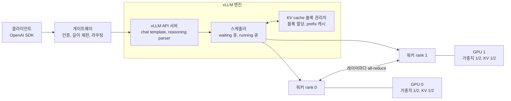
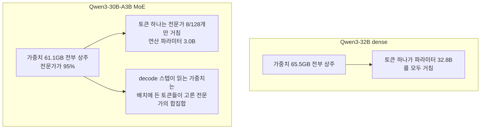
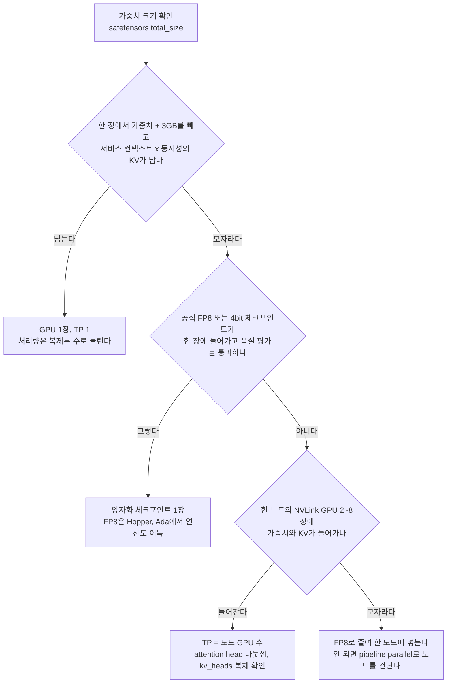
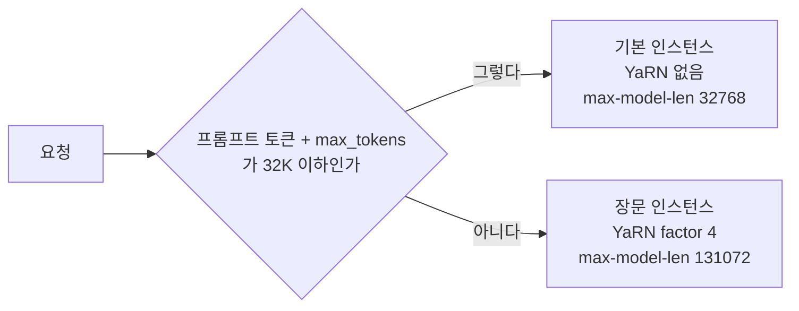
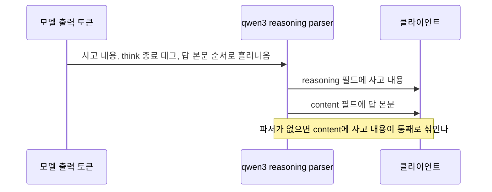
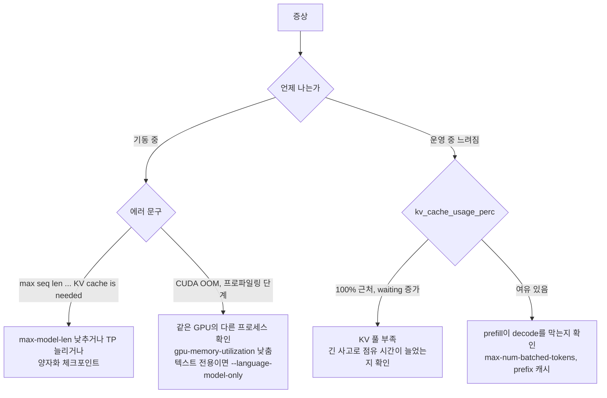

# Qwen 자체 호스팅 서빙

Qwen을 GPU 서버에 올릴 때 사고는 대부분 세 곳에서 난다. 기동하자마자 `max seq len` 에러로 죽거나, 올라가긴 했는데 동시 요청 몇 개만 들어와도 처리량이 무너지거나, 131K 컨텍스트를 켠 뒤로 짧은 질문의 답이 이상해진다. 셋 다 원인이 VRAM 계산과 RoPE 설정에 있어서, 모델을 받기 전에 숫자 몇 개만 뽑아 보면 대부분 미리 알 수 있다. [Qwen 모델 패밀리 개요](Qwen.md)의 vLLM 예제 한 덩어리로는 이 판단을 할 수 없어서, 여기서는 숫자를 어떻게 뽑는지부터 적는다.

## 확인한 것과 못 한 것

이 문서를 쓴 머신에는 GPU가 없고 RAM이 2GB다. 그래서 `vllm serve`를 실제로 띄워 보지는 못했다. 여기 나오는 수치와 동작은 아래 네 가지에서 나왔다.

- Hugging Face의 `config.json`과 `model.safetensors.index.json`(`metadata.total_size`)을 내려받아 계산한 값. 가중치 크기는 index 파일의 바이트 수 그대로다.
- `pip download vllm --no-deps`로 받은 vLLM 0.30.0 휠, `sglang` 0.5.21 휠의 파이썬 소스를 읽고 확인한 플래그와 기본값.
- transformers 5.18에서 config를 읽고 RoPE 초기화를 돌려 본 결과. YaRN `attention_scaling`이 직접 계산한 값과 일치하는 것까지 봤다.
- Qwen 모델 카드([Qwen3-32B](https://huggingface.co/Qwen/Qwen3-32B), [Qwen3.6-27B](https://huggingface.co/Qwen/Qwen3.6-27B))의 서빙 명령과 경고 문구.

Qwen3-0.6B로 YaRN을 켠 것과 끈 것의 perplexity를 비교하려고 두 번 돌렸지만 이 머신에서 끝나지 않아서(CPU 추론 중 메모리 부족으로 스왑에 갇힘) 짧은 컨텍스트 성능이 얼마나 떨어지는지는 수치가 없다. 그 부분은 모델 카드의 경고와 YaRN 수식을 직접 계산한 값까지만 적는다. 처리량(tokens/s)도 같은 이유로 적지 않는다.

## 요청이 GPU에 닿기까지

서빙 구성을 정하기 전에 요청 하나가 어디를 지나가는지 알아야 메모리 항목이 어디서 생기는지 보인다.



그림에서 볼 곳은 스케줄러와 블록 관리자다. 스케줄러는 매 스텝마다 running 큐의 요청에 토큰을 하나씩 더 생성시키고, 남는 토큰 예산으로 waiting 큐의 프롬프트를 prefill한다. 요청이 새로 들어오면 블록 관리자에게 KV cache 블록을 달라고 하고, 블록이 모자라면 waiting에 남거나 이미 돌던 요청이 밀려난다(preemption). 서버가 느려졌을 때 GPU 연산이 아니라 이 블록 풀이 먼저 차는 경우가 있다. 게이트웨이에서 입력 토큰 수를 제한하는 이유도 여기에 있다.

TP(tensor parallel)를 2 이상으로 주면 각 GPU가 가중치를 나눠 갖고, 레이어마다 all-reduce로 부분 결과를 합친다. 가중치 메모리는 줄지만 GPU 사이 통신이 모든 레이어에 끼어든다. 이 비용은 뒤의 선택 절에서 다시 나온다.

## VRAM은 세 덩어리로 센다

GPU 하나의 메모리는 가중치, KV cache, 나머지(activation, CUDA graph, 통신 버퍼)로 나뉜다. 가중치는 모델이 정하고, 나머지는 기동할 때 vLLM이 더미 입력으로 프로파일링해서 잡는다. 내가 정할 수 있는 건 사실상 KV cache에 얼마가 남느냐다.

### 가중치

가중치 크기는 파라미터 수 × 바이트로 추정해도 되지만, 저장소의 safetensors index에 `total_size`가 바이트로 적혀 있어서 그 값을 쓰는 게 정확하다.

| 모델 | 구조 | bf16 가중치 |
|------|------|------------|
| Qwen3-32B | dense | 65.5GB |
| Qwen3.6-27B | dense 하이브리드(비전 포함) | 55.6GB |
| Qwen3-30B-A3B | MoE, 128 전문가 중 8 | 61.1GB |
| Qwen3.6-35B-A3B | MoE, 256 전문가 중 8 | 71.9GB |
| Qwen3-235B-A22B | MoE, 128 전문가 중 8 | 470.2GB |

Qwen3.6-27B의 55.6GB는 비전 인코더가 들어간 값이다. config의 `vision_config`(depth 27, hidden 1152, intermediate 4304)로 계산하면 인코더가 0.9GB 안팎이라 텍스트만 쓸 서비스면 `--language-model-only`로 비전 가중치를 안 올리는 편이 낫다. 이 플래그는 vLLM 0.30.0 소스에 있고 Qwen3.6 모델 카드의 vLLM 명령에도 들어 있다.

### KV cache가 토큰 하나에 차지하는 크기

full attention 레이어마다 토큰 하나당 K와 V를 저장한다.

```text
KV bytes/token = 2 × (full attention 레이어 수) × kv_heads × head_dim × 바이트(bf16이면 2)
```

GQA라서 `kv_heads`가 query head 수보다 훨씬 작다. Qwen3-32B는 query head가 64개인데 kv_heads는 8이라, MHA였다면 토큰당 2MiB가 들었을 것이 256KiB로 줄어 있다.

| 모델 | full attention 레이어 | kv_heads | head_dim | 토큰당 KV(bf16) |
|------|----------------------|----------|----------|----------------|
| Qwen3-32B | 64 / 64 | 8 | 128 | 256KiB |
| Qwen3-30B-A3B | 48 / 48 | 4 | 128 | 96KiB |
| Qwen3-235B-A22B | 94 / 94 | 4 | 128 | 188KiB |
| Qwen3.6-27B | 16 / 64 | 4 | 256 | 64KiB |
| Qwen3.6-35B-A3B | 10 / 40 | 2 | 256 | 20KiB |

Qwen3.6 계열은 표 계산이 다르다. config의 `layer_types`를 세어 보면 `linear_attention` 3개에 `full_attention` 1개가 반복된다. linear attention(Gated DeltaNet) 레이어는 토큰마다 쌓이는 KV가 없고 요청당 고정 크기 상태만 갖는다. 그래서 위 표에서는 full attention 레이어만 센다. 고정 상태 크기는 `layer수 × linear_num_value_heads × key_head_dim × value_head_dim × 4바이트(fp32)`로 추정하면 27B가 요청당 144MiB, 35B-A3B가 60MiB다. 이 상태가 vLLM 안에서 실제로 어떤 단위로 잡히는지는 확인하지 못했고, 위 식은 config 값으로 내가 추정한 것이다. 토큰당 KV가 Qwen3-32B의 4분의 1이라는 점이 핵심이고, 긴 컨텍스트가 필요하면 이 하이브리드 구조가 가장 큰 차이를 만든다.

### 예산식

```text
KV에 쓸 수 있는 메모리 = GPU 메모리 × gpu_memory_utilization − 가중치/TP − activation 여유
```

`--gpu-memory-utilization`의 기본값은 vLLM 0.30.0 소스(`config/cache.py`)에서 0.92다. activation 여유는 프로파일링으로 정해지기 때문에 서버를 띄우기 전에는 모른다. 아래 표는 3GB로 가정했다. 모델과 동시 요청 수, 멀티모달 여부에 따라 달라지는 값이라 근사로만 보면 된다. 계산에 쓴 스크립트는 이렇다.

```python
import json

def cfg(path):
    c = json.load(open(path))          # HF config.json
    return c.get("text_config", c)

def kv_bytes_per_token(c, dtype_bytes=2):
    layers = c["num_hidden_layers"]
    if "layer_types" in c:             # Qwen3.6 하이브리드
        layers = c["layer_types"].count("full_attention")
    return 2 * layers * c["num_key_value_heads"] * c["head_dim"] * dtype_bytes

def budget(c, weights_gb, tp, gpu_gb, util=0.92, reserve_gb=3.0):
    kv_shard = kv_bytes_per_token(c) / min(tp, c["num_key_value_heads"])
    free_gb = gpu_gb * util - weights_gb / tp - reserve_gb
    return free_gb, int(max(free_gb, 0) * 1e9 / kv_shard)
```

`kv_shard`에서 `min(tp, kv_heads)`로 나누는 이유는 다음 항목에서 설명한다. 이 스크립트로 나온 값은 아래와 같다.

| 구성 | GPU당 가중치 | KV 여유 | 담는 토큰 | 32K 요청 동시 수 |
|------|-------------|---------|----------|-----------------|
| Qwen3-32B bf16, 80GB x1 | 65.5GB | 5.1GB | 19,454 | 0.6 |
| Qwen3-32B bf16, 80GB x2 TP2 | 32.8GB | 37.9GB | 288,772 | 8.8 |
| Qwen3-32B FP8, 80GB x1 | 34.3GB | 36.3GB | 138,473 | 4.2 |
| Qwen3-32B AWQ, 24GB x1 | 19.3GB | -0.2GB | 0 | 0 |
| Qwen3.6-27B bf16, 80GB x1 | 55.6GB | 15.0GB | 228,881 | 7.0 |
| Qwen3-30B-A3B bf16, 80GB x1 | 61.1GB | 9.5GB | 96,638 | 2.9 |
| Qwen3-30B-A3B bf16, 80GB x4 TP4 | 15.3GB | 55.3GB | 2,251,180 | 68.7 |
| Qwen3-235B-A22B FP8, 80GB x8 TP8 | 29.9GB | 40.7GB | 846,181 | 25.8 |

첫 줄이 이 표에서 가장 자주 밟는 함정이다. Qwen3-32B bf16은 가중치 65.5GB가 80GB 카드 한 장에 "들어간다". 그런데 KV에 남는 게 5.1GB라 토큰 19K개밖에 못 담고, 32K 요청 하나(8.6GB)도 못 받는다. 이 상태에서 `--max-model-len 32768`로 기동하면 vLLM이 기동 시점에 이렇게 막는다. 소스(`v1/core/kv_cache_utils.py`)에 있는 메시지다.

```text
ValueError: To serve at least one request with the model's max seq len (32768),
(8.00 GiB KV cache is needed, which is larger than the available KV cache memory (4.75 GiB).
Based on the available memory, the estimated maximum model length is 19456. ...
Try increasing `gpu_memory_utilization` ... or decreasing `max_model_len` ...
```

위 숫자는 소스의 메시지 형식에 내 계산값을 끼워 넣은 예시이고, 실제 로그의 수치는 프로파일링 결과에 따라 달라진다. 에러가 나면 문서 어디를 고치는 문제가 아니라 위 표의 계산을 다시 하는 것이다. 선택지는 `--max-model-len`을 낮추거나, TP를 늘리거나, 양자화 체크포인트로 바꾸는 것 셋이다.

한 가지 더 볼 건 `--max-model-len`이 메모리를 미리 예약하는 값이 아니라는 점이다. 요청마다 필요한 만큼의 블록을 받아 쓰고, 이 값은 기동 시 위 검사와 요청 길이 상한으로 작동한다. 그래서 `--max-model-len 131072`를 걸어도 요청이 전부 4K짜리면 메모리는 4K 기준으로 쓰이고, 어느 순간 131K 요청이 들어오면 그때 블록 풀을 혼자 거의 다 점유한다.

### TP가 kv_heads보다 크면 KV는 복제된다

vLLM은 GPU당 KV head 수를 `max(1, total_kv_heads // tp)`로 계산한다(`config/model.py`). Qwen3-32B는 kv_heads가 8이라 TP 8까지는 head가 GPU마다 나뉘지만, Qwen3-235B-A22B와 Qwen3-30B-A3B는 kv_heads가 4라서 TP 8을 주면 head가 둘씩 복제된다. 가중치는 8장에 나뉘어 줄어드는데 GPU당 KV 크기는 TP 4일 때와 같다. 앞의 표에서 `min(tp, kv_heads)`로 나눈 이유다. Qwen3.6-35B-A3B는 kv_heads가 2라서 TP 2를 넘으면 같은 일이 생긴다.

TP 값에는 별도 제약이 하나 더 있다. 소스에 `Total number of attention heads must be divisible by tensor parallel size` 검사가 있어서, Qwen3.6-27B처럼 attention head가 24개인 모델에 TP 5나 7을 줄 수 없다.

## MoE는 메모리가 total, 연산이 active

A3B는 이름에 3B가 들어 있지만 가중치는 30B다. config로 직접 계산하면 Qwen3-30B-A3B가 total 30.5B에 active 3.0B이고(임베딩 룩업은 제외, lm_head는 포함), 안전텐서 `total_size`를 2바이트로 나눈 값과 일치한다. 235B-A22B는 total 235.1B에 active 21.6B다. 전문가 파라미터가 전체의 95~97%를 차지하기 때문에 active가 그만큼 작다.



그림에서 MoE 쪽 아래 두 번째 노드가 서빙에서 헷갈리는 부분이다. 연산량은 active 기준이라 줄지만 VRAM은 total을 다 잡는다. 그리고 decode는 연산보다 가중치를 HBM에서 읽는 대역폭이 병목인 경우가 많은데, MoE는 한 스텝에 배치 안의 토큰들이 각자 고른 전문가의 합집합을 읽는다. 토큰이 전문가를 균등하게 고른다고 가정하면 한 레이어에서 읽히는 전문가 비율은 `1 - (1 - 8/128)^B`다.

| 배치의 토큰 수 B | 128 중 8 (A3B, A22B) | 256 중 8 (Qwen3.6-35B-A3B) |
|------------------|---------------------|---------------------------|
| 1 | 6% | 3% |
| 4 | 23% | 12% |
| 16 | 64% | 40% |
| 64 | 98% | 87% |
| 128 | 100% | 98% |

균등 선택은 가정이고 실제 라우터는 특정 전문가에 쏠린다. 그래서 실제 비율은 이 표보다 낮을 수 있다. 다만 방향은 분명하다. 동시 요청이 적은 서비스에서는 MoE가 읽는 가중치가 dense보다 훨씬 적어 유리하고, 동시 요청이 많아질수록 가중치를 거의 다 읽게 되어 이 이점이 줄어든다. 반면 연산량이 active 기준이라는 점은 배치가 커져도 유지된다. "3B만 쓰니까 24GB 카드에 올라간다"는 판단은 틀렸다. 61GB는 양자화 없이 24GB 카드에 올라가지 않는다.

전문가가 많은 MoE를 여러 GPU에 나눌 때 vLLM에는 TP 외에 `--enable-expert-parallel`이 있다(0.30.0 소스에서 확인). TP는 모든 가중치 행렬을 쪼개고, expert parallel은 전문가 단위로 GPU에 배치한다. 어느 쪽이 빠른지는 하드웨어 연결에 달려 있고 이 머신에서 비교하지 못해서 수치는 적지 않는다.

## 모델 크기와 GPU 대수로 서빙 방식 고르기

앞의 표를 기준으로 분기하면 이렇게 된다.



두 번째 분기가 핵심이다. 한 장에 들어가는 모델은 복제본을 늘리는 쪽이 대체로 낫다. TP는 모든 레이어에서 all-reduce가 두 번씩(어텐션 출력, MLP 출력) 끼어들기 때문에, PCIe로만 연결된 서버에서 TP 4 이상을 주면 통신이 병목이 되기 쉽다. 그래서 위 표의 Qwen3-32B bf16처럼 한 장에 "들어가긴 하지만" KV가 모자란 경우에는 TP 2로 가는 선택이 맞다. 가중치 절반이 GPU마다 빠지면서 KV 여유가 5.1GB에서 37.9GB로 7배 넘게 늘기 때문이다. 같은 모델의 FP8을 한 장에 올리는 선택지도 표에 있다(KV 36.3GB). 이쪽은 GPU 한 장으로 끝나고 복제본을 둘 띄우기 쉽지만, FP8 품질 평가를 통과해야 한다.

235B-A22B는 bf16이 470GB라서 H100 80GB 8장(640GB)에서도 KV 여유가 거의 안 남는다. 공식 FP8(239GB)로 가야 위 표의 40.7GB 여유가 나온다. 한 노드를 넘어가는 pipeline parallel은 노드 사이 네트워크 지연이 요청마다 붙어서 마지막 수단으로 둔다.

## 131K 확장과 YaRN

### 기본 컨텍스트와 확장 방식

Qwen3 계열의 기본 컨텍스트는 32,768이다. config의 `max_position_embeddings`가 40,960인 것은 프롬프트 8,192를 더 얹은 값이고, 모델 카드는 131,072까지는 YaRN으로 검증했다고 적는다. Qwen3.6은 기본이 262,144이고(config `max_position_embeddings: 262144`) 모델 카드 기준 YaRN으로 1,010,000까지 늘릴 수 있다. 그러니 Qwen3.6으로 262K 안에서 쓰는 서비스는 YaRN을 만질 일이 없다. 이 절은 기본 컨텍스트가 32,768인 Qwen3를 131K로 늘리는 경우에 해당한다.

### vLLM에서 켜는 방법

Qwen3 모델 카드는 vLLM에 `--rope-scaling '{"rope_type":"yarn","factor":4.0,"original_max_position_embeddings":32768}'`를 주라고 적고 있다. 그런데 vLLM 0.30.0 소스의 `engine/arg_utils.py`에는 이 플래그가 없다. 대신 `--hf-overrides`가 있고, Qwen3.6 모델 카드가 이 방식을 쓴다. 같은 방식을 Qwen3(플랫 config)에 맞춰 적으면 이렇다.

```bash
vllm serve Qwen/Qwen3-32B \
    --tensor-parallel-size 4 \
    --max-model-len 131072 \
    --reasoning-parser qwen3 \
    --hf-overrides '{"rope_parameters": {"rope_type": "yarn", "rope_theta": 1000000, "factor": 4.0, "original_max_position_embeddings": 32768}}'
```

이 명령으로 서버를 띄워 보지는 못했다. 확인한 것은 JSON이 transformers 5.18에서 config로 읽히고 `rope_theta`를 넣었을 때 `attention_scaling` 1.1386이 나온다는 것까지다. `rope_theta`를 빼면 transformers는 RoPE 초기화에서 `TypeError`로 죽는다(`unsupported operand type(s) for ** or pow(): 'NoneType'`). `rope_parameters`를 통째로 덮어쓰는 구조라서 원래 config에 있던 `rope_theta` 1,000,000을 같이 적어야 한다. vLLM이 theta가 빠졌을 때 어떻게 하는지는 확인하지 못했으니 빼먹지 않는다. Qwen3.6의 override는 `text_config` 아래에 `rope_parameters`를 넣고 `mrope_section` 같은 값도 모두 다시 적는 형태라서 모델 카드의 명령을 그대로 복사한다.

### 짧은 컨텍스트가 나빠지는 이유

모델 카드는 vLLM, SGLang, llama.cpp 모두 static YaRN이라 입력 길이와 상관없이 scaling factor가 일정하고 짧은 텍스트 성능에 영향이 있을 수 있다고 경고한다. vLLM 소스의 `yarn_scaling_rope.py`를 읽어 보면 이유가 보인다. cos/sin 캐시를 시작할 때 한 번 만들고, 그 값에 `mscale`을 곱해 둔다. 입력이 100토큰이든 100K든 같은 캐시를 쓴다.

head_dim 128, theta 1e6, factor 4, 원래 컨텍스트 32768로 소스의 함수를 그대로 옮겨 계산하면 이렇다.

- RoPE 주파수 쌍 64개 중 앞쪽 24개(고주파)는 그대로다.
- 뒤쪽 24개(저주파)는 주파수가 4분의 1로 줄어든다.
- 사이 16개는 보간 구간이다. 결국 64쌍 중 40쌍의 주파수가 바뀐다.
- `mscale = 0.1 × ln(4) + 1 = 1.1386`이다. cos/sin 둘 다에 곱해져서 q와 k 양쪽에 걸리므로 어텐션 logit이 `1.1386² ≈ 1.30`배가 된다. transformers의 `attention_scaling`이 같은 1.1386을 낸다.

바뀌는 24개 저주파 쌍은 파장이 32,768토큰보다 길어서(같은 계산으로 확인) 수천 토큰 이내의 짧은 입력에서는 한 바퀴도 못 도는 성분이다. 그래서 이쪽 영향은 작을 것으로 추정한다. 반면 보간 구간 16쌍과 logit 1.3배는 짧은 입력에도 항상 걸린다. 그 효과가 실제 품질에서 얼마나 되는지는 앞에서 말한 대로 측정하지 못했다. 모델 카드의 문장 그대로, 평균 컨텍스트가 32,768 이하면 켜지 말라는 권고를 따르면 된다.

factor는 필요한 길이에 맞춰 줄일 수 있다. 모델 카드는 일반적인 컨텍스트가 65,536이면 factor 2.0이 낫다고 적는다. factor 2.0이면 mscale이 `0.1 × ln(2) + 1 = 1.0693`으로 내려가고 logit 배율은 약 1.14배다.

### 인스턴스를 나눠서 운영한다

긴 입력이 가끔 오고 대부분은 짧은 서비스에서는 YaRN 인스턴스 하나로 전부 받는 것보다, YaRN 없는 기본 인스턴스와 YaRN 인스턴스를 따로 띄우고 앞단에서 갈라 주는 편이 안전하다. 게이트웨이가 프롬프트 토큰 수를 이미 세고 있으니 같은 값으로 라우팅한다.



비용은 GPU가 늘어난다는 점이다. 장문 인스턴스의 KV 요구량은 앞의 표로 계산된다. Qwen3-32B bf16을 80GB 4장 TP4로 띄우면 GPU당 KV 여유가 약 54GB, 담는 토큰이 82만 개라서 131K 요청이 6개 정도 동시에 돈다. TP 2였다면 28만 토큰이라 2개다. 장문 요청이 몰리는 시간대가 있으면 이 숫자가 곧 동시성 상한이 된다.

## 양자화 체크포인트 고르기

Qwen이 공식으로 올린 양자화 저장소의 가중치 크기를 `total_size`와 API 파일 목록에서 합산하면 이렇다(2026-10-01 기준).

| 모델 | bf16 | FP8 | 4bit |
|------|------|-----|------|
| Qwen3-32B | 65.5GB | 34.3GB | AWQ 19.3GB |
| Qwen3-30B-A3B | 61.1GB | 32.4GB | GPTQ-Int4 16.9GB |
| Qwen3-235B-A22B | 470.2GB | 239.0GB | GPTQ-Int4 124.5GB |
| Qwen3.6-27B | 55.6GB | 30.9GB | 확인 못 함 |
| Qwen3.6-35B-A3B | 71.9GB | 37.5GB | 확인 못 함 |

"확인 못 함"은 `-AWQ`, `-GPTQ-Int4` 이름의 저장소를 요청했을 때 HTTP 401이 돌아온 경우다. 저장소가 없거나 접근이 막힌 것이라서, Qwen3.6은 커뮤니티 4bit 체크포인트를 쓰게 되면 출처와 변환 방식을 따로 확인해야 한다.

FP8은 가중치가 bf16의 절반이다. Hopper와 Ada 세대 GPU는 FP8 연산 하드웨어가 있어서 메모리와 연산 둘 다 이득을 본다. 그 이전 세대(A100 등)에서는 vLLM이 Marlin 커널로 가중치만 FP8로 저장하고 연산은 상위 정밀도로 하는 방식을 쓴다. 이 내용은 `quantization/fp8.py`의 주석(`For GPUs that lack FP8 hardware support, we can leverage the Marlin kernel for fast weight-only FP8 quantization`)에서 확인했다. A100에서 FP8 체크포인트를 받으면 VRAM은 줄지만 연산 이득은 기대하지 않는 게 맞다.

AWQ와 GPTQ는 4bit 가중치 양자화다. 가중치만 줄고 KV cache는 그대로라는 점을 놓치기 쉽다. 앞 표의 Qwen3-32B AWQ를 24GB 카드에 올리면 가중치 19.3GB에 activation 3GB를 더해 22.3GB가 되는데, 24GB × 0.92 = 22.1GB라서 KV에 쓸 메모리가 마이너스다. 가중치가 "들어간다"와 "서비스가 된다"는 다른 문제다. KV를 줄이려면 `--kv-cache-dtype fp8` 같은 별도 옵션이 있고(플래그는 소스에서 확인), 이건 가중치 양자화와 독립이라 품질 영향도 따로 봐야 한다.

고르는 순서는 이렇다. 한 장에 넣는 게 목적이면 4bit, 처리량과 품질을 같이 챙기고 Hopper 이상이면 FP8이다. 어느 쪽이든 코드 생성, JSON 출력, 도구 호출처럼 형식이 깨지면 바로 에러가 나는 워크로드는 자기 평가셋으로 bf16과 비교해 본 뒤에 올린다. 양자화로 인한 품질 저하 정도는 모델과 작업마다 달라서 일반화한 수치를 적지 않는다.

## vLLM과 SGLang

둘 다 Qwen을 OpenAI 호환 서버로 띄운다. 이번에 확인한 차이는 플래그 이름과 기본 동작이다. 처리량 비교는 남의 벤치마크를 인용하지 않고, 자기 서비스의 프롬프트 길이 분포로 둘을 같은 부하 스크립트에 돌려서 정하는 편이 맞다.

| 항목 | vLLM 0.30.0 | SGLang 0.5.21 |
|------|-------------|---------------|
| TP | `--tensor-parallel-size` | `--tp-size` |
| 컨텍스트 길이 | `--max-model-len` | `--context-length` |
| 메모리 비율 | `--gpu-memory-utilization` 기본 0.92 | `--mem-fraction-static` |
| reasoning 분리 | `--reasoning-parser qwen3` | `--reasoning-parser qwen3` |
| RoPE 덮어쓰기 | `--hf-overrides` | `--json-model-override-args` |
| prefix 캐시 | `enable_prefix_caching` 기본 true | radix cache, `--disable-radix-cache`로 끔 |
| 동시 시퀀스 상한 | `--max-num-seqs` 기본 128 | `--max-running-requests` |

메모리 비율 옵션은 의미가 다르다. vLLM의 `gpu-memory-utilization`은 이 프로세스가 쓸 GPU 메모리의 총량이다. SGLang의 `mem-fraction-static`은 가중치와 KV 풀에 정적으로 할당하는 비율이고 나머지를 activation에 남기는 값으로 알고 있는데, 소스로 검증하지는 않았다(옵션 이름이 `schedule.py` 필드에 있는 것까지만 봤다). 같은 0.9를 두 엔진에 넣어도 같은 값이 아닐 수 있다. Qwen3.6 모델 카드의 SGLang 명령은 `--mem-fraction-static 0.8`을 주고 vLLM 명령은 이 종류의 플래그를 주지 않는다.

Qwen3.6 하이브리드 모델이 두 엔진에서 모두 도는지는 버전에 달려 있다. vLLM 0.30.0의 모델 레지스트리에는 `Qwen3_5ForCausalLM`, `Qwen3_5MoeForCausalLM`, `Qwen3_5ForConditionalGeneration`이 있고, Qwen3.6 모델 카드에 SGLang 명령과 vLLM 명령이 모두 있다. SGLang 쪽 모델 구현은 이 머신에서 확인하지 못했다. 엔진 버전을 올릴 때마다 모델 카드가 요구하는 버전을 같이 봐야 한다.

## reasoning parser와 think 블록

Qwen3 이후 모델은 `<think>...</think>` 블록 뒤에 답을 낸다. 서버가 이 둘을 가르지 않으면 `content`에 사고 과정이 통째로 섞여 클라이언트가 최종 답을 뽑지 못한다. vLLM은 `--reasoning-parser qwen3`을 주면 응답을 둘로 나눈다.



이 설정에서 부딪히는 문제는 네 가지다.

첫째, 플래그 이름이 버전마다 다르다. [Qwen 모델 패밀리 개요](Qwen.md) 4.3절의 예제에는 `--enable-reasoning`이 있는데, vLLM 0.30.0 소스 전체에서 이 이름은 검색되지 않는다. `--reasoning-parser qwen3`만 주면 된다. 같은 예제의 `Qwen/Qwen3.6-27B-Instruct`도 저장소가 없다(`config.json` 요청이 401). 실제 저장소 이름은 `Qwen/Qwen3.6-27B`다.

둘째, 응답 필드 이름이 바뀌었다. 0.30.0의 `ChatMessage`는 필드가 `reasoning`이고, 요청 쪽에서 오는 옛 이름 `reasoning_content`는 `reasoning`으로 바꿔 받는다(`chat_completion/protocol.py`). 이전 버전은 응답에 `reasoning_content`를 썼다. 엔진을 올리면 클라이언트 코드가 조용히 `None`을 읽을 수 있으니 두 이름을 모두 읽도록 한다. [Qwen 도구 호출과 Agent](Qwen_Tool_Calling_Agent.md)는 `reasoning_content`를 쓰고 있어서, 0.30.0 이후 버전에 붙이면 이 차이를 만난다.

```python
msg = resp.choices[0].message
reasoning = getattr(msg, "reasoning", None) or getattr(msg, "reasoning_content", None)
```

셋째, thinking 켜고 끄기는 요청마다 `chat_template_kwargs`로 넘긴다.

```python
client.chat.completions.create(
    model="Qwen/Qwen3-32B",
    messages=messages,
    extra_body={"chat_template_kwargs": {"enable_thinking": False}},
)
```

vLLM 소스에는 `reasoning_effort`가 주어졌는데 `enable_thinking`이 없으면 `reasoning_effort != "none"` 값을 `enable_thinking`으로 넣는 코드가 있다. 두 파라미터를 같이 쓰면 이 규칙이 겹치니 하나만 쓴다.

넷째, `max_tokens`에는 사고 토큰이 포함된다. 사고가 길어져 `max_tokens`에 걸리면 `</think>`에 닿기 전에 잘리고 `content`가 비어서 돌아온다. `max_tokens`를 짧게 잡는 서비스는 thinking을 끄거나, 사고 분량까지 합친 값으로 올려 둔다.

## OOM과 처리량 저하

증상은 기동할 때와 운영 중으로 나뉘고, 운영 중이면 메트릭부터 본다. vLLM 0.30.0 소스에서 확인한 메트릭 이름은 `vllm:kv_cache_usage_perc`, `vllm:num_requests_waiting`이고, 로그 통계에는 preemption 횟수가 따로 찍힌다.



### 기동 중에 죽는 경우

첫 번째 분기의 `max seq len` 에러는 앞의 예산식 절에서 다뤘다. 두 번째 분기는 프로파일링 때 CUDA OOM이 나는 경우다. 같은 GPU에 다른 프로세스가 이미 메모리를 쓰고 있으면 0.92 × 전체 메모리를 요청량대로 잡지 못해 기동에 실패할 수 있다. 다른 컨테이너와 GPU를 나눠 쓰는 환경에서 나는 경우다. `nvidia-smi`로 이미 점유된 양을 확인하고 비율을 그만큼 낮춘다. Qwen3.6처럼 비전 인코더가 붙은 모델은 텍스트만 쓰더라도 비전 가중치 0.9GB가 같이 올라간다. 텍스트 전용이면 `--language-model-only`로 뺀다.

### 운영 중에 느려지는 경우

KV 사용률이 100% 근처이고 waiting이 쌓이면 블록 풀이 모자란 것이다. 요청이 새로 들어와도 블록을 못 받아서 대기하고, 이미 도는 요청이 밀려나면 나중에 그 구간을 다시 계산해야 해서 같은 일을 두 번 하게 된다. thinking이 켜진 서비스는 출력 길이가 길어서 요청 하나가 블록을 점유하는 시간이 길다. 입력 4K에 사고 토큰 12K가 붙으면 요청 하나가 16K를 차지하고 그 시간이 길다.

대응은 비용이 낮은 순서로 해 본다. 먼저 `max_tokens`와 `--max-model-len`을 서비스 실제 분포에 맞춰 줄인다. 다음은 `--max-num-seqs`(기본 128)를 낮춰 한꺼번에 받는 요청 수를 KV 풀 크기에 맞춘다. 이 값이 KV 풀이 감당하는 동시 요청 수를 넘으면 밀려나는 요청이 잦아진다. 그래도 모자라면 KV를 fp8로 낮추거나, TP를 늘려 GPU당 KV를 확보하거나, 복제본을 늘린다.

KV 여유가 있는데 느리면 prefill이 문제인 경우가 많다. `--max-num-batched-tokens`의 기본값은 2048이고 chunked prefill이 기본으로 켜져 있다(`config/scheduler.py`). 긴 프롬프트는 이 크기로 잘려 스텝마다 들어가기 때문에, 이 값이 크면 긴 프롬프트가 decode 중인 요청들의 토큰 간격을 늘린다. 시스템 프롬프트가 길고 모든 요청에서 같다면 prefix 캐시(vLLM은 기본 켜짐)가 효과를 낸다. 시스템 프롬프트 앞부분에 요청마다 바뀌는 값(타임스탬프 같은 것)을 넣으면 캐시가 매번 깨진다.

### 증상별로 자주 걸리는 것

| 증상 | 원인 | 확인 |
|------|------|------|
| 131K 켠 뒤 짧은 질문 답이 이상함 | static YaRN이 모든 입력에 적용됨 | 인스턴스를 나눠 같은 질문을 비교 |
| 응답 `content`에 `<think>`가 섞임 | `--reasoning-parser` 누락 | `vllm serve` 인자 확인 |
| 클라이언트가 reasoning을 못 읽음 | 필드명 `reasoning`과 `reasoning_content` 차이 | 응답 JSON의 키를 직접 확인 |
| TP 지정 시 기동 실패 | attention head 수가 TP로 안 나눠짐 | config의 `num_attention_heads` |
| TP를 늘렸는데 KV가 안 늘어남 | `tp > kv_heads`라 KV head 복제 | config의 `num_key_value_heads` |
| 기동은 되는데 긴 요청이 거절됨 | `--max-model-len`이 입력 + 출력보다 작음 | 에러 메시지의 길이 값 |

마지막 행은 `max_tokens`와 합쳐서 계산해야 한다는 점이 걸린다. 입력 길이만 보고 `--max-model-len`을 잡으면 사고 토큰이 붙은 뒤에 한도에 걸린다.

## 근거로 읽은 자료

- [Qwen/Qwen3-32B 모델 카드](https://huggingface.co/Qwen/Qwen3-32B): YaRN 설정, static YaRN 경고, 기본 컨텍스트
- [Qwen/Qwen3.6-27B 모델 카드](https://huggingface.co/Qwen/Qwen3.6-27B): `--language-model-only`, `--hf-overrides`로 YaRN을 켜는 명령, 262,144 기본 컨텍스트
- 각 모델의 `config.json`과 `model.safetensors.index.json`: Hugging Face `Qwen/<모델명>` 저장소
- vLLM 0.30.0 휠 소스: `yarn_scaling_rope.py`, `config/cache.py`, `config/scheduler.py`, `kv_cache_utils.py`, `quantization/fp8.py`, `chat_completion/protocol.py`
- SGLang 0.5.21 휠 소스: `server_args.py`, `parser/reasoning_parser.py`

버전이 올라가면 플래그와 필드 이름이 달라질 수 있다. 위 소스는 `pip download vllm==0.30.0 --no-deps`로 휠을 받아 압축을 풀면 그대로 볼 수 있다.
