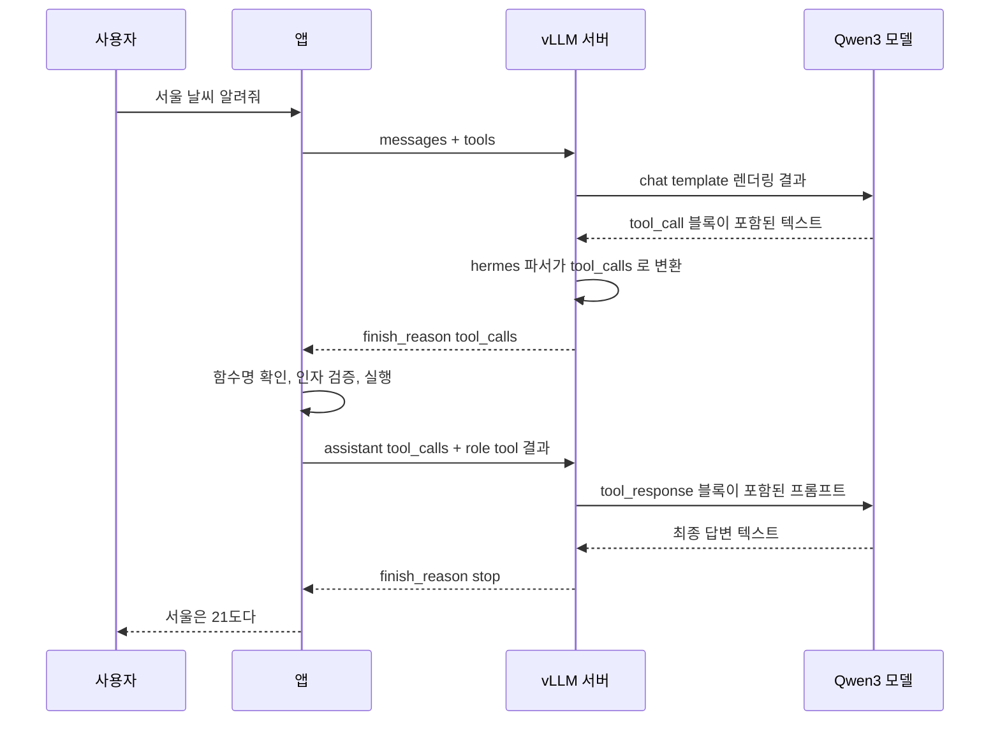
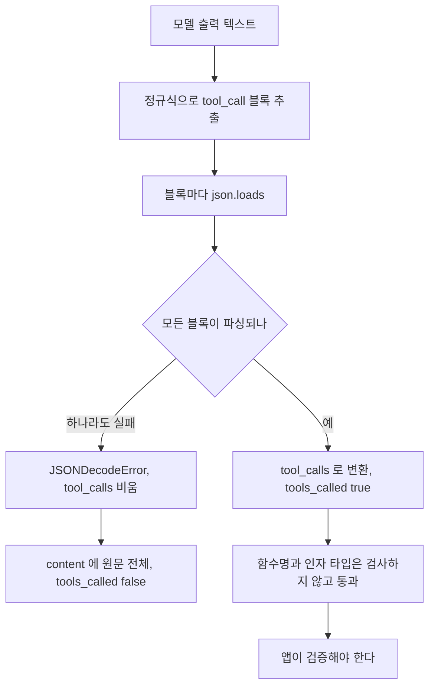
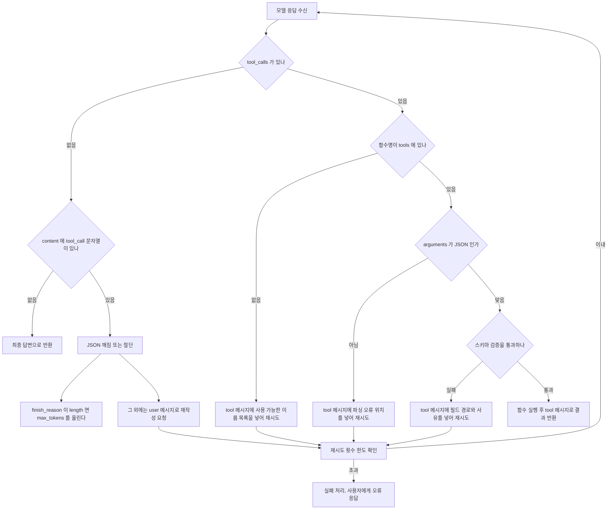
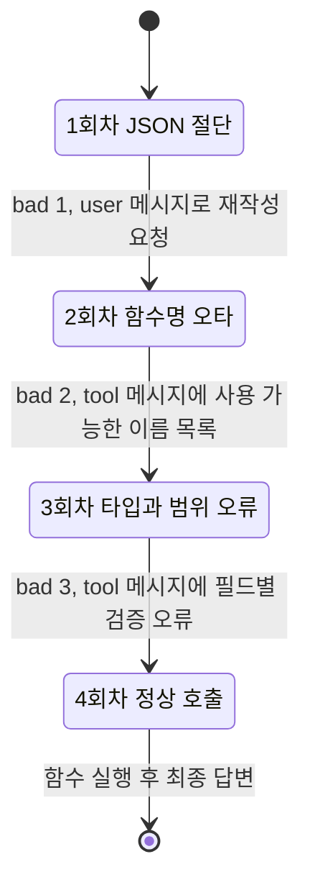
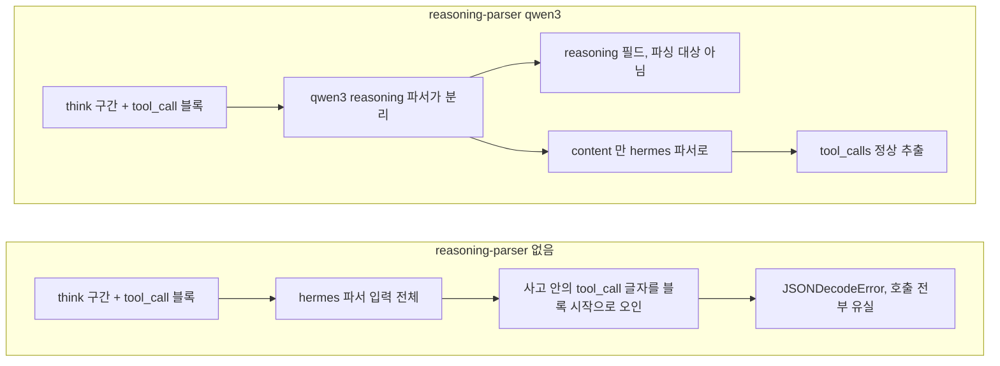
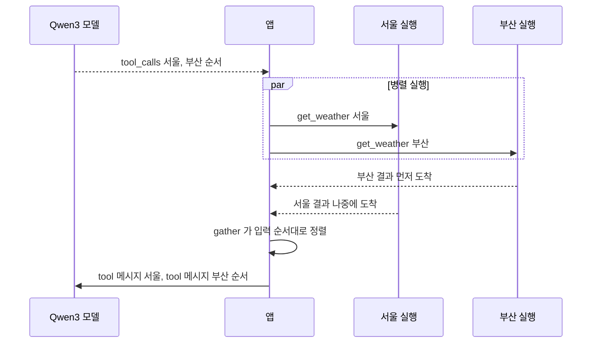
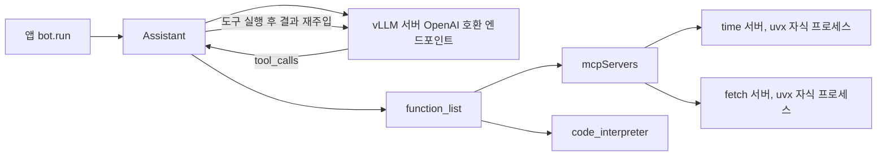

# Qwen 도구 호출과 Agent

Qwen3로 도구 호출 에이전트를 붙이면 처음 며칠은 잘 돈다. 문제는 트래픽이 붙고 나서 나온다. 같은 프롬프트인데 가끔 `tool_calls`가 비고, `content`에 `<tool_call>` 문자열이 그대로 찍혀 나오고, 함수 이름이 한 글자 틀리고, `"limit": "10"`처럼 문자열로 온 숫자가 DB 드라이버에서 터진다. 이 문서는 그 지점을 하나씩 다룬다.

확인 범위부터 밝혀 둔다. 이 문서를 쓴 환경에는 GPU가 없어서 Qwen3 모델을 직접 띄워 호출하지는 못했다. 여기 나오는 출력은 세 종류다. Hugging Face의 `Qwen/Qwen3-8B` `tokenizer_config.json`에서 받은 chat template을 jinja2로 렌더링한 결과, vLLM 저장소의 hermes 파서(`vllm/tool_parsers/hermes_tool_parser.py`) 로직을 그대로 옮겨 돌린 결과, 그리고 모델 응답을 스크립트로 고정해 놓고 돌린 검증·재시도 루프의 결과다. "모델이 이런 식으로 틀린다"는 부분은 vLLM 소스와 공식 문서에서 따라오는 동작이고, 실제 발생 빈도는 모델·양자화·프롬프트에 따라 달라서 수치로 쓰지 않았다.

---

## 1. 요청 한 번이 모델에게 보이는 모양

OpenAI 호환 API로 `tools`를 넘기면 서버가 chat template을 거쳐 평범한 텍스트 프롬프트로 바꾼다. 모델은 `tools` 파라미터를 모른다. 시스템 프롬프트에 박힌 JSON 스키마와 지시문만 본다. 그래서 도구 호출이 이상하면 서버 설정이나 API 형식보다 이 렌더링 결과를 먼저 보는 게 빠르다.

`get_weather` 하나를 정의하고, 사용자가 서울과 부산 날씨를 물었고, 모델이 병렬로 두 번 호출했고, 앱이 결과 두 개를 돌려준 상태를 Qwen3-8B 템플릿으로 렌더링한 결과다.

```text
<|im_start|>system
# Tools

You may call one or more functions to assist with the user query.

You are provided with function signatures within <tools></tools> XML tags:
<tools>
{"type": "function", "function": {"name": "get_weather", "description": "도시의 현재 날씨", "parameters": {"type": "object", "properties": {"city": {"type": "string"}, "unit": {"type": "string", "enum": ["c", "f"]}}, "required": ["city"]}}}
</tools>

For each function call, return a json object with function name and arguments within <tool_call></tool_call> XML tags:
<tool_call>
{"name": <function-name>, "arguments": <args-json-object>}
</tool_call><|im_end|>
<|im_start|>user
서울이랑 부산 날씨 알려줘<|im_end|>
<|im_start|>assistant
<tool_call>
{"name": "get_weather", "arguments": {"city": "서울"}}
</tool_call>
<tool_call>
{"name": "get_weather", "arguments": {"city": "부산"}}
</tool_call><|im_end|>
<|im_start|>user
<tool_response>
{"temp":21}
</tool_response>
<tool_response>
{"temp":24}
</tool_response><|im_end|>
<|im_start|>assistant
```

OpenAI 형식과 Qwen 텍스트 형식이 대응되는 자리는 이렇다.

| OpenAI 쪽 | Qwen3 프롬프트 쪽 |
|---|---|
| 요청의 `tools` 배열 | system 메시지 안 `<tools>` 블록, 함수마다 JSON 한 줄 |
| assistant의 `tool_calls[].function` | assistant 턴 안의 `<tool_call>` 블록, 호출마다 하나 |
| `arguments`(문자열) | `"arguments"` 자리에 JSON 객체로 들어감 |
| `role: "tool"` 메시지 | user 턴 안의 `<tool_response>` 블록 |
| `tool_call_id` | 렌더링에서 사라진다 |

마지막 줄이 실무에서 걸린다. `tool_call_id`는 템플릿에 나오지 않는다. 모델은 결과를 ID로 짝짓지 않고 순서로 짝짓는다. 병렬 호출 결과를 돌려줄 때 호출 순서를 지켜야 하는 이유다(6장). 또 `role: "tool"` 메시지가 연속되면 한 user 턴 안에 `<tool_response>`로 묶여 들어간다. 위 출력에서 두 응답이 하나의 `<|im_start|>user` 안에 있는 게 그 결과다.

reasoning을 끈 요청(`enable_thinking=False`)은 마지막 줄이 `<|im_start|>assistant\n<think>\n\n</think>\n`로 끝난다. 템플릿이 빈 think 블록을 미리 채워 넣어서 모델이 사고를 건너뛰게 만드는 방식이다. 켠 요청은 `<|im_start|>assistant\n`만 남기고 모델이 `<think>`를 직접 연다.

전체 흐름은 이 시퀀스다. 모델과 앱 사이에 vLLM의 파서가 끼어 있고, 파서가 `<tool_call>` 텍스트를 `tool_calls` 필드로 바꿔 주는 것까지가 서버 일이다. 함수를 실제로 실행하는 쪽은 항상 앱이다.



앱이 두 번 서버를 부르는 구조라서, 도구 호출 에이전트는 요청 수가 곧 지연 시간이다. 호출 한 번에 모델 왕복이 두 번 들어간다.

---

## 2. vLLM 서버 설정

서버 쪽 필수 플래그는 `--enable-auto-tool-choice`와 `--tool-call-parser` 두 개다. Qwen3는 reasoning 파서도 같이 붙인다.

```bash
vllm serve Qwen/Qwen3-8B \
  --enable-auto-tool-choice \
  --tool-call-parser hermes \
  --reasoning-parser qwen3 \
  --max-model-len 16384
```

`--enable-auto-tool-choice`가 없으면 `tool_choice="auto"` 요청이 400으로 떨어진다. 이 플래그는 `--tool-call-parser`와 한 쌍이고, 파서 이름을 빼먹어도 시작 단계에서 막힌다. 서버가 안 뜨니 오히려 알아차리기 쉽다.

`hermes`를 쓰는 이유는 Qwen2.5부터 Qwen3까지 chat template이 Hermes 스타일(`<tool_call>` JSON)이기 때문이다. vLLM 문서도 Qwen2.5와 QwQ에 `hermes`를 안내한다. Qwen3-Coder 계열은 형식이 달라서 `qwen3_xml` 파서를 쓴다. Coder 모델에 `hermes`를 붙이면 형식이 맞지 않아 호출이 `tool_calls`로 올라오지 않을 수 있다. 모델을 바꿀 때 파서도 같이 확인해야 한다.

`--reasoning-parser qwen3`는 5장에서 다시 다룬다. 이 플래그가 있어야 `<think>` 구간이 `content`에서 분리된다.

클라이언트는 OpenAI SDK를 그대로 쓴다. reasoning 토글은 `chat_template_kwargs`로 넘긴다.

```python
from openai import OpenAI

client = OpenAI(base_url="http://localhost:8000/v1", api_key="EMPTY")

resp = client.chat.completions.create(
    model="Qwen/Qwen3-8B",
    messages=messages,
    tools=TOOLS,
    tool_choice="auto",
    temperature=0.2,
    max_tokens=1024,
    extra_body={"chat_template_kwargs": {"enable_thinking": False}},
)
msg = resp.choices[0].message
```

`max_tokens`는 도구 호출에서 의외로 중요하다. 인자가 긴 호출이 중간에 잘리면 닫는 중괄호가 없는 JSON이 되고, 파서는 이걸 예외로 처리한다(3장). `finish_reason`이 `length`면 도구 호출이 아니라 절단으로 먼저 의심한다.

---

## 3. 파서가 해 주는 일과 안 해 주는 일

hermes 파서는 모델 출력 텍스트에서 `<tool_call>` 블록을 정규식으로 뽑고, 각 블록을 `json.loads`한 다음 `name`과 `arguments`를 OpenAI 형식으로 바꾼다. 소스의 핵심은 이 정도다.

```python
RX = re.compile(r"<tool_call>(.*?)</tool_call>|<tool_call>(.*)", re.DOTALL)

raw = [json.loads(m[0] if m[0] else m[1]) for m in RX.findall(out)]
calls = [{"name": c["name"],
          "arguments": json.dumps(c["arguments"], ensure_ascii=False)} for c in raw]
head = out[: out.find("<tool_call>")]       # 첫 태그 앞은 content 로 남는다
```

이 로직을 그대로 옮겨서 입력별로 돌린 결과다. 출력은 읽기 좋게 줄여 적었다.

| 모델 출력 | tools_called | 결과 |
|---|---|---|
| 정상 호출 2개 | true | calls 2개, content 없음 |
| 앞에 자연어 + 호출 1개 | true | calls 1개, content `"서울 날씨부터 확인해 보겠습니다.\n"` |
| 닫는 `</tool_call>` 없음 | true | calls 1개. 두 번째 정규식 분기가 끝까지 잡는다 |
| 호출 2개 중 두 번째 JSON이 깨짐 | false | calls 비어 있음, content에 원문 전체, `JSONDecodeError` |
| max_tokens에서 잘림 | false | calls 비어 있음, content에 잘린 원문, `JSONDecodeError` |
| 없는 함수명 `get_weahter` | true | 그대로 통과 |
| `{"user_id": "42", "limit": "10"}` | true | 그대로 통과 |

아래 도식은 위 표의 결과가 어디서 갈리는지 보여 준다. 분기는 `json.loads` 한 곳뿐이고, 함수명과 타입은 파서를 지나서도 검사되지 않는다.



세 가지가 눈에 띈다.

첫째, 호출 여러 개 중 하나만 깨져도 파서는 전부 포기한다. 멀쩡한 첫 번째 호출까지 `tool_calls`에서 사라지고 원문이 `content`로 간다. 에러 로그는 서버에 `Error in extracting tool call from response.`로만 남고, 클라이언트 쪽에는 `tool_calls` 없이 `content`만 온다. 앱이 `tool_calls`가 비었으면 최종 답변이라고 가정하고 있으면 사용자에게 `<tool_call>{"name": ...` 문자열이 그대로 나간다.

둘째, 파서는 함수명이 `tools`에 있는지 확인하지 않는다. 스키마 검증도 없다. 타입이 틀린 인자도 `tools_called: true`로 통과한다. 검증은 전부 앱이 해야 한다. `tool_choice`에 함수를 지정하거나 `strict` 계열 옵션으로 서버가 디코딩을 제약하는 방법이 있는 버전도 있지만, 파서와 모델 조합마다 지원이 다르다. 기본값에 기대지 않는 게 안전하다.

셋째, 호출 앞의 자연어는 파서가 막지 않는다. `content`에 남을 뿐 호출은 정상 추출된다. 이 동작은 5장의 reasoning 문제와 직접 이어진다.

---

## 4. 실패 유형별로 다르게 처리한다

실패를 한 덩어리로 보고 "다시 시도"만 걸면 같은 실패를 반복한다. 원인에 따라 모델에게 줘야 하는 정보가 다르다.



도식에서 갈리는 지점은 오류를 어느 role로 돌려주느냐다. `tool_calls`가 정상 추출된 경우는 각 호출에 `tool_call_id`가 있으므로 `role: "tool"` 메시지로 오류를 돌려준다. 모델은 "내 호출 결과가 이 오류였다"고 자연스럽게 읽는다. 파서가 포기한 경우는 짝지을 호출 ID가 없다. 깨진 원문을 assistant 메시지로 되돌려 넣고 user 메시지로 재작성을 요청해야 한다. 이때 오류 문구에 "JSON이 틀렸다"만 쓰지 말고 닫는 괄호와 따옴표를 확인하라는 식으로 고칠 지점을 짚어 준다. 문구에 따른 재시도 성공률 차이는 직접 재 보지 못했다.

존재하지 않는 함수명은 사용 가능한 이름 목록을 같이 줘야 한다. `get_weahter` 같은 오타는 목록만 봐도 고친다. 이름만 틀렸다고 알려 주면 모델이 엉뚱한 함수를 만들어 내는 경우가 있다.

인자 타입 오류는 `jsonschema`의 오류 메시지를 그대로 쓴다. `'42' is not of type 'integer'`처럼 필드 경로와 기대 타입이 나오기 때문에 모델이 해당 필드만 고친다.

### 검증·재시도 루프

위 분기를 코드로 옮긴 것이다. `chat` 함수는 OpenAI 응답의 message를 dict로 돌려주는 어떤 구현이든 넣을 수 있다.

```python
import json
from jsonschema import Draft202012Validator

TOOLS = [
    {"type": "function", "function": {
        "name": "search_orders",
        "description": "사용자의 주문 목록 조회",
        "parameters": {
            "type": "object",
            "properties": {
                "user_id": {"type": "integer"},
                "limit": {"type": "integer", "minimum": 1, "maximum": 50},
            },
            "required": ["user_id"],
            "additionalProperties": False,
        }}},
]
SCHEMAS = {t["function"]["name"]: Draft202012Validator(t["function"]["parameters"]) for t in TOOLS}
IMPL = {"search_orders": lambda user_id, limit=10: {"user_id": user_id, "orders": list(range(limit))[:3]}}


def check_call(call):
    name = call["function"]["name"]
    if name not in SCHEMAS:
        return f"존재하지 않는 함수: {name}. 사용 가능: {sorted(SCHEMAS)}", None
    try:
        args = json.loads(call["function"]["arguments"])
    except json.JSONDecodeError as e:
        return f"arguments 가 JSON 이 아니다: {e.msg} (위치 {e.pos})", None
    errs = [f"{'.'.join(map(str, e.absolute_path)) or '<root>'}: {e.message}"
            for e in SCHEMAS[name].iter_errors(args)]
    if errs:
        return "인자 검증 실패: " + "; ".join(errs), None
    return None, args


def run(chat, user_text, max_rounds=6, max_bad_rounds=3):
    messages = [{"role": "user", "content": user_text}]
    bad = 0
    for _ in range(max_rounds):
        msg = chat(messages)
        calls = msg.get("tool_calls") or []
        content = msg.get("content") or ""

        if not calls and "<tool_call>" in content:
            bad += 1
            if bad > max_bad_rounds:
                raise RuntimeError("tool_call 형식 복구 실패")
            messages.append({"role": "assistant", "content": content})
            messages.append({"role": "user", "content":
                "직전 응답의 <tool_call> JSON 을 파싱하지 못했다. 닫는 괄호와 따옴표를 확인해서 다시 호출해라."})
            continue

        if not calls:
            return content

        messages.append({"role": "assistant", "content": content, "tool_calls": calls})
        any_bad = False
        for call in calls:
            err, args = check_call(call)
            if err:
                any_bad = True
                result = {"error": err}
            else:
                result = IMPL[call["function"]["name"]](**args)
            messages.append({"role": "tool", "tool_call_id": call["id"],
                             "content": json.dumps(result, ensure_ascii=False)})
        if any_bad:
            bad += 1
            if bad > max_bad_rounds:
                raise RuntimeError("인자 오류 재시도 한도 초과")
    raise RuntimeError("max_rounds 초과")
```

`chat`을 스크립트로 대체해서 네 가지 실패를 순서대로 먹여 봤다. 1회차는 닫는 중괄호가 빠진 JSON, 2회차는 `search_order`(s 누락), 3회차는 `user_id`가 문자열이고 `limit`이 상한 초과, 4회차가 정상 호출이다. 모델 응답은 고정이고, 루프가 만든 메시지와 최종 결과는 실제로 실행한 출력이다.

```text
  -> 모델 응답 1번째 메시지 뒤: {"content": "<tool_call>\n{\"name\": \"search_orders\", \"arguments\": {\"user_id\": 42}\n</tool_call>"}
  -> 모델 응답 3번째 메시지 뒤: {"content": "", "tool_calls": [{"id": "c1", "function": {"name": "search_order", ...
     직전 user 메시지: 직전 응답의 <tool_call> JSON 을 파싱하지 못했다. 닫는 괄
  -> 모델 응답 5번째 메시지 뒤: {"content": "", "tool_calls": [{"id": "c2", "function": {"name": "search_orders", ...
     직전 tool 메시지: {"error": "존재하지 않는 함수: search_order. 사용 가능: ['search_orders']"}
  -> 모델 응답 7번째 메시지 뒤: {"content": "", "tool_calls": [{"id": "c3", "function": {"name": "search_orders", ...
     직전 tool 메시지: {"error": "인자 검증 실패: user_id: '42' is not of type 'integer'; limit: 100 is greater than the maximum of 50"}
  -> 모델 응답 9번째 메시지 뒤: {"content": "주문 3건이 있다."}
     직전 tool 메시지: {"user_id": 42, "orders": [0, 1, 2]}
주문 3건이 있다.
```

위 출력을 회차별 상태 전이로 다시 그리면 `bad` 카운터가 어디서 올라가는지 보인다. 앞 세 번은 실패 유형이 달라서 돌려주는 role과 문구가 다르다.



3회차 오류 메시지에 두 필드의 문제가 한 번에 들어간다. `iter_errors`로 전부 모으지 않고 `validate`를 쓰면 첫 오류만 나와서 모델이 고친 뒤 두 번째 오류를 또 만나고 왕복이 늘어난다.

루프에서 몇 가지 결정은 코드에서 바로 안 보여서 적어 둔다.

재시도 한도는 `max_bad_rounds`로 따로 센다. `max_rounds`만 두면 정상 호출 여러 번과 오류 재시도가 같은 예산을 먹는다. 반대로 오류 한도 없이 `max_rounds`만 크게 잡으면, 같은 틀린 인자를 반복하는 모델이 호출 한도까지 토큰을 태운다. 같은 오류가 두 번 연속 나오면 한도를 기다리지 말고 끊는 편이 낫다.

인자를 코드에서 강제 변환(`"42"`를 `42`로)하고 싶은 유혹이 있다. 읽기 전용 조회에서는 괜찮다. 결제나 삭제처럼 부작용이 있는 함수는 변환하지 말고 거절해서 모델이 다시 쓰게 한다. 모델이 `"10"`과 `10`을 구분 못 하는 상황에서 `user_id` 같은 필드가 엉뚱하게 변환되면 감사 로그가 거짓말을 하게 된다.

`additionalProperties: False`는 스키마에 넣어 두는 게 좋다. 모델이 스키마에 없는 인자를 지어내는 경우를 검증 단계에서 잡는다. 이게 없으면 `IMPL[name](**args)`가 `TypeError`로 터지고, 이건 모델의 잘못으로 다룰지 앱 버그로 다룰지 구분이 안 된다.

---

## 5. reasoning 모드를 켰을 때

Qwen3는 기본이 thinking 켜짐이다. 켜면 모델이 `<think>...</think>`를 먼저 쓰고 그다음에 `<tool_call>`을 낸다. 3장의 파서는 첫 `<tool_call>` 앞을 `content`로 남길 뿐 호출 추출을 막지 않으므로, 사고 구간에 `<tool_call>`이라는 글자가 없으면 문제없이 동작한다.

문제는 사고 구간 안에 그 글자가 나올 때다. 모델이 "`<tool_call>` 태그 안에 JSON을 넣어야 한다"처럼 형식을 혼잣말로 되뇌는 경우가 있다. reasoning 파서 없이 서버를 띄우면 `<think>` 구간이 통째로 파서 입력에 들어간다. 같은 로직으로 두 입력을 돌린 결과다.

| 모델 출력 | tools_called | 결과 |
|---|---|---|
| `<think>` 안에 일반 문장, 뒤에 정상 호출 | true | calls 1개, content는 `<think>...</think>` 부분 |
| `<think>` 안에 `<tool_call>` 문자가 있고, 뒤에 정상 호출 | false | `JSONDecodeError`, 원문 전체가 content |

reasoning 파서가 없을 때와 있을 때 파서 입력이 어떻게 달라지는지 비교한 도식이다. 위쪽은 사고 구간이 파서에 그대로 들어가고, 아래쪽은 `content`만 들어간다.



두 번째 경우 정규식이 사고 구간 안의 `<tool_call> 태그 안에 JSON을 넣어야 한다. ...</think>\n\n<tool_call>\n{...` 전체를 첫 블록으로 잡고 `json.loads`에 넘긴다. 당연히 실패하고 뒤쪽의 멀쩡한 호출까지 버려진다. 재현 조건이 사고 내용에 달려 있어서 간헐적으로 나타나고, 로그를 봐도 모델 응답이 정상으로 보이는 게 문제를 찾기 어렵게 만든다.

우회는 세 단계로 한다.

서버에 `--reasoning-parser qwen3`를 붙인다. vLLM 문서에 따르면 도구 호출 파싱은 `content`에서만 일어나고 `reasoning`은 건드리지 않는다. 사고 구간이 응답의 별도 필드(버전에 따라 `reasoning` 또는 `reasoning_content`)로 빠지니 위 충돌이 구조적으로 사라진다. 이게 가장 먼저 할 일이다. 이 플래그 없이 Qwen3를 띄워 놓고 도구 호출을 쓰는 설정을 가끔 보는데, 위험한 조합이다.

다음은 도구 호출을 판단하는 요청에서 사고를 끈다. `enable_thinking=False`로 보내면 템플릿이 빈 `<think></think>`를 미리 채워서 사고 구간 자체가 생기지 않는다. 사고 토큰이 없어지니 지연 시간도 줄어든다. 다만 "어떤 도구를 어떤 순서로 부를지" 계획을 세워야 하는 단계는 사고가 도움이 된다.

그런 경우는 요청을 둘로 나눈다. 계획 요청은 thinking을 켜고 `tools`를 넘기지 않는다. 계획 결과 텍스트를 받아서, 실제 호출 요청은 thinking을 끄고 `tools`를 넘기며 그 계획을 프롬프트에 넣는다. 왕복이 하나 늘지만 파서 충돌 가능성을 구조로 없앤다.

```python
plan = client.chat.completions.create(
    model=MODEL, messages=messages + [{"role": "user", "content": "필요한 도구와 호출 순서를 먼저 정리해라."}],
    extra_body={"chat_template_kwargs": {"enable_thinking": True}},
)
act = client.chat.completions.create(
    model=MODEL,
    messages=messages + [{"role": "assistant", "content": plan.choices[0].message.content},
                         {"role": "user", "content": "위 계획대로 첫 도구를 호출해라."}],
    tools=TOOLS,
    extra_body={"chat_template_kwargs": {"enable_thinking": False}},
)
```

기존 Qwen.md의 8.4절은 reasoning을 끄는 쪽을 권했다. 그 판단은 유지하되, `--reasoning-parser`를 붙이면 켠 채로도 쓸 수 있다는 점을 보탠다. 단, 스트리밍에서는 두 파서가 델타 단위로 번갈아 돌기 때문에 이 문서에서 직접 확인하지 못한 동작이 더 있을 수 있다. 스트리밍 도구 호출은 별도로 테스트한다.

한 가지 더, 앱 쪽 방어도 필요하다. `content`가 비어 있지 않고 `tool_calls`도 있는 응답은 정상이다. 호출 앞 자연어를 사용자에게 보여 줄지 버릴지는 앱이 정한다. 호출이 있는 턴의 `content`를 최종 답변으로 쓰면 "확인해 보겠습니다"가 최종 답변으로 나간다.

---

## 6. 병렬 도구 호출

Qwen3는 한 턴에 `<tool_call>` 블록을 여러 개 낼 수 있고, 1장 렌더링 예시가 그 모양이다. 서울과 부산처럼 서로 의존하지 않는 호출은 한 번에 나오는 편이 왕복 한 번을 아낀다.

앱이 지켜야 할 건 세 가지다.

호출 순서와 같은 순서로 `role: "tool"` 메시지를 돌려줘야 한다. 1장에서 본 것처럼 템플릿이 `tool_call_id`를 렌더링하지 않아서, 모델은 첫 `<tool_response>`를 첫 호출의 결과로 읽는다. `asyncio.gather`로 병렬 실행하는 건 좋지만, 끝나는 순서대로 메시지를 붙이면 부산 결과가 서울 자리에 들어간다. `gather`는 입력 순서대로 결과를 돌려주므로 그 순서를 그대로 쓰면 된다.

```python
results = await asyncio.gather(*(execute(c) for c in calls), return_exceptions=True)
for call, res in zip(calls, results):
    body = {"error": str(res)} if isinstance(res, Exception) else res
    messages.append({"role": "tool", "tool_call_id": call["id"],
                     "content": json.dumps(body, ensure_ascii=False)})
```

실행은 병렬이어도 결과 메시지는 호출 순서대로 붙는다는 점을 아래 시퀀스에서 확인한다. 부산이 먼저 끝나도 tool 메시지는 서울이 먼저다.



일부만 실패해도 호출 수만큼 tool 메시지를 만들어야 한다. 하나라도 빠지면 `tool_calls`와 `tool` 메시지 수가 어긋나서, 템플릿이 렌더링은 해도 모델이 어떤 결과가 비었는지 알 수 없다. 4장 루프가 오류도 `role: "tool"`로 돌려주는 이유다. 성공한 호출은 실행하고 실패한 호출만 오류로 돌려준다.

그리고 파서의 전부-아니면-전무 동작(3장)을 기억해야 한다. 호출 수가 많을수록 그중 하나가 깨질 여지가 늘고, 하나만 깨져도 전체가 버려진다. 병렬 호출이 불안정하면 시스템 프롬프트에서 "한 번에 최대 3개까지만 호출한다"를 써 두는 방법이 있고, 호출 하나가 큰 JSON을 낼 때는 순차 호출이 낫다.

---

## 7. Qwen-Agent와 MCP

Qwen 팀이 만든 `qwen-agent` 라이브러리는 위 루프를 대신 돌려 준다. 템플릿 처리, 도구 호출 파싱, 도구 실행, 결과 재주입이 `Assistant` 안에 들어 있다. MCP 서버를 `function_list`에 설정으로 넣으면 서버가 노출하는 도구가 그대로 Qwen의 함수 목록이 된다.

```bash
pip install -U "qwen-agent[mcp,code_interpreter]"
```

```python
from qwen_agent.agents import Assistant

llm_cfg = {
    "model": "Qwen/Qwen3-32B",
    "model_server": "http://localhost:8000/v1",
    "api_key": "EMPTY",
    "generate_cfg": {
        "extra_body": {"chat_template_kwargs": {"enable_thinking": False}},
    },
}

tools = [
    {"mcpServers": {
        "time": {"command": "uvx", "args": ["mcp-server-time", "--local-timezone=Asia/Seoul"]},
        "fetch": {"command": "uvx", "args": ["mcp-server-fetch"]},
    }},
    "code_interpreter",
]

bot = Assistant(llm=llm_cfg, function_list=tools)

messages = [{"role": "user", "content": "지금 서울 시간이 몇 시야?"}]
for responses in bot.run(messages=messages):
    pass
messages.extend(responses)
```

위 구성은 Qwen-Agent 저장소의 `examples/assistant_qwen3.py`와 README의 MCP 항목에서 가져와 모델 서버 부분만 vLLM용으로 바꾼 것이다. 이 환경에서는 실행해 보지 못했다. 설정 키와 호출 방식은 저장소의 해당 예제 기준이다.

`Assistant`가 vLLM 서버, MCP 서버, 내장 도구를 어떻게 묶는지 구조로 그리면 이렇다. 4장 루프에서 직접 짠 부분이 `Assistant` 안으로 들어가 있다고 보면 된다.



실무에서 걸릴 만한 지점이 몇 개 있다.

`thought_in_content` 설정이 파싱 방식을 바꾼다. 서버가 `--reasoning-parser`로 사고를 분리해서 보내면 이 값을 넣지 않는다. 서버가 분리하지 않아 응답이 `<think>...</think>답변` 한 덩어리로 오는 경우에만 `True`로 둔다. 저장소 예제 주석이 "도구 호출 파싱 방식에 영향을 준다"고 적고 있다. 서버 설정과 클라이언트 설정이 어긋나면 4장과 비슷한 증상이 라이브러리 안쪽에서 나서 디버깅이 더 어렵다.

`MAX_LLM_CALL_PER_RUN`의 기본값은 20이다(`qwen_agent/settings.py`, 환경변수 `QWEN_AGENT_MAX_LLM_CALL_PER_RUN`으로 바꾼다). 4장의 `max_rounds`에 해당하는 안전장치다. 20번 모델을 부르는 에이전트는 응답 하나에 수십 초가 걸리므로, 서비스에서는 이 값을 낮추고 한도에 걸렸을 때의 응답을 앱에서 정해 둔다.

입력 토큰은 `DEFAULT_MAX_INPUT_TOKENS`(기본 58000)를 넘으면 라이브러리가 메시지를 자른다. 서버의 `--max-model-len`과 이 값이 어긋나면 한쪽에서 먼저 잘린다. MCP 도구의 결과가 큰 경우(`fetch`로 웹 페이지를 통째로 받는 경우)는 도구 결과가 컨텍스트를 순식간에 채워서 앞쪽 시스템 프롬프트와 도구 정의가 잘려 나가는 일이 생긴다. 이 증상은 도구 호출이 갑자기 안 되기 시작한 것처럼 보인다.

MCP 서버는 `command`로 지정한 프로세스를 자식으로 띄운다. `uvx`나 `npx`가 실행 환경에 없으면 에이전트 시작 시점에 실패한다. 컨테이너 이미지에 런타임이 들어 있는지 확인한다. 또 MCP 서버가 노출하는 도구의 인자 스키마는 서버 작성자가 정한 것이어서, 4장에서 쓴 `additionalProperties: False` 같은 엄격한 스키마가 아닐 수 있다. 검증 루프를 직접 짜는 경우에는 MCP 서버가 준 스키마를 그대로 `Draft202012Validator`에 넣으면 되지만, 스키마가 느슨하면 검증이 통과해도 서버가 거절할 수 있다.

Qwen-Agent가 맞는 경우는 Qwen 모델만 쓰고 MCP 도구를 빨리 연결해야 할 때다. 다른 모델과 섞어 쓰거나 LangGraph 같은 오케스트레이션 위에서 상태를 관리하고 있다면, 이 문서의 4장 루프처럼 OpenAI 호환 엔드포인트에 직접 붙이는 쪽이 제어하기 쉽다. MCP 서버를 직접 만들고 보안을 걱정해야 하는 쪽은 [MCP 보안](../MCP/MCP_Security.md)을 먼저 읽는다.

---

## 8. 운영하면서 남기는 로그

도구 호출 장애는 재현이 어렵다. 같은 프롬프트로 다시 돌리면 정상이다. 그래서 실패한 순간의 원문을 남겨 두는 수밖에 없다.

남겨야 하는 건 파서가 포기한 응답의 `content` 원문, 요청의 `finish_reason`과 `max_tokens`, 사용한 `enable_thinking` 값, 모델 이름과 양자화 종류다. 이 중 `content` 원문이 없으면 "JSON 깨짐"인지 "사고 구간 충돌"인지 "절단"인지 구분이 안 된다. 4장 루프에서 `bad`가 증가하는 지점에 이 로그를 한 줄 찍으면 된다.

도구 호출이 많은 서비스에서는 실패 유형별 카운터를 따로 둔다. JSON 깨짐이 늘면 `max_tokens`나 양자화를, 함수명 오류가 늘면 도구 이름과 설명이 비슷한 쌍이 없는지를, 타입 오류가 늘면 스키마의 `description`에 예시 값을 쓰는 것을 먼저 본다. 이 대응 관계는 이 문서에서 모델을 띄워 검증한 것이 아니라 실패 지점이 갈리는 구조(3장 표)에서 따라온 추정이므로, 자기 환경의 로그로 확인한 다음 쓴다.

도구 이름 오류는 대개 이름이 길거나 `get_user_order_list`와 `get_user_orders`처럼 비슷한 쌍이 있을 때 생긴다. 이름을 짧고 서로 다르게 짓는 쪽이 안전하다. 인자 이름도 `user_id`와 `userId`를 도구마다 섞어 쓰지 않는다.

관련 문서로 reasoning 토글과 모델 선택은 [Qwen 모델 패밀리 개요와 실무 사용](Qwen.md), 에이전트 전반의 공격면은 [AI Agent 보안](../Concepts/AI_Agent_Security.md)에 있다.
