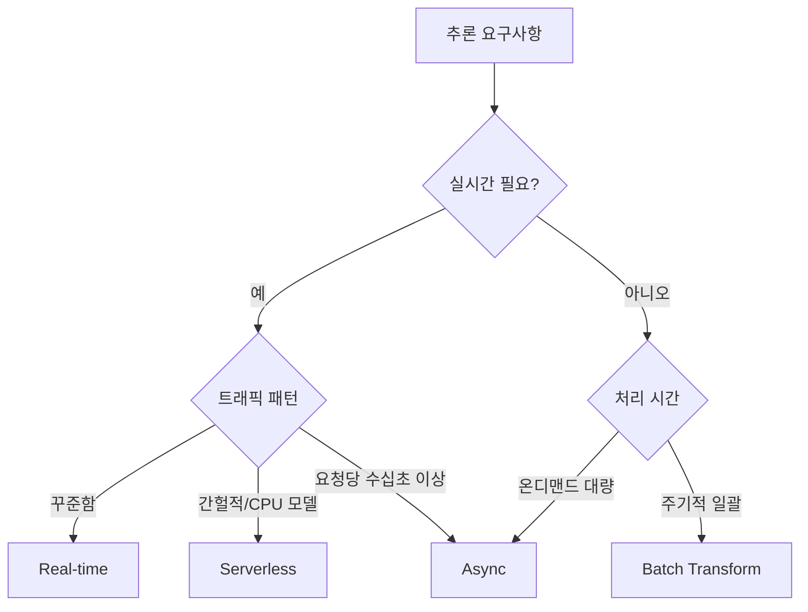

# Amazon SageMaker 실무 활용

## 들어가며

SageMaker를 처음 접했을 때 가장 혼란스러웠던 건 "이게 하나의 서비스인가, 플랫폼인가"라는 점이다. 실제로는 데이터 준비부터 학습, 배포, 모니터링까지 ML 전체 수명주기를 덮는 여러 하위 서비스의 집합이다. 이름 뒤에 붙는 접미사(Studio, Notebook, Training Job, Endpoint, Pipelines, Feature Store 등)가 각각 독립된 리소스다.

현실에서 SageMaker를 도입하면 단순히 "모델 학습 돌리는 환경" 수준으로만 쓰다가 비용이 예상보다 몇 배 나오거나, 엔드포인트를 띄워놓고 방치해서 월말에 청구서를 보고 놀라는 경우가 많다. 실무 관점에서 어떤 구성요소가 어떤 역할을 하고, 어디에서 돈이 새고, 어떤 함정에 빠지기 쉬운지를 정리했다.

## SageMaker 구성요소 개요

### Studio와 Notebook Instance의 차이

Studio는 웹 기반 IDE로 JupyterLab 3.x 기반에 SageMaker 기능을 통합한 것이다. Notebook Instance는 EC2 인스턴스 위에 Jupyter Server를 띄운 옛날 방식이다. 신규 프로젝트라면 Studio를 써야 한다. Notebook Instance는 인스턴스를 켜놓으면 요금이 계속 나가고, 커널 따로 컴퓨팅 따로 분리가 안 되어 리소스 낭비가 심하다.

Studio에서도 한 가지 주의점이 있는데, Jupyter Server 앱과 Kernel Gateway 앱이 별도로 과금된다. 노트북을 닫아도 커널이 살아 있으면 요금이 계속 나간다. Studio UI 좌측에서 "Running Instances and Kernels" 패널을 열어서 불필요한 커널을 직접 Shut down 해야 한다. 이걸 모르고 팀 전체가 Studio를 쓰다가 월 수백 달러씩 새는 경우를 자주 본다.

Idle shutdown을 강제하려면 lifecycle configuration script를 도메인에 붙여서 일정 시간 이상 유휴 상태인 앱을 자동 종료하게 설정해야 한다.

### Training Job

모델 학습을 실행하는 단위다. 학습 코드를 컨테이너 이미지로 만들거나 SageMaker가 제공하는 빌트인 이미지(PyTorch, TensorFlow, Hugging Face 등)를 쓴다. 학습이 시작되면 지정한 인스턴스가 프로비저닝되고, 학습이 끝나면 자동으로 종료되며 모델 아티팩트가 S3에 업로드된다.

핵심은 "학습 시간만큼만 돈을 낸다"는 점이다. 학습이 10분 걸리면 10분치만 과금된다. 그래서 비싼 GPU 인스턴스를 Notebook에 띄워놓고 학습하는 것보다, 개발은 저렴한 CPU 인스턴스에서 하고 학습만 Training Job으로 돌리는 게 훨씬 싸다.

### Endpoint (추론 엔드포인트)

학습된 모델을 HTTP API로 서빙하는 리소스다. 한번 만들면 인스턴스가 24시간 켜져 있어서 요청이 없어도 요금이 계속 나간다. 개발 중에 여러 모델을 실험한다고 엔드포인트를 여러 개 띄워놓고 잊어버리면 월말에 폭탄을 맞는다. 실험용 엔드포인트는 반드시 삭제 스크립트를 만들거나 태그 기반 자동 정리 람다를 돌려야 한다.

### Pipelines

SageMaker Pipelines는 학습·평가·등록·배포를 DAG로 정의하는 MLOps 도구다. Step Functions와 비슷하지만 ML에 특화된 스텝(ProcessingStep, TrainingStep, ModelStep 등)을 제공한다.

## 모델 배포 방식 4가지

SageMaker 엔드포인트는 용도에 따라 네 가지 모드가 있다. 각각 과금 방식이 달라서 이걸 잘못 고르면 비용이 2~10배 차이난다.

### Real-time Inference

가장 기본 형태. 인스턴스가 상시 떠 있고 HTTP 요청에 밀리초 단위로 응답한다. 레이턴시가 중요하고 트래픽이 꾸준한 경우에 쓴다. 인스턴스 시간당 과금이라 트래픽이 없어도 돈이 나간다.

```python
from sagemaker.pytorch import PyTorchModel

model = PyTorchModel(
    model_data="s3://my-bucket/model.tar.gz",
    role=role,
    framework_version="2.1",
    py_version="py310",
    entry_point="inference.py",
)

predictor = model.deploy(
    initial_instance_count=2,
    instance_type="ml.g5.xlarge",
    endpoint_name="my-model-endpoint",
)
```

### Serverless Inference

요청이 올 때만 컨테이너가 뜨고, 유휴 시 내려간다. Lambda와 비슷한 과금 모델로, 추론 요청 수와 컴퓨팅 시간만큼만 돈을 낸다. 트래픽이 간헐적이거나 예측 불가능할 때 좋다.

다만 콜드 스타트가 있다. 모델 크기가 크면 첫 요청이 수 초~수십 초 걸릴 수 있다. 큰 LLM을 Serverless로 올리면 거의 쓸 수 없는 수준이다. 현실적으로 모델 크기 수백 MB 이하의 경량 모델에만 쓴다.

```python
from sagemaker.serverless import ServerlessInferenceConfig

serverless_config = ServerlessInferenceConfig(
    memory_size_in_mb=4096,
    max_concurrency=20,
)

predictor = model.deploy(
    serverless_inference_config=serverless_config,
    endpoint_name="my-serverless-endpoint",
)
```

Serverless는 GPU를 지원하지 않는다. CPU 기반 모델(전통적인 ML, 작은 임베딩 모델 등)에만 쓸 수 있다.

### Asynchronous Inference

요청을 받아서 S3에 저장하고, 큐에 쌓아서 백그라운드로 처리한다. 처리 결과는 S3에 쓰고 SNS로 알림이 온다. 하나의 추론이 오래 걸리는 경우(수십 초~분 단위)에 쓴다. 타임아웃 없이 최대 1시간까지 처리 가능하다.

트래픽이 없을 때 인스턴스를 0으로 내릴 수 있다(Auto Scaling 최소값 0 설정 가능). 이게 Real-time과의 큰 차이다. Real-time은 최소 1 이상을 유지해야 한다.

### Batch Transform

엔드포인트를 만들지 않고, S3에 있는 대량의 데이터를 한 번에 추론한다. 배치 작업이 끝나면 인스턴스가 자동 종료된다. 예를 들어 매일 밤 전체 사용자에 대한 추천을 미리 계산해두는 경우에 쓴다.

Batch Transform은 엔드포인트 유지 비용이 없어서 대량 일괄 추론에서는 가장 저렴하다. "실시간이 필요한가?"를 팀이 진지하게 따져보면, 생각보다 많은 경우에 Batch Transform으로도 충분하다.

### 선택 기준



## Multi-Model Endpoint

모델이 수십 개 이상인데 각각 트래픽이 적은 경우, 엔드포인트를 모델마다 따로 만들면 비용이 감당이 안 된다. 모델 100개면 인스턴스 100개 이상을 상시 띄워야 한다.

Multi-Model Endpoint(MME)는 하나의 엔드포인트에 여러 모델을 올려두고, 요청 시 지정한 모델을 동적으로 로드한다. 자주 안 쓰는 모델은 메모리에서 언로드되고, 요청이 오면 S3에서 다시 로드한다.

```python
from sagemaker.multidatamodel import MultiDataModel

mme = MultiDataModel(
    name="tenant-models-mme",
    model_data_prefix="s3://my-bucket/tenant-models/",
    image_uri=container_uri,
    role=role,
)

predictor = mme.deploy(
    initial_instance_count=2,
    instance_type="ml.m5.xlarge",
    endpoint_name="tenant-models-endpoint",
)

response = predictor.predict(
    data=payload,
    target_model="tenant_42/model.tar.gz",
)
```

주의할 점이 있다. 첫 호출 시 S3에서 모델을 내려받아 메모리에 올리는 시간이 걸린다. 모델 크기가 수 GB면 이 콜드 로드가 수 초~수십 초 걸린다. 사용자가 기다릴 수 없는 레이턴시라면 자주 쓰이는 모델은 warming 요청을 주기적으로 보내서 메모리에 남겨야 한다.

또 모든 모델이 같은 컨테이너 이미지를 공유한다. 모델마다 프레임워크나 의존성이 다르면 Multi-Container Endpoint나 Inference Components를 써야 한다.

Multi-Model Endpoint는 B2B SaaS에서 테넌트별 모델을 서빙할 때 특히 잘 맞는다. 테넌트마다 모델이 다르지만 활성 테넌트는 전체의 일부라 대부분의 모델이 유휴 상태인 경우다.

## Auto Scaling

엔드포인트 뒤 인스턴스 수를 트래픽에 따라 자동으로 조정한다. Application Auto Scaling 서비스와 연동된다.

스케일링 메트릭으로 제일 흔히 쓰는 건 `SageMakerVariantInvocationsPerInstance`다. 인스턴스당 초당 요청 수로 기준을 잡는다.

```python
import boto3

client = boto3.client("application-autoscaling")

client.register_scalable_target(
    ServiceNamespace="sagemaker",
    ResourceId=f"endpoint/my-endpoint/variant/AllTraffic",
    ScalableDimension="sagemaker:variant:DesiredInstanceCount",
    MinCapacity=2,
    MaxCapacity=10,
)

client.put_scaling_policy(
    PolicyName="invocations-target",
    ServiceNamespace="sagemaker",
    ResourceId=f"endpoint/my-endpoint/variant/AllTraffic",
    ScalableDimension="sagemaker:variant:DesiredInstanceCount",
    PolicyType="TargetTrackingScaling",
    TargetTrackingScalingPolicyConfiguration={
        "TargetValue": 50.0,
        "PredefinedMetricSpecification": {
            "PredefinedMetricType": "SageMakerVariantInvocationsPerInstance",
        },
        "ScaleInCooldown": 300,
        "ScaleOutCooldown": 60,
    },
)
```

실무 주의사항 몇 가지가 있다.

**스케일 인 쿨다운을 짧게 잡으면 안 된다.** 트래픽이 잠깐 줄었다고 인스턴스를 빠르게 내리면, 다시 트래픽이 오를 때 콜드 스타트(새 인스턴스에 모델 로드)로 응답이 느려진다. 최소 5분 이상 둬야 한다.

**MinCapacity를 0으로 설정할 수 없다** (Real-time 엔드포인트의 경우). 트래픽이 0이어도 최소 1개 인스턴스는 떠 있어야 한다. 완전히 내리고 싶으면 Serverless나 Async를 쓰거나, Lambda로 야간에 엔드포인트 자체를 삭제하고 아침에 재생성하는 식으로 우회한다.

**GPU 인스턴스 스케일 아웃은 느리다.** GPU 인스턴스(ml.g5, ml.p4 등)는 풀이 제한적이라 스케일 아웃 요청이 들어와도 인스턴스를 얻기까지 수 분이 걸릴 수 있다. 피크 예측이 가능하면 Scheduled Scaling으로 미리 띄워놓는 게 낫다.

## 추론 비용 최적화

SageMaker 비용의 대부분은 엔드포인트 인스턴스 시간이다. 여기서 돈을 아끼는 방법을 순서대로 시도한다.

**인스턴스 타입을 다시 본다.** 초보자들이 무조건 `ml.g5.xlarge` 같은 비싼 GPU 인스턴스를 쓰는데, 모델이 작거나 CPU에서도 충분한 지연시간으로 돈다면 `ml.c6i`, `ml.m6i` 같은 CPU 인스턴스가 훨씬 싸다. CPU/GPU 둘 다 벤치마크를 돌려보고 결정해야 한다.

**Inferentia/Graviton을 고려한다.** AWS가 설계한 Inferentia 칩(ml.inf1, ml.inf2)은 GPU 대비 절반 이하 가격에 비슷한 추론 성능을 낸다. 단, 모델을 Neuron SDK로 컴파일해야 해서 초기 작업이 필요하다. Transformer 모델은 대부분 지원되지만, 커스텀 연산이 있으면 컴파일이 안 될 수 있다. Graviton 기반 ml.c7g, ml.m7g도 CPU 추론에서 비용 대비 성능이 좋다.

**Savings Plan을 건다.** 엔드포인트가 24시간 떠 있다면 SageMaker Savings Plan으로 40~60% 할인된다. 1년/3년 약정이고 약정한 인스턴스 시간만큼 할인 요금이 적용된다. 유휴 시간이 많은 개발용 엔드포인트에는 맞지 않는다.

**트래픽이 적으면 Serverless나 Async로 바꾼다.** 하루 수백 건 수준이면 Real-time을 유지할 이유가 없다.

**엔드포인트를 공유한다.** 모델이 여러 개면 Multi-Model Endpoint나 Inference Components로 하나의 인스턴스에 여러 모델을 올린다.

**Batch로 전환 가능한 것은 전환한다.** 일 1회 일괄 처리로 충분한 건 Batch Transform으로 돌린다.

## Pipelines로 MLOps 구성

Pipelines는 학습·평가·모델 등록·배포를 DAG로 묶는 도구다. Python SDK로 정의하고 실행 시점에 SageMaker가 각 스텝에 맞는 리소스를 띄운다.

```python
from sagemaker.workflow.pipeline import Pipeline
from sagemaker.workflow.steps import ProcessingStep, TrainingStep
from sagemaker.workflow.model_step import ModelStep
from sagemaker.workflow.condition_step import ConditionStep
from sagemaker.workflow.conditions import ConditionGreaterThan

preprocess_step = ProcessingStep(
    name="Preprocess",
    processor=sklearn_processor,
    code="preprocess.py",
    inputs=[ProcessingInput(source=raw_data_s3, destination="/opt/ml/processing/input")],
    outputs=[ProcessingOutput(output_name="train", source="/opt/ml/processing/train")],
)

train_step = TrainingStep(
    name="Train",
    estimator=estimator,
    inputs={
        "train": TrainingInput(
            s3_data=preprocess_step.properties.ProcessingOutputConfig.Outputs["train"].S3Output.S3Uri
        )
    },
)

evaluate_step = ProcessingStep(
    name="Evaluate",
    processor=sklearn_processor,
    code="evaluate.py",
    inputs=[
        ProcessingInput(
            source=train_step.properties.ModelArtifacts.S3ModelArtifacts,
            destination="/opt/ml/processing/model",
        ),
    ],
    property_files=[evaluation_report],
)

register_step = ModelStep(
    name="RegisterModel",
    step_args=model.register(
        content_types=["application/json"],
        response_types=["application/json"],
        inference_instances=["ml.m5.large"],
        model_package_group_name="my-model-group",
        approval_status="PendingManualApproval",
    ),
)

cond = ConditionGreaterThan(
    left=JsonGet(step_name="Evaluate", property_file=evaluation_report, json_path="metrics.accuracy"),
    right=0.85,
)

condition_step = ConditionStep(
    name="AccuracyCheck",
    conditions=[cond],
    if_steps=[register_step],
    else_steps=[],
)

pipeline = Pipeline(
    name="my-training-pipeline",
    steps=[preprocess_step, train_step, evaluate_step, condition_step],
)

pipeline.upsert(role_arn=role)
pipeline.start()
```

핵심은 Model Registry와의 연동이다. 학습된 모델을 Model Package로 등록하고 승인 상태를 PendingManualApproval로 두면, 자동 학습이 돌아도 사람이 승인하기 전까지는 프로덕션에 배포되지 않는다. 승인되면 EventBridge를 통해 배포 Lambda가 트리거되어 스테이징 엔드포인트 → 카나리 → 프로덕션 순으로 배포하는 식으로 구성한다.

Pipelines를 쓰다가 자주 겪는 문제는 캐싱이다. `cache_config`를 `enabled=True`로 두면 동일한 입력과 코드의 스텝은 이전 결과를 재사용한다. 빠른 반복에는 좋은데, 코드가 바뀌어도 캐시가 히트되는 경우가 가끔 있어서 의심되면 캐시를 꺼서 확인해야 한다.

## 실무에서 자주 놓치는 함정

### 인스턴스 타입 선택

인스턴스 타입은 학습과 추론을 분리해서 골라야 한다. 학습 때는 배치가 크고 메모리가 중요해서 GPU가 필요하지만, 추론 때는 배치가 1~수십 건이라 CPU로도 충분한 경우가 많다. 실무에서는 학습과 추론 모두 같은 `ml.g5.xlarge`를 쓰다가, 추론만 `ml.c6i.2xlarge`로 바꿔서 비용을 60% 줄인 사례가 흔하다.

메모리 기반 모델(큰 Transformer)은 `ml.g5` 시리즈의 GPU 메모리 크기를 잘 봐야 한다. `ml.g5.xlarge`는 A10G 24GB인데, 모델이 20GB면 KV 캐시까지 들어가면 OOM 난다. 그럴 땐 `ml.g5.2xlarge` (같은 A10G 24GB지만 CPU 메모리가 더 큼)로는 해결이 안 되고, `ml.g5.12xlarge` 이상(A10G 4장, 96GB)으로 가거나 모델을 양자화해야 한다.

Training Job에서 자주 쓰는 `ml.p3.2xlarge`는 V100 16GB인데, 최근 큰 모델에는 부족해서 `ml.p4d.24xlarge`(A100 40GB×8) 또는 `ml.p5.48xlarge`(H100 80GB×8)를 쓴다. 문제는 이 인스턴스들이 엄청나게 비싸고 (p5는 시간당 수십 달러) 쿼터 승인이 까다롭다.

### GPU 쿼터 문제

신규 계정이나 새 리전에서 GPU 인스턴스를 못 띄우는 경우가 많다. 기본 쿼터가 0인 경우도 있다. `ml.g5` 같은 흔한 인스턴스도 프로덕션용 여러 대를 한 번에 띄우려 하면 쿼터가 부족하다.

Service Quotas 콘솔에서 `Amazon SageMaker`를 검색하고, 인스턴스 타입별 "for endpoint usage"와 "for training job usage"를 따로 찾아야 한다. 쿼터 승인은 평균 수 시간~1영업일 걸리고, 큰 수량은 며칠 걸리기도 한다. 프로덕션 배포 일정이 급하면 미리 여유 있게 올려놔야 한다.

리전별로 쿼터가 독립이라는 점도 주의해야 한다. `us-east-1`에서 잘 돌던 게 `ap-northeast-2`에서는 쿼터 부족으로 안 돌아가는 경우가 많다.

### IAM 역할 혼란

SageMaker는 실행 역할(execution role)이 필수고, 이 역할에 S3 접근·ECR 접근·CloudWatch Logs 쓰기 권한이 있어야 한다. 처음 쓰는 사람들은 Studio 로그인 계정의 권한과 실행 역할을 헷갈린다. 학습 Job이 S3에서 데이터를 못 읽는다고 나오면 대부분 실행 역할의 S3 권한 문제다.

특히 KMS로 암호화된 S3 버킷을 쓰면 실행 역할에 해당 KMS 키의 Decrypt 권한도 줘야 한다. 이걸 놓쳐서 원인 파악에 시간을 쓰는 경우가 많다.

### 학습 데이터 전송 비용과 시간

S3에서 학습 인스턴스로 데이터를 가져오는 방식이 세 가지다.

- File mode: 학습 시작 시 전체 데이터를 인스턴스로 내려받는다. 작은 데이터에 적합.
- Pipe mode: 스트리밍으로 받으면서 학습한다. 대용량에 유리하지만 프레임워크가 지원해야 한다.
- FastFile mode: POSIX 파일시스템처럼 마운트해서 필요한 부분만 읽는다. 대용량에 가장 쓰기 편하다.

수십~수백 GB 데이터를 File mode로 쓰면 학습 시작 전에 데이터 다운로드만 수십 분 걸린다. 이 시간도 인스턴스 과금에 포함된다. FastFile mode나 FSx for Lustre를 고려해야 한다.

### CloudWatch Logs 비용

학습 Job과 엔드포인트 모두 로그를 CloudWatch Logs로 보낸다. 추론 로그를 너무 상세하게 남기면(요청/응답 전체 dump 등) 로그 수집·저장 비용이 추론 비용만큼 나오는 경우가 있다. 실제로 만난 사례 중에 로그 비용이 엔드포인트 비용의 1.5배가 나온 경우도 있었다.

로그 보존 기간을 필요한 만큼만 설정하고, 상세 로그는 조건부로 남기거나 샘플링해야 한다.

### 엔드포인트 업데이트 시 다운타임

`UpdateEndpoint`로 모델을 업데이트할 때 SageMaker가 새 인스턴스를 먼저 띄우고 트래픽을 옮긴 뒤 기존 인스턴스를 내린다. 이 과정이 보통 수 분~10분 이상 걸린다. 트래픽이 몰리는 시간대에 업데이트하면 일시적으로 인스턴스가 2배로 떠서 비용이 튄다.

Blue/Green 배포, 카나리 배포를 위해 `BlueGreenUpdatePolicy`와 트래픽 시프팅 설정을 쓸 수 있다. 자동 롤백 조건(알람 발동 시 롤백)도 함께 설정해두면 사고를 줄인다.

## 정리

SageMaker는 편리한 만큼 비용이 쉽게 튀는 서비스다. 엔드포인트를 띄울 때는 트래픽 패턴과 레이턴시 요구사항을 먼저 확인해서 Real-time, Serverless, Async, Batch Transform 중 맞는 것을 골라야 한다. 인스턴스 타입은 학습용과 추론용을 분리해서 고르고, CPU로도 충분한지 반드시 검토한다. GPU 쿼터는 미리 신청해두고, 리전별로 별개라는 점을 잊지 말아야 한다.

MLOps를 꾸리려면 Pipelines + Model Registry로 학습-승인-배포를 분리해야 한다. 수동 승인 게이트를 두면 자동 학습이 폭주해도 프로덕션에 잘못된 모델이 배포되는 사고를 막을 수 있다. Studio의 유휴 커널 종료, 엔드포인트 태그 기반 정리, Savings Plan 적용은 운영 초기에 챙겨두면 매달 수백 달러 이상을 아낄 수 있는 기본기다.
