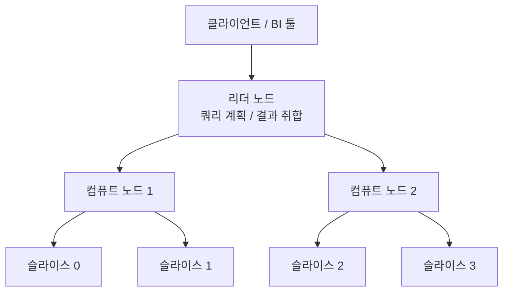

# AWS Redshift (데이터 웨어하우스)

## 개요

Redshift는 AWS의 데이터 웨어하우스다. 분석 쿼리 전용으로 만들어진 데이터베이스로, 수십억 건의 데이터를 스캔하면서 집계하는 작업에 맞춰져 있다.

RDS나 MySQL을 쓰던 사람이 Redshift를 처음 보면 PostgreSQL과 비슷하다고 느낀다. 실제로 Redshift는 PostgreSQL 8.0.2 기반이고, 접속도 psql로 한다. 그런데 안에서 데이터를 다루는 방식이 완전히 다르다. RDS는 행(row) 단위로 데이터를 저장하고, Redshift는 컬럼(column) 단위로 저장한다. 이 차이 하나가 모든 설계 판단의 출발점이 된다.

### OLTP와 OLAP의 차이

RDS 같은 일반 RDBMS는 OLTP(Online Transaction Processing)에 맞다. 주문 한 건 넣고, 회원 한 명 조회하고, 재고 하나 차감하는 작업이다. 한 번에 적은 행을 다루고, 응답은 밀리초 단위여야 한다.

Redshift는 OLAP(Online Analytical Processing)에 맞다. "지난 1년간 카테고리별 월 매출 추이"처럼 수억 행을 읽어서 GROUP BY로 묶는 작업이다. 한 쿼리가 몇 초에서 몇 분 걸려도 되지만, 대신 엄청난 양을 한 번에 처리한다.

이 둘을 한 데이터베이스에서 같이 돌리면 둘 다 느려진다. 분석 쿼리가 OLTP 데이터베이스의 버퍼 캐시를 다 밀어내고 CPU를 점유하기 때문이다. 운영 DB에서 무거운 통계 쿼리 돌렸다가 주문 API 응답 시간이 튀는 경험을 한 번이라도 했다면, 이게 Redshift를 분리해서 쓰는 이유다.

### 컬럼 기반 저장이 왜 빠른가

매출 합계를 구한다고 하자. 테이블에 컬럼이 30개 있어도 SUM(amount)에 필요한 건 amount 컬럼 하나뿐이다.

행 기반 저장은 한 행을 통째로 디스크에 붙여 저장한다. amount만 필요해도 나머지 29개 컬럼이 같은 블록에 섞여 있어서 디스크에서 다 읽어 올라온다.

컬럼 기반 저장은 amount 값만 한 군데 모아둔다. SUM(amount)를 돌리면 amount 컬럼 블록만 읽는다. 읽는 데이터양이 30분의 1로 줄어든다. 같은 컬럼 값끼리 모여 있으니 압축률도 높다. 정수형 amount가 비슷한 값으로 줄지어 있으면 압축이 잘 먹어서 디스크 I/O가 한 번 더 줄어든다.

대신 단점도 분명하다. 한 행 전체를 INSERT하려면 30개 컬럼 블록에 각각 써야 한다. 그래서 Redshift는 행 하나씩 INSERT하는 작업에 약하다. 뒤에서 다룰 COPY로 대량 적재하는 이유가 여기 있다.

## 노드 구조와 RA3

### 리더 노드와 컴퓨트 노드

Redshift 클러스터는 리더 노드 1개와 컴퓨트 노드 여러 개로 구성된다.

리더 노드는 쿼리를 받아서 실행 계획을 짜고, 각 컴퓨트 노드에 작업을 나눠준다. 클라이언트가 접속하는 엔드포인트도 리더 노드다. 리더 노드는 데이터를 저장하지 않는다.

컴퓨트 노드가 실제 데이터를 저장하고 쿼리를 실행한다. 각 컴퓨트 노드는 다시 슬라이스(slice)로 나뉜다. 노드의 CPU와 메모리를 슬라이스 개수만큼 쪼갠 단위다. 데이터는 이 슬라이스 단위로 분산되고, 쿼리도 슬라이스마다 병렬로 돈다. 슬라이스가 32개면 32개가 동시에 자기 몫의 데이터를 처리한다.



슬라이스 개수를 알아야 분산키 설계가 된다. 데이터가 슬라이스에 어떻게 흩어지느냐가 성능을 결정하기 때문이다.

### RA3와 매니지드 스토리지

예전 Redshift 노드 타입은 DC2였다. DC2는 컴퓨팅과 스토리지가 한 노드에 묶여 있다. 데이터가 늘어서 디스크가 차면, 데이터를 더 넣으려고 노드를 추가해야 한다. 컴퓨팅 파워는 충분한데 저장 공간이 부족하다는 이유로 노드를 늘리면 돈만 더 나간다.

RA3는 컴퓨팅과 스토리지를 분리했다. 데이터는 Redshift Managed Storage(RMS)라는 S3 기반 저장소에 들어가고, 노드의 로컬 SSD는 캐시로 쓴다. 자주 쓰는 데이터는 SSD에 두고, 안 쓰는 데이터는 S3에 둔다. Redshift가 알아서 옮긴다.

이 분리 덕분에 노드 개수는 필요한 컴퓨팅 파워에 맞춰서 정하고, 저장 용량은 따로 늘어난다. 스토리지는 실제 사용한 만큼 GB 단위로 과금된다. 데이터가 많아도 쿼리 부하가 낮으면 노드를 적게 유지할 수 있다.

새로 시작한다면 RA3를 고른다. DC2는 데이터가 아주 적고(수백 GB 이하) 비용을 극단적으로 아껴야 하는 경우에만 의미가 있다. RA3 최소 사양은 ra3.xlplus다.

## DISTKEY — 분산키

### 데이터를 슬라이스에 어떻게 나눌 것인가

테이블을 만들 때 행을 어느 슬라이스에 넣을지 정하는 게 분산 스타일이다. 분산 스타일을 잘못 잡으면 조인 한 번에 노드 간 네트워크로 데이터가 통째로 오가면서 쿼리가 몇 배씩 느려진다.

분산 스타일은 네 가지다.

**KEY 분산**: 지정한 컬럼(DISTKEY) 값을 해시해서 슬라이스를 정한다. 같은 키 값은 항상 같은 슬라이스로 간다.

**EVEN 분산**: 행을 슬라이스에 순서대로 골고루 뿌린다. 키와 무관하다.

**ALL 분산**: 테이블 전체를 모든 노드에 복제한다. 작은 테이블 전용이다.

**AUTO 분산**: Redshift가 테이블 크기를 보고 ALL이나 EVEN을 자동으로 고른다. 기본값이다.

### KEY 분산과 조인 성능

핵심은 조인이다. 두 테이블을 조인할 때, 조인 키가 서로 다른 슬라이스에 흩어져 있으면 한쪽 데이터를 다른 노드로 다 옮긴 다음에 조인해야 한다. 이걸 데이터 재분배(redistribution)라고 하고, 큰 테이블에서 일어나면 쿼리가 느려지는 가장 흔한 원인이다.

orders와 order_items를 order_id로 자주 조인한다고 하자. 둘 다 DISTKEY를 order_id로 잡으면, 같은 order_id를 가진 행이 양쪽 테이블에서 같은 슬라이스에 모인다. 조인할 때 네트워크 이동 없이 각 슬라이스가 자기 데이터끼리 조인하면 된다. 이걸 collocated join이라고 부른다.

```sql
CREATE TABLE orders (
    order_id      BIGINT,
    customer_id   BIGINT,
    order_date    DATE,
    total_amount  DECIMAL(12,2)
)
DISTSTYLE KEY
DISTKEY (order_id)
SORTKEY (order_date);

CREATE TABLE order_items (
    item_id    BIGINT,
    order_id   BIGINT,
    product_id BIGINT,
    quantity   INT,
    price      DECIMAL(10,2)
)
DISTSTYLE KEY
DISTKEY (order_id)
SORTKEY (order_id);
```

DISTKEY를 고를 때 보는 건 두 가지다. 첫째, 조인에 가장 자주 쓰는 컬럼인가. 둘째, 값의 분포가 고른가. customer_id로 분산했는데 특정 대형 고객 한 명의 주문이 전체의 30%라면, 그 고객 데이터가 다 한 슬라이스로 몰린다. 이걸 데이터 스큐(skew)라고 하고, 한 슬라이스만 일하고 나머지는 노는 상태가 된다. 카디널리티가 높고 분포가 고른 컬럼을 DISTKEY로 잡아야 한다.

### ALL 분산은 차원 테이블에

ALL 분산은 테이블 전체를 모든 노드에 복사한다. 차원 테이블(dimension table)처럼 작고 자주 조인되는 테이블에 쓴다. 예를 들어 카테고리 마스터, 지역 코드, 상품 분류표 같은 것들이다.

```sql
CREATE TABLE dim_category (
    category_id   INT,
    category_name VARCHAR(100),
    parent_id     INT
)
DISTSTYLE ALL;
```

큰 팩트 테이블이 이 차원 테이블과 조인할 때, 차원 테이블이 모든 노드에 이미 있으니 재분배가 안 일어난다. 단점은 저장 공간이다. 노드가 10개면 10배로 저장된다. 행이 수백만을 넘어가는 테이블에 ALL을 걸면 저장 공간이 폭발하고 적재도 느려진다. 수만 행 이하의 작은 테이블에만 쓴다.

### 분산 스타일별 정리

| 분산 스타일 | 동작 | 쓰는 곳 |
|---|---|---|
| KEY | DISTKEY 컬럼 해시로 분산 | 자주 조인하는 큰 팩트 테이블 |
| ALL | 모든 노드에 복제 | 작은 차원 테이블 |
| EVEN | 골고루 분산, 키 무관 | 조인 안 하거나 명확한 키가 없을 때 |
| AUTO | Redshift가 자동 선택 | 판단이 안 설 때의 기본값 |

처음에는 AUTO로 두고 운영하면서 무거운 조인 쿼리의 패턴을 보고 KEY로 바꾸는 식으로 접근하면 된다. 처음부터 모든 테이블에 DISTKEY를 박으려고 하면 오히려 스큐가 생긴다.

## SORTKEY — 정렬키

### 정렬키와 블록 스킵

SORTKEY는 디스크에 데이터를 저장하는 물리적 순서를 정한다. order_date를 SORTKEY로 잡으면 데이터가 날짜순으로 디스크에 깔린다.

Redshift는 각 블록(1MB)마다 그 블록에 들어 있는 값의 최소/최대를 존 맵(zone map)이라는 메타데이터로 들고 있다. `WHERE order_date >= '2026-01-01'` 같은 조건이 들어오면, 존 맵을 보고 그 범위에 해당 없는 블록은 아예 읽지 않고 건너뛴다. 이걸 블록 스킵이라고 한다.

날짜로 필터링하는 쿼리가 많다면 SORTKEY를 날짜로 잡는다. 1년치 데이터에서 최근 1주일만 조회하면 나머지 51주 블록은 스캔조차 안 한다. 정렬이 안 된 테이블이면 전체를 다 읽으면서 조건을 일일이 비교해야 한다.

```sql
-- 시간 범위 필터가 잦은 로그 테이블
CREATE TABLE event_log (
    event_id    BIGINT,
    user_id     BIGINT,
    event_type  VARCHAR(50),
    created_at  TIMESTAMP
)
DISTKEY (user_id)
SORTKEY (created_at);
```

### COMPOUND와 INTERLEAVED

SORTKEY에는 두 종류가 있다.

COMPOUND는 기본값이다. 지정한 컬럼 순서대로 정렬한다. `SORTKEY (a, b)`면 a로 먼저 정렬하고 같은 a 안에서 b로 정렬한다. 첫 번째 컬럼으로 필터링할 때 가장 효과가 크고, 뒤쪽 컬럼만 단독으로 필터링하면 효과가 떨어진다. 대부분의 경우 COMPOUND로 충분하다.

INTERLEAVED는 여러 컬럼에 동일한 가중치를 준다. 어떤 컬럼으로 필터링하든 비슷하게 작동한다. 다만 적재할 때 정렬 비용이 크고 VACUUM REINDEX가 무겁다. 필터 컬럼이 진짜 예측 불가능하게 여러 개인 경우가 아니면 굳이 쓰지 않는다. 실무에서는 COMPOUND를 기본으로 두고 거의 그대로 간다.

### DISTKEY와 SORTKEY를 같이 보기

둘은 역할이 다르다. DISTKEY는 데이터를 슬라이스에 어떻게 나눌지(조인 성능), SORTKEY는 각 슬라이스 안에서 어떻게 정렬할지(필터 성능)를 정한다.

전형적인 조합은 이렇다. 팩트 테이블은 조인 키를 DISTKEY로, 시간 컬럼을 SORTKEY로 잡는다. 조인할 때 재분배가 안 일어나고, 시간 범위 필터에서 블록 스킵이 먹는다. 위의 event_log 예제가 그 패턴이다.

## VACUUM과 ANALYZE

### 왜 필요한가

Redshift는 DELETE를 해도 데이터를 바로 지우지 않는다. 삭제 표시만 해두고 디스크에는 남겨둔다. UPDATE도 내부적으로는 기존 행을 삭제 표시하고 새 행을 추가하는 식이다. 이렇게 삭제 표시만 된 행이 쌓이면 디스크 공간을 차지하고, 스캔할 때 같이 읽혀서 쿼리가 느려진다.

또 COPY로 새 데이터를 적재하면, 그 데이터는 정렬 영역(sorted region) 뒤쪽의 미정렬 영역(unsorted region)에 그냥 붙는다. SORTKEY 순서가 깨진다. 미정렬 영역이 커지면 존 맵 기반 블록 스킵이 안 먹어서 SORTKEY 효과가 사라진다.

VACUUM은 이 두 가지를 정리한다. 삭제 표시된 행을 실제로 제거하고(공간 회수), 미정렬 영역을 다시 정렬해서 SORTKEY 순서로 되돌린다.

```sql
-- 삭제된 행 정리 + 재정렬
VACUUM FULL event_log;

-- 재정렬만 (공간 회수 생략, 더 빠름)
VACUUM SORT ONLY event_log;

-- 공간 회수만
VACUUM DELETE ONLY event_log;
```

### ANALYZE는 통계

ANALYZE는 다른 작업이다. 옵티마이저가 실행 계획을 짤 때 쓰는 통계 정보를 갱신한다. 테이블에 행이 몇 개인지, 컬럼 값의 분포가 어떤지 같은 정보다. 통계가 낡으면 옵티마이저가 잘못된 계획을 짠다. 작은 테이블인 줄 알고 다른 큰 테이블을 그쪽으로 재분배하는 식의 비효율이 생긴다.

```sql
ANALYZE event_log;
```

### 운영에서 주의할 점

요즘 Redshift는 자동 VACUUM과 자동 ANALYZE가 백그라운드로 돈다. 클러스터가 한가할 때 알아서 정리한다. 그래서 예전처럼 매일 밤 수동 VACUUM 크론을 돌릴 필요는 줄었다.

그런데 자동 VACUUM이 못 따라가는 경우가 있다. 매일 수억 행을 COPY로 적재하고 동시에 대량 DELETE를 돌리는 테이블이라면 미정렬 영역이 자동 VACUUM 속도보다 빨리 쌓인다. 이럴 때는 적재가 끝난 시간대에 수동으로 VACUUM을 걸어준다.

VACUUM은 무거운 작업이다. FULL VACUUM은 테이블을 다시 쓰다시피 하니까 디스크 I/O와 시간이 많이 든다. 운영 쿼리가 적은 시간대에 돌린다. 그리고 `svv_table_info` 뷰의 unsorted 컬럼을 보고 미정렬 비율이 높은 테이블만 골라서 VACUUM하면 된다. 멀쩡한 테이블까지 다 돌릴 이유는 없다.

```sql
-- 미정렬 비율 높은 테이블 확인
SELECT "table", size, unsorted, stats_off
FROM svv_table_info
ORDER BY unsorted DESC;
```

unsorted가 0에 가까우면 정렬 상태가 좋은 것이고, 20%를 넘어가면 VACUUM 대상으로 본다. stats_off가 높으면 ANALYZE가 필요하다는 뜻이다.

DELETE를 자주 할 거면 처음부터 설계를 바꾸는 게 낫다. 오래된 데이터를 지우는 패턴이라면, 행을 DELETE하는 대신 날짜별로 테이블을 나누거나, 적재 시점에 보존 기간이 지난 데이터를 통째로 다시 만드는 방식이 VACUUM 부담을 줄인다.

## COPY로 대량 적재

### INSERT 대신 COPY

Redshift에 데이터를 넣을 때 INSERT 문을 한 줄씩 날리면 안 된다. 컬럼 기반 저장 구조상 행 하나 INSERT가 매우 비싸다. 1만 건을 INSERT 1만 번으로 넣으면 몇 분씩 걸리고 클러스터에 부하만 준다.

대량 적재는 COPY 명령으로 한다. COPY는 S3에 올려둔 파일을 읽어서 여러 슬라이스가 병렬로 적재한다.

```sql
COPY event_log
FROM 's3://my-bucket/events/2026-05-27/'
IAM_ROLE 'arn:aws:iam::123456789012:role/RedshiftCopyRole'
FORMAT AS PARQUET;
```

CSV나 JSON도 되지만 Parquet 같은 컬럼 포맷이 적재 속도와 압축에서 유리하다.

### 파일을 쪼개야 병렬이 먹는다

여기서 가장 많이 하는 실수가 큰 파일 하나로 COPY하는 것이다. 10GB짜리 단일 파일을 COPY하면, 슬라이스가 32개여도 파일이 하나라서 한 슬라이스만 읽는다. 나머지 31개는 논다.

COPY가 병렬로 일하려면 파일이 슬라이스 개수의 배수로 쪼개져 있어야 한다. 슬라이스가 32개면 파일을 32개 또는 64개로 나눈다. 각 파일 크기는 압축 기준 1MB에서 1GB 사이가 권장된다. 그러면 32개 슬라이스가 각자 파일을 하나씩 잡아서 동시에 적재한다.

데이터 파이프라인에서 S3로 떨군 파일이 어쩌다 하나로 합쳐져 있으면 적재 시간이 몇 배로 늘어난다. 적재가 느리다는 얘기가 나오면 S3에 떨어진 파일이 몇 개인지부터 확인한다.

### COPY에서 자주 터지는 문제

**타입 불일치와 길이 초과**: 소스 데이터의 문자열이 컬럼에 정의한 VARCHAR 길이보다 길면 COPY가 행을 거부한다. 한글이 섞여 있으면 더 자주 겪는다. Redshift는 VARCHAR 길이를 바이트로 센다. UTF-8에서 한글 한 글자는 3바이트라서, VARCHAR(10)에 한글 10자(30바이트)를 넣으려다 거부된다. 컬럼 길이를 바이트 기준으로 넉넉히 잡는다.

**일부 행만 실패**: COPY는 기본적으로 오류가 일정 개수를 넘으면 전체를 롤백한다. 어떤 행이 왜 실패했는지는 `stl_load_errors` 뷰를 봐야 한다.

```sql
SELECT starttime, filename, line_number, colname, err_reason
FROM stl_load_errors
ORDER BY starttime DESC
LIMIT 20;
```

err_reason에 "String length exceeds DDL length"나 "Invalid digit" 같은 메시지가 찍힌다. 어느 파일 몇 번째 줄인지까지 나오니 원본을 찾아 고친다.

**중복 적재**: COPY는 멱등(idempotent)하지 않다. 같은 파일을 두 번 COPY하면 데이터가 두 배가 된다. 적재 실패 후 재시도할 때 이미 일부가 들어간 상태에서 다시 돌리면 중복이 생긴다. 적재를 스테이징 테이블에 먼저 하고, 거기서 검증한 다음 본 테이블로 옮기는 방식으로 막는다. 또는 적재 단위(보통 날짜 파티션)를 먼저 DELETE하고 COPY하는 패턴을 쓴다.

```sql
-- 멱등 적재 패턴
BEGIN;
DELETE FROM event_log WHERE created_at::date = '2026-05-27';
COPY event_log
FROM 's3://my-bucket/events/2026-05-27/'
IAM_ROLE 'arn:aws:iam::123456789012:role/RedshiftCopyRole'
FORMAT AS PARQUET;
COMMIT;
```

이렇게 하면 같은 날짜를 몇 번 재시도해도 결과가 같다.

## WLM — 동시 쿼리 슬롯 튜닝

### 왜 동시 실행을 제한하나

Redshift는 메모리를 쿼리에 나눠준다. 큰 집계나 정렬, 조인은 메모리를 많이 쓰고, 메모리가 부족하면 디스크로 넘쳐서(disk-based operation) 쿼리가 급격히 느려진다. 그래서 동시에 몇 개의 쿼리를 돌릴지, 각 쿼리에 메모리를 얼마나 줄지를 관리하는 게 WLM(Workload Management)이다.

WLM은 큐(queue)와 슬롯(slot)으로 동작한다. 큐는 메모리 한 덩어리이고, 슬롯은 그 큐 안에서 동시에 돌 수 있는 쿼리 수다. 큐 메모리가 100%이고 슬롯이 5개면, 쿼리 하나당 메모리의 20%를 받고 최대 5개가 동시에 돈다. 6번째 쿼리는 슬롯이 빌 때까지 대기한다.

여기에 트레이드오프가 있다. 슬롯을 늘리면 동시에 더 많은 쿼리가 돌지만, 쿼리당 메모리가 줄어서 큰 쿼리가 디스크로 넘친다. 슬롯을 줄이면 쿼리당 메모리는 늘지만 동시 처리량이 떨어져서 대기 줄이 길어진다. 워크로드에 맞춰 잡아야 한다.

### Auto WLM과 Manual WLM

요즘 기본은 Auto WLM이다. Redshift가 쿼리를 보고 동시 실행 수와 메모리를 알아서 조절한다. 대부분의 경우 Auto WLM으로 시작하는 게 맞다. 직접 슬롯 개수와 메모리 비율을 계산하는 것보다 잘 맞춘다.

Manual WLM은 큐를 직접 나누고 슬롯과 메모리를 손으로 정한다. 워크로드 종류가 명확하게 갈리고, 특정 워크로드에 자원을 보장해야 할 때 쓴다. 예를 들어 ETL 적재 큐와 BI 대시보드 조회 큐를 분리해서, 무거운 ETL이 돌아도 대시보드 응답은 보장하는 식이다.

큐 분리는 보통 사용자 그룹이나 쿼리 그룹으로 라우팅한다. ETL 작업용 계정은 ETL 큐로, 대시보드 계정은 조회 큐로 보낸다.

### 동시성 스케일링과 SQA

대기 줄이 문제라면 동시성 스케일링(Concurrency Scaling)을 켠다. 동시 쿼리가 몰려서 큐에 줄이 생기면, Redshift가 임시 클러스터를 자동으로 띄워서 대기 쿼리를 그쪽으로 보낸다. 부하가 빠지면 임시 클러스터는 사라진다. BI 대시보드처럼 특정 시간대에 조회가 몰리는 패턴에 잘 맞는다. 하루 일정 시간만큼 무료 크레딧이 있고 그 이상은 과금된다.

SQA(Short Query Acceleration)는 짧은 쿼리를 별도 경로로 빨리 처리한다. 무거운 쿼리 뒤에 가벼운 쿼리가 줄 서서 기다리는 상황을 줄인다.

### 큐가 막혔는지 확인

쿼리가 느리다는 얘기가 나오면 실행이 느린 건지 큐에서 기다린 건지부터 구분한다.

```sql
-- 큐 대기 시간과 실행 시간 분리해서 확인
SELECT query, service_class,
       total_queue_time / 1000000.0 AS queue_sec,
       total_exec_time  / 1000000.0 AS exec_sec
FROM stl_wlm_query
WHERE service_class > 4
ORDER BY total_queue_time DESC
LIMIT 20;
```

queue_sec가 크면 동시 실행 자리가 부족한 것이니 동시성 스케일링이나 슬롯 조정을 본다. exec_sec가 크면 쿼리 자체가 무거운 것이니 분산키/정렬키 설계나 쿼리를 손봐야 한다. 이 둘을 구분 안 하고 무작정 슬롯만 늘리면 오히려 더 느려질 수 있다.

## Redshift Spectrum — S3 직접 쿼리

### 적재하지 않고 쿼리

Spectrum은 S3에 있는 파일을 Redshift로 적재하지 않고 그 자리에서 SQL로 조회한다. S3의 데이터를 외부 테이블(external table)로 정의해두면 일반 테이블처럼 SELECT가 된다. 조인도 된다. 클러스터 안의 테이블과 S3의 외부 테이블을 한 쿼리에서 같이 조인할 수 있다.

외부 테이블 정의는 외부 스키마로 만든다. 메타데이터는 AWS Glue 데이터 카탈로그에 둔다.

```sql
-- 외부 스키마 생성
CREATE EXTERNAL SCHEMA spectrum_schema
FROM DATA CATALOG
DATABASE 'spectrum_db'
IAM_ROLE 'arn:aws:iam::123456789012:role/RedshiftSpectrumRole'
CREATE EXTERNAL DATABASE IF NOT EXISTS;

-- 외부 테이블 생성
CREATE EXTERNAL TABLE spectrum_schema.access_log (
    request_time TIMESTAMP,
    user_id      BIGINT,
    url          VARCHAR(500),
    status_code  INT
)
STORED AS PARQUET
LOCATION 's3://my-bucket/access-logs/';
```

이제 클러스터 안의 user 테이블과 S3의 로그를 같이 조인할 수 있다.

```sql
SELECT u.user_name, count(*) AS hits
FROM spectrum_schema.access_log a
JOIN users u ON a.user_id = u.user_id
WHERE a.request_time >= '2026-05-01'
GROUP BY u.user_name;
```

### 언제 쓰나, 과금은 어떻게

Spectrum이 맞는 경우는 자주 안 보지만 가끔 조회해야 하는 대용량 데이터다. 몇 년치 원본 로그를 Redshift 스토리지에 다 넣으면 비싸고 클러스터도 무거워진다. 그런 데이터는 S3에 Parquet로 두고 Spectrum으로 필요할 때만 조회한다. 자주 쓰는 최근 데이터만 Redshift 테이블에 적재하고, 오래된 데이터는 S3에 두는 식으로 나눈다.

Spectrum 과금은 스캔한 데이터양 기준이다. 쿼리가 S3에서 읽은 바이트만큼 돈을 낸다. 그래서 S3 파일을 Parquet 같은 컬럼 포맷으로 두고, 날짜 같은 기준으로 파티셔닝해두는 게 비용에 직결된다. 파티션이 잘 잡혀 있으면 `WHERE` 조건에 해당하는 파티션만 스캔한다. 파티션 없이 CSV로 통째로 두면 매 쿼리가 전체를 스캔해서 돈이 샌다.

자주 조인하고 반복 조회하는 데이터라면 Spectrum보다 Redshift 테이블에 적재하는 게 빠르고 싸다. Spectrum은 어디까지나 가끔 보는 대용량 데이터를 위한 것이다.

## RDS와 언제 분리하나

### 처음부터 Redshift를 쓰지는 않는다

서비스 초기에는 RDS 하나로 충분하다. 데이터가 수백만 행 수준이고, 통계 쿼리도 RDS에서 인덱스 잘 걸고 적당히 돌리면 된다. 이 단계에서 Redshift를 도입하면 운영 부담만 늘고 비용도 아깝다. Redshift는 최소 사양도 RDS 작은 인스턴스보다 비싸다.

분리를 고민해야 하는 신호는 이런 것들이다.

**운영 DB에서 분석 쿼리 때문에 장애가 난다**: 마케팅팀이 월말에 집계 쿼리를 돌리면 주문 API가 느려진다. 무거운 GROUP BY가 운영 DB의 자원을 잡아먹는다. 이게 반복되면 분석 부하를 떼어내야 한다.

**스캔량이 인덱스로 감당이 안 된다**: 분석 쿼리는 보통 넓은 범위를 훑는다. "지난 1년 전 카테고리 매출"같은 쿼리는 인덱스를 타도 결국 대부분의 행을 읽는다. 행 기반 RDS에서는 이게 디스크 I/O로 직결돼서 느리다. 수억 행을 정기적으로 풀 스캔하는 분석이 생기면 컬럼 기반 Redshift가 맞다.

**여러 소스를 합쳐서 분석한다**: 주문 DB, 사용자 DB, 로그가 따로 있는데 이걸 합쳐서 봐야 한다. 운영 DB마다 흩어진 데이터를 한 곳에 모아 분석하는 게 데이터 웨어하우스의 본래 역할이다.

### 판단 기준 정리

| 상황 | 적합한 선택 |
|---|---|
| 행 단위 조회/수정이 주력, 밀리초 응답 필요 | RDS |
| 데이터 수백만 행, 분석도 RDS로 감당 | RDS |
| 분석 쿼리가 운영 DB 성능을 갉아먹음 | Redshift로 분리 |
| 수억~수십억 행을 정기적으로 집계 | Redshift |
| 여러 소스 데이터를 통합 분석 | Redshift |
| 가끔 보는 대용량 원본 로그 | S3 + Spectrum |

운영 DB와 Redshift는 보통 같이 쓴다. 트랜잭션은 RDS에서 받고, 그 데이터를 주기적으로 Redshift로 옮겨서(DMS, Kinesis, S3 경유 COPY 등) 분석한다. Redshift가 RDS를 대체하는 게 아니라 분석 부하를 떼어 가는 관계다.

도입 순서는 RDS로 시작해서, 분석 부하가 운영을 방해하는 시점에 Redshift를 붙이는 흐름이 자연스럽다. 처음부터 Redshift를 깔아두고 트랜잭션까지 거기서 처리하려고 하면 양쪽 다 안 맞는 도구를 억지로 쓰는 셈이 된다.
