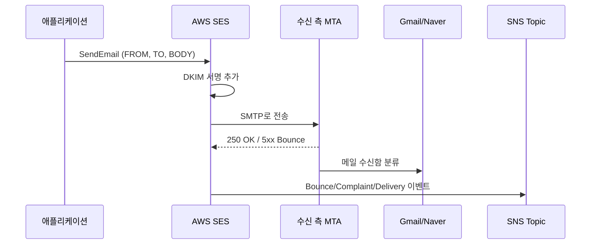
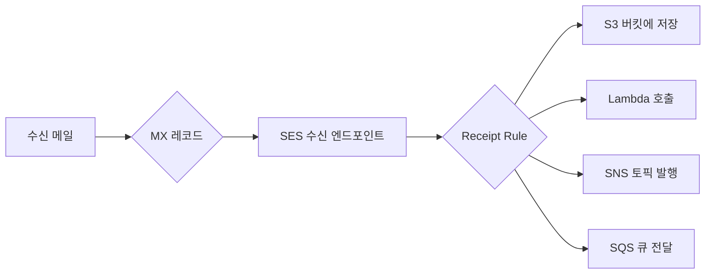

# AWS SES (Simple Email Service) 완전 가이드

## 서비스 개요

AWS SES는 AWS가 운영하는 SMTP 게이트웨이 겸 메일 발송 API다. 자체 메일 서버를 운영하지 않고도 트랜잭션 메일(가입 인증, 비밀번호 재설정, 영수증)과 마케팅 메일을 보낼 수 있다. 발송만 가능한 서비스가 아니라 MX 레코드를 SES로 돌려서 수신도 받을 수 있는데, 실무에서 수신까지 활용하는 경우는 드물고 보통 발송 전용으로 쓴다.

내부적으로 SES는 큰 IP 풀에서 메일을 발송한다. 평판(reputation)이 좋은 공유 IP를 받아서 시작하기 때문에 작은 서비스도 처음부터 Gmail/네이버에 메일이 들어간다. 트래픽이 커지면 전용 IP(dedicated IP)를 구매해서 평판을 직접 관리하는 단계로 넘어간다.

SES는 v1(`ses:`)과 v2(`sesv2:`) API가 따로 있다. v1은 옛날 SDK 호환을 위해 남아있는 거고, 2024년 이후 신규 프로젝트는 v2(`SESv2Client`, `aws sesv2 ...`)를 쓰는 게 맞다. v2에서는 ConfigurationSet, ContactList(마케팅 구독자 관리), SuppressionList 같은 기능이 1급 시민으로 들어있다.

### 발송 흐름



발송 한 통이 들어가면 SES는 발신 도메인의 DKIM 키로 본문을 서명하고, 수신 MTA(Mail Transfer Agent)로 SMTP 연결을 맺어서 전달한다. 수신 측이 응답한 결과(전달 성공, 일시 실패, 영구 실패, 사용자 신고 등)는 Configuration Set에 묶인 SNS Topic으로 비동기로 들어온다.

## 발신자 인증 - DKIM, SPF, DMARC

이메일을 받는 쪽에서는 "이 메일이 정말 boasted.com이 보낸 거 맞아?"를 검증한다. 검증을 통과하지 못하면 스팸함으로 떨어지거나 아예 거절된다. 인증은 세 가지가 있고 셋 다 통과해야 안정적으로 인박스에 들어간다.

### SPF (Sender Policy Framework)

도메인 DNS에 TXT 레코드로 "이 IP들이 우리 메일을 보낼 수 있다"고 선언한다. SES를 쓰면 SES의 메일 발송 IP 대역을 `include:amazonses.com` 한 줄로 들고 온다.

```
boasted.com.    TXT    "v=spf1 include:amazonses.com -all"
```

마지막 `-all`은 "여기 명시된 곳 외에는 전부 거절"이라는 의미다. `~all`(소프트 페일)도 가능하지만 DMARC를 같이 쓸 거면 `-all`이 맞다.

SPF에서 자주 막히는 게 SPF 정렬(SPF alignment)이다. SES는 메일을 보낼 때 Envelope From(Return-Path)을 SES가 관리하는 도메인(예: `amazonses.com`)으로 자동 설정한다. 이러면 SPF는 통과하지만 DMARC 관점에서는 정렬이 깨진다. 이를 막으려면 SES 콘솔에서 "Custom MAIL FROM domain"을 설정해서 Return-Path를 `bounces.boasted.com` 같은 자기 도메인 서브도메인으로 바꿔야 한다.

### DKIM (DomainKeys Identified Mail)

발송하는 메일 본문에 RSA 서명을 붙이고, 공개키를 DNS에 올려놓는 방식이다. 수신 측은 공개키로 서명을 검증해서 "메일이 중간에 위변조되지 않았다"를 확인한다.

SES에서 DKIM을 켜는 방법은 두 가지다.

- **Easy DKIM**: SES가 자동으로 키를 만들어주고, CNAME 레코드 3개를 DNS에 등록하라고 알려준다. 키 로테이션도 SES가 알아서 해준다. 신규 프로젝트는 이걸로 끝.
- **BYODKIM (Bring Your Own DKIM)**: 자체 생성한 RSA 키를 SES에 등록한다. 여러 메일 서비스를 동시에 쓰면서 동일한 셀렉터를 쓰고 싶을 때만 의미가 있다.

Easy DKIM을 켜면 DNS에 이런 CNAME이 추가된다.

```
xxxxx._domainkey.boasted.com.   CNAME   xxxxx.dkim.amazonses.com.
yyyyy._domainkey.boasted.com.   CNAME   yyyyy.dkim.amazonses.com.
zzzzz._domainkey.boasted.com.   CNAME   zzzzz.dkim.amazonses.com.
```

세 개 모두 등록 안 하면 DKIM 검증 상태가 영원히 "Pending"에서 안 넘어간다. Route 53이면 SES 콘솔의 "Publish DNS records to Route 53" 버튼 한 번으로 처리되는데, 외부 DNS면 직접 넣어야 한다.

### DMARC

SPF와 DKIM의 결과를 종합해서 "둘 다 실패하면 어떻게 할지" 정책을 선언한다. DMARC가 없으면 SPF/DKIM이 실패해도 수신 측이 알아서 처리하는데, 요즘은 Gmail이 DMARC 없는 도메인에 점점 빡빡해지고 있다. 2024년부터 Gmail은 하루 5000통 이상 보내는 발신자에게 DMARC를 강제하기 시작했다.

```
_dmarc.boasted.com.   TXT   "v=DMARC1; p=quarantine; rua=mailto:dmarc-reports@boasted.com; adkim=s; aspf=s"
```

- `p=none`: 정책 없음, 리포트만 받음. 처음 도입할 때 1~2주 정도 이걸로 시작
- `p=quarantine`: 실패하면 스팸함으로
- `p=reject`: 실패하면 거절

`adkim=s`, `aspf=s`는 strict 정렬을 의미한다. 처음에는 `r`(relaxed)로 시작해서 리포트를 보면서 좁혀나가는 게 안전하다. `rua`로 받은 리포트는 dmarcian, Postmark DMARC, AWS Network Manager 같은 도구로 파싱해서 본다. 직접 XML 파싱하면 머리 아프다.

## 샌드박스와 프로덕션 액세스

SES 계정은 처음에 샌드박스 상태로 시작된다. 샌드박스에서는 다음 제약이 있다.

- 검증된 이메일 주소로만 발송 가능
- 검증된 주소로만 수신 가능 (그러니까 발신자도 수신자도 둘 다 검증해야 한다는 말)
- 24시간당 200통, 초당 1통 제한

테스트는 가능하지만 실제 서비스는 불가능하다. 프로덕션 액세스를 신청하려면 콘솔에서 "Account dashboard → Request production access"를 클릭하고 사용 사례, 발송 유형(트랜잭션/마케팅), 바운스 처리 방법, 수신자 동의 획득 방법을 적어 제출한다. 보통 24시간 안에 승인되는데 영문으로 구체적으로 쓰는 게 중요하다.

실패하는 흔한 경우는 이렇다.

- "전사 메일 발송용"처럼 모호하게 쓴 경우
- 바운스/컴플레인트 처리 계획이 없는 경우
- "구입한 메일 리스트로 발송할 예정"이라고 솔직하게 쓴 경우 (이건 무조건 거절)

거절되면 추가 정보를 요청하는 메일이 오는데, 거기서 구체적으로 보완해서 다시 답장하면 통과한다. 한 번에 두 번 거절되면 새 리전으로 옮기는 것보다 그 케이스로 계속 회신하는 게 낫다. AWS 내부적으로 "재신청 횟수"보다 "최종 사용 사례 적정성"을 보기 때문이다.

## 발송 방법

### 콘솔에서 테스트 발송

SES 콘솔의 "Send test email" 버튼으로 검증된 주소 간 발송이 된다. 디버깅용으로만 쓰고, 실제 발송 로직은 SDK/CLI로 짜야 한다.

### CLI 발송

```bash
aws sesv2 send-email \
  --from-email-address "no-reply@boasted.com" \
  --destination "ToAddresses=user@example.com" \
  --content '{
    "Simple": {
      "Subject": {"Data": "테스트 메일", "Charset": "UTF-8"},
      "Body": {
        "Text": {"Data": "안녕하세요", "Charset": "UTF-8"},
        "Html": {"Data": "<p>안녕하세요</p>", "Charset": "UTF-8"}
      }
    }
  }' \
  --configuration-set-name "transactional-emails"
```

CLI는 디버깅이나 일회성 발송에만 쓴다. 운영 코드는 항상 SDK를 거친다.

### Node.js SDK (v3)

```javascript
import { SESv2Client, SendEmailCommand } from "@aws-sdk/client-sesv2";

const client = new SESv2Client({ region: "ap-northeast-2" });

async function sendVerificationEmail(toEmail, code) {
  const command = new SendEmailCommand({
    FromEmailAddress: "no-reply@boasted.com",
    Destination: { ToAddresses: [toEmail] },
    Content: {
      Simple: {
        Subject: { Data: "이메일 인증 코드", Charset: "UTF-8" },
        Body: {
          Html: {
            Data: `<p>인증 코드: <strong>${code}</strong></p>`,
            Charset: "UTF-8",
          },
        },
      },
    },
    ConfigurationSetName: "transactional-emails",
    EmailTags: [
      { Name: "category", Value: "verification" },
      { Name: "user_segment", Value: "new_user" },
    ],
  });

  try {
    const result = await client.send(command);
    return result.MessageId;
  } catch (err) {
    if (err.name === "MessageRejected") {
      throw new Error(`SES 거부: ${err.message}`);
    }
    if (err.name === "AccountSuspendedException") {
      throw new Error("SES 계정이 정지됨");
    }
    throw err;
  }
}
```

`EmailTags`는 Configuration Set 이벤트 퍼블리싱에 같이 실려나가서 CloudWatch에서 태그별 발송량/바운스율을 볼 때 쓴다. 카테고리, 캠페인 ID, 발송 트리거 같은 메타데이터를 넣어두면 나중에 분석할 때 살아남는다.

### Python (boto3)

```python
import boto3
from botocore.exceptions import ClientError

ses = boto3.client("sesv2", region_name="ap-northeast-2")

def send_password_reset(to_email: str, reset_url: str) -> str:
    try:
        response = ses.send_email(
            FromEmailAddress="no-reply@boasted.com",
            Destination={"ToAddresses": [to_email]},
            Content={
                "Simple": {
                    "Subject": {"Data": "비밀번호 재설정", "Charset": "UTF-8"},
                    "Body": {
                        "Html": {
                            "Data": f'<a href="{reset_url}">재설정 링크</a>',
                            "Charset": "UTF-8",
                        }
                    },
                }
            },
            ConfigurationSetName="transactional-emails",
        )
        return response["MessageId"]
    except ClientError as e:
        code = e.response["Error"]["Code"]
        if code == "MessageRejected":
            # 수신자가 SuppressionList에 있는 경우 등
            raise
        if code == "Throttling":
            # 발송 속도 한도 초과
            raise
        raise
```

### SMTP 인터페이스

레거시 메일 클라이언트나 SMTP를 강제하는 라이브러리(Nodemailer 같은 게 SMTP 모드로 동작할 때) 때문에 필요하면 SES의 SMTP 엔드포인트로 쓸 수 있다.

```
서버: email-smtp.ap-northeast-2.amazonaws.com
포트: 465 (TLS) 또는 587 (STARTTLS)
인증: SMTP credentials (IAM 사용자에서 생성)
```

SMTP 사용자명/비밀번호는 IAM 사용자 자격증명과 다르다. SES 콘솔의 "SMTP settings → Create SMTP credentials"에서 별도로 생성해야 한다. 내부적으로는 IAM 사용자에 SES 전송 권한을 붙이고, AWS Signature를 SMTP 비밀번호로 변환한 값이다.

## Configuration Set과 이벤트 퍼블리싱

Configuration Set은 발송 시 적용할 설정을 묶어둔 그룹이다. 발송할 때 `ConfigurationSetName`을 지정하면 그 설정에 따라 동작한다.

```bash
aws sesv2 create-configuration-set \
  --configuration-set-name "transactional-emails" \
  --reputation-options SendingEnabled=true \
  --sending-options SendingEnabled=true \
  --tracking-options CustomRedirectDomain=click.boasted.com
```

여기에 이벤트 대상(Event Destination)을 연결하면 발송 결과가 다른 AWS 서비스로 흘러간다.

```bash
aws sesv2 create-configuration-set-event-destination \
  --configuration-set-name "transactional-emails" \
  --event-destination-name "bounce-complaint-handler" \
  --event-destination '{
    "Enabled": true,
    "MatchingEventTypes": ["BOUNCE", "COMPLAINT", "DELIVERY"],
    "SnsDestination": {
      "TopicArn": "arn:aws:sns:ap-northeast-2:123456789012:ses-events"
    }
  }'
```

수신 가능한 이벤트 타입은 다음과 같다.

- `SEND`: SES가 발송 요청을 수락한 시점 (아직 수신 측 응답 전)
- `DELIVERY`: 수신 측 MTA가 250 OK로 받았다고 응답한 시점
- `BOUNCE`: 영구 실패(주소 없음) 또는 일시 실패(메일함 가득 참)
- `COMPLAINT`: 수신자가 "스팸 신고" 버튼을 누름
- `OPEN`: HTML 본문에 SES가 삽입한 추적 픽셀이 로드됨
- `CLICK`: SES가 래핑한 추적 링크가 클릭됨
- `REJECT`: SES가 발송 자체를 거절함 (예: 첨부파일에 바이러스)
- `RENDERING_FAILURE`: 템플릿 변수 치환 실패
- `DELIVERY_DELAY`: 일시적 지연

이벤트 대상은 SNS 말고도 Kinesis Data Firehose, CloudWatch, EventBridge, Pinpoint 등이 가능하다. 실무에서는 Bounce/Complaint는 SNS로 받아서 Lambda가 즉시 처리하고, Open/Click 같은 분석용 이벤트는 Firehose로 S3에 적재해서 Athena로 분석한다. SNS는 메시지당 과금이라 Open/Click을 SNS로 보내면 비용이 빠르게 올라간다.

## Bounce/Complaint 처리

SES에서 가장 중요한 운영 포인트가 바운스율과 컴플레인트율 관리다. AWS는 다음 임계치를 모니터링한다.

- **Bounce rate**: 5%를 넘으면 검토(review) 상태, 10%를 넘으면 발송 정지(paused) 가능성
- **Complaint rate**: 0.1%를 넘으면 검토, 0.5%를 넘으면 정지 가능성

여기서 말하는 비율은 최근 발송량 기준 슬라이딩 윈도우다. 한 번 정지되면 다시 풀려면 AWS Support에 케이스를 열고 "어떻게 리스트를 정리했는지"를 설명해야 한다. 정지 자체가 무서운 게 아니라 해명이 오래 걸려서 실서비스가 망가지는 게 무섭다.

### Lambda로 바운스 처리하기

```javascript
import { DynamoDBClient, PutItemCommand } from "@aws-sdk/client-dynamodb";

const ddb = new DynamoDBClient({});

export const handler = async (event) => {
  for (const record of event.Records) {
    const message = JSON.parse(record.Sns.Message);
    const eventType = message.eventType || message.notificationType;

    if (eventType === "Bounce") {
      const bounceType = message.bounce.bounceType; // Permanent, Transient
      const bouncedRecipients = message.bounce.bouncedRecipients;

      for (const recipient of bouncedRecipients) {
        if (bounceType === "Permanent") {
          // 영구 실패는 즉시 발송 차단 리스트에 추가
          await ddb.send(
            new PutItemCommand({
              TableName: "email-suppression",
              Item: {
                email: { S: recipient.emailAddress },
                reason: { S: "permanent_bounce" },
                diagnosticCode: { S: recipient.diagnosticCode || "" },
                blockedAt: { S: new Date().toISOString() },
              },
            })
          );
        } else if (bounceType === "Transient") {
          // 일시 실패는 카운트를 증가시키고, 3회 누적 시 차단
          await incrementBounceCount(recipient.emailAddress);
        }
      }
    }

    if (eventType === "Complaint") {
      // 스팸 신고는 무조건 즉시 차단. 동의 없이 보낸 셈이라고 봐야 함
      for (const recipient of message.complaint.complainedRecipients) {
        await ddb.send(
          new PutItemCommand({
            TableName: "email-suppression",
            Item: {
              email: { S: recipient.emailAddress },
              reason: { S: "complaint" },
              blockedAt: { S: new Date().toISOString() },
            },
          })
        );
      }
    }
  }
};
```

영구 바운스는 즉시 차단, 일시 바운스는 3회 누적 후 차단이 일반적이다. 스팸 신고는 변명의 여지가 없다. 즉시 차단하고 그 사용자에게는 다시는 메일을 보내지 않는다.

### SES Suppression List

SES는 계정 단위 또는 글로벌 Suppression List를 자체적으로 관리한다. 글로벌은 AWS 전체에서 영구 바운스를 낸 주소를 모아둔 거고, 계정 단위는 본인 계정에서만 적용된다.

```bash
aws sesv2 put-account-suppression-attributes \
  --suppressed-reasons BOUNCE COMPLAINT
```

이걸 켜두면 영구 바운스와 컴플레인트가 발생한 주소는 SES가 자동으로 차단 목록에 넣어서 다음 발송부터 막아준다. DynamoDB로 직접 관리하는 것보다 SES Suppression List를 쓰는 게 운영 부담이 적다. 직접 관리하고 싶다면 발송 시점에 SES 글로벌 Suppression은 무시(`SuppressionListReason` 비활성화)할 수도 있는데, 그건 평판 회복 작업할 때만 쓰는 옵션이다.

## 송신 제한과 throttling

SES 계정마다 두 가지 한도가 있다.

- **Daily sending quota**: 24시간 동안 발송 가능한 메일 수
- **Maximum send rate**: 초당 발송 가능한 메일 수

신규 계정은 보통 일 5만통, 초당 14통 정도로 시작한다. 평판이 좋고 한도 증설 신청을 하면 단계적으로 늘려준다. 한도 증설은 자동으로 일어나기도 하는데, 발송량이 한도의 80%에 도달하면 SES가 알아서 늘려주는 경우가 많다. 명시적으로 늘리고 싶으면 Support 케이스를 연다.

### Throttling 처리

초당 한도를 넘으면 SDK가 `ThrottlingException` 또는 `TooManyRequestsException`을 던진다. 대량 발송 시 이를 처리하는 패턴이 두 가지다.

토큰 버킷 방식으로 클라이언트 측에서 속도를 제어한다.

```javascript
import { RateLimiter } from "limiter";

const limiter = new RateLimiter({ tokensPerInterval: 12, interval: "second" });

async function sendWithRateLimit(emails) {
  for (const email of emails) {
    await limiter.removeTokens(1);
    await sendEmail(email);
  }
}
```

SQS 큐로 발송 요청을 버퍼링하고, 컨슈머가 SES 한도에 맞춰 빼간다. 트래픽이 일시적으로 폭증하는 마케팅 메일 발송에 잘 맞는 패턴이다. SQS의 `ReceiveMessage` 폴링 속도와 컨슈머 동시성을 SES 한도 아래로 맞춘다. 한도 증설을 안 한 상태에서 100만 통 발송하려고 하면 거의 무조건 이 패턴이 필요하다.

발송 한도를 넘기 시작하면 SES는 정상 동작인데, 실패한 발송이 애플리케이션 로그에 쌓여서 "왜 메일이 안 가지?"라고 헛다리 짚는 경우가 많다. CloudWatch에서 `Send`, `Throttling` 메트릭을 같이 보면 금방 답이 나온다.

## 템플릿 발송과 대량 발송

같은 본문에 변수만 바꿔서 여러 명에게 보내는 경우, SES 템플릿을 쓰면 호출 횟수와 페이로드 크기가 줄어든다.

### 템플릿 생성

```bash
aws sesv2 create-email-template \
  --template-name "welcome-email" \
  --template-content '{
    "Subject": "{{name}}님 환영합니다",
    "Html": "<h1>{{name}}님</h1><p>가입을 환영합니다. 인증 코드: {{code}}</p>",
    "Text": "{{name}}님, 인증 코드: {{code}}"
  }'
```

템플릿 엔진은 Handlebars 기반이다. `{{variable}}` 치환만 잘 되고, 조건문/반복문도 일부 지원하지만 복잡한 로직은 애플리케이션에서 미리 렌더링해서 본문으로 넘기는 게 낫다.

### 단일 템플릿 발송

```javascript
const command = new SendEmailCommand({
  FromEmailAddress: "no-reply@boasted.com",
  Destination: { ToAddresses: ["user@example.com"] },
  Content: {
    Template: {
      TemplateName: "welcome-email",
      TemplateData: JSON.stringify({ name: "김규영", code: "A3F2K9" }),
    },
  },
  ConfigurationSetName: "transactional-emails",
});
```

### 대량 발송 (SendBulkEmail)

```javascript
import { SendBulkEmailCommand } from "@aws-sdk/client-sesv2";

const command = new SendBulkEmailCommand({
  FromEmailAddress: "marketing@boasted.com",
  DefaultContent: {
    Template: {
      TemplateName: "promo-2026-spring",
      TemplateData: JSON.stringify({ discount: "10%" }),
    },
  },
  BulkEmailEntries: users.map((user) => ({
    Destination: { ToAddresses: [user.email] },
    ReplacementEmailContent: {
      ReplacementTemplate: {
        ReplacementTemplateData: JSON.stringify({
          name: user.name,
          discount: user.segment === "vip" ? "20%" : "10%",
        }),
      },
    },
  })),
  ConfigurationSetName: "marketing-emails",
});
```

한 호출에 최대 50개 수신자까지 묶을 수 있다. 그 이상은 50개씩 나눠서 호출한다. 응답에는 각 수신자별로 성공/실패가 들어오는데, 일부만 실패하는 경우가 있으니 응답을 무조건 순회해서 확인해야 한다. 전체 200 OK가 떨어졌다고 모두 발송된 게 아니다.

```javascript
const result = await client.send(command);
result.BulkEmailEntryResults.forEach((entry, idx) => {
  if (entry.Status !== "SUCCESS") {
    console.error(`수신자 ${users[idx].email} 실패: ${entry.Error}`);
  }
});
```

## 트랜잭션 메일과 마케팅 메일 분리

같은 SES 계정에서 트랜잭션 메일과 마케팅 메일을 같은 도메인으로 섞어 보내면 평판이 마케팅 쪽 컴플레인트에 끌려가서 트랜잭션 메일까지 인박스에서 떨어진다. 그래서 실무에서는 두 가지를 분리한다.

### 서브도메인 분리

- 트랜잭션 메일: `no-reply@notify.boasted.com`
- 마케팅 메일: `news@marketing.boasted.com`

각 서브도메인을 SES에 따로 등록하고 DKIM도 따로 발급받는다. 마케팅 도메인의 평판이 나빠져도 트랜잭션 도메인은 영향을 안 받는다.

### Configuration Set 분리

```
transactional-emails
  - SuppressionList: BOUNCE만 적용 (COMPLAINT 제외 - 너무 보수적이면 비밀번호 재설정도 못 보냄)
  - Event Destination: 모든 이벤트 → SNS

marketing-emails
  - SuppressionList: BOUNCE + COMPLAINT 모두 적용
  - Event Destination: BOUNCE/COMPLAINT → SNS, OPEN/CLICK → Firehose
  - Sending pool: dedicated IP pool 사용 (트래픽이 크면)
```

### 전용 IP 분리

트래픽이 월 100만 통 이상이면 전용 IP를 구매해서 IP 풀을 트랜잭션/마케팅으로 나눈다. 전용 IP는 처음에 평판이 없는 상태로 시작하므로 워밍업이 필요하다. 첫날 1000통, 둘째 날 2000통 식으로 점진적으로 발송량을 늘려서 IP 평판을 만든다. SES의 dedicated IP는 자동 워밍업 기능을 켜둘 수 있다.

## 수신 기능

SES는 발송뿐 아니라 수신도 된다. MX 레코드를 SES로 돌려두면 도메인으로 들어오는 메일을 받아서 처리할 수 있다. 실무에서는 다음 같은 경우에 쓴다.

- 고객 지원용 메일 주소(`support@`)로 들어온 메일을 티켓 시스템에 자동 등록
- 메일링 리스트 unsubscribe 처리
- 메일로 들어온 첨부파일을 자동 처리

### Receipt Rule 설정



Receipt Rule은 수신 도메인/주소 패턴에 매칭되는 메일을 어떻게 처리할지 정한다. 한 메일에 여러 액션을 체이닝할 수 있다. 예를 들어 S3에 원본을 저장하고, Lambda를 트리거해서 파싱하고, 결과를 SNS로 알리는 식이다.

```bash
aws ses create-receipt-rule \
  --rule-set-name "default-rule-set" \
  --rule '{
    "Name": "support-mail",
    "Enabled": true,
    "Recipients": ["support@boasted.com"],
    "Actions": [
      {
        "S3Action": {
          "BucketName": "boasted-incoming-mail",
          "ObjectKeyPrefix": "support/"
        }
      },
      {
        "LambdaAction": {
          "FunctionArn": "arn:aws:lambda:ap-northeast-2:123:function:parse-support-mail",
          "InvocationType": "Event"
        }
      }
    ],
    "ScanEnabled": true
  }'
```

`ScanEnabled`는 SES가 자체적으로 바이러스/스팸 검사를 수행한다. 결과는 메일 헤더에 X-SES-Spam-Verdict, X-SES-Virus-Verdict로 들어온다.

수신 기능은 리전이 제한된다. ap-northeast-2(서울)는 지원하지만 일부 리전은 안 된다. 받을 메일의 도메인을 SES 수신 가능 리전에 호스팅해야 한다.

### Lambda에서 수신 메일 처리

```javascript
import { S3Client, GetObjectCommand } from "@aws-sdk/client-s3";
import { simpleParser } from "mailparser";

const s3 = new S3Client({});

export const handler = async (event) => {
  const sesNotification = event.Records[0].ses;
  const messageId = sesNotification.mail.messageId;

  const obj = await s3.send(
    new GetObjectCommand({
      Bucket: "boasted-incoming-mail",
      Key: `support/${messageId}`,
    })
  );

  const parsed = await simpleParser(obj.Body);
  const ticket = {
    from: parsed.from.value[0].address,
    subject: parsed.subject,
    body: parsed.text,
    attachments: parsed.attachments.map((a) => a.filename),
  };

  await createSupportTicket(ticket);
};
```

S3에 저장된 원본은 MIME 형식이라 파싱이 필요하다. Node에서는 `mailparser`, Python에서는 `email` 표준 라이브러리를 쓴다.

## IAM 정책 설계

SES 권한은 발송과 관리를 분리해서 설계한다. 애플리케이션 서버는 발송만 가능하고, 운영자만 템플릿/Configuration Set/Suppression List를 수정한다.

### 발송 전용 정책

```json
{
  "Version": "2012-10-17",
  "Statement": [
    {
      "Effect": "Allow",
      "Action": ["ses:SendEmail", "ses:SendRawEmail", "ses:SendBulkEmail"],
      "Resource": "arn:aws:ses:ap-northeast-2:123456789012:identity/boasted.com",
      "Condition": {
        "StringEquals": {
          "ses:FromAddress": "no-reply@boasted.com"
        }
      }
    },
    {
      "Effect": "Allow",
      "Action": "ses:SendEmail",
      "Resource": "arn:aws:ses:ap-northeast-2:123456789012:configuration-set/transactional-emails"
    }
  ]
}
```

`ses:FromAddress` 조건을 안 걸면 도메인 안의 어떤 주소로든 발송이 가능해서, 키가 유출되면 `ceo@boasted.com`처럼 보내는 피싱이 가능하다. 발신 주소를 IAM 정책에서 못박는 게 중요하다.

`ses:FeedbackAddress` 조건도 있는데, Return-Path를 강제할 때 쓴다. 메일 발송 함수마다 `from` 주소를 별도 IAM 사용자/역할로 분리해서 관리하면 사고 범위가 줄어든다.

### 운영자 정책

```json
{
  "Version": "2012-10-17",
  "Statement": [
    {
      "Effect": "Allow",
      "Action": [
        "ses:CreateEmailTemplate",
        "ses:UpdateEmailTemplate",
        "ses:DeleteEmailTemplate",
        "ses:GetConfigurationSet*",
        "ses:CreateConfigurationSet*",
        "ses:PutAccountSuppressionAttributes",
        "ses:PutSuppressedDestination"
      ],
      "Resource": "*"
    }
  ]
}
```

## 비용 구조

SES 비용은 발송량 기반이고 다른 AWS 서비스에 비해 매우 저렴하다.

- **EC2/Lambda에서 발송**: 1000통당 $0.10 (월 62,000통은 무료)
- **외부에서 발송 (SMTP/API 직접 호출)**: 1000통당 $0.10
- **데이터 전송**: 첨부파일 1GB당 $0.12
- **전용 IP**: 1개월에 $24.95
- **전용 IP 풀**: 추가 비용 없음 (구매한 전용 IP들을 묶는 거라)
- **이메일 수신**: 1000통당 $0.10
- **Mailbox Simulator**: 무료

체감되는 비용 항목은 사실상 발송량이고, 100만 통을 보내도 $100 수준이다. 트랜잭션 메일 위주로 쓰는 작은 서비스는 무료 한도 안에서 끝난다. 비싸지는 케이스는 전용 IP를 여러 개 쓰는 마케팅 발송이나, 첨부파일 큰 메일을 대량으로 보내는 경우다.

비용 절감 포인트는 다음과 같다.

- 사용 안 하는 Configuration Set의 OPEN/CLICK 이벤트 퍼블리싱을 끈다 (SNS 비용 절감)
- Suppression List에 있는 주소로 굳이 발송 시도하지 않는다 (SES는 거부해도 일부 API는 과금)
- 큰 첨부파일은 S3에 올리고 링크를 본문에 넣는다

## 자주 겪는 문제

### 샌드박스를 벗어나지 못하는 경우

신청서를 모호하게 쓰면 거절된다. "고객 알림용"이 아니라 "회원 가입 시 이메일 인증 코드 발송, 비밀번호 재설정 링크 발송, 주문 영수증 발송"처럼 구체적인 use case를 적는다. 수신자가 어떻게 동의를 줬는지(가입 시 약관 동의), 바운스 처리는 어떻게 하는지(SNS로 받아서 Lambda가 차단 리스트에 추가), 마케팅 메일이면 unsubscribe를 어떻게 처리하는지 모두 명시한다.

### Bounce rate 5% 초과로 발송 정지

대부분 원인은 오래된 이메일 리스트다. 1년 이상 묵힌 리스트에는 죽은 주소가 많다. 정지가 풀리려면 다음 작업을 한다.

1. 최근 6개월 이상 활성 사용자만 남기고 발송 리스트를 줄인다
2. SES Suppression List 자동 차단을 켠다
3. 발송 전 ZeroBounce, NeverBounce 같은 외부 검증 서비스로 한 번 거른다
4. AWS Support에 케이스를 열어서 위 조치를 했음을 설명한다

해결될 때까지 보통 1~3일 걸린다. 그 사이에는 발송이 안 되니까 미리 대비책이 있어야 한다. 이중화로 SendGrid나 Mailgun을 백업으로 붙여놓는 팀도 있다.

### Gmail에서 스팸함으로 들어가는 경우

DKIM/SPF는 통과하는데 인박스가 아닌 스팸함으로 들어가는 케이스는 다음을 확인한다.

- **DMARC 정렬 실패**: SPF의 Return-Path 도메인과 From 도메인이 다르다. Custom MAIL FROM 도메인을 설정한다
- **본문 텍스트 vs HTML 비율**: HTML만 있고 텍스트 파트가 없으면 의심받는다. 둘 다 넣는다
- **링크 도메인 평판**: 본문에 들어간 단축 URL(bit.ly 등)이 스팸 평판에 영향을 준다. 자체 도메인 사용
- **이미지 비율**: 이미지만 있고 텍스트가 거의 없으면 스팸 처리된다
- **수신자 인게이지먼트**: 받은 사람이 메일을 안 열면 Gmail이 다음 메일을 더 엄격하게 본다

Gmail Postmaster Tools(gmail.com/postmaster)에 도메인을 등록하면 Gmail에서의 평판, 스팸 비율, DKIM/SPF 통과율을 직접 볼 수 있다. SES 콘솔의 발송 통계만 보면 안 되고, 실제로 수신하는 ISP의 도구를 같이 본다.

### Configuration Set 빠뜨림

`SendEmail` 호출 시 `ConfigurationSetName`을 안 넣으면 Bounce/Complaint 이벤트가 SNS로 안 들어온다. SES 콘솔의 발송 통계에는 보이지만 애플리케이션이 자동 차단 처리를 못한다. SDK 래퍼를 만들어서 ConfigurationSet 누락을 컴파일 타임에 막는 게 안전하다.

### 한도 증설 신청이 거절될 때

평판이 나쁜 상태에서 한도 증설을 신청하면 거절된다. CloudWatch의 `Reputation.BounceRate`, `Reputation.ComplaintRate`가 임계치 근처면 먼저 평판 회복 후 신청한다. AWS는 한도 증설을 신청한다고 무조건 늘려주는 게 아니라 평판이 좋고 현재 한도의 80% 이상을 쓰고 있을 때 늘려준다.

### 한국어 본문 인코딩 깨짐

`Charset`을 명시하지 않거나 잘못 명시하면 일본어/한국어가 깨진다. `UTF-8`을 명시하고, 본문 문자열도 UTF-8로 인코딩된 상태로 전달한다. SMTP로 보낼 때는 헤더에 `Content-Type: text/html; charset=UTF-8`을 직접 넣는다.

### 첨부파일 보낼 때

`SendEmail`은 첨부파일을 지원하지 않는다. 첨부파일이 있으면 `SendRawEmail`을 써서 MIME 메시지를 직접 만들어 보내야 한다. Node.js에서는 `nodemailer`로 MIME을 만들고 SES SMTP 인터페이스로 보내는 게 가장 깔끔하다.

```javascript
import nodemailer from "nodemailer";
import { SES } from "@aws-sdk/client-ses";

const transporter = nodemailer.createTransport({
  SES: { ses: new SES({ region: "ap-northeast-2" }), aws: { SendRawEmailCommand } },
});

await transporter.sendMail({
  from: "no-reply@boasted.com",
  to: "user@example.com",
  subject: "영수증",
  text: "첨부 파일을 확인하세요",
  attachments: [{ filename: "receipt.pdf", content: pdfBuffer }],
});
```

첨부 가능 크기는 메일 전체(헤더 + 본문 + 첨부)가 40MB 이하다. 큰 파일은 S3에 올리고 presigned URL을 본문에 넣는다.
