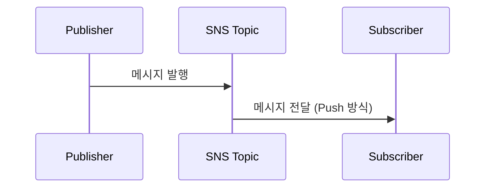

# AWS SNS (Simple Notification Service) 개요

## 배경
AWS SNS(Simple Notification Service)는 AWS에서 제공하는 관리형 메시지 알림 서비스로, 퍼블리셔가 주제(Topic)에 메시지를 발행하면 구독자(Subscriber)에게 푸시(Push) 방식으로 전달합니다. 높은 확장성과 가용성을 제공하며 이메일, SMS, 모바일 푸시, HTTP(S), Lambda, SQS 등 다양한 전송 대상을 지원합니다.

### 기본 개념
1. 퍼블리셔(Publisher): 메시지를 SNS 주제(Topic)에 발행
2. 주제(Topic): 메시지를 저장/전달하는 중심 개체
3. 구독자(Subscriber): 주제를 구독하고 메시지 수신

## 핵심
### 푸시 기반 메시징 시스템
- 메시지를 직접 전송(Push)하여 빠르게 알림 전달
- 사용자가 주기적으로 데이터를 가져올 필요 없음

### 다양한 메시지 전송 대상 지원
- 이메일(E-Mail), SMS, 모바일 푸시(APNS, GCM 등)
- AWS Lambda, SQS, HTTP(S) 엔드포인트

### 고가용성과 확장성
- 대량의 트래픽을 효율적으로 처리
- 글로벌 서비스와의 원활한 연동 가능

### 퍼블리셔(Publisher) - 구독자(Subscriber) 모델
- 한 개의 퍼블리셔가 여러 구독자에게 메시지를 전달 가능

## 예시
```javascript
const AWS = require('aws-sdk');

// AWS SNS 클라이언트 생성
const sns = new AWS.SNS({
  region: 'ap-northeast-2'
});

// 새 SNS 주제(Topic) 생성
async function createTopic(topicName) {
  const params = {
    Name: topicName
  };
  
  try {
    const result = await sns.createTopic(params).promise();
    console.log('주제 생성 성공:', result.TopicArn);
    return result.TopicArn;
  } catch (error) {
    console.error('주제 생성 실패:', error);
    throw error;
  }
}

// 이메일 구독자 추가
async function subscribeEmail(topicArn, emailAddress) {
  const params = {
    TopicArn: topicArn,
    Protocol: 'email',
    Endpoint: emailAddress
  };
  
  try {
    const result = await sns.subscribe(params).promise();
    console.log('이메일 구독 성공:', result.SubscriptionArn);
    return result.SubscriptionArn;
  } catch (error) {
    console.error('이메일 구독 실패:', error);
    throw error;
  }
}

// 메시지 발행 (Publisher 역할)
async function publishMessage(topicArn, message, subject = '') {
  const params = {
    TopicArn: topicArn,
    Message: message,
    Subject: subject
  };
  
  try {
    const result = await sns.publish(params).promise();
    console.log('메시지 발행 성공:', result.MessageId);
    return result.MessageId;
  } catch (error) {
    console.error('메시지 발행 실패:', error);
    throw error;
  }
}

// SQS 구독 추가 (SNS → SQS 연동)
async function subscribeSQS(topicArn, queueArn) {
  const params = {
    TopicArn: topicArn,
    Protocol: 'sqs',
    Endpoint: queueArn
  };
  
  try {
    const result = await sns.subscribe(params).promise();
    console.log('SQS 구독 성공:', result.SubscriptionArn);
    return result.SubscriptionArn;
  } catch (error) {
    console.error('SQS 구독 실패:', error);
    throw error;
  }
}

// 사용 예시
async function snsExample() {
  try {
    // 1. 주제 생성
    const topicArn = await createTopic('MyTopic');
    
    // 2. 이메일 구독자 추가
    await subscribeEmail(topicArn, 'example@example.com');
    
    // 3. 메시지 발행
    await publishMessage(
      topicArn, 
      'Hello, this is a test notification!',
      'AWS SNS Test'
    );
    
    // 4. SQS 구독 추가 (선택사항)
    const queueArn = 'arn:aws:sqs:ap-northeast-2:123456789012:MyQueue';
    await subscribeSQS(topicArn, queueArn);
    
  } catch (error) {
    console.error('SNS 예시 실행 중 오류:', error);
  }
}

// 실행
snsExample();
```



## 운영 팁
- SNS → SQS 연동으로 팬아웃 후, 다운스트림은 큐에서 비동기로 처리
- 구독자별 필터 정책(FilterPolicy)로 불필요한 트래픽 최소화
- 전송 실패/지연은 CloudWatch 지표/로그로 관측하고 재시도 정책 점검
- 교차 계정 발행/구독은 주제 정책으로 명시적 ARN 허용 설정

## 참고
- AWS 공식 문서 - SNS: https://docs.aws.amazon.com/ko_kr/sns/latest/dg/welcome.html
- AWS SDK for JavaScript: https://docs.aws.amazon.com/sdk-for-javascript/v3/developer-guide/sns-examples.html
