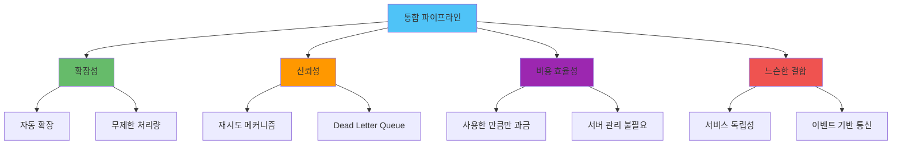
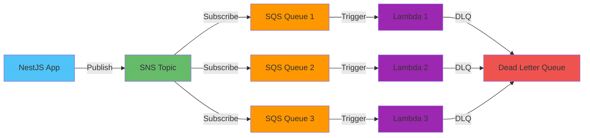
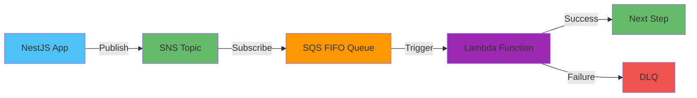
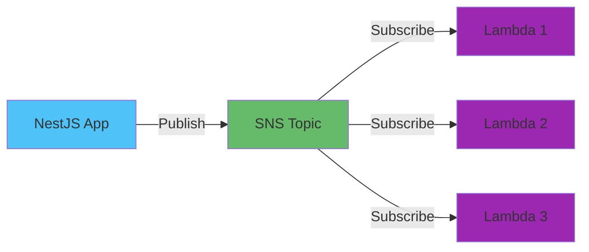
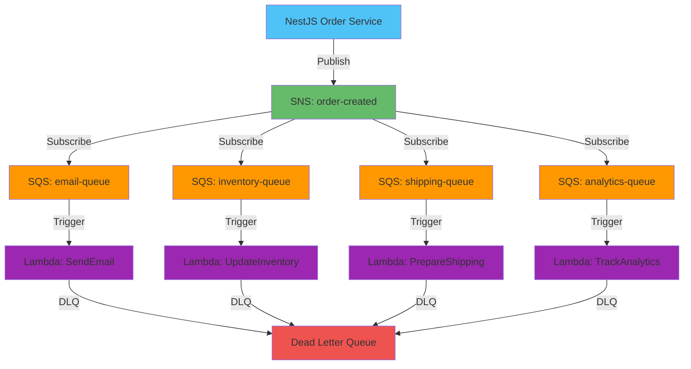

# AWS SNS/SQS/Lambda 통합 메시지 파이프라인 실전

## 📋 목차

1. [개요](#개요)
2. [통합 아키텍처 패턴](#통합-아키텍처-패턴)
3. [NestJS 구현 가이드](#nestjs-구현-가이드)
4. [실전 메시지 파이프라인 설계](#실전-메시지-파이프라인-설계)
5. [에러 처리 및 재시도 전략](#에러-처리-및-재시도-전략)
6. [모니터링 및 디버깅](#모니터링-및-디버깅)
7. [비용 최적화 전략](#비용-최적화-전략)
8. [트러블슈팅 가이드](#트러블슈팅-가이드)
9. [테스트 전략](#테스트-전략)

---

## 개요

### 통합 메시지 파이프라인이란?

AWS SNS, SQS, Lambda를 통합하여 구축하는 메시지 파이프라인은 Event Driven Architecture(EDA)의 핵심 구성 요소입니다. 세 서비스를 조합하여 확장 가능하고, 신뢰성 높은 비동기 메시지 처리 시스템을 구축할 수 있습니다.

### 각 서비스의 역할

**SNS (Simple Notification Service)**
- 이벤트 발행 및 팬아웃(Fan-out) 패턴 구현
- 여러 구독자에게 동시에 메시지 전달
- 푸시 기반 메시징

**SQS (Simple Queue Service)**
- 메시지 버퍼링 및 큐잉
- 메시지 순서 보장 (FIFO Queue)
- 재시도 및 Dead Letter Queue 지원

**Lambda**
- 서버리스 이벤트 핸들러
- 자동 확장 및 비용 효율성
- 다양한 이벤트 소스 지원

### 통합의 장점



---

## 통합 아키텍처 패턴

### 패턴 1: Fan-out 패턴 (SNS → SQS → Lambda)

가장 일반적인 패턴으로, 하나의 이벤트를 여러 큐로 분산하여 각각 다른 Lambda 함수가 처리합니다.



**사용 사례:**
- 주문 생성 시: 이메일 발송, 재고 차감, 배송 준비를 병렬 처리
- 사용자 가입 시: 환영 이메일, 프로필 생성, 분석 이벤트 전송

### 패턴 2: 순차 처리 패턴 (SNS → SQS FIFO → Lambda)

메시지 순서가 중요한 경우 FIFO Queue를 활용합니다.



**사용 사례:**
- 금융 거래 처리 (순서 보장 필수)
- 주문 상태 변경 (상태 머신)
- 데이터 마이그레이션 작업

### 패턴 3: 직접 Lambda 트리거 (SNS → Lambda)

간단한 이벤트 처리는 SNS에서 직접 Lambda를 트리거합니다.



**사용 사례:**
- 실시간 알림 처리
- 간단한 데이터 변환
- 빠른 응답이 필요한 이벤트

---

## NestJS 구현 가이드

### 프로젝트 설정

#### 1. 의존성 설치

```bash
npm install @aws-sdk/client-sns @aws-sdk/client-sqs
npm install @nestjs/config
npm install --save-dev @types/node
```

#### 2. 환경 변수 설정

```typescript
// .env
AWS_REGION=ap-northeast-2
AWS_ACCESS_KEY_ID=your-access-key
AWS_SECRET_ACCESS_KEY=your-secret-key

# SNS Topics
ORDER_CREATED_TOPIC_ARN=arn:aws:sns:ap-northeast-2:123456789012:order-created
USER_REGISTERED_TOPIC_ARN=arn:aws:sns:ap-northeast-2:123456789012:user-registered

# SQS Queues
EMAIL_QUEUE_URL=https://sqs.ap-northeast-2.amazonaws.com/123456789012/email-queue
INVENTORY_QUEUE_URL=https://sqs.ap-northeast-2.amazonaws.com/123456789012/inventory-queue
```

### SNS 서비스 구현

#### SNS 모듈 생성

```typescript
// src/aws/sns/sns.module.ts
import { Module } from '@nestjs/common';
import { ConfigModule } from '@nestjs/config';
import { SnsService } from './sns.service';

@Module({
  imports: [ConfigModule],
  providers: [SnsService],
  exports: [SnsService],
})
export class SnsModule {}
```

#### SNS 서비스 구현

```typescript
// src/aws/sns/sns.service.ts
import { Injectable, Logger } from '@nestjs/common';
import { ConfigService } from '@nestjs/config';
import { SNSClient, PublishCommand } from '@aws-sdk/client-sns';

@Injectable()
export class SnsService {
  private readonly logger = new Logger(SnsService.name);
  private readonly snsClient: SNSClient;

  constructor(private configService: ConfigService) {
    this.snsClient = new SNSClient({
      region: this.configService.get<string>('AWS_REGION'),
      credentials: {
        accessKeyId: this.configService.get<string>('AWS_ACCESS_KEY_ID'),
        secretAccessKey: this.configService.get<string>('AWS_SECRET_ACCESS_KEY'),
      },
    });
  }

  /**
   * SNS Topic에 메시지 발행
   */
  async publishMessage(
    topicArn: string,
    message: Record<string, any>,
    subject?: string,
  ): Promise<string> {
    try {
      const command = new PublishCommand({
        TopicArn: topicArn,
        Message: JSON.stringify(message),
        Subject: subject,
        MessageAttributes: {
          'event-type': {
            DataType: 'String',
            StringValue: message.eventType || 'unknown',
          },
          'timestamp': {
            DataType: 'String',
            StringValue: new Date().toISOString(),
          },
        },
      });

      const response = await this.snsClient.send(command);
      this.logger.log(`Message published to ${topicArn}: ${response.MessageId}`);
      
      return response.MessageId;
    } catch (error) {
      this.logger.error(`Failed to publish message to ${topicArn}:`, error);
      throw error;
    }
  }

  /**
   * 주문 생성 이벤트 발행
   */
  async publishOrderCreated(orderData: {
    orderId: string;
    userId: string;
    items: Array<{ productId: string; quantity: number }>;
    totalAmount: number;
  }): Promise<string> {
    const topicArn = this.configService.get<string>('ORDER_CREATED_TOPIC_ARN');
    
    return this.publishMessage(
      topicArn,
      {
        eventType: 'order.created',
        ...orderData,
      },
      'Order Created',
    );
  }

  /**
   * 사용자 등록 이벤트 발행
   */
  async publishUserRegistered(userData: {
    userId: string;
    email: string;
    name: string;
  }): Promise<string> {
    const topicArn = this.configService.get<string>('USER_REGISTERED_TOPIC_ARN');
    
    return this.publishMessage(
      topicArn,
      {
        eventType: 'user.registered',
        ...userData,
      },
      'User Registered',
    );
  }
}
```

### SQS 서비스 구현

#### SQS 모듈 생성

```typescript
// src/aws/sqs/sqs.module.ts
import { Module } from '@nestjs/common';
import { ConfigModule } from '@nestjs/config';
import { SqsService } from './sqs.service';

@Module({
  imports: [ConfigModule],
  providers: [SqsService],
  exports: [SqsService],
})
export class SqsModule {}
```

#### SQS 서비스 구현

```typescript
// src/aws/sqs/sqs.service.ts
import { Injectable, Logger } from '@nestjs/common';
import { ConfigService } from '@nestjs/config';
import {
  SQSClient,
  SendMessageCommand,
  ReceiveMessageCommand,
  DeleteMessageCommand,
  GetQueueAttributesCommand,
} from '@aws-sdk/client-sqs';

@Injectable()
export class SqsService {
  private readonly logger = new Logger(SqsService.name);
  private readonly sqsClient: SQSClient;

  constructor(private configService: ConfigService) {
    this.sqsClient = new SQSClient({
      region: this.configService.get<string>('AWS_REGION'),
      credentials: {
        accessKeyId: this.configService.get<string>('AWS_ACCESS_KEY_ID'),
        secretAccessKey: this.configService.get<string>('AWS_SECRET_ACCESS_KEY'),
      },
    });
  }

  /**
   * SQS Queue에 메시지 전송
   */
  async sendMessage(
    queueUrl: string,
    message: Record<string, any>,
    messageGroupId?: string, // FIFO Queue용
  ): Promise<string> {
    try {
      const command = new SendMessageCommand({
        QueueUrl: queueUrl,
        MessageBody: JSON.stringify(message),
        MessageAttributes: {
          'event-type': {
            DataType: 'String',
            StringValue: message.eventType || 'unknown',
          },
        },
        ...(messageGroupId && { MessageGroupId: messageGroupId }),
      });

      const response = await this.sqsClient.send(command);
      this.logger.log(`Message sent to ${queueUrl}: ${response.MessageId}`);
      
      return response.MessageId;
    } catch (error) {
      this.logger.error(`Failed to send message to ${queueUrl}:`, error);
      throw error;
    }
  }

  /**
   * SQS Queue에서 메시지 수신
   */
  async receiveMessages(
    queueUrl: string,
    maxNumberOfMessages: number = 10,
    waitTimeSeconds: number = 20, // Long Polling
  ): Promise<any[]> {
    try {
      const command = new ReceiveMessageCommand({
        QueueUrl: queueUrl,
        MaxNumberOfMessages: maxNumberOfMessages,
        WaitTimeSeconds: waitTimeSeconds,
        MessageAttributeNames: ['All'],
      });

      const response = await this.sqsClient.send(command);
      
      if (!response.Messages || response.Messages.length === 0) {
        return [];
      }

      return response.Messages.map((msg) => ({
        messageId: msg.MessageId,
        receiptHandle: msg.ReceiptHandle,
        body: JSON.parse(msg.Body || '{}'),
        attributes: msg.MessageAttributes,
      }));
    } catch (error) {
      this.logger.error(`Failed to receive messages from ${queueUrl}:`, error);
      throw error;
    }
  }

  /**
   * 처리 완료된 메시지 삭제
   */
  async deleteMessage(queueUrl: string, receiptHandle: string): Promise<void> {
    try {
      const command = new DeleteMessageCommand({
        QueueUrl: queueUrl,
        ReceiptHandle: receiptHandle,
      });

      await this.sqsClient.send(command);
      this.logger.log(`Message deleted from ${queueUrl}`);
    } catch (error) {
      this.logger.error(`Failed to delete message from ${queueUrl}:`, error);
      throw error;
    }
  }

  /**
   * Queue 상태 확인 (대기 중인 메시지 수 등)
   */
  async getQueueAttributes(queueUrl: string): Promise<Record<string, string>> {
    try {
      const command = new GetQueueAttributesCommand({
        QueueUrl: queueUrl,
        AttributeNames: ['ApproximateNumberOfMessages', 'ApproximateNumberOfMessagesNotVisible'],
      });

      const response = await this.sqsClient.send(command);
      return response.Attributes || {};
    } catch (error) {
      this.logger.error(`Failed to get queue attributes from ${queueUrl}:`, error);
      throw error;
    }
  }
}
```

### 통합 사용 예제

#### 주문 서비스에서 이벤트 발행

```typescript
// src/orders/orders.service.ts
import { Injectable } from '@nestjs/common';
import { SnsService } from '../aws/sns/sns.service';

@Injectable()
export class OrdersService {
  constructor(private snsService: SnsService) {}

  async createOrder(orderData: {
    userId: string;
    items: Array<{ productId: string; quantity: number }>;
  }) {
    // 주문 생성 로직
    const order = {
      orderId: `order-${Date.now()}`,
      userId: orderData.userId,
      items: orderData.items,
      totalAmount: this.calculateTotal(orderData.items),
      createdAt: new Date(),
    };

    // 주문 생성 이벤트 발행 (SNS → SQS → Lambda)
    await this.snsService.publishOrderCreated({
      orderId: order.orderId,
      userId: order.userId,
      items: order.items,
      totalAmount: order.totalAmount,
    });

    return order;
  }

  private calculateTotal(items: Array<{ productId: string; quantity: number }>): number {
    // 가격 계산 로직
    return 10000;
  }
}
```

---

## 실전 메시지 파이프라인 설계

### 시나리오: 전자상거래 주문 처리 시스템

#### 아키텍처 다이어그램



#### 메시지 스키마 설계

```typescript
// src/events/order-created.event.ts
export interface OrderCreatedEvent {
  eventType: 'order.created';
  eventVersion: '1.0';
  timestamp: string;
  data: {
    orderId: string;
    userId: string;
    items: Array<{
      productId: string;
      quantity: number;
      price: number;
    }>;
    totalAmount: number;
    shippingAddress: {
      street: string;
      city: string;
      zipCode: string;
    };
  };
  metadata: {
    correlationId: string;
    source: string;
  };
}
```

#### Lambda 함수 예제 (Node.js)

```javascript
// lambda/send-email/index.js
const { SESClient, SendEmailCommand } = require('@aws-sdk/client-ses');

exports.handler = async (event) => {
  console.log('Received event:', JSON.stringify(event, null, 2));

  // SQS에서 메시지 파싱
  for (const record of event.Records) {
    const message = JSON.parse(record.body);
    const orderData = JSON.parse(message.Message);

    // 이메일 발송
    const sesClient = new SESClient({ region: process.env.AWS_REGION });
    
    const emailCommand = new SendEmailCommand({
      Source: 'noreply@example.com',
      Destination: {
        ToAddresses: [orderData.data.userId], // 실제로는 사용자 이메일 조회 필요
      },
      Message: {
        Subject: {
          Data: `주문 확인: ${orderData.data.orderId}`,
        },
        Body: {
          Html: {
            Data: `
              <h1>주문이 완료되었습니다</h1>
              <p>주문 번호: ${orderData.data.orderId}</p>
              <p>총 금액: ${orderData.data.totalAmount}원</p>
            `,
          },
        },
      },
    });

    try {
      await sesClient.send(emailCommand);
      console.log(`Email sent for order ${orderData.data.orderId}`);
    } catch (error) {
      console.error('Failed to send email:', error);
      throw error; // Lambda 재시도 트리거
    }
  }
};
```

---

## 에러 처리 및 재시도 전략

### SQS 재시도 설정

#### Standard Queue 재시도

```typescript
// SQS Queue 설정 (Terraform 예제)
resource "aws_sqs_queue" "email_queue" {
  name                      = "email-queue"
  visibility_timeout_seconds = 300  # Lambda 타임아웃보다 길게 설정
  message_retention_seconds  = 1209600  # 14일
  receive_wait_time_seconds  = 20  # Long Polling

  redrive_policy = jsonencode({
    deadLetterTargetArn = aws_sqs_queue.email_dlq.arn
    maxReceiveCount     = 3  # 3번 실패 시 DLQ로 이동
  })
}

resource "aws_sqs_queue" "email_dlq" {
  name = "email-queue-dlq"
}
```

#### Lambda 재시도 설정

```typescript
// Lambda 함수 설정
resource "aws_lambda_event_source_mapping" "email_processor" {
  event_source_arn = aws_sqs_queue.email_queue.arn
  function_name    = aws_lambda_function.send_email.arn
  batch_size       = 10
  maximum_batching_window_in_seconds = 5

  // 부분 실패 처리
  function_response_types = ["ReportBatchItemFailures"]
}
```

### 에러 처리 패턴

#### 멱등성 보장

```typescript
// Lambda 함수에서 멱등성 보장
exports.handler = async (event) => {
  const dynamodb = new DynamoDBClient({});
  
  for (const record of event.Records) {
    const message = JSON.parse(record.body);
    const orderId = message.data.orderId;
    
    // 멱등성 키로 중복 처리 방지
    const idempotencyKey = `email-${orderId}`;
    
    try {
      // DynamoDB 조건부 쓰기로 중복 방지
      await dynamodb.putItem({
        TableName: 'processed-events',
        Item: {
          idempotencyKey: { S: idempotencyKey },
          processedAt: { S: new Date().toISOString() },
        },
        ConditionExpression: 'attribute_not_exists(idempotencyKey)',
      });
      
      // 이메일 발송 로직
      await sendEmail(message);
      
    } catch (error) {
      if (error.name === 'ConditionalCheckFailedException') {
        console.log(`Already processed: ${idempotencyKey}`);
        continue; // 이미 처리된 메시지는 스킵
      }
      throw error; // 다른 에러는 재시도
    }
  }
};
```

#### 부분 실패 처리

```typescript
// Lambda 함수에서 부분 실패 보고
exports.handler = async (event) => {
  const batchItemFailures = [];
  
  for (const record of event.Records) {
    try {
      await processMessage(record);
    } catch (error) {
      console.error(`Failed to process message ${record.messageId}:`, error);
      
      // 실패한 메시지만 재시도
      batchItemFailures.push({
        itemIdentifier: record.messageId,
      });
    }
  }
  
  // 부분 실패 보고 (SQS가 실패한 메시지만 재시도)
  return {
    batchItemFailures,
  };
};
```

---

## 모니터링 및 디버깅

### CloudWatch 메트릭 모니터링

#### 주요 메트릭

**SNS 메트릭:**
- `NumberOfMessagesPublished`: 발행된 메시지 수
- `NumberOfNotificationsDelivered`: 전달된 알림 수
- `NumberOfNotificationsFailed`: 실패한 알림 수

**SQS 메트릭:**
- `ApproximateNumberOfMessages`: 대기 중인 메시지 수
- `ApproximateNumberOfMessagesNotVisible`: 처리 중인 메시지 수
- `ApproximateAgeOfOldestMessage`: 가장 오래된 메시지의 대기 시간

**Lambda 메트릭:**
- `Invocations`: 함수 호출 횟수
- `Errors`: 에러 발생 횟수
- `Duration`: 실행 시간
- `Throttles`: 스로틀링 발생 횟수

#### CloudWatch 대시보드 설정

```typescript
// Terraform으로 CloudWatch 대시보드 생성
resource "aws_cloudwatch_dashboard" "message_pipeline" {
  dashboard_name = "message-pipeline-dashboard"

  dashboard_body = jsonencode({
    widgets = [
      {
        type   = "metric"
        x      = 0
        y      = 0
        width  = 12
        height = 6

        properties = {
          metrics = [
            ["AWS/SNS", "NumberOfMessagesPublished", { "stat": "Sum" }],
            ["AWS/SQS", "ApproximateNumberOfMessages", { "stat": "Average" }],
            ["AWS/Lambda", "Invocations", { "stat": "Sum" }],
            [".", "Errors", { "stat": "Sum" }],
          ]
          period = 300
          stat   = "Sum"
          region = "ap-northeast-2"
          title  = "Message Pipeline Overview"
        }
      }
    ]
  })
}
```

### 로깅 전략

#### 구조화된 로깅

```typescript
// NestJS에서 구조화된 로깅
import { Logger } from '@nestjs/common';

@Injectable()
export class SnsService {
  private readonly logger = new Logger(SnsService.name);

  async publishMessage(topicArn: string, message: any) {
    const correlationId = this.generateCorrelationId();
    
    this.logger.log({
      message: 'Publishing message to SNS',
      topicArn,
      correlationId,
      eventType: message.eventType,
      timestamp: new Date().toISOString(),
    });

    try {
      const messageId = await this.publish(topicArn, message);
      
      this.logger.log({
        message: 'Message published successfully',
        topicArn,
        messageId,
        correlationId,
      });
      
      return messageId;
    } catch (error) {
      this.logger.error({
        message: 'Failed to publish message',
        topicArn,
        correlationId,
        error: error.message,
        stack: error.stack,
      });
      
      throw error;
    }
  }
}
```

### 디버깅 팁

#### X-Ray 분산 추적

```typescript
// Lambda 함수에서 X-Ray 활성화
import * as AWSXRay from 'aws-xray-sdk-core';

const AWS = AWSXRay.captureAWS(require('aws-sdk'));

exports.handler = async (event) => {
  const segment = AWSXRay.getSegment();
  const subsegment = segment.addNewSubsegment('process-order');
  
  try {
    // 비즈니스 로직
    await processOrder(event);
    subsegment.close();
  } catch (error) {
    subsegment.addError(error);
    subsegment.close();
    throw error;
  }
};
```

#### 로컬 테스트 (LocalStack)

```yaml
# docker-compose.yml
version: '3.8'

services:
  localstack:
    image: localstack/localstack:latest
    ports:
      - "4566:4566"
    environment:
      - SERVICES=sns,sqs,lambda
      - DEBUG=1
    volumes:
      - "./localstack:/tmp/localstack"
```

```typescript
// 로컬 개발 환경 설정
const snsClient = new SNSClient({
  endpoint: process.env.AWS_ENDPOINT || 'http://localhost:4566',
  region: 'us-east-1',
  credentials: {
    accessKeyId: 'test',
    secretAccessKey: 'test',
  },
});
```

---

## 비용 최적화 전략

### 비용 분석

#### SNS 비용
- 메시지 발행: $0.50 per 1 million requests
- 데이터 전송: $0.09 per GB

#### SQS 비용
- 요청: $0.40 per 1 million requests
- 데이터 전송: $0.09 per GB

#### Lambda 비용
- 요청: $0.20 per 1 million requests
- 컴퓨팅: $0.0000166667 per GB-second

### 최적화 방법

#### 1. 배치 처리 활용

```typescript
// 여러 메시지를 한 번에 전송
const messages = orders.map(order => ({
  Id: order.id,
  MessageBody: JSON.stringify(order),
}));

await sqsClient.send(new SendMessageBatchCommand({
  QueueUrl: queueUrl,
  Entries: messages,
}));
```

#### 2. Long Polling으로 API 호출 감소

```typescript
// WaitTimeSeconds를 최대 20초로 설정
const command = new ReceiveMessageCommand({
  QueueUrl: queueUrl,
  MaxNumberOfMessages: 10,
  WaitTimeSeconds: 20, // Long Polling
});
```

#### 3. 메시지 필터링으로 불필요한 전송 방지

```typescript
// SNS 구독 필터 정책
const filterPolicy = {
  eventType: ['order.created', 'order.cancelled'],
  priority: ['high', 'medium'],
};

await snsClient.send(new SubscribeCommand({
  TopicArn: topicArn,
  Protocol: 'sqs',
  Endpoint: queueArn,
  Attributes: {
    FilterPolicy: JSON.stringify(filterPolicy),
  },
}));
```

#### 4. Lambda 프로비저닝된 동시성 (예측 가능한 트래픽)

```typescript
// Terraform으로 프로비저닝된 동시성 설정
resource "aws_lambda_provisioned_concurrency_config" "email_processor" {
  function_name                     = aws_lambda_function.send_email.function_name
  qualifier                        = aws_lambda_function.send_email.version
  provisioned_concurrent_executions = 10
}
```

---

## 트러블슈팅 가이드

### 일반적인 문제 및 해결책

#### 문제 1: 메시지가 Lambda에 도달하지 않음

**증상:**
- SNS에 메시지 발행은 성공
- SQS에 메시지가 쌓임
- Lambda가 트리거되지 않음

**원인:**
- Lambda 이벤트 소스 매핑 설정 오류
- IAM 권한 부족
- SQS Queue와 Lambda 리전 불일치

**해결:**
```bash
# Lambda 이벤트 소스 매핑 확인
aws lambda list-event-source-mappings --function-name send-email

# IAM 권한 확인
aws iam get-role-policy --role-name lambda-execution-role --policy-name sqs-access

# SQS Queue ARN 확인
aws sqs get-queue-attributes --queue-url <queue-url> --attribute-names QueueArn
```

#### 문제 2: 메시지가 DLQ로 계속 이동

**증상:**
- Lambda 함수가 계속 실패
- 메시지가 maxReceiveCount 후 DLQ로 이동

**원인:**
- Lambda 함수 내부 에러
- 타임아웃 설정 부족
- 메시지 형식 불일치

**해결:**
```typescript
// Lambda 함수에서 상세한 에러 로깅
exports.handler = async (event) => {
  console.log('Event:', JSON.stringify(event, null, 2));
  
  try {
    for (const record of event.Records) {
      const message = JSON.parse(record.body);
      console.log('Message:', JSON.stringify(message, null, 2));
      
      // 메시지 검증
      if (!message.data || !message.data.orderId) {
        throw new Error('Invalid message format');
      }
      
      await processMessage(message);
    }
  } catch (error) {
    console.error('Error details:', {
      message: error.message,
      stack: error.stack,
      event: JSON.stringify(event),
    });
    throw error;
  }
};
```

#### 문제 3: 메시지 순서가 보장되지 않음

**증상:**
- Standard Queue 사용 시 메시지 순서가 섞임

**해결:**
- FIFO Queue 사용
- MessageGroupId를 통한 그룹화

```typescript
// FIFO Queue에 순서 보장 메시지 전송
await sqsClient.send(new SendMessageCommand({
  QueueUrl: 'https://sqs.region.amazonaws.com/account/queue.fifo',
  MessageBody: JSON.stringify(message),
  MessageGroupId: orderId, // 같은 주문은 같은 그룹
  MessageDeduplicationId: `${orderId}-${timestamp}`, // 중복 제거
}));
```

### 모니터링 체크리스트

- [ ] SNS 발행 성공률 > 99%
- [ ] SQS 대기 메시지 수 < 1000
- [ ] Lambda 에러율 < 1%
- [ ] Lambda 평균 실행 시간 < 5초
- [ ] DLQ 메시지 수 = 0 (정상)
- [ ] 메시지 처리 지연 시간 < 30초

---

## 테스트 전략

### 단위 테스트

```typescript
// src/aws/sns/sns.service.spec.ts
import { Test, TestingModule } from '@nestjs/testing';
import { ConfigService } from '@nestjs/config';
import { SnsService } from './sns.service';
import { SNSClient } from '@aws-sdk/client-sns';

describe('SnsService', () => {
  let service: SnsService;
  let snsClient: jest.Mocked<SNSClient>;

  beforeEach(async () => {
    const module: TestingModule = await Test.createTestingModule({
      providers: [
        SnsService,
        {
          provide: ConfigService,
          useValue: {
            get: jest.fn((key: string) => {
              const config = {
                AWS_REGION: 'ap-northeast-2',
                ORDER_CREATED_TOPIC_ARN: 'arn:aws:sns:...',
              };
              return config[key];
            }),
          },
        },
      ],
    }).compile();

    service = module.get<SnsService>(SnsService);
  });

  it('should publish message successfully', async () => {
    const topicArn = 'arn:aws:sns:ap-northeast-2:123456789012:test-topic';
    const message = { eventType: 'test.event', data: { id: '123' } };

    const messageId = await service.publishMessage(topicArn, message);

    expect(messageId).toBeDefined();
  });
});
```

### 통합 테스트 (LocalStack)

```typescript
// test/integration/sns-sqs-lambda.integration.spec.ts
import { Test, TestingModule } from '@nestjs/testing';
import { SnsService } from '../../src/aws/sns/sns.service';
import { SqsService } from '../../src/aws/sqs/sqs.service';

describe('SNS-SQS-Lambda Integration', () => {
  let snsService: SnsService;
  let sqsService: SqsService;
  let queueUrl: string;

  beforeAll(async () => {
    // LocalStack 환경 설정
    process.env.AWS_ENDPOINT = 'http://localhost:4566';
    process.env.AWS_REGION = 'us-east-1';

    const module: TestingModule = await Test.createTestingModule({
      providers: [SnsService, SqsService, ConfigService],
    }).compile();

    snsService = module.get<SnsService>(SnsService);
    sqsService = module.get<SqsService>(SqsService);

    // 테스트용 Queue 생성
    queueUrl = await createTestQueue();
  });

  it('should publish message to SNS and receive from SQS', async () => {
    const topicArn = await createTestTopic();
    await subscribeQueueToTopic(topicArn, queueUrl);

    // 메시지 발행
    const messageId = await snsService.publishMessage(topicArn, {
      eventType: 'test.event',
      data: { test: 'data' },
    });

    expect(messageId).toBeDefined();

    // 잠시 대기 (메시지 전파 시간)
    await new Promise(resolve => setTimeout(resolve, 1000));

    // SQS에서 메시지 수신
    const messages = await sqsService.receiveMessages(queueUrl);
    
    expect(messages.length).toBeGreaterThan(0);
    expect(messages[0].body.eventType).toBe('test.event');
  });
});
```

### E2E 테스트

```typescript
// test/e2e/order-processing.e2e-spec.ts
import { Test, TestingModule } from '@nestjs/testing';
import { INestApplication } from '@nestjs/common';
import * as request from 'supertest';
import { AppModule } from '../../src/app.module';

describe('Order Processing E2E', () => {
  let app: INestApplication;

  beforeAll(async () => {
    const moduleFixture: TestingModule = await Test.createTestingModule({
      imports: [AppModule],
    }).compile();

    app = moduleFixture.createNestApplication();
    await app.init();
  });

  it('should process order and trigger events', async () => {
    const orderData = {
      userId: 'user-123',
      items: [{ productId: 'prod-1', quantity: 2 }],
    };

    const response = await request(app.getHttpServer())
      .post('/orders')
      .send(orderData)
      .expect(201);

    expect(response.body.orderId).toBeDefined();

    // 이벤트가 발행되었는지 확인 (실제로는 SQS에서 확인)
    await new Promise(resolve => setTimeout(resolve, 2000));
    
    // 이메일 발송 확인 로직
    // 재고 차감 확인 로직
    // 배송 준비 확인 로직
  });
});
```

---

## 참고 자료

### AWS 공식 문서
- [SNS 개발자 가이드](https://docs.aws.amazon.com/ko_kr/sns/latest/dg/welcome.html)
- [SQS 개발자 가이드](https://docs.aws.amazon.com/ko_kr/AWSSimpleQueueService/latest/SQSDeveloperGuide/welcome.html)
- [Lambda 개발자 가이드](https://docs.aws.amazon.com/ko_kr/lambda/latest/dg/welcome.html)

### NestJS 관련
- [NestJS 공식 문서](https://docs.nestjs.com/)
- [AWS SDK for JavaScript v3](https://docs.aws.amazon.com/sdk-for-javascript/v3/developer-guide/)

### 도구
- [LocalStack](https://localstack.cloud/) - 로컬 AWS 환경
- [AWS SAM](https://aws.amazon.com/ko/serverless/sam/) - 서버리스 애플리케이션 배포
- [Terraform AWS Provider](https://registry.terraform.io/providers/hashicorp/aws/latest/docs)

---

**문서 작성일:** 2025-01-16  
**최종 업데이트:** 2025-01-16

