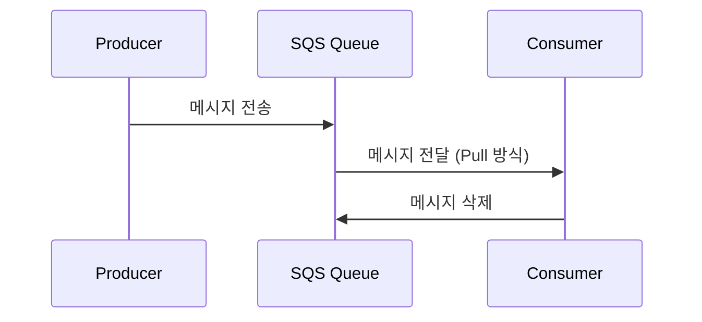

# AWS SQS (Simple Queue Service) 개요

## 배경
AWS SQS(Simple Queue Service)는 AWS에서 제공하는 완전관리형 메시지 큐 서비스로, 비동기 처리와 서비스 간 결합도 감소에 활용된다. 표준(Standard) 큐는 높은 처리량을 제공하며 순서 보장은 하지 않고, FIFO 큐는 순서와 중복 제거를 보장한다.

## 핵심
### 주요 특징
1) 완전관리형 서비스 — 확장성과 유지보수 부담 감소
2) 비동기 메시지 처리 — 프로듀서/컨슈머 독립 운영
3) 유연한 메시지 보존 — 기본 4일, 최대 14일
4) 높은 확장성 — 대량 트래픽 자동 확장
5) 큐 유형 — Standard, FIFO

### 메시지 흐름/처리 원칙
- Producer가 메시지를 전송 → Consumer가 폴링으로 수신 → 처리 후 명시적 삭제
- 삭제 전에는 메시지가 큐에 남아 있으며 ReceiptHandle이 필요

## 예시
```javascript
const AWS = require('aws-sdk');

// AWS SQS 클라이언트 생성
const sqs = new AWS.SQS({
  region: 'ap-northeast-2'
});

const queueUrl = 'https://sqs.ap-northeast-2.amazonaws.com/123456789012/MyQueue';

// 메시지 전송 (Producer 역할)
async function sendMessage(messageBody) {
  const params = {
    QueueUrl: queueUrl,
    MessageBody: messageBody
  };
  
  try {
    const result = await sqs.sendMessage(params).promise();
    console.log('메시지 전송 성공:', result.MessageId);
    return result;
  } catch (error) {
    console.error('메시지 전송 실패:', error);
    throw error;
  }
}

// 메시지 수신 (Consumer 역할)
async function receiveMessage() {
  const params = {
    QueueUrl: queueUrl,
    MaxNumberOfMessages: 1,
    WaitTimeSeconds: 10
  };
  
  try {
    const result = await sqs.receiveMessage(params).promise();
    return result.Messages || [];
  } catch (error) {
    console.error('메시지 수신 실패:', error);
    throw error;
  }
}

// 메시지 삭제
async function deleteMessage(receiptHandle) {
  const params = {
    QueueUrl: queueUrl,
    ReceiptHandle: receiptHandle
  };
  
  try {
    await sqs.deleteMessage(params).promise();
    console.log('메시지 삭제 성공');
  } catch (error) {
    console.error('메시지 삭제 실패:', error);
    throw error;
  }
}

// 사용 예시
async function processMessages() {
  try {
    // 메시지 전송
    await sendMessage('Hello, this is a test message!');
    
    // 메시지 수신
    const messages = await receiveMessage();
    
    for (const message of messages) {
      console.log('받은 메시지:', message.Body);
      
      // 메시지 처리 로직
      await processMessage(message.Body);
      
      // 처리 완료 후 메시지 삭제
      await deleteMessage(message.ReceiptHandle);
    }
  } catch (error) {
    console.error('메시지 처리 중 오류:', error);
  }
}

async function processMessage(messageBody) {
  // 실제 메시지 처리 로직
  console.log('메시지 처리 중:', messageBody);
  await new Promise(resolve => setTimeout(resolve, 1000));
  console.log('메시지 처리 완료');
}

// 실행
processMessages();
```



## 운영 팁
- 가시성 타임아웃을 작업 시간에 맞춰 조정하고 필요 시 연장
- 실패 메시지는 DLQ로 격리하고 재처리 파이프라인과 알람을 설정
- 장기 폴링과 배치 API로 비용/효율 최적화
- 멱등 처리와 중복 수신 방어 로직을 컨슈머에 포함
- 순서 보장이 필요하면 FIFO + MessageGroupId 사용

## 참고
- AWS 공식 문서 - SQS: https://docs.aws.amazon.com/ko_kr/AWSSimpleQueueService/latest/SQSDeveloperGuide/welcome.html
- AWS SDK for JavaScript: https://docs.aws.amazon.com/sdk-for-javascript/v3/developer-guide/sqs-examples.html
