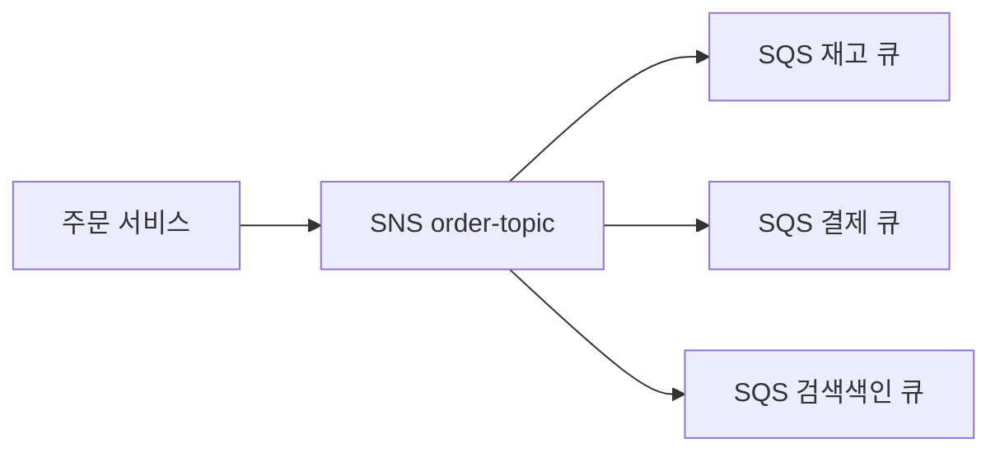

# AWS SQS와 SNS 연동

## 개요

SQS는 메시지를 큐에 쌓아두고 Consumer가 폴링으로 꺼내 가는 풀(pull) 방식의 메시지 큐다. Producer와 Consumer를 분리해서 둘의 처리 속도가 달라도 큐가 완충 역할을 한다. 결제 처리 같은 무거운 작업을 API 응답 경로에서 떼어내 백그라운드로 넘길 때, 트래픽이 튀어도 워커가 자기 속도로 소화하게 만들 때 쓴다.

SNS는 반대로 발행한 메시지를 구독자에게 밀어주는(push) 방식이다. 한 번 발행하면 여러 구독자에게 동시에 복제해서 전달한다. SNS와 SQS를 붙이면 "한 이벤트를 여러 큐로 뿌리되, 각 큐는 독립적인 속도로 처리"하는 구조가 된다. 이게 실무에서 가장 많이 쓰는 fan-out 패턴이고, 이 문서의 절반은 그 연동에서 사람들이 실제로 막히는 지점을 다룬다.

리전과 계정 ID는 예제 전체에서 `ap-northeast-2`(서울), `123456789012`를 쓴다. 본인 환경 값으로 바꿔서 실행해야 한다.

## Standard와 FIFO

큐 유형은 만들 때 정하고 나중에 못 바꾼다. 그래서 처음에 제대로 골라야 한다.

| 항목 | Standard | FIFO |
|------|----------|------|
| 순서 보장 | 없음 | MessageGroupId 단위로 보장 |
| 중복 | 가끔 발생(at-least-once) | 5분 중복 제거 |
| 처리량 | 사실상 무제한 | 초당 300건(배치 시 3,000건) |
| 이름 | 자유 | `.fifo`로 끝나야 함 |

실무에서 90%는 Standard로 충분하다. Standard는 같은 메시지가 드물게 두 번 전달되므로 Consumer가 멱등하게 처리하면 된다. FIFO는 순서가 비즈니스 정합성에 직결될 때만 쓴다. 같은 계좌의 입출금 순서, 같은 주문의 상태 전이 같은 경우다. FIFO를 처리량 한계 모르고 골랐다가 초당 300건 벽에 부딪히는 경우가 있으니, 순서가 정말 필요한지 먼저 따져야 한다.

## 큐 만들기

### AWS CLI

```bash
# Standard 큐
aws sqs create-queue \
  --queue-name order-queue \
  --attributes '{
    "VisibilityTimeout": "30",
    "MessageRetentionPeriod": "345600",
    "ReceiveMessageWaitTimeSeconds": "20"
  }'

# FIFO 큐 (이름이 .fifo로 끝나야 한다)
aws sqs create-queue \
  --queue-name order-queue.fifo \
  --attributes '{
    "FifoQueue": "true",
    "ContentBasedDeduplication": "true"
  }'
```

`VisibilityTimeout`은 가시성 타임아웃(초), `MessageRetentionPeriod`는 보존 기간(초, 기본 4일=345600), `ReceiveMessageWaitTimeSeconds`를 20으로 주면 큐 레벨에서 롱 폴링이 켜진다. 큐를 만들면 URL이 반환되는데, 메시지 API는 ARN이 아니라 이 URL로 호출한다. ARN은 SNS 연동이나 DLQ 설정에 쓰니 따로 조회해 둔다.

```bash
aws sqs get-queue-url --queue-name order-queue
aws sqs get-queue-attributes \
  --queue-url https://sqs.ap-northeast-2.amazonaws.com/123456789012/order-queue \
  --attribute-names QueueArn
```

### Node.js (AWS SDK v3)

```bash
npm install @aws-sdk/client-sqs @aws-sdk/client-sns
```

```js
const {
  SQSClient,
  CreateQueueCommand,
  GetQueueAttributesCommand,
} = require('@aws-sdk/client-sqs');

const sqs = new SQSClient({ region: 'ap-northeast-2' });

const { QueueUrl } = await sqs.send(new CreateQueueCommand({
  QueueName: 'order-queue',
  Attributes: {
    VisibilityTimeout: '30',
    MessageRetentionPeriod: '345600',
    ReceiveMessageWaitTimeSeconds: '20',
  },
}));

// 큐 ARN 조회
const { Attributes } = await sqs.send(new GetQueueAttributesCommand({
  QueueUrl,
  AttributeNames: ['QueueArn'],
}));
const queueArn = Attributes.QueueArn;
```

`create-queue`는 멱등하다. 같은 이름과 같은 속성으로 다시 호출하면 기존 큐 URL을 그대로 돌려준다. 속성이 다르면 에러가 나니, 배포 스크립트에서 반복 실행해도 안전하지만 속성을 바꿀 거면 `set-queue-attributes`를 따로 쓴다.

## 메시지 보내기, 받기, 지우기

SQS 처리의 기본 사이클은 보내기 → 받기 → (처리) → 지우기다. 여기서 가장 많이 터지는 건 "지우기를 빼먹는" 사고다. SQS는 메시지를 받아 갔다고 지우지 않는다. Consumer가 명시적으로 `DeleteMessage`를 호출해야 큐에서 사라진다. 안 지우면 가시성 타임아웃이 지난 뒤 같은 메시지가 다시 보이고, 결국 무한 재처리된다.

### AWS CLI

```bash
QUEUE_URL=https://sqs.ap-northeast-2.amazonaws.com/123456789012/order-queue

# 전송
aws sqs send-message \
  --queue-url "$QUEUE_URL" \
  --message-body '{"orderId":"1001","amount":39000}'

# 수신 (롱 폴링 20초, 최대 10건)
aws sqs receive-message \
  --queue-url "$QUEUE_URL" \
  --max-number-of-messages 10 \
  --wait-time-seconds 20 \
  --visibility-timeout 30

# 삭제 (수신 응답의 ReceiptHandle 필요)
aws sqs delete-message \
  --queue-url "$QUEUE_URL" \
  --receipt-handle "AQEB...수신때받은핸들..."
```

삭제에 쓰는 `ReceiptHandle`은 메시지 고유 ID(`MessageId`)가 아니다. 받을 때마다 새로 발급되는 일회용 토큰이고, 가시성 타임아웃이 만료되면 무효가 된다. 처리에 시간이 오래 걸려 타임아웃이 지난 뒤 삭제를 호출하면 그 핸들은 이미 죽었고, 메시지는 다른 Consumer가 이미 다시 받아 간 상태다.

### Node.js

```js
const {
  SendMessageCommand,
  ReceiveMessageCommand,
  DeleteMessageCommand,
} = require('@aws-sdk/client-sqs');

// 전송
await sqs.send(new SendMessageCommand({
  QueueUrl,
  MessageBody: JSON.stringify({ orderId: '1001', amount: 39000 }),
  MessageAttributes: {
    eventType: { DataType: 'String', StringValue: 'OrderCreated' },
  },
}));

// 수신 → 처리 → 삭제 루프
async function poll() {
  while (true) {
    const { Messages } = await sqs.send(new ReceiveMessageCommand({
      QueueUrl,
      MaxNumberOfMessages: 10,
      WaitTimeSeconds: 20,
      VisibilityTimeout: 30,
      MessageAttributeNames: ['All'],
      MessageSystemAttributeNames: ['ApproximateReceiveCount'],
    }));

    if (!Messages) continue; // 롱 폴링이라 빈 응답이면 그냥 다시 폴링

    for (const msg of Messages) {
      try {
        await handleOrder(JSON.parse(msg.Body));
        await sqs.send(new DeleteMessageCommand({
          QueueUrl,
          ReceiptHandle: msg.ReceiptHandle,
        }));
      } catch (err) {
        // 여기서 삭제하지 않는 게 핵심. 타임아웃 후 재시도되고
        // maxReceiveCount를 넘기면 DLQ로 빠진다.
        console.error('처리 실패, 재시도로 넘김', msg.MessageId, err);
      }
    }
  }
}
```

처리 실패 시 삭제를 안 하면 자동으로 재시도가 된다는 점이 SQS 재시도 모델의 전부다. 별도 재시도 큐를 만들 필요 없이, 실패하면 그냥 안 지우면 된다. 단 이 모델 때문에 "처리는 성공했는데 삭제 직전에 프로세스가 죽는" 경우 같은 메시지가 한 번 더 처리된다. 그래서 멱등성이 항상 필요하다.

## 배치 전송과 수신

API 호출 횟수가 곧 비용이라, 메시지를 모아 보낼 수 있으면 배치로 묶는다. 한 번에 최대 10건이다.

```js
const {
  SendMessageBatchCommand,
  DeleteMessageBatchCommand,
} = require('@aws-sdk/client-sqs');

const orders = [/* 최대 10개 */];

const res = await sqs.send(new SendMessageBatchCommand({
  QueueUrl,
  Entries: orders.map((o, i) => ({
    Id: String(i), // 배치 안에서만 고유하면 됨, 메시지 ID가 아니다
    MessageBody: JSON.stringify(o),
  })),
}));

// 배치는 일부만 실패할 수 있다. 성공/실패가 따로 온다.
if (res.Failed?.length) {
  for (const f of res.Failed) {
    console.error(`Id=${f.Id} 실패: ${f.Code} ${f.Message}`);
    // f.SenderFault === true면 메시지 자체 문제(재시도해도 또 실패)
    // false면 일시적 오류라 재전송 가능
  }
}
```

배치에서 놓치기 쉬운 건 부분 실패다. HTTP 200이 떨어져도 10건 중 3건만 들어가고 7건은 `Failed`에 담겨 올 수 있다. `res.Failed`를 확인하지 않으면 메시지가 조용히 사라진 것처럼 보인다. `SenderFault`가 `true`면 메시지 크기 초과나 잘못된 형식 같은 영구 오류라 재전송해도 소용없고, `false`면 스로틀링 같은 일시 오류라 재시도하면 들어간다.

배치 수신은 `MaxNumberOfMessages`를 10으로 주면 된다. 큐에 메시지가 적으면 요청한 수보다 적게 온다. 삭제도 배치로 묶는다.

```js
await sqs.send(new DeleteMessageBatchCommand({
  QueueUrl,
  Entries: Messages.map((m, i) => ({
    Id: String(i),
    ReceiptHandle: m.ReceiptHandle,
  })),
}));
```

## 가시성 타임아웃과 ChangeMessageVisibility

가시성 타임아웃은 메시지를 받아 간 Consumer가 처리하는 동안 그 메시지를 다른 Consumer에게 숨기는 시간이다. 받는 순간 타이머가 시작되고, 타이머 안에 삭제하면 끝, 못 지우면 다시 보인다.

문제는 처리 시간을 예측하기 어려운 작업이다. 평소 10초면 끝나는데 외부 API가 느려져 40초 걸리는 날이 있다. 타임아웃을 30초로 잡아뒀으면 30초 시점에 메시지가 다시 보이고, 다른 워커가 같은 걸 또 처리한다. 첫 워커는 40초에 처리를 끝내고 삭제를 시도하지만 핸들은 이미 무효라 에러가 난다. 결과는 중복 처리다.

타임아웃을 무작정 길게 잡으면(예: 10분) 이번엔 진짜 죽은 메시지의 재처리가 10분 뒤에야 일어나 복구가 느려진다. 그래서 처리가 길어질 조짐이 보이면 `ChangeMessageVisibility`로 그때그때 연장한다. 처리 루프 안에서 주기적으로 호출하는 하트비트 방식이다.

```js
const { ChangeMessageVisibilityCommand } = require('@aws-sdk/client-sqs');

async function handleWithHeartbeat(msg) {
  let alive = true;

  // 25초마다 가시성을 60초로 갱신
  const heartbeat = setInterval(async () => {
    if (!alive) return;
    try {
      await sqs.send(new ChangeMessageVisibilityCommand({
        QueueUrl,
        ReceiptHandle: msg.ReceiptHandle,
        VisibilityTimeout: 60,
      }));
    } catch (e) {
      console.error('가시성 연장 실패', e);
    }
  }, 25_000);

  try {
    await longRunningJob(JSON.parse(msg.Body));
    await sqs.send(new DeleteMessageCommand({ QueueUrl, ReceiptHandle: msg.ReceiptHandle }));
  } finally {
    alive = false;
    clearInterval(heartbeat);
  }
}
```

CLI로는 한 번 연장하는 식이다.

```bash
aws sqs change-message-visibility \
  --queue-url "$QUEUE_URL" \
  --receipt-handle "AQEB..." \
  --visibility-timeout 120
```

반대로 처리를 빨리 포기하고 싶을 때, 즉 "이 메시지는 지금 못 다루니 바로 다른 워커가 받게 하라"는 경우엔 `VisibilityTimeout`을 0으로 줘서 즉시 다시 보이게 한다.

## DLQ와 redrive policy

같은 메시지가 계속 실패하면 무한히 재처리되며 큐를 막는다. 형식이 깨진 메시지나 영영 처리 불가능한 메시지가 큐 맨 앞에서 워커를 잡아먹는 상황(poison message)을 막으려면 DLQ를 붙인다. 수신 횟수가 `maxReceiveCount`를 넘으면 SQS가 그 메시지를 DLQ로 옮긴다.

DLQ도 그냥 일반 큐다. 먼저 DLQ용 큐를 만들고, 원본 큐의 `RedrivePolicy` 속성에 DLQ의 ARN과 한도를 건다.

```bash
# 1. DLQ 생성
aws sqs create-queue --queue-name order-dlq

# 2. DLQ ARN 조회
aws sqs get-queue-attributes \
  --queue-url https://sqs.ap-northeast-2.amazonaws.com/123456789012/order-dlq \
  --attribute-names QueueArn

# 3. 원본 큐에 redrive policy 연결
aws sqs set-queue-attributes \
  --queue-url "$QUEUE_URL" \
  --attributes '{
    "RedrivePolicy": "{\"deadLetterTargetArn\":\"arn:aws:sqs:ap-northeast-2:123456789012:order-dlq\",\"maxReceiveCount\":\"5\"}"
  }'
```

`RedrivePolicy` 값이 JSON 문자열을 또 문자열로 넣는 형태라 따옴표 이스케이프가 헷갈린다. SDK에서는 객체를 두 번 직렬화한다.

```js
const { SetQueueAttributesCommand } = require('@aws-sdk/client-sqs');

await sqs.send(new SetQueueAttributesCommand({
  QueueUrl,
  Attributes: {
    RedrivePolicy: JSON.stringify({
      deadLetterTargetArn: dlqArn,
      maxReceiveCount: '5',
    }),
  },
}));
```

`maxReceiveCount`는 3~5가 무난하다. 1~2로 잡으면 외부 API 일시 장애 같은 정상 메시지까지 DLQ로 떨어진다. 10 이상이면 깨진 메시지가 너무 오래 재시도되며 비용과 지연을 만든다. Standard 큐는 가끔 한 메시지를 여러 번 전달하므로 실제 처리 시도 횟수가 `maxReceiveCount`보다 약간 더 될 수 있다. 정확한 컷오프를 기대하면 안 된다.

DLQ는 만들어두고 잊으면 의미가 없다. `ApproximateNumberOfMessagesVisible`에 CloudWatch 알람을 걸어 DLQ에 메시지가 쌓이는 순간 알림이 오게 해야 한다. 원인을 고친 뒤에는 콘솔의 DLQ redrive 기능이나 메시지를 다시 읽어 원본 큐로 재전송하는 스크립트로 되돌린다. DLQ의 보존 기간은 원본보다 길게(보통 14일) 잡아야 분석할 시간을 번다.

## SNS → SQS 연동

여기가 이 문서의 핵심이다. SNS 토픽 하나에 SQS 큐 여러 개를 구독시키면, 토픽에 한 번 발행한 메시지가 모든 큐에 복제된다. 주문 완료 이벤트를 재고, 결제, 검색 색인 큐에 동시에 뿌리고 각 워커가 독립적으로 처리하는 식이다. 큐마다 처리 속도, 재시도, DLQ를 따로 가져갈 수 있다.


```mermaid
graph LR
  P[주문 서비스] --> T[SNS order-topic]
  T --> Q1[SQS 재고 큐]
  T --> Q2[SQS 결제 큐]
  T --> Q3[SQS 검색색인 큐]
```

### 큐 액세스 정책 — 가장 흔한 사고

SNS 구독을 만들었는데 메시지가 큐에 안 들어오는 게 연동에서 제일 자주 겪는 사고다. 원인은 큐 액세스 정책이다.

SQS 큐는 기본적으로 큐를 만든 계정의 자격 증명만 `SendMessage`를 허용한다. SNS는 `sns.amazonaws.com` 서비스 주체로 큐에 메시지를 넣으려 하는데, 큐 정책이 이를 허용하지 않으면 전달이 거부된다. 문제는 이 거부가 발행자에게 에러로 올라오지 않는다는 점이다. `publish`는 성공하고, SNS의 `NumberOfNotificationsFailed` 메트릭만 조용히 올라간다. 큐는 계속 비어 있고, 보통 한참 헤맨 뒤에야 정책 문제인 걸 안다.

콘솔에서 구독을 만들면 AWS가 큐 정책을 알아서 추가해준다. CLI, SDK, Terraform 같은 코드로 만들면 직접 넣어야 한다. 큐에 이런 정책을 건다.

```json
{
  "Version": "2012-10-17",
  "Statement": [
    {
      "Sid": "Allow-SNS-SendMessage",
      "Effect": "Allow",
      "Principal": { "Service": "sns.amazonaws.com" },
      "Action": "sqs:SendMessage",
      "Resource": "arn:aws:sqs:ap-northeast-2:123456789012:order-queue",
      "Condition": {
        "ArnEquals": {
          "aws:SourceArn": "arn:aws:sns:ap-northeast-2:123456789012:order-topic"
        }
      }
    }
  ]
}
```

`aws:SourceArn` 조건이 중요하다. 빼면 아무 SNS 토픽이나 이 큐에 메시지를 넣을 수 있다. 특정 토픽으로 제한해야 한다. 정책은 `set-queue-attributes`의 `Policy` 속성으로 건다.

```js
await sqs.send(new SetQueueAttributesCommand({
  QueueUrl,
  Attributes: {
    Policy: JSON.stringify({
      Version: '2012-10-17',
      Statement: [{
        Sid: 'Allow-SNS-SendMessage',
        Effect: 'Allow',
        Principal: { Service: 'sns.amazonaws.com' },
        Action: 'sqs:SendMessage',
        Resource: queueArn,
        Condition: { ArnEquals: { 'aws:SourceArn': topicArn } },
      }],
    }),
  },
}));
```

### 구독 만들기

정책을 건 뒤 SNS 쪽에서 큐를 구독시킨다. SQS 프로토콜은 이메일과 달리 확인 절차 없이 바로 활성화된다.

```bash
# 토픽 생성
aws sns create-topic --name order-topic

# SQS 큐를 구독 (endpoint는 큐의 ARN)
aws sns subscribe \
  --topic-arn arn:aws:sns:ap-northeast-2:123456789012:order-topic \
  --protocol sqs \
  --notification-endpoint arn:aws:sqs:ap-northeast-2:123456789012:order-queue
```

### RawMessageDelivery — 메시지 봉투 문제

연동에서 두 번째로 사람을 잡는 게 메시지 봉투다. SNS가 SQS로 메시지를 넣을 때, 기본값(`RawMessageDelivery=false`)에서는 원래 페이로드를 SNS 알림 봉투(envelope)로 한 번 감싸서 넣는다. 그래서 Consumer가 받는 `Body`는 내가 보낸 JSON이 아니라 이렇게 생겼다.

```json
{
  "Type": "Notification",
  "MessageId": "22b80b92-fdea-...",
  "TopicArn": "arn:aws:sns:ap-northeast-2:123456789012:order-topic",
  "Message": "{\"orderId\":\"1001\",\"amount\":39000}",
  "Timestamp": "2026-05-29T10:00:00.000Z",
  "SignatureVersion": "1",
  "Signature": "EXAMPLEpH+...",
  "SigningCertURL": "https://sns.ap-northeast-2.amazonaws.com/...",
  "UnsubscribeURL": "https://sns.ap-northeast-2.amazonaws.com/...",
  "MessageAttributes": {
    "eventType": { "Type": "String", "Value": "OrderCreated" }
  }
}
```

실제 주문 데이터는 `Message` 필드에 **문자열로** 들어 있다. 그래서 파싱을 두 번 해야 한다.

```js
const envelope = JSON.parse(msg.Body);      // SNS 봉투
const payload = JSON.parse(envelope.Message); // 진짜 주문 데이터
console.log(payload.orderId); // 1001
```

봉투를 모르고 `JSON.parse(msg.Body).orderId`를 찾으면 `undefined`가 나온다. SQS가 Lambda를 트리거하는 구성에서는 이게 더 헷갈린다. Lambda 이벤트의 `event.Records[].body`가 곧 SQS 메시지 Body이므로, 이 안에 SNS 봉투가 그대로 들어 있다.

```js
exports.handler = async (event) => {
  for (const record of event.Records) {
    const envelope = JSON.parse(record.body);   // SNS 봉투
    const payload = JSON.parse(envelope.Message); // 실제 페이로드
    await handleOrder(payload);
  }
};
```

이 이중 파싱을 없애려면 구독에 `RawMessageDelivery=true`를 켠다. 그러면 SNS가 봉투 없이 원래 페이로드를 그대로 큐에 넣는다.

```bash
aws sns set-subscription-attributes \
  --subscription-arn arn:aws:sns:ap-northeast-2:123456789012:order-topic:1a2b3c... \
  --attribute-name RawMessageDelivery \
  --attribute-value true
```

raw 전달을 켜면 `Body`가 바로 `{"orderId":"1001","amount":39000}`라서 한 번만 파싱하면 된다.

```js
const payload = JSON.parse(msg.Body);
```

봉투에 따라 메시지 속성이 들어오는 위치도 다르다. raw가 꺼져 있으면 SNS 속성이 봉투 안의 `MessageAttributes`에 `{Type, Value}` 형태로 들어 있다. raw를 켜면 SNS 속성이 SQS 메시지 속성으로 승격되어 `msg.MessageAttributes`에 `{DataType, StringValue}` 형태로 온다. 단 이걸 받으려면 `ReceiveMessage`에서 `MessageAttributeNames: ['All']`을 줘야 한다. 안 주면 속성이 비어서 온다.

대부분의 경우 raw 전달을 켜는 쪽이 코드가 단순하다. SNS 서명 검증이 필요 없는 SQS 구독에서는 봉투의 서명 필드가 쓸모도 없다. 다만 한 큐가 SNS 말고 다른 경로로도 메시지를 받는다면, 봉투 유무로 출처를 구분하던 코드가 raw 전환 후 깨질 수 있으니 확인하고 바꿔야 한다.

### FIFO 연동

순서가 필요해 FIFO로 묶을 때는 SNS 토픽과 SQS 큐가 둘 다 FIFO여야 한다. Standard 토픽에서 FIFO 큐로, 또는 그 반대로는 구독이 안 된다. 발행 시 `MessageGroupId`를 넣어야 하고, 토픽에서 내용 기반 중복 제거를 켜지 않았으면 `MessageDeduplicationId`도 넣어야 한다. 이 값들은 SNS를 거쳐 SQS까지 그대로 전달된다.

## 롱 폴링

`ReceiveMessage`의 기본은 숏 폴링이다. 큐가 비어 있어도 즉시 빈 응답을 돌려주므로, 워커가 빈 응답을 받고 곧장 다시 호출하는 루프가 돌며 빈 요청에 계속 요금이 붙는다. `WaitTimeSeconds`를 1~20으로 주면 롱 폴링이 되어, 메시지가 들어올 때까지(최대 20초) 응답을 붙들고 있다가 돌려준다.

```js
await sqs.send(new ReceiveMessageCommand({
  QueueUrl,
  WaitTimeSeconds: 20, // 롱 폴링
  MaxNumberOfMessages: 10,
}));
```

큐 속성 `ReceiveMessageWaitTimeSeconds`를 20으로 잡으면 모든 수신 호출에 기본 적용된다. 특별한 이유가 없으면 항상 켜둔다. 메시지가 도착하면 20초를 다 기다리지 않고 즉시 돌아오므로 지연이 늘지도 않는다.

## 멱등성

Standard 큐는 같은 메시지를 드물게 두 번 전달한다. 가시성 타임아웃 안에 삭제 못 한 경우, 삭제 직전 프로세스가 죽은 경우에도 재처리된다. 즉 SQS를 쓰는 한 중복 처리는 정상 동작 범위 안의 일이고, Consumer가 멱등해야 한다.

가장 단순한 방법은 처리 결과를 멱등 키로 기록하고, 이미 처리한 키면 건너뛰는 것이다. 주문 ID나 메시지에 실린 고유 ID를 키로 쓴다.

```js
async function handleOrder(payload) {
  // INSERT가 중복이면 무시. 이미 처리한 주문이면 여기서 끝.
  const inserted = await db.query(
    `INSERT INTO processed_orders (order_id) VALUES ($1)
     ON CONFLICT (order_id) DO NOTHING RETURNING order_id`,
    [payload.orderId],
  );
  if (inserted.rowCount === 0) return; // 이미 처리됨

  await reserveStock(payload);
}
```

DB의 유니크 제약과 `ON CONFLICT`로 중복을 막는 게 분산 락보다 단순하고 안전하다. FIFO 큐의 5분 중복 제거는 5분이 지나면 풀리므로, FIFO를 쓴다고 멱등성을 빼도 되는 건 아니다.

## 모니터링

큐 상태를 볼 때 실제로 보는 메트릭은 두 개다. `ApproximateNumberOfMessagesVisible`(대기 중 메시지 수, 큐 깊이)이 계속 우상향하면 Consumer가 Producer를 못 따라가는 거라 워커를 늘리거나 처리 로직을 손봐야 한다. `ApproximateAgeOfOldestMessage`(가장 오래된 메시지의 나이)가 커지면 처리가 밀리고 있다는 신호다. 이 값이 메시지 보존 기간에 근접하면 메시지가 처리도 못 되고 만료돼 사라질 위험이 있다.

DLQ에는 `ApproximateNumberOfMessagesVisible > 0` 알람을 반드시 건다. DLQ에 한 건이라도 쌓였다는 건 정상 흐름에서 빠진 메시지가 있다는 뜻이라 즉시 알아야 한다. SNS 연동을 쓴다면 SNS의 `NumberOfNotificationsFailed`도 함께 본다. 이 값이 오르는데 큐는 비어 있으면 십중팔구 큐 액세스 정책 문제다.

## 참고

- AWS SQS 개발자 가이드: https://docs.aws.amazon.com/AWSSimpleQueueService/latest/SQSDeveloperGuide/
- SNS → SQS 팬아웃: https://docs.aws.amazon.com/sns/latest/dg/sns-sqs-as-subscriber.html
- RawMessageDelivery: https://docs.aws.amazon.com/sns/latest/dg/sns-large-payload-raw-message-delivery.html
- AWS SDK for JavaScript v3 (SQS): https://docs.aws.amazon.com/AWSJavaScriptSDK/v3/latest/client/sqs/
