# AWS CodeDeploy

## 개요

CodeDeploy는 배포 자동화 서비스다. EC2, ECS, Lambda에 배포한다. Blue-Green, Canary, Rolling 배포를 지원한다. 자동 롤백 기능이 있다. 배포 중 헬스 체크를 수행한다.

### 왜 필요한가

수동 배포는 위험하다.

**문제 상황:**

**수동 SSH 배포:**
```bash
# 서버 1
ssh server1
sudo systemctl stop app
sudo cp new-app.jar /opt/app/
sudo systemctl start app

# 서버 2
ssh server2
...
```

**문제점:**
- 서버가 10대면 10번 반복
- 실수로 파일 경로 잘못 입력
- 배포 중 일부 서버만 새 버전
- 문제 발생 시 롤백 복잡
- 다운타임 발생

**CodeDeploy의 해결:**
- 모든 서버에 자동 배포
- 일관된 배포 과정
- 단계별 배포 (일부 서버씩)
- 자동 롤백
- 다운타임 최소화 (Blue-Green)

## 배포 전략 개요

CodeDeploy가 지원하는 배포 전략은 크게 세 가지다. 각각의 트래픽 전환 방식을 먼저 보자.

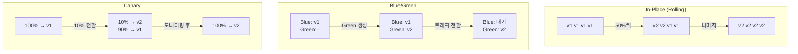

### In-Place (Rolling)

기존 서버에 새 버전을 배포한다.

**동작:**
1. 로드 밸런서에서 인스턴스 제거
2. 애플리케이션 중지
3. 새 버전 설치
4. 애플리케이션 시작
5. 헬스 체크
6. 로드 밸런서에 다시 추가

4대 서버에서 50% 동시 배포하면 아래처럼 진행된다.

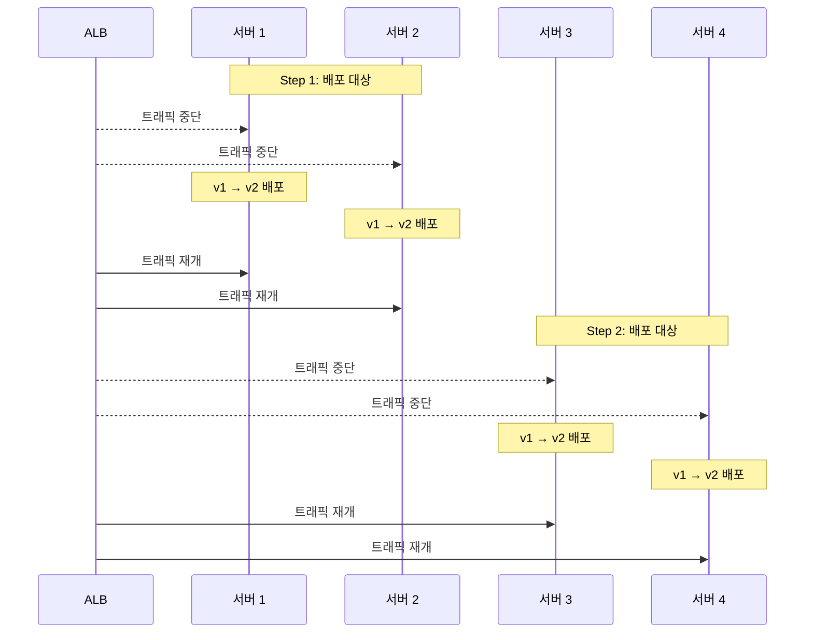

비용이 들지 않고 설정이 간단하다. 대신 배포 중 용량이 줄어들고, 롤백하려면 다시 배포해야 해서 느리다.

### Blue-Green

새 서버를 만들고 트래픽을 전환한다.

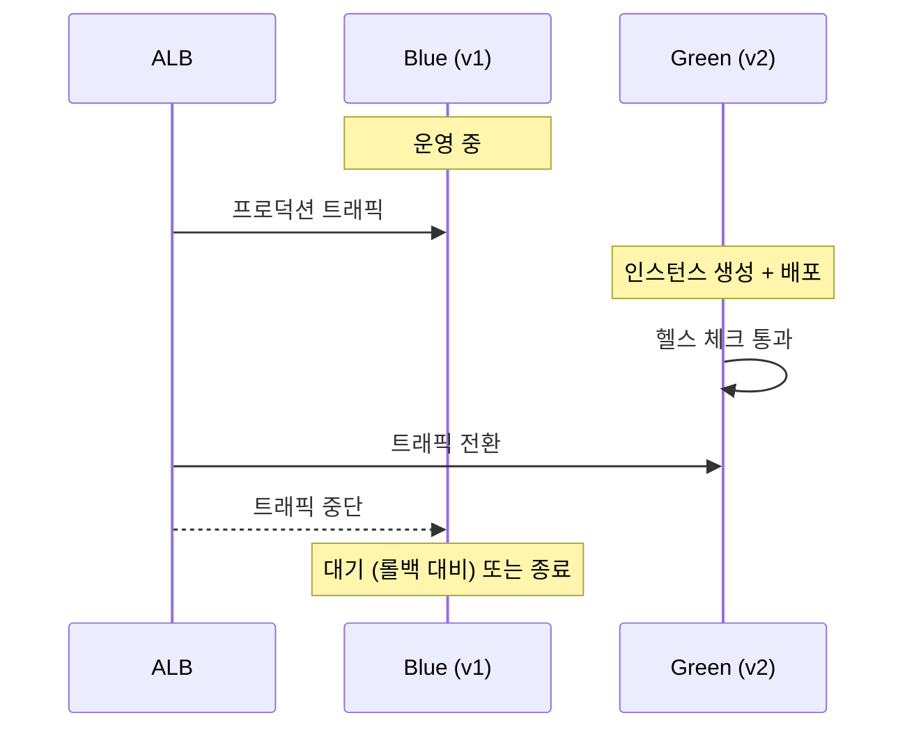

다운타임 없이 배포되고, 롤백은 트래픽을 Blue로 되돌리면 끝이다. 배포 중 2배 리소스가 필요해서 비용이 늘어난다.

### Canary

일부 트래픽만 새 버전으로 보낸다.

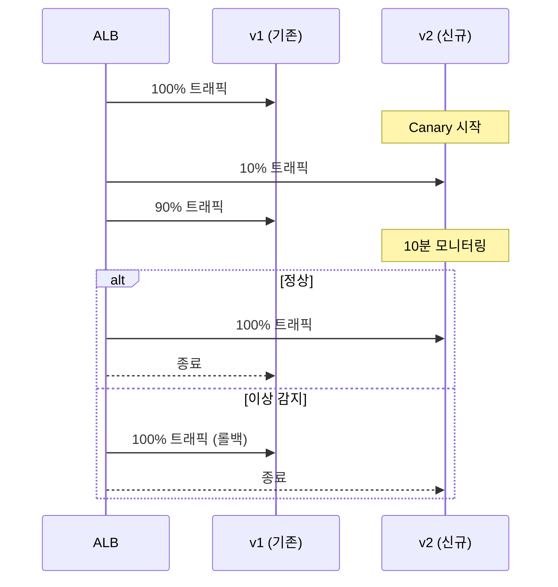

위험을 최소화하고 문제를 일찍 발견할 수 있다. 배포 시간이 길어지고 설정이 복잡하다.

## EC2 배포

### 기본 설정

**1. CodeDeploy Agent 설치:**
```bash
# Amazon Linux 2
sudo yum install -y ruby wget
cd /home/ec2-user
wget https://aws-codedeploy-us-west-2.s3.us-west-2.amazonaws.com/latest/install
chmod +x ./install
sudo ./install auto
sudo service codedeploy-agent start
```

**확인:**
```bash
sudo service codedeploy-agent status
```

**2. IAM Role 연결:**
EC2에 CodeDeploy Agent가 S3, CodeDeploy에 접근할 수 있도록 IAM Role을 연결한다.

**정책:**
```json
{
  "Version": "2012-10-17",
  "Statement": [
    {
      "Effect": "Allow",
      "Action": [
        "s3:GetObject",
        "s3:ListBucket"
      ],
      "Resource": [
        "arn:aws:s3:::my-deployment-bucket/*"
      ]
    }
  ]
}
```

**3. 태그 추가:**
배포 대상 인스턴스에 태그를 추가한다.

```
Key: Environment
Value: Production
```

### appspec.yml

배포 동작을 정의한다. 프로젝트 루트에 위치한다.

**기본 구조:**
```yaml
version: 0.0
os: linux
files:
  - source: /
    destination: /opt/myapp
hooks:
  BeforeInstall:
    - location: scripts/before_install.sh
      timeout: 300
      runas: root
  AfterInstall:
    - location: scripts/after_install.sh
      timeout: 300
      runas: root
  ApplicationStart:
    - location: scripts/start_server.sh
      timeout: 300
      runas: root
  ApplicationStop:
    - location: scripts/stop_server.sh
      timeout: 300
      runas: root
  ValidateService:
    - location: scripts/validate_service.sh
      timeout: 300
```

### Lifecycle Hooks

EC2/온프레미스 배포에서 각 훅이 실행되는 순서와 역할이다.

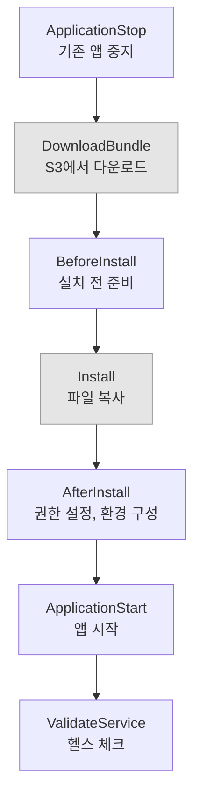

회색 단계(DownloadBundle, Install)는 CodeDeploy가 자동으로 처리하므로 스크립트를 작성하지 않는다. 나머지 5개 훅에 스크립트를 연결해서 배포 동작을 제어한다.

### 실무 스크립트

**scripts/stop_server.sh:**
```bash
#!/bin/bash
if systemctl is-active --quiet myapp; then
  echo "Stopping application..."
  sudo systemctl stop myapp
else
  echo "Application is not running"
fi
```

**scripts/before_install.sh:**
```bash
#!/bin/bash
echo "Cleaning up old files..."
rm -rf /opt/myapp/*

echo "Creating directories..."
mkdir -p /opt/myapp/logs
```

**scripts/after_install.sh:**
```bash
#!/bin/bash
echo "Setting permissions..."
chown -R myapp:myapp /opt/myapp
chmod +x /opt/myapp/bin/start.sh

echo "Loading environment variables..."
cp /opt/myapp/config/production.env /opt/myapp/.env
```

**scripts/start_server.sh:**
```bash
#!/bin/bash
echo "Starting application..."
sudo systemctl start myapp
```

**scripts/validate_service.sh:**
```bash
#!/bin/bash
echo "Validating service..."

# HTTP 헬스 체크
for i in {1..30}; do
  HTTP_CODE=$(curl -s -o /dev/null -w "%{http_code}" http://localhost:8080/health)
  if [ $HTTP_CODE -eq 200 ]; then
    echo "Service is healthy"
    exit 0
  fi
  echo "Waiting for service... ($i/30)"
  sleep 2
done

echo "Service validation failed"
exit 1
```

### Deployment Group 생성

**콘솔:**
1. CodeDeploy 콘솔
2. Applications → Create application
3. Name: MyApp
4. Compute platform: EC2/On-premises
5. Create deployment group
6. Name: Production
7. Service role: CodeDeploy role
8. Deployment type: In-place
9. Environment: EC2 instances (Tag: Environment=Production)
10. Deployment settings: CodeDeployDefault.AllAtOnce
11. Load balancer: My-ALB

**CLI:**
```bash
aws deploy create-deployment-group \
  --application-name MyApp \
  --deployment-group-name Production \
  --deployment-config-name CodeDeployDefault.OneAtATime \
  --ec2-tag-filters Key=Environment,Value=Production,Type=KEY_AND_VALUE \
  --service-role-arn arn:aws:iam::123456789012:role/CodeDeployServiceRole \
  --load-balancer-info targetGroupInfoList=[{name=my-target-group}]
```

### 배포 실행

**CLI:**
```bash
aws deploy create-deployment \
  --application-name MyApp \
  --deployment-group-name Production \
  --s3-location bucket=my-deployment-bucket,key=app-v1.0.zip,bundleType=zip
```

**GitHub 연동:**
```bash
aws deploy create-deployment \
  --application-name MyApp \
  --deployment-group-name Production \
  --github-location repository=my-org/my-app,commitId=abc123
```

## Deployment Configurations

### 사전 정의 구성

**AllAtOnce:**
모든 인스턴스에 동시 배포.
- 빠름
- 일시적 다운타임

**HalfAtATime:**
50%씩 배포.
- 중간 속도
- 용량 50% 유지

**OneAtATime:**
한 번에 한 대씩.
- 느림
- 용량 최대 유지
- 안전

### 커스텀 구성

**예시: 25%씩 배포**
```bash
aws deploy create-deployment-config \
  --deployment-config-name Custom25Percent \
  --minimum-healthy-hosts type=FLEET_PERCENT,value=75
```

75% 이상 정상 유지하면서 배포. 즉, 25%씩 배포.

## Blue-Green 배포

### Auto Scaling Group 사용

**동작:**
1. Green Auto Scaling Group 생성
2. Green에 배포
3. ALB 트래픽을 Green으로
4. Blue ASG 삭제 (또는 대기)

**Deployment Group 설정:**
```yaml
DeploymentGroup:
  BlueGreenDeploymentConfiguration:
    TerminateBlueInstancesOnDeploymentSuccess:
      Action: TERMINATE
      TerminationWaitTimeInMinutes: 5
    DeploymentReadyOption:
      ActionOnTimeout: CONTINUE_DEPLOYMENT
      WaitTimeInMinutes: 0
    GreenFleetProvisioningOption:
      Action: COPY_AUTO_SCALING_GROUP
```

**배포:**
```bash
aws deploy create-deployment \
  --application-name MyApp \
  --deployment-group-name BlueGreen \
  --deployment-config-name CodeDeployDefault.AllAtOnce
```

### 수동 승인

Green 배포 후 수동 승인까지 대기.

```yaml
DeploymentReadyOption:
  ActionOnTimeout: STOP_DEPLOYMENT
  WaitTimeInMinutes: 60
```

60분 내 승인하지 않으면 배포 중단.

## ECS 배포

### appspec.yml (ECS)

ECS용 appspec.yml은 EC2용과 구조가 다르다. 파일 복사 대신 Task Definition과 컨테이너 정보를 지정한다.

```yaml
version: 0.0
Resources:
  - TargetService:
      Type: AWS::ECS::Service
      Properties:
        TaskDefinition: "arn:aws:ecs:us-west-2:123456789012:task-definition/my-app:2"
        LoadBalancerInfo:
          ContainerName: "my-container"
          ContainerPort: 8080
Hooks:
  - BeforeInstall: "LambdaFunctionToValidateBeforeInstall"
  - AfterInstall: "LambdaFunctionToValidateAfterInstall"
  - AfterAllowTestTraffic: "LambdaFunctionToValidateAfterTestTrafficStarts"
  - BeforeAllowTraffic: "LambdaFunctionToValidateBeforeAllowingProductionTraffic"
  - AfterAllowTraffic: "LambdaFunctionToValidateAfterAllowingProductionTraffic"
```

ECS 배포에서 Hooks는 Lambda 함수로 실행된다. EC2처럼 쉘 스크립트가 아니라, 각 훅 단계에서 Lambda를 호출해서 검증 로직을 수행한다.

### ECS Lifecycle Hooks 흐름

ECS Blue/Green 배포에서 Lifecycle Hook의 실행 순서다. EC2 배포와 훅 이름이 다르다.

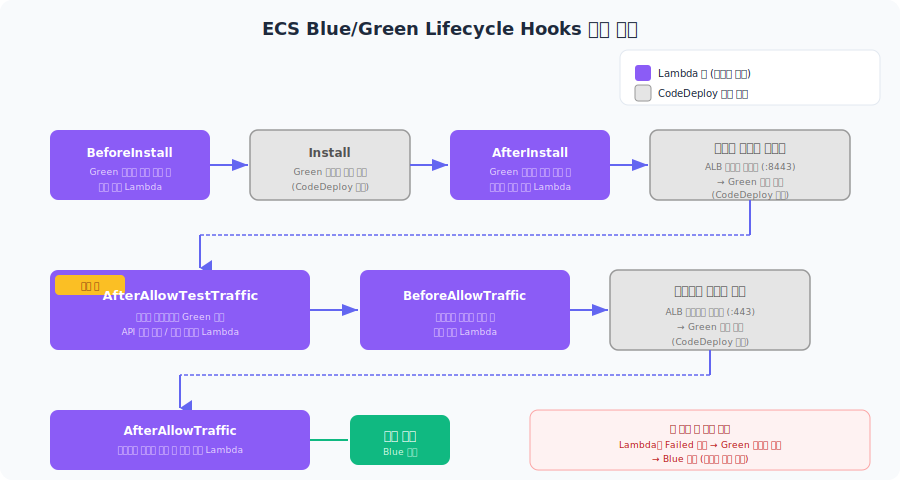

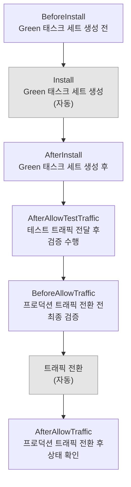

실무에서 가장 많이 쓰는 훅은 `AfterAllowTestTraffic`이다. 테스트 리스너로 Green 태스크에 요청을 보내서 API 응답을 확인하는 Lambda를 연결한다. 여기서 실패하면 프로덕션 트래픽 전환 없이 바로 롤백된다.

### Blue-Green (ECS)

ECS Blue/Green 배포의 전체 흐름이다.

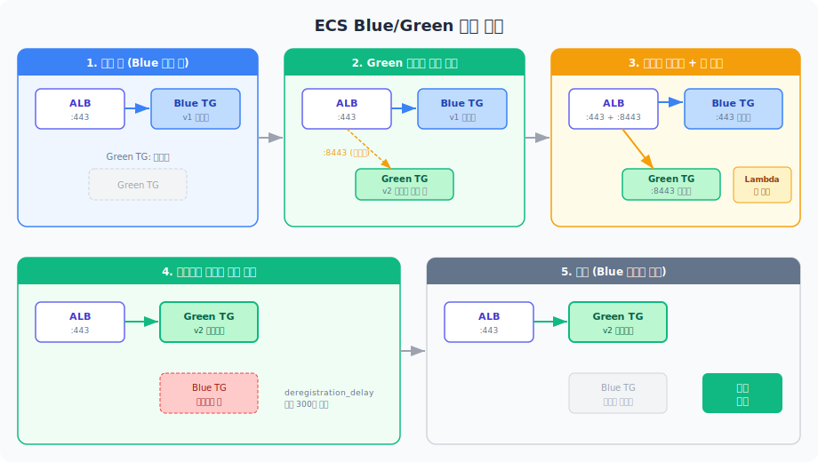

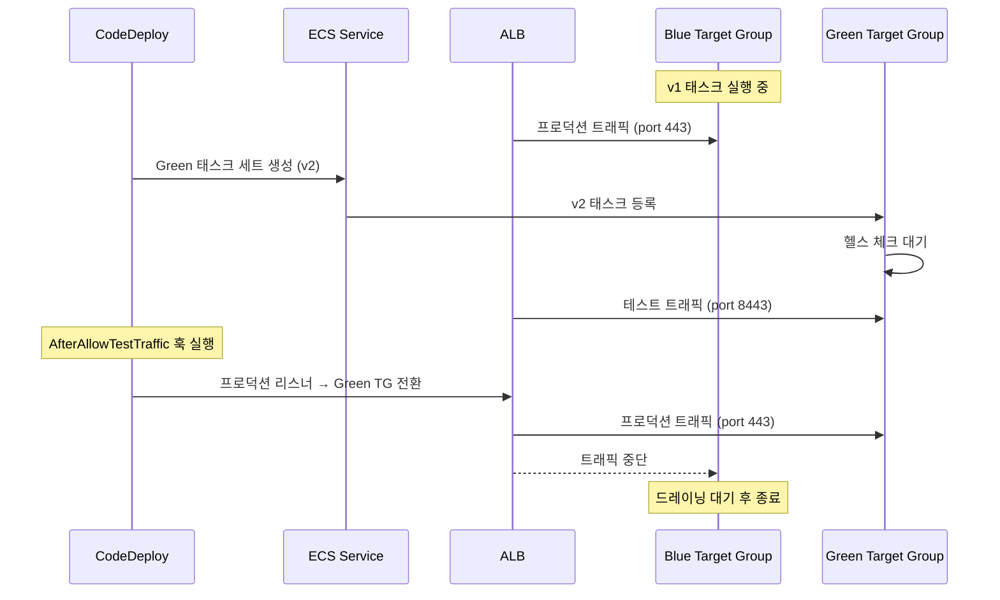

**ALB 구성:**

- Production Listener: Port 443 → Blue Target Group
- Test Listener: Port 8443 → Green Target Group

테스트 리스너 포트는 보안 그룹에서 내부 IP 대역만 허용하는 게 일반적이다. 외부에서 Green 태스크에 직접 접근하면 안 된다.

### ECS Blue/Green 실무 운영 이슈

ECS Blue/Green은 설정만으로 끝나지 않는다. 운영하다 보면 아래 문제들을 마주치게 된다.

#### 타겟 그룹 드레이닝 대기

프로덕션 리스너가 Green으로 전환된 후, Blue 타겟 그룹의 기존 연결이 끊기기까지 시간이 걸린다. ALB 타겟 그룹의 `deregistration_delay` 설정(기본값 300초)만큼 기존 연결을 유지하면서 드레이닝한다.

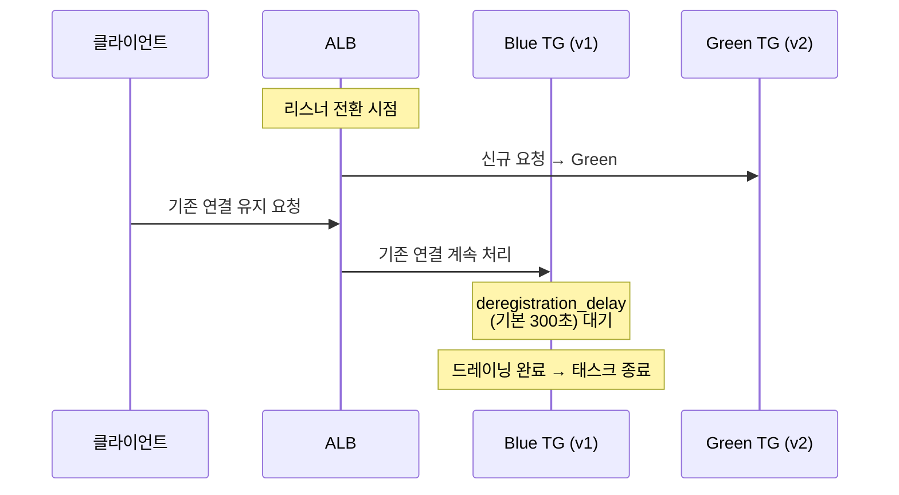

문제가 되는 상황:

- WebSocket이나 long polling 연결을 쓰는 서비스에서 드레이닝 시간이 300초를 넘기면 연결이 강제로 끊긴다. 클라이언트에서 재연결 로직이 없으면 에러가 발생한다.
- 드레이닝 시간을 너무 짧게 잡으면(예: 30초) 진행 중인 요청이 중단된다. API 응답 시간이 긴 서비스에서 특히 문제가 된다.
- CodeDeploy의 `terminationWaitTimeInMinutes`와 ALB의 `deregistration_delay`는 별도 설정이다. `terminationWaitTimeInMinutes`가 `deregistration_delay`보다 짧으면 드레이닝이 끝나기 전에 Blue 태스크가 종료된다.

설정 예시:

```bash
# ALB 타겟 그룹 드레이닝 타임아웃 설정
aws elbv2 modify-target-group-attributes \
  --target-group-arn arn:aws:elasticloadbalancing:... \
  --attributes Key=deregistration_delay.timeout_seconds,Value=120

# CodeDeploy Blue 인스턴스 종료 대기 시간
# terminationWaitTimeInMinutes는 deregistration_delay보다 길어야 한다
```

일반적인 API 서비스라면 `deregistration_delay`를 60~120초로, `terminationWaitTimeInMinutes`를 5분으로 설정한다.

#### 롤백 시 Task Definition 리비전 관리

ECS 배포는 Task Definition의 리비전 번호로 버전을 관리한다. 배포할 때마다 새 리비전이 생긴다. 롤백할 때 이 리비전 번호가 혼란을 일으키는 경우가 있다.

```
배포 히스토리:
  리비전 5 (v1.0) ← 안정 버전
  리비전 6 (v1.1) ← 배포 실패 → 롤백
  리비전 7 (v1.0) ← 롤백으로 생성된 새 리비전 (내용은 리비전 5와 동일)
```

주의할 점:

- 롤백하면 이전 리비전으로 돌아가는 게 아니라, 이전 리비전의 설정을 복사한 **새 리비전이 생성**된다. 리비전 번호만 보고 "리비전 5로 롤백했으니 리비전 5가 실행 중"이라고 착각하면 안 된다.
- 롤백이 반복되면 리비전 번호가 빠르게 증가한다. "현재 리비전이 15인데, 실제로는 리비전 5의 이미지로 실행 중"인 상황이 생긴다. 리비전 번호 대신 이미지 태그로 현재 배포 버전을 확인하는 게 정확하다.
- CI/CD 파이프라인에서 `task-definition.json`을 소스 코드와 함께 관리하고, 이미지 태그를 빌드 번호나 git commit hash로 지정하면 어떤 코드가 배포되어 있는지 추적하기 쉽다.

현재 실행 중인 Task Definition 확인:

```bash
# 서비스에서 실제 실행 중인 Task Definition 확인
aws ecs describe-services \
  --cluster prod-cluster \
  --services my-service \
  --query 'services[0].taskDefinition'

# 해당 리비전의 이미지 태그 확인
aws ecs describe-task-definition \
  --task-definition my-app:7 \
  --query 'taskDefinition.containerDefinitions[0].image'
```

#### appspec.yml 훅 타임아웃 이슈

ECS 배포의 각 Lifecycle Hook에는 Lambda 함수를 연결할 수 있고, 이 Lambda에는 타임아웃이 적용된다. 훅 타임아웃 기본값은 **1시간**이다.

문제가 되는 상황:

- `AfterAllowTestTraffic` 훅에서 통합 테스트를 돌리는데, 테스트가 실패하지 않고 **응답을 기다리면서 멈춰 있는 경우**가 있다. Green 태스크가 아직 완전히 기동하지 않았거나, 의존하는 외부 서비스가 느릴 때 발생한다. Lambda 자체 타임아웃(최대 15분)과 CodeDeploy 훅 타임아웃이 모두 지나야 배포가 실패 처리되므로, 최악의 경우 1시간 넘게 배포가 멈춰 있을 수 있다.
- Lambda 함수가 `put_lifecycle_event_hook_execution_status`를 호출하지 않고 종료하면, CodeDeploy는 훅 타임아웃이 만료될 때까지 계속 대기한다. Lambda 코드에서 모든 분기(성공, 실패, 예외)에서 반드시 상태를 보고해야 한다.

Lambda 훅 함수 작성 시 주의사항:

```python
import boto3
import traceback

codedeploy = boto3.client('codedeploy')

def handler(event, context):
    deployment_id = event['DeploymentId']
    hook_id = event['LifecycleEventHookExecutionId']

    try:
        # Green 태스크에 테스트 요청
        # 타임아웃을 반드시 설정해야 한다
        response = requests.get(
            'http://green-test-endpoint:8443/health',
            timeout=10
        )

        if response.status_code == 200:
            status = 'Succeeded'
        else:
            status = 'Failed'

    except Exception:
        traceback.print_exc()
        status = 'Failed'

    # 어떤 경우에도 반드시 상태를 보고한다
    # 이걸 빠뜨리면 훅 타임아웃까지 배포가 멈춘다
    codedeploy.put_lifecycle_event_hook_execution_status(
        deploymentId=deployment_id,
        lifecycleEventHookExecutionId=hook_id,
        status=status
    )
```

훅 타임아웃 커스터마이징:

```bash
# Deployment Group 생성/업데이트 시 훅 타임아웃 변경은 불가
# 대신 Lambda 함수의 타임아웃을 짧게 잡아서 제어한다
# Lambda 타임아웃 권장: 60~300초 (테스트 범위에 따라 조절)

aws lambda update-function-configuration \
  --function-name AfterAllowTestTrafficHook \
  --timeout 120
```

### Canary (ECS)

**Linear10PercentEvery1Minute:**
1분마다 10%씩 트래픽 전환.

**Canary10Percent5Minutes:**
10% 트래픽을 5분 동안 Green으로. 문제 없으면 나머지 90% 전환.

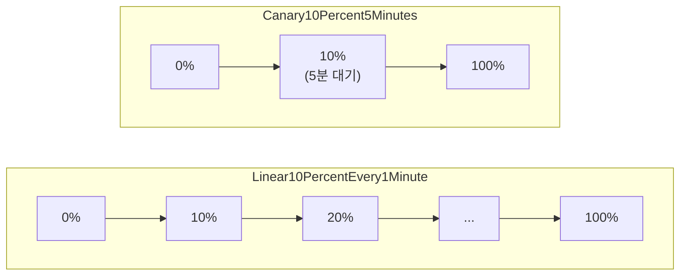

```bash
aws deploy create-deployment \
  --application-name MyECSApp \
  --deployment-group-name Production \
  --deployment-config-name CodeDeployDefault.ECSCanary10Percent5Minutes
```

Linear는 트래픽을 균등하게 나눠서 점진적으로 전환한다. 전환 중 문제를 세밀하게 감지할 수 있지만 배포 시간이 길다. Canary는 소량의 트래픽으로 한 번 검증한 뒤 전체를 전환한다. 대부분의 서비스에서는 Canary10Percent5Minutes로 충분하다.

## Lambda 배포

### appspec.yml (Lambda)

```yaml
version: 0.0
Resources:
  - MyFunction:
      Type: AWS::Lambda::Function
      Properties:
        Name: "my-function"
        Alias: "live"
        CurrentVersion: "1"
        TargetVersion: "2"
Hooks:
  - BeforeAllowTraffic: "PreTrafficHook"
  - AfterAllowTraffic: "PostTrafficHook"
```

### Canary (Lambda)

**LambdaCanary10Percent5Minutes:**
1. 10% 트래픽 → 새 버전
2. 5분 대기
3. 나머지 90% 전환

**Pre/Post Hook:**
```python
import boto3
import json

codedeploy = boto3.client('codedeploy')

def lambda_handler(event, context):
    deployment_id = event['DeploymentId']
    lifecycle_event_hook_execution_id = event['LifecycleEventHookExecutionId']
    
    # 테스트 실행
    result = run_smoke_tests()
    
    if result['success']:
        # 성공
        codedeploy.put_lifecycle_event_hook_execution_status(
            deploymentId=deployment_id,
            lifecycleEventHookExecutionId=lifecycle_event_hook_execution_id,
            status='Succeeded'
        )
    else:
        # 실패 → 롤백
        codedeploy.put_lifecycle_event_hook_execution_status(
            deploymentId=deployment_id,
            lifecycleEventHookExecutionId=lifecycle_event_hook_execution_id,
            status='Failed'
        )
```

## 자동 롤백

### 롤백 프로세스

ECS Blue/Green 배포에서 롤백이 발생하는 두 가지 시나리오다. 트래픽 전환 전과 후에 따라 롤백 동작이 다르다.

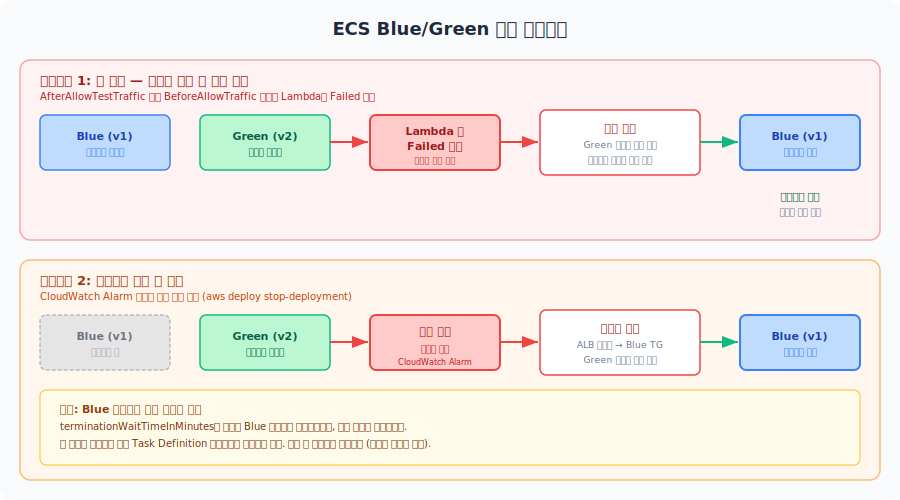

### 조건

**배포 실패 시:**
```yaml
AutoRollbackConfiguration:
  Enabled: true
  Events:
    - DEPLOYMENT_FAILURE
```

**CloudWatch Alarm 시:**
```yaml
AutoRollbackConfiguration:
  Enabled: true
  Events:
    - DEPLOYMENT_FAILURE
    - DEPLOYMENT_STOP_ON_ALARM
AlarmConfiguration:
  Enabled: true
  Alarms:
    - Name: high-error-rate
```

**예시:**
에러율이 5%를 넘으면 자동으로 이전 버전으로 롤백.

### 수동 롤백

```bash
aws deploy stop-deployment \
  --deployment-id d-ABCDEFGH \
  --auto-rollback-enabled
```

## 모니터링

### 배포 상태

**콘솔:**
CodeDeploy → Deployments → 배포 ID 선택

**표시:**
- 배포 상태 (진행 중, 성공, 실패)
- 인스턴스별 상태
- Lifecycle 단계별 진행률
- 에러 로그

**CLI:**
```bash
aws deploy get-deployment --deployment-id d-ABCDEFGH
```

### CloudWatch Logs

각 Lifecycle Hook의 로그를 CloudWatch Logs에 전송한다.

**설정 (appspec.yml):**
```yaml
version: 0.0
os: linux
hooks:
  AfterInstall:
    - location: scripts/after_install.sh
      timeout: 300
      runas: root
      # stdout, stderr 로그
```

**로그 그룹:**
`/aws/codedeploy/<deployment-group-name>`

## 비용

### 무료

**EC2/온프레미스:**
무료 (CodeDeploy Agent 사용)

**Lambda, ECS:**
무료

### 비용 발생 요소

**EC2 추가 인스턴스:**
Blue-Green 배포 시 일시적으로 2배 인스턴스.

**예시:**
- 기존: t3.medium × 4 = $134/월
- Blue-Green 배포 중 (1시간): 추가 $2.24
- 무시할 수준

**S3 (Artifact 저장):**
$0.023/GB-월

## 참고

- CodeDeploy 개발자 가이드: https://docs.aws.amazon.com/codedeploy/
- appspec 레퍼런스: https://docs.aws.amazon.com/codedeploy/latest/userguide/reference-appspec-file.html
- Deployment Configurations: https://docs.aws.amazon.com/codedeploy/latest/userguide/deployment-configurations.html

