# EC2

EC2(Elastic Compute Cloud)는 AWS에서 가상 서버를 빌려 쓰는 서비스다. 물리 서버를 직접 관리하지 않고도 원하는 OS, 사양의 서버를 몇 분 안에 만들 수 있다.

이 문서는 인스턴스 유형이나 구매 옵션이 아닌, EC2를 실제로 운영할 때 알아야 하는 기본기를 다룬다.

### EC2 기반 웹 서비스 구성 예시

실제 운영 환경에서 EC2가 다른 AWS 서비스와 어떻게 연결되는지 전체 그림을 먼저 보자.

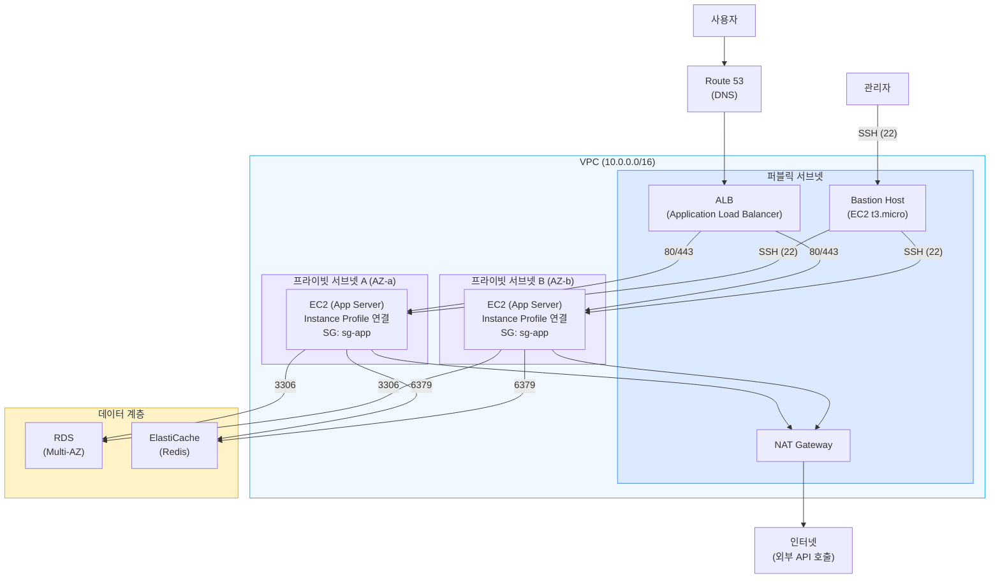

이 구성에서 EC2 인스턴스는 프라이빗 서브넷에 배치하고, ALB를 통해서만 트래픽을 받는다. SSH 접속은 퍼블릭 서브넷의 Bastion Host를 경유한다. 외부 API 호출이 필요하면 NAT Gateway를 거친다.

이 문서에서 다루는 보안 그룹, ENI, Instance Profile, User Data 같은 개념이 이 구성 안에서 어떤 역할을 하는지 알아두면 각 섹션을 이해하기 수월하다.

---

## 인스턴스 라이프사이클

EC2 인스턴스는 상태(state)를 가지고, 상태 전환에 따라 과금 여부가 달라진다. 이걸 제대로 이해하지 못하면 안 쓰는 인스턴스에 요금이 계속 나가는 상황이 생긴다.

### 상태 전환

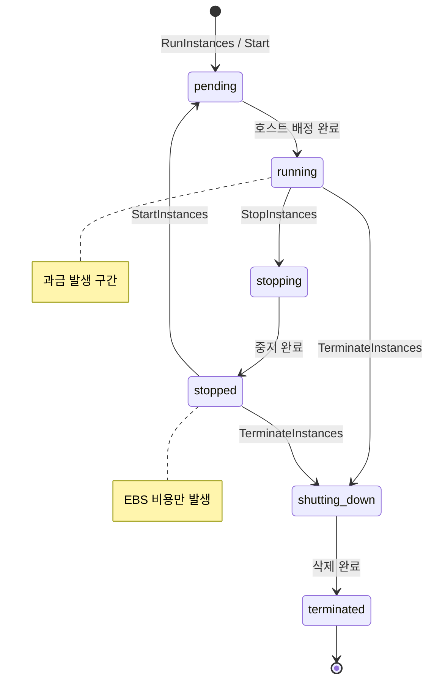

| 상태 | 과금 | 설명 |
|------|------|------|
| pending | X | 인스턴스 시작 준비 중. 호스트 배정, 네트워크 설정 등이 진행된다 |
| running | O | 정상 동작 중. 이 상태에서만 과금된다 (EBS 제외) |
| stopping | X | 중지 진행 중 |
| stopped | X | 인스턴스 중지 상태. EBS 볼륨 비용은 계속 나간다 |
| shutting-down | X | 종료 진행 중 |
| terminated | X | 인스턴스 삭제 완료. 복구 불가 |

### Stop vs Terminate

실무에서 가장 많이 혼동하는 부분이다. 리소스가 어떻게 되는지 한눈에 보자.

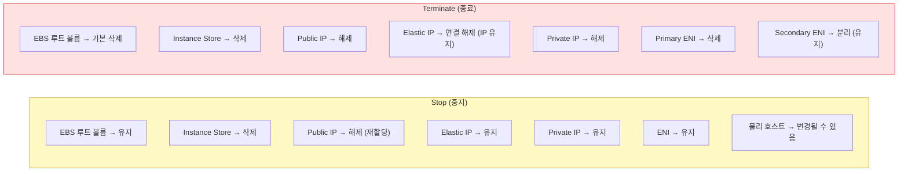

**Stop (중지)**

- 인스턴스를 끄는 것. 데이터(EBS)는 유지된다.
- 다시 Start하면 같은 EBS 볼륨으로 부팅된다.
- 단, Public IP는 바뀐다. 고정 IP가 필요하면 Elastic IP를 써야 한다.
- 인스턴스가 다른 물리 호스트로 옮겨갈 수 있다.
- Instance Store 볼륨의 데이터는 사라진다.

**Terminate (종료)**

- 인스턴스를 삭제하는 것. 기본 설정에서는 루트 EBS 볼륨도 함께 삭제된다.
- 복구할 수 없다.
- `DisableApiTermination` 속성을 켜면 API나 콘솔에서 실수로 terminate하는 걸 방지할 수 있다. 운영 서버에는 반드시 켜두자.

```bash
# 종료 방지 설정
aws ec2 modify-instance-attribute \
  --instance-id i-0123456789abcdef0 \
  --disable-api-termination
```

### Hibernate (최대 절전)

Stop과 비슷하지만, 메모리 상태를 EBS에 저장하고 재시작 시 복원한다. 부팅 시간이 긴 애플리케이션에서 유용하다.

제약사항이 꽤 있다:

- 루트 볼륨이 암호화된 EBS여야 한다
- 루트 볼륨 크기가 RAM보다 커야 한다
- 인스턴스 RAM이 150GB 이하여야 한다
- 60일 이상 hibernate 상태를 유지할 수 없다
- 온디맨드와 예약 인스턴스만 가능하다 (스팟 불가)

```bash
# hibernate 활성화된 인스턴스 중지
aws ec2 stop-instances \
  --instance-ids i-0123456789abcdef0 \
  --hibernate
```

### Reboot

인스턴스를 재부팅한다. Stop-Start와 다른 점은 같은 호스트에서 재시작되므로 Public IP가 유지된다는 것이다. OS 업데이트 후 재부팅이 필요한 경우에 쓴다.

---

## 인스턴스 타입 선택

EC2 인스턴스는 타입에 따라 vCPU, 메모리, 네트워크 대역폭, 스토리지 구성이 다르다. 워크로드에 맞지 않는 타입을 고르면 비용이 새거나 성능이 안 나온다.

### 패밀리 분류

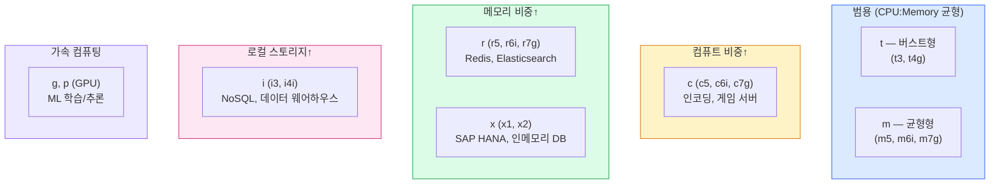

| 패밀리 | 용도 | 특징 |
|--------|------|------|
| t (t3, t4g) | 범용, 버스트형 | CPU 크레딧 기반. 평소엔 저렴하다가 부하가 몰리면 크레딧을 소모해서 일시적으로 성능을 낸다 |
| m (m5, m6i, m7g) | 범용 | vCPU와 메모리가 균형잡혀 있다. 일반 웹/앱 서버에 무난하다 |
| c (c5, c6i, c7g) | 컴퓨트 최적화 | CPU 비중이 높다. 인코딩, 시뮬레이션, 게임 서버에 쓴다 |
| r (r5, r6i, r7g) | 메모리 최적화 | 메모리가 넉넉하다. Redis, JVM 힙이 큰 앱에 적합하다 |
| x (x1, x2) | 초대형 메모리 | TB 단위 메모리. SAP HANA 같은 인메모리 DB |
| i (i3, i4i) | 스토리지 최적화 | NVMe SSD 인스턴스 스토어 제공 |
| g, p | GPU | 머신러닝, 그래픽 렌더링 |

타입 이름의 숫자는 세대다. 같은 패밀리라면 최신 세대가 가성비가 좋다. 끝에 붙는 알파벳도 의미가 있다. `g`는 ARM 기반(Graviton), `a`는 AMD, `i`는 Intel, `n`은 향상된 네트워킹이다.

### 선택 시 고려사항

CPU와 메모리 비율을 먼저 본다. 메모리가 부족하면 OOM이 나고, CPU가 부족하면 응답이 느려진다. CloudWatch 메트릭과 OS 레벨 모니터링(`top`, `free -m`)으로 실제 사용량을 파악한 뒤 결정한다. 신규 서비스라면 m5.large 같은 균형형으로 시작해서 실제 사용 패턴을 본 다음 c나 r로 옮기는 게 무난하다.

버스트형 t 타입은 워크로드 패턴을 봐야 한다. 평균 CPU 사용률이 낮고 가끔만 튀는 트래픽이라면 적합하다. 지속적으로 CPU를 쓰면 크레딧이 바닥나서 성능이 급격히 떨어진다. CloudWatch에서 `CPUCreditBalance` 메트릭을 모니터링해야 한다. 크레딧이 자주 0으로 떨어진다면 unlimited 모드를 켜거나 m 시리즈로 옮기는 게 낫다. unlimited 모드는 크레딧 초과분에 대해 별도로 과금되니 청구서를 주기적으로 확인한다.

Graviton(g 시리즈)도 검토할 만하다. 같은 성능에 가격이 20% 정도 싸다. 대부분의 자바, Node.js, Python 애플리케이션은 ARM에서도 문제없이 돈다. 네이티브 라이브러리를 쓴다면 ARM 빌드가 있는지만 확인하면 된다.

세대를 올리는 것만으로 비용이 줄 때가 있다. m5.large보다 m6i.large가 비슷한 가격에 성능이 더 좋다. AWS는 신세대를 점진적으로 출시하므로 6개월~1년에 한 번씩 교체 검토를 한다.

자세한 비교는 [EC2_Types](EC2_Types.md), 버스트형 동작은 [EC2_T-시리즈](EC2_T-시리즈.md) 문서에 정리해 두었다.

### 인스턴스 타입 변경

Stop 상태에서만 타입을 바꿀 수 있다. running 상태에서는 불가능하다.

```bash
aws ec2 stop-instances --instance-ids i-0123456789abcdef0
aws ec2 modify-instance-attribute \
  --instance-id i-0123456789abcdef0 \
  --instance-type "{\"Value\": \"m5.large\"}"
aws ec2 start-instances --instance-ids i-0123456789abcdef0
```

NVMe 전용 신세대로 바꿀 때 주의해야 한다. 디바이스 이름이 `/dev/xvda`에서 `/dev/nvme0n1`으로 바뀌어 fstab에 디바이스 경로를 박아두면 부팅이 실패한다. 디바이스 경로 대신 UUID나 라벨을 쓰는 게 안전하다.

---

## AMI (Amazon Machine Image)

AMI는 인스턴스의 스냅샷이다. OS, 설치된 소프트웨어, 설정, 데이터를 모두 포함한다. AMI로부터 동일한 구성의 인스턴스를 여러 대 만들 수 있다.

### AMI 구조와 인스턴스 생성 흐름

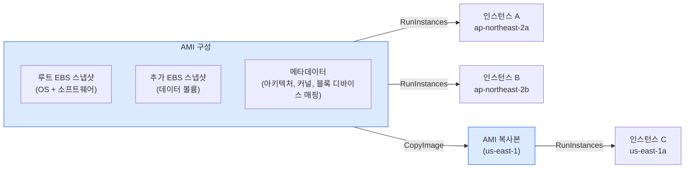

하나의 AMI에서 여러 인스턴스를 만들 수 있고, 다른 리전으로 복사해서 동일한 환경을 배포할 수 있다. AMI는 리전 단위 리소스라서, 다른 리전에서 쓰려면 반드시 복사해야 한다.

### AMI 종류

| 종류 | 설명 |
|------|------|
| AWS 제공 AMI | Amazon Linux, Ubuntu, Windows 등 공식 이미지 |
| Marketplace AMI | 서드파티가 만든 AMI. 소프트웨어 비용이 추가될 수 있다 |
| 커스텀 AMI | 직접 만든 AMI |
| 커뮤니티 AMI | 다른 사용자가 공유한 AMI. 보안 검증이 안 되어 있으므로 주의 |

### 커스텀 AMI 만들기

운영 중인 서버의 구성을 그대로 복제하고 싶을 때 커스텀 AMI를 만든다.

```bash
# 실행 중인 인스턴스에서 AMI 생성
aws ec2 create-image \
  --instance-id i-0123456789abcdef0 \
  --name "my-app-v1.2.3-2026-04-10" \
  --description "App v1.2.3 with Java 17, Nginx" \
  --no-reboot
```

`--no-reboot` 옵션을 주지 않으면 AMI 생성 시 인스턴스가 재부팅된다. 파일 시스템 일관성을 보장하기 위해서인데, 운영 중인 서버에서 무중단으로 AMI를 만들려면 `--no-reboot`을 쓴다. 대신 파일 시스템 일관성은 보장되지 않으므로, 가능하면 트래픽이 적은 시간에 만드는 게 안전하다.

### AMI 관리 시 주의할 점

- AMI 이름에 버전과 날짜를 포함하자. 나중에 어떤 AMI가 어떤 시점의 것인지 구분이 안 되면 골치 아프다.
- 오래된 AMI는 정리하자. AMI 자체는 무료지만, AMI에 포함된 EBS 스냅샷은 과금된다.
- AMI는 리전별이다. 다른 리전에서 쓰려면 복사해야 한다.

```bash
# 다른 리전으로 AMI 복사
aws ec2 copy-image \
  --source-region ap-northeast-2 \
  --source-image-id ami-0123456789abcdef0 \
  --name "my-app-v1.2.3-us-east-1" \
  --region us-east-1
```

---

## 시작 템플릿 (Launch Template)

같은 구성으로 인스턴스를 반복해서 만들 때 쓴다. AMI, 인스턴스 타입, 보안 그룹, 키 페어, IAM Role, User Data, EBS 매핑 같은 설정을 한 곳에 묶는다. Auto Scaling Group과 Spot Fleet은 시작 템플릿이나 시작 구성을 반드시 참조한다.

### 시작 구성(Launch Configuration)과의 차이

시작 구성은 한 번 만들면 수정할 수 없다. 변경하려면 새로 만들어 ASG 설정을 바꿔야 한다. 시작 템플릿은 버전 관리가 되고, 신규 기능(스팟 옵션, 메타데이터 옵션, 라이선스 등)은 시작 템플릿에만 추가된다. 새 프로젝트라면 무조건 시작 템플릿을 쓴다.

### 버전 관리 흐름

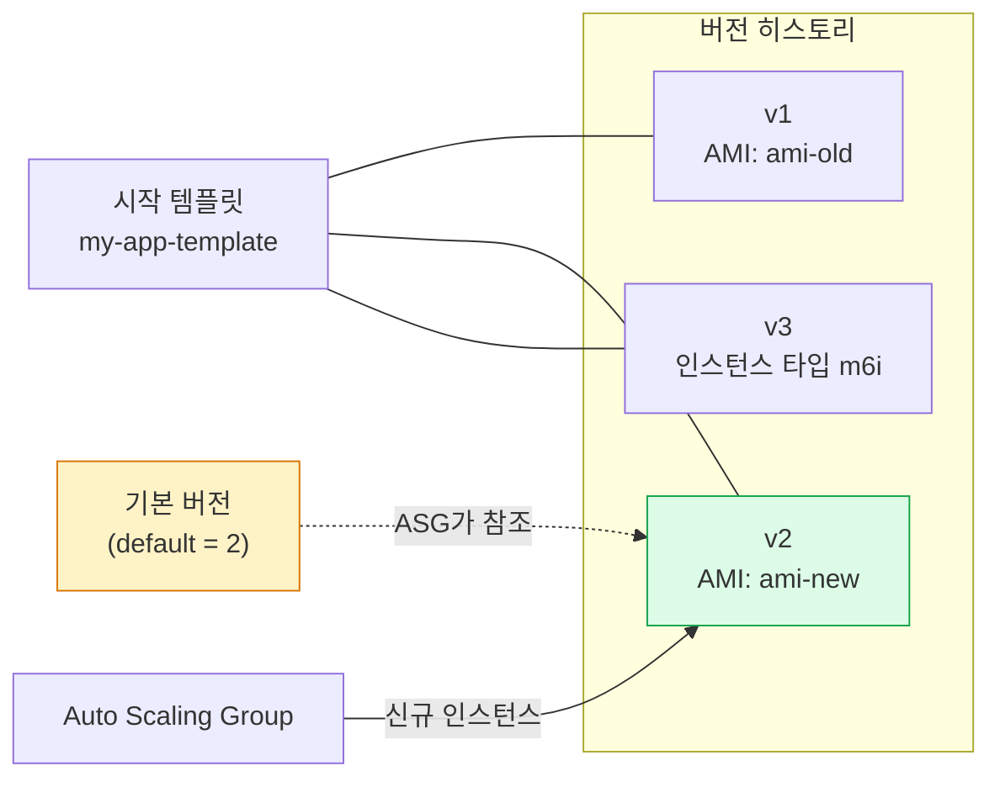

새 AMI나 설정 변경이 필요하면 새 버전을 만들고, 기본 버전(default version)을 변경한다. ASG는 기본 버전을 참조한다. 롤백은 기본 버전을 이전 번호로 되돌리는 것으로 끝난다.

```bash
# 시작 템플릿 생성
aws ec2 create-launch-template \
  --launch-template-name my-app-template \
  --version-description "v1 - initial" \
  --launch-template-data '{
    "ImageId": "ami-0123456789abcdef0",
    "InstanceType": "t3.medium",
    "KeyName": "my-key",
    "SecurityGroupIds": ["sg-0123456789abcdef0"],
    "IamInstanceProfile": {"Name": "MyEC2Profile"},
    "MetadataOptions": {"HttpTokens": "required", "HttpEndpoint": "enabled"},
    "BlockDeviceMappings": [{
      "DeviceName": "/dev/xvda",
      "Ebs": {"VolumeSize": 30, "VolumeType": "gp3", "Encrypted": true, "DeleteOnTermination": true}
    }],
    "TagSpecifications": [{
      "ResourceType": "instance",
      "Tags": [{"Key": "Name", "Value": "my-app"}, {"Key": "Env", "Value": "prod"}]
    }],
    "UserData": "IyEvYmluL2Jhc2gKeXVtIHVwZGF0ZSAteQ=="
  }'

# 새 버전 추가 (AMI만 교체)
aws ec2 create-launch-template-version \
  --launch-template-name my-app-template \
  --source-version 1 \
  --version-description "v2 - new AMI" \
  --launch-template-data '{"ImageId": "ami-newer123"}'

# 기본 버전 변경
aws ec2 modify-launch-template \
  --launch-template-name my-app-template \
  --default-version 2
```

### 실무에서의 배포 흐름

운영에서는 보통 이렇게 흘러간다.

1. 새 애플리케이션 버전을 빌드해 새 AMI를 만든다(Packer 같은 도구를 많이 쓴다)
2. 시작 템플릿의 새 버전을 만들면서 ImageId만 교체한다
3. ASG의 인스턴스 새로고침(Instance Refresh)을 트리거하면 기존 인스턴스가 단계적으로 새 버전으로 교체된다
4. 문제가 생기면 시작 템플릿의 기본 버전을 이전 버전으로 되돌리고 다시 Instance Refresh를 돌린다

이 패턴 덕분에 무중단 배포가 된다. 인스턴스에 SSH로 들어가 코드를 갈아끼우는 방식보다 훨씬 안전하다.

### 주의사항

User Data는 base64로 인코딩해 넣어야 한다. CLI에서 `--launch-template-data file://template.json`으로 외부 파일을 쓰면 인코딩 문제를 피할 수 있다.

KMS로 암호화된 AMI를 시작 템플릿에 쓰면, ASG의 Service-Linked Role이 해당 KMS 키를 사용할 권한이 있어야 한다. 권한이 없으면 인스턴스 시작이 조용히 실패하고 원인 추적이 까다롭다.

`$Latest`와 `$Default`를 헷갈리지 말자. `$Latest`는 가장 최근에 만든 버전이고, `$Default`는 기본 버전이다. ASG는 둘 중 무엇을 참조할지 명시적으로 지정한다. 검증 안 된 새 버전이 자동으로 운영에 반영되는 사고를 막으려면 `$Default`를 참조하고, 기본 버전 변경을 의도적인 배포 트리거로 쓴다.

---

## 보안 그룹 (Security Group)

보안 그룹은 인스턴스의 가상 방화벽이다. 인바운드/아웃바운드 트래픽을 제어한다.

### 트래픽 흐름

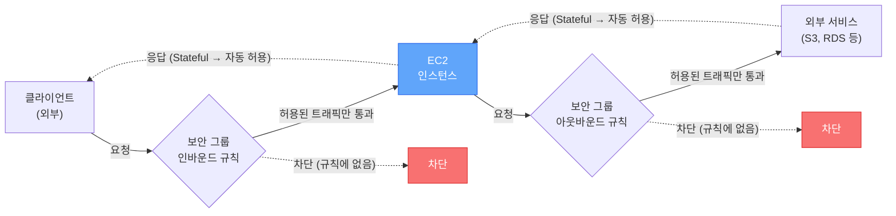

Stateful이라는 점이 핵심이다. 인바운드로 허용된 요청의 응답은 아웃바운드 규칙을 확인하지 않고 자동 통과한다. 반대도 마찬가지다.

### 기본 동작

- **Stateful**: 인바운드로 허용된 트래픽의 응답은 아웃바운드 규칙과 관계없이 자동 허용된다. 반대도 마찬가지.
- **기본값**: 인바운드는 모두 차단, 아웃바운드는 모두 허용.
- **허용만 가능**: 특정 트래픽을 차단하는 규칙(deny rule)은 만들 수 없다. 차단이 필요하면 NACL을 써야 한다.
- **여러 보안 그룹 연결 가능**: 하나의 인스턴스에 여러 보안 그룹을 붙이면 규칙이 합산된다.

### 실무에서 자주 하는 실수

**0.0.0.0/0으로 SSH 포트 여는 것**

테스트할 때 편하려고 22번 포트를 전체 개방하는 경우가 있다. 절대 하면 안 된다. 며칠 안에 무차별 대입 공격이 들어온다.

```bash
# 나쁜 예 - SSH를 전체에 개방
aws ec2 authorize-security-group-ingress \
  --group-id sg-0123456789abcdef0 \
  --protocol tcp --port 22 \
  --cidr 0.0.0.0/0

# 좋은 예 - 특정 IP만 허용
aws ec2 authorize-security-group-ingress \
  --group-id sg-0123456789abcdef0 \
  --protocol tcp --port 22 \
  --cidr 203.0.113.50/32
```

**보안 그룹 간 참조**

다른 보안 그룹의 ID를 소스로 지정할 수 있다. 예를 들어, ALB 보안 그룹에서 오는 트래픽만 EC2에서 허용하도록 설정한다. IP가 바뀌어도 규칙을 수정할 필요가 없다.

```bash
# ALB 보안 그룹에서 오는 80포트 트래픽만 허용
aws ec2 authorize-security-group-ingress \
  --group-id sg-ec2-group \
  --protocol tcp --port 80 \
  --source-group sg-alb-group
```

---

## 키 페어

EC2 인스턴스에 SSH로 접속할 때 사용하는 공개키/개인키 쌍이다.

### 동작 방식

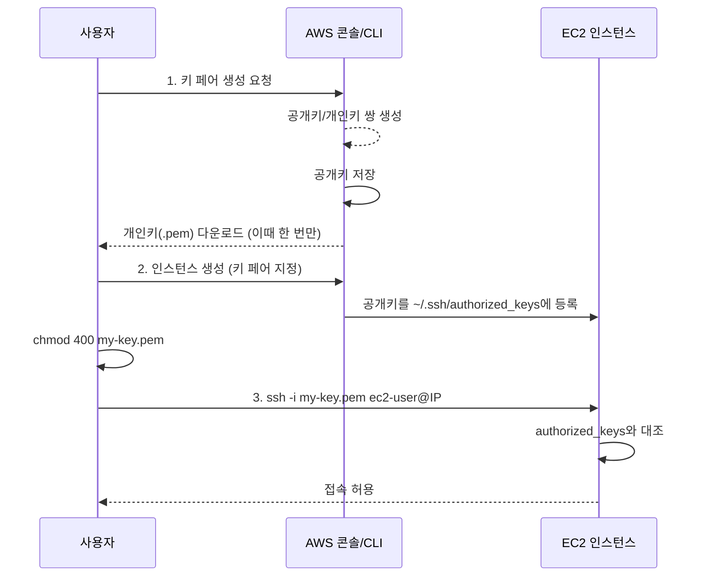

1. 키 페어를 생성하면 AWS가 공개키를 보관하고, 개인키(.pem)를 사용자에게 다운로드시킨다.
2. 인스턴스 생성 시 키 페어를 지정하면, 공개키가 인스턴스의 `~/.ssh/authorized_keys`에 들어간다.
3. 개인키로 SSH 접속한다.

### 주의사항

- 개인키는 한 번만 다운로드할 수 있다. 분실하면 해당 키 페어로는 접속할 수 없다.
- 개인키 파일 권한은 400으로 설정해야 한다. 그렇지 않으면 SSH 접속이 거부된다.

```bash
chmod 400 my-key.pem
ssh -i my-key.pem ec2-user@10.0.1.50
```

- 키 페어를 분실한 경우: Systems Manager Session Manager로 접속하거나, 인스턴스를 중지하고 루트 볼륨을 다른 인스턴스에 마운트해서 `authorized_keys`를 수정하는 방법이 있다.
- EC2 Instance Connect나 Session Manager를 쓰면 키 페어 관리 부담을 줄일 수 있다.

---

## ENI (Elastic Network Interface)

ENI는 VPC 안에서 인스턴스에 붙는 가상 네트워크 카드다. 인스턴스를 만들면 기본 ENI(eth0)가 자동으로 생성된다.

### ENI 구조

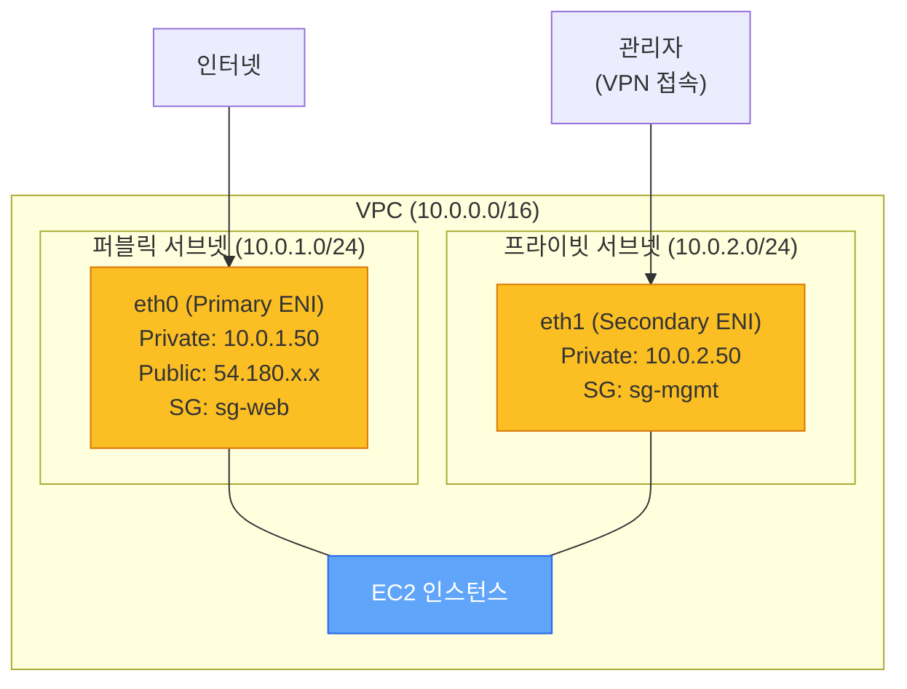

하나의 인스턴스에 ENI를 여러 개 붙이면, 서브넷별로 네트워크를 분리할 수 있다. 위 그림처럼 서비스 트래픽은 퍼블릭 서브넷의 eth0으로, 관리 트래픽은 프라이빗 서브넷의 eth1로 받는 구성이 가능하다.

### ENI가 가지는 것

- Private IP (primary + secondary)
- Public IP 또는 Elastic IP
- MAC 주소
- 보안 그룹
- Source/Destination Check 플래그

### ENI를 별도로 관리하는 경우

**장애 대응**: ENI를 한 인스턴스에서 떼어서 다른 인스턴스에 붙일 수 있다. Private IP가 유지되므로, 장애가 발생한 인스턴스의 IP를 새 인스턴스로 빠르게 옮길 수 있다.

```bash
# ENI를 다른 인스턴스로 이동
aws ec2 detach-network-interface \
  --attachment-id eni-attach-0123456789abcdef0

aws ec2 attach-network-interface \
  --network-interface-id eni-0123456789abcdef0 \
  --instance-id i-new-instance \
  --device-index 1
```

**듀얼 홈드 인스턴스**: 하나의 인스턴스에 ENI를 여러 개 붙여서 서로 다른 서브넷에 발을 걸칠 수 있다. 관리용 트래픽과 서비스 트래픽을 분리할 때 쓴다.

---

## Elastic IP

Elastic IP는 고정 Public IP다. 인스턴스를 Stop-Start해도 IP가 바뀌지 않는다.

### 과금

- 실행 중인 인스턴스에 연결되어 있으면 무료.
- 연결되지 않은 Elastic IP는 시간당 과금된다. 안 쓰는 Elastic IP는 바로 릴리스하자.
- 인스턴스당 하나 초과로 연결하면 추가 IP에 과금된다.

```bash
# Elastic IP 할당
aws ec2 allocate-address --domain vpc

# 인스턴스에 연결
aws ec2 associate-address \
  --instance-id i-0123456789abcdef0 \
  --allocation-id eipalloc-0123456789abcdef0

# 사용하지 않는 Elastic IP 릴리스
aws ec2 release-address \
  --allocation-id eipalloc-0123456789abcdef0
```

### 실무에서의 Elastic IP

Elastic IP를 남발하면 안 된다. AWS 계정당 리전별 기본 한도는 5개다. 서비스가 커지면 DNS 기반으로 트래픽을 라우팅하는 게 맞고, Elastic IP에 의존하는 아키텍처는 확장성이 떨어진다. ALB + Route 53 조합이 대부분의 경우 더 적합하다.

---

## EBS 볼륨 연결

EC2의 영속 스토리지는 EBS 볼륨으로 제공한다. 루트 볼륨은 인스턴스 생성 시 자동으로 붙고, 데이터 볼륨은 따로 만들어 인스턴스에 연결한다.

### 볼륨 연결 구조

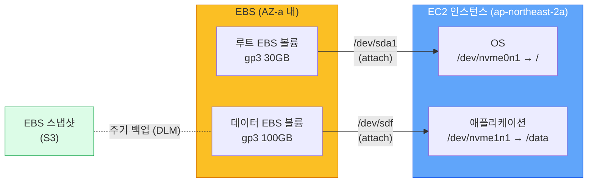

EBS 볼륨은 AZ에 묶인다. ap-northeast-2a에서 만든 볼륨은 같은 AZ의 인스턴스에만 붙일 수 있다. AZ를 옮기려면 스냅샷을 만들어 다른 AZ에서 새 볼륨으로 복원한다.

### 데이터 볼륨 연결 절차

```bash
# 1. 볼륨 생성 (인스턴스와 같은 AZ에 만든다)
aws ec2 create-volume \
  --availability-zone ap-northeast-2a \
  --size 100 \
  --volume-type gp3 \
  --encrypted

# 2. 인스턴스에 attach
aws ec2 attach-volume \
  --volume-id vol-0123456789abcdef0 \
  --instance-id i-0123456789abcdef0 \
  --device /dev/sdf
```

여기까지는 디바이스가 인스턴스에 보이기만 한 상태다. OS에서 사용하려면 파일 시스템을 만들고 마운트한다.

```bash
# OS에서 디바이스 확인 (Nitro 기반은 /dev/nvme1n1 등으로 보인다)
lsblk

# 파일 시스템 생성 (새 볼륨일 때만)
sudo mkfs -t xfs /dev/nvme1n1

# 마운트 포인트 생성 후 마운트
sudo mkdir -p /data
sudo mount /dev/nvme1n1 /data

# 부팅 시 자동 마운트 (UUID 기반이 안전하다)
sudo blkid /dev/nvme1n1
# 출력된 UUID를 /etc/fstab에 추가
echo 'UUID=xxxx-xxxx /data xfs defaults,nofail 0 2' | sudo tee -a /etc/fstab
```

`/etc/fstab`에 디바이스 경로를 그대로 넣으면 위험하다. 인스턴스 타입을 바꾸면 디바이스 이름이 달라져 부팅이 실패한다. UUID를 쓰면 안전하다. `nofail` 옵션도 추천한다. 볼륨이 일시적으로 안 붙는 상황에서 부팅 자체가 막히는 사고를 막아준다.

### EBS 볼륨 타입

| 타입 | 용도 | 특징 |
|------|------|------|
| gp3 | 범용 SSD | 기본 3000 IOPS, 125 MB/s. 추가 IOPS와 처리량을 따로 살 수 있다. 대부분의 워크로드에 적합 |
| gp2 | 구세대 범용 SSD | gp3보다 비싸고 성능도 떨어진다. 신규는 gp3 권장 |
| io2 / io2 Block Express | 고IOPS SSD | 보장 IOPS가 필요한 DB, 트랜잭션 워크로드 |
| st1 | 처리량 최적화 HDD | 빅데이터, 로그 처리. 부팅 볼륨으로는 못 쓴다 |
| sc1 | 콜드 HDD | 자주 안 쓰는 데이터. 가장 싸다 |

신규 프로젝트라면 gp3가 기본이다. gp2에서 gp3로 바꾸면 성능은 같거나 더 좋고 비용은 20% 정도 싸진다. 라이브 마이그레이션이 가능해서 다운타임 없이 변경된다.

```bash
aws ec2 modify-volume \
  --volume-id vol-0123456789abcdef0 \
  --volume-type gp3
```

### 스냅샷

EBS 스냅샷은 S3에 저장되는 백업이다. 증분(incremental)으로 저장돼서 두 번째 스냅샷부터는 변경된 블록만 적재된다.

```bash
aws ec2 create-snapshot \
  --volume-id vol-0123456789abcdef0 \
  --description "before-deploy-2026-05-01"
```

운영에서는 Data Lifecycle Manager(DLM)로 자동화한다. "매일 새벽 3시에 스냅샷, 7일치 보관" 같은 정책을 만들면 알아서 돈다. 스냅샷은 리전 단위 리소스다. 다른 리전으로 옮기려면 `copy-snapshot`을 쓴다. 재해 복구를 위해 정기적으로 다른 리전으로 복사하는 구성이 흔하다.

### 자주 겪는 문제

**볼륨이 detach되지 않는다.** OS에서 마운트가 풀리지 않은 상태로 detach를 시도하면 멈춘다. `umount /data` 후 detach해야 한다. 어쩔 수 없으면 `force-detach`를 쓰는데, 데이터 손상 위험이 있어 마지막 수단으로 둔다.

**볼륨 크기를 늘렸는데 OS에서 안 보인다.** EBS 볼륨 크기를 콘솔에서 늘려도 OS에서는 그대로다. 파티션과 파일 시스템을 확장해야 한다.

```bash
# 파티션 확장 (루트 볼륨일 때)
sudo growpart /dev/nvme0n1 1

# XFS 파일 시스템 확장
sudo xfs_growfs -d /

# ext4 파일 시스템 확장
sudo resize2fs /dev/nvme0n1p1
```

**IOPS 부족.** CloudWatch에서 `VolumeQueueLength`가 지속적으로 1 이상이면 IOPS 한도에 걸린 거다. gp3는 IOPS를 따로 살 수 있고, IOPS 보장이 필요하면 io2로 옮기는 선택지가 있다.

---

## Instance Metadata Service (IMDS)

인스턴스 내부에서 자기 자신에 대한 정보를 조회할 수 있는 서비스다. `169.254.169.254`라는 링크-로컬 주소로 접근한다.

### 조회할 수 있는 정보

- 인스턴스 ID, 타입, AMI ID
- Public/Private IP
- 보안 그룹
- IAM Role의 임시 자격 증명
- User Data

### IMDSv1 vs IMDSv2

```mermaid
flowchart TB
    subgraph v1["IMDSv1 (사용 금지)"]
        direction TB
        App1["애플리케이션 / SSRF 공격자"] -- "1. GET 요청 (인증 없음)" --> IMDS1["IMDS<br/>169.254.169.254"]
        IMDS1 -- "2. 메타데이터 응답<br/>(IAM 자격 증명 포함)" --> App1
    end

    subgraph v2["IMDSv2 (권장)"]
        direction TB
        App2["애플리케이션"] -- "1. PUT /api/token<br/>(TTL 헤더 필수)" --> IMDS2["IMDS<br/>169.254.169.254"]
        IMDS2 -- "2. 세션 토큰 발급" --> App2
        App2 -- "3. GET + 토큰 헤더" --> IMDS2
        IMDS2 -- "4. 메타데이터 응답" --> App2
    end

    SSRF["SSRF 공격자"] -. "PUT 요청 불가<br/>(리다이렉트 시 헤더 제거)" -.x IMDS2

    style v1 fill:#fef2f2,stroke:#dc2626
    style v2 fill:#f0fdf4,stroke:#16a34a
    style SSRF fill:#f87171,stroke:#dc2626,color:#fff
```

IMDSv1은 단순 GET 요청으로 메타데이터에 접근한다. SSRF(Server-Side Request Forgery) 공격에 취약하다. 2019년 Capital One 해킹 사건이 IMDSv1의 취약점을 이용한 것이었다.

**IMDSv2는 토큰 기반이다.** 먼저 PUT 요청으로 토큰을 받고, 그 토큰을 헤더에 넣어서 메타데이터를 조회한다. PUT 요청은 HTTP 리다이렉트 시 커스텀 헤더가 제거되므로, SSRF 공격으로 토큰을 탈취하기 어렵다. 토큰에 TTL이 있어서 유출되더라도 시간이 지나면 만료된다.

```bash
# IMDSv1 (사용하지 말 것)
curl http://169.254.169.254/latest/meta-data/instance-id

# IMDSv2 (권장)
TOKEN=$(curl -X PUT "http://169.254.169.254/latest/api/token" \
  -H "X-aws-ec2-metadata-token-ttl-seconds: 21600")

curl -H "X-aws-ec2-metadata-token: $TOKEN" \
  http://169.254.169.254/latest/meta-data/instance-id
```

### IMDSv2 강제 적용

새 인스턴스를 만들 때 IMDSv2만 허용하도록 설정하자. 기존 인스턴스도 변경할 수 있다.

```bash
# 기존 인스턴스에 IMDSv2 강제 적용
aws ec2 modify-instance-metadata-options \
  --instance-id i-0123456789abcdef0 \
  --http-tokens required \
  --http-endpoint enabled
```

계정 레벨에서 기본값을 IMDSv2로 설정할 수도 있다.

```bash
aws ec2 modify-instance-metadata-defaults \
  --http-tokens required \
  --http-endpoint enabled
```

---

## User Data

인스턴스가 처음 시작될 때 자동으로 실행되는 스크립트다. 서버 초기 설정을 자동화할 때 쓴다.

### 기본 동작

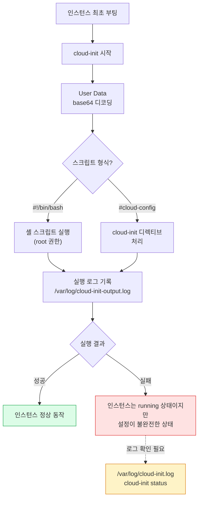

- 인스턴스 최초 부팅 시 root 권한으로 한 번만 실행된다.
- 셸 스크립트(`#!/bin/bash`)나 cloud-init 디렉티브 형식을 쓸 수 있다.
- 최대 16KB.
- 실행 로그는 `/var/log/cloud-init-output.log`에서 확인한다.
- User Data가 실패해도 인스턴스는 running 상태가 된다. 인스턴스가 떴다고 설정이 완료된 건 아니다. 반드시 로그를 확인해야 한다.

### 예제: 웹 서버 자동 설치

```bash
#!/bin/bash
yum update -y
yum install -y httpd
systemctl start httpd
systemctl enable httpd

echo "<h1>$(hostname -f)</h1>" > /var/www/html/index.html
```

### User Data 디버깅

User Data가 기대대로 동작하지 않는 경우가 많다. 디버깅 순서:

1. 인스턴스에 접속해서 `/var/log/cloud-init-output.log` 확인
2. `/var/log/cloud-init.log`에서 상세 로그 확인
3. `cloud-init status`로 실행 상태 확인

```bash
# cloud-init 실행 상태 확인
cloud-init status
# status: done (정상 완료)
# status: error (실패)

# cloud-init 재실행 (디버깅용)
cloud-init clean
cloud-init init
```

### 주의사항

- User Data는 base64로 인코딩되어 저장된다. 콘솔에서 확인할 때 디코딩이 필요할 수 있다.
- User Data에 비밀 정보(DB 비밀번호 등)를 하드코딩하면 안 된다. IMDS로 누구나 조회할 수 있다. Secrets Manager나 Parameter Store를 쓰자.
- Stop-Start로는 User Data가 재실행되지 않는다. 재실행이 필요하면 cloud-init 설정을 변경하거나 systemd 서비스로 분리해야 한다.

---

## Placement Group

인스턴스의 물리적 배치를 제어하는 기능이다. 기본적으로 AWS가 알아서 배치하지만, 특정 요구사항이 있을 때 직접 지정한다.

### 종류

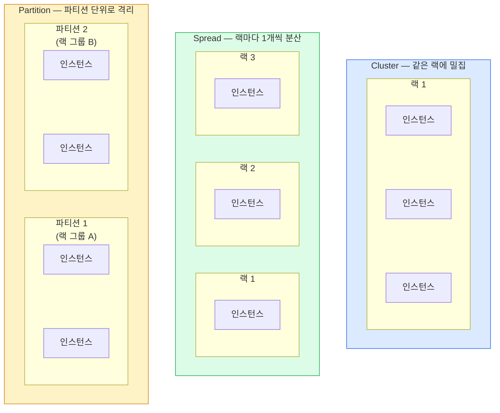

**Cluster Placement Group**

- 같은 AZ의 같은 랙(rack)에 인스턴스를 모아 배치한다.
- 인스턴스 간 네트워크 지연이 매우 낮다 (10Gbps 대역폭).
- HPC(고성능 컴퓨팅)나 인스턴스 간 통신이 빈번한 워크로드에 쓴다.
- 단점: 같은 랙이 장애가 나면 전부 영향을 받는다.

**Spread Placement Group**

- 인스턴스를 서로 다른 랙에 분산 배치한다.
- AZ당 최대 7개 인스턴스.
- 고가용성이 필요한 소규모 애플리케이션에 쓴다.
- 한 랙이 장애가 나도 다른 인스턴스는 영향이 없다.

**Partition Placement Group**

- AZ 내에서 여러 파티션(논리적 랙 그룹)으로 나눈다.
- 파티션 간에는 하드웨어를 공유하지 않는다.
- AZ당 최대 7개 파티션, 파티션당 인스턴스 수 제한 없음.
- HDFS, HBase, Cassandra처럼 데이터를 파티션 단위로 복제하는 분산 시스템에 적합하다.

```bash
# Cluster Placement Group 생성
aws ec2 create-placement-group \
  --group-name my-cluster \
  --strategy cluster

# Spread Placement Group 생성
aws ec2 create-placement-group \
  --group-name my-spread \
  --strategy spread

# Placement Group에 인스턴스 배치
aws ec2 run-instances \
  --image-id ami-0123456789abcdef0 \
  --instance-type c5.large \
  --placement "GroupName=my-cluster" \
  --count 3
```

---

## Instance Profile

EC2 인스턴스에 IAM Role을 부여하는 방법이다. 인스턴스에서 AWS API를 호출할 때 Access Key를 직접 넣는 대신 Instance Profile을 쓴다.

### Instance Profile 동작 구조

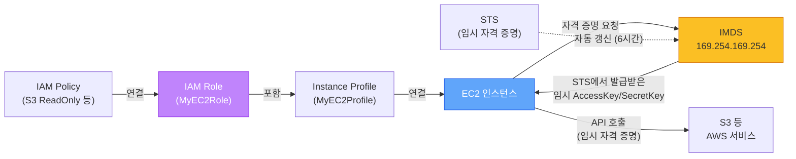

콘솔에서는 EC2에 "IAM Role을 연결한다"고 표시되지만, 실제로는 IAM Role → Instance Profile → EC2 순서로 연결된다. 인스턴스 안에서는 IMDS를 통해 STS가 발급한 임시 자격 증명을 받아서 AWS API를 호출한다.

### 왜 Instance Profile을 써야 하는가

인스턴스에 Access Key를 직접 설정하면:

- 키가 유출되면 해당 키의 모든 권한이 노출된다
- 키를 주기적으로 교체해야 하는데, 모든 인스턴스를 돌아다니면서 교체해야 한다
- 소스 코드나 설정 파일에 키가 남아 있을 수 있다

Instance Profile을 쓰면:

- IMDS를 통해 임시 자격 증명이 자동 발급된다
- 자격 증명은 자동으로 갱신된다 (보통 6시간 주기)
- IAM Role의 권한만 행사할 수 있다

```bash
# IAM Role 생성 (EC2가 assume할 수 있도록)
aws iam create-role \
  --role-name MyEC2Role \
  --assume-role-policy-document '{
    "Version": "2012-10-17",
    "Statement": [{
      "Effect": "Allow",
      "Principal": {"Service": "ec2.amazonaws.com"},
      "Action": "sts:AssumeRole"
    }]
  }'

# 정책 연결
aws iam attach-role-policy \
  --role-name MyEC2Role \
  --policy-arn arn:aws:iam::aws:policy/AmazonS3ReadOnlyAccess

# Instance Profile 생성 및 Role 연결
aws iam create-instance-profile \
  --instance-profile-name MyEC2Profile

aws iam add-role-to-instance-profile \
  --instance-profile-name MyEC2Profile \
  --role-name MyEC2Role

# 실행 중인 인스턴스에 Instance Profile 연결
aws ec2 associate-iam-instance-profile \
  --instance-id i-0123456789abcdef0 \
  --iam-instance-profile Name=MyEC2Profile
```

콘솔에서는 "IAM Role"이라고 표시되지만, 내부적으로는 Instance Profile이 만들어지고 Role이 연결되는 구조다. 콘솔에서 Role을 직접 선택하면 동명의 Instance Profile이 자동 생성된다.

---

## 스팟 인스턴스 중단 대응

스팟 인스턴스는 온디맨드 대비 최대 90%까지 싸지만, AWS가 용량을 회수해야 할 때 강제 종료된다. 회수 약 2분 전에 인스턴스 메타데이터로 알림이 오는데, 이 알림을 잡아 Graceful shutdown을 처리하지 않으면 진행 중인 요청이 중간에 끊긴다.

### 중단 알림 흐름

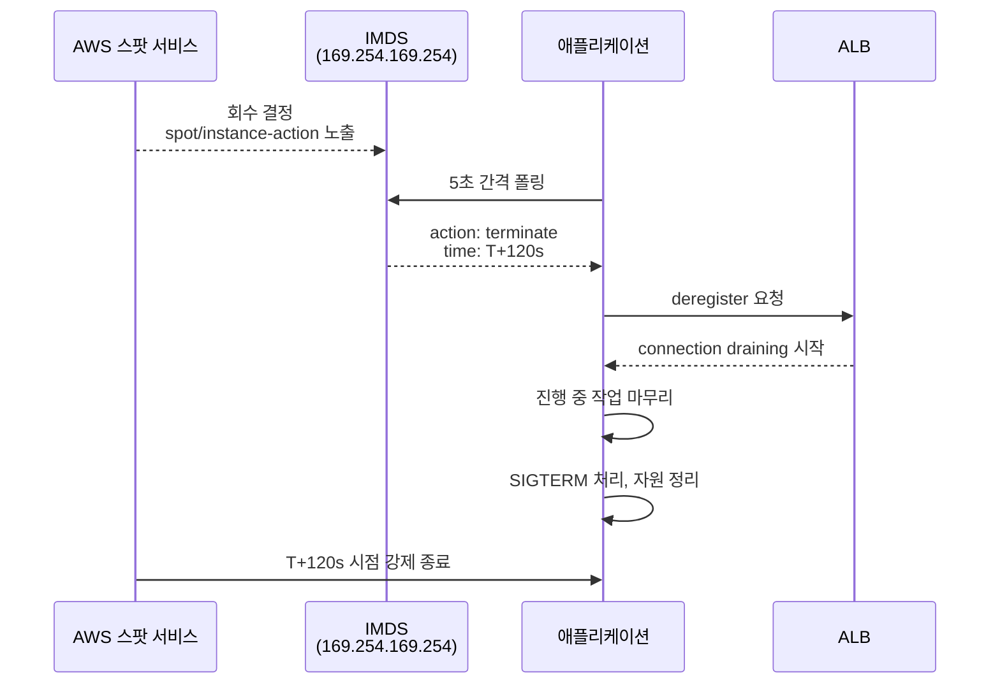

알림은 두 가지 경로로 받을 수 있다. 인스턴스 안에서 IMDS 폴링으로 받거나, EventBridge로 외부에서 받는다.

### IMDS 폴링 코드

```python
import requests
import time
import logging

def get_imds_token():
    return requests.put(
        "http://169.254.169.254/latest/api/token",
        headers={"X-aws-ec2-metadata-token-ttl-seconds": "21600"},
        timeout=2,
    ).text

def check_spot_interruption(token):
    try:
        r = requests.get(
            "http://169.254.169.254/latest/meta-data/spot/instance-action",
            headers={"X-aws-ec2-metadata-token": token},
            timeout=2,
        )
        if r.status_code == 200:
            return r.json()  # {"action": "terminate", "time": "..."}
    except requests.RequestException:
        pass
    return None

token = get_imds_token()
while True:
    notice = check_spot_interruption(token)
    if notice:
        logging.warning("스팟 회수 통지 수신: %s", notice)
        graceful_shutdown()
        break
    time.sleep(5)
```

회수 결정이 내려지지 않은 동안 IMDS는 404를 응답한다. 200이 떨어지는 순간이 회수가 확정된 시점이다. 폴링은 5초 간격이 무난하다. 더 짧게 하면 IMDS 부하가 늘고, 더 길게 하면 회수까지 남는 시간이 줄어든다. 토큰은 6시간 유효하니 매 폴링마다 발급할 필요는 없다.

### EventBridge로 받기

각 인스턴스에서 폴링하는 대신, EventBridge로 한 번에 받을 수 있다. ASG와 묶으면 알림을 받아 자동으로 다른 AZ에서 인스턴스를 띄우는 구성이 가능하다.

```json
{
  "source": ["aws.ec2"],
  "detail-type": ["EC2 Spot Instance Interruption Warning"]
}
```

이 이벤트를 Lambda나 SQS로 보내서 ALB에서 deregister하거나, 진행 중인 작업을 다른 인스턴스로 넘기는 처리를 한다.

### 운영 시 고려사항

**무상태 워크로드만 스팟에 올린다.** 세션이나 로컬 디스크에 의존하는 워크로드를 스팟에 올리면 회수 시마다 데이터가 날아간다. 무상태 API 서버, 배치 워커, CI 러너, 컨테이너 노드가 적합하다.

**여러 인스턴스 타입을 섞는다.** ASG에서 `MixedInstancesPolicy`로 여러 타입을 지정하면 한 타입의 스팟이 회수돼도 다른 타입으로 빠르게 보충된다. 같은 클래스의 다른 세대를 묶는 패턴이 흔하다(예: m5.large + m5a.large + m6i.large + m6a.large).

**Capacity Rebalancing을 켠다.** ASG의 옵션이다. AWS가 회수 가능성이 높다고 판단한 인스턴스를 미리 알려주고, ASG가 사전에 새 인스턴스를 띄워 교체한다. 2분 알림보다 더 일찍 대응할 수 있다.

**Spot 점유율을 100%로 두지 않는다.** ASG에서 온디맨드와 스팟을 섞는 구성이 안전하다. 베이스라인은 온디맨드, 트래픽 증가분은 스팟으로 받는 식이다. 한 리전에서 스팟 회수가 동시에 일어나는 사례가 종종 있어, 100% 스팟은 위험하다.

자세한 구매 옵션 비교는 [EC2_Purchase_Options](EC2_Purchase_Options.md) 문서를 본다.

---

## 운영 시 자주 겪는 문제

### 문제 진단 흐름

인스턴스에 문제가 생겼을 때 어떤 순서로 확인해야 하는지 정리한 흐름도다.

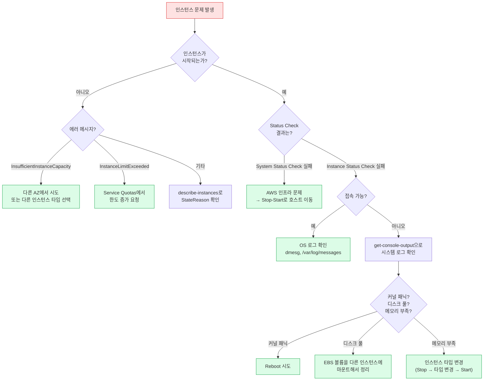

### 인스턴스가 시작되지 않는 경우

**InsufficientInstanceCapacity**: 해당 AZ에 요청한 인스턴스 타입의 여유 용량이 없다. 다른 AZ에서 시도하거나, 다른 인스턴스 타입을 선택한다.

**InstanceLimitExceeded**: 계정의 인스턴스 한도에 도달했다. AWS 콘솔의 Service Quotas에서 한도 증가를 요청한다.

### 인스턴스 상태가 impaired인 경우

시스템 상태 확인(System Status Check)과 인스턴스 상태 확인(Instance Status Check) 두 가지가 있다.

- **System Status Check 실패**: AWS 인프라 문제다. 인스턴스를 Stop-Start하면 다른 호스트로 옮겨진다.
- **Instance Status Check 실패**: OS 레벨 문제다. 커널 패닉, 메모리 부족 등. 인스턴스를 재부팅하거나 시스템 로그를 확인한다.

```bash
# 상태 확인
aws ec2 describe-instance-status \
  --instance-ids i-0123456789abcdef0

# 시스템 로그 확인 (콘솔 출력)
aws ec2 get-console-output \
  --instance-id i-0123456789abcdef0
```

### EBS 볼륨 관련

- 인스턴스를 terminate할 때 루트 볼륨이 함께 삭제되는 게 기본 설정이다. 데이터를 보존하려면 `DeleteOnTermination`을 false로 바꾸거나, 중요한 데이터는 별도 EBS 볼륨에 저장하자.
- EBS 볼륨의 IOPS 한도에 걸리면 I/O가 느려진다. CloudWatch에서 `VolumeQueueLength`가 높으면 IOPS 부족이다.

---

## 정리

EC2 운영의 핵심은 결국 몇 가지로 요약된다.

- **타입 선택**: CPU/메모리 비율을 실측 기반으로 정한다. 균형형(m)에서 시작해 워크로드 특성에 따라 c, r, t로 옮긴다. Graviton과 신세대로 세대 교체를 주기적으로 검토한다.
- **라이프사이클 이해**: Stop과 Terminate의 차이, 각 상태에서의 과금을 정확히 알아야 한다.
- **보안**: IMDSv2 강제, 보안 그룹 최소 권한 원칙, Instance Profile 사용, SSH 키와 Bastion 관리.
- **자동화**: AMI + 시작 템플릿 + ASG 조합으로 무중단 배포와 수평 확장을 구성한다.
- **스토리지**: EBS는 gp3 기준, fstab은 UUID + nofail. DLM으로 스냅샷 자동화.
- **비용**: 안 쓰는 Elastic IP 릴리스, Stopped 인스턴스의 EBS 비용 확인, 오래된 AMI/스냅샷 정리, 무상태 워크로드는 스팟으로.

이 기본기를 갖춘 상태에서 Auto Scaling, 로드 밸런서, 컨테이너로 확장해 나가면 된다.
