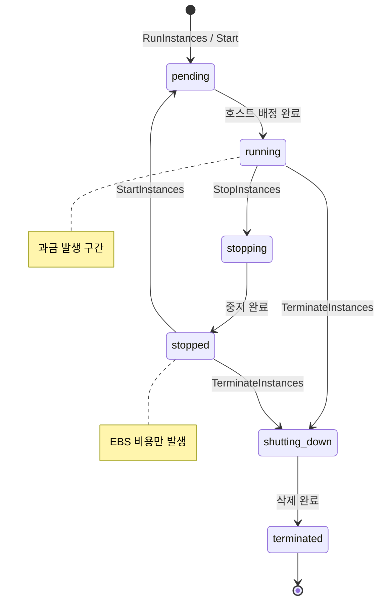
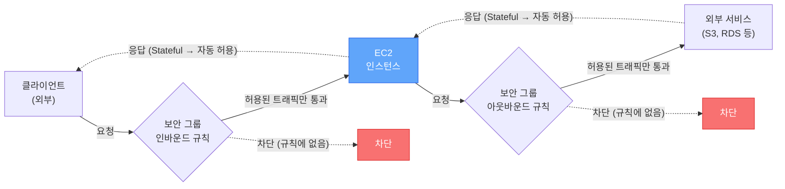

# EC2

EC2(Elastic Compute Cloud)는 AWS에서 가상 서버를 빌려 쓰는 서비스다. 물리 서버를 직접 관리하지 않고도 원하는 OS, 사양의 서버를 몇 분 안에 만들 수 있다.

이 문서는 인스턴스 유형이나 구매 옵션이 아닌, EC2를 실제로 운영할 때 알아야 하는 기본기를 다룬다.

---

## 인스턴스 라이프사이클

EC2 인스턴스는 상태(state)를 가지고, 상태 전환에 따라 과금 여부가 달라진다. 이걸 제대로 이해하지 못하면 안 쓰는 인스턴스에 요금이 계속 나가는 상황이 생긴다.

### 상태 전환



| 상태 | 과금 | 설명 |
|------|------|------|
| pending | X | 인스턴스 시작 준비 중. 호스트 배정, 네트워크 설정 등이 진행된다 |
| running | O | 정상 동작 중. 이 상태에서만 과금된다 (EBS 제외) |
| stopping | X | 중지 진행 중 |
| stopped | X | 인스턴스 중지 상태. EBS 볼륨 비용은 계속 나간다 |
| shutting-down | X | 종료 진행 중 |
| terminated | X | 인스턴스 삭제 완료. 복구 불가 |

### Stop vs Terminate

실무에서 가장 많이 혼동하는 부분이다.

**Stop (중지)**

- 인스턴스를 끄는 것. 데이터(EBS)는 유지된다.
- 다시 Start하면 같은 EBS 볼륨으로 부팅된다.
- 단, Public IP는 바뀐다. 고정 IP가 필요하면 Elastic IP를 써야 한다.
- 인스턴스가 다른 물리 호스트로 옮겨갈 수 있다.
- Instance Store 볼륨의 데이터는 사라진다.

**Terminate (종료)**

- 인스턴스를 삭제하는 것. 기본 설정에서는 루트 EBS 볼륨도 함께 삭제된다.
- 복구할 수 없다.
- `DisableApiTermination` 속성을 켜면 API나 콘솔에서 실수로 terminate하는 걸 방지할 수 있다. 운영 서버에는 반드시 켜두자.

```bash
# 종료 방지 설정
aws ec2 modify-instance-attribute \
  --instance-id i-0123456789abcdef0 \
  --disable-api-termination
```

### Hibernate (최대 절전)

Stop과 비슷하지만, 메모리 상태를 EBS에 저장하고 재시작 시 복원한다. 부팅 시간이 긴 애플리케이션에서 유용하다.

제약사항이 꽤 있다:

- 루트 볼륨이 암호화된 EBS여야 한다
- 루트 볼륨 크기가 RAM보다 커야 한다
- 인스턴스 RAM이 150GB 이하여야 한다
- 60일 이상 hibernate 상태를 유지할 수 없다
- 온디맨드와 예약 인스턴스만 가능하다 (스팟 불가)

```bash
# hibernate 활성화된 인스턴스 중지
aws ec2 stop-instances \
  --instance-ids i-0123456789abcdef0 \
  --hibernate
```

### Reboot

인스턴스를 재부팅한다. Stop-Start와 다른 점은 같은 호스트에서 재시작되므로 Public IP가 유지된다는 것이다. OS 업데이트 후 재부팅이 필요한 경우에 쓴다.

---

## AMI (Amazon Machine Image)

AMI는 인스턴스의 스냅샷이다. OS, 설치된 소프트웨어, 설정, 데이터를 모두 포함한다. AMI로부터 동일한 구성의 인스턴스를 여러 대 만들 수 있다.

### AMI 종류

| 종류 | 설명 |
|------|------|
| AWS 제공 AMI | Amazon Linux, Ubuntu, Windows 등 공식 이미지 |
| Marketplace AMI | 서드파티가 만든 AMI. 소프트웨어 비용이 추가될 수 있다 |
| 커스텀 AMI | 직접 만든 AMI |
| 커뮤니티 AMI | 다른 사용자가 공유한 AMI. 보안 검증이 안 되어 있으므로 주의 |

### 커스텀 AMI 만들기

운영 중인 서버의 구성을 그대로 복제하고 싶을 때 커스텀 AMI를 만든다.

```bash
# 실행 중인 인스턴스에서 AMI 생성
aws ec2 create-image \
  --instance-id i-0123456789abcdef0 \
  --name "my-app-v1.2.3-2026-04-10" \
  --description "App v1.2.3 with Java 17, Nginx" \
  --no-reboot
```

`--no-reboot` 옵션을 주지 않으면 AMI 생성 시 인스턴스가 재부팅된다. 파일 시스템 일관성을 보장하기 위해서인데, 운영 중인 서버에서 무중단으로 AMI를 만들려면 `--no-reboot`을 쓴다. 대신 파일 시스템 일관성은 보장되지 않으므로, 가능하면 트래픽이 적은 시간에 만드는 게 안전하다.

### AMI 관리 시 주의할 점

- AMI 이름에 버전과 날짜를 포함하자. 나중에 어떤 AMI가 어떤 시점의 것인지 구분이 안 되면 골치 아프다.
- 오래된 AMI는 정리하자. AMI 자체는 무료지만, AMI에 포함된 EBS 스냅샷은 과금된다.
- AMI는 리전별이다. 다른 리전에서 쓰려면 복사해야 한다.

```bash
# 다른 리전으로 AMI 복사
aws ec2 copy-image \
  --source-region ap-northeast-2 \
  --source-image-id ami-0123456789abcdef0 \
  --name "my-app-v1.2.3-us-east-1" \
  --region us-east-1
```

---

## 보안 그룹 (Security Group)

보안 그룹은 인스턴스의 가상 방화벽이다. 인바운드/아웃바운드 트래픽을 제어한다.

### 트래픽 흐름



Stateful이라는 점이 핵심이다. 인바운드로 허용된 요청의 응답은 아웃바운드 규칙을 확인하지 않고 자동 통과한다. 반대도 마찬가지다.

### 기본 동작

- **Stateful**: 인바운드로 허용된 트래픽의 응답은 아웃바운드 규칙과 관계없이 자동 허용된다. 반대도 마찬가지.
- **기본값**: 인바운드는 모두 차단, 아웃바운드는 모두 허용.
- **허용만 가능**: 특정 트래픽을 차단하는 규칙(deny rule)은 만들 수 없다. 차단이 필요하면 NACL을 써야 한다.
- **여러 보안 그룹 연결 가능**: 하나의 인스턴스에 여러 보안 그룹을 붙이면 규칙이 합산된다.

### 실무에서 자주 하는 실수

**0.0.0.0/0으로 SSH 포트 여는 것**

테스트할 때 편하려고 22번 포트를 전체 개방하는 경우가 있다. 절대 하면 안 된다. 며칠 안에 무차별 대입 공격이 들어온다.

```bash
# 나쁜 예 - SSH를 전체에 개방
aws ec2 authorize-security-group-ingress \
  --group-id sg-0123456789abcdef0 \
  --protocol tcp --port 22 \
  --cidr 0.0.0.0/0

# 좋은 예 - 특정 IP만 허용
aws ec2 authorize-security-group-ingress \
  --group-id sg-0123456789abcdef0 \
  --protocol tcp --port 22 \
  --cidr 203.0.113.50/32
```

**보안 그룹 간 참조**

다른 보안 그룹의 ID를 소스로 지정할 수 있다. 예를 들어, ALB 보안 그룹에서 오는 트래픽만 EC2에서 허용하도록 설정한다. IP가 바뀌어도 규칙을 수정할 필요가 없다.

```bash
# ALB 보안 그룹에서 오는 80포트 트래픽만 허용
aws ec2 authorize-security-group-ingress \
  --group-id sg-ec2-group \
  --protocol tcp --port 80 \
  --source-group sg-alb-group
```

---

## 키 페어

EC2 인스턴스에 SSH로 접속할 때 사용하는 공개키/개인키 쌍이다.

### 동작 방식

1. 키 페어를 생성하면 AWS가 공개키를 보관하고, 개인키(.pem)를 사용자에게 다운로드시킨다.
2. 인스턴스 생성 시 키 페어를 지정하면, 공개키가 인스턴스의 `~/.ssh/authorized_keys`에 들어간다.
3. 개인키로 SSH 접속한다.

### 주의사항

- 개인키는 한 번만 다운로드할 수 있다. 분실하면 해당 키 페어로는 접속할 수 없다.
- 개인키 파일 권한은 400으로 설정해야 한다. 그렇지 않으면 SSH 접속이 거부된다.

```bash
chmod 400 my-key.pem
ssh -i my-key.pem ec2-user@10.0.1.50
```

- 키 페어를 분실한 경우: Systems Manager Session Manager로 접속하거나, 인스턴스를 중지하고 루트 볼륨을 다른 인스턴스에 마운트해서 `authorized_keys`를 수정하는 방법이 있다.
- EC2 Instance Connect나 Session Manager를 쓰면 키 페어 관리 부담을 줄일 수 있다.

---

## ENI (Elastic Network Interface)

ENI는 VPC 안에서 인스턴스에 붙는 가상 네트워크 카드다. 인스턴스를 만들면 기본 ENI(eth0)가 자동으로 생성된다.

### ENI가 가지는 것

- Private IP (primary + secondary)
- Public IP 또는 Elastic IP
- MAC 주소
- 보안 그룹
- Source/Destination Check 플래그

### ENI를 별도로 관리하는 경우

**장애 대응**: ENI를 한 인스턴스에서 떼어서 다른 인스턴스에 붙일 수 있다. Private IP가 유지되므로, 장애가 발생한 인스턴스의 IP를 새 인스턴스로 빠르게 옮길 수 있다.

```bash
# ENI를 다른 인스턴스로 이동
aws ec2 detach-network-interface \
  --attachment-id eni-attach-0123456789abcdef0

aws ec2 attach-network-interface \
  --network-interface-id eni-0123456789abcdef0 \
  --instance-id i-new-instance \
  --device-index 1
```

**듀얼 홈드 인스턴스**: 하나의 인스턴스에 ENI를 여러 개 붙여서 서로 다른 서브넷에 발을 걸칠 수 있다. 관리용 트래픽과 서비스 트래픽을 분리할 때 쓴다.

---

## Elastic IP

Elastic IP는 고정 Public IP다. 인스턴스를 Stop-Start해도 IP가 바뀌지 않는다.

### 과금

- 실행 중인 인스턴스에 연결되어 있으면 무료.
- 연결되지 않은 Elastic IP는 시간당 과금된다. 안 쓰는 Elastic IP는 바로 릴리스하자.
- 인스턴스당 하나 초과로 연결하면 추가 IP에 과금된다.

```bash
# Elastic IP 할당
aws ec2 allocate-address --domain vpc

# 인스턴스에 연결
aws ec2 associate-address \
  --instance-id i-0123456789abcdef0 \
  --allocation-id eipalloc-0123456789abcdef0

# 사용하지 않는 Elastic IP 릴리스
aws ec2 release-address \
  --allocation-id eipalloc-0123456789abcdef0
```

### 실무에서의 Elastic IP

Elastic IP를 남발하면 안 된다. AWS 계정당 리전별 기본 한도는 5개다. 서비스가 커지면 DNS 기반으로 트래픽을 라우팅하는 게 맞고, Elastic IP에 의존하는 아키텍처는 확장성이 떨어진다. ALB + Route 53 조합이 대부분의 경우 더 적합하다.

---

## Instance Metadata Service (IMDS)

인스턴스 내부에서 자기 자신에 대한 정보를 조회할 수 있는 서비스다. `169.254.169.254`라는 링크-로컬 주소로 접근한다.

### 조회할 수 있는 정보

- 인스턴스 ID, 타입, AMI ID
- Public/Private IP
- 보안 그룹
- IAM Role의 임시 자격 증명
- User Data

### IMDSv1 vs IMDSv2

```mermaid
flowchart TB
    subgraph v1["IMDSv1 (사용 금지)"]
        direction TB
        App1["애플리케이션 / SSRF 공격자"] -- "1. GET 요청 (인증 없음)" --> IMDS1["IMDS<br/>169.254.169.254"]
        IMDS1 -- "2. 메타데이터 응답<br/>(IAM 자격 증명 포함)" --> App1
    end

    subgraph v2["IMDSv2 (권장)"]
        direction TB
        App2["애플리케이션"] -- "1. PUT /api/token<br/>(TTL 헤더 필수)" --> IMDS2["IMDS<br/>169.254.169.254"]
        IMDS2 -- "2. 세션 토큰 발급" --> App2
        App2 -- "3. GET + 토큰 헤더" --> IMDS2
        IMDS2 -- "4. 메타데이터 응답" --> App2
    end

    SSRF["SSRF 공격자"] -. "PUT 요청 불가<br/>(리다이렉트 시 헤더 제거)" -.x IMDS2

    style v1 fill:#fef2f2,stroke:#dc2626
    style v2 fill:#f0fdf4,stroke:#16a34a
    style SSRF fill:#f87171,stroke:#dc2626,color:#fff
```

IMDSv1은 단순 GET 요청으로 메타데이터에 접근한다. SSRF(Server-Side Request Forgery) 공격에 취약하다. 2019년 Capital One 해킹 사건이 IMDSv1의 취약점을 이용한 것이었다.

**IMDSv2는 토큰 기반이다.** 먼저 PUT 요청으로 토큰을 받고, 그 토큰을 헤더에 넣어서 메타데이터를 조회한다. PUT 요청은 HTTP 리다이렉트 시 커스텀 헤더가 제거되므로, SSRF 공격으로 토큰을 탈취하기 어렵다. 토큰에 TTL이 있어서 유출되더라도 시간이 지나면 만료된다.

```bash
# IMDSv1 (사용하지 말 것)
curl http://169.254.169.254/latest/meta-data/instance-id

# IMDSv2 (권장)
TOKEN=$(curl -X PUT "http://169.254.169.254/latest/api/token" \
  -H "X-aws-ec2-metadata-token-ttl-seconds: 21600")

curl -H "X-aws-ec2-metadata-token: $TOKEN" \
  http://169.254.169.254/latest/meta-data/instance-id
```

### IMDSv2 강제 적용

새 인스턴스를 만들 때 IMDSv2만 허용하도록 설정하자. 기존 인스턴스도 변경할 수 있다.

```bash
# 기존 인스턴스에 IMDSv2 강제 적용
aws ec2 modify-instance-metadata-options \
  --instance-id i-0123456789abcdef0 \
  --http-tokens required \
  --http-endpoint enabled
```

계정 레벨에서 기본값을 IMDSv2로 설정할 수도 있다.

```bash
aws ec2 modify-instance-metadata-defaults \
  --http-tokens required \
  --http-endpoint enabled
```

---

## User Data

인스턴스가 처음 시작될 때 자동으로 실행되는 스크립트다. 서버 초기 설정을 자동화할 때 쓴다.

### 기본 동작

- 인스턴스 최초 부팅 시 root 권한으로 한 번만 실행된다.
- 셸 스크립트(`#!/bin/bash`)나 cloud-init 디렉티브 형식을 쓸 수 있다.
- 최대 16KB.
- 실행 로그는 `/var/log/cloud-init-output.log`에서 확인한다.

### 예제: 웹 서버 자동 설치

```bash
#!/bin/bash
yum update -y
yum install -y httpd
systemctl start httpd
systemctl enable httpd

echo "<h1>$(hostname -f)</h1>" > /var/www/html/index.html
```

### User Data 디버깅

User Data가 기대대로 동작하지 않는 경우가 많다. 디버깅 순서:

1. 인스턴스에 접속해서 `/var/log/cloud-init-output.log` 확인
2. `/var/log/cloud-init.log`에서 상세 로그 확인
3. `cloud-init status`로 실행 상태 확인

```bash
# cloud-init 실행 상태 확인
cloud-init status
# status: done (정상 완료)
# status: error (실패)

# cloud-init 재실행 (디버깅용)
cloud-init clean
cloud-init init
```

### 주의사항

- User Data는 base64로 인코딩되어 저장된다. 콘솔에서 확인할 때 디코딩이 필요할 수 있다.
- User Data에 비밀 정보(DB 비밀번호 등)를 하드코딩하면 안 된다. IMDS로 누구나 조회할 수 있다. Secrets Manager나 Parameter Store를 쓰자.
- Stop-Start로는 User Data가 재실행되지 않는다. 재실행이 필요하면 cloud-init 설정을 변경하거나 systemd 서비스로 분리해야 한다.

---

## Placement Group

인스턴스의 물리적 배치를 제어하는 기능이다. 기본적으로 AWS가 알아서 배치하지만, 특정 요구사항이 있을 때 직접 지정한다.

### 종류

**Cluster Placement Group**

- 같은 AZ의 같은 랙(rack)에 인스턴스를 모아 배치한다.
- 인스턴스 간 네트워크 지연이 매우 낮다 (10Gbps 대역폭).
- HPC(고성능 컴퓨팅)나 인스턴스 간 통신이 빈번한 워크로드에 쓴다.
- 단점: 같은 랙이 장애가 나면 전부 영향을 받는다.

**Spread Placement Group**

- 인스턴스를 서로 다른 랙에 분산 배치한다.
- AZ당 최대 7개 인스턴스.
- 고가용성이 필요한 소규모 애플리케이션에 쓴다.
- 한 랙이 장애가 나도 다른 인스턴스는 영향이 없다.

**Partition Placement Group**

- AZ 내에서 여러 파티션(논리적 랙 그룹)으로 나눈다.
- 파티션 간에는 하드웨어를 공유하지 않는다.
- AZ당 최대 7개 파티션, 파티션당 인스턴스 수 제한 없음.
- HDFS, HBase, Cassandra처럼 데이터를 파티션 단위로 복제하는 분산 시스템에 적합하다.

```bash
# Cluster Placement Group 생성
aws ec2 create-placement-group \
  --group-name my-cluster \
  --strategy cluster

# Spread Placement Group 생성
aws ec2 create-placement-group \
  --group-name my-spread \
  --strategy spread

# Placement Group에 인스턴스 배치
aws ec2 run-instances \
  --image-id ami-0123456789abcdef0 \
  --instance-type c5.large \
  --placement "GroupName=my-cluster" \
  --count 3
```

---

## Instance Profile

EC2 인스턴스에 IAM Role을 부여하는 방법이다. 인스턴스에서 AWS API를 호출할 때 Access Key를 직접 넣는 대신 Instance Profile을 쓴다.

### 왜 Instance Profile을 써야 하는가

인스턴스에 Access Key를 직접 설정하면:

- 키가 유출되면 해당 키의 모든 권한이 노출된다
- 키를 주기적으로 교체해야 하는데, 모든 인스턴스를 돌아다니면서 교체해야 한다
- 소스 코드나 설정 파일에 키가 남아 있을 수 있다

Instance Profile을 쓰면:

- IMDS를 통해 임시 자격 증명이 자동 발급된다
- 자격 증명은 자동으로 갱신된다 (보통 6시간 주기)
- IAM Role의 권한만 행사할 수 있다

```bash
# IAM Role 생성 (EC2가 assume할 수 있도록)
aws iam create-role \
  --role-name MyEC2Role \
  --assume-role-policy-document '{
    "Version": "2012-10-17",
    "Statement": [{
      "Effect": "Allow",
      "Principal": {"Service": "ec2.amazonaws.com"},
      "Action": "sts:AssumeRole"
    }]
  }'

# 정책 연결
aws iam attach-role-policy \
  --role-name MyEC2Role \
  --policy-arn arn:aws:iam::aws:policy/AmazonS3ReadOnlyAccess

# Instance Profile 생성 및 Role 연결
aws iam create-instance-profile \
  --instance-profile-name MyEC2Profile

aws iam add-role-to-instance-profile \
  --instance-profile-name MyEC2Profile \
  --role-name MyEC2Role

# 실행 중인 인스턴스에 Instance Profile 연결
aws ec2 associate-iam-instance-profile \
  --instance-id i-0123456789abcdef0 \
  --iam-instance-profile Name=MyEC2Profile
```

콘솔에서는 "IAM Role"이라고 표시되지만, 내부적으로는 Instance Profile이 만들어지고 Role이 연결되는 구조다. 콘솔에서 Role을 직접 선택하면 동명의 Instance Profile이 자동 생성된다.

---

## 운영 시 자주 겪는 문제

### 인스턴스가 시작되지 않는 경우

**InsufficientInstanceCapacity**: 해당 AZ에 요청한 인스턴스 타입의 여유 용량이 없다. 다른 AZ에서 시도하거나, 다른 인스턴스 타입을 선택한다.

**InstanceLimitExceeded**: 계정의 인스턴스 한도에 도달했다. AWS 콘솔의 Service Quotas에서 한도 증가를 요청한다.

### 인스턴스 상태가 impaired인 경우

시스템 상태 확인(System Status Check)과 인스턴스 상태 확인(Instance Status Check) 두 가지가 있다.

- **System Status Check 실패**: AWS 인프라 문제다. 인스턴스를 Stop-Start하면 다른 호스트로 옮겨진다.
- **Instance Status Check 실패**: OS 레벨 문제다. 커널 패닉, 메모리 부족 등. 인스턴스를 재부팅하거나 시스템 로그를 확인한다.

```bash
# 상태 확인
aws ec2 describe-instance-status \
  --instance-ids i-0123456789abcdef0

# 시스템 로그 확인 (콘솔 출력)
aws ec2 get-console-output \
  --instance-id i-0123456789abcdef0
```

### EBS 볼륨 관련

- 인스턴스를 terminate할 때 루트 볼륨이 함께 삭제되는 게 기본 설정이다. 데이터를 보존하려면 `DeleteOnTermination`을 false로 바꾸거나, 중요한 데이터는 별도 EBS 볼륨에 저장하자.
- EBS 볼륨의 IOPS 한도에 걸리면 I/O가 느려진다. CloudWatch에서 `VolumeQueueLength`가 높으면 IOPS 부족이다.

---

## 정리

EC2 운영의 핵심은 결국 몇 가지로 요약된다:

- **라이프사이클 이해**: Stop과 Terminate의 차이, 각 상태에서의 과금을 정확히 알아야 한다.
- **보안**: IMDSv2 강제 적용, 보안 그룹 최소 권한 원칙, Instance Profile 사용, SSH 키 관리.
- **자동화**: User Data와 AMI를 활용해서 수동 작업을 줄인다.
- **비용**: 안 쓰는 Elastic IP 릴리스, Stopped 인스턴스의 EBS 비용 확인, 필요 없는 AMI 스냅샷 정리.

이 기본기를 갖춘 상태에서 Auto Scaling, 로드 밸런서, EBS 세부 튜닝으로 확장해 나가면 된다.
