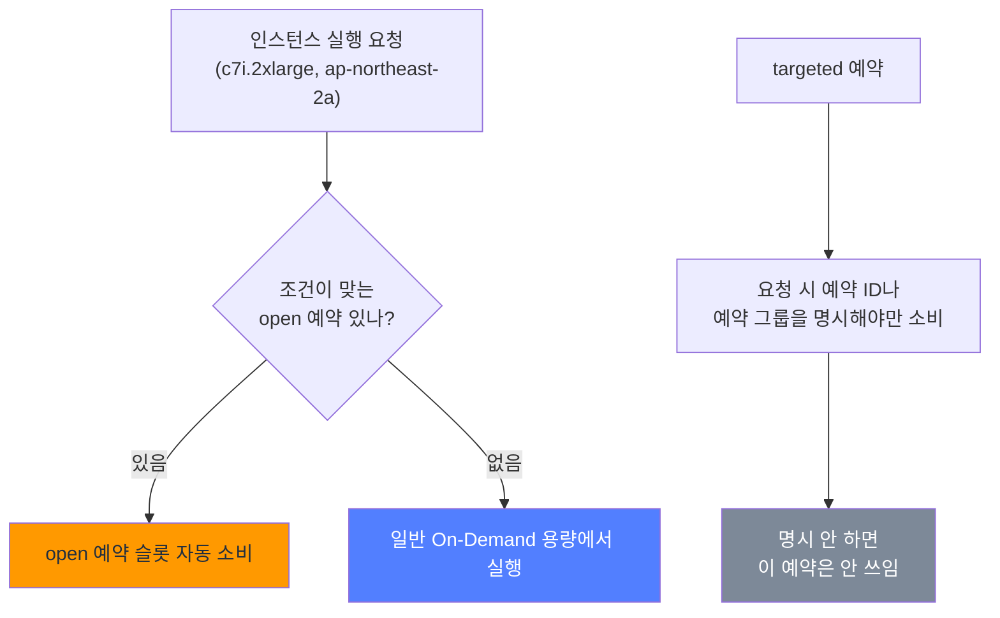
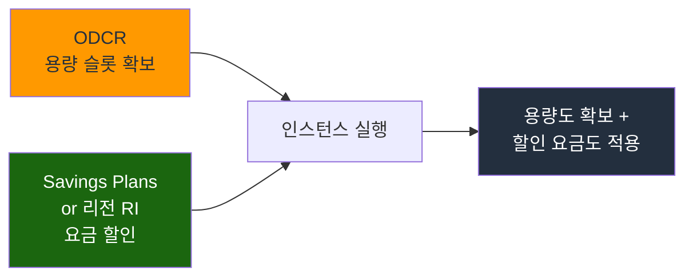

# EC2 On-Demand Capacity Reservation (ODCR)

RI나 Savings Plans를 한 번이라도 사면 "이제 용량도 확보된 거지?"라고 착각하기 쉽다. 그게 아니다. 리전 단위 RI나 Compute SP는 요금 할인만 해줄 뿐, 막상 인스턴스를 띄우려는 순간 해당 AZ에 물리 용량이 없으면 `InsufficientInstanceCapacity` 에러가 그대로 난다. 할인 약정과 용량 확보는 별개라는 걸 장애 한 번 겪고 나서야 깨닫는 경우가 많다.

On-Demand Capacity Reservation(ODCR)은 이 둘 중 "용량 확보"만 떼어낸 기능이다. 특정 AZ에서 특정 인스턴스 타입 N대를 미리 잡아두면, 그 슬롯은 내가 띄울 때까지 비워둔다. 대신 내가 안 띄워도 On-Demand 요금이 그대로 나간다.

## 할인 약정과 용량 확보는 다른 축이다

이 표가 ODCR을 이해하는 출발점이다.

| 구분 | 요금 할인 | 용량 확보 | 약정 기간 |
|------|-----------|-----------|-----------|
| On-Demand | 없음 | 없음 | 없음 |
| 리전 RI | 있음 (최대 72%) | 없음 | 1년/3년 |
| AZ 지정 RI | 있음 | 있음 | 1년/3년 |
| Savings Plans | 있음 | 없음 | 1년/3년 |
| ODCR | 없음 (단독) | 있음 | 없음 (언제든 해제) |
| ODCR + SP/RI | 있음 | 있음 | SP/RI 기간 |

ODCR 단독으로는 할인이 0이다. On-Demand 요금을 그대로 내면서 용량만 잡아둔다. 할인까지 받으려면 SP나 리전 RI를 따로 사서 ODCR 위에 얹어야 한다(뒤에서 다룬다). AZ 지정 RI는 할인과 용량 확보를 한 상품에 묶어주지만 1년/3년 약정에 묶이고 사이즈 유연성이 없다. 약정 없이 용량만 유연하게 잡았다 풀었다 하고 싶을 때 ODCR이 답이다.

리전 RI와 AZ 지정 RI의 차이는 [EC2 구매 옵션](EC2_Purchase_Options.md) 문서에 정리돼 있다.

## ODCR이 실제로 필요한 순간

운영하다 보면 ODCR을 진지하게 고민하게 되는 상황은 대체로 정해져 있다.

- **인기 인스턴스 타입의 용량 부족**: 신규 세대(예: m7i, c7g)나 GPU 타입(p5, g6)은 특정 리전·AZ에서 상시 빠듯하다. 오토스케일링이 스케일 아웃하려는 순간 용량이 없어 실패한다.
- **재해 복구(DR) 사이트**: 평소엔 안 띄우지만 장애가 터지면 즉시 N대가 떠야 한다. 정작 필요한 순간 용량이 없으면 DR이 무의미하다. ODCR로 미리 잡아둔다.
- **대규모 이벤트 대비**: 블랙프라이데이, 티켓 오픈처럼 정해진 시각에 트래픽이 폭증한다. 그 시간대 용량을 며칠 전 잡아두고 끝나면 푼다.
- **상태 저장 워크로드의 AZ 고정**: 특정 AZ에 데이터가 묶여 있어서 그 AZ에서만 인스턴스를 띄워야 하는데, 하필 그 AZ가 용량이 빠듯한 경우.

평소에 m5.large 몇 대 굴리는 흔한 웹 서비스라면 ODCR이 필요 없다. 흔한 타입은 용량이 거의 항상 있다. ODCR은 "용량이 없을 수도 있다"는 게 실제 리스크일 때만 의미가 있다.

## 예약 생성과 매칭 방식

가장 기본적인 생성 명령이다.

```bash
aws ec2 create-capacity-reservation \
  --instance-type c7i.2xlarge \
  --instance-platform Linux/UNIX \
  --availability-zone ap-northeast-2a \
  --instance-count 10 \
  --instance-match-criteria open \
  --end-date-type unlimited
```

여기서 핵심 파라미터가 두 개 있다. 하나는 AZ를 콕 집는다는 점이고, 다른 하나는 `instance-match-criteria`다.

### AZ 단위 예약이라는 제약

ODCR은 리전이 아니라 **AZ 단위**로 잡힌다. `ap-northeast-2a`에 10대를 예약했다면 `2c`에 띄운 인스턴스는 이 예약을 절대 못 쓴다. 그래서 멀티 AZ로 분산 운영한다면 AZ마다 별도 예약을 만들어야 한다. 한 AZ에 몰아서 예약하면 그 AZ가 통째로 죽었을 때 DR이 안 된다는 모순이 생긴다.

또 하나 자주 놓치는 점은 AZ 이름이 계정마다 다르게 매핑된다는 것이다. 내 계정의 `ap-northeast-2a`와 다른 계정의 `ap-northeast-2a`가 물리적으로 같은 데이터센터가 아니다. 공유 예약이나 멀티 계정 환경에서는 AZ 이름 대신 AZ ID(`apne2-az1`)로 맞춰야 한다.

### open vs targeted

`instance-match-criteria`가 ODCR 운영의 성격을 가른다.



- **open**: 조건(인스턴스 타입, 플랫폼, AZ, 테넌시)이 맞는 인스턴스가 새로 뜨면 자동으로 이 예약 슬롯을 먹는다. 별도로 "이 예약 써줘"라고 지정할 필요가 없다. 편하지만, 의도치 않은 인스턴스가 예약을 먹어버리는 경우가 있다. 예를 들어 DR용으로 잡아둔 예약을 평소 스케일 아웃한 인스턴스가 야금야금 소비해버리면, 정작 DR 발동 시 슬롯이 비어 있지 않다.
- **targeted**: 인스턴스를 띄울 때 예약 ID나 예약 그룹을 명시적으로 지정해야만 이 슬롯을 쓴다. 지정하지 않은 인스턴스는 절대 이 예약을 건드리지 않는다. DR이나 특정 워크로드 전용으로 용량을 격리하고 싶을 때 targeted를 쓴다.

DR 용도라면 거의 항상 targeted가 맞다. open은 "이 타입 인스턴스는 무조건 예약 위에서 돌게 하고 싶다"는 단순한 상황에서 쓴다.

## 안 띄워도 과금된다

ODCR에서 가장 많이 사고가 나는 지점이다. 예약을 만든 순간부터 **인스턴스를 띄우든 안 띄우든 On-Demand 요금이 초 단위로 과금**된다. 10대를 예약하고 3대만 띄우면, 띄운 3대 + 비어 있는 7대까지 합쳐 10대분 요금이 그대로 나간다.

DR용으로 50대를 잡아두고 "평소엔 안 쓰니까 공짜겠지"라고 생각하면 월말 청구서에서 50대 풀타임 요금을 보고 놀란다. ODCR은 "용량을 잡아두는 대가"를 항상 지불하는 모델이다.

그래서 실무에서는 두 가지로 대응한다. 첫째, 비어 있는 슬롯이라도 요금이 나가니 예약 수량을 실제 필요량에 딱 맞춘다. 사용률을 주기적으로 확인해서 노는 슬롯이 많으면 수량을 줄인다.

```bash
aws ec2 describe-capacity-reservations \
  --capacity-reservation-ids cr-0abcd1234efgh5678 \
  --query 'CapacityReservations[].{Id:CapacityReservationId,Total:TotalInstanceCount,Available:AvailableInstanceCount,State:State}'
```

`AvailableInstanceCount`가 계속 높게 떠 있으면 그만큼 돈을 버리고 있다는 뜻이다. 둘째, 약정 없이 잡은 예약이라면 필요 없어진 시점에 바로 취소한다.

```bash
aws ec2 cancel-capacity-reservation \
  --capacity-reservation-id cr-0abcd1234efgh5678
```

취소하는 순간 과금이 멈추지만, 다시 만들 때 그 AZ에 용량이 남아 있다는 보장은 없다. 이게 ODCR의 양면이다. 잡아두면 돈이 나가고, 풀면 다시 못 잡을 수 있다.

## SP/RI와 결합해 할인까지 받기

ODCR 단독은 On-Demand 요금이라 비싸다. 그런데 ODCR로 잡아둔 용량 위에서 도는 인스턴스에도 Savings Plans나 리전 RI의 할인이 그대로 적용된다. 즉 용량 확보(ODCR) + 요금 할인(SP/RI)을 따로 사서 합치면, AZ 지정 RI 하나를 사는 것과 비슷한 효과를 내면서 훨씬 유연하다.



동작 순서를 보면, 청구 시점에 SP/RI 할인이 자동으로 가장 비싼 사용량부터 적용되기 때문에 ODCR 슬롯에서 도는 인스턴스도 알아서 할인이 먹는다. 비어 있는 ODCR 슬롯(미사용분)에도 SP/RI 할인이 적용되므로, DR용 예약을 SP로 덮어두면 노는 용량의 유지 비용을 낮출 수 있다.

이 조합을 쓸 때 주의할 점은 SP/RI는 약정이 걸린다는 것이다. 용량은 ODCR로 언제든 풀 수 있어도, 그 위에 얹은 1년 SP는 그대로 남아 다른 인스턴스 사용량에 적용된다. 할인 약정과 용량 예약의 수명이 다르다는 걸 염두에 두고 설계해야 한다.

## 예약 그룹(Resource Group)

여러 AZ에 흩어진 ODCR을 하나로 묶어 targeted 매칭의 대상으로 삼고 싶을 때 예약 그룹을 쓴다. Resource Groups 서비스의 그룹을 만들고 거기에 여러 Capacity Reservation을 넣으면, 인스턴스를 띄울 때 개별 예약 ID 대신 그룹 ARN을 지정한다. 그러면 그룹 안의 예약 중 조건이 맞는 슬롯이 알아서 소비된다.

```bash
# 예약 전용 그룹 생성
aws resource-groups create-group \
  --name dr-capacity-pool \
  --configuration '[{"Type":"AWS::EC2::CapacityReservationPool"},{"Type":"AWS::ResourceGroups::Generic","Parameters":[{"Name":"allowed-resource-types","Values":["AWS::EC2::CapacityReservation"]}]}]'

# 인스턴스 실행 시 그룹을 타겟으로 지정
aws ec2 run-instances \
  --launch-template LaunchTemplateId=lt-0abcd1234,Version='$Latest' \
  --capacity-reservation-specification \
    'CapacityReservationTarget={CapacityReservationResourceGroupArn=arn:aws:resource-groups:ap-northeast-2:111122223333:group/dr-capacity-pool}'
```

ASG의 Launch Template에 이 `CapacityReservationSpecification`을 박아두면, 스케일 아웃할 때 그룹 안의 예약을 우선 소비한다. 그룹에 새 예약을 추가하거나 빼면 ASG 설정을 바꾸지 않고도 용량 풀을 조정할 수 있어서, AZ를 추가하거나 수량을 늘릴 때 운영이 편하다.

## Capacity Reservation Fleet

AZ 하나에 ODCR을 잡으면 그 AZ가 죽을 때 답이 없고, 인스턴스 타입 하나만 잡으면 그 타입이 부족할 때 답이 없다. Capacity Reservation Fleet은 여러 AZ·여러 인스턴스 타입에 걸쳐 "총 용량 목표치"를 던지면 AWS가 알아서 가능한 곳에 예약을 분산해 채워주는 기능이다. EC2 Fleet이 인스턴스 프로비저닝을 분산하는 것과 같은 발상을 예약에 적용한 것이다.

목표를 vCPU나 메모리 같은 정규화 단위(`total-target-capacity`)로 잡고, 후보 인스턴스 타입마다 가중치(`weight`)와 우선순위(`priority`)를 준다. Fleet은 우선순위가 높은 타입부터 용량이 잡히는 만큼 채우다가, 안 되면 다음 타입으로 넘어간다.

```json
{
  "InstanceTypeSpecifications": [
    { "InstanceType": "c7i.2xlarge", "InstancePlatform": "Linux/UNIX",
      "Weight": 8, "Priority": 1, "AvailabilityZone": "ap-northeast-2a" },
    { "InstanceType": "c7i.2xlarge", "InstancePlatform": "Linux/UNIX",
      "Weight": 8, "Priority": 2, "AvailabilityZone": "ap-northeast-2c" },
    { "InstanceType": "c6i.2xlarge", "InstancePlatform": "Linux/UNIX",
      "Weight": 8, "Priority": 3, "AvailabilityZone": "ap-northeast-2a" }
  ],
  "TotalTargetCapacity": 80,
  "DefaultTargetCapacityType": "on-demand",
  "Tenancy": "default"
}
```

```bash
aws ec2 create-capacity-reservation-fleet \
  --total-target-capacity 80 \
  --default-target-capacity-type on-demand \
  --instance-type-specifications file://fleet-spec.json
```

위 예시는 `c7i.2xlarge` 가중치가 8이므로 80 / 8 = 10대를 목표로 한다. 2a에서 c7i가 부족하면 2c의 c7i로, 그것도 안 되면 c6i로 떨어진다. 한 타입·한 AZ에 묶이지 않으니 용량 확보 성공률이 올라간다. DR이나 대규모 이벤트처럼 "어떤 타입이든 좋으니 총 vCPU N개만 확보되면 된다"는 상황에 맞는다.

## ML용 Capacity Blocks

GPU 학습을 해본 사람은 안다. p5나 p4d 같은 GPU 인스턴스는 ODCR로도 당장 용량이 안 잡히는 경우가 흔하다. 물리 GPU 자체가 귀해서 "지금 당장 8대"가 불가능할 때가 많다.

Capacity Blocks for ML은 이 문제를 다르게 푼다. 일반 ODCR이 "지금부터 무기한"인 반면, Capacity Blocks는 **미래의 특정 기간을 미리 예약**한다. "다음 주 월요일부터 5일간 p5.48xlarge 16대"처럼 시작일·기간을 정해 선결제로 잡는다. 학습 잡이 언제 돌지 정해져 있을 때, 그 기간의 GPU 용량을 확정적으로 확보하는 용도다.

```bash
# 예약 가능한 Capacity Block 슬롯 조회
aws ec2 describe-capacity-block-offerings \
  --instance-type p5.48xlarge \
  --instance-count 16 \
  --start-date-range 2026-06-01T00:00:00Z \
  --end-date-range 2026-06-10T00:00:00Z \
  --capacity-duration-hours 120

# 조회된 offering ID로 구매
aws ec2 purchase-capacity-block \
  --capacity-block-offering-id cbo-0abcd1234efgh5678 \
  --instance-platform Linux/UNIX
```

선결제이고, 예약한 기간이 시작되면 그 안에서만 인스턴스를 띄울 수 있다. 기간이 끝나면 인스턴스가 종료된다. 일반 ODCR처럼 무기한으로 잡아두는 게 아니라 "이 며칠만 빌린다"는 모델이라, 단발성 대규모 학습에 맞고 상시 추론 서빙에는 맞지 않는다.

## InsufficientInstanceCapacity 대응

ODCR을 도입하게 되는 직접적 계기가 보통 이 에러다. 스케일 아웃이나 인스턴스 시작 시 AWS가 해당 AZ에 줄 용량이 없으면 던진다. 할인 약정(리전 RI, SP)을 아무리 사도 이 에러는 막지 못한다. 할인과 용량은 별개이기 때문이다.

당장 터졌을 때와 사전 예방으로 나눠서 본다.

**이미 터진 경우의 즉각 대응**

- **다른 AZ로 시도**: 같은 타입이라도 다른 AZ에는 용량이 있는 경우가 많다. ASG라면 여러 AZ를 묶어두면 자동으로 다른 AZ를 시도한다.
- **인스턴스 타입 다양화**: c7i가 없으면 c6i, c7g처럼 비슷한 사양의 다른 타입으로 받는다. ASG MixedInstancesPolicy나 EC2 Fleet으로 여러 타입을 후보에 넣어두면 한 타입이 막혀도 다른 타입으로 받는다. 자세한 건 [EC2 Fleet](EC2_Fleet.md) 참고.
- **재시도**: 용량 부족은 일시적인 경우도 많아서 몇 분 뒤 다시 시도하면 잡히기도 한다. 다만 인기 타입의 만성 부족이면 재시도로는 안 된다.

**근본 대응**

만성적으로 용량이 부족한 타입·AZ라면 ODCR로 미리 슬롯을 잡아둔다. 이게 ODCR을 쓰는 가장 정직한 이유다. DR이나 이벤트처럼 "그 순간 용량이 반드시 있어야 하는" 워크로드는 사후 재시도로 도박할 게 아니라 사전 예약으로 확정한다.

EC2 Fleet이나 ASG에서 ODCR을 우선 소비하게 하려면 `use-capacity-reservations-first` 옵션을 쓴다. On-Demand 부분을 채울 때 일반 On-Demand 용량보다 ODCR 슬롯을 먼저 쓰라는 의미다.

```bash
aws ec2 create-fleet \
  --target-capacity-specification \
    'TotalTargetCapacity=20,OnDemandTargetCapacity=20,DefaultTargetCapacityType=on-demand' \
  --on-demand-options \
    'CapacityReservationOptions={UsageStrategy=use-capacity-reservations-first}' \
  --launch-template-configs file://lt-configs.json \
  --type instant
```

이 옵션을 켜면 Fleet이 On-Demand 인스턴스를 띄울 때 open 상태의 ODCR 슬롯을 먼저 소비하고, 슬롯이 다 차면 일반 On-Demand로 넘어간다. 이미 비용을 지불 중인 ODCR 슬롯(어차피 비어 있어도 과금되는)을 노는 채로 두지 않고 먼저 쓰게 만드는 셈이라, ODCR을 운영한다면 거의 항상 켜둔다.

## 정리

ODCR은 요금 할인 상품이 아니라 용량 확보 상품이다. 단독으로는 On-Demand 요금을 그대로 내면서 슬롯만 잡고, 안 띄워도 과금된다. 할인까지 원하면 SP나 리전 RI를 따로 사서 얹는다. open/targeted로 누가 슬롯을 소비할지 통제하고, AZ 단위라는 제약 때문에 멀티 AZ면 예약을 쪼개야 한다. 여러 AZ·타입에 걸쳐 분산하려면 Capacity Reservation Fleet, 정해진 기간의 GPU 용량이면 Capacity Blocks, Fleet/ASG에서 슬롯을 먼저 쓰게 하려면 `use-capacity-reservations-first`를 쓴다. 평범한 워크로드엔 필요 없고, `InsufficientInstanceCapacity`가 실제 리스크인 DR·이벤트·인기 타입에서만 값을 한다.
