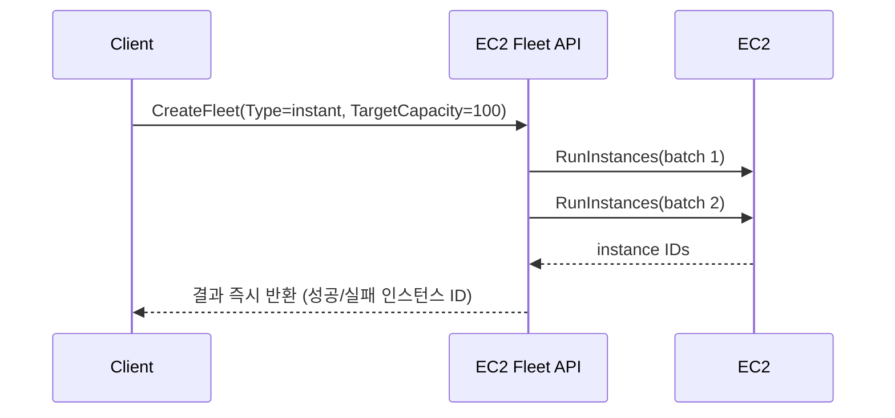
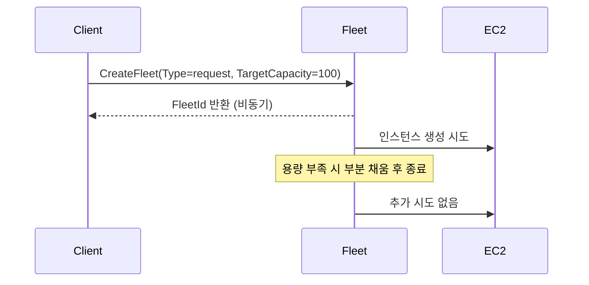
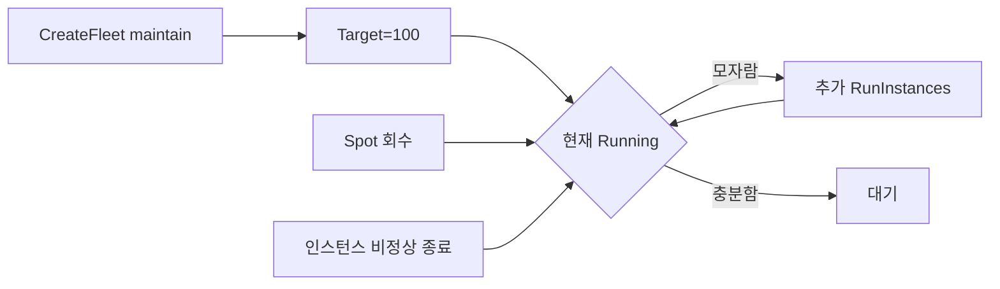
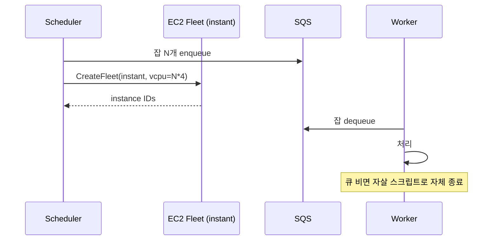
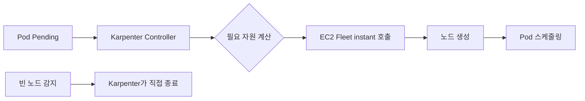

# EC2 Fleet과 Spot Fleet

ASG(Auto Scaling Group)에 MixedInstancesPolicy를 붙이면 On-Demand와 Spot을 섞어 굴릴 수 있다. 그래서 처음 보면 "EC2 Fleet은 왜 따로 있지" 싶다. 실제로 일반적인 웹 서비스라면 ASG로 충분하다. 그러나 배치 잡, 렌더링 파이프라인, ML 학습, Karpenter 같은 케이스에서는 ASG로 풀 수 없는 요구가 자꾸 튀어나온다. 그 순간 EC2 Fleet API가 필요해진다.

이 문서는 ASG와 비교했을 때 EC2 Fleet이 무엇을 더 줄 수 있는지, 세 가지 동작 모드와 할당 전략을 어떻게 골라야 하는지, Spot Fleet과는 무슨 관계인지를 실제 운영 관점에서 정리한 것이다.

## EC2 Fleet과 Spot Fleet의 관계

먼저 헷갈리는 부분부터 정리한다.

- **Spot Fleet**: 2015년쯤 나온 초창기 API. Spot 인스턴스를 묶음으로 띄우는 용도로 시작했고, 나중에 On-Demand도 섞을 수 있게 확장됐다. `RequestSpotFleet` API로 호출한다.
- **EC2 Fleet**: 2018년에 나온 후속 API. Spot Fleet의 기능을 그대로 흡수하면서 On-Demand까지 1급 시민으로 다룬다. `CreateFleet` API로 호출한다.

AWS 공식 권고는 신규 워크로드라면 EC2 Fleet을 쓰라는 것이다. Spot Fleet은 deprecated는 아니지만 신기능이 EC2 Fleet에만 들어간다. 예를 들어 `price-capacity-optimized` 할당 전략은 EC2 Fleet에는 있고 Spot Fleet에는 들어왔지만 한 박자 늦었다. 콘솔에서도 EC2 Fleet은 별도 UI가 없고 Spot Requests 화면을 통해 본다는 점이 좀 헷갈리는 부분이다.

기존에 Spot Fleet으로 운영 중이라면 굳이 옮길 필요는 없다. 새로 만든다면 EC2 Fleet이 정답이다.

## ASG MixedInstancesPolicy로 안 되는 영역

ASG에 MixedInstancesPolicy를 붙여도 On-Demand + Spot 혼합은 가능하다. 그러나 ASG는 어디까지나 "지속적으로 N대를 유지한다"는 모델이다. 다음 같은 경우엔 맞지 않는다.

1. **1회성 대량 프로비저닝**: 야간 배치를 위해 500대를 띄우고 작업이 끝나면 한꺼번에 내린다. ASG는 띄우는 건 되지만 일관된 종료가 어색하다.
2. **단발성 동기 호출**: API 한 번으로 "지금 당장 N대 띄워줘. 결과를 응답으로 돌려줘"가 필요하다. ASG는 비동기 모델이다.
3. **여러 Launch Template을 한 요청에 섞기**: ASG의 MixedInstancesPolicy는 하나의 Launch Template을 베이스로 인스턴스 타입만 다양화한다. AMI나 user-data가 다른 풀을 한 번에 다루기 어렵다.
4. **Target Capacity를 vCPU나 메모리 기준으로 잡기**: ASG는 항상 "인스턴스 N대" 단위다. EC2 Fleet은 "vCPU 4000개"나 "메모리 16TB" 같은 단위로 요청할 수 있다.
5. **Capacity Reservation의 세밀한 활용**: 특정 CR에 우선 매칭시키고 부족하면 일반 On-Demand로 떨어지는 시나리오를 깔끔하게 표현하기 어렵다.

요약하면 ASG는 장기 운영용, EC2 Fleet은 프로비저닝 API다.

## 세 가지 동작 모드

EC2 Fleet은 `Type` 파라미터로 세 가지 모드를 고른다. 이 선택이 운영 비용과 코드 복잡도를 거의 결정한다.

### instant 모드



API 호출 한 번으로 인스턴스를 띄우고 끝낸다. 호출이 끝나면 Fleet이라는 객체는 사실상 의미가 없다. 인스턴스만 남는다. `DescribeFleets`로 조회해도 별 정보가 없다.

핵심은 "동기적"이라는 점이다. `CreateFleet`이 리턴되는 시점에 어떤 인스턴스가 어느 AZ에서 어느 타입으로 떴는지가 응답에 포함된다. 100대를 요청했는데 80대만 떴다면 그것도 그대로 응답에 나온다.

배치 잡 워커, 단발성 작업 풀, Karpenter 같은 컨트롤러 백엔드에서 가장 많이 쓴다. Karpenter는 노드를 띄울 때 EC2 Fleet의 instant 모드를 호출한다. 자기 컨트롤러가 이미 desired state를 관리하니 Fleet 객체로 상태를 들고 있을 필요가 없다.

```bash
aws ec2 create-fleet \
  --type instant \
  --target-capacity-specification 'TotalTargetCapacity=100,OnDemandTargetCapacity=20,DefaultTargetCapacityType=spot' \
  --launch-template-configs file://lt-configs.json \
  --spot-options 'AllocationStrategy=price-capacity-optimized'
```

이렇게 부르면 응답에 `Instances` 배열이 들어온다. 호출 끝나면 잊어버려도 된다.

### request 모드

비동기 요청이지만 한 번만 시도한다. 요청한 용량을 다 못 채우면 그대로 끝이다. 시간이 지나서 Spot 가격이 떨어져도 알아서 다시 채워주지 않는다.



실무에서 request 모드를 쓰는 경우는 드물다. instant로 같은 일을 하면서 응답까지 받는 게 낫고, 장기 유지가 필요하면 maintain을 쓰면 된다. request는 "비동기로 한 번만 시도"라는 어중간한 지점이라 거의 빈자리다. Spot Fleet 시절 호환을 위해 남아있다고 보면 된다.

### maintain 모드

ASG처럼 목표 용량을 지속 유지한다. Spot 인스턴스가 회수되면(2분 전 알림 후 종료) 다른 풀에서 다시 띄운다. On-Demand 부분이 비정상 종료돼도 다시 채운다.



ASG와 가장 비슷한 모드다. 그래서 "ASG MixedInstancesPolicy면 되는 거 아닌가?"라는 질문이 다시 나온다. 답은 위에서 정리한 5가지 영역 중 하나에 걸리느냐다. 예를 들어 Target Capacity를 vCPU 단위로 관리하고 싶다면 ASG로는 안 되고 EC2 Fleet maintain이 필요하다.

대신 maintain 모드는 ASG가 제공하는 lifecycle hook, instance refresh, scaling policy 같은 운영 기능이 없거나 빈약하다. 그래서 "장기 유지 + ASG 운영 기능"이면 ASG가 낫고, "장기 유지 + ASG가 못 하는 단위로 관리"이면 maintain이다.

## On-Demand 베이스 + Spot 확장

가장 흔한 구성 패턴이다. 안정성을 위해 일정량은 On-Demand로 깔고 나머지를 Spot으로 확장한다.

```json
{
  "TargetCapacitySpecification": {
    "TotalTargetCapacity": 200,
    "OnDemandTargetCapacity": 40,
    "DefaultTargetCapacityType": "spot"
  },
  "OnDemandOptions": {
    "AllocationStrategy": "lowest-price"
  },
  "SpotOptions": {
    "AllocationStrategy": "price-capacity-optimized",
    "InstanceInterruptionBehavior": "terminate"
  }
}
```

총 200대 중 40대는 무조건 On-Demand로 띄우고, 나머지 160대는 Spot으로 채운다. Spot이 회수돼 부족해지면(maintain 모드인 경우) 다시 Spot으로 채우려 한다. Spot이 도저히 안 잡히면 일부 워크로드는 `OnDemandOptions`의 `CapacityReservationOptions.UsageStrategy=use-capacity-reservations-first` 같은 옵션으로 Capacity Reservation을 우선 쓰게 만들기도 한다.

베이스 비율은 워크로드 SLA에 따라 정한다. 결제·인증같이 멈추면 안 되는 코어는 On-Demand 100%로 하나의 ASG로 빼고, 비동기 워커는 EC2 Fleet으로 On-Demand 20% + Spot 80%를 잡는 식이 흔한 구성이다.

## Allocation Strategy 4종

Spot 인스턴스를 어느 풀에서 가져올지 결정하는 전략이다. 풀(pool)이라는 단어가 중요하다. AWS는 (인스턴스 타입 × AZ) 조합을 하나의 Spot 풀로 본다. 같은 m5.large라도 ap-northeast-2a와 ap-northeast-2c는 다른 풀이다. 가격도 다르고 회수율도 다르다.

### lowest-price

이름 그대로 가장 싼 풀부터 채운다. `SpotInstancePools` 파라미터로 몇 개 풀에 분산할지 정한다(기본 2). 가격만 본다. 회수 가능성은 고려하지 않는다.

비용 절감이 최우선이고 회수돼도 상관없는 단발성 작업에서나 쓴다. 운영 워크로드에선 거의 안 쓴다. 가격이 가장 싼 풀은 보통 수요가 몰려 있어서 회수율도 높다. 결과적으로 비싼 풀로 자주 옮겨다니다 인스턴스 churn이 커진다.

### capacity-optimized

가용 용량이 가장 많은 풀을 고른다. 즉 "지금 가장 안 회수될 것 같은 풀"이다. 가격은 보지 않는다. 회수율은 lowest-price 대비 눈에 띄게 떨어진다.

ML 학습처럼 한 번 회수되면 체크포인트부터 다시 돌아야 하는 잡, 또는 stateful한 처리에서 쓴다. 단점은 비쌀 수 있다는 것. 회수율 낮은 풀이 가격도 높을 때가 많다.

### capacity-optimized-prioritized

`Priority` 값을 인스턴스 타입마다 매겨두면, 그 우선순위를 따르되 같은 우선순위 내에서는 capacity 최적화를 한다. 예를 들어 m5.large=1, m5a.large=2, m5n.large=3으로 매겨두면 m5.large부터 채우려 하고, m5.large 풀들 중에서는 용량 많은 AZ를 고른다. m5.large가 다 안 되면 m5a.large로 넘어간다.

특정 인스턴스 패밀리를 선호하지만 부족 시 fallback이 필요한 워크로드에 맞는다. 예컨대 AVX-512 지원 인스턴스를 선호하는 경우.

On-Demand에도 이 전략이 있다. On-Demand의 prioritized 전략은 capacity-optimized가 아니고 단순 priority 순서다.

### price-capacity-optimized

2022년에 추가된 전략이고 현재 대부분의 케이스에서 디폴트로 권장된다. capacity-optimized처럼 회수 가능성을 우선 고려하면서, 비슷한 capacity 수준의 풀들 중에서는 더 싼 쪽을 고른다.

실측해보면 lowest-price 대비 회수율이 크게 떨어지고, capacity-optimized 대비 비용도 같이 낮아진다. AWS 블로그의 벤치마크 수치를 그대로 믿을 필요는 없지만, 운영에서도 비슷한 경향이 나왔다. 새로 구성하는 Fleet은 일단 price-capacity-optimized로 시작하고, 회수율이 문제되면 capacity-optimized로 옮기는 흐름이 합리적이다.

### 선택 기준 요약

| 워크로드 특성 | 추천 전략 |
|---|---|
| 회수돼도 부담 적은 짧은 잡 | price-capacity-optimized |
| 학습·렌더링처럼 회수 비용 큼 | capacity-optimized |
| 특정 타입 강한 선호 + fallback | capacity-optimized-prioritized |
| 단순 가장 싼 거 | lowest-price (운영 비추천) |

## Target Capacity 단위

EC2 Fleet에서 의외로 강력한 기능이 Target Capacity를 인스턴스 수가 아닌 다른 단위로 잡을 수 있다는 점이다.

```json
{
  "TargetCapacityUnitType": "vcpu",
  "TotalTargetCapacity": 4000
}
```

`TargetCapacityUnitType`은 `units`(기본, 인스턴스 수), `vcpu`, `memory-mib` 세 가지다. vCPU로 잡으면 c5.large(2 vCPU)와 c5.xlarge(4 vCPU)를 섞어 띄울 때 Fleet이 알아서 합을 4000 vCPU에 맞춘다. c5.large 2000대로 채우든 c5.xlarge 1000대로 채우든 알아서 한다.

배치 워크로드에서 이 단위가 매우 유용하다. "100 vCPU짜리 잡 100개를 돌리려면 vCPU 10000개가 필요하다"는 식으로 산정해서 그대로 요청하면 된다. 인스턴스 수로 환산하는 단계가 없어진다.

Launch Template Override에서 인스턴스별 `WeightedCapacity`를 명시할 수도 있다. 이건 단위와 별개로 인스턴스 하나가 몇 "유닛"을 차지하는지를 직접 정한다. vCPU 단위를 쓰면서 c5.4xlarge(16 vCPU)에 WeightedCapacity=20을 줘버리면 실제 vCPU와 무관하게 20만큼 친다. 직접 잡 처리량을 모델링한 단위로 쓰고 싶을 때 사용한다.

## 배치 워크로드 패턴

영상 인코딩, ETL, 시뮬레이션 같은 배치 잡에서 EC2 Fleet 사용 패턴은 보통 이렇게 흘러간다.



핵심은 instant 모드 + vCPU 단위 + price-capacity-optimized 조합이다. 큐의 잡 수를 vCPU 수요로 환산해서 한 번에 띄우고, 워커는 큐가 비면 스스로 종료한다. Fleet을 maintain 모드로 잡고 ASG처럼 굴리려고 하면 idle 시간이 길어진다. instant로 띄우고 워크로드가 끝나면 그냥 사라지는 모델이 비용 면에서 차이가 크다.

주의할 점은 Spot 회수다. 잡 처리 도중 회수되면 그 잡은 다시 큐로 돌아가야 한다. SQS 같은 큐를 쓴다면 visibility timeout 안에 ack를 못 하면 자동으로 재큐잉되니까 따로 처리할 게 없다. 자체 큐를 쓰는 경우엔 ALB target group draining처럼 회수 알림(2분 전)을 받아서 jobs를 graceful하게 정리하는 코드가 필요하다. `/opt/aws/bin/ec2-metadata --instance-action` 같은 메타데이터로 회수 임박을 감지한다.

## Karpenter 백엔드로서의 EC2 Fleet

Karpenter는 Kubernetes 노드 오토스케일러다. Cluster Autoscaler가 ASG에 desired count를 올리는 방식이라면, Karpenter는 자기가 직접 EC2 Fleet의 instant 모드를 호출해서 노드를 띄운다.



왜 ASG가 아니고 EC2 Fleet인가. Karpenter가 풀고자 한 문제 자체가 ASG의 한계였다.

1. ASG는 한 그룹에 한 인스턴스 패밀리. Karpenter는 Pending Pod의 리소스 요구를 보고 "이 워크로드엔 r6i가 좋겠다, 저건 c7g면 충분하겠다"를 실시간으로 결정한다. ASG라면 그룹을 수십 개 만들어야 한다.
2. ASG의 인스턴스 선택은 결국 ASG가 미리 정해둔 옵션 안에서만 이뤄진다. Karpenter는 Provisioner/NodePool에 광범위한 조건만 줘두고, 매 요청마다 다른 인스턴스 타입을 고를 수 있다.
3. ASG에 desired를 +1 하고 새 노드 등록을 기다리는 모델이 느리다. Karpenter는 instant 호출로 인스턴스 ID를 즉시 받아 그걸로 노드 객체를 미리 만든다. 노드 가용 시간이 빠르다.

운영하면서 알아두면 좋은 점이 몇 가지 있다. Karpenter가 호출하는 EC2 Fleet은 instant 타입이라 Fleet 객체가 남지 않는다. 콘솔의 Spot Requests에 가도 거의 안 보인다. 인스턴스 자체만 본다. 그래서 트러블슈팅할 때 "왜 노드가 안 떴지?"의 단서는 Karpenter controller 로그에서 EC2 API 에러를 보고 거기서 시작한다. `InsufficientInstanceCapacity` 에러가 나오면 인스턴스 타입 후보를 넓혀야 한다.

또 하나, Karpenter NodePool에서 `spot`과 `on-demand`를 둘 다 허용해두면 기본적으로 Spot을 먼저 시도한다. 이때 내부적으로 price-capacity-optimized로 동작한다. 그래서 Karpenter를 도입했다고 따로 할당 전략을 신경 쓸 필요는 없다.

## 실제 운영에서 겪는 문제들

Fleet 만들고 운영하면서 마주치는 패턴 몇 가지.

**InsufficientInstanceCapacity로 부분만 채워지는 경우.** 인기 있는 인스턴스 타입에 특정 AZ가 부족할 때 자주 본다. instant 모드라면 응답에 `Errors` 배열로 어떤 풀에서 왜 실패했는지가 들어온다. 후보 인스턴스 타입을 5~6개로 늘리고 AZ도 3개 이상으로 펼치면 거의 안 난다. Launch Template Override에 후보를 줄줄이 적는 게 귀찮지만 안정성에 직결된다.

**Spot 회수율이 갑자기 치솟는 경우.** 같은 인스턴스 타입을 쭉 잘 쓰다가 어느 주에 갑자기 회수가 잦아진다. 풀 수요가 몰린 거다. CloudWatch에서 Spot Termination Notice를 잡아두고 회수율을 모니터링하면 알아챌 수 있다. 대응은 후보 인스턴스 타입을 더 넓히는 것. m5뿐 아니라 m5a, m5n, m6i, m6a를 같이 후보로 넣어두면 한쪽 풀이 빡빡해져도 다른 풀로 빠진다.

**On-Demand 비율이 의도와 다르게 차는 경우.** Spot이 충분히 안 잡히면 Fleet이 On-Demand로 떨어질 수 있다(`OnDemandOptions.AllocationStrategy` 설정과 fallback 동작에 따라). 비용이 갑자기 튀는 원인이 된다. CostExplorer에서 Spot/On-Demand 비율을 주기적으로 보고 의도와 어긋나면 후보를 조정한다.

**maintain 모드에서 인스턴스 교체가 느린 경우.** Spot 회수 후 새 인스턴스 띄우는 데 수 분이 걸린다. 그 사이 잡이 처리되지 않으면 backlog가 쌓인다. instant 모드로 갈아타고 워커 풀을 큐 길이 기반으로 직접 늘리는 패턴이 더 빠를 때가 많다.

EC2 Fleet은 ASG보다 한 단계 아래의 API다. 그만큼 직접 다뤄야 할 게 많다. 일반 웹 서비스는 그냥 ASG로 가고, 진짜 필요할 때만 Fleet으로 내려가는 게 운영 부담 면에서 낫다.
