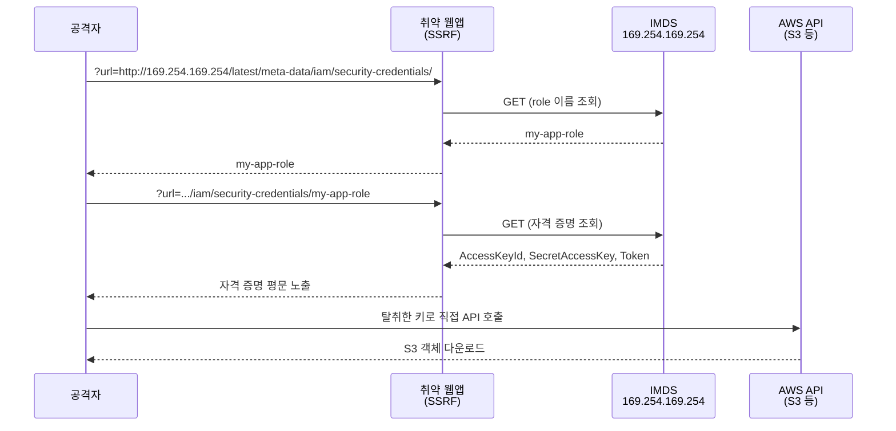

# EC2 Instance Metadata Service (IMDS) 심화

EC2 인스턴스 안에서 `http://169.254.169.254/`로 접근하는 메타데이터 서비스다. 인스턴스 ID, 리전, AZ 같은 정보뿐 아니라 인스턴스에 붙은 IAM 역할의 임시 자격 증명까지 여기서 나온다. 마지막 부분이 보안의 핵심이다. 이 주소만 때릴 수 있으면 인스턴스가 가진 IAM 권한을 그대로 쓸 수 있는 액세스 키/시크릿/세션 토큰이 평문으로 떨어진다.

EC2.md에도 IMDS 항목이 있지만 거기는 "메타데이터를 어떻게 읽느냐" 수준이다. 이 문서는 IMDSv2가 왜 그렇게 동작하는지, SSRF로 자격 증명이 어떻게 새는지, 컨테이너에서 hop limit 때문에 뭐가 깨지는지, ASG에서 옵션을 어떻게 강제하는지를 운영/보안 관점에서 다룬다.

---

## IMDSv1과 IMDSv2의 차이

IMDSv1은 그냥 GET 한 번이다.

```bash
curl http://169.254.169.254/latest/meta-data/iam/security-credentials/my-role
```

인증이 없다. 요청을 보낼 수만 있으면 응답이 온다. 이게 문제의 출발점이다. 애플리케이션이 외부 입력으로 임의 URL을 호출하는 SSRF 취약점이 있으면, 공격자가 그 URL로 `169.254.169.254`를 넣어서 자격 증명을 뽑아낸다. 2019년 Capital One 사고가 이 경로였다. WAF가 SSRF에 당했고, WAF에 붙은 IAM 역할 자격 증명이 IMDSv1으로 유출됐고, 그 권한으로 S3 버킷이 통째로 털렸다.

IMDSv2는 토큰을 먼저 받는 구조로 바꿨다.

```bash
# 1단계: PUT으로 토큰 발급 (TTL 헤더 필수)
TOKEN=$(curl -s -X PUT "http://169.254.169.254/latest/api/token" \
  -H "X-aws-ec2-metadata-token-ttl-seconds: 21600")

# 2단계: 토큰을 헤더에 넣어 조회
curl -s -H "X-aws-ec2-metadata-token: $TOKEN" \
  http://169.254.169.254/latest/meta-data/iam/security-credentials/my-role
```

둘의 차이를 표로 정리하면 이렇다.

| 항목 | IMDSv1 | IMDSv2 |
|------|--------|--------|
| 인증 | 없음 | PUT 토큰 필수 |
| 요청 메서드 | GET만 | PUT(토큰) + GET/PUT(조회) |
| 토큰 TTL | 없음 | 1~21600초 |
| SSRF 방어 | 안 됨 | PUT 차단 + hop limit + 헤더 검증 |

여기서 중요한 건 IMDSv1을 "끄는" 게 보안 조치라는 점이다. IMDSv2를 켜는 것만으로는 부족하다. 기본값(`optional`)은 v1과 v2를 둘 다 받는다. v1을 완전히 막으려면 `HttpTokens=required`로 바꿔야 한다. 이걸 안 하면 v2 토큰 로직을 다 구현해놓고도 공격자는 여전히 v1 GET으로 자격 증명을 가져간다.

---

## IMDSv2가 SSRF를 막는 세 가지 장치

IMDSv2가 토큰 하나 추가했다고 해서 마법처럼 안전해지는 게 아니다. 세 가지 장치가 겹쳐서 SSRF를 어렵게 만든다.

### PUT 메서드 요구

토큰 발급은 PUT이다. 대부분의 SSRF 취약점은 서버가 GET으로 외부 리소스를 가져오는 패턴이다. 이미지 프록시, 웹훅 검증, URL 미리보기 같은 기능이 그렇다. 공격자가 `url=http://169.254.169.254/...`를 넣어도 서버는 GET을 보낸다. IMDSv2는 토큰 없는 GET을 401로 거절한다. 토큰을 받으려면 PUT을 보내야 하는데, GET 기반 SSRF로는 PUT을 만들기 어렵다.

### hop limit

응답 패킷의 IP TTL을 제한하는 장치다. 기본값은 1이다. 메타데이터 응답이 인스턴스 자신을 넘어 한 번이라도 라우팅되면(TTL이 0이 되면) 패킷이 버려진다.

이게 왜 중요하냐면, 인스턴스 안에서 reverse proxy나 컨테이너 네트워크를 거쳐 메타데이터를 끌어내려는 시도를 막는다. 토큰 발급 PUT 요청을 SSRF로 어찌어찌 흉내 냈다 쳐도, 응답이 프록시를 한 번 더 거치는 순간 hop이 늘어 패킷이 죽는다. 컨테이너에서 문제가 되는 게 바로 이 부분인데 뒤에서 따로 다룬다.

### X-Forwarded-For 차단

IMDSv2는 `X-Forwarded-For` 헤더가 붙은 요청을 거절한다. 이 헤더는 프록시/로드밸런서를 거친 요청에 붙는다. 즉 메타데이터 요청이 어떤 중계 계층을 통과했다는 신호다. SSRF가 애플리케이션 프록시를 경유하면 이 헤더가 붙기 쉬운데, IMDSv2는 그런 요청을 통째로 막는다.

세 장치를 정리하면, IMDSv2의 핵심은 "메타데이터 요청은 인스턴스 자신이 직접, 중계 없이 보낸 것이어야 한다"를 강제하는 거다. SSRF는 본질적으로 서버를 중계자로 악용하는 공격이라 이 조건과 정면으로 충돌한다.

---

## SSRF로 IAM 자격 증명 탈취 시나리오

실제 공격이 어떻게 흘러가는지 보면 방어가 왜 그 모양인지 이해된다. IMDSv1이 켜져 있는 환경을 가정한다.



1. 취약한 웹앱에 SSRF가 있다. 외부 URL을 받아 서버가 대신 호출하는 기능이다.
2. 공격자가 그 URL에 `http://169.254.169.254/latest/meta-data/iam/security-credentials/`를 넣는다. 응답으로 역할 이름이 온다.
3. 역할 이름을 경로에 붙여 한 번 더 호출하면 자격 증명 JSON이 통째로 온다.

```json
{
  "Code": "Success",
  "AccessKeyId": "ASIA...",
  "SecretAccessKey": "...",
  "Token": "...",
  "Expiration": "2026-06-17T18:00:00Z"
}
```

4. 공격자는 이 키를 자기 로컬에 `AWS_ACCESS_KEY_ID` 등으로 박고 `aws s3 ls`를 친다. 인스턴스 역할이 가진 권한 그대로 움직인다.

여기서 핵심은 자격 증명에 만료(`Expiration`)가 있긴 하지만 기본 6시간이고, 그 안에 충분히 데이터를 빼간다는 점이다. 그리고 탈취한 키로 한 호출은 CloudTrail에 인스턴스 역할이 한 것처럼 찍혀서, 정상 활동과 구분이 안 된다.

방어는 두 가지다. 애플리케이션의 SSRF를 고치는 게 근본이고, IMDSv2 강제가 두 번째 방어선이다. SSRF는 코드 리뷰에서 놓치기 쉬워서, IMDSv2 강제를 깔아두면 SSRF가 남아 있어도 자격 증명 탈취 단계에서 막힌다. GET 기반 SSRF로는 PUT 토큰을 못 받으니까.

```bash
# 기존 인스턴스에 IMDSv2 강제 (v1 차단)
aws ec2 modify-instance-metadata-options \
  --instance-id i-0abc123 \
  --http-tokens required \
  --http-endpoint enabled \
  --http-put-response-hop-limit 1
```

`--http-tokens required`가 핵심이다. 이게 `optional`이면 v1이 여전히 살아 있어서 위 시나리오가 그대로 성립한다.

---

## 메타데이터 경로별 조회

자주 쓰는 경로들을 정리한다. 전부 IMDSv2 토큰을 받은 다음 조회한다고 가정한다.

```bash
TOKEN=$(curl -s -X PUT "http://169.254.169.254/latest/api/token" \
  -H "X-aws-ec2-metadata-token-ttl-seconds: 21600")
GET() { curl -s -H "X-aws-ec2-metadata-token: $TOKEN" "http://169.254.169.254/$1"; }
```

### IAM 자격 증명

```bash
# 붙어 있는 역할 이름
GET latest/meta-data/iam/security-credentials/

# 자격 증명 JSON (위에서 나온 역할 이름을 붙임)
GET latest/meta-data/iam/security-credentials/my-app-role
```

애플리케이션 코드에서 이 경로를 직접 파싱하는 일은 거의 없다. SDK가 알아서 한다. 다만 디버깅할 때 "지금 이 인스턴스가 어떤 역할을 들고 있나", "자격 증명이 만료됐나"를 확인하려고 손으로 칠 때가 있다.

### User Data

```bash
GET latest/user-data
```

인스턴스 부팅 시 실행한 스크립트(cloud-init)가 그대로 나온다. 여기에 절대 비밀번호나 API 키를 넣으면 안 된다. IMDS를 읽을 수 있는 누구나, SSRF 공격자까지 다 볼 수 있다. 비밀은 Secrets Manager나 Parameter Store에서 런타임에 가져와야 한다. User Data에 DB 비밀번호를 박아둔 레거시를 종종 보는데, 그 인스턴스에 SSRF 하나만 터지면 DB까지 같이 넘어간다.

### 인스턴스 아이덴티티 문서

```bash
# 인스턴스 메타 (인스턴스 ID, 타입, 리전, AZ, account ID 등)
GET latest/dynamic/instance-identity/document

# 서명 (AWS가 서명한 값 — 인스턴스 신원 증명에 사용)
GET latest/dynamic/instance-identity/signature
GET latest/dynamic/instance-identity/pkcs7
```

`document`는 account ID, 인스턴스 ID, 리전, 타입 같은 정보를 담은 JSON이다. `pkcs7`/`signature`는 AWS 개인키로 서명한 값이라, 외부 시스템이 "이 요청이 정말 우리 계정의 특정 EC2에서 왔는지"를 검증하는 데 쓴다. 온프레미스 인증 서버에 EC2를 등록할 때 이 서명을 검증하는 패턴이 있다.

### 기타 자주 쓰는 경로

```bash
GET latest/meta-data/instance-id
GET latest/meta-data/local-ipv4
GET latest/meta-data/public-ipv4
GET latest/meta-data/placement/availability-zone
GET latest/meta-data/network/interfaces/macs/      # ENI MAC 목록
GET latest/meta-data/spot/instance-action          # 스팟 중단 예고 (없으면 404)
```

스팟 인스턴스를 쓴다면 `spot/instance-action`을 폴링해서 중단 2분 전 예고를 잡는 코드를 넣어두는 경우가 많다. 평소엔 404가 나다가 중단이 예정되면 시각이 담긴 JSON이 나온다.

---

## 컨테이너/EKS에서의 hop limit 문제

여기가 운영에서 제일 자주 깨지는 부분이다. hop limit 기본값이 1인데, 컨테이너 네트워크는 hop을 하나 더 먹는다.

EC2 위에 도커나 EKS Pod를 띄우면, 컨테이너 안에서 `169.254.169.254`로 보낸 요청이 호스트의 네트워크 브리지/오버레이를 한 번 더 거친다. 응답 패킷 입장에서 hop이 1 늘어난다. hop limit이 1이면 컨테이너로 돌아가는 응답이 TTL 0에서 죽는다. 그래서 컨테이너 안에서 SDK가 IMDS를 못 읽고 자격 증명 조회가 타임아웃 난다.

증상은 보통 이렇게 나온다. EC2에 직접 SSH로 들어가서 `curl`로 IMDS를 때리면 잘 되는데, 같은 인스턴스의 컨테이너 안에서는 안 된다. SDK 로그에 "credentials not found" 또는 IMDS 타임아웃이 찍힌다.

해결책 두 가지다.

### hop limit을 2로 올리기

컨테이너가 IMDS를 써야 한다면 hop limit을 2로 올린다.

```bash
aws ec2 modify-instance-metadata-options \
  --instance-id i-0abc123 \
  --http-tokens required \
  --http-put-response-hop-limit 2
```

EKS 노드그룹이라면 Launch Template에서 이 값을 박아야 한다. 노드가 ASG로 새로 뜰 때마다 자동 적용되도록.

문제는 hop limit 2가 보안적으로 약간 후퇴라는 점이다. hop이 하나 더 허용되면, 그 인스턴스에 SSRF가 있을 때 컨테이너 계층을 한 번 경유한 메타데이터 추출 시도가 통과할 여지가 생긴다. 그래서 hop limit 2는 IMDSv2 강제(`HttpTokens=required`)와 반드시 같이 가야 한다. v2 토큰 요구가 있으면 hop이 2여도 GET 기반 SSRF는 여전히 막힌다.

### IRSA로 전환 (EKS 권장)

EKS라면 더 나은 답은 Pod가 노드 IMDS를 안 쓰게 만드는 거다. IRSA(IAM Roles for Service Accounts)를 쓰면 Pod가 노드의 인스턴스 역할이 아니라 자기 ServiceAccount에 매핑된 IAM 역할을 OIDC로 받아간다. IMDS를 거치지 않는다.

```yaml
apiVersion: v1
kind: ServiceAccount
metadata:
  name: my-app-sa
  annotations:
    eks.amazonaws.com/role-arn: arn:aws:iam::123456789012:role/my-app-irsa-role
```

이렇게 하면 Pod 안의 SDK는 IMDS 대신 `/var/run/secrets/eks.amazonaws.com/serviceaccount/token`에 마운트된 OIDC 토큰으로 `sts:AssumeRoleWithWebIdentity`를 호출해 자격 증명을 받는다. 환경 변수 `AWS_WEB_IDENTITY_TOKEN_FILE`과 `AWS_ROLE_ARN`이 Pod에 자동 주입된다.

IRSA를 쓰면 두 가지가 좋아진다. 첫째, Pod별로 최소 권한 IAM 역할을 줄 수 있다. 노드 인스턴스 역할은 그 노드의 모든 Pod가 공유하니까 권한이 뭉툭해진다. IRSA는 Pod 단위로 쪼갠다. 둘째, hop limit 문제에서 자유로워진다. IMDS를 안 거치니까.

그래서 EKS 권장 구성은 이렇다. 노드 인스턴스 역할은 노드 운영에 꼭 필요한 최소 권한(ECR pull, CNI 등)만 주고, 애플리케이션 권한은 전부 IRSA로 Pod에 붙인다. 그리고 노드의 hop limit을 1로 유지하면서 IMDSv2 강제를 걸면, Pod가 노드 IMDS를 통해 노드 역할 권한을 훔쳐가는 것도 막힌다. EKS는 이걸 막으려고 hop limit을 1로 두고 IMDS 접근을 차단하는 구성을 권장하기도 한다.

후속 단계인 EKS Pod Identity는 IRSA보다 설정이 단순한 대안인데, OIDC provider 설정 없이 EKS 애드온으로 역할을 매핑한다. 신규 클러스터라면 이쪽도 검토할 만하다.

---

## ASG / Launch Template에서 메타데이터 옵션 강제

인스턴스를 하나하나 `modify-instance-metadata-options`로 고치는 건 그때뿐이다. ASG가 새 인스턴스를 띄우면 다시 기본값(`optional`, v1 허용)으로 돌아간다. 그래서 Launch Template에 메타데이터 옵션을 박아야 한다.

```json
{
  "LaunchTemplateData": {
    "MetadataOptions": {
      "HttpTokens": "required",
      "HttpEndpoint": "enabled",
      "HttpPutResponseHopLimit": 2,
      "InstanceMetadataTags": "enabled"
    }
  }
}
```

```bash
aws ec2 create-launch-template-version \
  --launch-template-id lt-0abc123 \
  --source-version 1 \
  --launch-template-data file://metadata-options.json
```

`HttpEndpoint`를 `disabled`로 하면 IMDS 자체를 꺼버린다. 인스턴스가 IMDS를 전혀 안 쓴다면(자격 증명을 다른 방식으로 받는다면) 이게 제일 안전하다. 다만 SDK가 IMDS 폴백을 시도하면 부팅 초기에 불필요한 타임아웃이 생길 수 있으니, 끌 거면 SDK 쪽 설정도 같이 맞춰야 한다.

`InstanceMetadataTags=enabled`는 인스턴스 태그를 메타데이터로 노출하는 옵션이다. `GET latest/meta-data/tags/instance/`로 태그를 읽게 해준다. 부팅 스크립트에서 태그 값으로 분기할 때 편하다. 다만 태그에 민감 정보가 있으면 같이 노출되니 주의한다.

Launch Template을 새 버전으로 만든 뒤에는 ASG가 그 버전을 쓰도록 지정하고, 기존 인스턴스는 인스턴스 리프레시로 교체해야 실제로 적용된다.

```bash
aws autoscaling update-auto-scaling-group \
  --auto-scaling-group-name my-asg \
  --launch-template "LaunchTemplateId=lt-0abc123,Version='\$Latest'"

aws autoscaling start-instance-refresh \
  --auto-scaling-group-name my-asg
```

계정 전체에 기본값을 강제하고 싶으면 리전별 기본값을 바꾼다. 새로 만드는 모든 인스턴스가 IMDSv2 강제로 뜬다.

```bash
aws ec2 modify-instance-metadata-defaults \
  --http-tokens required \
  --http-put-response-hop-limit 2
```

조직 단위로는 SCP(Service Control Policy)로 `ec2:RunInstances` 시 `HttpTokens=required`가 아니면 거부하는 방식도 쓴다. 이렇게 하면 누가 콘솔에서 실수로 v1 인스턴스를 띄우는 걸 원천 차단한다.

---

## SDK가 IMDS를 호출하는 방식과 타임아웃 트러블슈팅

aws-sdk(JS, Python boto3, Go 등)는 자격 증명을 찾을 때 정해진 순서로 공급자(provider chain)를 훑는다. 대략 환경 변수 → 공유 크레덴셜 파일 → ECS/EKS 컨테이너 자격 증명 → IMDS 순이다. IMDS는 보통 마지막이다.

EC2에서 환경 변수나 크레덴셜 파일이 없으면 결국 IMDS까지 내려온다. 이때 SDK가 IMDSv2 토큰을 PUT으로 받고, 그 토큰으로 자격 증명을 GET한다. 최신 SDK는 전부 IMDSv2를 먼저 시도하고, 안 되면 v1으로 폴백한다.

문제가 되는 상황 몇 가지를 보자.

### 로컬/온프레미스에서 IMDS 폴백 지연

로컬 PC나 온프레미스 서버에서 SDK를 돌리면, 자격 증명 체인이 IMDS까지 내려가서 `169.254.169.254`를 때린다. 그런 환경엔 IMDS가 없으니 연결이 안 되고, SDK가 재시도하면서 몇 초씩 멈춘다. 첫 API 호출이 느려지는 원인이 이거다.

해결은 IMDS 조회를 아예 끄는 거다.

```bash
# 환경 변수로 IMDS 비활성화
export AWS_EC2_METADATA_DISABLED=true
```

로컬 개발 환경이나 IMDS를 쓸 일 없는 컨테이너에 이걸 박아두면 불필요한 폴백 지연이 사라진다.

### 컨테이너에서 자격 증명 타임아웃

앞에서 본 hop limit 문제와 연결된다. 컨테이너 안 SDK가 IMDS를 못 읽으면 토큰 PUT부터 타임아웃 난다. 로그에 이렇게 찍힌다.

```
Unable to load credentials from any of the providers in the chain
EC2MetadataError: Failed to connect to instance metadata service
```

또는 boto3에서:

```
botocore.exceptions.NoCredentialsError: Unable to locate credentials
```

이게 뜨면 먼저 노드/호스트의 hop limit을 확인한다.

```bash
aws ec2 describe-instances --instance-id i-0abc123 \
  --query 'Reservations[].Instances[].MetadataOptions'
```

`HttpPutResponseHopLimit`이 1인데 컨테이너에서 IMDS를 쓰고 있으면 그게 원인이다. 2로 올리거나 IRSA로 전환한다.

### 타임아웃/재시도 값 조정

SDK의 IMDS 호출 타임아웃과 재시도 횟수를 조정할 수 있다. 자격 증명 조회가 느린 환경에서 의미가 있다.

```bash
export AWS_METADATA_SERVICE_TIMEOUT=2     # 한 번 호출 타임아웃(초)
export AWS_METADATA_SERVICE_NUM_ATTEMPTS=3 # 재시도 횟수
```

다만 이 값을 키우는 건 근본 해결이 아니다. IMDS가 정상이면 토큰 PUT과 자격 증명 GET은 수 ms 안에 끝난다. 타임아웃이 난다는 건 hop limit이나 네트워크(보안 그룹은 IMDS와 무관하지만, iptables로 `169.254.169.254`를 막아둔 경우 등) 쪽에 진짜 원인이 있다는 신호다. 타임아웃 값만 키워서 덮으면 자격 증명 갱신이 느려지는 형태로 나중에 또 터진다.

### 자격 증명 캐싱과 갱신

SDK는 IMDS에서 받은 자격 증명을 메모리에 캐싱하고, 만료(`Expiration`) 전에 백그라운드로 갱신한다. 그래서 매 API 호출마다 IMDS를 때리지 않는다. IMDS가 잠깐 불안정해도 캐시된 자격 증명이 살아 있으면 호출은 계속 된다. 반대로 캐시가 만료될 시점에 IMDS가 막혀 있으면, 멀쩡히 돌던 애플리케이션이 갑자기 `ExpiredToken` 에러를 뱉으며 죽는다. hop limit을 1에서 2로 잘못 되돌렸거나 IMDS 옵션을 바꾼 직후에 한참 뒤에야 장애가 터지는 게 이 캐싱 때문이다. 바로 안 깨지니 원인 추적이 더 헷갈린다.

---

## 정리해서 손에 익혀둘 것

운영하면서 반복적으로 손이 가는 지점은 이 정도다.

- IMDSv2를 켜는 것과 v1을 막는 것은 다르다. `HttpTokens=required`까지 가야 v1이 차단된다.
- ASG 환경에선 Launch Template에 메타데이터 옵션을 박아야 새 인스턴스에 적용된다. 인스턴스 직접 수정은 일회성이다.
- 컨테이너에서 IMDS 타임아웃이 나면 hop limit부터 본다. 기본 1이면 컨테이너에서 못 읽는다.
- EKS는 가능하면 IRSA(또는 Pod Identity)로 가서 IMDS 의존을 끊는다. 권한도 Pod 단위로 쪼개진다.
- User Data에 비밀을 넣지 않는다. IMDS로 그대로 새어 나간다.
- 로컬/온프레미스에서 첫 호출이 느리면 `AWS_EC2_METADATA_DISABLED=true`로 IMDS 폴백을 끈다.
