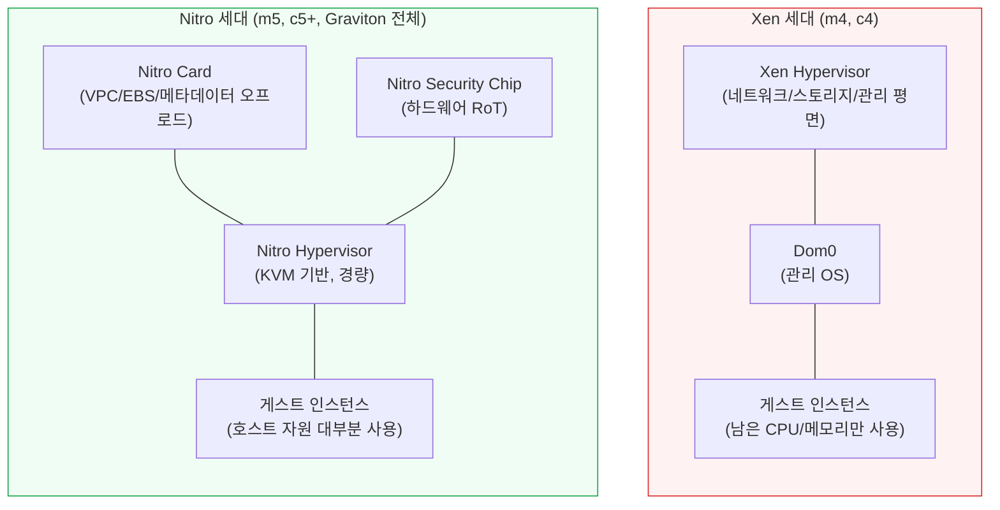
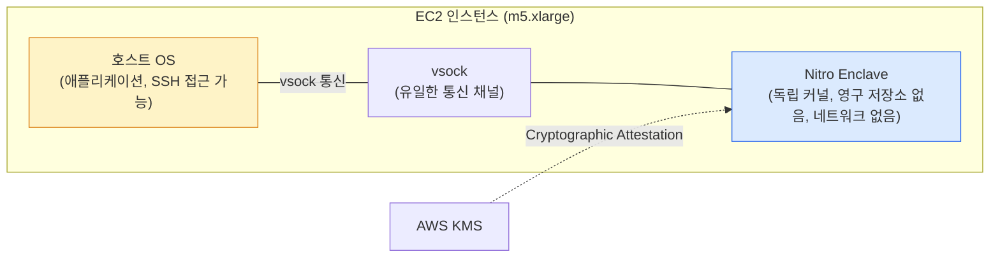

# EC2 Nitro System

EC2 인스턴스가 5세대(m5, c5, r5)부터 동작하는 방식을 바꾼 가상화 플랫폼이다. 이전 세대(m4, c4 등)는 Xen 기반이었고, 호스트 CPU와 메모리의 상당량을 하이퍼바이저가 가져갔다. Nitro는 네트워킹, 스토리지, 보안 같은 작업을 전용 하드웨어 카드로 떼어내고, 메인 CPU는 거의 전부 게스트에 내주는 구조로 바꿨다.

이 문서는 "어떤 인스턴스 타입이 Nitro냐"가 아니라, Nitro로 옮겨갈 때 실무에서 깨지는 부분을 다룬다. 디바이스 이름이 바뀌어서 부팅이 안 되거나, fstab UUID가 안 맞거나, NVMe 타임아웃이 짧아서 EBS가 끊어지는 사례 위주다.

---

## Nitro 등장 배경

Xen 기반 인스턴스는 한 가지 문제가 있었다. 호스트의 물리 CPU와 메모리 중 일부를 도무지 게스트에 줄 수가 없었다. 하이퍼바이저가 네트워크 패킷 처리, EBS I/O, 인스턴스 메타데이터 응답을 전부 소프트웨어로 처리했기 때문이다. m4.large가 EC2 콘솔에서 "2 vCPU 8 GiB"로 보이더라도, 호스트 입장에서는 그보다 더 큰 자원을 확보해 둬야 했다.



Nitro는 이 작업을 전부 별도 하드웨어로 옮겼다. PCIe로 연결된 Nitro Card가 VPC 네트워킹과 EBS를 처리하고, Security Chip이 펌웨어 무결성을 보장하고, Hypervisor는 KVM 기반으로 가벼워졌다. 결과적으로 호스트 CPU의 거의 100%가 게스트에 할당된다.

---

## Nitro System 구성요소

### Nitro Card

Nitro Card는 PCIe 슬롯에 꽂힌 ASIC이다. 한 호스트에 여러 장이 들어 있고, 각각 역할이 다르다.

| 카드 종류 | 역할 |
|----------|------|
| Nitro Card for VPC | ENI, 보안 그룹, 라우팅 처리. 게스트가 보내는 패킷을 VPC 평면으로 변환 |
| Nitro Card for EBS | NVMe 인터페이스로 EBS 볼륨 노출. 암호화도 카드에서 처리 |
| Nitro Card for Instance Storage | i 시리즈의 로컬 NVMe SSD 노출 |
| Nitro Card Controller | 인스턴스 라이프사이클(시작·정지·재부팅), 메타데이터 응답 |

게스트 OS는 이 카드들을 표준 NVMe 디바이스나 ENA 네트워크 인터페이스로 인식한다. AWS 전용 드라이버가 따로 필요 없는 이유가 이거다. 리눅스 커널이 기본으로 들고 있는 `nvme` 드라이버와 `ena` 드라이버만 있으면 된다.

### Nitro Security Chip

Security Chip은 호스트 마더보드에 박혀 있는 별도 칩이다. 펌웨어 무결성 검증과 PCIe 경로의 비휘발성 메모리 접근 차단을 담당한다.

핵심은 한 가지다. **호스트 펌웨어를 사후에 수정할 수 없게 막는다.** 다른 게스트나 침입자가 BIOS, BMC, 펌웨어를 건드려서 영구적인 백도어를 심는 시나리오를 차단한다. 인스턴스를 재부팅하면 매번 측정된 상태로 돌아간다.

이건 게스트 OS 단에서는 거의 안 보인다. 다만 Nitro Enclaves가 동작하는 토대가 이 칩이다.

### Nitro Hypervisor

KVM 기반의 경량 하이퍼바이저다. Xen 하이퍼바이저가 하던 일 중 네트워킹·스토리지·관리 평면을 Nitro Card로 옮기고 남은 부분만 처리한다. CPU와 메모리 가상화, 인터럽트 라우팅 정도다.

결과적으로 게스트가 차지하는 자원 비율이 올라간다. m5.metal 같은 베어메탈 인스턴스도 가능해진 게 이 구조 덕분이다. 하이퍼바이저 자체가 없는 게 아니라, 호스트 메모리에서 차지하는 비중이 거의 없어서 베어메탈 노출이 가능하다.

---

## NVMe 디바이스 네이밍 변화

Nitro로 넘어오면서 가장 먼저 깨지는 게 디바이스 경로다. Xen 기반에서 EBS는 `xen-blkfront` 드라이버를 통해 `/dev/xvda`, `/dev/xvdb` 형태로 노출됐다. Nitro에서는 EBS가 NVMe 디바이스로 노출돼서 `/dev/nvme0n1`, `/dev/nvme1n1` 형태가 된다.

| 항목 | Xen 세대 | Nitro 세대 |
|-----|---------|-----------|
| 루트 디바이스 | `/dev/xvda` | `/dev/nvme0n1` |
| 추가 EBS 볼륨 | `/dev/xvdf`, `/dev/xvdg` | `/dev/nvme1n1`, `/dev/nvme2n1` |
| 디바이스 매핑 안정성 | 콘솔에서 지정한 이름 그대로 | 부팅 시점 순서대로 번호 부여 |
| 인스턴스 스토어 | `/dev/xvdb` | `/dev/nvme1n1` (위치는 가변) |

여기에 함정이 두 가지 있다.

**첫째, 콘솔에서 `/dev/sdf`로 attach해도 OS에서는 `/dev/nvme*n1`로 보인다.** 콘솔 표기와 OS 표기가 다르다. AWS는 Linux 커널에 노출되는 디바이스 이름을 직접 결정하지 않는다. 콘솔에서 정한 이름은 메타데이터로 남고, 실제로 OS에서 보이는 이름은 NVMe 컨트롤러가 인식한 순서대로 매겨진다.

```bash
# Nitro 인스턴스에서 EBS와 콘솔 이름 매핑 확인
sudo nvme list

# 출력 예시
# /dev/nvme0n1  vol-0a1b2c3d  Amazon Elastic Block Store  8.00 GB
# /dev/nvme1n1  vol-0e4f5g6h  Amazon Elastic Block Store  100.00 GB
```

`nvme id-ctrl` 명령으로 더 자세히 볼 수도 있다. vendor specific 영역에 콘솔에서 지정한 디바이스 이름과 EBS 볼륨 ID가 들어 있다.

```bash
sudo nvme id-ctrl -v /dev/nvme1n1 | grep -i sn
# sn      : vol0e4f5g6h7i8j9k0
```

여기서 `vol0e4f5g6h7i8j9k0`은 EBS 볼륨 ID(`vol-0e4f5g6h7i8j9k0`)의 하이픈 없는 표기다. 스크립트로 볼륨과 디바이스를 매칭할 때 쓴다.

**둘째, /etc/fstab에 디바이스 경로를 직접 박은 경우 부팅이 실패한다.** Xen 인스턴스에서 만든 AMI를 Nitro 인스턴스로 띄우면 `/dev/xvdf`가 존재하지 않으니 mount가 실패한다. systemd가 emergency mode로 빠지고 SSH 접속이 안 된다.

해결은 UUID나 라벨로 바꿔두는 것이다. 마이그레이션 전에 fstab을 미리 정리해야 한다.

```bash
# /etc/fstab 잘못된 예 - Nitro에서 깨진다
/dev/xvdf  /data  xfs  defaults,nofail  0  2

# UUID 방식 - Xen, Nitro 양쪽에서 동작
UUID=12345678-90ab-cdef-1234-567890abcdef  /data  xfs  defaults,nofail  0  2

# 라벨 방식
LABEL=data  /data  xfs  defaults,nofail  0  2
```

UUID는 `blkid /dev/nvme1n1`로 확인한다. 라벨은 `xfs_admin -L data /dev/nvme1n1`이나 `e2label /dev/nvme1n1 data`로 지정한다.

`nofail` 옵션도 같이 넣어두는 게 안전하다. 추가 볼륨이 attach 안 된 상태로 인스턴스가 떠도 부팅은 진행되도록 막아준다.

### NVMe 타임아웃 함정

Nitro 인스턴스에서 EBS I/O 응답이 늦어지면 NVMe 드라이버가 디바이스를 분리해버리는 경우가 있다. 기본 타임아웃이 30초인데, EBS 쓰로틀링이나 일시적인 네트워크 지연으로 30초를 넘기면 커널이 디바이스를 죽인 것으로 판단한다.

```bash
# 현재 타임아웃 확인 (기본 30000 = 30초)
cat /sys/module/nvme_core/parameters/io_timeout

# 부팅 시 영구 적용 - GRUB 설정에 추가
# /etc/default/grub
GRUB_CMDLINE_LINUX_DEFAULT="... nvme_core.io_timeout=4294967295"

sudo grub2-mkconfig -o /boot/grub2/grub.cfg
```

AWS 공식 권고는 `4294967295`(약 49일, 사실상 무한대)다. 데이터베이스나 EBS gp3를 빡빡하게 쓰는 워크로드에서 이 값을 안 올려두면 application 단에서 갑자기 disk error가 뜨고, 재부팅해야 복구되는 사고가 난다.

---

## EBS Optimized 기본 활성화

Xen 세대에서는 EBS Optimized가 추가 비용이 붙는 옵션이었다. EBS 트래픽을 일반 네트워크와 분리하는 전용 대역폭이라서 작은 인스턴스에서는 비활성화하는 경우가 많았다.

Nitro 세대에서는 모든 인스턴스가 기본으로 EBS Optimized다. 끌 수도 없다. EBS가 NVMe 디바이스로 노출되는 구조 자체가 전용 카드를 거치기 때문에, 일반 네트워크 대역폭과 분리돼 있는 게 기본이다.

이건 마이그레이션 관점에서 두 가지 의미가 있다.

첫째, m4에서 m5로 옮기면서 EBS Optimized 옵션을 신경 쓸 필요가 없어진다. Launch Template에 `EbsOptimized: true`를 박아두면 m4에서는 의미가 있고 m5에서는 무시된다.

둘째, 인스턴스 타입별 EBS 대역폭 상한을 확인해야 한다. m5.large는 EBS 대역폭이 약 4750 Mbps인데, m6i.large는 더 높다. EBS gp3 볼륨에 16000 IOPS, 1000 MiB/s를 줘도 인스턴스 자체의 EBS 대역폭이 막혀 있으면 거기까지밖에 안 나온다.

```bash
# 인스턴스의 EBS 대역폭 한도 확인
aws ec2 describe-instance-types \
  --instance-types m5.large \
  --query 'InstanceTypes[0].EbsInfo'
```

`BaselineBandwidthInMbps`와 `MaximumBandwidthInMbps`가 다른 인스턴스 타입은 버스트 가능한 타입이다. m5.large는 baseline이 낮고 burst가 높은 편이라, 지속적으로 I/O가 많은 워크로드면 baseline 기준으로 사이징해야 한다.

---

## IMDSv2 하드웨어 기반

IMDS는 인스턴스가 자기 자신의 메타데이터를 조회하는 엔드포인트(`169.254.169.254`)다. Xen 세대에서는 하이퍼바이저가 이 요청을 가로채서 응답했다.

Nitro 세대에서는 Nitro Card Controller가 응답한다. 게스트 OS에서 보면 똑같이 HTTP 요청이지만, 실제 처리 주체가 다르다. 이게 IMDSv2의 보안 보장에서 중요하다.

IMDSv2의 토큰 발급(PUT 요청)이 하이퍼바이저 단에서 처리되는 게 아니라 카드 단에서 처리된다. 게스트 커널이 해킹당해도 카드 단의 토큰 검증은 우회할 수 없다. SSRF 공격으로 토큰을 못 가져오는 이유는 PUT 요청이 HTTP 리다이렉트 시 헤더가 사라지는 표준 동작 덕분이기도 하지만, 응답 주체 자체가 하드웨어인 것도 한몫한다.

IMDSv2 자체의 사용법은 [EC2](EC2.md#imds-인스턴스-메타데이터-서비스) 문서에 정리해뒀다. 여기서는 Nitro 인스턴스에서 IMDSv2를 강제할 때 한 가지만 더 짚는다.

```bash
# 신규 인스턴스에 IMDSv2 hop limit 1로 강제
aws ec2 run-instances \
  --image-id ami-xxx \
  --instance-type m6i.large \
  --metadata-options "HttpTokens=required,HttpPutResponseHopLimit=1,HttpEndpoint=enabled"
```

`HttpPutResponseHopLimit=1`이 핵심이다. 도커 컨테이너 안에서 IMDS를 호출할 때 hop이 1을 넘기는 경우가 있다. 기본값 1이면 호스트 OS에서만 IMDS 호출이 되고 컨테이너 안에서는 막힌다. ECS, EKS의 IRSA를 쓰면 컨테이너에서 IMDS를 직접 부를 일이 없으므로 1로 막아두는 게 안전하다.

EKS의 노드 보안 가이드도 hop limit 1을 기본으로 권한다. 컨테이너 탈취 시 노드의 인스턴스 프로파일 자격증명이 새는 시나리오를 막는다.

---

## ENA 네트워킹

ENA(Elastic Network Adapter)는 Nitro Card for VPC가 게스트 OS에 노출하는 네트워크 인터페이스다. Xen 세대의 `xen-netfront`나 그 이전의 `e1000` 에뮬레이션과 다르게, ENA는 진짜 PCIe 디바이스다.

게스트 OS에서 `lspci`로 확인하면 `Amazon.com, Inc. Elastic Network Adapter (ENA)`로 잡힌다. 드라이버는 리눅스 메인라인 커널 4.9 이상에 들어 있고, 별도 설치가 거의 필요 없다. Amazon Linux 2, Ubuntu 18.04 이상은 그대로 동작한다.

```bash
# ENA 드라이버 버전 확인
modinfo ena | grep ^version

# 인터페이스 통계 (Nitro 인스턴스 전용 지표)
ethtool -S eth0 | grep -E "bw_in_allowance_exceeded|bw_out_allowance_exceeded|pps_allowance_exceeded|conntrack_allowance_exceeded|linklocal_allowance_exceeded"
```

`bw_in_allowance_exceeded`나 `pps_allowance_exceeded` 카운터가 올라가면 인스턴스 네트워크 대역폭/PPS 한도에 걸렸다는 뜻이다. m5.large는 burst 시 최대 10 Gbps지만, baseline은 0.75 Gbps 수준이다. 지속 트래픽이 많으면 baseline에 막힌다.

`conntrack_allowance_exceeded`는 보안 그룹의 conntrack 한도 초과다. 인스턴스 타입별로 동시 연결 수 제한이 있는데, 이걸 넘기면 새 연결이 drop된다. 외부 API를 호출하는 워크로드에서 connection pooling 없이 매번 새 TCP 연결을 만들면 이 카운터가 잘 올라간다.

ENA 자체의 성능은 인스턴스 타입에 따라 다르다. m5.large는 ENA지만 m5n.large는 ENA + 더 큰 네트워크 대역폭(25 Gbps급)을 제공한다. 'n' 변형은 네트워크 강화 인스턴스고, NVMe도 동일하게 빨라진다.

### EFA는 ENA의 상위 호환이 아니다

EFA(Elastic Fabric Adapter)는 ENA와 별개의 인터페이스다. HPC, ML 학습처럼 노드 간 low-latency 통신이 필요한 워크로드용이다. EFA를 enable해도 ENA는 그대로 있고, 추가로 EFA 인터페이스가 붙는 형태다. 일반 웹 서비스에서는 쓸 일이 거의 없다.

---

## Nitro Enclaves

Enclaves는 EC2 인스턴스 안에 격리된 별도 VM을 띄우는 기능이다. 부모 인스턴스의 vCPU와 메모리 일부를 잘라서, 외부에서 접근 불가능한 컴퓨팅 환경을 만든다.



Enclave의 특징은 이렇다.

- SSH 접근이 안 된다. 부모 인스턴스에서도 직접 못 들어간다.
- 영구 저장소가 없다. 디스크 없이 메모리만으로 동작한다.
- 네트워크 인터페이스가 없다. vsock(Linux의 가상 소켓)으로만 부모 인스턴스와 통신한다.
- KMS와 cryptographic attestation으로 통신할 수 있다. Enclave가 자기가 어떤 코드를 돌리고 있는지 KMS에 증명하면, KMS는 그에 따라 키를 풀어준다.

쓰는 시나리오는 신용카드 번호 토큰화, 의료 데이터 처리, 디지털 자산 키 관리 같은 곳이다. 호스트 OS가 침해당해도 Enclave 안의 데이터는 노출되지 않는다는 보장이 필요한 경우다.

Enclave를 enable한 인스턴스는 launch할 때 명시해야 한다. 이미 실행 중인 인스턴스에서 켤 수 없다.

```bash
aws ec2 run-instances \
  --image-id ami-xxx \
  --instance-type m5.xlarge \
  --enclave-options 'Enabled=true'
```

리소스 할당은 `/etc/nitro_enclaves/allocator.yaml`에서 정한다.

```yaml
# 4 vCPU, 4096 MiB를 enclave에 할당
cpu_count: 4
memory_mib: 4096
```

부모 인스턴스의 vCPU/메모리에서 미리 떼어내는 방식이다. m5.xlarge(4 vCPU 16 GiB)에서 4 vCPU를 enclave에 주면 부모 OS는 사실상 0 vCPU가 된다. 보통 m5.2xlarge 이상에서 절반 정도를 떼어 쓴다.

실무에서 도입할 때 가장 큰 장벽은 빌드 파이프라인이다. Enclave 이미지는 EIF(Enclave Image File) 형식이라 일반 도커 이미지를 `nitro-cli build-enclave`로 변환해야 한다. 또 디버깅이 어렵다. 한번 enclave를 띄우면 안에서 무슨 일이 일어나는지 보려면 debug mode로 띄워야 하는데, 그러면 attestation이 무효화돼서 KMS 연동이 안 된다. 운영 모드와 디버그 모드의 코드 경로가 사실상 분리된다.

---

## Xen → Nitro 마이그레이션 함정

기존 m4, c4, r4 인스턴스를 m5, c5, r5로 옮기는 작업은 인스턴스 타입만 바꿔서는 안 된다. AMI가 ENA와 NVMe 드라이버를 지원하는지 먼저 확인해야 한다.

```bash
# AMI가 ENA 지원하는지 확인
aws ec2 describe-images \
  --image-ids ami-xxx \
  --query 'Images[0].EnaSupport'

# AMI의 가상화 타입 확인 (hvm이어야 한다)
aws ec2 describe-images \
  --image-ids ami-xxx \
  --query 'Images[0].VirtualizationType'
```

`EnaSupport: true`이고 `VirtualizationType: hvm`이어야 Nitro 인스턴스로 띄울 수 있다. paravirtual(PV) AMI는 Nitro에서 아예 안 뜬다.

ENA support가 false인 AMI는 인스턴스를 일단 띄울 수 없다. 기존 인스턴스를 m4 상태로 유지한 채 ENA 지원을 켜고, 그 다음에 인스턴스 타입을 m5로 바꾸는 순서를 밟아야 한다.

```bash
# 1. m4 인스턴스 정지
aws ec2 stop-instances --instance-ids i-xxx

# 2. ENA 지원 켜기 (인스턴스 단위 - 일회성)
aws ec2 modify-instance-attribute \
  --instance-id i-xxx \
  --ena-support

# 3. AMI 단위로도 켜두면 새 AMI 생성 시 유지된다
aws ec2 modify-image-attribute \
  --image-id ami-xxx \
  --description "ENA enabled"

# 4. 인스턴스 타입 변경 후 시작
aws ec2 modify-instance-attribute \
  --instance-id i-xxx \
  --instance-type "{\"Value\": \"m5.large\"}"
aws ec2 start-instances --instance-ids i-xxx
```

부팅 후 확인할 것은 세 가지다.

`/etc/fstab`에 `/dev/xvd*` 표기가 남아 있으면 추가 볼륨이 mount 안 된다. 미리 UUID로 바꿔두지 않았다면, emergency mode로 빠진 인스턴스에 EBS 콘솔로 들어가서 시리얼 콘솔로 접근해야 한다. 시리얼 콘솔도 미리 enable해두지 않으면 못 쓴다.

NVMe `io_timeout`이 기본 30초로 남아 있으면 EBS 일시적 지연에 디스크가 끊긴다. cloud-init이나 user-data에 GRUB 설정을 넣어두는 게 안전하다.

마지막으로 ENA 통계 카운터를 한 번 찍어보고 baseline을 잡아둔다. m4와 m5는 동일 사이즈여도 네트워크 PPS 한도가 다르다. 트래픽이 늘어났을 때 어디서 막히는지 모르면 디버깅이 길어진다.

---

## 인스턴스가 Nitro인지 확인하기

세대 번호만으로 판단하기 애매한 경우가 있다. t3, t3a, t4g는 Nitro지만 이름만 보면 헷갈린다. `describe-instance-types`로 hypervisor 종류를 직접 보는 게 확실하다.

```bash
aws ec2 describe-instance-types \
  --instance-types m5.large t3.medium m4.large \
  --query 'InstanceTypes[*].[InstanceType,Hypervisor,EnaSupport]' \
  --output table

# 출력
# m5.large   nitro  required
# t3.medium  nitro  required
# m4.large   xen    unsupported
```

`Hypervisor`가 `nitro`이고 `EnaSupport`가 `required`면 Nitro 세대다. `xen`이면 구세대다. AWS는 Nitro에 새 기능을 집중하고 Xen 세대에는 신규 기능을 추가하지 않으므로, 신규 시스템 구축이라면 무조건 Nitro 인스턴스를 선택한다.

Graviton 인스턴스(a1, t4g, m6g, m7g, c7g 등)는 출시 시점부터 전부 Nitro다. ARM 아키텍처지만 NVMe/ENA 구조는 동일해서, 이 문서의 내용이 그대로 적용된다.
