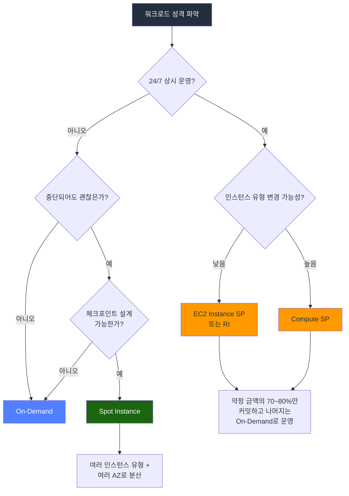
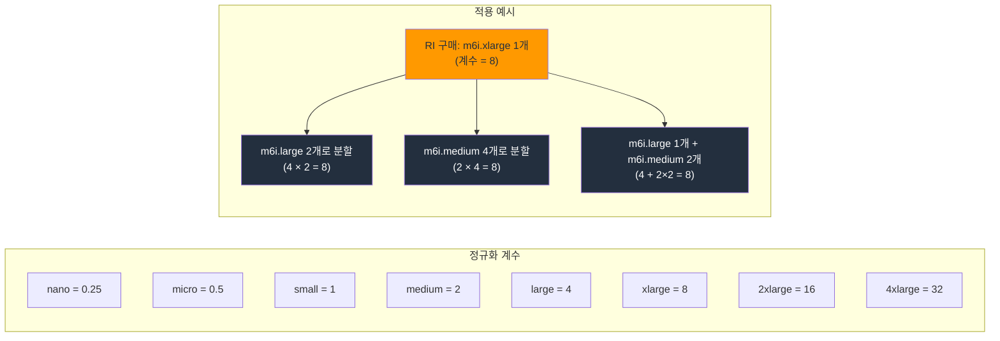
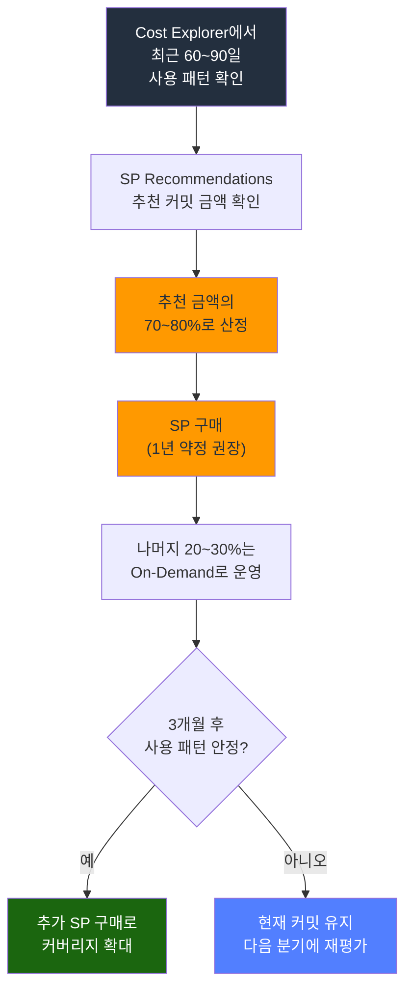
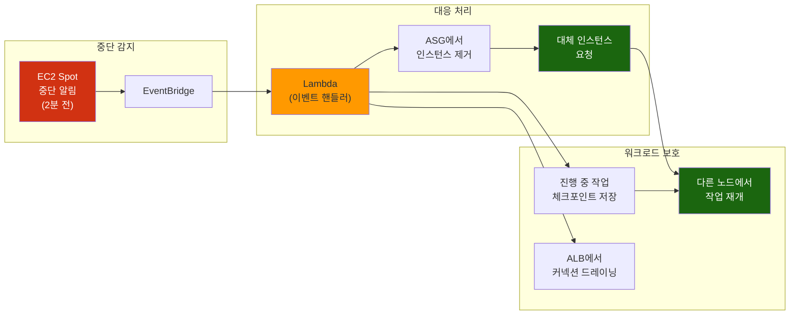
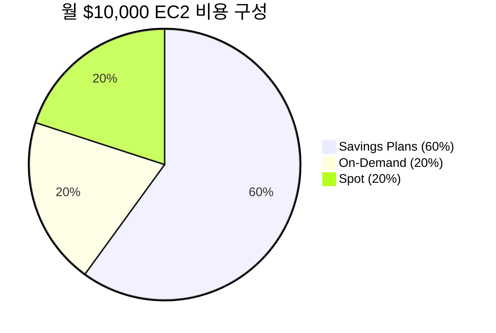
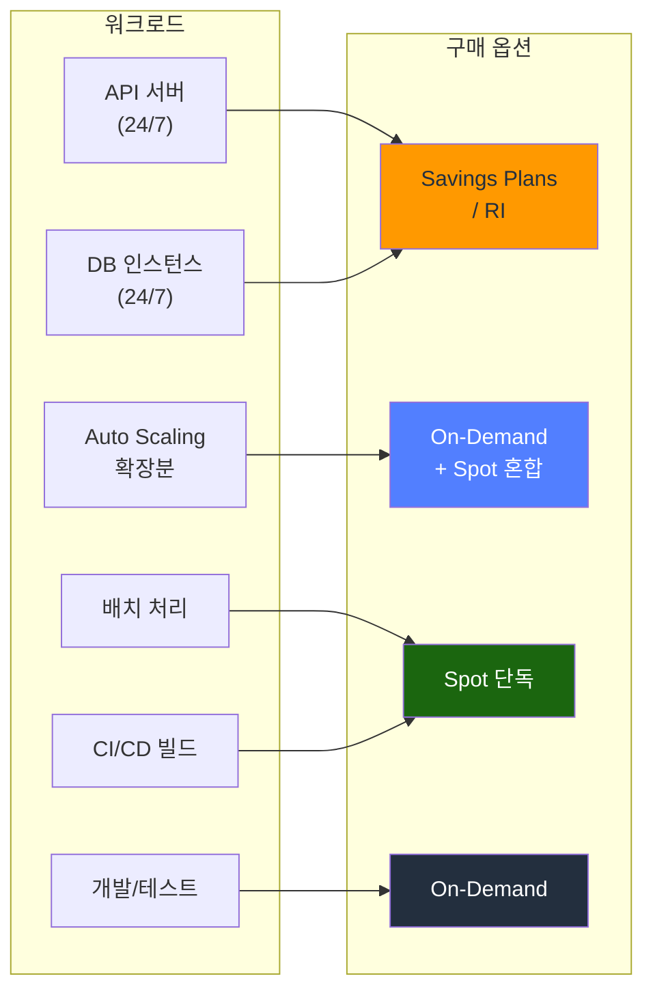
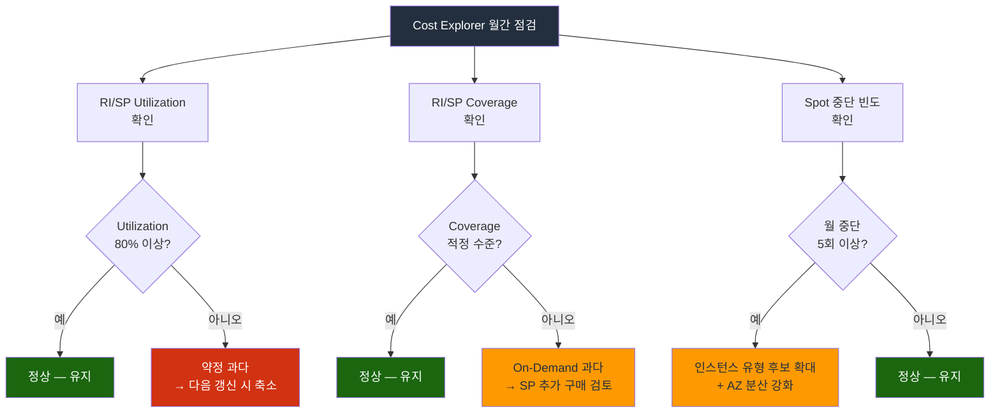

# EC2 구매 옵션

같은 사양의 EC2 인스턴스라도 어떤 구매 옵션을 선택하느냐에 따라 비용이 최대 90%까지 차이난다. 운영 환경에서 아무 생각 없이 On-Demand만 쓰면, 연 단위로 보면 수천만 원이 더 나가는 경우가 흔하다.

---

## 구매 옵션 한눈에 보기

| 옵션 | 할인율 | 약정 | 중단 가능성 | 적합한 워크로드 |
|------|--------|------|-------------|----------------|
| On-Demand | 없음 | 없음 | 없음 | 개발/테스트, 트래픽 예측 불가 서비스 |
| Reserved Instance (RI) | 최대 72% | 1년/3년 | 없음 | 24/7 운영 서비스, DB |
| Savings Plans (SP) | 최대 72% | 1년/3년 | 없음 | 인스턴스 유형 변경이 잦은 서비스 |
| Spot Instance | 최대 90% | 없음 | AWS가 2분 전 통보 후 회수 | 배치 처리, CI/CD, 내결함성 워크로드 |

### 어떤 구매 옵션을 써야 하나

워크로드 성격에 따라 선택이 갈린다. 아래 흐름도를 따라가면 대부분의 경우에 맞는 옵션이 나온다.



---

## On-Demand

초 단위(Linux) 또는 시간 단위(Windows) 과금. 약정 없이 원할 때 시작하고 원할 때 끈다.

### 언제 쓰나

- 트래픽 패턴을 아직 모르는 신규 서비스
- 개발/스테이징 환경
- 갑자기 트래픽이 터지는 이벤트성 대응 (Auto Scaling에서 RI/SP 커버리지 초과분)

### 실무에서 주의할 점

On-Demand가 비싸다는 건 다들 알지만, 실제로 문제가 되는 건 "잠깐 쓰려고 만든 인스턴스"를 끄지 않아서 생기는 비용이다. 개발용 인스턴스는 반드시 태그로 관리하고, Instance Scheduler나 Lambda로 업무 시간 외에는 자동으로 중지시켜야 한다.

```bash
# AWS Instance Scheduler 없이 간단하게 처리하는 방법
# EventBridge + Lambda 조합

# 매일 오후 8시에 dev 태그가 붙은 인스턴스 중지
aws ec2 describe-instances \
  --filters "Name=tag:Environment,Values=dev" "Name=instance-state-name,Values=running" \
  --query "Reservations[].Instances[].InstanceId" \
  --output text | xargs -I {} aws ec2 stop-instances --instance-ids {}
```

---

## Reserved Instance (RI)

1년 또는 3년 약정을 걸고 할인받는 방식이다. 약정 기간 동안 사용 여부와 관계없이 비용이 나간다.

### 결제 방식 3가지

| 결제 방식 | 할인율 | 현금 흐름 |
|-----------|--------|-----------|
| 전체 선결제 (All Upfront) | 가장 높음 | 계약 시 전액 결제 |
| 부분 선결제 (Partial Upfront) | 중간 | 일부 선결제 + 월 할부 |
| 선결제 없음 (No Upfront) | 가장 낮음 | 매월 할인된 시간당 요금 |

### RI 유형

**Standard RI**: 인스턴스 패밀리, OS, 테넌시를 변경할 수 없다. 할인율이 Convertible보다 높다. Marketplace에서 남은 기간을 판매할 수 있다.

**Convertible RI**: 약정 기간 중에 인스턴스 패밀리, OS, 테넌시를 바꿀 수 있다. 단, 교환 시 새로운 RI의 가치가 기존 RI보다 같거나 높아야 한다. 다운그레이드는 안 된다.

### 비용 계산 예제

서울 리전에서 m6i.xlarge를 1년간 24/7 운영한다고 가정한다.

```
On-Demand 시간당 요금: $0.248
월 비용: $0.248 × 730시간 = $181.04
연 비용: $181.04 × 12 = $2,172.48

Standard RI (1년, 전체 선결제): $1,325 (약 39% 할인)
Standard RI (1년, 선결제 없음): 월 $112.42 → 연 $1,349.04 (약 38% 할인)

Standard RI (3년, 전체 선결제): $2,502 → 연 $834 (약 62% 할인)
```

> 숫자는 시점에 따라 다르다. AWS Pricing Calculator에서 반드시 최신 가격을 확인해야 한다.

### RI 실무에서 자주 하는 실수

**사이즈 불일치**: m6i.xlarge로 RI를 샀는데, 나중에 m6i.2xlarge로 변경하면 RI가 적용되지 않는다. Standard RI는 같은 인스턴스 패밀리 내에서 사이즈 유연성(Size Flexibility)이 있긴 하다. m6i.xlarge 1개 = m6i.large 2개로 분할 적용된다. 단, 이건 리전 기반 RI에만 적용되고, AZ 지정 RI는 안 된다.

**리전 vs AZ**: 리전 기반 RI는 해당 리전 내 모든 AZ에서 적용되고 사이즈 유연성도 있다. AZ 지정 RI는 특정 AZ에서만 적용되고 용량 예약이 보장된다. 대부분의 경우 리전 기반 RI가 낫다. 용량 예약이 필요한 경우에만 AZ 지정을 쓴다.

**미사용 RI**: RI를 사고 해당 인스턴스를 쓰지 않으면 돈만 날린다. Cost Explorer의 RI Utilization 리포트를 주기적으로 확인해야 한다.

### RI 사이즈 유연성 (Size Flexibility)

리전 기반 Standard RI는 같은 인스턴스 패밀리 내에서 사이즈를 쪼개거나 합칠 수 있다. 정규화 계수(Normalization Factor)를 기준으로 계산한다.



AZ 지정 RI에는 이 유연성이 적용되지 않는다. 정확히 같은 사이즈의 인스턴스에만 할인이 붙는다.

---

## Savings Plans (SP)

RI의 복잡함을 개선한 모델이다. 인스턴스 유형이 아니라 **시간당 사용 금액**을 약정한다. 예를 들어 "시간당 $10를 1년간 쓰겠다"고 약정하면, 그 금액까지는 할인이 적용되고 초과분은 On-Demand로 청구된다.

### SP 유형

**Compute Savings Plans**: EC2, Fargate, Lambda 모두 적용된다. 인스턴스 패밀리, 리전, OS를 자유롭게 바꿀 수 있다. 할인율은 RI보다 약간 낮지만 유연성이 훨씬 높다.

**EC2 Instance Savings Plans**: 특정 리전의 특정 인스턴스 패밀리(예: 서울 리전 m6i)에 고정된다. 사이즈, OS, 테넌시는 변경 가능. 할인율은 Standard RI와 비슷하다.

### RI와 SP 중 뭘 써야 하나

SP가 나온 이후 AWS도 SP를 권장한다. RI는 2024년부터 이미 Convertible만 구매 가능하고, Standard RI 신규 구매가 막혔다.

실무 기준으로 정리하면:

- **인스턴스 유형이 확정되어 있고, 변경 계획이 없다**: EC2 Instance SP
- **여러 서비스(EC2, Fargate, Lambda)를 쓰고, 인프라 변경이 잦다**: Compute SP
- **AZ 레벨 용량 예약이 필요하다**: RI (AZ 지정)만 가능

### SP 커밋 금액 산정

Cost Explorer에서 SP 추천을 볼 수 있다. 하지만 그대로 따르면 위험하다.

```
1. Cost Explorer > Savings Plans > Recommendations에서 추천 시간당 커밋 확인
2. 최근 30일이 아니라 최근 60~90일의 사용 패턴을 봐야 한다
3. 추천 금액의 70~80%로 시작하는 게 안전하다
4. 나머지는 On-Demand로 두고, 패턴이 안정되면 추가 구매
```

70~80%로 시작하라는 이유는, 서비스가 축소되거나 인스턴스 사양이 줄어들면 약정 금액을 채우지 못해도 비용이 그대로 나가기 때문이다.

### SP 커밋 금액 산정 프로세스



핵심은 한 번에 전부 커밋하지 않는 것이다. 처음에 보수적으로 시작해서 패턴이 안정되면 추가로 사는 방식이 안전하다.

---

## Spot Instance

AWS가 남는 용량을 할인해서 파는 것이다. On-Demand 대비 최대 90% 싸다. 대신 AWS가 용량이 필요하면 2분 전에 통보하고 회수한다.

### Spot 가격 변동

Spot 가격은 수요/공급에 따라 실시간으로 변한다. 예전에는 입찰(bidding) 방식이었지만, 지금은 점진적으로 변하는 시장 가격 모델이다. 최대 가격(max price)을 지정하면 시장 가격이 그 이상으로 올라갈 때 인스턴스가 종료된다. 지정하지 않으면 On-Demand 가격이 상한이 된다.

### Spot 중단 대응

Spot을 프로덕션에 쓰려면 중단 대응이 필수다.

#### 중단 알림 감지

```python
# EC2 메타데이터 서비스로 중단 알림 확인
# 2분 전에 알림이 온다
import requests
import time

METADATA_URL = "http://169.254.169.254/latest/meta-data/spot/instance-action"

while True:
    try:
        response = requests.get(METADATA_URL, timeout=1)
        if response.status_code == 200:
            action = response.json()
            print(f"Spot 중단 예정: {action['action']} at {action['time']}")
            # 여기서 graceful shutdown 로직 실행
            # - 진행 중인 작업 저장
            # - 로드밸런서에서 제거
            # - 커넥션 드레이닝
            break
    except requests.exceptions.RequestException:
        pass  # 404면 중단 예정 아님
    time.sleep(5)
```

#### EventBridge로 중단 이벤트 처리

인스턴스 내부에서 폴링하는 것보다 EventBridge로 처리하는 게 더 안정적이다.

```json
{
  "source": ["aws.ec2"],
  "detail-type": ["EC2 Spot Instance Interruption Warning"],
  "detail": {
    "instance-action": ["terminate", "stop", "hibernate"]
  }
}
```

이 이벤트를 Lambda로 받아서 Auto Scaling에서 해당 인스턴스를 제거하고, 대체 인스턴스를 미리 띄우는 식으로 처리한다.

#### Spot 중단 대응 아키텍처

실제 프로덕션에서 Spot을 쓸 때의 전체 흐름이다.



이 구조에서 중요한 건 체크포인트 저장이다. 2분 안에 현재 작업 상태를 S3나 DynamoDB에 저장하고, 대체 인스턴스가 뜨면 그 지점부터 이어서 처리한다.

#### Spot 중단 최소화 방법

1. **다양한 인스턴스 유형 사용**: 하나의 인스턴스 유형만 쓰면 해당 풀이 부족할 때 바로 중단된다. 비슷한 사양의 여러 유형을 후보로 두면 중단 확률이 줄어든다.

```json
// Auto Scaling Group의 Mixed Instances Policy 예시
{
  "LaunchTemplate": {
    "LaunchTemplateSpecification": {
      "LaunchTemplateId": "lt-0123456789abcdef0"
    },
    "Overrides": [
      { "InstanceType": "m6i.large" },
      { "InstanceType": "m6a.large" },
      { "InstanceType": "m5.large" },
      { "InstanceType": "m5a.large" },
      { "InstanceType": "m7i.large" }
    ]
  },
  "InstancesDistribution": {
    "OnDemandBaseCapacity": 2,
    "OnDemandPercentageAboveBaseCapacity": 20,
    "SpotAllocationStrategy": "capacity-optimized"
  }
}
```

이 설정의 의미: 최소 2대는 On-Demand로 유지하고, 추가 인스턴스의 80%는 Spot으로 채운다. Spot 할당은 용량이 가장 여유 있는 풀에서 가져온다(capacity-optimized).

2. **여러 AZ에 분산**: 특정 AZ에서만 Spot이 부족할 수 있다. 여러 AZ에 걸쳐 배포하면 전체가 동시에 회수될 확률이 낮아진다.

3. **capacity-optimized 할당 전략 사용**: `lowest-price`보다 `capacity-optimized`가 중단 확률이 낮다. 가격이 약간 더 나갈 수 있지만, 중단으로 인한 오버헤드를 생각하면 이쪽이 낫다.

### Spot이 적합한 워크로드

- 배치 처리: 작업을 체크포인트 단위로 저장하고, 중단 시 다른 인스턴스에서 이어서 처리
- CI/CD 빌드: Jenkins, GitHub Actions 셀프 호스티드 러너
- 데이터 분석: Spark, EMR 워커 노드
- 컨테이너: ECS/EKS 워커 노드 (Spot 중단 시 Pod가 다른 노드로 재스케줄링)

### Spot이 적합하지 않은 워크로드

- 상태를 가진 단일 인스턴스 (DB 등)
- 중단 시 복구에 30분 이상 걸리는 서비스
- SLA가 엄격한 고객 대면 서비스의 단독 구성

---

## 구매 옵션 조합

실무에서는 하나의 옵션만 쓰는 경우가 드물다. 보통 이렇게 조합한다.

### 일반적인 조합 패턴

**항상 켜져 있는 기본 인프라** → Savings Plans 또는 RI

24/7 돌아가는 API 서버, DB 인스턴스 같은 것들이다. 사용량이 예측 가능하므로 약정을 걸어 비용을 줄인다.

**변동 트래픽 대응** → On-Demand + Spot 혼합

Auto Scaling에서 기본 용량은 On-Demand로, 확장분은 Spot으로 처리한다. Spot이 회수되어도 기본 서비스에는 영향 없다.

**비용 민감한 비동기 처리** → Spot 단독

배치, 데이터 처리 같은 비동기 워크로드는 Spot 단독으로도 충분하다. 체크포인트만 잘 설계하면 된다.

### 비용 구성 예시

월 EC2 예산이 $10,000인 서비스를 가정한다.

```
Savings Plans 커버리지: $6,000 (60%) → 약정 할인 적용
On-Demand: $2,000 (20%) → 피크 트래픽 대응
Spot: $2,000 (20%) → 배치/비동기 처리

할인 전 On-Demand 환산 비용: 약 $18,000~20,000
실제 비용: $10,000
절감율: 약 45~50%
```



이 정도 절감율이 일반적이다. Spot 비중을 더 높이면 절감율이 올라가지만, 서비스 안정성과 트레이드오프가 있다.

### 워크로드별 구매 옵션 매핑



---

## 비용 모니터링

구매 옵션을 적용한 후 방치하면 안 된다. Cost Explorer에서 다음 지표를 월 1회 이상 확인해야 한다.

- **RI/SP Utilization**: 약정한 만큼 실제로 쓰고 있는지. 80% 미만이면 약정이 과하다는 뜻이다.
- **RI/SP Coverage**: 전체 사용량 중 약정으로 커버되는 비율. 너무 낮으면 On-Demand 비용이 불필요하게 나가고 있다는 뜻이다.
- **Spot 중단 빈도**: CloudWatch 또는 Spot Placement Score로 확인. 특정 인스턴스 유형의 중단이 잦으면 후보 풀을 넓혀야 한다.

### Cost Explorer 확인 포인트



```bash
# Cost Explorer API로 SP 사용률 확인
aws ce get-savings-plans-utilization \
  --time-period Start=2026-03-01,End=2026-03-31 \
  --query 'Total.{Utilization: UtilizationPercentage, 
    Used: UsedCommitment, Total: TotalCommitment}'
```
