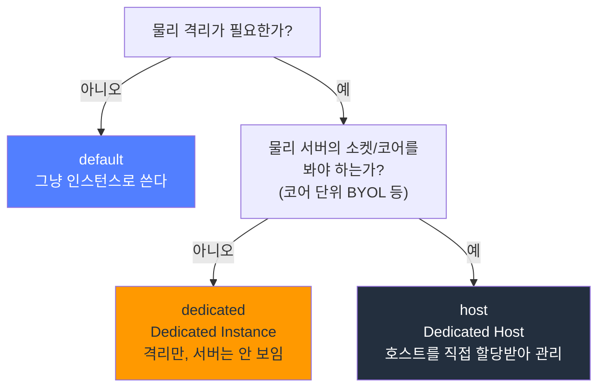

# EC2 테넌시와 Dedicated Hosts

EC2 인스턴스를 띄우면 보통은 어떤 물리 서버에 올라가는지 신경 쓸 일이 없다. 같은 물리 서버에 다른 AWS 고객의 인스턴스가 섞여 돌든 말든 격리는 하이퍼바이저가 책임지니까 그냥 쓴다. 그런데 "이 물리 서버에는 우리 회사 인스턴스만 올라가야 한다"거나 "Windows Server 라이선스를 코어 단위로 사 와서 그대로 쓰겠다"는 요구가 들어오는 순간 테넌시(tenancy)를 알아야 한다. 컴플라이언스 감사나 온프레미스 라이선스 이전(BYOL) 때문에 발을 들이는 경우가 대부분이다.

테넌시는 인스턴스가 물리 하드웨어를 다른 고객과 공유하느냐 마느냐를 정하는 속성이다. `default`, `dedicated`, `host` 세 가지가 있고, 뒤로 갈수록 격리 수준과 비용이 올라간다.

## 세 가지 테넌시의 격리 수준

| 테넌시 | 물리 서버 공유 | 물리 서버 가시성 | 과금 단위 | 주 용도 |
|--------|----------------|------------------|-----------|---------|
| `default` (shared) | 다른 고객과 공유 | 없음 | 인스턴스 | 일반 워크로드 |
| `dedicated` (Dedicated Instance) | 우리 계정만 | 없음 (서버 못 봄) | 인스턴스 + 리전당 시간당 추가 요금 | 물리 격리만 필요 |
| `host` (Dedicated Host) | 우리 계정만 | 있음 (소켓/코어/호스트 ID) | 물리 호스트 | BYOL, 코어 단위 라이선스 |

핵심 차이는 두 가지다. 하나는 물리 서버를 우리 계정이 독점하느냐, 다른 하나는 그 물리 서버의 소켓·코어 구성을 우리가 들여다볼 수 있느냐다.

`default`는 아무 격리가 없다. `dedicated`와 `host`는 둘 다 물리 서버를 우리 계정이 독점한다는 점은 같지만, 그 서버를 다루는 방식이 완전히 다르다.



## Dedicated Instance와 Dedicated Host의 진짜 차이

이름이 비슷해서 처음엔 둘이 그냥 격리 정도 차이인 줄 안다. 아니다. 운영 모델 자체가 다르다.

Dedicated Instance(`dedicated`)는 물리 서버를 우리 계정이 독점하지만, 그 서버가 어떤 물건인지는 안 보인다. 소켓이 몇 개인지, 코어가 몇 개인지, 어제 띄운 인스턴스와 오늘 띄운 인스턴스가 같은 물리 서버에 올라갔는지 알 길이 없다. AWS가 알아서 격리된 하드웨어 어딘가에 올려줄 뿐이다. 격리는 보장하지만 그 이상의 제어권은 없다.

Dedicated Host(`host`)는 물리 서버 한 대를 통째로 할당받는다. `aws ec2 allocate-hosts`로 호스트를 먼저 잡으면 호스트 ID(`h-xxxx`)가 생기고, 이 호스트의 소켓 수와 물리 코어 수가 그대로 보인다. 예를 들어 `m5` 호스트는 소켓 2개, 물리 코어 48개짜리 서버라는 게 명시된다. 그 위에 `m5.large`를 몇 대 올릴지, 어떤 인스턴스를 어느 호스트에 고정할지를 우리가 직접 정한다.

이 "소켓·코어가 보인다"는 점이 BYOL의 전부다. 온프레미스에서 쓰던 소프트웨어 라이선스가 물리 소켓이나 코어 수에 묶여 있을 때, 그 물리적 숫자를 증명할 수 있는 건 Dedicated Host뿐이다. Dedicated Instance는 코어가 안 보이니 코어 단위 라이선스를 가져올 수 없다.

| 비교 항목 | Dedicated Instance | Dedicated Host |
|-----------|--------------------|----------------|
| 물리 서버 독점 | O | O |
| 소켓/코어 가시성 | X | O |
| 코어/소켓 단위 BYOL | 불가 | 가능 |
| 호스트에 인스턴스 배치 제어 | 불가 | 가능 (affinity, placement) |
| 과금 | 인스턴스 + 시간당 추가 요금 | 호스트 단위 (인스턴스 요금 없음) |
| 호스트 ID 노출 | 없음 | `h-xxxxxxxx` |

## BYOL이 필요한 라이선스 시나리오

Dedicated Host를 쓰는 가장 흔한 이유가 BYOL(Bring Your Own License)이다. 클라우드 요금에 라이선스가 포함된 인스턴스를 쓰지 않고, 이미 사둔 라이선스를 EC2로 가져온다. 라이선스 메트릭이 물리 자원에 묶인 제품들이 여기 해당한다.

Windows Server 데이터센터 에디션은 물리 코어 단위로 라이선스를 산다. 호스트의 물리 코어 수가 곧 라이선스 소요량이 되므로, 그 코어 수가 보이는 Dedicated Host 위에서만 정당하게 가져올 수 있다. 그냥 default 테넌시에 올린 Windows는 AWS가 라이선스를 포함해 청구하는 모델이라 BYOL이 안 된다.

Oracle Database는 소켓 또는 코어 기반으로 라이선스를 따지고, 코어 팩터(processor core factor)를 곱해 계산한다. Oracle 정책상 클라우드에서 라이선스를 인정받으려면 물리 코어를 셀 수 있어야 하는데, Dedicated Host가 그 물리 코어 수를 고정·증명해준다. Oracle을 클라우드로 옮길 때 라이선스 비용 폭탄을 피하려고 Dedicated Host로 가는 경우가 많다.

SQL Server는 코어 단위 라이선스(보통 2코어 팩 단위)다. 마찬가지로 물리 코어가 보이는 호스트에서 가져온다.

여기서 실무적으로 중요한 게 하나 있다. Dedicated Host는 물리 코어 수가 고정돼 있으니, 그 코어 안에서 인스턴스를 몇 대 올리든 라이선스 소요량은 그대로다. 그래서 호스트 하나에 인스턴스를 꽉 채워 올릴수록 코어당 라이선스 단가가 떨어진다. 라이선스 비용 최적화는 곧 "호스트를 얼마나 빈틈없이 채우느냐" 문제가 된다. 인스턴스 한두 대만 올리고 노는 호스트는 라이선스를 비싸게 쓰는 셈이다.

## 호스트 할당과 인스턴스 배치

Dedicated Host는 인스턴스를 띄우기 전에 호스트부터 잡아야 한다.

```bash
aws ec2 allocate-hosts \
  --instance-type m5.large \
  --availability-zone ap-northeast-2a \
  --quantity 1 \
  --auto-placement on \
  --host-recovery on
```

`--instance-type`으로 이 호스트에 올릴 인스턴스 타입을 정한다. `m5.large`로 잡은 호스트에는 `m5.large` 계열만 올라간다(같은 패밀리의 여러 사이즈를 섞으려면 `--instance-family`로 잡는 옵션도 있다). 할당하는 순간부터 호스트 단위 과금이 시작된다.

### auto-placement

`--auto-placement`는 테넌시만 `host`로 지정하고 호스트 ID를 명시하지 않은 인스턴스가 이 호스트에 자동으로 올라갈 수 있는지를 정한다.

- `on`: 호스트 ID 없이 테넌시 `host`로 띄운 인스턴스를 이 호스트가 받아준다. 빈 슬롯 아무 데나 알아서 채우고 싶을 때.
- `off`: 인스턴스를 띄울 때 이 호스트 ID를 콕 집어야만 올라간다. 특정 호스트에 특정 워크로드만 격리하고 싶을 때.

### host affinity

affinity는 인스턴스를 멈췄다 다시 켤 때 같은 호스트로 돌아오느냐를 정한다. 이게 BYOL에서 의외로 중요하다.

- `host` affinity: 인스턴스가 stop/start를 반복해도 항상 처음 올라갔던 그 물리 호스트로 돌아온다. 라이선스가 특정 물리 서버에 묶여야 하는 경우(일부 라이선스는 90일간 같은 물리 서버에 유지돼야 재할당이 인정된다) 이걸 켠다.
- `default` affinity: stop 후 start하면 가용한 아무 호스트에나 다시 배치될 수 있다.

```bash
aws ec2 run-instances \
  --instance-type m5.large \
  --placement "Tenancy=host,HostId=h-0abcd1234efgh5678,Affinity=host" \
  --image-id ami-0abcd1234 \
  --count 1
```

`HostId`를 명시하면 그 호스트에 올리고, `Affinity=host`로 재시작 시에도 같은 호스트에 붙들어둔다. Oracle처럼 물리 서버 단위로 라이선스를 추적해야 하는 워크로드는 affinity를 `host`로 고정해두지 않으면 stop/start 한 번에 다른 물리 서버로 옮겨가 라이선스 컴플라이언스가 깨질 수 있다.

## 호스트 단위 과금이 비싼 이유

Dedicated Host는 인스턴스가 아니라 물리 호스트 한 대를 통째로 빌리는 모델이라 과금 방식이 다르다. 인스턴스를 몇 대 올리든, 심지어 한 대도 안 올려도, 호스트를 할당한 시점부터 호스트 요금이 나간다. 이건 [ODCR](EC2_Capacity_Reservation.md)에서 빈 슬롯에도 과금되는 것과 같은 함정이다.

호스트 요금은 그 호스트에 꽉 채워 올릴 수 있는 인스턴스 전부의 On-Demand 요금을 합친 것에 가깝다. `m5` 호스트 하나에 `m5.large`를 48 vCPU 한도까지 올릴 수 있다고 치면, 호스트 요금은 대략 그 풀가동분에 해당한다. 그래서 인스턴스 두세 대만 올려놓고 쓰면 vCPU당 단가가 일반 On-Demand보다 훨씬 비싸진다. Dedicated Host가 비싸다는 말은 정확히는 "덜 채워 쓰면 비싸다"는 뜻이다.

비용을 정당화하는 길은 두 가지다. 하나는 앞서 말한 라이선스 절감 — 코어 단위 라이선스를 호스트에 몰아 쓰면 인스턴스 포함 라이선스를 사는 것보다 싸진다. 다른 하나는 호스트를 빈틈없이 채워 vCPU당 단가를 On-Demand 수준까지 끌어내리는 것이다. 약정이 가능하면 Dedicated Host 예약(Dedicated Host Reservation)으로 호스트 요금 자체를 1년/3년 약정으로 할인받을 수도 있다.

호스트 사용률은 이렇게 확인한다.

```bash
aws ec2 describe-hosts \
  --host-ids h-0abcd1234efgh5678 \
  --query 'Hosts[].{Id:HostId,Type:HostProperties.InstanceType,Sockets:HostProperties.Sockets,Cores:HostProperties.TotalVCpus,Used:Instances[].InstanceId}'
```

올라간 인스턴스가 적은데 호스트는 계속 켜져 있으면 그만큼 돈을 흘리고 있는 거다.

## 테넌시 변경은 stop 상태에서만

테넌시는 인스턴스를 띄울 때 정하는 속성이고, 한 번 정하면 실행 중에는 못 바꾼다. 변경하려면 인스턴스를 stop시켜야 한다. running 상태에서 테넌시 변경 API를 호출하면 거부된다.

```bash
# 먼저 인스턴스를 멈춘다
aws ec2 stop-instances --instance-ids i-0abcd1234efgh5678

# stopped 상태에서 default -> dedicated 변경
aws ec2 modify-instance-placement \
  --instance-id i-0abcd1234efgh5678 \
  --tenancy dedicated

# 다시 시작
aws ec2 start-instances --instance-ids i-0abcd1234efgh5678
```

여기에 제약이 더 붙는다.

- `default` → `dedicated` 또는 `default` → `host`로 올리는 건 가능하다.
- `dedicated`/`host` → `default`로 되돌리는 건 `modify-instance-placement`로 안 된다. 이 경우 인스턴스를 새로 띄워서 마이그레이션해야 한다.
- VPC 자체에 테넌시 속성이 있다. VPC를 `dedicated`로 만들면 그 안의 모든 인스턴스가 강제로 dedicated가 된다. 이 VPC 레벨 설정은 한 번 정하면 더 까다로워서, 운영 중 마음을 바꾸기 어렵다. 처음 VPC를 설계할 때 테넌시 요건을 확정해두는 게 낫다.

stop을 거쳐야 한다는 건 곧 다운타임이 생긴다는 뜻이다. 그래서 "일단 default로 띄워놓고 나중에 컴플라이언스 요건 생기면 바꾸지"라는 생각은 위험하다. 운영 중인 서비스를 멈춰야 테넌시를 바꿀 수 있으니, 컴플라이언스나 BYOL 요건이 예상되면 처음부터 그 테넌시로 띄워야 한다.

## 컴플라이언스 관점

물리 격리를 요구하는 규제는 생각보다 흔하다. 금융권의 일부 데이터 분리 요건, 정부 계약, 특정 산업의 감사 기준에서 "우리 데이터가 도는 물리 서버에 다른 조직의 워크로드가 함께 올라가서는 안 된다"는 조항이 나온다. 이럴 때 `dedicated` 또는 `host` 테넌시가 격리의 근거가 된다.

감사에서 물리 격리를 증명해야 한다면, 단순히 "AWS가 격리한다더라"로는 부족하고 호스트 ID와 그 위에 올라간 인스턴스 목록을 제시할 수 있는 Dedicated Host가 증빙에 유리하다. 누가 어느 물리 서버에 올라갔는지를 `describe-hosts`로 뽑아 보여줄 수 있기 때문이다. 격리만 필요하고 물리 서버를 직접 추적할 필요까지는 없으면 Dedicated Instance로 충분하다. 격리 + 라이선스 + 물리 서버 추적이 다 걸리면 Dedicated Host로 간다.

## 정리

테넌시는 인스턴스가 물리 서버를 다른 고객과 공유하느냐를 정한다. `default`는 공유, `dedicated`는 우리 계정 독점이지만 서버는 안 보임, `host`는 물리 서버를 통째로 할당받아 소켓·코어까지 보는 모델이다. Dedicated Instance와 Dedicated Host의 갈림길은 "소켓·코어가 보여야 하는가"이고, 코어/소켓 단위 BYOL(Windows Server, Oracle, SQL Server)이 걸리면 Dedicated Host가 유일한 답이다. 호스트는 할당 순간부터 통째로 과금되니 빈틈없이 채워야 비용이 정당화되고, affinity와 auto-placement로 인스턴스 배치를 제어한다. 테넌시 변경은 stop 상태에서만 되고 한 방향(default→dedicated/host)만 자유로워서, 컴플라이언스·BYOL 요건이 예상되면 처음부터 그 테넌시로 띄우는 게 맞다.