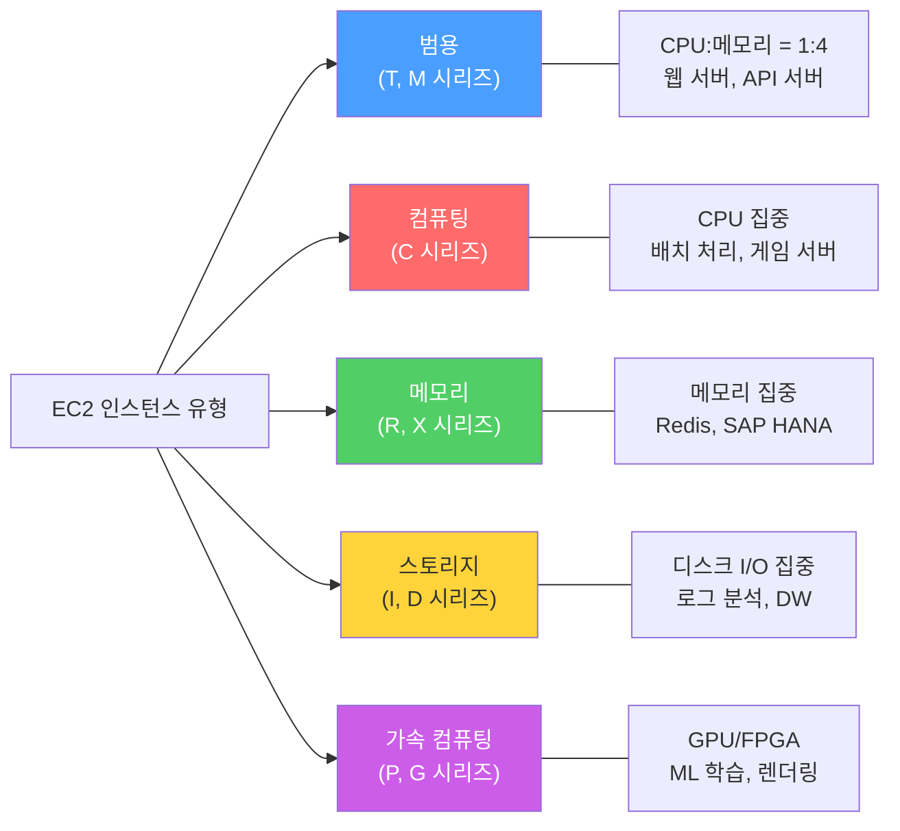
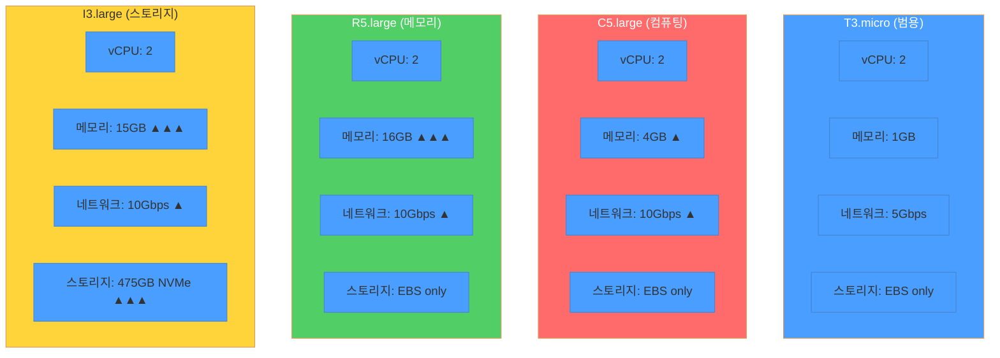
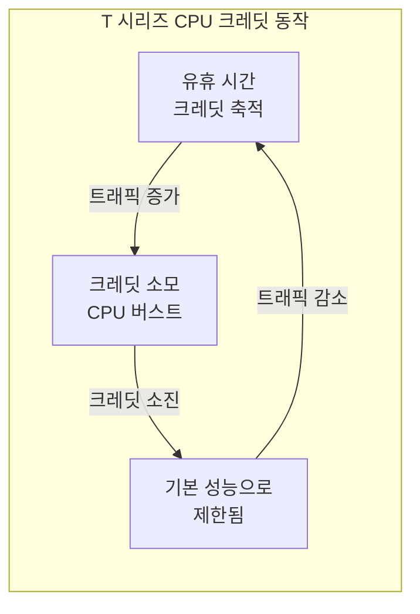
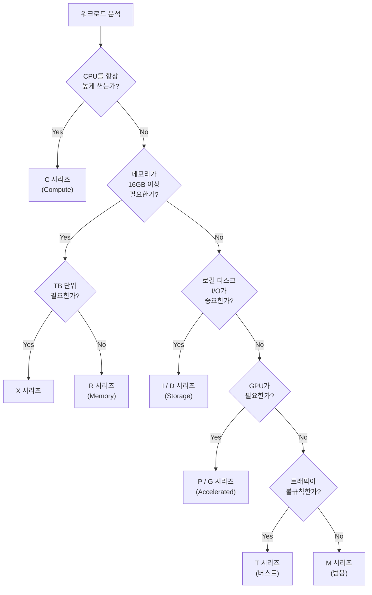
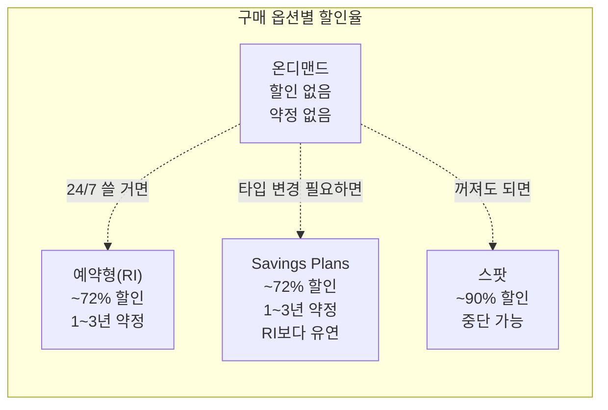
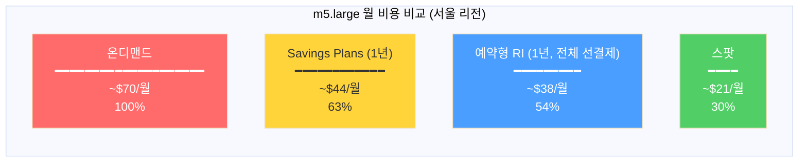
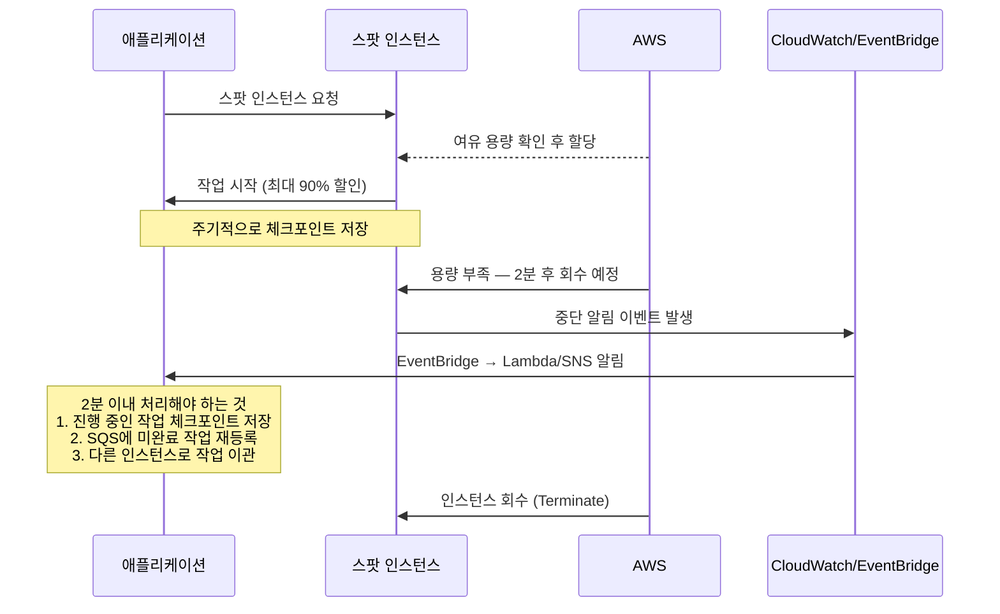
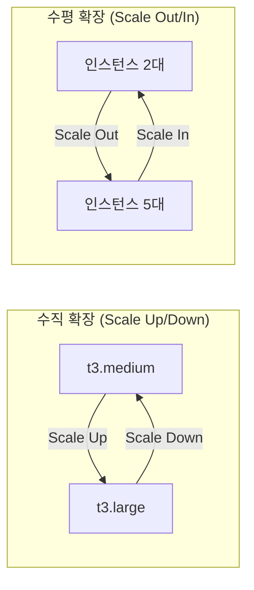
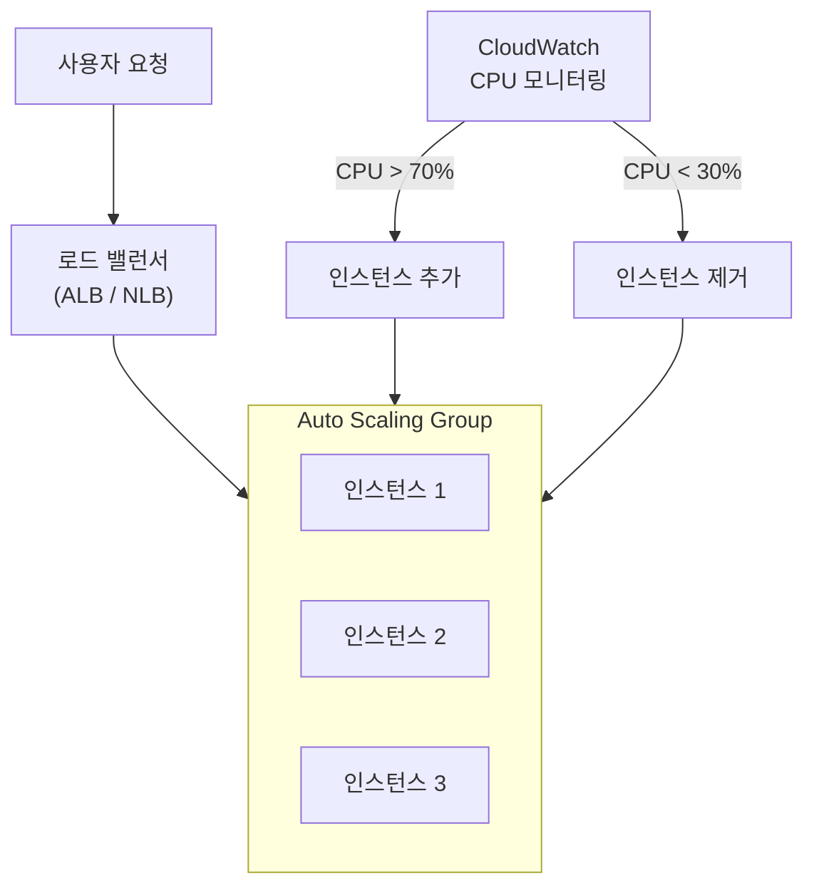
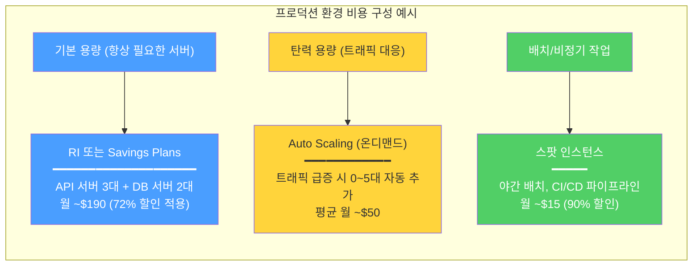

# AWS EC2 인스턴스 유형

## 배경

AWS EC2(Elastic Compute Cloud)는 클라우드에서 가상 서버를 제공하는 서비스다. 워크로드 특성에 따라 여러 인스턴스 유형이 있고, 각각 CPU·메모리·스토리지·네트워크 비율이 다르다.

### EC2를 쓰는 이유
- 트래픽에 따라 서버 수를 늘리거나 줄일 수 있다
- 쓴 만큼만 비용을 낸다
- OS부터 네트워크까지 직접 제어한다
- 물리 서버 관리는 AWS가 한다

### EC2 vs Lambda

| 항목 | EC2 | Lambda |
|------|-----|--------|
| 서버 관리 | 직접 (OS, 패치 등) | AWS가 전부 |
| 실행 방식 | 상시 실행 | 이벤트 트리거 |
| 과금 | 시간/초 단위 | 호출 수 + 실행 시간 |
| 적합한 경우 | 상시 띄워야 하는 API 서버, DB | 간헐적 배치, 웹훅 처리 |

## 핵심

### 인스턴스 유형 분류

EC2 인스턴스는 5가지 카테고리로 나뉜다. 각 카테고리는 CPU·메모리·스토리지·네트워크 중 어디에 리소스를 집중하느냐의 차이다.



| **카테고리** | **리소스 특성** | **주 용도** |
|-------------|---------------|------------|
| 범용 (General Purpose) | CPU, 메모리, 네트워크 균형 | 웹 서버, API 서버 |
| 컴퓨팅 (Compute Optimized) | CPU 집중 | 배치 처리, 게임 서버 |
| 메모리 (Memory Optimized) | RAM 집중 | 인메모리 DB, 캐시 |
| 스토리지 (Storage Optimized) | 디스크 I/O 집중 | 로그 분석, DW |
| 가속 컴퓨팅 (Accelerated Computing) | GPU 또는 FPGA | ML 학습, 렌더링 |

#### 같은 2 vCPU에서 카테고리별 리소스 배분

같은 2 vCPU 인스턴스인데 카테고리에 따라 메모리·스토리지·네트워크 배분이 다르다. 아래 비교를 보면 각 카테고리가 어디에 리소스를 몰아주는지 바로 보인다.



vCPU 2개 기준으로 메모리만 비교해도 차이가 크다. T3는 1GB, C5는 4GB, R5는 16GB다. 같은 CPU 자원에서 메모리가 16배 차이가 난다. 워크로드의 병목이 어디인지에 따라 카테고리를 고르는 이유가 여기 있다.

### 1. 범용 (General Purpose) 인스턴스

CPU, 메모리, 네트워크가 균형 잡힌 유형이다. 특정 리소스를 극단적으로 쓰지 않는 대부분의 워크로드에 맞다.

#### T 시리즈 (버스트 가능한 성능)

T 시리즈의 핵심은 **CPU 크레딧 시스템**이다. 평소에는 기본 성능(baseline)으로 동작하면서 크레딧을 쌓고, 트래픽이 몰리면 쌓아둔 크레딧을 소모해서 CPU를 풀로 쓴다.



**쓰기 좋은 경우:**
- 개발/테스트 환경
- 소규모 웹 서버
- 트래픽이 불규칙한 서비스

**주의할 점:**
- CPU를 항상 높게 쓰는 워크로드에는 맞지 않다
- 크레딧이 바닥나면 성능이 급격히 떨어진다 — CloudWatch에서 `CPUCreditBalance` 지표를 반드시 모니터링해야 한다
- `unlimited` 모드를 켜면 크레딧 소진 후에도 버스트하지만, 초과분에 추가 요금이 붙는다

#### M 시리즈 (일정한 성능)

CPU와 메모리가 1:4 비율로 제공된다. T 시리즈와 달리 버스팅 없이 항상 일정한 성능을 낸다. 프로덕션 환경에서 가장 많이 쓰는 범용 인스턴스다.

**주 용도:** DB 서버, API 서버, 백엔드 서비스

#### 인스턴스 크기와 비용

인스턴스 크기는 nano부터 시작해서 한 단계 올라갈 때마다 리소스와 비용이 대략 2배씩 늘어난다.

```
예시: T3 시리즈 (서울 리전 기준, 온디맨드)
t3.nano    (2 vCPU, 0.5GB RAM) → $3.8/월
t3.micro   (2 vCPU, 1GB RAM)   → $7.5/월  (2배)
t3.small   (2 vCPU, 2GB RAM)   → $15/월   (2배)
t3.medium  (2 vCPU, 4GB RAM)   → $30/월   (2배)
t3.large   (2 vCPU, 8GB RAM)   → $60/월   (2배)
t3.xlarge  (4 vCPU, 16GB RAM)  → $120/월  (2배)
```

**크기 선택 시 참고:**
- 처음에는 넉넉한 사이즈로 시작하고, CloudWatch 메트릭을 보면서 줄여나간다
- 언더 프로비저닝은 장애로 이어질 수 있다 — 오버 프로비저닝보다 더 위험하다
- CPU 사용률, 메모리 사용률을 2주 정도 관찰한 뒤 적정 크기를 판단한다

### 2. 컴퓨팅 (Compute Optimized) 인스턴스

CPU 성능에 리소스를 집중한 유형이다.

#### 주요 시리즈
- **C 시리즈 (C7g, C6g, C5)**: Intel/AMD/Graviton 프로세서 선택 가능

#### 주 용도
- 배치 처리 작업
- 게임 서버 (틱 레이트가 중요한 경우)
- 과학 계산, 영상 인코딩
- 요청당 CPU 연산이 많은 API 서버

### 3. 메모리 (Memory Optimized) 인스턴스

메모리에 리소스를 집중한 유형이다. 데이터를 메모리에 올려놓고 처리하는 워크로드에 쓴다.

#### 주요 시리즈
- **R 시리즈 (R7g, R6g, R5)**: 인메모리 DB, 캐시 서버용
- **X 시리즈 (X2, X1)**: TB 단위 메모리가 필요한 SAP HANA 같은 경우

#### 주 용도
- Redis, Memcached 클러스터
- SAP HANA
- 대용량 데이터셋을 메모리에 올려서 분석하는 경우
- Elasticsearch 데이터 노드

### 4. 스토리지 (Storage Optimized) 인스턴스

로컬 디스크 I/O 성능에 리소스를 집중한 유형이다.

#### 주요 시리즈
- **I 시리즈 (I4i, I3)**: NVMe SSD 기반, 랜덤 I/O가 빠르다
- **D 시리즈 (D3, D2)**: HDD 기반, 대용량 순차 읽기/쓰기에 맞다

#### 주 용도
- HDFS, Kafka 같은 분산 스토리지
- 로그 수집/분석 (Fluentd → Elasticsearch)
- 데이터 웨어하우스
- IOPS가 중요한 자체 관리 DB

### 5. 가속 컴퓨팅 (Accelerated Computing) 인스턴스

GPU 또는 FPGA를 장착한 유형이다. 가격이 비싸기 때문에 GPU가 정말 필요한 워크로드인지 먼저 확인해야 한다.

#### 주요 시리즈
- **P 시리즈 (P5, P4d, P3)**: NVIDIA GPU로 ML 모델 학습
- **G 시리즈 (G5, G4dn)**: 그래픽 렌더링, 추론(inference) 서빙

#### 주 용도
- 딥러닝 모델 학습 (PyTorch, TensorFlow)
- 그래픽 렌더링, 동영상 인코딩
- 추론 서빙 (g4dn이 가성비가 좋다)
- 과학 시뮬레이션

## 예시

### 워크로드별 인스턴스 선택

어떤 인스턴스를 골라야 하는지 감이 안 올 때, 아래 흐름을 따라가면 된다.



#### 웹 애플리케이션 서버
- **인스턴스**: T3 또는 M5 시리즈
- 소규모: t3.micro (월 $7.5)
- 중간 규모: t3.medium (월 $30)
- 대규모: m5.large (월 $70) — 트래픽이 꾸준하면 M 시리즈가 낫다

#### 데이터베이스 서버
- **인스턴스**: R5, R6g 시리즈
- MySQL/PostgreSQL: r5.large (16GB RAM, 월 $90)
- Redis/Memcached: r5.xlarge (32GB RAM, 월 $180)
- SAP HANA: x1e.32xlarge (3.8TB RAM, 월 $26,688)

#### 로그 분석 / 데이터 처리
- **인스턴스**: I3, D2 시리즈
- 로그 분석: i3.large (475GB NVMe SSD, 월 $156)
- 데이터 웨어하우스: d2.xlarge (6TB HDD, 월 $690)

#### 머신러닝/AI
- **인스턴스**: P3, P4, G4 시리즈
- 모델 학습: p3.2xlarge (V100 GPU, 월 $3,060)
- 추론 서빙: g4dn.xlarge (T4 GPU, 월 $526) — 추론만 하면 G 시리즈가 가성비 좋다
- 대규모 학습: p4d.24xlarge (8x A100 GPU, $32.77/시간)

### 인스턴스 구매 옵션

같은 인스턴스라도 구매 방식에 따라 비용 차이가 크다.



#### 1. 온디맨드 (On-Demand)

약정 없이 쓴 만큼 낸다. 초 단위로 과금된다. 트래픽 예측이 안 되거나, 단기 프로젝트, 개발/테스트 환경에 쓴다.

비용 예시: t3.medium 기준 $0.0416/시간

#### 2. 예약형 인스턴스 (Reserved Instances)

1년 또는 3년 약정으로 온디맨드 대비 최대 72% 할인. 인스턴스 패밀리와 가용영역이 고정된다. 선결제, 부분 선결제, 무선결제 옵션이 있고, 선결제할수록 할인율이 높다.

24/7 돌아가는 프로덕션 서버, DB 서버처럼 사용 패턴이 뻔한 경우에 쓴다.

#### 3. Savings Plans

예약형과 할인율은 비슷한데, 시간당 사용량($)으로 약정한다. 인스턴스 패밀리나 크기, 리전을 바꿔도 할인이 적용되기 때문에 예약형보다 유연하다. 인스턴스 타입을 자주 바꾸거나 여러 리전에서 운영하는 경우 예약형 대신 이쪽을 쓴다.

#### 4. 스팟 인스턴스 (Spot Instances)

AWS에서 남는 용량을 최대 90% 할인에 제공한다. 대신 **AWS가 2분 전 알림 후 언제든 회수할 수 있다.**

CI/CD 빌드, 데이터 분석, 렌더링 같은 중단 가능한 작업에 맞다. 스팟을 쓸 때는 여러 인스턴스 타입과 AZ를 섞어서 쓰고, 주기적으로 체크포인트를 저장해야 한다.

#### 구매 옵션 비교

| 옵션 | 할인율 | 약정 | 중단 가능 | 쓰기 좋은 경우 |
|------|--------|------|----------|---------------|
| 온디맨드 | 0% | 없음 | 아니오 | 트래픽 예측 불가, 단기 프로젝트 |
| 예약형 | 최대 72% | 1-3년 | 아니오 | 24/7 프로덕션, DB 서버 |
| Savings Plans | 최대 72% | 1-3년 | 아니오 | 타입 변경이 잦은 장기 운영 |
| 스팟 | 최대 90% | 없음 | 예 | 배치, CI/CD, 렌더링 |

#### 구매 옵션별 월 비용 비교 (m5.large 기준)

같은 m5.large 인스턴스를 1년간 운영한다고 가정하면 구매 옵션에 따라 월 비용이 이렇게 달라진다.



온디맨드 대비 RI 전체 선결제는 46% 절감, 스팟은 70% 절감이다. 다만 스팟은 언제든 회수당할 수 있으니 프로덕션 서버에는 못 쓴다.

#### 스팟 인스턴스 생명주기

스팟 인스턴스는 AWS가 용량을 회수하기 2분 전에 알림을 준다. 이 2분 안에 체크포인트 저장, 작업 이관 등을 처리해야 한다.



스팟을 쓸 때는 반드시 중단 처리 로직을 넣어야 한다. EventBridge 규칙으로 `EC2 Spot Instance Interruption Warning` 이벤트를 잡고, Lambda나 인스턴스 내부 스크립트에서 정리 작업을 돌린다.

### 인스턴스 연결 방법

EC2에 접속하는 방법은 3가지다. 보안 요구사항에 따라 고른다.

#### 1. SSH (Secure Shell)

키 페어 기반 인증으로 22번 포트를 통해 접속한다. 가장 전통적인 방식이다.

```bash
ssh -i "my-key.pem" ec2-user@ec2-xx-xxx-xxx-xxx.compute.amazonaws.com
```

Public IP를 직접 노출하는 건 피해야 한다. Private Subnet에 배치하고 Bastion Host나 VPN을 통해 접근하는 게 맞다. 보안 그룹에서 특정 IP만 허용하는 것도 필수다.

#### 2. EC2 Instance Connect

AWS 콘솔에서 브라우저로 SSH 연결한다. 일회용 키를 자동 생성하기 때문에 키 파일을 관리할 필요가 없다. 다만 퍼블릭 서브넷에서만 되고, 22번 포트를 열어야 한다.

#### 3. Session Manager (프로덕션에서는 이걸 쓴다)

SSM Agent를 통해 접속하기 때문에 22번 포트를 안 열어도 된다. Private Subnet 인스턴스에도 접근 가능하고, 모든 세션이 CloudWatch Logs/S3에 자동 기록된다.

Bastion Host가 필요 없어지기 때문에 관리 포인트가 줄어든다.

```bash
# AWS CLI로 Session Manager 접속
aws ssm start-session --target i-1234567890abcdef0
```

설정 순서:
1. 인스턴스에 SSM Agent 설치 (Amazon Linux는 기본 설치됨)
2. IAM 역할에 `AmazonSSMManagedInstanceCore` 정책 부여
3. Systems Manager 콘솔 → Session Manager에서 접속

#### 연결 방법 비교

| 방법 | 인터넷 필요 | 포트 | 보안 수준 | 감사 로그 |
|------|------------|------|---------|----------|
| SSH | 예 | 22 | 보통 | 수동 설정 필요 |
| Instance Connect | 예 | 22 | 보통 | IAM 기반 |
| Session Manager | 아니오 | 불필요 | 높음 | 자동 저장 |

프로덕션 환경이라면 Session Manager를 쓴다. SSH 키 유출 위험이 없고, 감사 로그가 자동으로 쌓인다.

### Auto Scaling과 로드 밸런싱

#### 수직 확장 vs 수평 확장



**수직 확장 (Scale Up/Down):** 인스턴스 타입을 바꾸는 것. t3.medium → t3.large처럼. 인스턴스를 중지해야 타입을 변경할 수 있기 때문에 다운타임이 생긴다. 단일 인스턴스의 성능 한계도 있다.

**수평 확장 (Scale Out/In):** 인스턴스 수를 늘리거나 줄이는 것. 무중단으로 확장할 수 있고, 이론적으로 제한이 없다.

#### Auto Scaling 동작 방식

CloudWatch 메트릭을 기반으로 인스턴스를 자동으로 추가/제거한다.

**구성 요소:**

1. **Launch Template** — 새 인스턴스를 만들 때 쓸 설정(AMI, 인스턴스 타입, 보안 그룹 등)을 정의한다. 버전 관리가 된다.
2. **Auto Scaling Group** — 최소/희망/최대 인스턴스 수를 설정하고, 헬스 체크와 스케일링 정책을 정의한다.
3. **Scaling Policy** — 언제 늘리고 줄일지 규칙을 정한다.
   - Target Tracking: CPU 50% 유지 같은 목표값 설정
   - Step Scaling: CPU 70%면 1대, 90%면 2대 추가 같은 단계별 설정
   - Scheduled Scaling: 평일 오전 9시에 미리 인스턴스를 늘려놓는 시간 기반 설정

**로드 밸런서와 연동 흐름:**



동작 순서:
1. 로드 밸런서가 트래픽을 인스턴스에 분산한다
2. CloudWatch가 평균 CPU 사용률을 모니터링한다
3. CPU 70% 초과 시 Auto Scaling이 Launch Template 기반으로 새 인스턴스를 만든다
4. 새 인스턴스가 헬스 체크를 통과하면 로드 밸런서가 트래픽을 보내기 시작한다
5. CPU 30% 미만이 지속되면 Auto Scaling이 인스턴스를 제거한다

### AWS 운영 지원 서비스

#### AWS 빌드업 프로그램
- 초기 AWS 도입 시 아키텍처 설계 지원
- AWS에서 직접 기술 검토를 해준다

#### MSP (Managed Service Provider)
- AWS 환경의 운영을 외부 업체에 맡기는 것
- 24/7 모니터링, 장애 대응, 비용 관리를 대행한다

내부에 AWS를 잘 아는 인력이 없거나, 서비스가 멈추면 안 되는데 직접 운영할 여건이 안 될 때 쓴다.

### 비용 줄이는 방법

비용은 구매 옵션과 Auto Scaling 조합으로 관리한다.

- **Reserved Instances / Savings Plans**: 24/7 돌아가는 서버에 적용. 1년 약정으로 ~40%, 3년 약정으로 ~72% 할인
- **Spot Instances**: 배치, CI/CD, 개발 환경에 적용. 최대 90% 할인이지만 언제든 회수당할 수 있다
- **Auto Scaling**: 트래픽에 따라 인스턴스 수를 자동으로 조절해서 유휴 리소스 비용을 줄인다

#### 실제 환경의 구매 옵션 조합

프로덕션 환경에서는 하나의 구매 옵션만 쓰는 경우가 거의 없다. 워크로드 특성에 따라 섞어 쓴다.



온디맨드만 쓰면 월 $670 정도 나올 구성이 위 조합으로 $255 정도로 줄어든다. 핵심은 워크로드별 사용 패턴을 파악하고, 24/7 서버에는 RI/SP를, 가변 트래픽에는 Auto Scaling을, 중단 가능한 작업에는 스팟을 배정하는 것이다.

## 운영 팁

### 성능 모니터링

CloudWatch에서 아래 지표를 보고 인스턴스 타입을 조정한다.

| 지표 | 기준 | 대응 |
|------|------|------|
| CPU 사용률 | 80% 이상 지속 | 인스턴스 타입 업그레이드 또는 Scale Out |
| 메모리 사용률 | 80% 이상 지속 | R 시리즈로 변경 검토 |
| 네트워크 I/O | 대역폭 한계 도달 | 더 큰 인스턴스 (네트워크 대역폭은 인스턴스 크기에 비례) |
| 디스크 I/O | IOPS 한계 도달 | I 시리즈로 변경 또는 EBS 타입 변경 |

메모리 사용률은 CloudWatch 기본 지표에 없다. CloudWatch Agent를 설치해야 수집된다.

### 보안

#### 네트워크
- 보안 그룹에서 필요한 포트만 연다 — 0.0.0.0/0으로 22번 포트를 여는 건 피한다
- 프로덕션 서버는 Private Subnet에 배치한다
- NACL로 서브넷 레벨에서 한 번 더 제어한다

#### 인스턴스
- IAM 역할은 인스턴스별로 최소 권한만 부여한다
- OS 패치는 Systems Manager Patch Manager로 자동화한다
- EBS 볼륨 암호화는 기본으로 켠다 (계정 수준에서 기본 암호화 설정 가능)
- CloudTrail, GuardDuty로 이상 행위를 탐지한다

## 참고

### 인스턴스 유형별 상세 사양

카테고리별 대표 인스턴스 사양을 비교하면 어디에 리소스가 집중되어 있는지 감이 온다.

| 시리즈 | vCPU | 메모리 | 네트워크 | 스토리지 | 특성 |
|--------|------|--------|----------|----------|------|
| T3.micro | 2 | 1GB | 최대 5 Gbps | EBS only | 버스트 가능, 가격이 싸다 |
| C5.large | 2 | 4GB | 최대 10 Gbps | EBS only | CPU 집중, 메모리는 적다 |
| R5.large | 2 | 16GB | 최대 10 Gbps | EBS only | 같은 vCPU인데 메모리가 4배 |
| I3.large | 2 | 15GB | 최대 10 Gbps | 475GB NVMe SSD | 로컬 NVMe SSD가 붙는다 |
| G4dn.xlarge | 4 | 16GB | 최대 25 Gbps | 125GB NVMe SSD | NVIDIA T4 GPU 포함 |

### 정리

인스턴스를 고를 때 핵심은 워크로드의 병목이 어디인지 파악하는 것이다. CPU인지, 메모리인지, 디스크 I/O인지, GPU인지. 병목에 맞는 카테고리를 고르고, 크기는 CloudWatch 메트릭을 2주 정도 보면서 조정한다.

구매 옵션은 섞어 쓰는 게 현실적이다. 24/7 서버는 RI나 Savings Plans로, 배치/CI는 스팟으로, 트래픽 대응은 Auto Scaling으로 처리한다. 처음부터 완벽하게 맞출 필요 없다 — 일단 온디맨드로 띄우고, 패턴이 보이면 구매 옵션을 바꾸면 된다.

## 참조

- [AWS EC2 인스턴스 유형](https://aws.amazon.com/ec2/instance-types/)
- [AWS EC2 가격 정책](https://aws.amazon.com/ec2/pricing/)
- [AWS Well-Architected Framework](https://aws.amazon.com/architecture/well-architected/)
- [AWS EC2 사용자 가이드](https://docs.aws.amazon.com/ec2/)
- [AWS CloudWatch 모니터링 가이드](https://docs.aws.amazon.com/cloudwatch/)
- [AWS 보안 권장사항](https://aws.amazon.com/security/security-resources/)


