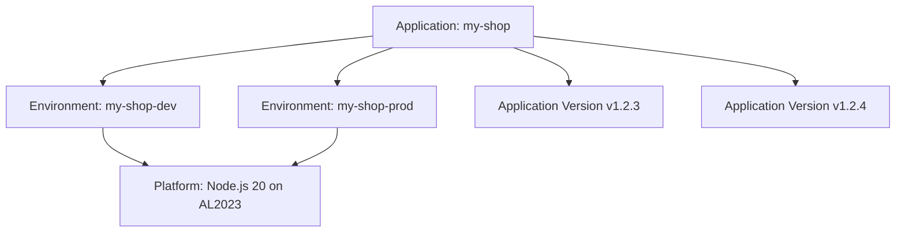
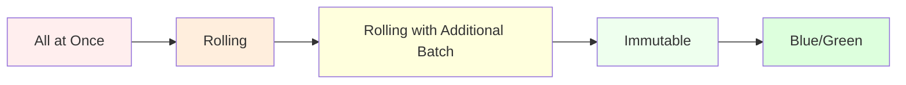
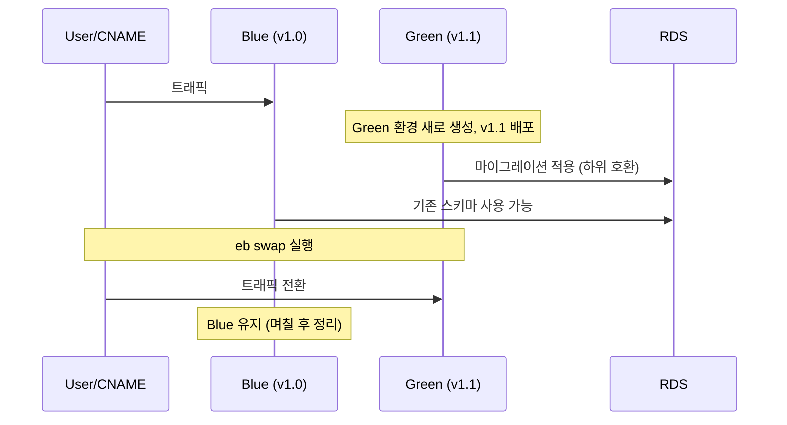

# AWS Elastic Beanstalk

## 개요

AWS Elastic Beanstalk(이하 EB)는 코드를 업로드하면 EC2, ALB, Auto Scaling Group, CloudWatch까지 한 번에 묶어 띄워주는 PaaS다. 내부적으로는 CloudFormation 스택을 생성해서 리소스를 프로비저닝하고, 그 위에 EB Agent와 nginx/Tomcat 같은 프록시를 얹어 두는 구조다.

직접 EC2 위에 인프라를 쌓는 것과 비교했을 때 차이는 "AWS가 어디까지 만들어 주느냐"다. EB는 OS, 런타임, 프록시, 로드밸런서, 헬스 체크까지 만들어 두고 그 위에 zip을 풀어 실행한다. 대신 그만큼 추상화 계층이 끼어 있어서, 문제가 생기면 어느 계층에서 뭐가 도는지 알아야 한다. 이 문서는 그 계층을 다룬다.

EB가 잘 맞는 경우는 정해져 있다. 모놀리식 웹 서비스를 그냥 프레임워크 기본 구조 그대로 띄우고 싶을 때, DevOps 인력이 없어서 ECS Task Definition까지 직접 작성할 여유가 없을 때, 그리고 사내 표준이 EB로 굳어져 있을 때 정도다. 컨테이너 오케스트레이션이 필요하거나 트래픽 패턴이 특이하면 ECS/EKS나 Lambda가 더 맞다.

### 다른 서비스와의 차이

EC2 직접 운영과 비교하면 EB는 인프라 코드와 패치를 AWS가 대신 관리해 준다. 단점은 nginx 설정 한 줄 바꾸려고 해도 `.ebextensions`나 `.platform/nginx`를 거쳐야 한다는 점이다. SSH로 접속해서 직접 수정하면 다음 배포 때 덮어 써진다.

ECS/EKS와 비교하면 EB는 "한 인스턴스에 한 애플리케이션"이라는 모델을 전제로 한다. 컨테이너 여러 개를 한 인스턴스에 띄우려고 Multi-Container Docker 플랫폼을 쓸 수 있긴 한데, 2026년 현재 ECS 기반의 그 옵션은 사실상 권장되지 않는다. 마이크로서비스를 쪼개서 운영할 거라면 ECS Fargate가 자연스럽다.

Lambda와 비교하면 EB는 항상 떠 있는 서버 모델이다. 콜드 스타트가 없고 상태 유지가 가능한 대신, 트래픽이 거의 없는 시간대에도 인스턴스 비용이 나간다. 이벤트 기반이거나 호출 빈도가 낮은 워크로드는 Lambda가 낫다.

## 핵심 개념

EB의 리소스 계층은 Application — Environment — Application Version — Platform 네 가지로 구성된다.



Application은 프로젝트 단위 컨테이너고 한 번 만들면 거의 건드릴 일이 없다. 실제 작업은 Environment에서 이루어진다. Environment는 EC2 인스턴스, ALB, ASG가 실제로 살아 있는 단위이며, dev/staging/prod 같은 단계별로 분리해서 만든다.

Application Version은 S3에 올라간 zip 한 덩이다. EB CLI로 `eb deploy`를 하면 zip이 S3 `elasticbeanstalk-<region>-<account>` 버킷에 올라가면서 새 Version이 생기고, 이걸 Environment에 적용해야 실제 인스턴스에 코드가 깔린다. 버전은 기본적으로 모두 보관되는데, 그대로 두면 S3 비용이 누적되니 Application Version Lifecycle Policy로 "최대 200개 유지, 90일 경과분 삭제, 사용 중인 버전은 제외" 정도로 잡아 둔다.

Platform은 OS + 런타임 + 프록시 조합이다. 같은 Node.js라도 "Node.js 20 running on 64bit Amazon Linux 2023"과 "Node.js 18 running on 64bit Amazon Linux 2"는 별개 플랫폼이고, 마이너 버전이 올라가도 호환되지 않는 변경이 종종 들어온다. 플랫폼 업데이트는 Managed Updates를 켜 두면 정해진 시간에 자동으로 진행된다.

Environment에는 Web Server와 Worker 두 종류가 있다. Web Server는 ALB/CLB로 HTTP 트래픽을 받고, Worker는 SQS 큐를 폴링하는 데몬(`aws-sqsd`)이 메시지를 꺼내서 인스턴스의 로컬 HTTP 엔드포인트로 POST한다. 이미지 처리, 메일 전송 같은 비동기 작업을 Web 환경과 분리할 때 쓴다.

## .ebextensions 설정

`.ebextensions/`는 프로젝트 루트에 두는 디렉터리이고 zip 안에 함께 들어가야 EB가 읽는다. 안에 `*.config` YAML 파일을 두면 인스턴스 프로비저닝 시점에 이 설정대로 OS 패키지 설치, 파일 배치, 명령 실행, 환경 옵션 변경이 일어난다.

대표적으로 쓰는 섹션은 `packages`, `files`, `container_commands`, `option_settings` 네 개다.

### packages — OS 패키지 설치

```yaml
# .ebextensions/01_packages.config
packages:
  yum:
    git: []
    htop: []
    jq: []
    ImageMagick: []
```

yum 외에 `rpm`, `python`, `rubygems` 같은 키도 있다. 빈 배열은 "버전 지정 없이 최신"이라는 뜻이다. 특정 버전이 필요하면 `git: "2.40.1"`처럼 적는다. AL2023 플랫폼에서는 `dnf`가 기본이지만 EB가 yum을 alias로 처리해 준다.

### files — 파일 배치

```yaml
# .ebextensions/02_files.config
files:
  "/etc/nginx/conf.d/proxy.conf":
    mode: "000644"
    owner: root
    group: root
    content: |
      client_max_body_size 50M;
      proxy_read_timeout 120s;

  "/opt/elasticbeanstalk/tasks/bundlelogs.d/app.conf":
    mode: "000644"
    owner: root
    group: root
    content: |
      /var/app/current/logs/*.log
```

nginx 설정을 바꾸려고 자주 쓴다. 두 번째 예시는 "Request Logs - Last 100 lines"나 "Full Logs"를 받을 때 EB가 어떤 파일을 같이 묶어 줄지 지정한다. AL2023 플랫폼은 nginx 설정을 `.platform/nginx/conf.d/`로 분리하는 경우가 더 깔끔하다(아래에서 다룬다).

### container_commands — 배포 직전 실행

```yaml
# .ebextensions/03_commands.config
container_commands:
  01_migrate:
    command: "python manage.py migrate --noinput"
    leader_only: true
  02_collectstatic:
    command: "python manage.py collectstatic --noinput"
  03_chown_logs:
    command: "chown -R webapp:webapp /var/app/current/logs"
    test: "test -d /var/app/current/logs"
```

`container_commands`는 애플리케이션이 풀린 후, 웹 서버가 트래픽을 받기 전에 실행된다. `commands` 섹션도 있는데 그건 애플리케이션이 풀리기 전에 실행되니 마이그레이션 같은 건 반드시 `container_commands`에 둔다.

`leader_only: true`는 ASG 안에서 한 인스턴스에서만 실행한다는 뜻이다. DB 마이그레이션처럼 동시에 여러 번 돌면 안 되는 작업에 필수다. 단, 이건 신규 환경 생성과 배포에서만 동작하고 Auto Scaling으로 인스턴스가 새로 떠서 부트할 때는 동작하지 않는다. 부트 때마다 마이그레이션을 돌리면 안 된다는 점을 역이용한 설계다.

### option_settings — 환경 옵션

```yaml
# .ebextensions/04_options.config
option_settings:
  aws:elasticbeanstalk:application:environment:
    NODE_ENV: production
    LOG_LEVEL: info
  aws:autoscaling:asg:
    MinSize: 2
    MaxSize: 6
  aws:elasticbeanstalk:environment:
    EnvironmentType: LoadBalanced
    LoadBalancerType: application
  aws:elasticbeanstalk:healthreporting:system:
    SystemType: enhanced
  aws:elb:listener:443:
    ListenerProtocol: HTTPS
    SSLCertificateId: arn:aws:acm:ap-northeast-2:111122223333:certificate/xxx
    InstancePort: 80
```

콘솔에서 누를 수 있는 거의 모든 옵션이 namespace로 노출돼 있다. 앞에 `aws:elasticbeanstalk:application:environment:`로 시작하는 키는 환경 변수다. 콘솔 Configuration에서 직접 잡을 수도 있지만, 코드 저장소에 같이 두면 어떤 환경이 어떤 변수를 갖는지 git에서 추적된다.

### .platform 디렉터리

AL2/AL2023 플랫폼에서는 `.platform/`이라는 디렉터리도 함께 인식된다. nginx 설정을 직접 덮어 쓸 때 이쪽이 더 깔끔하다.

```
.platform/
├── nginx/
│   └── conf.d/
│       └── proxy.conf
└── hooks/
    ├── prebuild/
    │   └── 01_install_deps.sh
    ├── predeploy/
    │   └── 02_warm_cache.sh
    └── postdeploy/
        └── 03_notify_slack.sh
```

`hooks/` 아래의 스크립트는 실행 권한(`chmod +x`)이 필요하다. 권한이 빠지면 배포가 조용히 실패하니 zip을 만들 때 확인해야 한다.

## EB CLI

콘솔로도 다 할 수 있지만 실무에서는 `eb` CLI를 쓴다. 설치는 `pip install awsebcli`나 `brew install aws-elasticbeanstalk`다.

```bash
# 프로젝트 루트에서 한 번만
eb init my-shop --region ap-northeast-2 --platform "Node.js 20 running on 64bit Amazon Linux 2023"

# 새 환경 생성
eb create my-shop-prod \
  --instance-type t3.small \
  --min-instances 2 \
  --max-instances 6 \
  --vpc.id vpc-0abc \
  --vpc.ec2subnets subnet-0aaa,subnet-0bbb \
  --vpc.elbsubnets subnet-0ccc,subnet-0ddd \
  --vpc.securitygroups sg-0app,sg-0db \
  --elb-type application

# 현재 작업 중인 환경 변경
eb use my-shop-prod

# 배포 (현재 git 커밋의 zip을 만들어 업로드)
eb deploy

# 배포 직전 코드만 검사하고 싶다면
eb deploy --staged   # git stage된 변경분만 포함

# 환경 상태 보기
eb status
eb health            # Enhanced Health 상세
eb events -f         # CloudWatch처럼 이벤트 스트림

# 로그
eb logs              # 마지막 100줄 (인스턴스별로 모아서 출력)
eb logs --all        # 전체 로그를 S3에 업로드해서 다운로드
eb logs --stream     # CloudWatch Logs로 스트리밍 시작

# 인스턴스 SSH 접속
eb ssh               # 단일 인스턴스면 바로, 여러 대면 선택 메뉴

# 환경 종료
eb terminate my-shop-prod
```

`eb init` 결과로 `.elasticbeanstalk/config.yml`이 생성되는데, 이 파일은 git에 올려도 된다. 단, 같은 파일에 들어가는 `default_ec2_keyname` 같은 사람별 설정은 `eb init -i`로 매번 잡지 말고 `BRANCH:` 섹션 아래로 분리하거나 `.gitignore`로 빼는 편이 충돌이 적다.

`eb deploy`는 현재 git 커밋을 기준으로 zip을 만든다. 따라서 변경분이 커밋되어 있지 않으면 반영되지 않는다. WIP 상태로 빠르게 테스트하고 싶다면 `eb deploy --staged`나 `git add` 후 `eb deploy`를 쓴다. 커밋을 만들지 않고 작업 트리 그대로 올리려면 `.elasticbeanstalk/config.yml`에 `deploy.artifact: dist/app.zip`을 잡고 자체 빌드 산출물을 지정하는 방법도 있다.

## 환경 변수와 Secrets Manager/Parameter Store

EB에서 환경 변수를 잡는 가장 단순한 방법은 `option_settings`나 콘솔의 Configuration → Software → Environment properties다. 이 값은 `/opt/elasticbeanstalk/deployment/env`(AL2023)에 평문으로 저장되고, 애플리케이션 프로세스에 환경 변수로 주입된다.

문제는 이게 평문이라는 점이다. `eb printenv`로도 보이고, IAM에서 `elasticbeanstalk:DescribeConfigurationSettings` 권한만 있으면 누구나 읽을 수 있다. 비밀번호, API Key, JWT secret 같은 민감 정보는 Secrets Manager나 Systems Manager Parameter Store로 빼야 한다.

가장 흔한 방법은 EB 환경 변수에는 "비밀의 ARN이나 이름"만 두고, 애플리케이션이 부팅 시점에 SDK로 읽어 들이는 방식이다.

```typescript
// app.ts (Node.js 예시)
import { SecretsManagerClient, GetSecretValueCommand } from "@aws-sdk/client-secrets-manager";

const client = new SecretsManagerClient({});
const arn = process.env.DB_SECRET_ARN!;

const res = await client.send(new GetSecretValueCommand({ SecretId: arn }));
const secret = JSON.parse(res.SecretString!);
process.env.DB_PASSWORD = secret.password;
```

EC2 instance profile에 `secretsmanager:GetSecretValue`나 `ssm:GetParameter*` 권한이 붙어 있어야 한다(아래 IAM 절 참고). 비밀이 회전될 때 인스턴스가 자동으로 다시 읽지는 않으므로, 회전 후에는 `eb deploy`로 새 인스턴스를 굴려 주거나 애플리케이션 안에 캐시 만료 로직을 둔다.

`.ebextensions`에서 부팅 시점에 Parameter Store 값을 읽어 환경 파일을 만드는 방법도 있다. 다만 이 방식은 cold-deploy 단계에서 권한 문제가 생기면 디버깅이 까다로워서, 어플리케이션 코드 안에서 SDK로 처리하는 쪽이 추적이 쉽다.

## Saved Configuration으로 환경 복제

dev 환경에서 잘 굴러가던 옵션 묶음을 staging에 그대로 복사하고 싶을 때 쓴다.

```bash
# dev 환경의 현재 설정을 저장
eb config save my-shop-dev --cfg dev-baseline-2026-04

# 다른 환경에서 그 설정을 적용
eb create my-shop-staging --cfg dev-baseline-2026-04
# 또는 기존 환경에 적용
eb config put dev-baseline-2026-04
eb config my-shop-staging --cfg dev-baseline-2026-04
```

저장된 Configuration은 S3 `elasticbeanstalk-<region>-<account>/resources/templates/<app>/`에 YAML로 들어간다. git에서 관리하고 싶으면 `.elasticbeanstalk/saved_configs/<name>.cfg.yml`에 두면 `eb config put` 시 그쪽이 우선된다.

이 방식으로 하면 콘솔에서 손으로 클릭한 설정이 코드처럼 추적된다. 다만 저장된 Configuration은 특정 플랫폼 버전에 묶이므로, 플랫폼이 deprecated되면 그대로는 쓸 수 없다. 새 플랫폼으로 옮길 때는 한 번 export해서 옵션을 손본다.

## Enhanced Health Reporting

EB의 헬스 리포팅에는 Basic과 Enhanced 두 종류가 있다. Basic은 ELB 헬스 체크 결과만 보지만, Enhanced는 EB Agent가 인스턴스에서 CPU, 메모리, 응답 코드 분포, 4xx/5xx 비율, 배포 상태까지 수집해서 색깔(Green/Yellow/Red/Severe/Unknown)로 종합 판정해 준다. 프로덕션은 항상 Enhanced로 켜 둔다.

```yaml
option_settings:
  aws:elasticbeanstalk:healthreporting:system:
    SystemType: enhanced
  aws:elasticbeanstalk:application:
    Application Healthcheck URL: /healthz
  aws:elasticbeanstalk:environment:process:default:
    HealthCheckPath: /healthz
    HealthCheckInterval: '15'
    HealthyThresholdCount: '3'
    UnhealthyThresholdCount: '5'
    MatcherHTTPCode: '200'
```

`Application Healthcheck URL`은 EB Agent가 인스턴스 내부에서 호출하는 경로이고, `aws:elasticbeanstalk:environment:process:default:` 아래 옵션은 ALB Target Group 헬스 체크를 의미한다. 둘 다 `/healthz` 같은 가벼운 엔드포인트를 따로 두고 DB ping은 빼는 편이 안전하다. DB 일시 장애로 헬스 체크가 빨갛게 변하면 ASG가 정상 인스턴스를 종료시키는 사고가 생긴다.

Severe 상태가 뜨는 가장 흔한 원인은 5xx 비율이 임계치를 넘었거나, 인스턴스 절반 이상이 ELB OutOfService 상태이거나, 배포 중 새 인스턴스가 헬스 체크를 통과하지 못해 ASG가 계속 인스턴스를 새로 만들고 있는 경우다. `eb health --refresh`로 인스턴스별 응답 코드 분포를 보면 어느 인스턴스에서 5xx가 나오는지 잡힌다.

## 로그 수집

EB는 로그를 두 가지 방식으로 노출한다. 콘솔에서 "Request Logs - Last 100 Lines"를 누르면 그 시점에 인스턴스의 주요 로그를 묶어 S3에 올리고 다운로드 링크를 준다. "Full Logs"는 더 많은 파일을 묶는다. CLI로는 `eb logs`가 같은 동작을 한다.

장기 보관과 검색을 하려면 CloudWatch Logs Streaming을 켠다.

```yaml
option_settings:
  aws:elasticbeanstalk:cloudwatch:logs:
    StreamLogs: true
    DeleteOnTerminate: false
    RetentionInDays: 30
  aws:elasticbeanstalk:cloudwatch:logs:health:
    HealthStreamingEnabled: true
    DeleteOnTerminate: false
    RetentionInDays: 30
```

이걸 켜면 로그 그룹이 자동 생성된다. 그룹 이름은 `/aws/elasticbeanstalk/<env-name>/var/log/<file>` 패턴이다. `DeleteOnTerminate: false`로 두지 않으면 환경을 종료할 때 같이 삭제돼서 사후 분석을 못 한다.

자주 보는 로그 위치는 외워 두는 편이 빠르다.

| 로그 | 경로 (AL2023 기준) | 용도 |
| --- | --- | --- |
| `eb-engine.log` | `/var/log/eb-engine.log` | 배포 엔진 동작 — 의존성 설치, 훅 실행, 마이그레이션 결과 |
| `eb-hooks.log` | `/var/log/eb-hooks.log` | `.platform/hooks/`의 prebuild/predeploy/postdeploy 출력 |
| `cfn-init.log` | `/var/log/cfn-init.log` | CloudFormation init 단계, `.ebextensions` files/packages |
| `nginx/access.log` | `/var/log/nginx/access.log` | 프록시 액세스 로그 |
| `nginx/error.log` | `/var/log/nginx/error.log` | 502/504 원인 추적할 때 첫 후보 |
| 애플리케이션 stdout | `/var/log/web.stdout.log` | Procfile로 띄운 프로세스의 표준 출력 |

AL2 플랫폼에서는 `eb-activity.log`였는데 AL2023부터는 `eb-engine.log`로 통합됐다. 오래된 자료에서 `eb-activity.log`가 안 보인다고 당황할 일이 생긴다.

## IAM — Instance Profile과 Service Role

EB 환경에는 두 종류의 IAM 역할이 붙는다.

**EC2 instance profile** — EC2 인스턴스가 어떤 AWS API를 호출할 수 있는지 결정한다. 애플리케이션 코드가 SDK로 S3나 Secrets Manager를 부를 때 쓰는 권한이 여기다. 기본 이름은 `aws-elasticbeanstalk-ec2-role`이고 `AWSElasticBeanstalkWebTier`(또는 Worker Tier) 매니지드 정책이 붙는다. 이 정책에는 zip 다운로드용 S3 권한, CloudWatch Logs 푸시 권한 정도만 들어 있다. 애플리케이션이 추가로 필요한 권한(예: 특정 버킷 읽기, Secrets Manager 접근)은 별도 정책을 만들어서 같은 역할에 붙인다.

**Service Role** — EB 자체가 환경을 관리할 때 쓴다. ASG 조정, 헬스 체크 수행, 배포 진행 같은 것이다. 기본은 `aws-elasticbeanstalk-service-role`이고 `AWSElasticBeanstalkEnhancedHealth` 등이 붙는다. 이 역할에 권한이 부족하면 환경이 통째로 만들어지지 않거나 Enhanced Health가 Unknown 상태에 머문다. 애플리케이션 권한을 여기에 붙이면 안 된다(애플리케이션은 EC2 instance profile을 본다).

```yaml
option_settings:
  aws:autoscaling:launchconfiguration:
    IamInstanceProfile: my-shop-ec2-profile
  aws:elasticbeanstalk:environment:
    ServiceRole: arn:aws:iam::111122223333:role/my-shop-eb-service-role
```

콘솔에서 만들면 자동으로 생성되지만 Terraform이나 CloudFormation으로 환경을 관리하면 두 역할을 직접 만들고 위 옵션으로 연결해야 한다. 자주 빼먹는 권한이 `secretsmanager:GetSecretValue`(애플리케이션용)와 `cloudwatch:PutMetricData`(Enhanced Health용)다.

## VPC 설정과 RDS 연동

기본값으로 환경을 만들면 EC2 인스턴스가 퍼블릭 서브넷에 들어가고 퍼블릭 IP를 갖는다. 외부에서 SSH가 가능하다는 뜻이고, 운영 환경에서는 거의 항상 끄고 싶을 만한 설정이다.

권장 구성은 ALB만 퍼블릭 서브넷에 두고 EC2는 프라이빗 서브넷에 넣는 형태다.

```yaml
option_settings:
  aws:ec2:vpc:
    VPCId: vpc-0abc
    Subnets: subnet-private-a,subnet-private-c        # EC2 인스턴스용
    ELBSubnets: subnet-public-a,subnet-public-c       # ALB용
    ELBScheme: public
    AssociatePublicIpAddress: 'false'
  aws:autoscaling:launchconfiguration:
    SecurityGroups: sg-app
    EC2KeyName: my-key
```

프라이빗 서브넷에서 인스턴스가 외부 인터넷에 나가야 하면(패키지 다운로드, S3 VPC endpoint가 없다면 EB zip 다운로드까지) NAT Gateway가 필요하다. NAT Gateway가 없는 VPC에 환경을 만들면 부트 단계에서 패키지 설치가 무한정 걸리다 실패한다.

RDS는 EB에서 직접 만들 수도 있지만 권장하지 않는다. EB가 만든 RDS는 환경에 묶여서 환경을 종료할 때 함께 삭제된다. 운영 데이터베이스라면 RDS를 별도로 만들고 보안 그룹만 EB EC2 SG에서 5432/3306 포트를 허용하는 식으로 연결한다. EB 환경 변수로 RDS 엔드포인트와 시크릿 ARN을 넘기면 된다.

## Docker 플랫폼

`Dockerfile`을 프로젝트 루트에 두면 EB의 Docker 플랫폼이 인식한다. 이미지를 외부 레지스트리(ECR 등)에서 가져오고 싶으면 `Dockerrun.aws.json`을 둔다.

```json
{
  "AWSEBDockerrunVersion": "1",
  "Image": {
    "Name": "111122223333.dkr.ecr.ap-northeast-2.amazonaws.com/my-shop:1.4.2",
    "Update": "true"
  },
  "Ports": [
    { "ContainerPort": 8080, "HostPort": 80 }
  ],
  "Volumes": [
    { "HostDirectory": "/var/app/current/uploads", "ContainerDirectory": "/app/uploads" }
  ],
  "Logging": "/var/log/nginx"
}
```

ECR에서 이미지를 받으려면 EC2 instance profile에 `AmazonEC2ContainerRegistryReadOnly`가 붙어 있어야 한다. private repo인데 권한이 빠지면 부트 시 `denied: requested access to the resource is denied`가 `eb-engine.log`에 찍힌다.

Multi-Container Docker 플랫폼(`Dockerrun.aws.json` v2, ECS 기반)은 한 인스턴스에서 여러 컨테이너를 같이 띄우는 방식이지만 2026년 기준으로는 deprecated 경로다. 여러 컨테이너를 같이 운영해야 한다면 ECS Fargate로 옮기는 편이 낫다. 단일 컨테이너 플랫폼은 여전히 잘 동작하고, "이미지를 EB가 떠 있는 인스턴스에 한 개만 띄운다"는 단순한 모델이라 디버깅이 쉽다.

## Procfile과 Buildfile

플랫폼이 자체적으로 띄우는 방식이 마음에 들지 않거나, 한 zip 안에서 여러 프로세스를 띄우고 싶을 때 `Procfile`을 둔다.

```
# Procfile
web: node dist/server.js
worker: node dist/worker.js
```

첫 번째 프로세스(`web`)에 EB가 nginx 트래픽을 보낸다. 나머지는 그냥 백그라운드로 돈다. 각 프로세스 stdout/stderr는 `/var/log/<name>.stdout.log`로 남는다.

Buildfile은 빌드 단계에서 한 번 실행할 명령을 적는 용도다.

```
# Buildfile
make: ./scripts/build.sh
```

`Buildfile`은 `eb-engine.log`에 출력이 찍히고, 한 번이라도 0이 아닌 종료 코드를 반환하면 배포가 실패한다. TypeScript 컴파일이나 webpack 빌드를 여기서 돌릴 수 있는데, 보통은 CI에서 빌드한 산출물을 zip에 넣어 올리는 편이 인스턴스 수만큼 중복 빌드를 안 해서 빠르다.

## Worker Environment와 cron.yaml

Worker 환경은 SQS 큐를 폴링하는 사이드카(`aws-sqsd`)가 같이 돈다. 메시지가 들어오면 데몬이 인스턴스 로컬의 HTTP 엔드포인트(기본 `http://localhost/`)로 POST한다. 즉, Worker 환경이라고 해서 따로 코드 모델을 쓸 필요는 없고 일반 HTTP 핸들러를 만들면 된다.

정기 작업은 `cron.yaml`로 잡는다.

```yaml
# cron.yaml — 프로젝트 루트
version: 1
cron:
  - name: "daily-report"
    url: "/jobs/daily-report"
    schedule: "0 18 * * *"            # 매일 18:00 UTC
  - name: "cleanup"
    url: "/jobs/cleanup"
    schedule: "*/15 * * * *"          # 15분마다
```

스케줄러가 정해진 시간에 SQS에 메시지를 넣고, 데몬이 그걸 꺼내 해당 URL로 POST한다. 같은 시각에 인스턴스가 여러 대여도 한 번만 트리거되도록 EB가 leader election을 처리해 준다. 단, 작업 자체의 멱등성은 코드에서 보장해야 한다. 데몬이 메시지를 처리하다 인스턴스가 죽으면 SQS가 메시지를 재전달한다.

스케줄 표현은 cron 5필드(분 시 일 월 요일)이고 시간대는 UTC 고정이다. `Asia/Seoul` 18시는 `0 9 * * *`로 적어야 한다. 매번 헷갈리니 주석을 붙이는 편이 낫다.

## 배포 방식

배포 정책 다섯 가지의 동작 차이를 짚는다. 콘솔의 Configuration → Rolling updates and deployments에서 고른다.



왼쪽으로 갈수록 빠르고 싸지만 위험하고, 오른쪽으로 갈수록 안전하지만 비용과 시간이 든다.

**All at Once**는 모든 인스턴스를 동시에 업데이트한다. 다운타임이 생긴다. 개발 환경에서만 쓴다.

**Rolling**은 배치 단위로 순차 업데이트한다. 다운타임은 없지만 배포 중 처리 용량이 줄어든다. Batch Size 25%가 보통 무난하다. 두 버전이 잠시 공존한다는 점은 알아 둬야 하는데, 클라이언트가 새 API를 호출했다가 같은 세션에서 옛 인스턴스로 다시 라우팅되면 4xx가 날 수 있다.

**Rolling with Additional Batch**는 Rolling이지만 새 인스턴스를 먼저 띄워서 용량을 유지한다. 배포 중에도 정상 트래픽을 다 받아낸다. 트래픽이 많은 프로덕션의 기본값으로 좋다.

**Immutable**은 새 ASG를 통째로 만들어서 새 버전 인스턴스를 만든 뒤 트래픽을 한 번에 옮긴다. 새 인스턴스가 헬스 체크에 실패하면 기존 인스턴스는 손도 안 댄 상태로 즉시 롤백된다. 인스턴스 수가 잠시 두 배가 되니 EC2 quota를 확인해야 한다. 큰 변경이 들어가는 배포에 적합하다.

**Blue/Green**은 EB가 자동으로 하는 게 아니라 별도 환경을 만든 후 `eb swap` 또는 콘솔의 Swap Environment URLs로 CNAME을 교체하는 방식이다. 두 환경을 같은 RDS에 붙여 두고 스키마 호환성만 맞추면 가장 안전한 롤백이 가능하다. 다만 환경 두 개를 동시에 운영하니 비용이 두 배다. 메이저 변경이나 인프라 옵션을 같이 바꾸는 배포에서만 쓴다.



## 트러블슈팅

운영하면서 자주 만나는 상황을 정리한다.

**Severe 상태인데 인스턴스 로그는 정상**

대부분 ALB Target Group 헬스 체크가 실패하고 있다. `/healthz` 같은 경로를 잡아 둔 후, 그 경로가 nginx 단에서 200이 나오는지 직접 확인한다. 애플리케이션은 떠 있는데 nginx 설정이 잘못돼 502가 나오는 패턴이 흔하다. `eb ssh` 후 `curl -v http://localhost/healthz`와 `tail -f /var/log/nginx/error.log`로 좁힌다.

**배포가 "Updating" 상태에서 멈춤**

`container_commands`나 hook 스크립트 어딘가에서 응답이 없는 명령이 돌고 있을 가능성이 높다. `eb-engine.log`에 마지막으로 찍힌 명령을 본다. DB 마이그레이션이 락을 못 얻고 기다리는 경우가 많다. 한 번 timeout이 발동하면 인스턴스가 종료되고 다음 인스턴스가 다시 시도한다. 무한 루프가 의심되면 환경을 강제 종료하기 전에 `eb abort`를 시도한다.

**환경이 "Terminating"에서 안 끝남**

EB가 만든 리소스 중 일부가 다른 곳에서 참조 중이면 CloudFormation이 삭제를 못 한다. 가장 흔한 게 보안 그룹이다. EB EC2 SG가 RDS SG의 인바운드 규칙에 참조돼 있으면 EB가 SG를 못 지운다. RDS SG에서 그 참조를 빼면 종료가 진행된다. CloudFormation 콘솔에서 해당 스택의 이벤트 탭을 보면 어느 리소스에서 막혔는지 정확히 나온다.

**`eb deploy` 후 코드가 그대로**

git에 커밋하지 않은 변경분이 있는 경우다. `eb deploy --staged`나 정상 커밋 후 재시도한다. zip이 정상적으로 갱신됐는지 확인하려면 콘솔의 Application versions에서 새 Version이 생겼는지, 그리고 환경의 Health 페이지에서 "Running version"이 그 버전을 가리키는지 본다. Version은 새로 생겼는데 환경이 아직 적용 중일 수도 있다.

**Auto Scaling으로 새로 뜬 인스턴스만 헬스 체크 실패**

`leader_only: true`가 빠진 마이그레이션이 동시에 여러 번 실행되거나, `container_commands`에서 인스턴스 부트 시점의 환경 변수가 비어 있는 경우다. ASG가 새 인스턴스를 띄울 때는 `eb deploy`와 같은 흐름이 아니라 cfn-init만 도므로, 거기에 의존하는 작업이 잘못 잡혀 있는지 본다. `cfn-init.log`와 `eb-engine.log`를 비교하면 원인이 좁혀진다.

**플랫폼 업그레이드 후 5xx 폭증**

AL2 → AL2023, Node 18 → 20처럼 메이저 플랫폼 변경에서는 nginx 설정 경로(`.ebextensions`의 nginx vs `.platform/nginx`), 기본 사용자(`webapp`), Procfile 동작이 바뀐다. 새 플랫폼으로 staging 환경을 따로 만들어서 며칠 굴려 보고 옮기는 편이 안전하다. Saved Configuration은 플랫폼 버전에 묶여 있어서 그대로 옮길 수 없으니, 옵션 차이를 한 번 손으로 비교해야 한다.

## 참고

- AWS Elastic Beanstalk 개발자 가이드: https://docs.aws.amazon.com/elasticbeanstalk/latest/dg/Welcome.html
- 옵션 namespace 레퍼런스: https://docs.aws.amazon.com/elasticbeanstalk/latest/dg/command-options-general.html
- 플랫폼 히스토리: https://docs.aws.amazon.com/elasticbeanstalk/latest/platforms/platform-history.html
- EB CLI 명령: https://docs.aws.amazon.com/elasticbeanstalk/latest/dg/eb-cli3-getting-started.html
