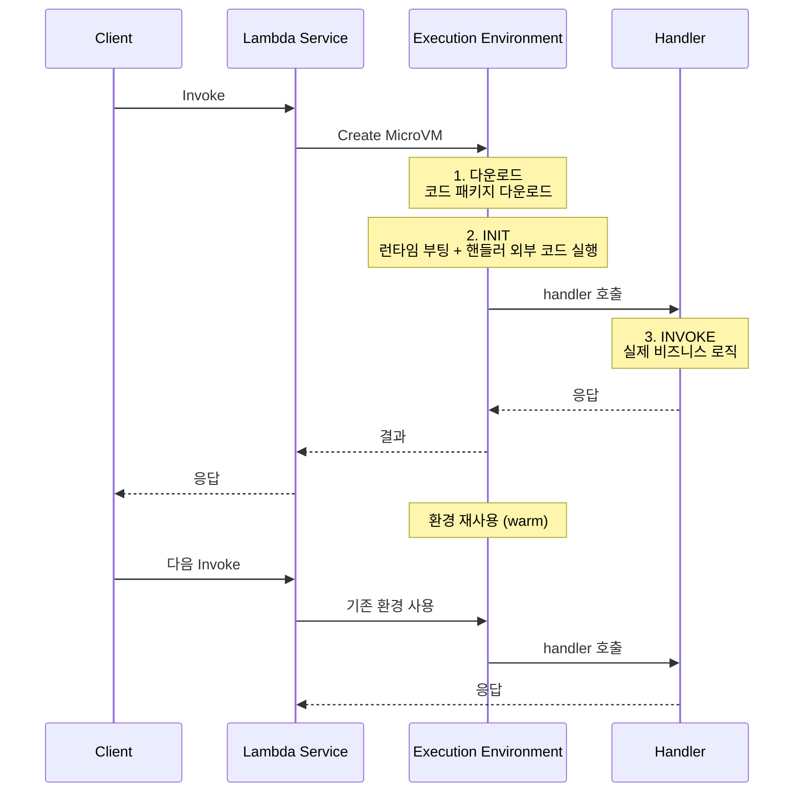
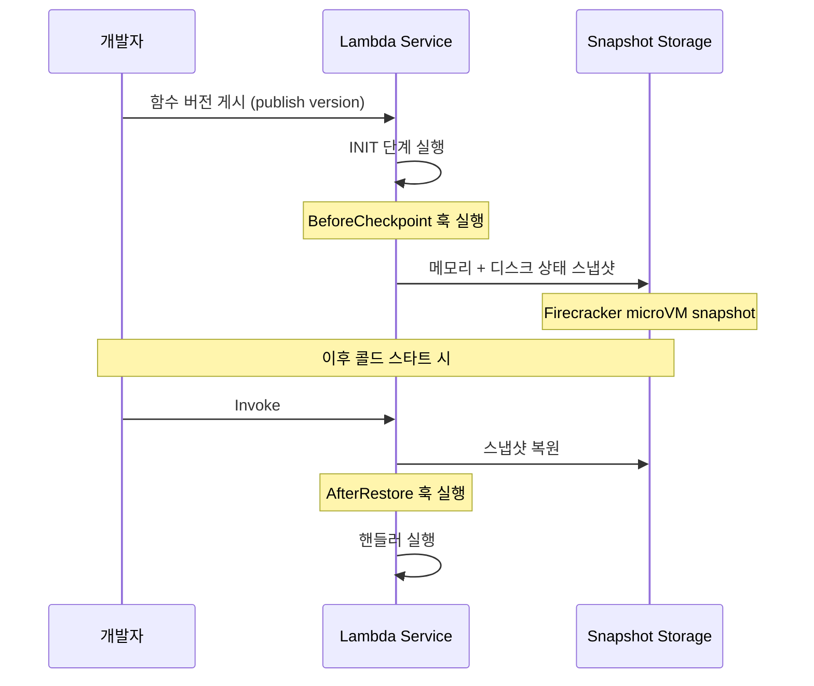
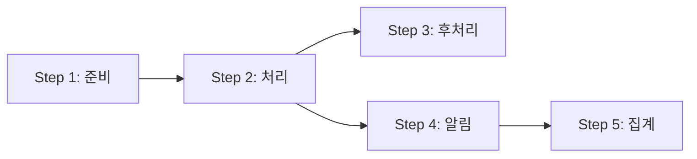

# Lambda 콜드 스타트 심화

Lambda를 운영하다 보면 평소에는 50ms 안에 끝나던 요청이 갑자기 3초가 걸리는 현상을 마주한다. 로그를 까보면 `Init Duration`이 2.8초씩 찍혀 있다. 이게 콜드 스타트다. 이 글은 콜드 스타트가 정확히 어느 단계에서 발생하는지, 런타임마다 왜 차이가 나는지, SnapStart는 어떤 원리로 이걸 줄이는지, Provisioned Concurrency를 언제 써야 하는지 실제 운영 경험을 정리한 것이다.

## 콜드 스타트의 정확한 정의

흔히 "콜드 스타트 = 함수가 처음 실행될 때 느린 것"이라고 알고 있는데 더 정확한 정의가 필요하다. Lambda는 실행 환경(Execution Environment)을 단위로 동작한다. 하나의 실행 환경은 격리된 마이크로VM이고 그 안에서 함수 코드가 돌아간다. 콜드 스타트는 새로운 실행 환경이 생성되어 첫 요청을 처리할 때까지 걸리는 시간이다.

실행 환경이 새로 생성되는 시점은 다음과 같다.

- 함수가 한참 호출되지 않다가 다시 호출됐을 때 (idle 종료)
- 동시 요청이 늘어나서 기존 환경으로 처리 못할 때 (스케일 아웃)
- 함수 코드를 배포해서 기존 환경이 무효화됐을 때
- 환경 자체가 만료됐을 때 (Lambda는 일정 시간이 지나면 환경을 회수한다)

실행 환경이 한번 만들어지면 그 환경은 여러 요청을 순차적으로 처리한다. 두 번째 요청부터는 이미 따뜻한 상태(warm)라서 Init 단계를 건너뛴다. 그래서 같은 함수라도 실행 시간이 들쭉날쭉한 거다.

### INIT 단계와 Invoke 단계 분리

Lambda 실행 환경의 라이프사이클은 세 단계로 나뉜다.



CloudWatch 로그에서 볼 수 있는 `REPORT` 라인의 각 필드가 이 단계와 직접 매핑된다.

```
REPORT RequestId: abc-123  Duration: 145.23 ms  Billed Duration: 146 ms  Memory Size: 512 MB  Max Memory Used: 128 MB  Init Duration: 2384.12 ms
```

- `Init Duration`은 코드 다운로드를 제외한 INIT 단계 시간이다. 핸들러 바깥에서 실행되는 모든 코드의 시간이 여기 들어간다.
- `Duration`은 INVOKE 단계, 즉 핸들러 함수 안의 시간이다.
- 콜드 스타트가 아닌 호출에는 `Init Duration` 라인이 아예 안 찍힌다. 이걸로 콜드/웜 구분이 가능하다.

INIT 단계는 최대 10초까지 허용된다. 10초 안에 초기화가 안 끝나면 Lambda는 그 환경을 폐기하고 다시 만든다. 패키지가 큰 Java 함수가 10초를 넘겨서 무한 루프처럼 콜드 스타트만 반복하는 사례를 본 적이 있다.

또 하나 중요한 점은 INIT 단계와 INVOKE 단계의 메모리 측정이 다르다는 거다. `Max Memory Used`는 INVOKE 단계 기준이다. INIT 단계에서 메모리를 많이 쓰는 라이브러리(예: pandas, tensorflow)를 임포트하면 그게 측정값에 안 잡혀서 메모리 설정을 잘못 잡는 경우가 있다.

## 런타임별 콜드 스타트 차이

런타임마다 Init 시간이 천 단위로 차이난다. 같은 "Hello World" 수준의 함수라도 다음과 같은 차이가 난다.

| 런타임 | 일반적인 Init Duration (1024MB 기준) |
|--------|-------------------------------------|
| Node.js | 150~300ms |
| Python | 200~400ms |
| Go (provided.al2) | 50~150ms |
| Rust (provided.al2) | 30~100ms |
| Java 17 (Corretto) | 1500~3000ms |
| .NET 8 | 1000~2500ms |

이 차이는 런타임이 어떻게 부팅되는지를 보면 이해가 된다.

### 인터프리터 계열 (Node.js, Python)

Node.js와 Python은 인터프리터를 시작하고 코드를 파싱해서 실행하면 끝이다. 라이브러리도 import 시점에 lazy하게 로드하는 게 가능하다. 그래서 Init 시간이 짧다. 다만 `import` 한 번에 디스크에서 수십 MB를 읽어들이는 라이브러리(boto3, requests, pandas)를 깔면 Init 시간이 빠르게 늘어난다.

Python의 경우 `boto3` 클라이언트 생성이 의외로 느리다. 핸들러 바깥에서 클라이언트를 만들면 Init 시간에 잡히고, 핸들러 안에서 만들면 매번 INVOKE 시간이 늘어난다. 트레이드오프다.

```python
import boto3

# 모듈 로드 시점 (INIT 단계)
# 이 시점에 boto3 import + Session 초기화로 200~500ms 소요
ddb = boto3.resource('dynamodb')
table = ddb.Table('users')

def handler(event, context):
    # INVOKE 단계
    # 두 번째 호출부터는 table 객체 재사용
    return table.get_item(Key={'id': event['id']})
```

### 컴파일 언어 (Go, Rust)

Go와 Rust는 정적 바이너리로 빌드되어서 런타임 부팅이 거의 없다. 바이너리 실행 + Lambda 런타임 API 통신 초기화 정도다. 실측해보면 Init Duration이 50ms 아래로 찍히는 경우가 많다. 콜드 스타트에 민감한 워크로드라면 Go나 Rust를 우선적으로 고려한다.

### JVM 기반 (Java, Kotlin, Scala)

Java가 느린 이유는 JVM 자체의 부팅 시간 + 클래스 로딩 + JIT 컴파일이 INIT 단계에 다 들어가기 때문이다. Spring Boot처럼 무거운 프레임워크를 쓰면 클래스 수천 개를 로드하면서 5초 이상 걸린다.

JIT의 워밍업도 문제다. Java 함수는 첫 INVOKE에서도 느리다. JIT가 핫 메서드를 찾기 전이라 인터프리터 모드로 돌아간다. 그래서 콜드 스타트가 끝났는데도 처음 몇 번의 INVOKE가 평소보다 느린 패턴이 보인다.

### .NET

.NET도 비슷하다. CLR 부팅 + 어셈블리 로딩 + JIT가 다 INIT에 들어간다. ReadyToRun(R2R) 컴파일을 활성화하면 JIT 비용을 줄일 수 있지만 패키지 크기가 커진다.

### Custom Runtime (provided.al2, provided.al2023)

`provided.al2023`을 쓰면 Lambda가 부팅 후 `bootstrap` 실행 파일을 그냥 실행한다. 런타임 자체의 오버헤드가 거의 없다. Go, Rust, C++ 같은 네이티브 바이너리 배포에 쓴다.

## SnapStart 동작 원리

SnapStart는 Lambda가 INIT 단계가 끝난 직후의 실행 환경 스냅샷을 미리 찍어두고, 콜드 스타트가 발생할 때 처음부터 실행하는 게 아니라 이 스냅샷을 복원하는 기능이다. 처음에는 Java 11+에만 제공되었지만 현재는 Python 3.12+, .NET 8+로 확장됐다.

### 동작 순서



핵심은 `INIT 단계를 한 번만 실행하고 그 결과를 재사용`한다는 거다. JVM이 클래스를 다 로드하고 Spring Boot가 ApplicationContext를 다 만든 상태가 그대로 스냅샷으로 박제된다. 콜드 스타트가 발생해도 이 스냅샷에서 시작하니까 INIT을 다시 안 한다. 실측 기준으로 Spring Boot 함수의 콜드 스타트가 6초에서 800ms로 줄어든다.

### 적용 조건과 함정

SnapStart는 그냥 켜면 끝이 아니다. 몇 가지 신경 쓸 게 있다.

**1. Published Version에서만 동작한다.** `$LATEST`로 호출하면 SnapStart가 안 먹힌다. 함수 버전을 게시하고 별칭(alias)을 그 버전에 연결해서 별칭으로 호출해야 한다.

**2. 고유성(uniqueness) 문제.** 모든 실행 환경이 같은 스냅샷에서 복원되니까 INIT 단계에서 만든 랜덤 값, UUID, 타임스탬프, 암호화 키가 모든 환경에서 동일해진다. 실제로 겪은 사례가 있다. INIT에서 생성한 X-Ray trace ID seed가 모든 인스턴스에서 같아져서 트레이스가 충돌하는 문제다.

```java
public class Handler implements RequestHandler<Input, Output>, Resource {
    // 이렇게 INIT에서 생성한 값은 모든 복원된 환경에서 동일
    private static final String INSTANCE_ID = UUID.randomUUID().toString();

    private static final SecureRandom random;

    static {
        // SecureRandom의 시드도 모든 인스턴스에서 동일해질 위험
        random = new SecureRandom();
        Core.getGlobalContext().register(new Handler());
    }

    @Override
    public void beforeCheckpoint(Context<? extends Resource> context) {
        // 스냅샷 직전에 호출
    }

    @Override
    public void afterRestore(Context<? extends Resource> context) {
        // 복원 직후 호출 - 여기서 새 시드 주입
        random.setSeed(System.nanoTime());
    }
}
```

`afterRestore` 훅에서 고유 값을 다시 만들어야 한다. AWS는 `org.crac` API를 통해 이걸 제공한다.

**3. 네트워크 연결.** INIT에서 만든 DB 커넥션, HTTP 클라이언트는 스냅샷에 박제되지만 그 연결의 TCP 소켓은 죽어있다. 복원된 환경에서 그대로 쓰려고 하면 `Connection reset` 에러가 난다. `afterRestore`에서 커넥션 풀을 재초기화해야 한다.

**4. 비용.** SnapStart는 함수 버전을 게시할 때마다 스냅샷 캐시를 유지하는 비용이 추가된다. 그리고 복원 시간(Restore Duration)에 대해서도 과금한다. 일반 콜드 스타트보다 약간 비싸다고 보면 된다.

**5. 패키지 크기 제한.** SnapStart는 압축 전 250MB 제한이 더 빡빡하게 걸린다.

## Provisioned Concurrency vs Reserved Concurrency

이 둘이 이름이 비슷해서 헷갈리는데 완전히 다른 기능이다. 한 번 정리하면 다시는 안 헷갈린다.

### Reserved Concurrency

특정 함수가 사용할 수 있는 동시 실행 수의 상한을 고정한다. 이건 콜드 스타트와 직접 관련이 없다. 다른 함수가 동시 실행 한도를 다 잡아먹어서 이 함수가 throttle되는 걸 방지하는 용도다. 또는 반대로 이 함수가 너무 많이 스케일 아웃해서 다운스트림(예: RDS) 연결을 폭발시키는 걸 막는 용도다.

```
계정 동시 실행 한도: 1000
Function A Reserved: 100  → A는 항상 100까지 보장, 100을 넘으면 throttle
나머지 900을 다른 함수들이 공유
```

비용은 추가 안 든다. 그냥 한도 설정이다.

### Provisioned Concurrency

지정한 수만큼의 실행 환경을 미리 INIT 상태로 띄워둔다. 요청이 오면 콜드 스타트 없이 바로 처리한다. 콜드 스타트를 진짜로 없애는 유일한 방법이다. 다만 띄워둔 환경에 대해 시간당 과금한다. 안 쓰고 있어도 비용이 나간다.

```
Provisioned Concurrency 50으로 설정
→ 50개 환경이 항상 warm 상태로 대기
→ 51번째 동시 요청이 오면 일반 콜드 스타트 발생
```

### 어떤 걸 언제 쓰는가

- 콜드 스타트가 사용자 경험에 직결되는 동기 호출 (API Gateway 백엔드, ALB) → Provisioned Concurrency
- 콜드 스타트를 신경 안 써도 되는 비동기 처리 (S3 트리거, SQS 컨슈머) → 둘 다 안 씀
- 이 함수가 다운스트림을 죽일까 걱정 → Reserved Concurrency
- 트래픽이 일정한 경우 → SnapStart로 충분, Provisioned는 오버킬
- 트래픽이 출퇴근 시간에 폭증 → Application Auto Scaling을 PC에 붙여서 시간대별 스케일

비용 트레이드오프 예시를 보면 감이 온다. 1024MB 함수 기준 Provisioned Concurrency는 시간당 $0.000004167/MB 정도다. 50개를 24시간 켜두면 한 달에 $150 정도 나온다. 한편 SnapStart는 스냅샷 캐시 + 복원 비용으로 통상 콜드 스타트 대비 10~20% 추가 정도다. 콜드 스타트가 그렇게 자주 발생하지 않는 워크로드라면 SnapStart가 압도적으로 싸다.

## INIT 단계에서 SDK 클라이언트와 DB 연결 재사용

핸들러 바깥에서 클라이언트를 만들고 핸들러 안에서 재사용하는 패턴은 Lambda의 기본기다. 그런데 막상 코드 리뷰를 해보면 핸들러 안에서 매번 새 클라이언트를 만드는 코드가 정말 많다. 한 INVOKE가 50ms인 함수에서 boto3 클라이언트 생성에 200ms를 쓰면 그게 더 큰 문제다.

```python
import boto3
import os
from botocore.config import Config

# 핸들러 바깥 = INIT 단계
# 이 코드는 실행 환경당 한 번만 실행된다

config = Config(
    retries={'max_attempts': 3, 'mode': 'adaptive'},
    connect_timeout=2,
    read_timeout=5,
    max_pool_connections=10
)

ddb = boto3.client('dynamodb', config=config)
s3 = boto3.client('s3', config=config)

TABLE_NAME = os.environ['TABLE_NAME']

def handler(event, context):
    # 핸들러 안 = INVOKE 단계
    # ddb, s3 객체는 같은 환경의 다음 호출에서 재사용된다
    response = ddb.get_item(
        TableName=TABLE_NAME,
        Key={'id': {'S': event['id']}}
    )
    return response['Item']
```

DB 연결도 마찬가지다. 다만 함정이 있다. RDS Proxy 없이 RDS에 직접 연결하면 동시 환경 수만큼 커넥션이 만들어진다. 함수가 100개로 스케일 아웃하면 DB에 100개 커넥션이 꽂힌다. RDS의 max_connections를 초과해서 DB가 다운된 사례가 흔하다. RDS Proxy를 쓰거나 데이터 액세스 패턴을 다시 봐야 한다.

```python
import pymysql
import os

# INIT에서 커넥션 생성
conn = pymysql.connect(
    host=os.environ['DB_HOST'],
    user=os.environ['DB_USER'],
    password=os.environ['DB_PASS'],
    database=os.environ['DB_NAME'],
    connect_timeout=3,
    autocommit=True
)

def handler(event, context):
    global conn
    try:
        with conn.cursor() as cur:
            cur.execute("SELECT 1")
            return cur.fetchone()
    except (pymysql.err.OperationalError, pymysql.err.InterfaceError):
        # 환경이 오래되어 커넥션이 끊긴 경우
        conn = pymysql.connect(...)
        with conn.cursor() as cur:
            cur.execute("SELECT 1")
            return cur.fetchone()
```

INIT에서 만든 커넥션이 다음 INVOKE 사이에 끊어질 수 있다. Lambda 실행 환경은 idle 상태로 한참 있을 수 있고 그 사이에 DB 측에서 wait_timeout으로 끊어버린다. 핸들러에서 커넥션 죽음을 감지하고 재연결하는 로직이 필요하다.

## X-Ray로 콜드 스타트 측정

콜드 스타트 시간이 INIT 어디에서 소비되는지 알려면 X-Ray가 필수다. CloudWatch의 Init Duration은 총합만 보여주지 어떤 import가 느린지는 안 알려준다.

X-Ray가 활성화되면 콜드 스타트 시 `Initialization` 서브세그먼트가 자동으로 찍힌다. 거기에 사용자 정의 서브세그먼트를 추가해서 분석한다.

```python
from aws_xray_sdk.core import xray_recorder, patch_all
import boto3

with xray_recorder.in_subsegment('init_dependencies'):
    with xray_recorder.in_subsegment('init_boto3'):
        ddb = boto3.client('dynamodb')

    with xray_recorder.in_subsegment('init_heavy_lib'):
        import pandas as pd
        import numpy as np

    with xray_recorder.in_subsegment('init_db_pool'):
        # DB 연결 풀 초기화
        pool = create_db_pool()

patch_all()

def handler(event, context):
    return {'status': 'ok'}
```

X-Ray 콘솔에서 트레이스를 열면 INIT 단계의 시간이 어디로 갔는지 한 눈에 보인다. "왜 이 함수의 콜드 스타트가 4초나 걸리지?"라고 물어볼 때 추측하지 말고 항상 X-Ray부터 본다.

주의할 점은 X-Ray 자체도 INIT 시간을 늘린다는 거다. SDK 로딩이 추가되니까 50~100ms 정도 더 걸린다. 프로덕션에서 X-Ray 샘플링을 적절히 설정해야 한다.

## Top-level await 함정

Node.js 18 이상에서 ESM을 쓰면 top-level await가 가능하다. INIT 단계에서 비동기 작업을 await할 수 있다는 건 매력적이지만 함정이 있다.

```javascript
// index.mjs
import { SecretsManagerClient, GetSecretValueCommand } from '@aws-sdk/client-secrets-manager';

const sm = new SecretsManagerClient({});

// INIT 단계에서 시크릿 가져오기
const secret = await sm.send(new GetSecretValueCommand({
    SecretId: 'my-app/db-password'
}));

const dbPassword = JSON.parse(secret.SecretString).password;

export const handler = async (event) => {
    // dbPassword 사용
    return { ok: true };
};
```

이 코드는 잘 동작하는 것 같지만 다음 문제가 있다.

**1. INIT 시간 증가.** Secrets Manager API 호출이 INIT 시간에 그대로 들어간다. 평소 30ms 걸리던 게 시크릿 페치 100~200ms가 더해지면서 INIT이 늘어난다.

**2. 실패 시 환경 자체가 죽는다.** Secrets Manager가 throttle되거나 일시적 장애가 나면 INIT이 실패한다. INIT 실패는 INVOKE 실패보다 훨씬 비싸다. 실행 환경이 폐기되고 다음 요청은 다시 콜드 스타트 + 또 시크릿 페치다. 장애가 증폭된다.

**3. INIT 10초 제한.** 시크릿 페치가 10초를 넘으면 함수가 영원히 콜드 스타트만 반복한다.

이런 이유로 시크릿이나 외부 의존성은 핸들러 안에서 lazy하게 가져오고 캐시하는 패턴이 안전하다.

```javascript
import { SecretsManagerClient, GetSecretValueCommand } from '@aws-sdk/client-secrets-manager';

const sm = new SecretsManagerClient({});
let cachedSecret = null;
let cachedAt = 0;
const TTL = 5 * 60 * 1000;

async function getSecret() {
    const now = Date.now();
    if (cachedSecret && now - cachedAt < TTL) {
        return cachedSecret;
    }
    const result = await sm.send(new GetSecretValueCommand({
        SecretId: 'my-app/db-password'
    }));
    cachedSecret = JSON.parse(result.SecretString);
    cachedAt = now;
    return cachedSecret;
}

export const handler = async (event) => {
    const secret = await getSecret();
    return { ok: true };
};
```

Lambda Extensions의 Parameters and Secrets Lambda Extension을 쓰면 캐시를 직접 관리할 필요 없이 로컬 HTTP 호출로 시크릿을 가져올 수 있다. INIT을 깨끗하게 유지하는 데 도움이 된다.

## 패키지 크기와 INIT 시간

패키지 크기가 INIT 시간에 미치는 영향은 직선적이지 않다. 두 가지 별개의 비용이 있다.

**1. 코드 다운로드 비용.** Lambda 서비스가 S3에서 코드 패키지를 가져와서 마이크로VM에 마운트하는 시간이다. 압축 해제까지 포함된다. 50MB 패키지면 보통 100~300ms, 250MB(zip 한도)면 1~2초 걸린다. 이건 `Init Duration`에 잡히지 않는다. 콜드 스타트 총 시간에는 들어가지만 따로 측정하기가 어렵다.

**2. INIT 단계의 import/require 비용.** 코드 안에서 라이브러리를 로드하면서 디스크 I/O, 파싱, 초기화가 일어난다. 이게 `Init Duration`에 직접 잡힌다. 패키지에 라이브러리가 많을수록 import 그래프가 깊어지고 시간이 늘어난다.

실측한 예시 하나. Python 함수에 pandas + scikit-learn을 통째로 넣어서 패키지가 80MB가 됐는데 사실 함수에서 쓰는 건 dataframe 한 줄짜리 코드였다. INIT이 4초 걸렸다. pandas만 따로 numpy로 대체하니까 1초로 줄었다. 패키지에 들어있다고 INIT에 자동으로 로드되는 게 아니라 import 한 것만 잡히지만, 서버리스 프레임워크가 자동으로 모든 모듈을 컴파일해버리는 경우가 있어서 살펴봐야 한다.

Lambda Layer로 분리해도 코드 다운로드 비용은 비슷하다. 다만 여러 함수가 같은 라이브러리를 공유할 때 패키지 관리가 깔끔해지는 이점은 있다.

크기를 줄이는 실무 방법은 다음과 같다.

- AWS SDK는 v3로 가서 필요한 클라이언트만 import (Node.js)
- esbuild나 webpack으로 트리 셰이킹
- Python은 `pip install --target` 후 `__pycache__`, `*.dist-info` 제거
- 컨테이너 이미지를 쓸 거면 multi-stage build로 빌드 산출물만 남기기

## 실무 트러블슈팅 사례

### 사례 1: API Gateway가 갑자기 5xx를 뱉는다

API Gateway → Lambda 구조에서 평소엔 잘 되다가 트래픽이 갑자기 늘어날 때 502/504가 발생하는 패턴. 원인은 두 가지가 흔하다.

**원인 A: 콜드 스타트 시간이 API Gateway 통합 타임아웃을 넘김.** API Gateway의 백엔드 통합 타임아웃은 기본 29초고 최대 29초까지만 설정 가능하다(REST API 기준). HTTP API는 30초. Lambda의 `timeout` 설정과 별개다. Java 함수 + 큰 ApplicationContext 로딩 + VPC ENI 어태치먼트가 합쳐져 30초를 넘기면 API Gateway가 504를 반환한다.

이걸 X-Ray에서 보면 Lambda 트레이스는 정상 종료인데 API Gateway 트레이스는 504로 끝나는 묘한 패턴이 보인다. 해결책은 SnapStart 적용 또는 Provisioned Concurrency. VPC를 안 쓸 수 있으면 빼는 것도 방법이다.

**원인 B: 동시 요청 폭증으로 콜드 스타트 환경이 동시에 여러 개 만들어짐.** 1초에 100개 요청이 들어오면 Lambda는 100개 환경을 동시에 만든다. 각 환경이 INIT에서 같은 외부 API(예: Auth Server)를 호출하면 그 API가 throttle된다. 그러면 INIT이 실패하고 환경이 폐기된다. 다음 요청도 같은 일을 반복한다.

해결책은 INIT에서 외부 API 호출을 제거하거나, Reserved Concurrency로 폭주를 제한하거나, 외부 API 의존성을 lazy하게 옮기는 것.

### 사례 2: Step Functions의 State 타임아웃 연쇄

Step Functions에서 Lambda를 여러 단계 호출하는 워크플로우를 운영할 때 한 단계가 콜드 스타트를 맞으면 그 영향이 워크플로우 전체에 퍼진다.



각 Step의 Lambda가 평소엔 1초에 끝난다고 가정하고 State에 `TimeoutSeconds: 5`를 걸어둔다. 그런데 새벽에 트래픽이 거의 없다가 갑자기 워크플로우가 동작하면 Step 1, 2, 3이 모두 콜드 스타트를 맞는다. 각각 3초씩만 더 걸려도 워크플로우 전체에서 9초가 추가되고, 어떤 State는 타임아웃으로 실패한다. 그러면 Step Functions가 재시도하는데 재시도된 Lambda도 콜드 스타트일 가능성이 있다.

이런 경우 State별 TimeoutSeconds를 콜드 스타트를 감안해서 잡거나, Provisioned Concurrency를 핵심 단계에 적용하거나, 콜드 스타트 가능성이 높은 단계는 SnapStart 가능한 런타임으로 옮긴다.

### 사례 3: VPC Lambda의 ENI 워밍업

VPC에 붙은 Lambda는 Hyperplane ENI를 통해 네트워크에 연결된다. 예전에는 환경마다 ENI를 어태치하는 데 10초 이상 걸려서 콜드 스타트가 끔찍했지만 현재는 Hyperplane으로 1초 미만으로 줄었다. 그래도 VPC를 안 쓰는 함수보다는 항상 느리다.

VPC 안의 RDS, ElastiCache에 접근하려면 VPC가 필수지만, 단순히 외부 API를 호출하는 거라면 VPC 밖에 두는 게 좋다. VPC Endpoint를 쓰거나 인터페이스 엔드포인트로 라우팅을 분리하는 것도 방법이다.

### 사례 4: 빌드 환경과 런타임 환경 차이

로컬에서 빌드한 Native 라이브러리가 Lambda에서 안 동작하는 경우다. macOS나 Windows에서 빌드한 바이너리는 Amazon Linux 2/2023에서 안 돌아간다. SAM CLI의 `--use-container` 옵션이나 Lambda Container Image를 써야 한다.

Python에서는 `psycopg2`, `pillow`, `cryptography` 같은 native extension에서 자주 발생한다. 콜드 스타트 시점에 import에서 죽으면 환경이 폐기되고 다음 요청이 또 콜드 스타트가 되는 무한 루프가 만들어진다. CloudWatch 로그에 `ImportError`가 반복적으로 찍히면 빌드 환경 문제일 가능성이 높다.

## 정리

콜드 스타트는 결국 INIT 단계에서 무엇이 일어나는지의 문제다. 런타임 부팅, 코드 로딩, 외부 API 호출, 라이브러리 import. 이걸 X-Ray로 측정해서 어디가 비싼지부터 파악한다. 그 다음에 SnapStart, Provisioned Concurrency, 코드 구조 변경 같은 도구를 골라 쓴다. "콜드 스타트가 느려요"는 답이 없는 질문이고 "INIT 단계의 X에서 Y초가 걸려요"라고 좁혀야 해결책이 보인다.
