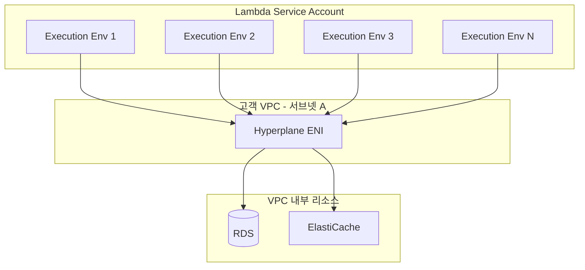
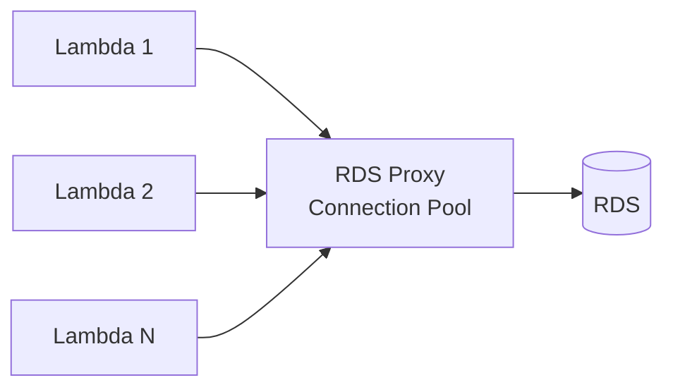

# Lambda VPC 연동 심화

Lambda를 그냥 쓰면 인터넷에서 떠다니는 함수처럼 동작한다. 하지만 RDS에 붙어야 하거나, 사내 ElastiCache를 써야 하거나, VPC 안에서만 접근 가능한 내부 API를 호출해야 하는 순간이 온다. 이때 Lambda를 VPC에 연결한다. 단순해 보이지만 ENI가 어떻게 만들어지고 공유되는지, 서브넷에 IP가 부족하면 무슨 일이 벌어지는지, NAT Gateway 비용이 왜 폭탄으로 돌아오는지 알지 못하면 운영 중에 호되게 당한다. 이 글은 Lambda VPC 연동의 내부 동작과 실제 운영에서 마주치는 문제를 정리한 것이다.

## VPC 없는 Lambda와 VPC Lambda의 차이

기본 상태의 Lambda는 AWS가 관리하는 별도의 네트워크 풀에서 실행된다. 외부 인터넷에 자유롭게 나갈 수 있고, 퍼블릭 엔드포인트로 노출된 서비스에는 다 접근 가능하다. DynamoDB, S3, SQS 같은 AWS 서비스는 퍼블릭 엔드포인트를 가지므로 그냥 호출하면 된다.

문제는 VPC 안에 있는 리소스다. RDS는 보통 프라이빗 서브넷에 두고 보안 그룹으로 막아둔다. ElastiCache, Elasticsearch도 마찬가지다. 이런 리소스에 접근하려면 Lambda가 VPC 내부에 있어야 한다. 그래서 Lambda 함수 설정에서 VPC, 서브넷, 보안 그룹을 지정한다.

VPC를 설정하는 순간 Lambda는 더 이상 AWS의 공용 네트워크 풀에서 실행되지 않는다. 지정한 VPC의 서브넷 안에서 실행 환경이 만들어지고, ENI(Elastic Network Interface)를 통해 통신한다. 이 ENI가 모든 문제의 시작점이다.

## ENI 생성과 공유 메커니즘

ENI는 VPC 안의 네트워크 카드라고 보면 된다. EC2 인스턴스에도 붙고, RDS에도 붙고, Lambda에도 붙는다. 각 ENI는 서브넷의 IP 주소 하나를 차지한다.

### 옛날 방식 (2019년 이전)

예전에는 Lambda 실행 환경 하나당 ENI 하나가 만들어졌다. 함수가 100개의 동시 실행을 가지면 ENI도 100개가 필요했다. 그리고 ENI 생성에는 시간이 오래 걸렸다. 새로운 ENI 하나 만드는 데 10초에서 길게는 60초까지도 걸렸다. VPC Lambda의 콜드 스타트가 일반 Lambda보다 10배 이상 느렸던 이유가 이거다.

이때는 운영하면서 다음과 같은 패턴이 흔했다.

- 함수가 10분 동안 호출 안 되다가 갑자기 트래픽이 몰리면 첫 요청이 30초씩 걸림
- 동시 실행이 늘어날 때마다 ENI를 새로 만들어야 해서 스케일 아웃이 느림
- 서브넷의 IP가 빨리 소진됨 (실행 환경마다 IP를 차지하므로)

### Hyperplane ENI (2019년 이후)

2019년에 AWS가 Hyperplane ENI를 도입하면서 구조가 바뀌었다. 핵심은 ENI를 함수와 서브넷, 보안 그룹 조합으로 매핑하고 여러 실행 환경이 같은 ENI를 공유하는 거다. 같은 함수의 동시 실행 100개가 있어도 ENI는 몇 개만 필요하다 (정확히는 서브넷과 보안 그룹 조합당 ENI 그룹).

Hyperplane ENI는 함수가 처음 호출될 때(또는 설정 변경 시) 미리 만들어 두고, 실제 실행 환경은 NAT 비슷한 방식으로 이 ENI를 공유한다. 결과적으로 다음과 같이 바뀌었다.

- VPC Lambda의 콜드 스타트가 일반 Lambda와 거의 같아짐 (Init Duration에 ENI 생성 시간이 포함되지 않음)
- 동시 실행이 늘어도 ENI는 거의 늘어나지 않음
- 서브넷 IP 소진 문제가 크게 완화됨

다만 ENI 자체는 여전히 존재한다. 함수를 처음 만들거나 VPC 설정을 변경하면 ENI가 새로 만들어지는데 이때는 시간이 걸린다 (몇 분 정도). 그래서 함수 배포 직후에는 잠깐 InvalidSubnetID 같은 에러가 날 수 있다.



## 서브넷 IP 고갈 문제

Hyperplane ENI 덕분에 IP 고갈이 많이 줄었지만 완전히 사라진 건 아니다. 다음 경우는 여전히 IP를 잡아먹는다.

- 함수마다 다른 보안 그룹을 쓰면 (보안 그룹 조합마다 별도 ENI)
- 같은 VPC에 Lambda 함수가 수십 개씩 있으면
- 서브넷이 작게 잡혀 있으면 (예: /28은 가용 IP가 11개뿐)

운영하면서 흔히 만나는 실수가 서브넷을 너무 작게 잡는 거다. 인프라팀에서 Lambda용으로 /27 서브넷을 줬는데 (가용 IP 27개) 함수가 점점 늘면서 IP가 부족해진다. 함수 배포할 때 `An error occurred (InvalidSubnetID.NotFound)` 비슷한 에러가 나거나, 더 황당하게는 함수는 배포되는데 호출 시점에 `EC2ThrottledException`이 뜬다.

해결책은 단순하다. Lambda용 서브넷을 충분히 크게 잡는다. 보통 /24 (251 IP) 이상으로 잡고, 가능하면 /22 정도로 여유 있게 둔다. AZ별로 서브넷을 분리해서 다중 AZ 구성을 하는 것도 잊지 말아야 한다.

## NAT Gateway 비용 폭탄 사례

VPC Lambda의 가장 큰 함정이 NAT Gateway 비용이다. Lambda를 VPC에 넣으면 더 이상 AWS의 공용 네트워크에서 실행되지 않으므로, 외부 인터넷에 나가려면 NAT Gateway나 NAT Instance를 거쳐야 한다.

문제는 Lambda 함수가 외부 API를 호출하는 패턴이 굉장히 흔하다는 거다. 결제 API, 푸시 알림 서비스, 외부 데이터 수집, 심지어 같은 AWS의 다른 서비스도 VPC Endpoint 없으면 NAT를 거친다.

### 실제 사례

스타트업에서 운영하던 시스템에서 한 달 AWS 비용 청구서를 보고 깜짝 놀란 적이 있다. NAT Gateway 비용만 300만 원이 찍혀 있었다. 원인은 단순했다.

- Lambda 함수를 VPC에 연결 (RDS 접근 때문)
- 그 함수가 외부 결제 API와 S3, DynamoDB를 호출
- 모든 트래픽이 NAT Gateway를 거침
- NAT Gateway는 데이터 처리량당 0.045 USD/GB 과금
- 월 7TB 트래픽 발생 → 약 315 USD + 시간당 요금 + AZ별 NAT

여기서 진짜 아까운 게 S3와 DynamoDB 트래픽이다. 같은 리전 안의 AWS 서비스인데 NAT를 거쳐서 인터넷으로 나갔다 다시 들어온다. 이런 트래픽이 전체의 80%였다.

### NAT 비용 구조

- 시간당: 0.059 USD (서울 리전 기준, AZ당 별도)
- 데이터 처리: 0.045 USD/GB
- 다중 AZ 구성하면 AZ 수만큼 곱해짐

3개 AZ에 NAT Gateway를 두면 시간당 0.177 USD, 한 달이면 약 130 USD가 데이터 처리 빼고 그냥 깔린다. 트래픽이 늘면 그만큼 비례해서 늘어난다.

## VPC Endpoint로 NAT 우회

NAT 비용 문제의 해결책이 VPC Endpoint다. AWS 서비스로 가는 트래픽을 인터넷이 아닌 AWS 내부 백본으로 흘려보낸다. 두 종류가 있다.

### Gateway Endpoint

S3와 DynamoDB만 지원한다. Route Table에 항목을 추가하는 방식으로 동작한다. 추가 비용이 없다는 게 핵심이다. NAT 비용에서 가장 큰 부분이 보통 S3와 DynamoDB인데 이걸 공짜로 우회할 수 있다.

설정도 간단하다.

```bash
aws ec2 create-vpc-endpoint \
  --vpc-id vpc-xxxxx \
  --service-name com.amazonaws.ap-northeast-2.s3 \
  --route-table-ids rtb-xxxxx
```

라우트 테이블에 자동으로 prefix list가 추가되고, 그 prefix에 해당하는 트래픽은 NAT 대신 Endpoint로 간다. Lambda 코드는 그대로 둬도 된다.

### Interface Endpoint

나머지 AWS 서비스들 (SQS, SNS, Secrets Manager, KMS, Lambda 등)은 Interface Endpoint를 쓴다. ENI를 서브넷에 만들고 Private DNS를 통해 서비스 엔드포인트를 그 ENI로 라우팅한다.

비용이 들긴 한다. 시간당 0.013 USD/Endpoint/AZ, 데이터는 0.01 USD/GB. NAT(0.045/GB)보다 저렴하지만 공짜는 아니다. 트래픽이 충분히 많으면 Interface Endpoint가 이득이고, 적으면 NAT 두는 게 더 저렴할 수 있다.

운영하면서 자주 쓰는 조합은 다음과 같다.

- S3, DynamoDB → Gateway Endpoint (무조건)
- Secrets Manager, KMS → Interface Endpoint (Lambda에서 자주 호출하므로)
- 외부 인터넷 트래픽이 거의 없으면 NAT Gateway 자체를 빼고 모두 Endpoint로 처리

## Security Group과 Route Table 설정

Lambda VPC 설정에서 보안 그룹은 Lambda 자체에 붙는다. Lambda에서 RDS로 나가는 트래픽이 있다면 다음과 같이 설정한다.

- Lambda의 보안 그룹: 아웃바운드 RDS 포트(5432) 허용
- RDS의 보안 그룹: 인바운드에서 Lambda의 보안 그룹을 허용

보안 그룹은 IP가 아닌 그룹을 참조할 수 있다. RDS 보안 그룹의 인바운드에 Lambda 보안 그룹 ID를 등록하면 Lambda 함수의 IP가 바뀌어도 알아서 동작한다. IP 기반으로 설정하면 안 된다. Hyperplane ENI의 IP는 고정이 아니므로.

라우트 테이블도 신경 써야 한다. Lambda를 두는 서브넷의 라우트 테이블이 다음과 같아야 한다.

- 로컬 VPC CIDR → local
- 0.0.0.0/0 → NAT Gateway (외부 접근 필요한 경우)
- VPC Endpoint prefix → Endpoint (Gateway Endpoint 사용 시)

가끔 퍼블릭 서브넷에 Lambda를 두는 실수를 한다. 퍼블릭 서브넷은 0.0.0.0/0이 Internet Gateway로 가는데, Lambda는 퍼블릭 IP를 받지 못하므로 외부로 나가지도 못하고 응답도 못 받는다. 결국 외부 호출이 다 타임아웃 난다. Lambda는 무조건 프라이빗 서브넷에 둬야 한다.

## 다중 AZ 서브넷 배치

Lambda VPC 설정에서 서브넷은 여러 개 지정할 수 있다. 반드시 여러 AZ에 분산해서 지정해야 한다. 이유는 두 가지다.

첫째는 가용성이다. AZ 하나가 죽으면 그 AZ의 서브넷만 쓰는 Lambda는 함수 호출 자체가 실패한다. 둘 이상의 AZ에 서브넷을 두면 한 AZ가 죽어도 다른 AZ에서 실행된다.

둘째는 IP 풀이다. AZ가 여러 개면 사용 가능한 IP도 늘어난다. 한 서브넷이 IP 부족이어도 다른 서브넷에서 ENI를 만들 수 있다.

실무에서는 보통 3개 AZ에 서브넷을 두고, 각 서브넷을 /24 이상으로 잡는다. 권장 구성은 다음과 같다.

```yaml
# CloudFormation 예시
LambdaSubnetA:
  Type: AWS::EC2::Subnet
  Properties:
    VpcId: !Ref VPC
    CidrBlock: 10.0.10.0/24
    AvailabilityZone: ap-northeast-2a

LambdaSubnetB:
  Type: AWS::EC2::Subnet
  Properties:
    VpcId: !Ref VPC
    CidrBlock: 10.0.11.0/24
    AvailabilityZone: ap-northeast-2b

LambdaSubnetC:
  Type: AWS::EC2::Subnet
  Properties:
    VpcId: !Ref VPC
    CidrBlock: 10.0.12.0/24
    AvailabilityZone: ap-northeast-2c

MyLambda:
  Type: AWS::Lambda::Function
  Properties:
    VpcConfig:
      SubnetIds:
        - !Ref LambdaSubnetA
        - !Ref LambdaSubnetB
        - !Ref LambdaSubnetC
      SecurityGroupIds:
        - !Ref LambdaSecurityGroup
```

## RDS Proxy와 함께 쓰는 패턴

VPC Lambda + RDS 조합에서 가장 자주 마주치는 문제가 커넥션 폭증이다. Lambda는 동시 실행이 쉽게 1000개로 치솟는다. 각 실행 환경이 RDS에 직접 연결을 만들면 RDS의 max_connections를 금방 넘어서 새 연결을 못 받게 된다. PostgreSQL은 100개, MySQL은 150개가 기본값이다.

해결책이 RDS Proxy다. Lambda는 RDS Proxy에 연결하고, Proxy가 실제 RDS 커넥션을 풀로 관리한다. Lambda 동시 실행이 늘어도 실제 RDS 연결은 일정 수준으로 유지된다.



Lambda 코드에서는 RDS의 엔드포인트가 아니라 RDS Proxy의 엔드포인트로 연결하면 된다. IAM 인증을 쓰면 비밀번호 관리도 안 해도 된다.

```python
import boto3
import psycopg2

def get_db_connection():
    client = boto3.client('rds')
    token = client.generate_db_auth_token(
        DBHostname='myproxy.proxy-xxxx.ap-northeast-2.rds.amazonaws.com',
        Port=5432,
        DBUsername='lambda_user'
    )
    return psycopg2.connect(
        host='myproxy.proxy-xxxx.ap-northeast-2.rds.amazonaws.com',
        port=5432,
        user='lambda_user',
        password=token,
        database='mydb',
        sslmode='require'
    )
```

주의할 점이 몇 가지 있다.

- RDS Proxy도 ENI를 만들고 서브넷에 배치되므로 Lambda가 같은 VPC에 있어야 한다
- RDS Proxy 자체에 비용이 든다 (RDS 인스턴스 vCPU당 시간 과금)
- Pinning 현상이 있다. 트랜잭션, 임시 테이블, prepared statement 등을 쓰면 Proxy가 해당 Lambda 실행에 RDS 커넥션을 고정 할당해서 풀링 효과가 떨어진다. CloudWatch에서 `DatabaseConnectionsCurrentlySessionPinned` 지표를 봐야 한다.

## ENI 부족 트러블슈팅

운영하면서 자주 마주치는 에러들을 정리한다.

### InvalidSubnetID.NotFound

함수 호출 시점에 서브넷을 못 찾는다는 에러다. 보통 두 가지 경우다.

- 서브넷이 실제로 삭제됐거나 ID가 바뀜
- 함수 배포 직후 ENI가 아직 준비 안 됨

배포 직후라면 몇 분 기다리면 해결된다. 그게 아니면 Lambda 설정의 서브넷 ID가 실제 VPC와 맞는지 확인해야 한다.

### EC2ThrottledException

ENI를 만들거나 IP를 할당하는 EC2 API가 throttle 되는 에러다. 원인은 다양하다.

- 서브넷에 IP 고갈
- 계정 단위 ENI 한도 초과 (기본 250개, 리전별)
- 짧은 시간에 너무 많은 함수가 동시에 ENI 요청

대응은 다음과 같다. 서브넷 CIDR을 키워서 가용 IP를 늘린다. ENI 한도를 Service Quotas에서 증설 신청한다. 함수마다 보안 그룹을 다르게 쓰지 말고 가능하면 통일한다 (ENI 공유 효율을 높이기 위해).

### ENI가 안 지워지는 문제

가끔 Lambda 함수를 삭제했는데 ENI가 남아 있는 경우가 있다. AWS Lambda 서비스가 ENI를 내부적으로 관리하므로 사용자가 직접 지우려면 권한 문제로 안 된다. 보통 함수 삭제 후 20~40분 기다리면 자동으로 지워진다. 한참 지나도 안 지워지면 AWS Support에 문의해야 한다. CloudFormation 스택 삭제할 때 이게 문제가 되면 스택이 DELETE_FAILED 상태로 멈춘다. 이때는 Retain 정책으로 빼고 수동 정리가 필요하다.

### Init Duration이 갑자기 길어짐

VPC 설정을 바꾼 직후라면 Hyperplane ENI가 새로 만들어지는 중이다. 이때는 일시적으로 Init Duration이 길어질 수 있다. 보통 10~30분 안에 안정화된다. 배포 자동화에서 이 시간을 고려하지 않으면 알람이 잘못 울린다.

## 정리

VPC Lambda는 옛날과는 많이 달라졌다. Hyperplane ENI 덕분에 콜드 스타트 페널티가 거의 사라졌고 ENI 관리도 자동화됐다. 하지만 NAT Gateway 비용, 서브넷 IP 설계, RDS 커넥션 관리는 여전히 신경 써야 한다.

운영하면서 다음 순서로 점검하면 큰 사고를 피할 수 있다. 먼저 서브넷을 충분히 크게 잡고 다중 AZ에 분산한다. 외부 호출이 있으면 어떤 AWS 서비스인지 보고 Endpoint로 우회 가능한지 본다. RDS를 쓰면 RDS Proxy를 함께 검토한다. 보안 그룹은 IP가 아닌 그룹 참조로 설정한다. NAT Gateway 트래픽 비용은 매달 청구서에서 직접 확인하는 습관을 들인다. 이것만 챙겨도 VPC Lambda에서 마주치는 문제 대부분을 피할 수 있다.
