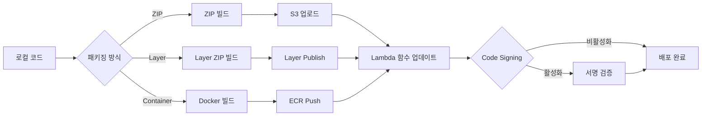

# Lambda 배포와 패키징 심화

Lambda 함수를 처음 만들 때는 콘솔에서 코드 몇 줄 붙여넣고 끝낼 수 있다. 그런데 운영 환경으로 넘어가면 이야기가 달라진다. 의존성 패키지가 100MB를 넘어가는 순간 ZIP 업로드가 막히고, 머신러닝 라이브러리를 쓰려고 하면 250MB 한도에 걸린다. 여러 함수가 같은 라이브러리를 쓰면 매번 똑같은 ZIP을 올려야 하나 고민하게 되고, 기존 Express 앱을 Lambda로 옮기려는데 어떻게 해야 할지 막막하다. 배포 도구도 SAM, Serverless Framework, CDK, Terraform 중에 뭘 골라야 하는지 결정장애가 온다. 이 글은 Lambda 배포 방식 세 가지의 실제 차이와, 그 위에 얹는 도구 선택, 그리고 운영 환경에서 빠지기 쉬운 함정을 정리한 것이다.

## 배포 방식 세 가지

Lambda는 코드를 실행 환경에 올리는 방법으로 ZIP 업로드, Lambda Layer, Container Image 세 가지를 제공한다. 각각 용도와 한계가 분명히 다르다.

### ZIP 업로드

가장 기본적인 방식이다. 코드와 의존성을 ZIP으로 묶어 올리면 Lambda가 풀어서 실행한다. 직접 업로드하면 50MB가 한도이고, S3에 올린 뒤 참조하면 압축 상태에서 250MB까지, 압축을 푼 상태에서 250MB까지 허용된다. `/tmp` 디렉토리는 별도로 512MB(요청하면 10GB까지)를 쓸 수 있지만 이건 런타임 임시 공간이라 코드 패키지에는 포함되지 않는다.

```bash
# Python 의존성 포함 ZIP 빌드 예제
mkdir -p build
pip install -r requirements.txt -t build/
cp -r src/* build/
cd build && zip -r ../function.zip . && cd ..

# 50MB 넘으면 S3 경유 필수
aws s3 cp function.zip s3://my-deploy-bucket/lambda/function.zip
aws lambda update-function-code \
  --function-name my-function \
  --s3-bucket my-deploy-bucket \
  --s3-key lambda/function.zip
```

ZIP 방식의 장점은 단순함이다. CI에서 빌드해서 S3에 올리는 파이프라인은 짜기 쉽고, 콜드 스타트도 가장 빠르다. Lambda 실행 환경이 ZIP을 펼쳐서 바로 동작하기 때문에 추가적인 초기화가 거의 없다.

문제는 250MB 한도다. Pillow, numpy, pandas 같은 패키지를 두세 개만 깔아도 100MB는 우습게 넘긴다. PyTorch나 TensorFlow는 단독으로 500MB를 넘기는 경우도 흔하다. 한도를 넘으면 업로드 자체가 거부된다.

압축 해제 후 250MB라는 점도 함정이다. ZIP 자체는 80MB여도 풀어서 300MB가 되면 배포는 되지만 함수 호출이 실패한다. CloudWatch Logs에 `Unzipped size must be smaller than 262144000 bytes` 에러가 찍힌다. 빌드 단계에서 `du -sh build/` 같은 명령으로 미리 확인해야 한다.

용량을 줄이는 흔한 방법으로 `__pycache__`, `.dist-info`, `tests` 폴더를 빼는 게 있다. boto3는 Lambda 런타임에 이미 포함되어 있으니 의존성에서 제외해도 된다. requirements.txt에 명시되어 있으면 빌드 ZIP에 같이 들어가서 용량을 차지한다.

```bash
# 불필요한 파일 제거 후 ZIP 생성
find build -type d -name "__pycache__" -exec rm -rf {} + 2>/dev/null
find build -type d -name "*.dist-info" -exec rm -rf {} +
find build -type d -name "tests" -exec rm -rf {} +
```

### Lambda Layer

같은 라이브러리를 여러 함수가 쓰는 경우, 매번 함수 ZIP에 포함시키면 배포 용량도 늘고 업데이트도 번거롭다. Layer는 공통 라이브러리를 별도 패키지로 분리해서 함수가 참조하는 방식이다.

함수 하나당 최대 5개 Layer를 붙일 수 있고, Layer 합산 + 함수 코드의 압축 해제 크기가 250MB를 넘으면 안 된다. 즉 Layer로 분리해도 총 한도는 변하지 않는다. 다만 Layer는 한 번 만들면 여러 함수가 공유할 수 있어서 배포 용량 자체는 줄어든다.

```bash
# Python Layer 만들 때 디렉토리 구조
# python/lib/python3.12/site-packages/ 가 핵심
mkdir -p layer/python
pip install requests sqlalchemy -t layer/python/
cd layer && zip -r ../my-layer.zip . && cd ..

aws lambda publish-layer-version \
  --layer-name common-deps \
  --zip-file fileb://my-layer.zip \
  --compatible-runtimes python3.12 \
  --compatible-architectures x86_64 arm64
```

런타임별로 디렉토리 구조가 다르다. Python은 `python/`, Node.js는 `nodejs/node_modules/`, Java는 `java/lib/` 같은 식이다. 구조를 잘못 만들면 함수에서 import는 되는데 모듈을 못 찾는 이상한 상황이 생긴다.

Layer 버전 관리에서 가장 자주 실수하는 부분은 Layer가 불변(immutable)이라는 점이다. `publish-layer-version`을 호출할 때마다 버전 번호가 1, 2, 3 순으로 올라가고, 함수는 특정 버전 ARN을 참조한다. Layer를 업데이트해도 기존 함수는 자동으로 새 버전을 쓰지 않는다. 함수 설정에서 Layer 버전을 명시적으로 바꿔줘야 한다.

```yaml
# SAM 템플릿에서 Layer 버전 참조
Resources:
  MyFunction:
    Type: AWS::Serverless::Function
    Properties:
      Layers:
        - !Sub arn:aws:lambda:${AWS::Region}:${AWS::AccountId}:layer:common-deps:7
```

여기서 `:7`이 버전이다. Layer를 업데이트해서 버전 8이 나와도 함수는 7을 계속 본다. 운영 환경에서는 이게 오히려 안전하다. Layer 업데이트가 자동으로 모든 함수에 반영되면 의도치 않은 변경이 퍼질 수 있기 때문이다.

cross-account 공유는 Layer 권한 정책으로 제어한다. 다른 AWS 계정의 Lambda 함수가 우리 Layer를 쓰게 하려면 `add-layer-version-permission`을 호출한다.

```bash
aws lambda add-layer-version-permission \
  --layer-name common-deps \
  --version-number 7 \
  --statement-id share-with-account \
  --action lambda:GetLayerVersion \
  --principal 123456789012
```

전사 차원에서 공통 Layer를 운영하는 조직에서는 중앙 계정에 Layer를 만들고 모든 워크로드 계정에 권한을 부여하는 패턴을 쓴다. 이때 주의할 점은 Layer를 참조하는 함수는 Layer가 만들어진 리전과 같은 리전에 있어야 한다는 것이다. 멀티 리전 배포라면 리전마다 Layer를 따로 publish해야 한다.

Layer를 너무 잘게 쪼개면 관리가 지옥이 된다. 5개 한도를 채우면 더 이상 못 붙인다. 한 Layer에 의존성을 묶어 넣되 라이브러리 버전 충돌이 없도록 주의해야 한다. 예를 들어 Layer A에 `requests==2.28`이 있고 Layer B에 `requests==2.31`이 있으면 어느 게 로드될지 예측하기 어렵다.

### Container Image

2020년 말에 추가된 방식이다. Docker 이미지를 ECR에 올리고 Lambda가 그 이미지로 실행된다. 압축 해제 기준 10GB까지 허용된다. ZIP 250MB 한계의 25배다.

```dockerfile
# AWS 베이스 이미지 사용 예제
FROM public.ecr.aws/lambda/python:3.12

COPY requirements.txt .
RUN pip install -r requirements.txt

COPY app.py ${LAMBDA_TASK_ROOT}

CMD ["app.lambda_handler"]
```

베이스 이미지는 AWS가 제공하는 `public.ecr.aws/lambda/*` 이미지를 쓰는 게 안전하다. Lambda Runtime API와 RIE(Runtime Interface Emulator)가 미리 들어있어서 별도 설정이 필요 없다.

자체 베이스 이미지를 쓸 수도 있다. 이때는 Lambda Runtime Interface Client를 직접 설치해야 한다.

```dockerfile
FROM ubuntu:22.04

RUN apt-get update && apt-get install -y python3 python3-pip
RUN pip install awslambdaric

COPY app.py /var/task/

ENTRYPOINT ["/usr/bin/python3", "-m", "awslambdaric"]
CMD ["app.lambda_handler"]
```

Container Image의 가장 큰 장점은 용량이다. 머신러닝 모델 추론, OpenCV 같은 무거운 의존성, 시스템 라이브러리(libffi, libxml2 등)를 다 포함시킬 수 있다. 또 로컬에서 도커로 그대로 실행해서 디버깅할 수 있다는 점도 크다.

```bash
# 로컬 테스트
docker run -p 9000:8080 my-lambda:latest

# 별도 터미널에서 invoke
curl -XPOST "http://localhost:9000/2015-03-31/functions/function/invocations" \
  -d '{"key": "value"}'
```

콜드 스타트는 ZIP보다 길다. 첫 실행에서 이미지를 ECR에서 가져와야 하고, 압축 해제 후 컨테이너 환경을 띄워야 한다. 다만 AWS는 이미지를 영역(Availability Zone)별로 캐싱해두기 때문에 두 번째 호출부터는 ZIP과 큰 차이가 없다. 캐시 히트 시 콜드 스타트는 보통 100~300ms 추가되는 정도다.

이미지 크기가 클수록 캐시 히트 전 첫 콜드 스타트가 길어진다. 5GB 이미지를 처음 실행하면 10초 이상 걸리는 경우도 있다. 베이스 이미지를 잘 골라야 하고, 멀티 스테이지 빌드로 불필요한 빌드 도구를 빼는 게 중요하다.

```dockerfile
# 멀티 스테이지로 빌드 단계와 런타임 분리
FROM public.ecr.aws/lambda/python:3.12 AS builder
COPY requirements.txt .
RUN pip install -r requirements.txt -t /opt/python

FROM public.ecr.aws/lambda/python:3.12
COPY --from=builder /opt/python /var/runtime
COPY app.py ${LAMBDA_TASK_ROOT}
CMD ["app.lambda_handler"]
```

ECR 통합 측면에서 중요한 점은 Lambda가 이미지를 참조할 때 태그가 아닌 다이제스트(SHA256)를 저장한다는 것이다. `latest` 태그로 함수를 만들어도 내부적으로는 그 시점의 다이제스트로 고정된다. ECR에서 같은 태그로 새 이미지를 push해도 Lambda 함수는 자동으로 갱신되지 않는다. `update-function-code`를 호출해야 한다.

```bash
aws lambda update-function-code \
  --function-name my-function \
  --image-uri 123456789012.dkr.ecr.ap-northeast-2.amazonaws.com/my-lambda:v1.2.3
```

ECR 리포지토리는 Lambda 함수와 같은 리전에 있어야 한다. cross-region 참조는 안 된다. 멀티 리전 배포는 ECR 리포지토리도 리전마다 따로 두거나 ECR Replication을 설정해야 한다.

## 세 방식 비교

| 항목 | ZIP | Layer | Container Image |
|------|-----|-------|-----------------|
| 크기 한도 | 250MB (압축 해제) | 합산 250MB | 10GB |
| 콜드 스타트 | 가장 빠름 | ZIP과 거의 동일 | 100~300ms 추가 |
| 빌드 복잡도 | 낮음 | 중간 | 높음 |
| 로컬 테스트 | SAM CLI 필요 | SAM CLI 필요 | 도커로 직접 |
| 공유 | 함수마다 복사 | Layer로 공유 | ECR 권한으로 공유 |
| 버전 관리 | S3 객체 버전 | Layer 버전 번호 | ECR 이미지 태그/다이제스트 |

선택 기준은 단순하다. 의존성이 50MB 미만이면 ZIP. 여러 함수가 같은 의존성을 쓰면 Layer. 250MB 넘거나 시스템 라이브러리가 필요하면 Container Image. 머신러닝 추론은 거의 무조건 Container Image다.

## Lambda Web Adapter

기존 Express, FastAPI, Flask, Spring Boot 같은 웹 프레임워크로 만든 앱을 Lambda로 옮기려면 보통 핸들러 함수 형태로 다시 짜야 한다. Web Adapter는 이걸 우회하는 도구다. AWS가 제공하는 작은 바이너리(또는 Layer)인데, Lambda 이벤트를 받아서 표준 HTTP 요청으로 변환해 컨테이너 내부에서 돌아가는 웹 서버에 전달한다.

```dockerfile
FROM public.ecr.aws/lambda/nodejs:20

# Web Adapter 추가
COPY --from=public.ecr.aws/awsguru/aws-lambda-adapter:0.8.4 \
     /lambda-adapter /opt/extensions/lambda-adapter

ENV PORT=8000
ENV AWS_LWA_ENABLE_COMPRESSION=true

COPY package*.json ./
RUN npm ci --omit=dev
COPY . .

CMD ["node", "server.js"]
```

`server.js`는 평범한 Express 앱이다.

```javascript
const express = require('express');
const app = express();

app.get('/health', (req, res) => res.json({ ok: true }));
app.get('/users/:id', async (req, res) => {
  const user = await fetchUser(req.params.id);
  res.json(user);
});

app.listen(8000, () => console.log('listening on 8000'));
```

Lambda 핸들러를 따로 작성할 필요가 없다. Web Adapter가 Extension으로 동작하면서 Lambda Runtime API를 받아서 8000 포트로 HTTP 요청을 던진다.

ZIP 방식에서도 Layer로 Web Adapter를 추가할 수 있다.

```yaml
Resources:
  MyApiFunction:
    Type: AWS::Serverless::Function
    Properties:
      CodeUri: ./app
      Handler: run.sh
      Runtime: nodejs20.x
      Layers:
        - !Sub arn:aws:lambda:${AWS::Region}:753240598075:layer:LambdaAdapterLayerX86:24
      Environment:
        Variables:
          AWS_LAMBDA_EXEC_WRAPPER: /opt/bootstrap
          PORT: 8000
```

`run.sh`는 웹 서버를 띄우는 스크립트다. `AWS_LAMBDA_EXEC_WRAPPER`가 핵심인데, Lambda가 함수를 시작하기 전에 이 wrapper 스크립트를 거치도록 한다.

기존 모놀리스를 Lambda로 옮길 때 Web Adapter는 큰 도움이 된다. 단점은 Lambda 호출당 한 번씩 HTTP 요청-응답 사이클이 추가로 도는 것이라 latency가 약간 늘어난다는 점이다. 보통 5~20ms 정도다. 또 함수 안에서 8000 포트가 뜰 때까지 대기해야 하므로 콜드 스타트가 일반 핸들러보다 길다.

## 배포 도구별 차이

Lambda 인프라를 코드로 관리하는 도구는 여러 개가 있다. 각각 철학과 추상화 레벨이 다르다.

### AWS SAM

CloudFormation 위에 Lambda 특화 단축 표현을 얹은 거다. `AWS::Serverless::Function` 같은 변환 규칙(transform)이 들어가면 SAM이 풀어서 일반 CloudFormation 리소스로 바꿔준다.

```yaml
AWSTemplateFormatVersion: '2010-09-09'
Transform: AWS::Serverless-2016-10-31

Resources:
  HelloFunction:
    Type: AWS::Serverless::Function
    Properties:
      CodeUri: ./hello
      Handler: app.handler
      Runtime: python3.12
      Events:
        Api:
          Type: HttpApi
          Properties:
            Path: /hello
            Method: get
```

`sam build`로 의존성 설치까지 해주고, `sam local invoke`나 `sam local start-api`로 로컬에서 도커 기반 에뮬레이션이 된다. Lambda + API Gateway + DynamoDB 조합처럼 서버리스 위주로 짜는 경우에 가장 편하다. 다만 EC2, VPC, IAM 같은 일반 인프라까지 같이 관리하려면 결국 CloudFormation 표준 문법을 같이 써야 한다.

### Serverless Framework

Lambda 등장 초기에 가장 많이 쓰이던 도구다. 멀티 클라우드 추상화를 표방하지만 실질적으로는 AWS 위에서 가장 잘 동작한다. 플러그인 생태계가 풍부해서 OpenAPI 통합, 도메인 매핑, Layer 자동 빌드 같은 작업을 플러그인으로 해결한다.

```yaml
service: my-api

provider:
  name: aws
  runtime: nodejs20.x
  region: ap-northeast-2

functions:
  hello:
    handler: src/handler.hello
    events:
      - httpApi:
          path: /hello
          method: get

plugins:
  - serverless-esbuild
  - serverless-offline
```

내부적으로는 CloudFormation 스택을 생성한다. 그래서 SAM과 마찬가지로 CloudFormation의 한계(스택 리소스 500개 제한, 변경 적용 속도 등)를 그대로 받는다. 최근 라이선스가 바뀌면서 v4부터는 일정 매출 이상 회사에 유료화되었다. 그래서 새로 시작하는 프로젝트에서는 선택을 망설이게 된다.

### AWS CDK

코드(TypeScript, Python, Go 등)로 인프라를 정의한다. 빌드하면 CloudFormation 템플릿이 생성된다. SAM이나 Serverless Framework가 YAML 설정 파일이라면 CDK는 프로그래밍 언어로 분기, 반복, 추상화가 자유롭다.

```typescript
import { Stack, StackProps } from 'aws-cdk-lib';
import { Function, Runtime, Code } from 'aws-cdk-lib/aws-lambda';
import { HttpApi, HttpMethod } from 'aws-cdk-lib/aws-apigatewayv2';
import { HttpLambdaIntegration } from 'aws-cdk-lib/aws-apigatewayv2-integrations';

export class MyStack extends Stack {
  constructor(scope: Construct, id: string, props?: StackProps) {
    super(scope, id, props);

    const fn = new Function(this, 'HelloFn', {
      runtime: Runtime.NODEJS_20_X,
      handler: 'app.handler',
      code: Code.fromAsset('lambda'),
      memorySize: 512,
    });

    const api = new HttpApi(this, 'Api');
    api.addRoutes({
      path: '/hello',
      methods: [HttpMethod.GET],
      integration: new HttpLambdaIntegration('HelloIntegration', fn),
    });
  }
}
```

여러 함수를 패턴으로 만들거나, 환경별(dev/staging/prod)로 다른 설정을 적용해야 할 때 CDK가 압도적으로 편하다. 단점은 학습 곡선이다. CloudFormation 위에서 동작하는 추상화이기 때문에 둘 다 알아야 디버깅이 가능하다. 또 CDK 버전 업데이트가 잦아서 마이너 버전만 올려도 합성 결과가 달라지는 경우가 있다.

### Terraform

CloudFormation을 안 거치는 유일한 옵션이다. AWS Provider가 직접 API를 호출해서 리소스를 만든다. AWS 외에 다른 클라우드, SaaS 도구까지 같이 관리해야 하는 조직에서는 Terraform이 거의 표준이다.

```hcl
resource "aws_lambda_function" "hello" {
  function_name = "hello"
  role          = aws_iam_role.lambda.arn
  handler       = "app.handler"
  runtime       = "python3.12"

  filename         = "function.zip"
  source_code_hash = filebase64sha256("function.zip")

  layers = [aws_lambda_layer_version.deps.arn]
}

resource "aws_lambda_layer_version" "deps" {
  filename         = "layer.zip"
  layer_name       = "common-deps"
  source_code_hash = filebase64sha256("layer.zip")
  compatible_runtimes = ["python3.12"]
}
```

Terraform의 단점은 Lambda 빌드를 직접 해주지 않는다는 것이다. ZIP을 만들거나 도커 이미지를 빌드하는 단계는 별도 스크립트나 `null_resource` + `local-exec`로 처리해야 한다. SAM이나 CDK가 빌드까지 흡수하는 것과 대조적이다. 이 때문에 실무에서는 Terraform으로 인프라 골격을 만들고, Lambda 코드 배포만 SAM이나 CI 스크립트로 하는 하이브리드 구성을 자주 본다.

### 도구 선택 기준

소수의 Lambda 함수만 운영한다면 SAM이 가장 빠르다. 함수 수가 많아지고 환경별 차이가 복잡해지면 CDK가 유리하다. AWS 외 인프라까지 다룬다면 Terraform이 맞고, 이미 Serverless Framework로 구축된 시스템을 운영 중이라면 굳이 옮길 필요는 없다.

한 가지 흔한 함정은 도구를 섞어 쓸 때 발생한다. Terraform으로 만든 함수를 SAM으로 업데이트하려고 하면 상태 관리가 꼬인다. 한 함수의 라이프사이클은 한 도구로 통일하는 게 좋다.

## 배포 흐름

전체 배포 과정을 다이어그램으로 정리하면 이렇다.



세 방식 모두 마지막에 `update-function-code`나 동등한 API 호출로 Lambda에 반영된다. 이 시점에서 Code Signing이 활성화되어 있으면 서명 검증이 끼어든다.

## Code Signing과 무결성 검증

운영 환경에서 누군가 Lambda 함수 코드를 임의로 바꾸지 못하게 막는 메커니즘이다. AWS Signer로 코드에 서명하고, Lambda는 서명된 코드만 받아들이도록 설정한다.

순서는 이렇다. AWS Signer에 서명 프로파일(Signing Profile)을 만들고, S3에 올린 ZIP에 대해 서명 작업을 실행하면 서명 정보가 별도로 생성된다. Lambda 함수에는 Code Signing Configuration을 연결하는데, 여기에 신뢰할 수 있는 서명 프로파일과 정책을 지정한다.

```bash
# 서명 프로파일 생성
aws signer put-signing-profile \
  --profile-name my-lambda-signer \
  --platform-id AWSLambda-SHA384-ECDSA

# 코드 서명
aws signer start-signing-job \
  --source 's3={bucketName=my-deploy,key=function.zip,version=abc123}' \
  --destination 's3={bucketName=my-deploy-signed,prefix=signed/}' \
  --profile-name my-lambda-signer

# Code Signing Configuration 생성
aws lambda create-code-signing-config \
  --allowed-publishers SigningProfileVersionArns=arn:aws:signer:... \
  --code-signing-policies UntrustedArtifactOnDeployment=Enforce
```

`UntrustedArtifactOnDeployment`를 `Enforce`로 두면 서명되지 않거나 신뢰하지 않는 프로파일로 서명된 코드는 배포 자체가 거부된다. `Warn`으로 두면 CloudWatch에 경고만 남기고 배포는 된다. 운영 환경은 무조건 Enforce다.

Code Signing은 Container Image에는 적용되지 않는다. 컨테이너 이미지의 무결성 검증은 ECR의 이미지 다이제스트나 별도의 이미지 서명 도구(Notary, cosign 등)로 따로 챙겨야 한다. ECR이 자체적으로 다이제스트 기반 immutable tag 옵션을 제공하므로 이걸 켜두면 같은 태그로 다른 이미지가 push되는 걸 막을 수 있다.

```bash
aws ecr put-image-tag-mutability \
  --repository-name my-lambda \
  --image-tag-mutability IMMUTABLE
```

실제로 운영하다 보면 Code Signing보다 ECR immutable tag 쪽이 훨씬 자주 쓰인다. ZIP 기반 함수는 S3 객체 버전 관리만 잘 해도 충분히 추적 가능한 경우가 많다. Code Signing은 금융, 의료, 정부 같은 규제가 강한 도메인에서 필수로 요구되는 경우에 주로 쓴다.

## 운영에서 자주 만나는 문제

배포 ZIP이 250MB를 넘어가는 순간 가장 먼저 검토할 건 의존성 정리다. boto3, botocore는 Lambda 런타임에 포함되어 있어서 빼도 된다. 테스트용 패키지(pytest, mock 등)는 운영 ZIP에서 제외한다. `pip install --no-deps`로 의존성의 의존성을 제어하거나, requirements를 dev/prod로 분리한다.

그래도 안 되면 Container Image로 옮기는 게 답이다. Layer로 분리해도 합산 250MB 한도는 그대로다. 머신러닝 모델이나 큰 시스템 라이브러리가 들어가면 Container 외에는 답이 없다.

ECR 이미지가 너무 커서 콜드 스타트가 5초 이상 걸리는 경우, 가장 먼저 멀티 스테이지 빌드를 적용한다. 빌드 도구(gcc, make 등)가 런타임에 들어가면 안 된다. 그다음으로 베이스 이미지를 점검한다. `python:3.12`(약 1GB) 대신 `public.ecr.aws/lambda/python:3.12`(약 600MB) 또는 slim 변형을 쓴다.

Layer 버전 ARN을 하드코딩한 채로 환경별로 배포하면 운영 환경의 함수가 dev에서 만든 Layer를 가리키는 사고가 종종 난다. Layer ARN은 환경 변수나 SSM Parameter Store로 관리하는 게 안전하다.

배포가 성공했는데 함수 호출이 실패하는 경우, 첫 번째 의심 대상은 핸들러 경로다. ZIP 안에서 실제로 핸들러 파일이 어디에 있는지와 Lambda 함수 설정의 핸들러 문자열이 일치하지 않으면 `Unable to import module` 에러가 난다. ZIP 빌드 시 디렉토리 구조를 항상 확인해야 한다.

## 마무리

Lambda 배포 방식은 ZIP, Layer, Container 셋이 전부고, 각각의 한계가 명확하다. 의존성이 가벼우면 ZIP, 여러 함수가 공유하면 Layer, 무거우면 Container다. 배포 도구는 SAM이 단순함, CDK가 표현력, Terraform이 범용성에서 강하다. Web Adapter는 기존 웹 앱을 거의 그대로 Lambda로 옮길 수 있게 해주는 좋은 도구지만 약간의 latency 비용이 든다. Code Signing은 규제 환경에서 필수지만 일반적으로는 ECR immutable tag와 S3 버전 관리만으로도 충분한 무결성 보장이 가능하다. 어떤 조합을 쓰든 자기 함수의 배포 산출물이 어떤 경로로 어디까지 흘러가는지 정확히 추적할 수 있어야 한다.
