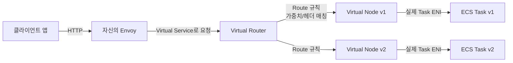
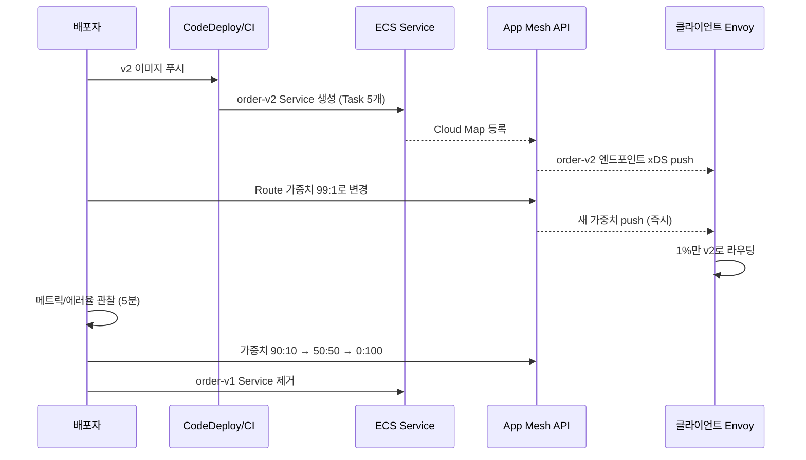
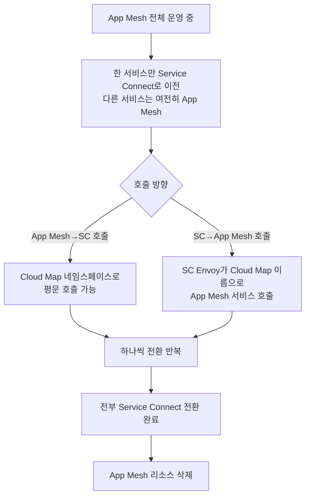

# AWS App Mesh 다중 컨테이너 서비스 메시

## App Mesh가 해결하려는 문제

마이크로서비스가 10개, 20개로 늘어나면 "서비스 간 호출"이 갑자기 난장판이 된다. A가 B를 부르고, B가 C를 부르는데, 어느 구간에서 타임아웃이 나는지, 리트라이는 누가 몇 번 하는지, TLS는 어디서 풀리는지 — 이걸 서비스 코드마다 각자 다르게 구현하면 디버깅이 불가능해진다. 어떤 팀은 RestTemplate에 interceptor로 박고, 어떤 팀은 OkHttp에 박고, Go 팀은 또 다른 라이브러리를 쓰는 식이다.

Service Mesh는 "호출 제어 로직을 앱에서 뜯어내서 사이드카에 몰아넣는" 패턴이다. 앱은 그냥 localhost로 HTTP 호출을 보내고, 같은 Task 안에 붙어있는 Envoy 사이드카가 대신 라우팅, 재시도, mTLS, 메트릭 수집을 한다. App Mesh는 AWS가 이 Envoy 설정을 API로 관리하게 만든 매니지드 컨트롤 플레인이다.

데이터 플레인은 Envoy 그대로다. Envoy 자체는 오픈소스고 Lyft가 만든 proxy인데, App Mesh가 하는 일은 "Virtual Node, Virtual Service 같은 AWS 리소스를 정의하면 그걸 Envoy xDS 프로토콜이 먹는 설정으로 번역해서 뿌려주는 것"이다. 직접 Envoy `envoy.yaml`을 짜본 사람은 알겠지만 xDS 설정이 악명 높게 복잡해서, 이걸 선언적으로 쓸 수 있게 한 것만으로도 의미가 있었다.

### 왜 Envoy 사이드카인가

Nginx, HAProxy 같은 프록시는 주로 "앞단에 한 덩어리" 형태로 쓴다. 반면 Envoy는 동적 설정(xDS)과 L7 기능이 훨씬 강력하고, 애초에 사이드카로 붙는 용도로 설계됐다. Virtual Node마다 Envoy 하나가 붙어서 그 Virtual Node가 호출하는 다른 서비스의 엔드포인트 목록, 타임아웃, retry 정책을 자기 메모리에 들고 있다.

실무적으로 의미 있는 차이는 이거다 — Envoy는 **헬스체크 결과가 바뀌어도 설정 재시작이 필요 없다**. xDS로 설정이 실시간 푸시된다. 새 Task가 뜨면 Envoy가 알아서 그 엔드포인트를 수신하고 로드밸런싱 대상에 추가한다. 이게 마이크로서비스 동적 스케일링과 궁합이 좋다.

## App Mesh의 리소스 모델

App Mesh를 처음 배울 때 가장 헷갈리는 게 리소스 이름들이다. Mesh, Virtual Node, Virtual Service, Virtual Router, Route — 비슷비슷해 보이는데 역할이 다 다르다. 실무자의 멘탈 모델로는 아래처럼 매핑하면 된다.



### Mesh

가장 바깥 컨테이너 개념이다. Mesh 하나가 하나의 네임스페이스라고 보면 된다. 일반적으로 "환경당 1개"로 둔다 — `prod-mesh`, `stg-mesh` 이런 식이다. Mesh 안의 모든 Virtual Node/Service는 서로 참조 가능하지만, Mesh를 넘는 순간 별도 설정이 필요하다.

### Virtual Node

**"하나의 서비스 버전"에 대응한다.** order-service의 v1을 띄우면 그게 Virtual Node 하나다. 여기서 핵심은 Virtual Node가 추상 개념이 아니라 **"이 버전의 Task들이 어떤 포트/프로토콜로 listen하고, 어떤 백엔드를 호출하는지"** 를 정의한다는 점이다.

```json
{
  "virtualNodeName": "order-v1",
  "spec": {
    "listeners": [{
      "portMapping": { "port": 8080, "protocol": "http" },
      "healthCheck": {
        "protocol": "http",
        "path": "/healthz",
        "healthyThreshold": 2,
        "unhealthyThreshold": 3,
        "timeoutMillis": 2000,
        "intervalMillis": 5000
      },
      "timeout": {
        "http": { "idle": { "unit": "s", "value": 60 } }
      }
    }],
    "serviceDiscovery": {
      "awsCloudMap": {
        "namespaceName": "prod.local",
        "serviceName": "order-v1"
      }
    },
    "backends": [
      { "virtualService": { "virtualServiceName": "payment.prod.local" } }
    ]
  }
}
```

`serviceDiscovery`에 Cloud Map 또는 DNS를 지정하는데, 이게 "실제 Task들이 어디 있는지" 알려주는 소스다. Cloud Map을 쓰면 ECS가 Task 등록/해제를 자동으로 해준다. `backends`는 이 Virtual Node가 호출하려는 다른 서비스들인데, 여기에 명시 안 한 백엔드는 Envoy가 "모르는 목적지"로 처리해 막아버린다. 제로 트러스트 측면에서는 좋은데, 신규 서비스 붙일 때마다 backends 업데이트를 깜빡하면 호출이 안 나가서 한참 헤맨다.

### Virtual Service

**"서비스의 논리적 이름"** 이다. `payment.prod.local` 같은 DNS 이름을 Virtual Service로 등록해두면, 다른 서비스들은 이 이름으로만 호출한다. 내부적으로 v1, v2가 뭐가 되든 호출 측은 모른다.

Virtual Service의 provider는 둘 중 하나다.

- **Virtual Node 직접 지정**: 트래픽이 전부 한 버전으로 간다. 단순한 경우.
- **Virtual Router 지정**: Router가 가중치로 v1/v2를 나눠 보낸다. 카나리/블루그린에 필수.

### Virtual Router + Route

Router는 "이 Virtual Service로 들어온 요청을 어떻게 분기할지" 결정한다. Route는 실제 매칭 규칙이다.

```json
{
  "routeName": "order-canary",
  "spec": {
    "httpRoute": {
      "match": { "prefix": "/" },
      "action": {
        "weightedTargets": [
          { "virtualNode": "order-v1", "weight": 90 },
          { "virtualNode": "order-v2", "weight": 10 }
        ]
      },
      "retryPolicy": {
        "maxRetries": 2,
        "perRetryTimeout": { "unit": "s", "value": 2 },
        "httpRetryEvents": ["server-error", "gateway-error"],
        "tcpRetryEvents": ["connection-error"]
      },
      "timeout": {
        "perRequest": { "unit": "s", "value": 15 }
      }
    }
  }
}
```

`weightedTargets` 가 카나리 핵심이다. 가중치는 정수 합계 100이 국룰이지만 App Mesh는 그냥 비율로 환산한다. 10:90, 1:99, 50:50 다 된다. 변경은 API call 한 번이면 되고 Envoy에 실시간으로 반영된다. 리로드 없다.

Route에는 prefix 매칭 외에 헤더 매칭도 가능하다. `x-canary: true` 헤더가 붙은 요청만 v2로 보내는 식의 "특정 사용자만 신규 버전" 패턴이 쉽게 된다.

## ECS Task에 Envoy 사이드카 주입하기

App Mesh 쓰려면 ECS Task Definition에 Envoy 컨테이너를 직접 박아야 한다. EKS는 Admission Controller가 자동 주입해주지만 ECS는 수동이다. 이 "수동"이 생각보다 할 게 많다.

### Task Definition 구조

```json
{
  "family": "order-v1",
  "networkMode": "awsvpc",
  "proxyConfiguration": {
    "type": "APPMESH",
    "containerName": "envoy",
    "properties": [
      { "name": "IgnoredUID", "value": "1337" },
      { "name": "ProxyIngressPort", "value": "15000" },
      { "name": "ProxyEgressPort", "value": "15001" },
      { "name": "AppPorts", "value": "8080" },
      { "name": "EgressIgnoredIPs", "value": "169.254.170.2,169.254.169.254" }
    ]
  },
  "containerDefinitions": [
    {
      "name": "app",
      "image": "123456789012.dkr.ecr.ap-northeast-2.amazonaws.com/order:1.2.3",
      "essential": true,
      "portMappings": [{ "containerPort": 8080, "protocol": "tcp" }],
      "dependsOn": [
        { "containerName": "envoy", "condition": "HEALTHY" }
      ]
    },
    {
      "name": "envoy",
      "image": "840364872350.dkr.ecr.ap-northeast-2.amazonaws.com/aws-appmesh-envoy:v1.29.x.x-prod",
      "essential": true,
      "user": "1337",
      "environment": [
        { "name": "APPMESH_RESOURCE_ARN",
          "value": "arn:aws:appmesh:ap-northeast-2:123:mesh/prod-mesh/virtualNode/order-v1" }
      ],
      "healthCheck": {
        "command": ["CMD-SHELL",
          "curl -s http://localhost:9901/server_info | grep state | grep -q LIVE || exit 1"],
        "startPeriod": 10,
        "interval": 5,
        "timeout": 2,
        "retries": 3
      }
    }
  ]
}
```

### proxyConfiguration의 정체

`proxyConfiguration`이 하는 일은 **"Task 내부의 네트워크 트래픽을 강제로 Envoy를 통과하게 iptables 규칙을 꽂는 것"** 이다. `IgnoredUID: 1337` 은 "UID 1337로 뜨는 프로세스(= Envoy 본인)의 트래픽은 다시 Envoy로 돌리지 말 것"이다. 이거 빼먹으면 Envoy가 자기 트래픽을 자기에게 무한 루프로 돌려서 Task가 죽는다.

`AppPorts`에 앱이 listen하는 포트를 전부 적어야 한다. 여기 없는 포트로 들어온 인바운드 요청은 Envoy를 우회하는데, 이러면 mTLS도 메트릭도 다 빠진다. 앱이 8080이랑 8081 둘 다 쓰면 `"8080,8081"` 이라고 써야 한다.

`EgressIgnoredIPs`는 **반드시** 169.254.170.2(Task metadata endpoint)와 169.254.169.254(IMDS)를 넣어야 한다. 이걸 뺐다가 앱이 IAM role을 못 가져와서 S3 접근 403으로 죽는 사고를 실제로 본 적 있다. VPC 엔드포인트로 내부 AWS 서비스 호출하는 경우 해당 IP/CIDR도 `EgressIgnoredPorts` 또는 `EgressIgnoredIPs`로 빼주는 게 좋다.

### dependsOn 순서 이슈

`app` 컨테이너가 `envoy`의 HEALTHY를 기다리게 걸어둬야 한다. 이거 안 해두면 앱이 시작하면서 외부 호출을 때리는데 Envoy가 아직 xDS 설정을 받지 못해 연결이 거부되는 상황이 생긴다. Spring Boot 앱이 initialization 단계에서 외부 API를 부르는 흔한 케이스에서 자주 터진다.

반대로 종료 시에는 `stopTimeout`을 충분히 준다. Envoy는 SIGTERM 받고 나서 기존 in-flight 요청을 끝낸 뒤 종료되는데, 앱이 먼저 죽어버리면 drain 중인 요청이 502를 본다. 보통 `stopTimeout: 60~90` 정도 준다(Fargate 최대 120).

### Envoy 이미지 선택

AWS가 리전별로 Envoy 이미지를 제공한다. 문서에 적혀있는 account ID(`840364872350` 같은)로 직접 당긴다. 중요한 건 **최신 버전을 쓸 것**이다. 구버전은 CVE 패치가 안 되어 있고, xDS 호환성 이슈도 있다. `aws-appmesh-envoy:v1.29.x.x-prod` 처럼 `-prod` 태그 붙은 걸 써야 하고, `-dev`는 절대 프로덕션에서 쓰면 안 된다.

## mTLS 적용

서비스 메시의 큰 장점 중 하나가 "앱 코드 안 건드리고 서비스 간 mTLS를 켤 수 있다"는 점이다. 앱은 평문 HTTP를 쏘고, Envoy가 TLS로 감싸서 상대 Envoy에게 보낸다. 상대 Envoy가 풀어서 다시 평문 HTTP로 자기 앱에게 준다.

인증서 소스는 둘 중 하나다.

- **AWS Private CA(ACM PCA)**: 관리형. 설정 간단. 돈이 꽤 든다(Private CA가 시간당 요금).
- **파일 기반(Secrets Manager + SDS)**: 싸지만 로테이션 직접 해야 한다.

Virtual Node의 `listeners.tls`와 `backends.virtualService.clientPolicy.tls`를 양쪽 다 설정해야 mTLS가 된다.

```json
{
  "listeners": [{
    "portMapping": { "port": 8080, "protocol": "http" },
    "tls": {
      "mode": "STRICT",
      "certificate": {
        "acm": {
          "certificateArn": "arn:aws:acm:...:certificate/..."
        }
      },
      "validation": {
        "trust": {
          "acm": {
            "certificateAuthorityArns": ["arn:aws:acm-pca:..."]
          }
        }
      }
    }
  }]
}
```

`mode: STRICT`가 mTLS, `PERMISSIVE`는 평문도 허용한다(마이그레이션 중에만). 실무에서는 **PERMISSIVE로 먼저 배포하고 → 모든 서비스가 인증서 잘 쓰는지 메트릭 확인 → STRICT로 전환** 하는 두 단계로 가야 한다. 한 번에 STRICT로 가면 인증서 하나라도 빠진 서비스가 다 죽는다.

## 카나리 배포 실전 흐름

v1을 v2로 바꾼다고 하자.



핵심은 **"v1과 v2가 동시에 떠있는 시점이 반드시 존재한다"** 는 점이다. 이 때문에:

- DB 스키마 변경은 "먼저 호환 가능한 형태로 마이그레이션 → 앱 배포 → 정리" 3단계(expand-contract 패턴)로 해야 한다. v2가 신규 컬럼을 요구하는데 v1이 못 쓰는 스키마면 v1이 죽는다.
- 메시지 큐 포맷도 v1/v2가 같이 처리 가능해야 한다.
- **가중치 1%부터 시작**해라. 5%도 트래픽 많은 서비스에서는 이미 큰 폭발 반경이다. 경험상 1% → 5% → 25% → 50% → 100% 흐름이 안전했다.

## retry, timeout, circuit breaker

### Timeout

3군데에서 설정된다. 헷갈리기 쉬운 부분이다.

- **Virtual Node `listener.timeout.http.idle`**: 연결 idle 타임아웃. 보통 60초.
- **Route `timeout.perRequest`**: 요청 하나당 최대 시간. 이게 실질적인 사용자 대기 한계다.
- **Route `timeout.idle`**: 스트리밍 시 idle 타임아웃.

`perRequest`가 Virtual Node의 `idle`보다 크면 안 된다. "요청 처리 중인데 idle이 먼저 끊기는" 상황이 생긴다. 보통 idle 60, perRequest 15~30초 조합이다.

### Retry

retry는 조심해야 한다. **idempotent 하지 않은 요청(POST 결제 같은)을 retry 걸면 이중 결제가 난다.** Route 단위로 설정되는데, 결제 Route에는 retry를 안 걸고 조회 Route에만 거는 분리가 필요하다.

App Mesh의 retry는 `httpRetryEvents`로 조건을 지정한다.

- `server-error`: 5xx
- `gateway-error`: 502/503/504
- `client-error`: 409만 해당 (거의 안 쓴다)
- `stream-error`: gRPC 관련

보통 조회 API는 `["gateway-error"]` 정도만 걸고 `maxRetries: 2`, `perRetryTimeout: 2s`로 둔다. 너무 공격적으로 걸면 **retry storm**이 난다. 상대 서비스가 과부하로 느려지면 → 타임아웃 → retry → 더 많은 요청 → 더 느려짐의 악순환이다. 이 때문에 circuit breaker가 필요하다.

### Circuit breaker (outlier detection)

App Mesh에서는 Virtual Node `listener`에 **outlier detection**으로 표현한다. "연속으로 N번 실패한 엔드포인트는 일정 시간 동안 풀에서 제외한다"는 Envoy 기능이다.

```json
"outlierDetection": {
  "maxServerErrors": 5,
  "interval": { "unit": "s", "value": 30 },
  "baseEjectionDuration": { "unit": "s", "value": 30 },
  "maxEjectionPercent": 50
}
```

30초 동안 5xx를 5번 낸 엔드포인트는 30초간 로드밸런싱 풀에서 빠진다. `maxEjectionPercent: 50`은 전체의 절반 이상은 절대 빼지 않겠다는 안전장치다. 이 숫자 너무 높게 잡으면 일시적 장애에 전부 빠져버려서 서비스가 완전히 죽는다.

"전통적인 회로 차단기"와 좀 다르다는 점을 알아야 한다. App Mesh/Envoy는 **엔드포인트 단위 ejection**이지, "상대 서비스 전체를 일정 시간 차단"은 아니다. 서비스 전체가 맛이 가면 모든 엔드포인트가 ejection되어 실질적으로 차단되긴 하는데, Hystrix 같은 전통적 circuit breaker와는 개념이 다르다.

## App Mesh vs ECS Service Connect

이게 실무에서 가장 많이 나오는 질문이다. **신규 프로젝트라면 Service Connect를 먼저 고려해라.** 단, 특정 요구사항이 있으면 App Mesh가 여전히 답이다.

| 항목 | App Mesh | ECS Service Connect |
|------|----------|---------------------|
| 출시 | 2019 | 2022 말 |
| 컨트롤 플레인 | AWS 매니지드 App Mesh | ECS 내장 |
| 데이터 플레인 | Envoy(AWS 배포 이미지) | Envoy(자동 주입) |
| 사이드카 주입 | 수동(Task Def에 직접) | 자동(Service 설정만) |
| 리소스 모델 | Mesh/VN/VS/VR/Route | Namespace + Service |
| 가중치 라우팅 | 지원 | 미지원 (배포 레벨에서 처리) |
| 헤더 기반 라우팅 | 지원 | 미지원 |
| mTLS | 지원 | 지원 |
| 재시도/타임아웃 정책 | 세밀 | 기본 제공 |
| outlier detection | 지원 | 지원 |
| EKS/EC2 지원 | ECS + EKS + EC2 | ECS 전용 |
| 학습 비용 | 높다 | 낮다 |
| 향후 전망 | **deprecation 예정** | 계속 발전 |

### 언제 App Mesh를 쓰는가 (2026년 현재)

솔직히 신규로 App Mesh를 고를 이유가 거의 없다. 이미 쓰고 있거나, 아래 중 하나가 꼭 필요한 경우뿐이다.

- **가중치 기반 카나리/블루그린을 Route 레벨에서 세밀하게 제어**해야 한다. Service Connect는 이 기능이 없다.
- **헤더 기반 라우팅**이 필요하다(`x-canary: true` 등).
- **ECS와 EKS가 한 mesh 안에서 통신**해야 한다. Service Connect는 ECS 전용이다.
- 여러 mesh를 리전/계정 경계로 연결해야 한다.

### 언제 Service Connect로 가는가

- 신규 프로젝트고, ECS로 단독 운영한다.
- 단순한 내부 호출 + 메트릭 + mTLS면 충분하다.
- 카나리는 CodeDeploy의 배포 단위 가중치로 충분하다.
- 팀이 서비스 메시 배워서 운영할 여력이 없다.

## App Mesh deprecation과 마이그레이션

AWS가 2024년에 **App Mesh 신규 고객 받지 않고 기존 사용자도 새 기능 개발을 중단한다**는 취지의 공지를 냈다. 2026-04 현재 공식적인 "종료 날짜"는 발표되지 않았지만, 신규 도입 서비스에서는 완전히 손을 떼는 게 맞다. 기존 App Mesh 사용자라면 마이그레이션 계획을 세워야 한다.

실제 마이그레이션 대상 후보는 세 가지다.

1. **ECS Service Connect**: ECS 안에서만 쓸 거면 가장 쉬운 경로. 리소스 모델이 훨씬 단순하다. 단점은 가중치 라우팅/헤더 라우팅이 빈약하다는 점.
2. **Istio on EKS**: 쿠버네티스 쓰고 있거나 옮길 계획이면 제일 표준적. 기능은 App Mesh 이상이지만 운영 복잡도도 그에 준한다.
3. **Envoy 직접 관리 + Consul / Linkerd**: 특수한 경우. 대부분 1, 2로 수렴한다.

### 마이그레이션 전략

한 번에 못 간다. 서비스 수십 개를 한 번에 옮기는 건 자살 행위라서, 서비스 단위로 점진적으로 움직여야 한다.



핵심은 **Cloud Map을 공통 서비스 디스커버리로 삼는다**는 점이다. App Mesh도 Cloud Map 기반으로 등록하고, Service Connect도 Cloud Map을 쓴다. 둘 다 같은 네임스페이스를 바라보게 해두면 전환 중에도 호출이 끊기지 않는다.

주의할 점은 **mTLS가 섞이는 구간**이다. App Mesh에서 STRICT mTLS를 쓰고 있었다면, Service Connect로 넘어간 서비스와 잠시 평문으로 통신하는 구간이 생긴다. 이 구간을 허용할지 결정해야 하고, 보안팀 동의가 필요하다. 임시로 PERMISSIVE로 내려 두고 전환 끝나면 다시 STRICT로 올리는 게 일반적이다.

가중치 라우팅을 쓰고 있었다면, Service Connect로 가면서 카나리 방식을 바꿔야 한다. Route 가중치 대신 **CodeDeploy의 blue/green 배포**로 가중치를 옮기거나, 애초에 "같은 Virtual Service에 v1/v2 동시 배포" 대신 "한 서비스를 rolling으로 교체"하는 운영 방식으로 바꾸게 된다.

## 실무에서 겪는 전형적 문제

### Envoy가 뜨기 전에 앱이 외부 호출을 한다

`dependsOn: HEALTHY` 걸었는데도 죽는 경우가 있다. Envoy의 healthcheck가 `localhost:9901/server_info`의 LIVE를 보는데, 이게 LIVE로 뜨는 시점과 "xDS 설정을 전부 받아서 라우팅 가능해진 시점" 사이에 갭이 있다. 특히 Virtual Node가 참조하는 `backends` 많으면 초기 수신에 몇 초 걸린다.

해결은 앱의 readiness check를 뒤로 미루거나, 앱 초기화 로직에 외부 호출을 넣지 않고 lazy init으로 돌리는 거다. Spring Boot라면 `@PostConstruct` 안에서 외부 API 때리는 코드 피해야 한다.

### IMDS/Task metadata 접근 실패로 IAM 자격증명이 안 된다

위에서 언급한 `EgressIgnoredIPs` 설정 안 하면 이게 난다. 증상은 "S3, SSM 호출이 다 403 또는 connection timeout"이다. 로컬에서는 잘 되는데 ECS에 올리면 안 되면 일단 이거 의심한다.

### Envoy 사이드카가 메모리를 계속 먹는다

연결 수가 많은 서비스에서 Envoy가 200MB, 500MB까지 쓰는 경우가 있다. 기본적으로 Task Definition에서 Envoy에 256MB 정도 주는데 부족할 수 있다. 실무에서는 Envoy에 **512MB 이상**을 주는 게 안전하다. 메모리 부족으로 Envoy가 OOM killed되면 `essential: true`라서 Task 전체가 재시작된다.

### 502/503이 간헐적으로 찍히는데 원인을 못 찾는다

Envoy access log를 안 보면 해결이 불가능하다. Envoy에 access log를 CloudWatch나 FluentBit로 뽑아놓는 게 필수다. `response_code_details` 필드에 구체적인 이유가 찍힌다 — `upstream_connection_termination`, `upstream_reset_before_response_started` 같은 문자열로 원인이 드러난다.

### 배포 시점에 502가 늘어난다

Task 종료 시 순서 문제다. ECS는 SIGTERM을 모든 컨테이너에 한 번에 보내는데, Envoy가 먼저 listener를 닫고 drain 시작하면 새 연결은 안 받지만 기존 연결은 처리한다. 그런데 앱이 먼저 죽어버리면 drain 중인 연결이 502를 본다.

해결은 `stopTimeout`을 앱 < Envoy 순으로 주는 게 아니라(ECS는 컨테이너별 stopTimeout 지원 안 함), **앱의 graceful shutdown을 제대로 구현**하고 **ALB target group deregistration delay**를 충분히 주는 것이다. Envoy 쪽에서도 `terminationDrainDuration`을 늘리는 게 도움이 된다.

## App Mesh를 쓸 때 미리 정해둘 것들

팀이 App Mesh에 손대기 시작할 때 몇 가지를 먼저 문서화해두지 않으면 나중에 대혼란이 온다.

- **Mesh 네이밍 규칙**: 환경당 1개인지, 팀당 1개인지. 보통 환경당 1개가 깔끔.
- **Virtual Node 네이밍**: `<service>-<version>` 같은 형식. v1/v2를 잘 구분하게.
- **Cloud Map 네임스페이스**: `prod.local`, `stg.local` 같이 환경별로 분리.
- **Envoy 이미지 버전**: 어떤 버전 쓸지, 업그레이드 주기. 버전 튜닝 안 하면 구버전 CVE 노출.
- **Route 가중치 변경 권한**: 누구나 막 바꾸면 사고 난다. IAM으로 Route 변경 권한 제한.
- **메트릭 대시보드**: Envoy 메트릭을 Prometheus/CloudWatch로 뽑고, 서비스별 p99 latency/에러율 보드 만들어두기. 없으면 카나리 의미 없음.
