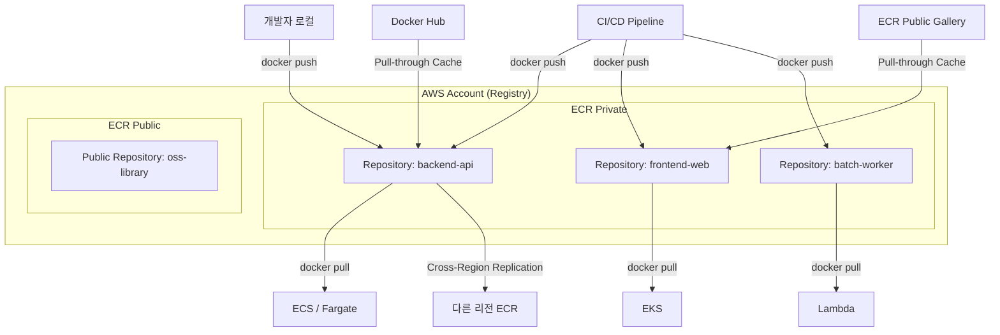
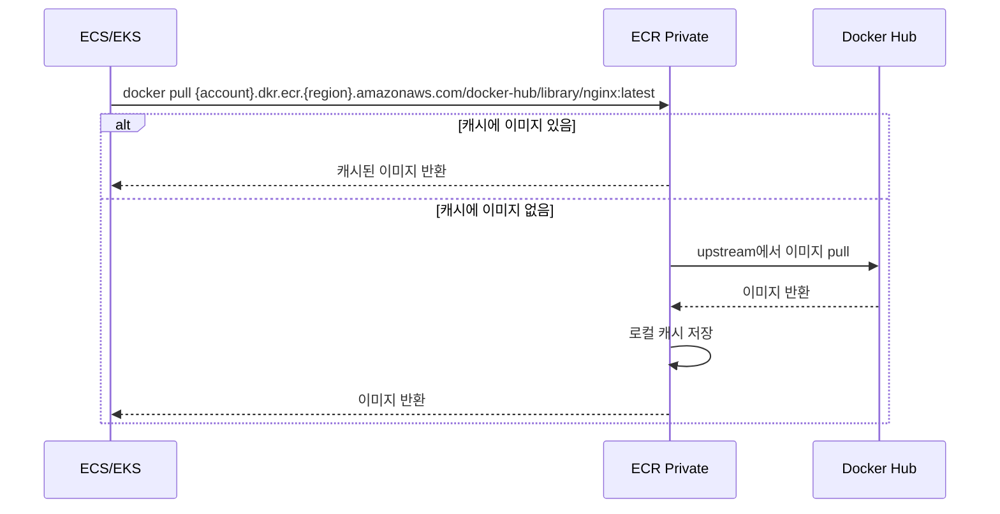

# AWS ECR (Elastic Container Registry)

## 개요

AWS ECR은 Docker 컨테이너 이미지를 저장하고 관리하는 완전 관리형 레지스트리 서비스다. AWS 생태계와 통합되어 ECS, EKS, Lambda 등에서 바로 사용할 수 있다.

Docker Hub나 자체 Harbor를 운영하는 것과 비교하면, IAM 기반 인증이 자연스럽게 붙고, 같은 리전 내 ECS/EKS에서 pull할 때 네트워크 비용이 없다는 게 가장 큰 장점이다. 대신 ECR 로그인 토큰이 12시간마다 만료되는 점, 리전별로 별도 레지스트리가 생기는 점은 처음에 헷갈릴 수 있다.

## 아키텍처



### 기본 구조

```
Registry (AWS 계정당 1개, 리전별 분리)
  ├── Private Repository
  │     ├── Image (OCI 이미지 또는 Docker 이미지)
  │     │     ├── Tag (v1.2.3, latest, git-sha 등)
  │     │     └── Digest (sha256:abc123... 불변 식별자)
  │     └── Image Layer (공유 가능, 중복 제거됨)
  └── Public Repository (ECR Public Gallery)
        └── 누구나 pull 가능, push는 소유자만
```

레지스트리 URI 형식은 `{account_id}.dkr.ecr.{region}.amazonaws.com`이다. 계정 ID가 포함되어 있어서, 멀티 계정 환경에서 어떤 계정의 이미지인지 URI만 봐도 구분할 수 있다.

## ECR Private vs ECR Public

| 구분 | ECR Private | ECR Public |
|------|-------------|------------|
| 접근 범위 | 같은 계정 또는 명시적으로 권한 부여된 계정만 | 인터넷에서 누구나 pull 가능 |
| 인증 | IAM 기반, `get-login-password` 필요 | pull은 인증 없이 가능, push는 IAM 필요 |
| URI 형식 | `{account}.dkr.ecr.{region}.amazonaws.com/{repo}` | `public.ecr.aws/{alias}/{repo}` |
| 비용 | 스토리지 + 데이터 전송 | 월 50GB 무료 전송, 인증 시 500GB |
| 수명 주기 정책 | 지원 | 미지원 |
| 이미지 스캔 | 지원 (Basic + Enhanced) | Basic만 지원 |
| 복제 | Cross-Region, Cross-Account 지원 | 미지원 |

실무에서 ECR Public을 쓰는 경우는 오픈소스 프로젝트의 베이스 이미지를 배포하거나, 사내 공용 라이브러리 이미지를 외부 파트너에게 공유할 때 정도다. 대부분의 서비스 이미지는 Private을 쓴다.

### ECR Public 사용

```bash
# ECR Public 로그인 (us-east-1 고정)
aws ecr-public get-login-password --region us-east-1 | \
  docker login --username AWS --password-stdin public.ecr.aws

# Public 리포지토리 생성
aws ecr-public create-repository \
  --repository-name my-oss-tool \
  --region us-east-1

# 이미지 푸시
docker tag my-oss-tool:latest public.ecr.aws/a1b2c3d4/my-oss-tool:latest
docker push public.ecr.aws/a1b2c3d4/my-oss-tool:latest
```

ECR Public은 **us-east-1에서만 관리 API를 호출**할 수 있다. 다른 리전에서 `ecr-public` 명령어를 실행하면 에러가 난다. pull은 어디서든 가능하다.

## 기본 사용법

### 리포지토리 생성

```bash
# AWS CLI로 리포지토리 생성
aws ecr create-repository \
  --repository-name my-app \
  --region ap-northeast-2

# 이미지 스캔 + Immutable Tag 활성화
aws ecr create-repository \
  --repository-name my-app \
  --image-scanning-configuration scanOnPush=true \
  --image-tag-mutability IMMUTABLE \
  --encryption-configuration encryptionType=AES256
```

### 이미지 푸시

```bash
# 1. ECR 로그인 (토큰 유효기간: 12시간)
aws ecr get-login-password --region ap-northeast-2 | \
  docker login --username AWS --password-stdin 123456789012.dkr.ecr.ap-northeast-2.amazonaws.com

# 2. 이미지 빌드
docker build -t my-app:latest .

# 3. 이미지 태깅
docker tag my-app:latest \
  123456789012.dkr.ecr.ap-northeast-2.amazonaws.com/my-app:latest

# 4. 이미지 푸시
docker push 123456789012.dkr.ecr.ap-northeast-2.amazonaws.com/my-app:latest
```

### 이미지 풀

```bash
docker pull 123456789012.dkr.ecr.ap-northeast-2.amazonaws.com/my-app:latest
```

## Immutable Tag

태그 불변성(Immutable Tag)을 설정하면, 이미 존재하는 태그로 다른 이미지를 덮어쓸 수 없다. 프로덕션 환경에서 `v1.2.3` 태그가 가리키는 이미지가 바뀌는 사고를 방지한다.

### 설정 방법

```bash
# 리포지토리 생성 시 설정
aws ecr create-repository \
  --repository-name my-app \
  --image-tag-mutability IMMUTABLE

# 기존 리포지토리에 적용
aws ecr put-image-tag-mutability \
  --repository-name my-app \
  --image-tag-mutability IMMUTABLE
```

### 동작 방식

Immutable Tag가 켜진 상태에서 같은 태그로 push하면 `ImageTagAlreadyExistsException` 에러가 발생한다.

```
Error: tag invalid: The image tag 'v1.2.3' already exists in the 'my-app'
repository and cannot be overwritten because the repository is immutable.
```

실무에서 주의할 점:

- `latest` 태그를 쓰는 워크플로우와 Immutable Tag는 같이 쓸 수 없다. `latest`는 매번 덮어쓰는 태그니까.
- CI/CD에서 git commit SHA나 빌드 번호로 태깅하는 방식과 조합하면 잘 맞는다.
- Immutable을 켜두면 "잘못된 이미지를 같은 태그로 다시 push"하는 것이 불가능하므로, 새 태그를 만들어야 한다.

## Repository Policy (리포지토리 정책)

Repository Policy는 리소스 기반 정책(Resource-based Policy)으로, 특정 리포지토리에 대해 다른 AWS 계정이나 IAM 엔티티의 접근 권한을 세밀하게 제어한다.

IAM 정책과 Repository Policy는 다른 것이다. IAM 정책은 "이 사용자가 무엇을 할 수 있는가"를 정의하고, Repository Policy는 "이 리포지토리에 누가 접근할 수 있는가"를 정의한다. 둘 다 Allow가 있어야 실제로 접근이 된다.

### 크로스 계정 이미지 공유

가장 많이 쓰는 패턴이다. 개발 계정에서 빌드한 이미지를 스테이징/프로덕션 계정에서 pull하는 경우:

```json
{
  "Version": "2012-10-17",
  "Statement": [
    {
      "Sid": "AllowPullFromProdAccount",
      "Effect": "Allow",
      "Principal": {
        "AWS": "arn:aws:iam::111122223333:root"
      },
      "Action": [
        "ecr:GetDownloadUrlForLayer",
        "ecr:BatchGetImage",
        "ecr:BatchCheckLayerAvailability"
      ]
    }
  ]
}
```

```bash
# 정책 적용
aws ecr set-repository-policy \
  --repository-name my-app \
  --policy-text file://repo-policy.json
```

### 특정 IAM 역할에만 push 허용

```json
{
  "Version": "2012-10-17",
  "Statement": [
    {
      "Sid": "AllowPushFromCIRole",
      "Effect": "Allow",
      "Principal": {
        "AWS": "arn:aws:iam::123456789012:role/ci-deploy-role"
      },
      "Action": [
        "ecr:PutImage",
        "ecr:InitiateLayerUpload",
        "ecr:UploadLayerPart",
        "ecr:CompleteLayerUpload",
        "ecr:BatchCheckLayerAvailability"
      ]
    }
  ]
}
```

### AWS 서비스에 접근 허용 (Lambda, CodeBuild 등)

```json
{
  "Version": "2012-10-17",
  "Statement": [
    {
      "Sid": "AllowLambdaPull",
      "Effect": "Allow",
      "Principal": {
        "Service": "lambda.amazonaws.com"
      },
      "Action": [
        "ecr:GetDownloadUrlForLayer",
        "ecr:BatchGetImage"
      ],
      "Condition": {
        "StringLike": {
          "aws:sourceArn": "arn:aws:lambda:ap-northeast-2:123456789012:function:*"
        }
      }
    }
  ]
}
```

## Pull-through Cache

Pull-through Cache는 Docker Hub, GitHub Container Registry, ECR Public 등 외부 레지스트리의 이미지를 ECR Private에 자동으로 캐싱하는 기능이다.

외부 레지스트리에서 이미지를 pull할 때 rate limit에 걸리거나, 네트워크 지연이 발생하는 문제를 해결한다. Docker Hub의 경우 익명 사용자는 6시간에 100회 pull 제한이 있는데, 서비스 규모가 커지면 이 제한에 금방 걸린다.

### Pull-through Cache 흐름



### 설정 방법

```bash
# Docker Hub용 Pull-through Cache 규칙 생성
aws ecr create-pull-through-cache-rule \
  --ecr-repository-prefix docker-hub \
  --upstream-registry-url registry-1.docker.io \
  --credential-arn arn:aws:secretsmanager:ap-northeast-2:123456789012:secret:dockerhub-creds

# ECR Public용 규칙
aws ecr create-pull-through-cache-rule \
  --ecr-repository-prefix ecr-public \
  --upstream-registry-url public.ecr.aws

# GitHub Container Registry용 규칙
aws ecr create-pull-through-cache-rule \
  --ecr-repository-prefix ghcr \
  --upstream-registry-url ghcr.io \
  --credential-arn arn:aws:secretsmanager:ap-northeast-2:123456789012:secret:ghcr-token
```

### 사용 방법

Pull-through Cache 규칙을 만들면, URI 앞에 ECR 주소와 prefix를 붙여서 pull하면 된다.

```bash
# 기존: Docker Hub에서 직접 pull
docker pull nginx:latest

# 변경: ECR Pull-through Cache 경유
docker pull 123456789012.dkr.ecr.ap-northeast-2.amazonaws.com/docker-hub/library/nginx:latest

# GitHub Container Registry 이미지
docker pull 123456789012.dkr.ecr.ap-northeast-2.amazonaws.com/ghcr/actions/runner:latest
```

처음 pull할 때는 upstream에서 가져오느라 시간이 걸리지만, 이후에는 ECR에서 바로 가져온다. 캐시된 이미지는 일반 ECR 이미지와 동일하게 수명 주기 정책을 적용할 수 있다.

### Pull-through Cache 규칙 조회/삭제

```bash
# 규칙 목록 조회
aws ecr describe-pull-through-cache-rules

# 규칙 삭제
aws ecr delete-pull-through-cache-rule \
  --ecr-repository-prefix docker-hub
```

## OCI 아티팩트 지원

ECR은 Docker 이미지 외에 OCI(Open Container Initiative) 호환 아티팩트도 저장할 수 있다. Helm 차트, WASM 모듈, 서명 데이터(cosign), SBOM 등을 같은 레지스트리에서 관리할 수 있다는 뜻이다.

### Helm 차트 저장

```bash
# Helm 차트를 OCI로 push
helm package my-chart/
helm push my-chart-0.1.0.tgz oci://123456789012.dkr.ecr.ap-northeast-2.amazonaws.com

# Helm 차트 pull
helm pull oci://123456789012.dkr.ecr.ap-northeast-2.amazonaws.com/my-chart --version 0.1.0

# Helm 차트로 직접 설치
helm install my-release oci://123456789012.dkr.ecr.ap-northeast-2.amazonaws.com/my-chart --version 0.1.0
```

### cosign으로 이미지 서명

```bash
# cosign으로 ECR 이미지 서명
cosign sign 123456789012.dkr.ecr.ap-northeast-2.amazonaws.com/my-app:v1.2.3

# 서명 검증
cosign verify 123456789012.dkr.ecr.ap-northeast-2.amazonaws.com/my-app:v1.2.3
```

서명 데이터는 같은 리포지토리에 `sha256-{digest}.sig` 형태의 태그로 저장된다. Immutable Tag를 켜둔 리포지토리에서는 cosign 서명이 실패할 수 있으니 주의한다.

## 태깅

### 시맨틱 버저닝

```bash
# 메이저.마이너.패치 형식
docker tag my-app:latest \
  123456789012.dkr.ecr.ap-northeast-2.amazonaws.com/my-app:1.2.3

# 환경별 태그
docker tag my-app:latest \
  123456789012.dkr.ecr.ap-northeast-2.amazonaws.com/my-app:prod-1.2.3
```

### Git 커밋 해시 태깅

```bash
# CI/CD 파이프라인에서 자동 태깅
COMMIT_SHA=$(git rev-parse --short HEAD)
docker tag my-app:latest \
  123456789012.dkr.ecr.ap-northeast-2.amazonaws.com/my-app:${COMMIT_SHA}
```

### 빌드 번호 태깅

```bash
BUILD_NUMBER=123
docker tag my-app:latest \
  123456789012.dkr.ecr.ap-northeast-2.amazonaws.com/my-app:build-${BUILD_NUMBER}
```

실무에서 가장 많이 보는 조합은 `git SHA + latest` 또는 `시맨틱 버전 + git SHA`다. `latest`만 쓰는 건 롤백할 때 어떤 버전으로 돌아가야 하는지 알 수 없으니 피한다.

## 이미지 관리

### 이미지 목록 조회

```bash
# 리포지토리 목록
aws ecr describe-repositories

# 특정 리포지토리의 이미지 목록
aws ecr list-images \
  --repository-name my-app \
  --region ap-northeast-2

# 특정 이미지의 상세 정보 (크기, 스캔 결과 등)
aws ecr describe-images \
  --repository-name my-app \
  --image-ids imageTag=latest
```

### 이미지 삭제

```bash
# 특정 태그 삭제
aws ecr batch-delete-image \
  --repository-name my-app \
  --image-ids imageTag=old-version

# 여러 이미지 일괄 삭제
aws ecr batch-delete-image \
  --repository-name my-app \
  --image-ids \
    imageTag=v1.0.0 \
    imageTag=v1.0.1 \
    imageTag=v1.0.2
```

## 수명 주기 정책

오래된 이미지가 쌓이면 스토리지 비용이 늘어난다. 수명 주기 정책으로 자동 정리 규칙을 설정한다.

```json
{
  "rules": [
    {
      "rulePriority": 1,
      "description": "prod 태그 이미지는 최근 20개만 유지",
      "selection": {
        "tagStatus": "tagged",
        "tagPrefixList": ["prod-"],
        "countType": "imageCountMoreThan",
        "countNumber": 20
      },
      "action": {
        "type": "expire"
      }
    },
    {
      "rulePriority": 2,
      "description": "태그 없는 이미지는 7일 후 삭제",
      "selection": {
        "tagStatus": "untagged",
        "countType": "sinceImagePushed",
        "countUnit": "days",
        "countNumber": 7
      },
      "action": {
        "type": "expire"
      }
    },
    {
      "rulePriority": 10,
      "description": "나머지 이미지는 최근 10개만 유지",
      "selection": {
        "tagStatus": "any",
        "countType": "imageCountMoreThan",
        "countNumber": 10
      },
      "action": {
        "type": "expire"
      }
    }
  ]
}
```

```bash
# 정책 적용
aws ecr put-lifecycle-policy \
  --repository-name my-app \
  --lifecycle-policy-text file://lifecycle-policy.json

# 정책 미리보기 (실제 삭제 없이 어떤 이미지가 대상인지 확인)
aws ecr get-lifecycle-policy-preview \
  --repository-name my-app
```

수명 주기 정책에서 `rulePriority` 숫자가 작을수록 먼저 평가된다. 규칙 간 충돌이 있으면 우선순위가 높은 규칙이 이긴다. `tagPrefixList`로 특정 접두사를 가진 태그만 대상으로 할 수 있어서, prod 이미지는 오래 보관하고 dev 이미지는 빨리 정리하는 식으로 분리할 수 있다.

## 보안

### IAM 정책 예제

```json
{
  "Version": "2012-10-17",
  "Statement": [
    {
      "Sid": "AllowPull",
      "Effect": "Allow",
      "Action": [
        "ecr:GetAuthorizationToken",
        "ecr:BatchCheckLayerAvailability",
        "ecr:GetDownloadUrlForLayer",
        "ecr:BatchGetImage"
      ],
      "Resource": "*"
    },
    {
      "Sid": "AllowPushToSpecificRepo",
      "Effect": "Allow",
      "Action": [
        "ecr:PutImage",
        "ecr:InitiateLayerUpload",
        "ecr:UploadLayerPart",
        "ecr:CompleteLayerUpload"
      ],
      "Resource": "arn:aws:ecr:ap-northeast-2:123456789012:repository/my-app"
    }
  ]
}
```

`ecr:GetAuthorizationToken`은 Resource를 `*`로 설정해야 한다. 특정 리포지토리로 제한하면 로그인 자체가 안 된다. 이건 ECR 인증 토큰이 레지스트리 단위로 발급되기 때문이다.

### 이미지 스캔

```bash
# 수동 스캔 시작
aws ecr start-image-scan \
  --repository-name my-app \
  --image-id imageTag=latest

# 스캔 결과 조회
aws ecr describe-image-scan-findings \
  --repository-name my-app \
  --image-id imageTag=latest
```

Basic 스캔은 Clair 기반으로 OS 패키지 취약점만 검사한다. Enhanced 스캔은 Amazon Inspector를 사용해서 OS 패키지와 프로그래밍 언어 패키지(npm, pip, Maven 등) 취약점까지 검사한다. Enhanced 스캔은 별도 비용이 발생한다.

### VPC 엔드포인트 설정

프라이빗 서브넷에서 ECR에 접근하려면 VPC 엔드포인트가 필요하다. ECR은 두 개의 엔드포인트를 모두 만들어야 정상 동작한다.

```bash
# ECR API 엔드포인트 (인증, 이미지 메타데이터)
aws ec2 create-vpc-endpoint \
  --vpc-id vpc-12345678 \
  --service-name com.amazonaws.ap-northeast-2.ecr.api \
  --vpc-endpoint-type Interface \
  --subnet-ids subnet-12345678 \
  --security-group-ids sg-12345678

# ECR Docker 엔드포인트 (이미지 레이어 다운로드)
aws ec2 create-vpc-endpoint \
  --vpc-id vpc-12345678 \
  --service-name com.amazonaws.ap-northeast-2.ecr.dkr \
  --vpc-endpoint-type Interface \
  --subnet-ids subnet-12345678 \
  --security-group-ids sg-12345678

# S3 Gateway 엔드포인트 (이미지 레이어는 실제로 S3에 저장됨)
aws ec2 create-vpc-endpoint \
  --vpc-id vpc-12345678 \
  --service-name com.amazonaws.ap-northeast-2.s3 \
  --route-table-ids rtb-12345678
```

`ecr.api`, `ecr.dkr`, `s3` 세 개 중 하나라도 빠지면 이미지 pull이 실패한다. 특히 S3 Gateway 엔드포인트를 빠뜨리는 경우가 많은데, ECR 이미지 레이어가 S3에 저장되기 때문에 반드시 필요하다.

## CI/CD 통합

### GitHub Actions 예제

```yaml
name: Build and Push to ECR

on:
  push:
    branches: [ main ]

jobs:
  build:
    runs-on: ubuntu-latest
    steps:
      - uses: actions/checkout@v4

      - name: Configure AWS credentials
        uses: aws-actions/configure-aws-credentials@v4
        with:
          role-to-assume: arn:aws:iam::123456789012:role/github-actions-role
          aws-region: ap-northeast-2

      - name: Login to Amazon ECR
        id: login-ecr
        uses: aws-actions/amazon-ecr-login@v2

      - name: Build, tag, and push image
        env:
          ECR_REGISTRY: ${{ steps.login-ecr.outputs.registry }}
          ECR_REPOSITORY: my-app
          IMAGE_TAG: ${{ github.sha }}
        run: |
          docker build -t $ECR_REGISTRY/$ECR_REPOSITORY:$IMAGE_TAG .
          docker tag $ECR_REGISTRY/$ECR_REPOSITORY:$IMAGE_TAG $ECR_REGISTRY/$ECR_REPOSITORY:latest
          docker push $ECR_REGISTRY/$ECR_REPOSITORY:$IMAGE_TAG
          docker push $ECR_REGISTRY/$ECR_REPOSITORY:latest
```

GitHub Actions에서는 OIDC를 사용한 `role-to-assume` 방식이 Access Key 방식보다 안전하다. Access Key는 유출 위험이 있고 로테이션을 관리해야 하지만, OIDC는 임시 자격 증명을 자동 발급한다.

### Jenkins Pipeline 예제

```groovy
pipeline {
    agent any

    environment {
        AWS_REGION = 'ap-northeast-2'
        ECR_REGISTRY = '123456789012.dkr.ecr.ap-northeast-2.amazonaws.com'
        IMAGE_NAME = 'my-app'
    }

    stages {
        stage('Build and Push') {
            steps {
                script {
                    sh '''
                        aws ecr get-login-password --region ${AWS_REGION} | \
                        docker login --username AWS --password-stdin ${ECR_REGISTRY}

                        docker build -t ${IMAGE_NAME}:${BUILD_NUMBER} .
                        docker tag ${IMAGE_NAME}:${BUILD_NUMBER} \
                          ${ECR_REGISTRY}/${IMAGE_NAME}:${BUILD_NUMBER}
                        docker tag ${IMAGE_NAME}:${BUILD_NUMBER} \
                          ${ECR_REGISTRY}/${IMAGE_NAME}:latest

                        docker push ${ECR_REGISTRY}/${IMAGE_NAME}:${BUILD_NUMBER}
                        docker push ${ECR_REGISTRY}/${IMAGE_NAME}:latest
                    '''
                }
            }
        }
    }
}
```

## ECS/EKS 연동

### ECS Task Definition에서 사용

```json
{
  "family": "my-app",
  "containerDefinitions": [
    {
      "name": "my-app",
      "image": "123456789012.dkr.ecr.ap-northeast-2.amazonaws.com/my-app:latest",
      "cpu": 256,
      "memory": 512,
      "essential": true,
      "portMappings": [
        {
          "containerPort": 80,
          "protocol": "tcp"
        }
      ]
    }
  ],
  "executionRoleArn": "arn:aws:iam::123456789012:role/ecsTaskExecutionRole",
  "requiresCompatibilities": ["FARGATE"],
  "networkMode": "awsvpc",
  "cpu": "256",
  "memory": "512"
}
```

`executionRoleArn`에 지정된 역할에 ECR pull 권한이 있어야 한다. AWS 관리형 정책 `AmazonECSTaskExecutionRolePolicy`에 ECR 관련 권한이 포함되어 있다.

### EKS Deployment에서 사용

```yaml
apiVersion: apps/v1
kind: Deployment
metadata:
  name: my-app
spec:
  replicas: 3
  selector:
    matchLabels:
      app: my-app
  template:
    metadata:
      labels:
        app: my-app
    spec:
      containers:
      - name: my-app
        image: 123456789012.dkr.ecr.ap-northeast-2.amazonaws.com/my-app:v1.2.3
        ports:
        - containerPort: 80
```

EKS에서 ECR 이미지를 pull하려면 노드의 Instance Profile에 ECR 권한이 있거나, IRSA(IAM Roles for Service Accounts)를 설정해야 한다. EKS 관리형 노드 그룹을 쓰면 기본적으로 ECR pull 권한이 포함된다.

## 비용 최적화

### 이미지 레이어 최적화

```dockerfile
# 멀티스테이지 빌드로 이미지 크기 최소화
FROM node:18-alpine AS builder
WORKDIR /app
COPY package*.json ./
RUN npm ci
COPY . .
RUN npm run build

FROM node:18-alpine
WORKDIR /app
COPY --from=builder /app/dist ./dist
COPY --from=builder /app/node_modules ./node_modules
COPY package*.json ./
EXPOSE 3000
CMD ["node", "dist/index.js"]
```

ECR 스토리지 비용은 GB당 월 $0.10이다. 멀티스테이지 빌드로 이미지 크기를 줄이고, 수명 주기 정책으로 오래된 이미지를 정리하는 것이 비용 절감의 기본이다.

### 크로스 리전 복제

```bash
# 레지스트리 수준에서 복제 설정
aws ecr put-replication-configuration \
  --replication-configuration '{
    "rules": [
      {
        "destinations": [
          {
            "region": "us-east-1",
            "registryId": "123456789012"
          }
        ],
        "repositoryFilters": [
          {
            "filter": "prod-",
            "filterType": "PREFIX_MATCH"
          }
        ]
      }
    ]
  }'
```

복제 대상을 `repositoryFilters`로 제한하면 불필요한 복제를 줄일 수 있다. `prod-` 접두사가 붙은 리포지토리만 복제하는 식이다. 복제된 이미지도 스토리지 비용이 발생하므로, 실제로 다른 리전에서 pull하는 이미지만 복제한다.

## 트러블슈팅

### ECR 로그인 실패

**증상**: `no basic auth credentials` 또는 `denied: Your authorization token has expired`

```bash
# 토큰 만료 확인 - ECR 토큰은 12시간 유효
aws ecr get-login-password --region ap-northeast-2 | \
  docker login --username AWS --password-stdin 123456789012.dkr.ecr.ap-northeast-2.amazonaws.com

# AWS 자격 증명 확인
aws sts get-caller-identity
```

흔한 원인:

- CI/CD 파이프라인이 오래 걸려서 로그인 후 12시간이 지남. 빌드 직전에 로그인하도록 순서를 조정한다.
- `~/.docker/config.json`에 다른 레지스트리 자격 증명이 충돌하는 경우가 있다. `docker logout`하고 다시 로그인한다.
- IAM 사용자/역할에 `ecr:GetAuthorizationToken` 권한이 없다. 이 권한은 Resource를 `*`로 설정해야 한다.

### 이미지 push 실패

**증상**: `denied: User: arn:aws:iam::123456789012:user/dev is not authorized to perform: ecr:InitiateLayerUpload`

```bash
# 필요한 push 권한 확인
# ecr:PutImage, ecr:InitiateLayerUpload, ecr:UploadLayerPart,
# ecr:CompleteLayerUpload, ecr:BatchCheckLayerAvailability
# 5개 액션이 모두 있어야 push가 된다

# 리포지토리 존재 여부 확인
aws ecr describe-repositories --repository-names my-app
```

리포지토리가 존재하지 않을 때도 push가 실패한다. Docker Hub와 달리 ECR은 리포지토리를 미리 만들어야 한다. CI/CD에서 리포지토리가 없으면 자동 생성하는 스크립트를 넣어두면 편하다:

```bash
aws ecr describe-repositories --repository-names my-app 2>/dev/null || \
  aws ecr create-repository --repository-name my-app
```

### 이미지 pull 실패

**증상**: ECS 태스크가 `CannotPullContainerError`로 실패

```
CannotPullContainerError: Error response from daemon:
pull access denied for 123456789012.dkr.ecr.ap-northeast-2.amazonaws.com/my-app,
repository does not exist or may require 'docker login'
```

확인 순서:

1. **이미지 URI 오타**: 계정 ID, 리전, 리포지토리 이름, 태그를 하나씩 확인한다. 특히 리전이 다른 경우가 많다.
2. **Task Execution Role 권한**: ECS의 `executionRoleArn`에 ECR pull 권한이 있는지 확인한다.
3. **VPC 네트워크**: 프라이빗 서브넷이면 VPC 엔드포인트(ecr.api, ecr.dkr, s3)가 모두 있는지 확인한다.
4. **보안 그룹**: VPC 엔드포인트의 보안 그룹이 443 포트 인바운드를 허용하는지 확인한다.

```bash
# Task Execution Role 정책 확인
aws iam list-attached-role-policies --role-name ecsTaskExecutionRole

# VPC 엔드포인트 확인
aws ec2 describe-vpc-endpoints \
  --filters "Name=service-name,Values=com.amazonaws.ap-northeast-2.ecr.*"
```

### docker credential helper 충돌

macOS에서 `docker-credential-osxkeychain` 또는 `docker-credential-desktop`이 ECR 자격 증명과 충돌하는 경우가 있다.

```bash
# ~/.docker/config.json에서 credsStore 확인
cat ~/.docker/config.json

# ECR credential helper 사용 시
# amazon-ecr-credential-helper 설치 후 config.json 수정
{
  "credHelpers": {
    "123456789012.dkr.ecr.ap-northeast-2.amazonaws.com": "ecr-login"
  }
}
```

`amazon-ecr-credential-helper`를 쓰면 `docker login` 없이 자동으로 ECR 인증이 처리된다. 로컬 개발 환경에서 토큰 만료를 신경 쓸 필요가 없어진다.

### 이미지 크기 관련 push 타임아웃

큰 이미지(수 GB 이상)를 push할 때 타임아웃이 발생할 수 있다.

```bash
# 이미지 크기 확인
docker images --format "table {{.Repository}}\t{{.Tag}}\t{{.Size}}"

# 레이어별 크기 확인
docker history my-app:latest
```

이미지가 1GB를 넘으면 멀티스테이지 빌드를 적용하거나 베이스 이미지를 alpine 계열로 바꾸는 것을 고려한다. 빌드 도구, 소스코드, 테스트 파일이 최종 이미지에 포함되지 않도록 `.dockerignore`도 확인한다.

## 모니터링

### CloudWatch 메트릭

```bash
# 리포지토리별 이미지 수 확인
aws ecr describe-images \
  --repository-name my-app \
  --query 'imageDetails | length(@)'

# 리포지토리 전체 크기 계산 (바이트)
aws ecr describe-images \
  --repository-name my-app \
  --query 'sum(imageDetails[].imageSizeInBytes)'
```

### CloudTrail로 API 호출 추적

누가 언제 이미지를 push/pull했는지 CloudTrail 로그로 확인할 수 있다. `PutImage`, `BatchGetImage` 이벤트를 필터링하면 된다.

```bash
aws cloudtrail lookup-events \
  --lookup-attributes AttributeKey=EventName,AttributeValue=PutImage \
  --start-time 2026-04-13T00:00:00Z \
  --end-time 2026-04-14T23:59:59Z
```

## 주요 명령어 정리

```bash
# 리포지토리 생성
aws ecr create-repository --repository-name <name>

# 로그인
aws ecr get-login-password | docker login --username AWS --password-stdin <registry-url>

# 이미지 목록
aws ecr list-images --repository-name <name>

# 이미지 삭제
aws ecr batch-delete-image --repository-name <name> --image-ids imageTag=<tag>

# 수명 주기 정책 설정
aws ecr put-lifecycle-policy --repository-name <name> --lifecycle-policy-text file://policy.json

# 이미지 스캔
aws ecr start-image-scan --repository-name <name> --image-id imageTag=<tag>

# Immutable Tag 설정
aws ecr put-image-tag-mutability --repository-name <name> --image-tag-mutability IMMUTABLE

# Repository Policy 설정
aws ecr set-repository-policy --repository-name <name> --policy-text file://policy.json

# Pull-through Cache 규칙 생성
aws ecr create-pull-through-cache-rule --ecr-repository-prefix <prefix> --upstream-registry-url <url>

# 복제 설정
aws ecr put-replication-configuration --replication-configuration file://replication.json
```

## 참고 자료

- **공식 문서**: https://docs.aws.amazon.com/ecr/
- **가격**: https://aws.amazon.com/ecr/pricing/
- **ECR Public Gallery**: https://gallery.ecr.aws/
