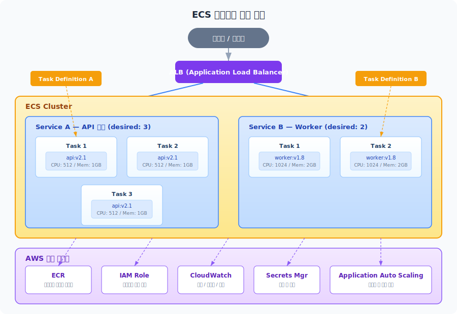
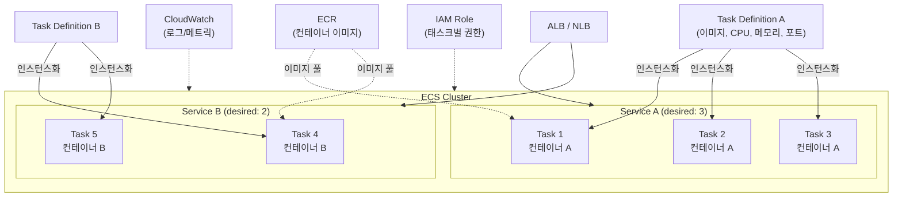
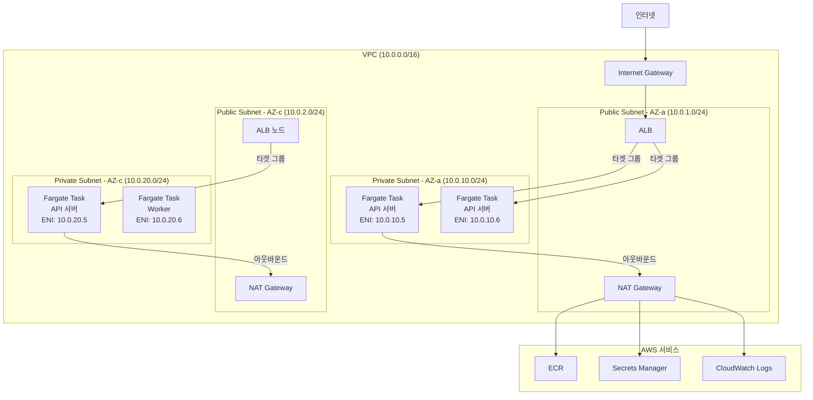
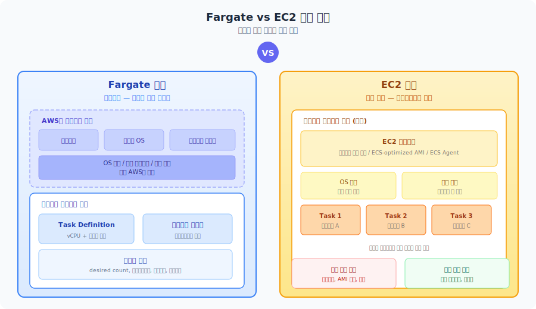
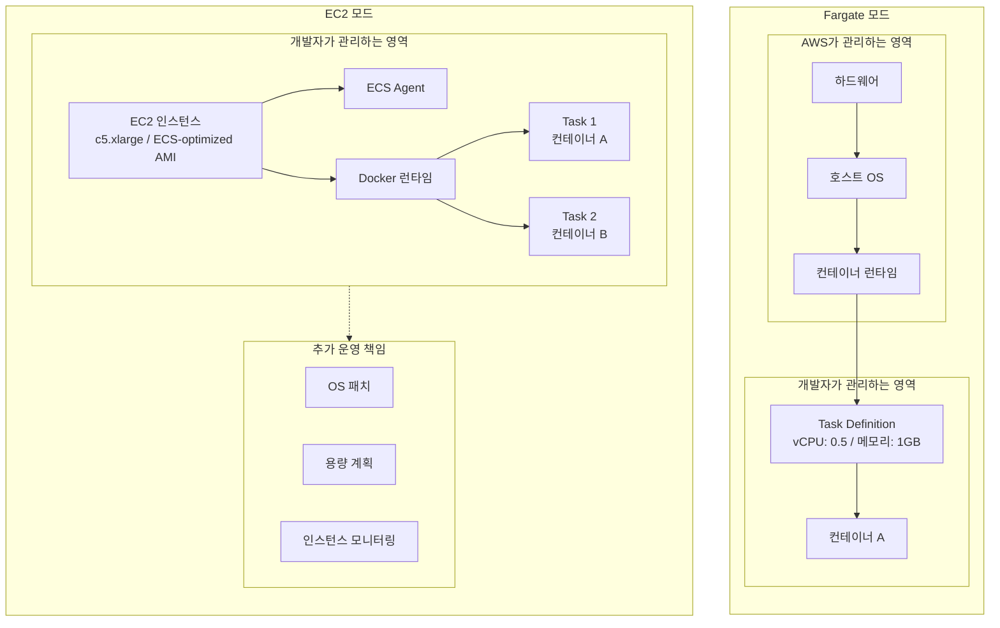
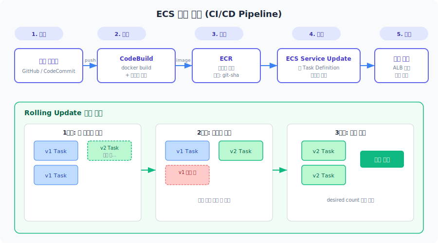
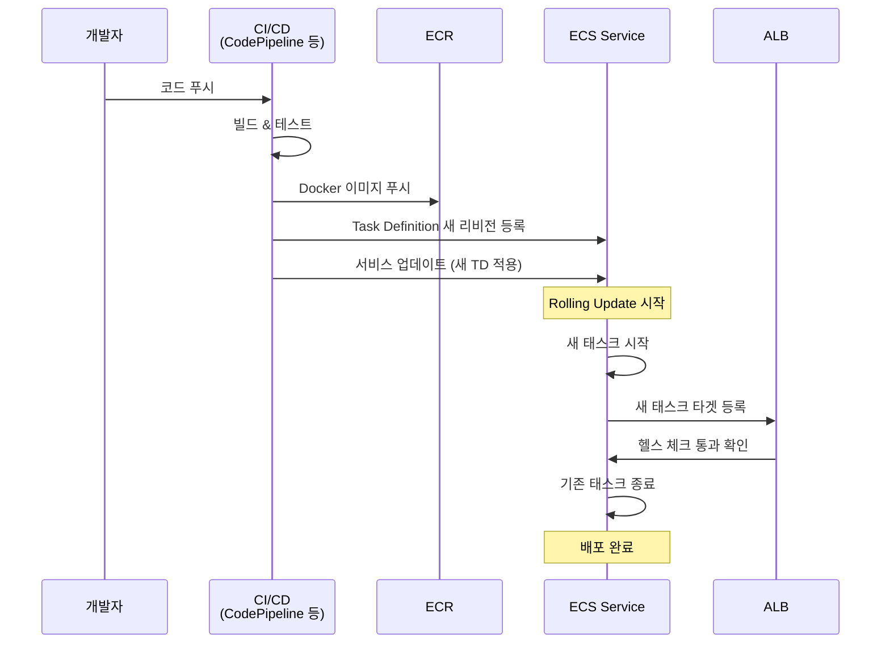
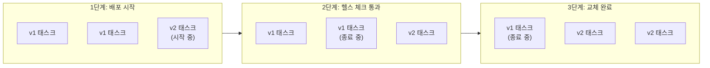
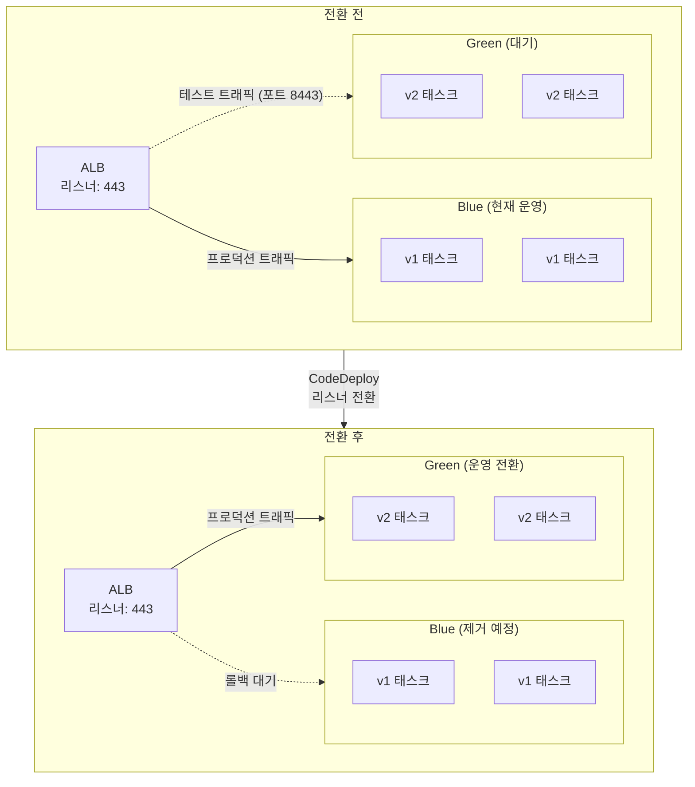
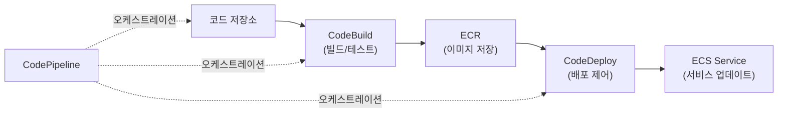

# AWS ECS (Elastic Container Service)

## 개요

- **정의**
  - AWS에서 제공하는 완전 관리형 컨테이너 오케스트레이션 서비스
  - Docker 컨테이너를 실행, 관리, 스케일링하기 위한 AWS 네이티브 플랫폼
- **핵심 철학**
  - 인프라(서버, 클러스터, 패치)를 AWS가 관리 → 개발자는 컨테이너와 비즈니스 로직에만 집중
- **특징 요약**
  - AWS 서비스(IAM, VPC, ALB, CloudWatch 등)와 통합이 잘 되어 있다
  - Fargate를 통한 서버리스 실행 옵션
  - 사용량 기반 과금

## ECS 아키텍처 전체 구조

ECS를 처음 접하면 구성 요소 간 관계가 헷갈리는 경우가 많다. 아래 다이어그램으로 전체 흐름을 먼저 파악하자.

### 구성 요소 관계도





- **Cluster**: 태스크와 서비스가 실행되는 최상위 논리 단위
- **Task Definition**: 컨테이너 실행 스펙. 이미지, CPU/메모리, 포트, 환경 변수, 볼륨 등을 정의한다. 버전 관리가 되므로 롤백이 가능하다
- **Task**: Task Definition의 실행 인스턴스. 하나 이상의 컨테이너로 구성된다
- **Service**: 원하는 태스크 개수(desired count)를 유지하는 관리 레이어. 헬스 체크 실패 시 태스크를 자동 교체하고, ALB/NLB와 연동해 트래픽을 분산한다
- **Container Instance**: EC2 모드에서 태스크가 실제로 올라가는 EC2 인스턴스. ECS Agent가 설치되어 있다. Fargate에서는 이 레이어가 추상화된다

### 실제 인프라 배치 구조

실무에서 ECS를 구성하면 VPC, 서브넷, AZ 경계 안에서 각 구성 요소가 배치된다. 아래는 프로덕션에서 흔히 볼 수 있는 배치 구조다.



이 구조에서 주목할 부분:

- ALB는 퍼블릭 서브넷에, Fargate 태스크는 프라이빗 서브넷에 배치한다
- 태스크가 ECR에서 이미지를 풀하거나 Secrets Manager에 접근하려면 NAT Gateway가 필요하다. VPC 엔드포인트를 쓰면 NAT를 거치지 않아 비용을 줄일 수 있다
- `awsvpc` 네트워크 모드에서 각 태스크는 자체 ENI를 받는다. 서브넷의 가용 IP가 부족하면 태스크가 뜨지 않는 상황이 발생한다. 서브넷 CIDR을 넉넉하게 잡아야 한다
- 2개 이상의 AZ에 태스크를 분산 배치해야 한쪽 AZ 장애 시에도 서비스가 유지된다

## ECS vs Kubernetes 비교

| 항목 | ECS | Kubernetes (EKS) |
|------|-----|-------------------|
| 관리 범위 | AWS가 컨트롤 플레인 관리 | 컨트롤 플레인은 EKS가 관리하지만 노드/애드온은 직접 관리 |
| AWS 통합 | 네이티브 통합, 설정이 단순 | AWS 위에서 동작하지만 K8s 자체 설정이 필요 |
| 학습 곡선 | AWS 경험자 기준 진입 장벽 낮음 | 개념/리소스 종류가 많아 학습 비용이 크다 |
| 멀티 클라우드 | AWS 전용 | 클라우드 중립적, 온프레미스에서도 동작 |
| 비용 예측 | 운영 비용 예측이 쉬움 | 클러스터 관리/운영 인력 비용이 추가로 든다 |
| 생태계 | AWS 서비스 범위 내 | Helm, Istio, ArgoCD 등 거대한 오픈소스 생태계 |

**선택 기준 정리**: AWS만 쓰고 운영 인력이 적다면 ECS가 현실적이다. 멀티 클라우드가 필요하거나 K8s 경험이 팀에 있다면 EKS를 고려한다.

## ECS 실행 모드

### Fargate vs EC2 모드 비교

두 모드의 차이는 "누가 인프라를 관리하는가"로 귀결된다. 아래 다이어그램은 같은 태스크를 각 모드에서 실행할 때 인프라 계층이 어떻게 달라지는지 보여준다.





Fargate는 Task Definition만 정의하면 끝이다. EC2 모드는 인스턴스 타입 선택, AMI 관리, OS 패치, 용량 계획까지 신경 써야 한다. 대신 EC2에서는 하나의 인스턴스에 여러 태스크를 올려서 리소스를 빽빽하게 채울 수 있고, 인스턴스 예약 할인도 적용된다.

| 비교 항목 | Fargate | EC2 모드 |
|-----------|---------|----------|
| 인프라 관리 | 없음 (AWS 담당) | 직접 관리 (패치, 모니터링) |
| 비용 구조 | 태스크 단위 과금 (vCPU + 메모리) | 인스턴스 단위 과금 |
| 비용 절감 | Fargate Spot (최대 ~70% 절감) | 예약 인스턴스, 스팟 인스턴스 |
| 스케일링 | 태스크 수만 조절하면 됨 | 태스크 수 + 인스턴스 수 둘 다 관리 |
| 커스터마이징 | 제한적 | 인스턴스 타입, AMI, 스토리지 자유 |
| GPU 사용 | 지원 안 됨 | 지원 |
| 시작 시간 | 수십 초~1분 (이미지 크기에 따라 다름) | 인스턴스가 이미 떠 있으면 빠름 |
| 적합한 워크로드 | 마이크로서비스, 배치, 개발/테스트 | GPU 워크로드, 대용량 장기 실행, 비용 최적화 필수 환경 |

실무에서는 Fargate로 시작해서, 비용이나 커스터마이징 문제가 생기면 EC2 모드로 전환하는 경우가 많다. 월 비용이 수백 달러 이하인 서비스라면 Fargate와 EC2의 비용 차이가 크지 않다. 태스크 수가 늘어나고 월 비용이 수천 달러를 넘기기 시작하면 EC2 모드 + 예약 인스턴스 조합이 비용 면에서 유리해진다.

### ECS Anywhere (하이브리드 모드)

온프레미스나 다른 클라우드의 서버에 ECS 태스크를 배치할 수 있다. 데이터 거버넌스/규제로 데이터가 온프레미스에 있어야 하는 경우, 레거시 시스템과 클라우드 간 하이브리드 아키텍처를 구성할 때 사용한다.

## 배포 흐름

ECS 서비스 배포의 전체 흐름을 다이어그램으로 정리하면 아래와 같다.





### 배포 방식 비교

**Rolling Update** (기본값)

- `minimumHealthyPercent`와 `maximumPercent`로 배포 속도를 제어한다
- 예: min 100%, max 200% → 새 태스크를 먼저 띄우고, 헬스 체크 통과 후 기존 태스크를 내린다
- 설정이 간단하고 추가 인프라가 필요 없다



**Blue/Green** (CodeDeploy 연동)

- 새 태스크 그룹을 완전히 띄운 뒤, ALB 리스너를 한 번에 전환한다
- 문제 발생 시 즉시 이전 버전으로 롤백 가능
- CodeDeploy와 연동해야 해서 설정이 복잡하다



Blue/Green에서 테스트 리스너(8443 등)로 Green 태스크 그룹에 먼저 트래픽을 보내서 검증할 수 있다. 문제가 없으면 프로덕션 리스너를 Green으로 전환하고, 문제가 생기면 다시 Blue로 되돌린다. 이 전환이 리스너 레벨에서 일어나기 때문에 롤백이 수 초 내에 완료된다.

대부분의 서비스는 Rolling Update로 충분하다. Blue/Green은 롤백 시간이 중요한 프로덕션 서비스에서 쓴다.

## AWS 서비스 통합

### IAM

- 태스크 단위로 IAM Role을 부여할 수 있다
- 최소 권한 원칙을 적용하기 좋은 구조다
- `executionRole`(ECS 에이전트가 ECR 풀, 로그 전송 등에 사용)과 `taskRole`(애플리케이션이 AWS API 호출 시 사용)을 구분해야 한다

### VPC 네트워킹

- `awsvpc` 네트워크 모드에서는 태스크마다 ENI가 할당된다
- 보안 그룹을 태스크 단위로 적용할 수 있어 네트워크 격리가 수월하다
- 프라이빗 서브넷에 태스크를 두고 ALB만 퍼블릭에 노출하는 패턴이 일반적이다

### 로드 밸런서 (ALB/NLB)

- 서비스 생성 시 타겟 그룹과 헬스 체크를 자동으로 연계한다
- 동적 포트 매핑을 지원한다 (EC2 모드에서 유용)

### CloudWatch

- 메트릭, 로그, 알람을 기본으로 연동할 수 있다
- Container Insights를 켜면 CPU/메모리/네트워크/디스크 메트릭을 수집한다

## 실무에서 주의할 점

### 아키텍처 설계

- 하나의 태스크 정의/서비스는 하나의 역할에 집중한다
- 애플리케이션 컨테이너는 상태를 가지지 않아야 한다. 상태는 DB, 캐시, S3 등 외부 스토리지에 저장한다
- 애플리케이션에 `/health` 엔드포인트를 반드시 구현한다. ECS와 ALB가 이걸 기반으로 정상/비정상을 판단한다

### 보안

- 태스크 Role에 필요한 권한만 부여한다
- 퍼블릭/프라이빗 서브넷을 분리하고 보안 그룹으로 인바운드/아웃바운드를 최소화한다
- 앱 코드에 비밀번호/키를 하드코딩하지 않는다. Secrets Manager나 SSM Parameter Store에서 주입한다

### 모니터링

- Container Insights를 활성화해서 CPU/메모리/네트워크 메트릭을 수집한다
- 로그는 JSON 형태로 구조화해서 검색/분석이 쉽게 한다
- CPU/메모리 사용률, 에러율, 태스크 재시작 횟수에 알람을 건다

### 비용

- 중단 허용 워크로드에는 Fargate Spot이나 스팟 인스턴스를 쓴다
- CloudWatch 메트릭을 보면서 리소스 할당량을 지속적으로 조정한다
- 오토 스케일링 정책을 실제 트래픽 패턴에 맞게 튜닝한다

## ECS 사용 시나리오

### 마이크로서비스 아키텍처

- 각 마이크로서비스를 별도 ECS 서비스로 분리한다
- Service Connect / AWS Cloud Map으로 서비스 디스커버리와 통신을 관리한다
- 독립 배포, 독립 스케일링, 장애 격리가 자연스럽게 된다

### 웹 애플리케이션 호스팅

- ALB + ECS 조합이 기본 패턴이다
- ALB가 여러 태스크로 트래픽을 분산하고, 헬스 체크 실패 태스크는 자동으로 제외한다

### 배치 작업

- Fargate 기반으로 필요할 때만 태스크를 실행하고, 종료 후에는 비용이 0이다
- EventBridge 스케줄러와 연동해 크론성 배치 작업을 구현한다

### CI/CD 파이프라인



CodePipeline + CodeBuild + CodeDeploy 조합으로 코드 변경 → 이미지 빌드 → ECR 푸시 → ECS 서비스 업데이트까지 자동화할 수 있다.

## 고급 기능

- **Service Connect**: 서비스 간 통신과 서비스 디스커버리를 단순화한다. Envoy 프록시 기반이다
- **ECS Exec**: 실행 중인 컨테이너에 직접 접속해서 디버깅할 수 있다. `aws ecs execute-command` 명령으로 사용한다
- **Capacity Providers**: Fargate + Fargate Spot 등 여러 용량 소스를 조합해서 사용한다
- **Task Placement Strategies**: EC2 모드에서 태스크를 어떤 인스턴스에 배치할지 제어한다 (spread, binpack, random)

## Task Definition 예제

### Fargate — Spring Boot API 서버

```json
{
  "family": "api-service",
  "networkMode": "awsvpc",
  "requiresCompatibilities": ["FARGATE"],
  "cpu": "512",
  "memory": "1024",
  "executionRoleArn": "arn:aws:iam::123456789012:role/ecsTaskExecutionRole",
  "taskRoleArn": "arn:aws:iam::123456789012:role/api-task-role",
  "containerDefinitions": [
    {
      "name": "api",
      "image": "123456789012.dkr.ecr.ap-northeast-2.amazonaws.com/api:latest",
      "portMappings": [
        {
          "containerPort": 8080,
          "protocol": "tcp"
        }
      ],
      "environment": [
        { "name": "SPRING_PROFILES_ACTIVE", "value": "prod" },
        { "name": "SERVER_PORT", "value": "8080" }
      ],
      "secrets": [
        {
          "name": "DB_PASSWORD",
          "valueFrom": "arn:aws:secretsmanager:ap-northeast-2:123456789012:secret:prod/db-password"
        },
        {
          "name": "REDIS_PASSWORD",
          "valueFrom": "arn:aws:ssm:ap-northeast-2:123456789012:parameter/prod/redis/password"
        }
      ],
      "logConfiguration": {
        "logDriver": "awslogs",
        "options": {
          "awslogs-group": "/ecs/api-service",
          "awslogs-region": "ap-northeast-2",
          "awslogs-stream-prefix": "ecs"
        }
      },
      "healthCheck": {
        "command": ["CMD-SHELL", "curl -f http://localhost:8080/actuator/health || exit 1"],
        "interval": 30,
        "timeout": 5,
        "retries": 3,
        "startPeriod": 60
      },
      "essential": true,
      "cpu": 512,
      "memory": 1024,
      "memoryReservation": 512
    }
  ]
}
```

### ECS Service 생성 (AWS CLI)

```bash
# 서비스 생성
aws ecs create-service \
  --cluster prod-cluster \
  --service-name api-service \
  --task-definition api-service:3 \
  --desired-count 2 \
  --launch-type FARGATE \
  --network-configuration "awsvpcConfiguration={
    subnets=[subnet-aaa,subnet-bbb],
    securityGroups=[sg-xxx],
    assignPublicIp=DISABLED
  }" \
  --load-balancers "targetGroupArn=arn:aws:elasticloadbalancing:...,containerName=api,containerPort=8080" \
  --deployment-configuration "minimumHealthyPercent=100,maximumPercent=200" \
  --deployment-controller "type=ECS"
```

### 오토 스케일링 설정

```bash
# Application Auto Scaling 등록
aws application-autoscaling register-scalable-target \
  --service-namespace ecs \
  --scalable-dimension ecs:service:DesiredCount \
  --resource-id service/prod-cluster/api-service \
  --min-capacity 2 \
  --max-capacity 10

# CPU 기반 스케일 아웃 정책
aws application-autoscaling put-scaling-policy \
  --policy-name api-cpu-scale-out \
  --service-namespace ecs \
  --scalable-dimension ecs:service:DesiredCount \
  --resource-id service/prod-cluster/api-service \
  --policy-type TargetTrackingScaling \
  --target-tracking-scaling-policy-configuration '{
    "TargetValue": 60.0,
    "PredefinedMetricSpecification": {
      "PredefinedMetricType": "ECSServiceAverageCPUUtilization"
    },
    "ScaleOutCooldown": 60,
    "ScaleInCooldown": 300
  }'
```

### CDK로 ECS Fargate 서비스 정의 (TypeScript)

```typescript
import * as cdk from 'aws-cdk-lib';
import * as ecs from 'aws-cdk-lib/aws-ecs';
import * as ecsPatterns from 'aws-cdk-lib/aws-ecs-patterns';

const taskDefinition = new ecs.FargateTaskDefinition(this, 'ApiTaskDef', {
  memoryLimitMiB: 1024,
  cpu: 512,
  executionRole: executionRole,
  taskRole: taskRole,
});

taskDefinition.addContainer('api', {
  image: ecs.ContainerImage.fromEcrRepository(repo, 'latest'),
  portMappings: [{ containerPort: 8080 }],
  environment: {
    SPRING_PROFILES_ACTIVE: 'prod',
  },
  secrets: {
    DB_PASSWORD: ecs.Secret.fromSecretsManager(dbSecret),
  },
  logging: ecs.LogDrivers.awsLogs({
    streamPrefix: 'ecs',
    logGroup: logGroup,
  }),
  healthCheck: {
    command: ['CMD-SHELL', 'curl -f http://localhost:8080/actuator/health || exit 1'],
    interval: cdk.Duration.seconds(30),
    timeout: cdk.Duration.seconds(5),
    retries: 3,
    startPeriod: cdk.Duration.seconds(60),
  },
});

// ALB + Fargate Service 패턴
const service = new ecsPatterns.ApplicationLoadBalancedFargateService(this, 'ApiService', {
  cluster,
  taskDefinition,
  desiredCount: 2,
  publicLoadBalancer: true,
  listenerPort: 443,
  redirectHTTP: true,
});

// 오토 스케일링
const scaling = service.service.autoScaleTaskCount({ maxCapacity: 10, minCapacity: 2 });
scaling.scaleOnCpuUtilization('CpuScaling', {
  targetUtilizationPercent: 60,
  scaleOutCooldown: cdk.Duration.seconds(60),
  scaleInCooldown: cdk.Duration.seconds(300),
});
```

---

## 참조

### 관련 문서

- [Kubernetes 심화 전략](../../DevOps/Kubernetes/Kubernetes_심화_전략.md) - Kubernetes와 ECS 비교
- [배포 전략](../../Framework/Node/배포/배포_전략.md) - 컨테이너 배포 전략
- [Docker Compose](../../DevOps/Kubernetes/Docker/Docker_Compose.md) - 로컬 개발 환경 구성
- [CI/CD 고급 패턴](../../DevOps/CI_CD/고급_CI_CD_패턴.md) - ECS 배포 파이프라인
- [AWS 고가용성 설계 전략](../고가용성/고가용성_설계_전략.md) - ECS 고가용성 구성
- [AWS 모니터링 및 알람 전략](../모니터링/모니터링_및_알람_전략.md) - ECS 모니터링

---

### 참고 자료

- AWS ECS 공식 문서: https://docs.aws.amazon.com/ecs/
- AWS ECS 가격 정책: https://aws.amazon.com/ecs/pricing/
- AWS Fargate: https://docs.aws.amazon.com/AmazonECS/latest/developerguide/AWS_Fargate.html
- ECS Service Connect: https://docs.aws.amazon.com/AmazonECS/latest/developerguide/service-connect.html
- ECS Exec: https://docs.aws.amazon.com/AmazonECS/latest/developerguide/ecs-exec.html
- ECS Workshop: https://ecsworkshop.com/
