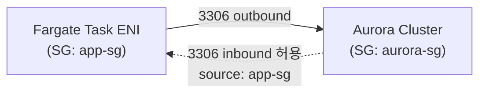
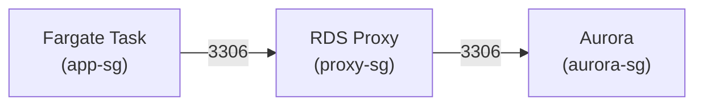

# ECS에서 Aurora 클러스터 접속하기

ECS Task에서 Aurora에 붙는 건 평범한 JDBC 연결 한 줄로 끝나는 것처럼 보이지만, 실제 운영에서는 그렇지 않다. Aurora는 writer/reader 엔드포인트가 나뉘어 있고, 페일오버가 나면 DNS가 다른 인스턴스를 가리키도록 바뀐다. ECS는 Task가 수시로 뜨고 죽으면서 매번 새 ENI와 새 커넥션 풀을 만든다. 이 두 쪽의 동작이 맞물리면서 평소엔 멀쩡하다가 페일오버 한 번에 전체 Task가 5분 동안 DB를 못 잡는 식의 장애가 난다.

이 문서는 ECS 워크로드(Fargate, EC2 둘 다)에서 Aurora MySQL 클러스터에 붙을 때 실제로 겪는 문제와 처리 방법을 모았다. 커넥션 풀 자체의 일반론은 [ECS Task 스케일 아웃에 따른 DB 커넥션 풀 관리](ECS_DB_Connection_Pool_관리.md), Aurora 측 페일오버 메커니즘은 Database 쪽 Aurora 문서에 따로 있으니 겹치는 부분은 줄이고 ECS→Aurora 연결 관점에서 묶었다.

## 엔드포인트 구조부터 정리

Aurora 클러스터를 만들면 엔드포인트가 최소 두 개 나온다.

- **클러스터 엔드포인트(writer endpoint)**: 항상 현재 writer 인스턴스를 가리킨다. 페일오버가 나면 이 DNS가 새 writer를 가리키도록 바뀐다.
- **리더 엔드포인트(reader endpoint)**: reader 인스턴스들 사이에서 라운드로빈으로 분산된다. reader가 여러 대면 접속할 때마다 다른 인스턴스로 갈 수 있다.

여기에 인스턴스별 엔드포인트도 있지만 ECS Task가 직접 인스턴스 엔드포인트를 박아 쓰는 건 거의 없다. 인스턴스가 교체되면 그 엔드포인트가 사라지기 때문이다.

ECS Task 입장에서 중요한 건 reader 엔드포인트의 동작 방식이다. reader 엔드포인트는 "접속을 맺는 순간"에만 라운드로빈으로 분산된다. 커넥션 풀이 한 번 커넥션을 맺어 놓으면 그 커넥션은 풀이 살아 있는 동안 같은 reader 인스턴스에 계속 붙어 있다. 그래서 reader가 3대인데 Task의 풀이 부팅 시점에 전부 한 인스턴스로 붙어버리는 쏠림이 종종 생긴다. 풀이 천천히 채워지거나 Task가 한꺼번에 뜰 때 특히 그렇다.

## writer/reader 분리 접속과 읽기 라우팅

쓰기는 writer로, 읽기는 reader로 보내려면 DataSource를 두 개 두는 게 가장 단순하다. Spring에서는 `AbstractRoutingDataSource`로 트랜잭션의 읽기 전용 여부에 따라 라우팅한다.

```java
public class RoutingDataSource extends AbstractRoutingDataSource {
    @Override
    protected Object determineCurrentLookupKey() {
        // 읽기 전용 트랜잭션이면 reader, 아니면 writer
        return TransactionSynchronizationManager.isCurrentTransactionReadOnly()
                ? "reader" : "writer";
    }
}
```

```java
@Configuration
public class DataSourceConfig {

    @Bean
    public DataSource routingDataSource(
            @Qualifier("writerDataSource") DataSource writer,
            @Qualifier("readerDataSource") DataSource reader) {

        RoutingDataSource routing = new RoutingDataSource();
        Map<Object, Object> targets = new HashMap<>();
        targets.put("writer", writer);
        targets.put("reader", reader);
        routing.setTargetDataSources(targets);
        routing.setDefaultTargetDataSource(writer);
        return routing;
    }

    @Bean
    public DataSource dataSource(@Qualifier("routingDataSource") DataSource routing) {
        // 트랜잭션 시작 시점에 라우팅 키가 결정되도록 Lazy 프록시로 감싼다
        return new LazyConnectionDataSourceProxy(routing);
    }
}
```

`LazyConnectionDataSourceProxy`로 감싸는 게 핵심이다. 이게 없으면 `@Transactional(readOnly = true)` 진입 시점에 라우팅 키가 아직 안 잡힌 상태로 커넥션을 미리 가져오면서 항상 writer로 가버린다. 실제로 reader로 트래픽을 못 보내고 있는데 코드는 멀쩡해 보여서 한참 헤매는 경우가 있다. CloudWatch에서 writer의 `DatabaseConnections`만 올라가고 reader는 바닥이면 이걸 의심한다.

서비스 코드에서는 읽기 메서드에 `readOnly = true`만 붙이면 된다.

```java
@Transactional(readOnly = true)
public List<Order> findOrders(Long userId) {
    return orderRepository.findByUserId(userId);
}
```

읽기를 reader로 보낼 때 주의할 점은 복제 지연이다. Aurora의 reader는 보통 수십 ms 안쪽으로 따라오지만, writer에 쓰자마자 곧바로 같은 데이터를 reader에서 읽으면 아직 반영 안 된 값을 받을 수 있다. "방금 등록한 주문이 목록에 안 보인다"는 류의 버그가 여기서 나온다. 쓰기 직후 곧바로 읽어야 하는 흐름은 그냥 writer로 보내는 게 맞다. readOnly를 빼면 writer로 간다.

## 페일오버가 나면 ECS Task 쪽 커넥션은 어떻게 되나

이게 ECS→Aurora 연결에서 제일 자주 터지는 지점이다.

페일오버가 발생하면 Aurora는 기존 reader 중 하나를 writer로 승격시키고, 클러스터 엔드포인트 DNS를 새 writer의 IP로 바꾼다. 보통 30초 안쪽에 끝난다. 문제는 ECS Task가 들고 있던 기존 커넥션들이다. 이 커넥션들은 죽은(혹은 강등된) 인스턴스를 향하고 있어서 더 이상 못 쓴다. 그런데 풀은 이 커넥션이 죽은 줄 모르고 계속 빌려준다. 그래서 페일오버 직후 한동안 `Communications link failure`나 `The MySQL server is running with the --read-only option` 같은 에러가 쏟아진다.

두 가지가 동시에 발목을 잡는다.

### DNS TTL 캐싱

Aurora 클러스터 엔드포인트의 DNS TTL은 5초다. 그런데 JVM의 기본 DNS 캐시 정책이 이걸 무시한다. 보안 매니저가 없는 환경에서 `networkaddress.cache.ttl`이 설정 안 돼 있으면 JVM은 성공한 DNS 조회를 사실상 영구 캐싱한다. 그래서 Aurora 쪽 DNS는 이미 새 writer를 가리키는데 JVM은 옛날 IP를 계속 들고 있어서 강등된 인스턴스로 재연결을 시도한다.

JVM DNS 캐시 TTL을 짧게 강제해야 한다. 컨테이너 안에서 `$JAVA_HOME/conf/security/java.security`를 건드리거나, 기동 옵션으로 넘긴다.

```properties
# java.security 또는 -Dsun.net.inetaddr.ttl=5
networkaddress.cache.ttl=5
networkaddress.cache.negative.ttl=3
```

Spring Boot라면 main 진입 직전에 코드로 박아도 된다.

```java
public static void main(String[] args) {
    java.security.Security.setProperty("networkaddress.cache.ttl", "5");
    SpringApplication.run(Application.class, args);
}
```

AWS JDBC Driver for MySQL을 쓰면 이 DNS 캐싱과 페일오버 토폴로지 추적을 드라이버가 알아서 해준다. 드라이버가 클러스터 토폴로지를 직접 모니터링해서 페일오버를 감지하고 새 writer로 빠르게 전환한다. 운영에서 페일오버 복구 시간을 줄이려면 이 드라이버로 갈아타는 게 가장 확실하다. JDBC URL 스킴만 `jdbc:mysql://`에서 `jdbc:aws-wrapper:mysql://`로 바꾸고 의존성을 추가하면 된다.

### 풀에 남은 죽은 커넥션

DNS가 새 IP를 잡아도, 풀 안에 이미 만들어둔 커넥션 객체들은 옛 연결을 그대로 쓴다. 이걸 빨리 버리고 새로 맺게 하려면 HikariCP 설정을 손봐야 한다.

```yaml
spring:
  datasource:
    hikari:
      # 커넥션을 빌려줄 때 살아있는지 검사. Aurora 페일오버 후 죽은 커넥션을 거른다
      connection-test-query: SELECT 1
      validation-timeout: 3000
      # 커넥션 최대 수명. Aurora 쪽 wait_timeout보다 짧게
      max-lifetime: 600000        # 10분
      # 유휴 커넥션 keepalive 핑. maxLifetime보다 작게
      keepalive-time: 120000      # 2분
      # 커넥션 못 얻을 때 대기 한도. 무한 대기 방지
      connection-timeout: 3000
      idle-timeout: 300000        # 5분
      minimum-idle: 5
      maximum-pool-size: 20
```

`max-lifetime`을 너무 길게 잡으면 페일오버로 죽은 커넥션이 풀에 오래 남는다. 반대로 너무 짧으면 정상 운영 중에도 커넥션을 계속 새로 맺느라 부하가 늘고 Aurora의 `Aborted_clients`가 올라간다. 10분 정도가 무난하다. 단, Aurora 파라미터 그룹의 `wait_timeout`보다는 반드시 짧아야 한다. wait_timeout이 8시간(기본값)이면 상관없지만, 비용 줄이려고 짧게 줄여놓은 환경이면 그 값보다 max-lifetime을 작게 둬야 DB가 먼저 끊어서 생기는 `Communications link failure`를 막는다.

`keepalive-time`은 HikariCP 4.0.3부터 들어온 옵션이다. 유휴 커넥션에 주기적으로 핑을 보내서 NAT나 방화벽이 idle 커넥션을 조용히 끊어버리는 걸 막는다. Fargate에서 NAT Gateway를 거쳐 Aurora에 붙는 구성이면 idle 커넥션이 350초쯤 지나 NAT에서 끊기는 일이 있어서 keepalive를 그보다 짧게 두는 게 좋다.

HikariCP는 `SELECT 1` 같은 별도 쿼리보다 JDBC4의 `Connection.isValid()`를 쓰는 걸 권장한다. `connection-test-query`를 지정하지 않으면 자동으로 `isValid()`를 쓴다. MySQL 커넥터가 JDBC4를 지원하므로 굳이 `connection-test-query`를 명시하지 않아도 되고, 명시하지 않는 쪽이 약간 빠르다. 위 예제에 넣은 건 명시적으로 보여주려는 것이고, 실제로는 빼도 된다.

## Secrets Manager로 자격증명 주입

DB 비밀번호를 Task Definition의 환경변수에 평문으로 박으면 안 된다. ECS 콘솔이나 `describe-tasks` API로 그대로 노출된다. Secrets Manager에 넣고 `secrets` 필드로 주입한다.

```json
{
  "family": "order-api",
  "containerDefinitions": [
    {
      "name": "app",
      "image": "123456789012.dkr.ecr.ap-northeast-2.amazonaws.com/order-api:latest",
      "secrets": [
        {
          "name": "DB_USERNAME",
          "valueFrom": "arn:aws:secretsmanager:ap-northeast-2:123456789012:secret:prod/aurora/order-AbCdEf:username::"
        },
        {
          "name": "DB_PASSWORD",
          "valueFrom": "arn:aws:secretsmanager:ap-northeast-2:123456789012:secret:prod/aurora/order-AbCdEf:password::"
        }
      ],
      "environment": [
        { "name": "DB_WRITER_HOST", "value": "order.cluster-abc123.ap-northeast-2.rds.amazonaws.com" },
        { "name": "DB_READER_HOST", "value": "order.cluster-ro-abc123.ap-northeast-2.rds.amazonaws.com" }
      ]
    }
  ]
}
```

`valueFrom`의 ARN 뒤에 `:username::` 처럼 JSON 키를 지정하면 시크릿 안의 특정 필드만 꺼낸다. Aurora 콘솔에서 "관리형 마스터 자격증명"으로 생성한 시크릿은 `{"username": "...", "password": "...", "host": "...", ...}` 구조라 이렇게 키를 찍어서 가져온다.

여기서 권한 두 가지를 챙겨야 한다.

1. **Task Execution Role**(Task가 아니라 실행 역할)에 해당 시크릿의 `secretsmanager:GetSecretValue` 권한. 컨테이너 기동 전에 ECS 에이전트가 시크릿을 읽어서 환경변수로 넣기 때문에 Task Role이 아니라 Execution Role이다. 이걸 헷갈려서 Task Role에만 권한을 주고 `ResourceInitializationError`로 Task가 안 뜨는 경우가 많다.
2. 시크릿이 KMS 고객 관리 키로 암호화돼 있으면 그 키에 대한 `kms:Decrypt` 권한도 Execution Role에 필요하다.

application.yml에서는 주입받은 환경변수를 그대로 쓴다.

```yaml
spring:
  datasource:
    writer:
      jdbc-url: jdbc:mysql://${DB_WRITER_HOST}:3306/orderdb?useSSL=true&serverTimezone=Asia/Seoul
      username: ${DB_USERNAME}
      password: ${DB_PASSWORD}
    reader:
      jdbc-url: jdbc:mysql://${DB_READER_HOST}:3306/orderdb?useSSL=true&serverTimezone=Asia/Seoul
      username: ${DB_USERNAME}
      password: ${DB_PASSWORD}
```

### 시크릿 회전 시 Task 재시작 문제

ECS의 `secrets` 주입은 **컨테이너가 뜨는 시점에 한 번만** 일어난다. Secrets Manager가 자동 회전으로 비밀번호를 바꿔도, 이미 떠 있는 Task의 환경변수는 옛 비밀번호 그대로다. Aurora 쪽 비밀번호가 새 값으로 바뀐 뒤 풀이 새 커넥션을 맺으려 하면 `Access denied`가 난다.

회전을 쓰려면 회전 후 Task를 새로 굴려서 새 시크릿을 다시 읽게 해야 한다. 보통 이렇게 처리한다.

- 회전 주기를 정해두고, 회전 직후 서비스를 강제 새 배포(`aws ecs update-service --force-new-deployment`)로 롤링 교체한다.
- Aurora 관리형 회전은 보통 옛 비밀번호와 새 비밀번호를 일정 기간 둘 다 받아주는 grace 구간이 있어서, 그 사이에 Task를 굴리면 무중단으로 넘어간다.

자동화하려면 Secrets Manager 회전 람다가 회전을 끝낸 뒤 EventBridge로 `update-service --force-new-deployment`를 트리거하게 엮는다. 회전은 켜놨는데 Task 재배포를 안 엮어두면, 회전 직후 멀쩡하던 서비스가 풀의 커넥션이 한 바퀴 돌아 max-lifetime으로 재연결될 때쯤 갑자기 `Access denied`로 죽는 시한폭탄이 된다.

## IAM DB 인증을 쓸 때 토큰 만료

비밀번호 대신 IAM으로 인증하면 Secrets Manager 회전 자체가 필요 없어진다. RDS가 IAM 자격으로 15분짜리 인증 토큰을 발급하고, 이 토큰을 비밀번호 자리에 넣어 접속한다.

문제는 토큰 수명이 15분이라는 점이다. 커넥션을 처음 맺을 때 토큰을 검증하고 나면 그 커넥션은 토큰이 만료돼도 계속 살아 있다. 즉 이미 맺은 커넥션은 괜찮다. 하지만 풀이 **새 커넥션을 맺을 때마다** 유효한 토큰이 필요하다. 토큰을 한 번 발급해서 application.yml의 password에 박아두는 식으로는 15분 뒤 풀이 커넥션을 새로 채울 때 만료된 토큰으로 시도해서 실패한다.

그래서 커넥션을 맺기 직전에 토큰을 매번 새로 발급하도록 DataSource를 커스터마이징한다.

```java
public class IamAuthDataSource extends HikariDataSource {

    private final RdsUtilities rdsUtilities;
    private final String host;
    private final String username;

    @Override
    public Connection getConnection() throws SQLException {
        // 커넥션 맺기 직전 토큰을 새로 발급
        String token = rdsUtilities.generateAuthenticationToken(builder ->
                builder.hostname(host).port(3306).username(username));
        this.setPassword(token);
        return super.getConnection();
    }
}
```

실제로는 HikariCP 풀이 커넥션을 채우는 시점을 직접 못 가로채기 때문에, AWS JDBC Driver의 IAM 인증 플러그인을 쓰는 쪽이 깔끔하다. 드라이버가 커넥션 생성 직전에 토큰을 알아서 갱신하고 캐싱한다.

```yaml
spring:
  datasource:
    writer:
      jdbc-url: jdbc:aws-wrapper:mysql://${DB_WRITER_HOST}:3306/orderdb?wrapperPlugins=iam&useSSL=true
      username: ${DB_USERNAME}
      # IAM 인증이면 password는 비워둔다
```

이때 Task Role에 `rds-db:connect` 권한이 있어야 하고, 리소스 ARN은 DB 인스턴스가 아니라 DB 사용자 단위로 지정한다. IAM DB 인증은 초당 토큰 발급에 한계가 있어서, Task가 한꺼번에 수십 개 뜨면서 커넥션을 폭발적으로 맺는 순간 스로틀이 걸릴 수 있다. 대규모로 동시에 풀을 채우는 구성이면 이 점을 염두에 둔다.

## RDS Proxy를 사이에 둘 때

ECS Task가 많아지면 Task 수 × 풀 크기만큼 Aurora에 커넥션이 쌓인다. 이걸 RDS Proxy가 중간에서 멀티플렉싱해서 실제 Aurora 커넥션 수를 줄여준다. ECS Task는 Proxy 엔드포인트에 붙고, Proxy가 뒤에서 Aurora 커넥션 풀을 공유한다.

```yaml
spring:
  datasource:
    writer:
      # 클러스터 엔드포인트 대신 Proxy 엔드포인트로
      jdbc-url: jdbc:mysql://order-proxy.proxy-abc123.ap-northeast-2.rds.amazonaws.com:3306/orderdb
```

Proxy를 쓰면 페일오버 처리도 한결 낫다. Proxy가 클라이언트 커넥션을 유지한 채 뒤쪽 Aurora 연결만 새 writer로 갈아끼우기 때문에, ECS Task 쪽 커넥션은 끊기지 않고 페일오버를 넘어가는 경우가 많다. DNS TTL 문제도 Proxy가 흡수한다.

### 핀닝(pinning) 주의

RDS Proxy의 멀티플렉싱은 한 클라이언트 커넥션을 여러 백엔드 커넥션에 번갈아 매핑해서 효율을 낸다. 그런데 세션 상태에 의존하는 동작을 하면 Proxy가 그 클라이언트 커넥션을 특정 백엔드 커넥션에 **고정(pin)**해버린다. 핀이 걸리면 그 커넥션 동안은 멀티플렉싱 이득이 사라지고, 핀이 너무 많아지면 RDS Proxy를 쓰는 의미 자체가 없어진다.

핀이 걸리는 대표적인 경우:

- 세션 변수 설정(`SET @x = ...`, 일부 `SET` 문)
- 임시 테이블 생성
- prepared statement (MySQL 프로토콜 레벨)
- 명시적 트랜잭션 중 일부 상태
- `LOCK TABLES`, `GET_LOCK()` 등 세션 스코프 락

HikariCP가 커넥션을 풀에 반납할 때 `SET` 류 초기화 쿼리를 날리도록 설정돼 있으면 매번 핀이 걸린다. `connection-init-sql`에 `SET` 문을 잔뜩 넣어두면 Proxy 환경에서는 역효과다. CloudWatch의 `DatabaseConnectionsCurrentlySessionPinned` 지표로 핀 발생량을 본다. 이 값이 높으면 어떤 쿼리가 핀을 거는지 추적해서 줄여야 한다.

prepared statement 핀닝을 피하려면 JDBC URL에 `useServerPrepStmts=false`를 줘서 클라이언트 측 prepared statement를 쓰게 하는 방법이 있다. 다만 이건 성능 트레이드오프가 있으니 핀닝이 실제 문제일 때만 손댄다.

Proxy를 쓴다고 ECS Task 쪽 HikariCP 풀을 없앨 수 있는 건 아니다. Task 안에서는 여전히 로컬 풀이 필요하다. Proxy는 Aurora와 Proxy 사이 커넥션을 줄이는 거지, Task와 Proxy 사이 연결을 대신해주는 게 아니다. 풀 크기는 평소보다 작게 잡아도 되긴 한다.

## Fargate ENI 보안그룹으로 Aurora 인바운드 허용

Fargate Task는 awsvpc 네트워크 모드라 Task마다 ENI를 하나씩 받고, 그 ENI에 보안그룹이 붙는다. EC2 인스턴스의 보안그룹이 아니라 Task ENI의 보안그룹이다. 이걸 헷갈려서 EC2 보안그룹만 열어놓고 연결이 안 돼서 헤매는 경우가 있다.

연결 경로는 이렇게 잡는다.



- ECS Task의 보안그룹(app-sg): Aurora로 나가는 3306 아웃바운드. 기본 아웃바운드가 전체 허용이면 따로 안 건드려도 된다.
- Aurora의 보안그룹(aurora-sg): 인바운드 3306을 열되, source를 CIDR이 아니라 **app-sg(보안그룹 ID)**로 지정한다. Fargate Task는 IP가 매번 바뀌니까 IP로 열면 안 된다. 보안그룹을 source로 지정하면 그 SG를 단 Task는 IP가 바뀌어도 통과한다.

RDS Proxy를 끼면 Task → Proxy → Aurora 세 구간 모두 3306이 열려야 한다. Proxy의 보안그룹 인바운드에 app-sg를 허용하고, Aurora의 보안그룹 인바운드에 Proxy의 SG를 허용한다.



## Task 수 × 풀 크기가 Aurora max_connections를 넘기는 장애

이게 ECS 스케일 아웃에서 제일 흔하게 터지는 실제 장애다.

Aurora MySQL의 `max_connections`는 인스턴스 클래스에 따라 자동 계산된다. 기본 공식은 `DBInstanceClassMemory / 12582880` 이고, db.r6g.large(16GB)면 대략 1,365개쯤 된다. 파라미터 그룹에서 직접 값을 박아둔 환경도 있다.

여기에 ECS Task가 오토스케일링으로 늘어나는 상황을 곱해보면 문제가 보인다. HikariCP `maximum-pool-size`를 20으로 잡은 Task가 평소 10개 떠 있으면 200 커넥션이다. 여유 있어 보인다. 그런데 트래픽 폭증으로 오토스케일링이 Task를 60개까지 늘리면 60 × 20 = 1,200 커넥션이다. 여기에 배포 중에는 구버전 Task와 신버전 Task가 잠깐 같이 떠 있으니 순간적으로 더 늘어난다. 거기에 다른 서비스나 배치 Task, 운영자 접속까지 합쳐지면 1,365를 넘긴다.

`max_connections`를 넘으면 새 커넥션 요청이 `Too many connections`로 거부된다. 이때 증상이 고약한 게, 이미 붙어 있던 Task는 멀쩡한데 **새로 뜨는 Task만** 풀을 못 채워서 부팅에 실패하거나 헬스체크를 못 넘긴다. 오토스케일링은 부하가 높으니 Task를 더 띄우려 하는데, 새 Task는 커넥션을 못 잡아서 계속 죽는 악순환이 돈다. 스케일 아웃이 오히려 상황을 악화시킨다.

계산은 이렇게 잡는다.

```
필요 커넥션 = 최대 Task 수 × Task당 풀 크기(maximum-pool-size)
           + 배포 중 겹침 여유 (최대 Task 수 × 풀 크기 × 0.5 정도)
           + 배치/운영/기타 접속
이 합이 Aurora max_connections × 0.8 안에 들어와야 한다 (20% 여유)
```

위 예시면 최대 60 Task × 20 = 1,200, 배포 겹침 여유까지 보면 1,800까지 튄다. max_connections 1,365로는 못 버틴다. 해결 방향은 셋 중 하나다.

1. **풀 크기를 줄인다.** Task당 20은 대부분의 API 서버에 과하다. 한 Task가 동시에 처리하는 요청 수를 생각하면 5~10이면 충분한 경우가 많다. 풀 크기를 10으로 내리면 60 Task여도 600이라 여유가 생긴다. 풀이 작아서 대기가 생기는지는 HikariCP의 `pending` 지표로 확인한다.
2. **RDS Proxy를 넣는다.** Task 쪽 풀이 1,200을 요구해도 Proxy가 멀티플렉싱해서 Aurora 실제 커넥션은 수백 개로 눌러준다. Task 수가 크게 출렁이는 워크로드면 이게 정석이다.
3. **인스턴스 클래스를 키운다.** 메모리가 큰 클래스로 올리면 max_connections가 비례해서 는다. 비용이 드니 최후의 수단이다.

오토스케일링 정책을 짤 때 최대 Task 수에 상한을 두고, 그 상한 × 풀 크기가 Aurora 한계를 안 넘는지 배포 전에 한 번 곱해보는 습관을 들이는 게 좋다. 오토스케일링 max를 무한정 크게 잡아두면 트래픽 스파이크 때 DB가 먼저 무너진다.

## 정리하면서 짚을 것

ECS→Aurora 연결에서 평소엔 안 보이다가 사고로 드러나는 지점은 거의 정해져 있다. 페일오버 때 JVM DNS 캐시가 옛 IP를 붙들고 있는 것, 시크릿 회전 후 Task를 안 굴려서 옛 비밀번호로 죽는 것, 오토스케일링이 Task를 늘리다 Aurora `max_connections`를 넘기는 것. 셋 다 평소 부하 테스트에선 안 잡히고 실제 페일오버·회전·트래픽 스파이크라는 이벤트가 와야 터진다. 그래서 이 셋은 미리 값을 계산해두고 설정으로 막아둬야 한다.

AWS JDBC Driver와 RDS Proxy는 이 문제들 상당수를 흡수해준다. 직접 DNS TTL 맞추고 풀 무효화 타이밍 잡는 것보다, 드라이버와 Proxy에 위임하고 그 동작을 이해한 채로 운영하는 쪽이 사고가 적다. 다만 RDS Proxy의 핀닝처럼 위임했을 때 새로 생기는 함정이 있으니 지표(`DatabaseConnectionsCurrentlySessionPinned`, `DatabaseConnections`, HikariCP `pending`)는 항상 보고 있어야 한다.
