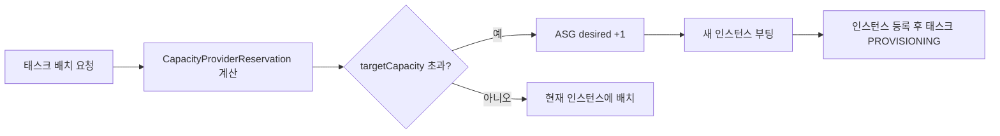
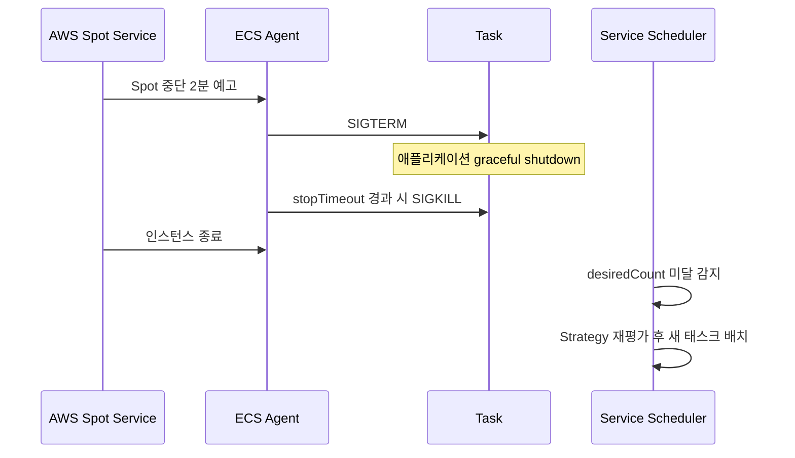

# ECS Capacity Providers

## 개요

Capacity Provider는 ECS 태스크가 "어디에서, 어떤 조건으로" 실행될지를 결정하는 추상화 계층이다. 과거 Launch Type(`FARGATE`, `EC2`) 방식의 한계를 보완하려고 2019년에 도입됐고, 지금은 사실상 ECS의 기본 배치 메커니즘이다. Launch Type은 단순히 "어디 띄울지"만 말해주지만, Capacity Provider는 "여러 인프라 종류를 비율로 섞어서 띄우고, 부족하면 인프라까지 자동으로 늘려라"까지 커버한다.

핵심 구성 요소를 먼저 정리하자.

- **Capacity Provider**: 인프라 용량을 대표하는 논리적 객체. 종류는 세 가지 — `FARGATE`, `FARGATE_SPOT`, EC2 Auto Scaling Group 기반 사용자 정의 CP.
- **Capacity Provider Strategy**: 여러 CP에 태스크를 어떻게 나눠 배치할지 정의하는 규칙. `base`와 `weight` 두 파라미터가 핵심.
- **Cluster의 기본 Strategy**: 클러스터에 기본값으로 붙여두면 서비스 생성 시 Launch Type을 명시하지 않아도 된다.
- **Service/RunTask의 Strategy**: 클러스터 기본값을 오버라이드할 수 있다.

초보자가 가장 많이 오해하는 부분이 "FARGATE는 무조건 있으니 안 만들어도 된다"는 점이다. 맞다. `FARGATE`와 `FARGATE_SPOT`은 AWS가 계정별로 미리 만들어 둔 **기본 제공 CP**라서 따로 생성할 수 없다. 다만 클러스터에 **연결(associate)** 하는 작업은 필요하다. 연결하지 않은 CP는 Strategy에 못 쓴다.

## 세 종류의 Capacity Provider

### FARGATE

기본 Fargate 온디맨드 용량이다. 가격은 비싸지만 인스턴스 관리가 없고, 용량이 거의 무한에 가깝게 제공된다. 프로덕션에서 최소 보장 용량은 여기에 둔다. 특별한 설정이 없고, 클러스터에 연결만 하면 된다.

### FARGATE_SPOT

Fargate의 Spot 버전이다. 온디맨드 대비 최대 70%까지 싸지만, AWS가 2분 예고 후 태스크를 회수할 수 있다. Spot 중단 자체는 SIGTERM → 2분 대기 → SIGKILL 순서로 오는데, 기본 `stopTimeout`이 30초라 2분을 다 못 쓴다. Spot에 얹는 워크로드는 `stopTimeout`을 120초로 올려두는 게 좋다.

주의할 점은 Spot 중단이 오면 ECS가 **자동으로 같은 CP에서 재시도하지 않는다**. 서비스 스케줄러가 desiredCount를 맞추려고 다시 배치하는 것이지, "이 태스크를 이어서 실행"하는 게 아니다. 즉 Spot 중단으로 종료된 태스크는 그냥 죽은 태스크고, 서비스가 새 태스크를 띄우는 흐름으로 이어진다. 이때 남은 FARGATE_SPOT 용량이 부족하면 Strategy 비율대로 FARGATE로 넘어가지는 게 아니라, `FARGATE_SPOT` 자리에서 `ProvisioningCapacity` 부족으로 PROVISIONING 단계에 머무를 수 있다. Spot 풀이 고갈되는 리전/AZ에서 자주 본다.

### EC2 Auto Scaling Group 기반 CP

ASG를 하나 만든 뒤, 그 ASG를 Capacity Provider로 감싼다. 이게 이른바 "ECS on EC2"를 Capacity Provider 방식으로 쓰는 방법이다. 여기서부터 진짜 기능이 시작된다 — **managed scaling**과 **managed termination protection**.

```json
{
  "name": "ec2-cp-general",
  "autoScalingGroupProvider": {
    "autoScalingGroupArn": "arn:aws:autoscaling:...:autoScalingGroup:...",
    "managedScaling": {
      "status": "ENABLED",
      "targetCapacity": 100,
      "minimumScalingStepSize": 1,
      "maximumScalingStepSize": 10,
      "instanceWarmupPeriod": 300
    },
    "managedTerminationProtection": "ENABLED"
  }
}
```

## base와 weight의 의미

Capacity Provider Strategy에서 가장 헷갈리는 파라미터다. 정의를 정확히 외워둬야 한다.

- **base**: 해당 CP에 최소로 할당해야 할 태스크 **개수**. Strategy 전체에서 단 하나의 CP만 `base > 0`을 가질 수 있다.
- **weight**: base 요구량이 다 채워진 다음, 추가 태스크를 나눌 때의 **상대 비율**. 0이면 그 CP는 base를 채운 뒤로는 태스크를 받지 않는다.

예를 들어 아래 Strategy로 태스크 10개를 띄운다고 해보자.

```json
[
  {"capacityProvider": "FARGATE",      "base": 2, "weight": 1},
  {"capacityProvider": "FARGATE_SPOT", "base": 0, "weight": 4}
]
```

먼저 `FARGATE`의 base 2개를 할당한다. 남은 8개를 weight 1:4 비율로 나눈다. 8 × 1/5 = 1.6, 8 × 4/5 = 6.4. 정수로 반올림하면서 스케줄러가 2:6 또는 1:7로 맞춘다 (정확한 반올림은 내부 로직이라 장담이 어렵다). 결과적으로 FARGATE 3~4개, FARGATE_SPOT 6~7개가 나온다.

실무에서 자주 쓰는 조합은 "base로 안정 용량 확보 + weight로 Spot에 몰아주기"다. 위 예시처럼 `FARGATE`에 base 2를 주면 Spot이 전부 회수돼도 최소 2개는 살아 있다. 반대로 base를 `FARGATE_SPOT`에 넣는 건 의미가 없다. Spot은 언제든 회수될 수 있으니 "최소 보장"이라는 단어와 안 맞는다.

한 가지 트랩이 더 있다. **base는 한 번만 적용된다**. desiredCount가 10일 때 base 2가 채워진 상태에서 스케일 아웃으로 15로 올리면, 새로 늘어나는 5개는 오직 weight 비율로만 분배된다. base 몫이 자동으로 늘어나지 않는다. "base만큼은 항상 FARGATE에 고정"이라는 의미가 아니라 "총 태스크 수에서 처음 2개는 FARGATE에 고정"이라는 뜻이다.

## Managed Scaling 동작 원리

EC2 ASG 기반 CP에서 `managedScaling: ENABLED`를 켜면, ECS가 **자체 CloudWatch 메트릭**(`CapacityProviderReservation`)을 만들고 이 값을 타겟 트래킹해서 ASG의 desired capacity를 조절한다. `targetCapacity: 100`은 "용량의 100%를 쓰도록" 맞추겠다는 뜻이다.



`CapacityProviderReservation`은 대략 이렇게 계산된다.

```
N = CP에 속한 인스턴스 수 (또는 띄울 수 있는 최대 태스크 수 기준)
M = 현재 실행 중 + 배치 대기 중인 태스크가 필요로 하는 인스턴스 수
CapacityProviderReservation = (M / N) * 100
```

`targetCapacity`를 100으로 두면 "대기 태스크가 없고 인스턴스에 여유가 남지 않는" 상태를 목표로 하므로 효율이 좋지만, 스케일 아웃할 때 인스턴스가 미리 떠 있지 않아 태스크가 PROVISIONING에서 수십 초~수 분 대기한다. 이게 싫으면 `targetCapacity`를 80~90으로 낮추면 여유 인스턴스를 항상 유지하게 된다. 그만큼 비용은 올라간다.

`instanceWarmupPeriod`는 메트릭 계산 시 새로 부팅된 인스턴스를 집계에서 제외하는 시간이다. 300초로 두면 방금 올라온 인스턴스가 등록되기 전 스케일링 계산에 반영되지 않아 과도한 중복 스케일 아웃을 막는다.

## Managed Termination Protection

EC2 CP에서만 의미가 있는 설정이다. ASG가 스케일 인하려고 인스턴스를 종료할 때, **그 인스턴스에 ECS 태스크가 실행 중이면 종료를 막는다**. 구체적으로는 ECS가 ASG의 인스턴스별 `ProtectedFromScaleIn` 플래그를 자동으로 켰다 껐다 한다.

활성화하려면 두 가지 조건을 만족해야 한다.

1. ASG 자체에 `NewInstancesProtectedFromScaleIn: true`가 켜져 있어야 한다.
2. ECS 에이전트가 태스크 수에 따라 개별 인스턴스의 보호를 해제해 준다.

이 설정을 안 켜면 스케일 인 시 태스크가 돌고 있는 인스턴스가 그대로 종료돼서 트래픽이 끊긴다. 반대로 켜 두면 태스크가 하나라도 있는 인스턴스는 ASG가 건드리지 않는다. 빈 인스턴스만 회수되기 때문에 안전하지만, 태스크가 여러 인스턴스에 골고루 퍼져 있으면 실제로는 빈 인스턴스가 잘 안 생겨서 스케일 인이 느리거나 아예 안 되는 경우가 있다. 이때는 AZ 재배치 태스크나 `daemonsets` 같은 배치 전략을 점검해야 한다.

## 혼합 배포 시 태스크 분배 방식

Strategy에 CP 두 개 이상을 나열하면 ECS 서비스 스케줄러가 태스크 단위로 번갈아 가며 선택한다. 알고리즘은 공식적으로 공개된 건 아니지만, 관찰된 동작은 대략 이렇다.

1. 각 CP의 현재 실행 태스크 수를 확인한다.
2. `base`를 못 채운 CP가 있으면 거기부터 채운다.
3. 전부 base를 채웠으면, 각 CP의 "weight 대비 실제 배치된 비율"이 가장 낮은 CP에 다음 태스크를 할당한다.

실무에서 중요한 건 이 분배가 **태스크 생성 시점에만 일어난다**는 점이다. 이미 배치된 태스크는 재분배되지 않는다. 그래서 초반에 FARGATE_SPOT이 부족해서 FARGATE로 넘어간 태스크는, 나중에 Spot이 풀려도 Spot으로 돌아가지 않는다. 비용이 예상보다 높게 나오는 원인이 되기도 하는데, 서비스의 `forceNewDeployment`를 한 번 돌리면 전체가 재배치되면서 Strategy 비율이 다시 맞는다.

## Spot 중단 처리와 재시도

Spot 회수 시 흐름은 이렇다.



여기서 핵심은 **재시도가 서비스 레벨에서만 일어난다**는 점이다. RunTask로 단발성으로 띄운 태스크는 Spot에 회수되면 그걸로 끝이다. 배치 작업을 Spot에 돌릴 거면 Step Functions나 EventBridge 재시도 정책을 반드시 얹어야 한다.

애플리케이션 쪽에서는 SIGTERM을 받으면 graceful shutdown을 해야 한다. Spring Boot면 `server.shutdown=graceful`, Node.js면 `process.on('SIGTERM', ...)`으로 커넥션 드레이닝을 처리한다. ALB에 달려 있는 경우 `deregistrationDelay`도 신경 써야 한다. 기본값 300초인데, Spot 중단 예고가 120초니까 타깃 그룹의 deregistration이 끝나기 전에 태스크가 죽는다. ALB 뒤에 Spot을 두는 서비스는 `deregistrationDelay`를 60~90초로 낮춰두는 게 안전하다.

## EC2 ASG CP에서 태스크가 PENDING에 멈추는 문제

EC2 기반 CP에서 가장 많이 겪는 문제다. 증상은 이렇다. 태스크를 늘리려는데 ECS 콘솔의 서비스 이벤트에 다음과 같은 로그가 찍힌다.

```
service my-service was unable to place a task because no container instance
met all of its requirements. The closest matching container-instance i-xxx
has insufficient CPU units available.
```

원인 분기는 여러 가지다.

1. **ASG max size에 걸린 경우**. Managed Scaling이 ASG desired를 올리려 해도 max에서 막힌다. ASG max를 늘려야 한다.
2. **인스턴스 타입이 태스크 요구량을 못 맞추는 경우**. 예를 들어 태스크가 vCPU 4를 요구하는데 ASG 인스턴스 타입이 t3.medium(vCPU 2)이다. 인스턴스 타입을 올리거나 태스크 크기를 줄여야 한다.
3. **ENI 한계**. 인스턴스 타입별로 ENI 최대 개수가 정해져 있는데, `awsvpc` 네트워크 모드에서는 태스크 1개당 ENI 1개가 필요하다. t3.small은 ENI 3개라 태스크를 3개밖에 못 올린다. 이건 CP 문제가 아니라 ENI 제한이다.
4. **Managed Scaling이 꺼져 있는 경우**. 이 경우 ECS가 ASG를 자동으로 키우지 않으므로 사람이 수동으로 desired를 올려야 한다.
5. **서브넷에 IP가 고갈된 경우**. `awsvpc` 모드에서 ENI가 서브넷 IP를 하나씩 소비한다. /28 서브넷에 태스크 50개 띄우려 하면 당연히 실패한다.

`managedScaling: ENABLED` 상태라면 Capacity Provider가 CloudWatch에 ASG를 키우는 스케일 아웃 액션을 보낸다. 하지만 인스턴스 부팅에 3~5분 걸리므로 그 시간 동안 태스크는 **PROVISIONING** 상태로 대기한다 (PENDING이 아니라 PROVISIONING이다. 이 구분이 중요한 이유는 CloudWatch 경보에서 PROVISIONING을 포함해서 계산해야 실제 대기 상황을 알 수 있기 때문이다).

## Launch Type에서 Capacity Provider로 전환

기존 서비스가 Launch Type(`launchType: FARGATE`)으로 떠 있고 이를 CP 방식으로 바꾸려고 할 때 주의사항이 몇 가지 있다.

첫째, **서비스 업데이트 API로 `launchType`과 `capacityProviderStrategy`를 동시에 바꿀 수 없다**. `launchType`을 가진 서비스는 그 속성을 제거할 수 없고, 반대로 CP Strategy로 만든 서비스에 `launchType`을 붙일 수 없다. 둘은 상호 배타적이고 한 번 결정하면 서비스를 **새로 만들어야** 바꿀 수 있다. 프로덕션 서비스라면 파란/녹색 방식으로 새 서비스를 ALB 타깃 그룹에 붙이고 트래픽을 옮기는 게 정석이다.

둘째, **Fargate 플랫폼 버전이 1.4.0 이상이어야** CP Strategy를 쓸 수 있다. 과거 1.3.0에 묶여 있던 서비스는 전환 전에 플랫폼 버전부터 올려야 한다.

셋째, Task Definition은 건드릴 필요 없다. CP는 배치 레이어의 변경이고, TD에 `requiresCompatibilities: [FARGATE]`는 그대로 둬도 된다.

넷째, IAM 권한 차이가 있다. `ecs.amazonaws.com` 서비스 연결 역할이 CP 관련 권한을 포함해야 하는데, 콘솔에서 처음 CP를 연결하려 하면 AWS가 자동 생성한다. CLI나 CloudFormation으로만 관리하는 환경에서는 `AWSServiceRoleForECS`와 `AWSServiceRoleForApplicationAutoScaling_ECSService`가 있는지 확인해야 한다.

다섯째, 스케일링 정책과의 상호작용이다. Service Auto Scaling은 CP 방식에서도 그대로 동작하지만, Target Tracking이 스케일 아웃할 때 FARGATE_SPOT이 꽉 차 있으면 PROVISIONING에 머무는 시간이 길어진다. 스케일링 반응 시간을 측정하려면 이 지연을 포함해서 봐야 한다.

여섯째, **서비스 생성 시 한 번만 정할 수 있는 제약도 있다**. `propagateTags`, 네트워크 구성 같은 건 CP 전환과 무관하게 변경 가능하지만, CP Strategy 자체는 `forceNewDeployment`와 함께 업데이트해야 기존 태스크까지 새 전략으로 재배치된다. 이 옵션 없이 Strategy만 바꾸면 기존 태스크는 그대로 남고 신규 태스크만 새 전략을 따른다.

## 흔한 실수 모음

실무에서 자주 겪는 실수들을 기록해 둔다.

- `FARGATE_SPOT`만으로 서비스를 구성하고 base를 0으로 둠. Spot 풀이 고갈되는 순간 서비스가 통째로 사라진다. 최소 1~2개는 FARGATE base로 확보해야 한다.
- weight를 0:1로 설정하고 "Spot만 쓰겠다"고 기대함. base가 없는 CP는 초기 배치에서 선택되지 않을 수 있다. weight만 있으면 상대 비율이니 0:1은 의미가 애매해진다. 적어도 1:N처럼 양쪽 다 양수로 주는 게 예측 가능하다.
- EC2 CP에서 `managedTerminationProtection: ENABLED`인데 ASG에 `NewInstancesProtectedFromScaleIn: false`를 둠. ECS가 태스크 보호를 시도해도 ASG가 새 인스턴스를 보호하지 않으므로 CP 생성 자체가 실패한다.
- `targetCapacity: 100`으로 두고 "태스크가 빨리 배치되지 않는다"고 불만. 100은 여유 용량을 거의 남기지 않는 설정이다. 응답 속도가 중요하면 70~85로 내린다.
- CP 연결만 해두고 Strategy에 안 넣음. 클러스터에 연결했더라도 서비스/RunTask에 명시적으로 Strategy를 주거나 클러스터 기본 Strategy를 지정하지 않으면 의미가 없다.

## 참고

- [Amazon ECS Capacity Providers 공식 문서](https://docs.aws.amazon.com/AmazonECS/latest/developerguide/cluster-capacity-providers.html)
- [Managed Scaling 동작 원리](https://aws.amazon.com/blogs/containers/deep-dive-on-amazon-ecs-cluster-auto-scaling/)
- [Fargate Spot 가이드](https://docs.aws.amazon.com/AmazonECS/latest/developerguide/fargate-capacity-providers.html)
