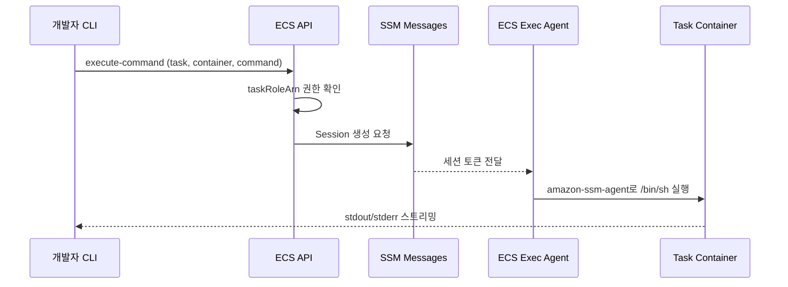
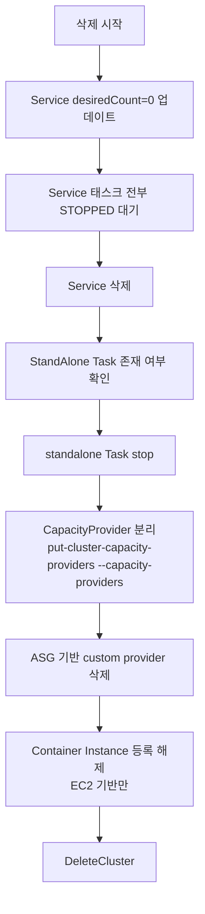

# ECS Cluster 생성과 설정

## 개요

ECS Cluster는 실제로는 "논리적인 그룹 이름"에 더 가깝다. 쿠버네티스처럼 컨트롤 플레인 노드가 따로 돌아가는 것도 아니고, 클러스터 자체에 전용 리소스가 붙는 것도 아니다. `CreateCluster` API를 호출하면 AWS 내부 스케줄러가 "이 이름 아래로 들어올 Task/Service들을 관리하겠다"는 메타데이터를 만들 뿐이다. 그래서 클러스터를 만드는 작업 자체는 1초도 안 걸린다.

문제는 그 빈 클러스터에 뭘 붙여 두느냐다. CapacityProvider를 안 걸어두면 Fargate 태스크를 띄울 때마다 Service에서 매번 지정해야 하고, Container Insights를 켜두지 않으면 한참 뒤에 "왜 CPU 그래프가 없지?" 하고 당황한다. executeCommandConfiguration을 기본값으로 두면 운영 중인 컨테이너에 `ecs execute-command`로 들어갈 수가 없다. 결국 클러스터 설정은 "Service 만들 때마다 매번 반복해서 지정할 것인가, 클러스터에 기본값으로 박아둘 것인가"의 문제다. 이 문서는 그 판단 기준을 실무 관점에서 정리한다.

## 클러스터 이름 규칙

클러스터 이름은 `^[a-zA-Z0-9_-]{1,255}$`가 형식적인 제약이지만, 실제로 고려해야 할 건 이것보다 많다.

- **변경 불가**: 한 번 만든 클러스터 이름은 바꿀 수 없다. 바꾸려면 새로 만들어서 Service를 전부 옮겨야 한다.
- **ARN에 포함**: IAM 정책에서 `arn:aws:ecs:ap-northeast-2:123456789012:cluster/prod-api` 같은 패턴으로 권한을 잡는 경우가 많다. 이름에 `prod`, `dev` 같은 환경 토큰이 있어야 조건부 정책을 쓰기 편하다.
- **CloudWatch 로그 그룹과 매칭**: `/ecs/prod-api/app` 같은 구조로 로그 그룹을 파는 팀이 많다. 클러스터 이름을 일관되게 두지 않으면 grep으로 로그 찾기 어려워진다.

현장에서 많이 쓰는 컨벤션은 `<환경>-<도메인>[-<region-suffix>]` 형태다.

```
prod-api
prod-api-tokyo
stage-batch
dev-web
```

account별로 환경이 분리된 조직이라면 환경 prefix를 생략하기도 한다. 그때도 region이 여러 개면 region suffix는 남겨 두는 쪽이 안전하다. 나중에 `us-east-1`에 DR용 클러스터를 추가로 띄우는데 이름이 같아서 배포 스크립트가 꼬이는 경우를 몇 번 본다.

## CapacityProvider 등록

클러스터를 만들고 나면 가장 먼저 하는 일이 CapacityProvider 붙이기다. CapacityProvider는 "이 클러스터가 어떤 컴퓨트 위에서 태스크를 돌릴 것인지"를 정의하는 설정이다. Fargate 기반이면 AWS가 관리하는 내장 provider 두 개를 붙이고, EC2 기반이면 Auto Scaling Group에 연결된 커스텀 provider를 직접 만들어야 한다.

### FARGATE와 FARGATE_SPOT

`FARGATE`와 `FARGATE_SPOT`은 AWS가 미리 만들어둔 특수 provider라서 별도로 생성 API를 호출할 필요가 없다. 그냥 클러스터에 "이 둘을 연결한다"고 선언만 하면 된다.

```bash
aws ecs put-cluster-capacity-providers \
  --cluster prod-api \
  --capacity-providers FARGATE FARGATE_SPOT \
  --default-capacity-provider-strategy \
      capacityProvider=FARGATE,weight=1,base=2 \
      capacityProvider=FARGATE_SPOT,weight=4,base=0
```

이 상태에서 Service를 만들 때 `capacityProviderStrategy`를 지정하지 않으면 방금 설정한 default가 적용된다. 위 예시라면 태스크 2개까지는 무조건 FARGATE로 띄우고, 그 이후로는 1:4 비율로 FARGATE와 FARGATE_SPOT에 분산한다.

현장에서 FARGATE_SPOT을 섞는 비율은 워크로드 성격에 따라 크게 갈린다. 웹 API 같은 stateless 서비스는 50~80%를 SPOT으로 돌려도 큰 문제가 없다. Spot 회수는 2분 전에 SIGTERM이 들어오기 때문에 graceful shutdown만 잘 구현해두면 ALB가 알아서 connection draining으로 빼준다. 반대로 배치 워커나 long-running job은 중간에 회수되면 다시 처음부터 돌려야 해서 SPOT 비중을 줄이거나 아예 쓰지 않는다.

### 커스텀 ASG 기반 CapacityProvider

EC2 Launch Type을 쓰는 경우엔 Auto Scaling Group을 먼저 만들고, 그 ASG를 감싸는 CapacityProvider를 생성해 클러스터에 붙인다.

```bash
aws ecs create-capacity-provider \
  --name prod-api-c6i-xlarge \
  --auto-scaling-group-provider \
      autoScalingGroupArn=arn:aws:autoscaling:ap-northeast-2:123456789012:autoScalingGroup:...:autoScalingGroupName/prod-api-c6i-xlarge,\
managedScaling={status=ENABLED,targetCapacity=80,minimumScalingStepSize=1,maximumScalingStepSize=10,instanceWarmupPeriod=180},\
managedTerminationProtection=ENABLED

aws ecs put-cluster-capacity-providers \
  --cluster prod-api \
  --capacity-providers prod-api-c6i-xlarge FARGATE \
  --default-capacity-provider-strategy \
      capacityProvider=prod-api-c6i-xlarge,weight=10,base=0 \
      capacityProvider=FARGATE,weight=1,base=0
```

여기서 자주 놓치는 포인트 두 개가 있다.

**첫째, `managedTerminationProtection=ENABLED`를 켜두지 않으면 Auto Scaling이 태스크가 돌고 있는 인스턴스를 그냥 죽인다.** ASG는 기본적으로 "오래된 인스턴스부터 교체"하는데, 그 위에 태스크가 돌아가고 있는지 ECS에 물어보지 않는다. Managed termination protection을 켜면 ECS가 "이 인스턴스엔 아직 태스크가 있으니 죽이지 마"라고 보호 플래그를 걸어 준다. 배치 작업이 도는 중에 ASG scale-in이 걸려서 태스크가 중간에 날아간 적이 있으면 이 설정을 다시 확인해 봐야 한다.

**둘째, `targetCapacity`는 70~85 구간을 쓴다.** 100으로 두면 이론적으로 꽉 채워서 효율은 좋지만, scale-out이 트리거되는 임계점이 너무 좁아서 순간 부하에서 태스크가 PROVISIONING 상태로 몇 분씩 머문다. 반대로 50으로 두면 여유는 많지만 EC2 비용이 2배가 된다.

### default 전략을 걸지 말아야 하는 경우

`defaultCapacityProviderStrategy`를 안 거는 것도 유효한 선택이다. 여러 팀이 한 클러스터를 공유하면서 팀마다 다른 compute 전략을 쓰고 싶을 때, default를 걸어두면 "실수로 default에 맞춰 띄워지는" 사고가 난다. 이런 경우엔 Service 정의에 반드시 `capacityProviderStrategy`를 명시하도록 PR 리뷰 룰로 강제하는 편이 낫다.

## containerInsights

Container Insights는 CloudWatch에서 ECS 클러스터 단위로 CPU, Memory, Network, Storage 지표를 수집하고, Task/Service 단위까지 breakdown 해주는 기능이다. 클러스터 settings에 `containerInsights=enabled`를 걸면 그 시점부터 수집이 시작된다.

```bash
aws ecs update-cluster-settings \
  --cluster prod-api \
  --settings name=containerInsights,value=enabled
```

### 뭘 수집해주는가

클러스터 단위로는 ClusterName 디멘션 아래로 CpuUtilized, MemoryUtilized, TaskCount, ServiceCount, ContainerInstanceCount 같은 지표가 1분 단위로 쌓인다. Service 단위로는 `ServiceName, ClusterName` 디멘션 아래 CpuUtilization, MemoryUtilization, DesiredTaskCount, PendingTaskCount, RunningTaskCount가 기록된다. Task 단위는 CloudWatch Logs에 `/aws/ecs/containerinsights/<cluster>/performance` 로그 그룹으로 JSON 이벤트가 흘러 들어가고, CloudWatch Logs Insights 쿼리로 태스크 개별 사용량을 확인할 수 있다.

### 비용

Container Insights는 공짜가 아니다. 정확히는 CloudWatch의 custom metric 요금과 Logs 요금이 둘 다 붙는다. 대략 체감 기준으로 이야기하면, Task 하나당 월 3~6 USD 정도 추가된다. Task가 200개 넘게 도는 클러스터라면 월 600~1,200 USD가 Container Insights만으로 쌓인다. 이게 기본값이 꺼져 있는 이유다.

대응하는 방법은 몇 가지 있다.

- **prod만 켜기**: dev/stage는 꺼두고 prod만 켠다. 대부분의 조직이 이 방식을 쓴다.
- **성능 로그만 수집하고 custom metric은 끄기**: `enhanced` 옵션을 빼고 기본 `enabled`만 쓰면 Task 단위 metric 생성이 줄어든다. 2024년 이후 Enhanced Container Insights가 나오면서 옵션이 세분화됐다.
- **지표 보존 기간 단축**: CloudWatch Logs 보존 기간을 7일이나 3일로 줄이면 Logs 비용이 많이 떨어진다. 성능 로그는 과거 이력보다 현재 시점 디버깅용으로 쓰는 경우가 많으니 짧게 잡아도 된다.

### 끄면 안 보이는 것

Container Insights를 안 켜도 CloudWatch에 뜨는 기본 지표는 있다. `AWS/ECS` 네임스페이스의 CPUUtilization, MemoryUtilization은 Service 단위로 기본 제공된다. 하지만 이건 평균값이라 특정 태스크 하나가 CPU 100%를 치는 상황을 잡아내지 못한다. Task 개별 지표를 보려면 Container Insights가 필수다. "어느 태스크가 OOM으로 죽었는지 추적"하는 용도에선 켜두는 게 맞다.

## executeCommandConfiguration

`ecs execute-command`는 SSM Session Manager를 통해 돌아가는 컨테이너 안으로 shell을 열어주는 기능이다. docker exec의 ECS 버전이라고 보면 된다. 이걸 쓰려면 클러스터 레벨과 Service 레벨 양쪽에서 설정을 맞춰야 한다.

### 기본 흐름



이게 동작하려면 Task의 taskRoleArn에 `ssmmessages:CreateControlChannel`, `CreateDataChannel`, `OpenControlChannel`, `OpenDataChannel` 권한이 있어야 한다. 태스크 컨테이너가 `init`을 받도록 Task Definition에 `enableExecuteCommand=true`가 설정되어 있어야 하며, Service도 `enableExecuteCommand=true`로 업데이트되어 있어야 한다.

### 로깅 방식: OVERRIDE / DEFAULT / NONE

클러스터 레벨에서 `executeCommandConfiguration.logging`을 지정하면 exec 세션의 입출력이 어디로 기록될지 정해진다. 이 세 값의 차이가 실무에서 꽤 중요하다.

- **DEFAULT**: 세션 로그를 별도로 남기지 않는다. exec 명령이 시작/종료됐다는 CloudTrail 이벤트만 남는다. 누가 언제 들어왔는지는 추적되지만 **무엇을 했는지는 추적되지 않는다**.
- **OVERRIDE**: S3 버킷이나 CloudWatch Logs로 세션의 stdin/stdout 전체를 저장한다. `logConfiguration`에 `s3BucketName`, `s3KeyPrefix`, `cloudWatchLogGroupName`, `cloudWatchEncryptionEnabled`, `s3EncryptionEnabled` 같은 걸 지정한다.
- **NONE**: 2023년 이후 추가된 옵션으로, 명시적으로 로깅을 끈다. DEFAULT는 "기본 동작", NONE은 "명시적으로 끔"이라는 의미 차이가 있고, 감사 정책상 "NONE이 아니어야 한다"는 룰을 걸 때 유용하다.

```bash
aws ecs update-cluster \
  --cluster prod-api \
  --configuration '{
    "executeCommandConfiguration": {
      "kmsKeyId": "arn:aws:kms:ap-northeast-2:123456789012:key/...",
      "logging": "OVERRIDE",
      "logConfiguration": {
        "cloudWatchLogGroupName": "/ecs/exec/prod-api",
        "cloudWatchEncryptionEnabled": true,
        "s3BucketName": "company-ecs-exec-audit",
        "s3KeyPrefix": "prod-api/",
        "s3EncryptionEnabled": true
      }
    }
  }'
```

prod 클러스터는 OVERRIDE로 걸어두고 S3에 암호화해서 저장하는 쪽이 안전하다. 운영 사고 후 "누가 뭘 쳤길래 이런 상태가 됐지"를 재구성할 때 이 로그가 결정적이다. 개발 클러스터는 DEFAULT나 NONE으로 두고 비용을 아낀다.

### SSM 기반 exec가 안 되는 흔한 이유

- 태스크 이미지에 `amazon-ssm-agent`가 없거나, 컨테이너가 root 이외 유저로 `/bin/sh`를 실행할 수 없는 경우. 이미지를 distroless로 만든 경우엔 아예 shell이 없어서 exec가 안 된다.
- VPC Endpoint가 없는 private subnet에서 돌아가는 태스크는 `ssmmessages.*` 엔드포인트로 나가지 못해 세션 생성 실패. Interface VPC Endpoint를 `com.amazonaws.<region>.ssmmessages`로 하나 열어줘야 한다.
- taskRoleArn은 맞는데 executionRoleArn만 수정하고 배포한 경우. Execute command는 **taskRoleArn** 권한을 본다.

## serviceConnectDefaults

Service Connect는 ECS 자체 서비스 디스커버리 + 사이드카 프록시 기능이다. Cloud Map namespace를 미리 만들어두고, 클러스터에 `serviceConnectDefaults.namespace`를 걸어두면 그 클러스터에서 생성되는 모든 Service가 별도 지정 없이도 해당 namespace에 등록된다.

```bash
aws servicediscovery create-private-dns-namespace \
  --name prod.internal \
  --vpc vpc-0123456789abcdef0

aws ecs update-cluster \
  --cluster prod-api \
  --service-connect-defaults namespace=arn:aws:servicediscovery:ap-northeast-2:123456789012:namespace/ns-xxxx
```

이 설정을 걸어두면 Service 정의에서 `serviceConnectConfiguration.enabled=true`만 주면 나머지 namespace 지정은 생략할 수 있다. 안 걸어두면 Service마다 namespace ARN을 박아야 해서 IaC 코드가 지저분해진다.

다만 namespace 기본값을 바꾸면 **이미 만들어진 Service는 자동으로 옮겨가지 않는다**. 기존 Service는 만들 때의 namespace를 계속 쓴다. 새로 만드는 Service부터 새 namespace 기본값을 따른다. 조직이 커지면서 namespace를 재편하는 경우 이 동작 때문에 이전 namespace에 서비스가 남아있어서 Cloud Map 리소스가 혼재되는 일이 생긴다.

## 클러스터 태그 propagation

클러스터에 붙인 태그는 기본적으로 클러스터 자체에만 붙는다. `propagateTags`와는 별개 개념이다. 헷갈릴 수 있는데 정리하면 이렇다.

- **클러스터 태그**: 클러스터 리소스 자체에만 붙는다. Cost Explorer에서 `ClusterName` 기준이 아니라 태그 기준으로 비용을 분리하려면 여기에 태그를 걸어둔다.
- **Service의 propagateTags**: Service 정의에서 `propagateTags=SERVICE | TASK_DEFINITION | NONE`을 선택한다. SERVICE로 하면 Service에 붙은 태그가 새로 생성되는 Task로 전파된다. TASK_DEFINITION이면 Task Definition의 태그가 Task로 전파된다.
- **Task에 상속된 태그**: Fargate의 경우 Task 태그가 ENI에까지 붙는다(`enableEcsManagedTags=true` 필요). 비용 분석에서 "이 Task가 몇 시간 돌았나"를 집계할 때 필요하다.

실무에서는 이렇게 거는 경우가 많다.

```
Cluster 태그:
  Environment=prod
  CostCenter=platform
  ManagedBy=terraform

Service 정의:
  enableEcsManagedTags=true
  propagateTags=SERVICE
  tags:
    Environment=prod
    Team=payments
    Service=checkout-api
```

이러면 Task에도 `Team=payments`, `Service=checkout-api`가 붙어서 Cost Explorer에서 팀/서비스별 비용 분리가 된다. enableEcsManagedTags를 켜면 AWS가 자동으로 `aws:ecs:clusterName`, `aws:ecs:serviceName` 같은 태그도 추가해준다.

## 클러스터 삭제 순서

`DeleteCluster`는 클러스터가 비어있지 않으면 실패한다. "비어있다"의 정의가 까다로워서 여러 번 삭제를 시도해도 자꾸 거절당하는 경우가 있다. 순서는 대략 이렇게 간다.



포인트는 다음과 같다.

- Service는 `desiredCount=0`으로 먼저 내려야 한다. Service를 바로 삭제하면 `ACTIVE` 상태에서 `DRAINING` 상태로 가서 진행이 막힌다.
- 그냥 run-task로 띄운 standalone task가 남아있으면 클러스터 삭제가 거절된다. `list-tasks --cluster --desired-status RUNNING`으로 확인하고 전부 stop 한 뒤 진행한다.
- EC2 기반 클러스터는 Container Instance가 등록되어 있으면 삭제가 안 된다. `deregister-container-instance --force`로 하나씩 빼거나, ASG를 0으로 내려서 인스턴스를 다 치운다.
- CapacityProvider는 클러스터에서 분리한 뒤 별도로 `delete-capacity-provider`를 호출해야 완전히 삭제된다. 분리 없이 바로 provider delete를 호출하면 "association exists" 에러가 난다.

자동화 스크립트를 짤 때는 각 단계 사이에 "완전히 상태가 바뀌었는지" 대기하는 로직이 필요하다. Service desiredCount=0을 날리고 바로 delete-service를 때리면 RUNNING 태스크가 남아서 실패한다. `describe-services`의 runningCount가 0이 될 때까지 polling 하는 코드를 넣어 둬야 한다.

## 하나의 클러스터 vs 환경별 분리

"클러스터를 몇 개 만들어야 하나"는 한 번 정하면 바꾸기가 어려운 결정이다. 이미 만든 클러스터에서 다른 클러스터로 Service를 옮기려면 재배포를 거쳐야 하고, DNS/ALB 라우팅까지 엮여 있으면 무중단 이전이 쉽지 않다.

### 하나의 클러스터에 다 넣는 경우

- **소규모 조직이거나 서비스 수가 적을 때**: Service 20개 미만이면 클러스터 하나에 모아도 관리 부담이 크지 않다.
- **Fargate만 쓰고 capacity 공유 이슈가 없을 때**: Fargate는 클러스터 단위의 capacity 풀이 없어서 Service 간 리소스 경쟁이 없다. EC2 기반이라면 클러스터 하나에 많이 몰수록 자원 경쟁이 생긴다.
- **같은 환경(prod만, dev만)의 서비스들**: 환경이 섞이면 절대 한 클러스터에 넣지 않는다.

### 환경별·도메인별로 쪼개는 경우

- **Blast radius 분리**: prod와 dev가 한 클러스터에 있으면 dev에서 잘못된 IAM 정책 적용이 prod까지 번질 수 있다. IAM 정책은 `Resource` 조건으로 cluster ARN을 걸기 때문에 클러스터가 분리되어 있어야 권한 격리가 쉽다.
- **팀별 권한 분리**: 팀마다 자기 클러스터를 주면 Service 생성/삭제 권한을 그 클러스터에만 제한할 수 있다. 하나의 클러스터를 공유하면 한 팀이 다른 팀 Service를 건드릴 리스크가 항상 있다.
- **capacity provider 전략이 다른 경우**: 배치 워크로드는 SPOT 90%, 실시간 API는 SPOT 0%처럼 기본 전략이 극단적으로 다르면 클러스터 default를 하나로 잡기 어렵다. 각 Service마다 strategy를 명시하는 것도 방법이지만, 클러스터 자체를 나누는 쪽이 실수가 적다.
- **리전이 다른 경우**: 당연히 클러스터는 리전마다 따로 만들어야 한다. Multi-region DR 구성에서 리전 이름이 들어간 클러스터를 따로 두는 이유다.

### 실무에서 쓰는 기준

경험상 이런 식으로 자른다.

```
<account>-<env>-<domain>
prod-account    -> prod-api, prod-batch, prod-data
stage-account   -> stage-api, stage-batch
dev-account     -> dev-api, dev-sandbox
```

Account를 환경별로 나눈 조직이라면 account 안에서 도메인 단위로 자르면 충분하다. Account를 안 나눈 조직이라면 환경을 반드시 별개 클러스터로 둔다. "prod 클러스터 안에 dev namespace" 같은 구조는 권장하지 않는다. Service Connect namespace, Cloud Map, ALB listener rule 같은 것들이 클러스터 경계와 맞아야 운영이 깔끔하다.

서비스가 계속 늘어나는 조직이라면 처음부터 도메인 단위로 3~5개 클러스터로 나눠두는 쪽이 낫다. 나중에 하나로 모으는 것보다 나중에 쪼개는 쪽이 훨씬 어렵다. 한 클러스터에 Service가 100개 넘어가기 시작하면 `describe-services` 응답이 느려지고, ECS 스케줄러 레이턴시도 눈에 띄게 영향을 받는다.

## 정리

클러스터 설정은 별 거 없어 보이지만 한 번 잘못 박아두면 Service 레벨에서 계속 뒷처리를 해야 한다. CapacityProvider는 기본 전략과 함께 클러스터에 걸어두고, Container Insights는 prod만 켜고, executeCommandConfiguration은 감사 요구사항에 맞춰 OVERRIDE로 고정해두는 것이 운영 초기에 고려할 기본 세팅이다. Service Connect namespace도 클러스터에 default로 걸어두면 IaC 코드가 깔끔해진다.

그보다 더 중요한 건 "이 클러스터를 어떤 경계로 잡을 것인가"다. 환경, 팀, 도메인, 리전 — 이 네 축 중에서 어디를 기준으로 자를지 먼저 정해두면 나중에 클러스터가 난립하는 걸 막을 수 있다.
