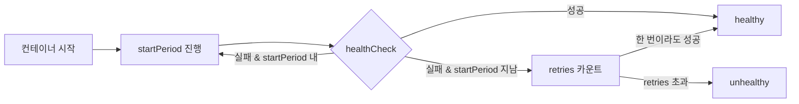
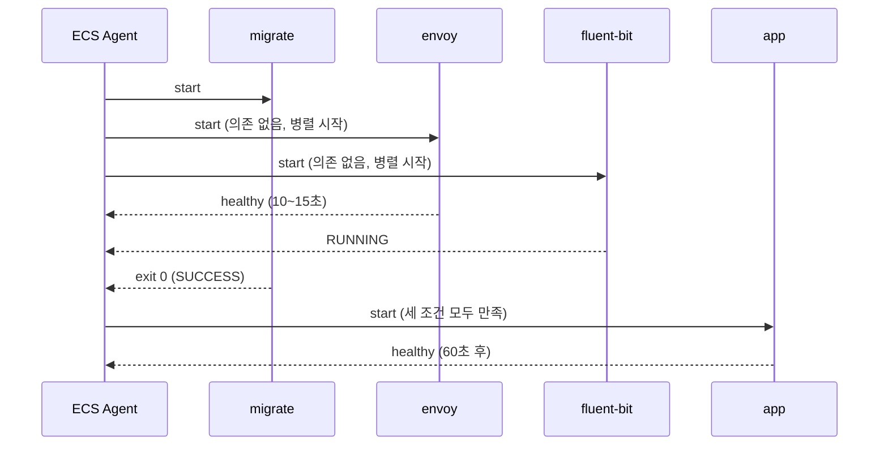

# ECS Task 컨테이너 의존성 관리

## 왜 의존성 관리가 필요한가

ECS Task 안에 컨테이너를 여러 개 넣는 순간 "누가 먼저 떠야 하는가", "누가 죽으면 누가 같이 죽어야 하는가", "한 컨테이너가 준비 중일 때 다른 컨테이너가 기다려야 하는가" 같은 문제가 생긴다. Task는 컨테이너들을 동시에 `docker run`으로 띄우는 게 아니라, Task Definition에 적힌 의존 관계를 풀어서 순서대로 띄운다. 의존성이 없으면 병렬로 띄우고, 있으면 기다린다.

실무에서 의존성 제어를 빼먹으면 생기는 전형적인 증상은 이렇다. DB 마이그레이션 init 컨테이너가 채 끝나기 전에 앱 컨테이너가 떠서 스키마 없는 테이블을 조회하며 5xx를 던진다. 시크릿을 가져오는 init이 끝나기 전에 앱이 부팅되어 환경 변수 없이 죽는다. 로그 sidecar(fluent-bit)가 늦게 떠서 부팅 직후 수십 초치 로그가 유실된다. Envoy 프록시가 아직 listen 안 했는데 앱이 upstream에 요청을 보내 connection refused가 난다.

이 문서는 `dependsOn`, `healthCheck`, `stopTimeout`, `essential`의 조합을 어떻게 짜야 이런 증상이 안 나는지, Fargate와 EC2에서 동작이 어떻게 갈리는지, 배포 직후 `UNHEALTHY`로 Task가 계속 replace되는 상황을 어떻게 방지하는지 다룬다.

---

## dependsOn의 4가지 조건

`dependsOn`은 Task Definition의 `containerDefinitions[].dependsOn` 배열로 정의한다. 각 항목은 `containerName`과 `condition` 두 필드로 이뤄진다. `condition`은 `START`, `COMPLETE`, `SUCCESS`, `HEALTHY` 네 값 중 하나다. 이름이 비슷해 보이지만 의미가 완전히 다르다.

```json
{
  "name": "app",
  "dependsOn": [
    { "containerName": "migrate", "condition": "SUCCESS" },
    { "containerName": "envoy", "condition": "HEALTHY" },
    { "containerName": "fluent-bit", "condition": "START" }
  ]
}
```

이 선언은 "migrate가 0으로 끝나고, envoy가 헬스체크 통과하고, fluent-bit가 뜨기 시작해야 app이 부팅된다"로 읽힌다. 이걸 잘못 이해하면 엉뚱한 조건을 걸게 된다.

### START — 그냥 프로세스가 실행되기 시작

`START`는 ECS Agent가 해당 컨테이너를 `RUNNING` 상태로 본 시점이다. 안에서 프로세스가 실제로 요청을 받을 준비가 됐는지와는 무관하다. Docker가 컨테이너를 띄웠고 PID 1이 살아 있으면 그걸로 만족한다.

이걸 쓰는 경우는 "의존 대상이 정말 가벼운 sidecar라 거의 즉시 준비되고, 몇 초 늦게 준비돼도 상관없는 경우"다. 예를 들어 fluent-bit 같은 로그 수집기는 stdout을 읽는 구조라 앱이 먼저 떠도 어차피 Docker log driver 버퍼로 일부가 남기 때문에, `START`만 걸어도 크게 문제가 안 된다.

단 주의할 게 있다. `START`는 헬스체크를 기다리지 않기 때문에, 프록시를 `START`로 걸면 앱이 `localhost:9901`에 연결 시도할 때 프록시 포트가 아직 listen 중이 아닐 수 있다. 그때는 `HEALTHY`를 써야 한다.

### COMPLETE — 종료 코드 무시, 끝나기만 하면 OK

`COMPLETE`는 의존 대상 컨테이너가 `Stopped` 상태가 되면 조건을 만족한다. 종료 코드가 0이든 1이든 상관없다. 이 조건이 실무에서 헷갈리는 지점이다.

예를 들어 "DB 스냅샷을 S3에 백업하는 일회성 컨테이너가 성공하든 실패하든 앱은 뜬다"처럼 실패해도 후속 컨테이너는 떠야 하는 시나리오에만 쓴다. 마이그레이션이 실패했는데 앱이 뜨면 안 되는 상황에서 `COMPLETE`를 걸면 스키마 안 맞는 앱이 서비스에 올라간다. 대부분의 init 컨테이너는 `COMPLETE`가 아니라 `SUCCESS`가 맞다.

### SUCCESS — 종료 코드 0으로 끝나야 한다

`SUCCESS`는 의존 대상 컨테이너가 `Stopped`이면서 종료 코드가 0일 때만 조건을 만족한다. DB 마이그레이션, 시크릿 fetch, 초기 파일 권한 설정 같은 일회성 init 컨테이너에 쓴다.

`SUCCESS` 조건이 실패하면(종료 코드가 0이 아니면) 해당 의존 체인에 물린 컨테이너들은 절대 시작되지 않는다. Task 자체가 `STOPPED`로 전환되면서 `Essential container in task exited` 또는 의존 실패 사유로 종료된다. ECS 서비스는 새 Task를 스케줄링하려 시도하고, 마이그레이션이 계속 실패하면 Task가 무한 replace되면서 CPU/네트워크만 태운다. 그래서 `SUCCESS`를 쓸 때는 의존 대상 init 컨테이너 자체에 재시도/백오프 로직이 들어가 있거나, 실패 시 Task를 빨리 포기하도록 타임아웃을 설정해야 한다.

### HEALTHY — healthCheck 통과해야 한다

`HEALTHY`는 의존 대상 컨테이너에 정의된 `healthCheck`가 성공 상태로 전환될 때까지 기다린다. 의존 대상에 `healthCheck`가 정의되어 있지 않으면 이 조건은 영원히 만족되지 않는다. Task는 `PROVISIONING`에서 더 이상 진행하지 못하고 결국 타임아웃으로 죽는다. 가장 흔한 함정이다.

서비스 역할을 하는 sidecar — Envoy, nginx 역방향 프록시, 로컬 Redis, DB 커넥션 풀 프록시 — 에 쓴다. "앱이 sidecar의 기능을 실제로 사용해야 하는" 경우에는 반드시 `HEALTHY`를 써야 한다.

---

## healthCheck 정의 — 각 필드의 실제 의미

`dependsOn: HEALTHY`를 쓰려면 의존 대상에 `healthCheck`가 반드시 있어야 한다. ECS의 healthCheck는 Docker의 `HEALTHCHECK` 명령과 동일한 형태로 생겼고, 결과도 Docker의 `healthy`/`unhealthy`/`starting` 세 상태를 그대로 쓴다.

```json
{
  "name": "envoy",
  "image": "envoyproxy/envoy:v1.28.0",
  "healthCheck": {
    "command": [
      "CMD-SHELL",
      "curl -f http://localhost:9901/ready || exit 1"
    ],
    "interval": 10,
    "timeout": 3,
    "retries": 3,
    "startPeriod": 30
  }
}
```

### command

`command` 배열의 첫 원소는 반드시 `CMD` 또는 `CMD-SHELL`이다.

- `CMD`: 첫 원소 뒤에 오는 값들을 `execve`로 직접 실행한다. 셸이 없으므로 `||`, `$()`, 리다이렉션 같은 건 안 된다. `["CMD", "curl", "-f", "http://localhost:9901/ready"]`.
- `CMD-SHELL`: 나머지 문자열을 `/bin/sh -c`로 실행한다. 셸 문법이 다 먹는다. 거의 대부분 `CMD-SHELL`을 쓴다.

healthCheck가 실제로 실행되는 곳은 **컨테이너 내부**다. 호스트에서 실행되는 게 아니다. 이게 의외로 많이 놓치는 부분인데, `curl`이 컨테이너 안에 없으면 healthCheck가 매번 "command not found"로 실패한다. Envoy 공식 이미지, 최소화한 distroless 이미지, `FROM scratch` 기반 Go 바이너리 이미지에는 `curl`, `wget`, `sh`도 없다. 이런 경우에는 앱이 바이너리로 `--health-check` 플래그를 받게 하거나, `wget -q -O - http://localhost:port/health` 대신 Go 앱이면 healthcheck 엔드포인트를 `/bin/grpc_health_probe` 같은 정적 바이너리로 호출하게 해야 한다.

### interval / timeout / retries

- `interval`(초): healthCheck를 몇 초 간격으로 실행할지. 기본 30, 최소 5, 최대 300.
- `timeout`(초): healthCheck 명령이 이 시간 안에 끝나지 않으면 이번 시도는 실패 처리. 기본 5, 최소 2, 최대 60.
- `retries`: 연속 몇 번 실패하면 `unhealthy`로 판정할지. 기본 3, 최소 1, 최대 10.

셋을 곱하면 대략 "최악의 경우 몇 초 만에 unhealthy로 확정되는가"가 나온다. `interval:10, timeout:3, retries:3`이면 대략 첫 실패 후 20~30초 뒤에 unhealthy가 된다. 앱 특성상 일시적인 GC pause, 긴 SQL, 짧은 네트워크 블립을 `unhealthy`로 만들고 싶지 않다면 `retries`를 3~5로 둔다. 반대로 빨리 fail-over해야 하는 서비스라면 `retries:2`로 짧게 가져간다.

### startPeriod — 부팅 중 unhealthy 판정을 막는 유예 시간

`startPeriod`(초)는 컨테이너 시작 직후의 유예 시간이다. 이 시간 안에는 healthCheck가 실패해도 `unhealthy`로 카운트하지 않는다. 대신 healthCheck가 성공하면 그 순간 `starting`에서 `healthy`로 넘어간다. 기본 0, 최대 300초.

JVM 앱처럼 JIT 워밍업 + 클래스 로딩 + Spring 컨텍스트 초기화로 30~60초가 걸리는 경우, `startPeriod`를 설정하지 않으면 부팅 중 healthCheck가 계속 실패해서 `interval * retries` 만에 unhealthy로 판정된다. 그러면 Service Scheduler가 Task를 죽이고 새로 띄운다. 새 Task도 똑같이 부팅에 30초 걸리고 또 죽는다. 무한 루프다.

`startPeriod`를 잡을 때는 "해당 앱의 콜드 스타트 시간 + 여유 20%" 정도로 설정한다. Spring Boot 앱이 평균 45초 걸리면 `startPeriod: 60`이 적당하다. 너무 길게 잡아도 손해는 없지만, 이 시간 동안은 진짜 죽은 앱도 unhealthy로 안 걸리니까 과하게는 쓰지 않는다.



---

## essential과 비-essential의 라이프사이클

`essential`은 Task 재시작 범위를 결정하는 플래그다. `dependsOn`과 직접 관계는 없지만, 다중 컨테이너 Task에서 의존 관계와 함께 설계해야 할 필수 요소다.

`essential: true` 컨테이너가 종료되면(정상이든 비정상이든) ECS Agent는 Task의 나머지 컨테이너에 `SIGTERM`을 보내고 Task 전체를 `STOPPED`로 전환한다. 기본값은 `true`다.

`essential: false` 컨테이너는 종료되어도 Task가 살아 있다. 다른 essential 컨테이너들은 계속 돌고, 비-essential 컨테이너는 `Stopped` 상태로 Task 안에 남는다. ECS는 자동으로 재시작하지 않는다. 이게 init 컨테이너 패턴의 핵심이다. DB 마이그레이션 컨테이너는 `essential: false`로 두고 실행 후 종료시키는데, 이때 Task가 같이 죽으면 안 되기 때문이다.

init 컨테이너에 해당하는 조합은 이렇다.

- `essential: false` (끝나도 Task는 살아 있다)
- 의존 컨테이너에서 `dependsOn: SUCCESS` 또는 `COMPLETE`로 참조 (이 init이 끝날 때까지 기다린다)
- 스스로는 `dependsOn`을 갖지 않거나, 다른 init에만 의존

init이 아닌 서비스성 sidecar는 이렇게 둔다.

- 트래픽 받는 프록시 → `essential: true` (죽으면 앱도 의미 없음)
- 로그 수집기 → `essential: false` (죽어도 stdout은 Docker가 일단 버퍼링)
- 모니터링 agent → `essential: false`
- 서비스 메시 사이드카 → 상황에 따라. Envoy가 outbound 필수 경로면 `true`.

---

## stopTimeout과 graceful shutdown

Task가 종료될 때 ECS는 각 컨테이너에 `SIGTERM`을 먼저 보내고, `stopTimeout` 초 안에 스스로 종료하지 않으면 `SIGKILL`로 강제 종료한다. 기본값은 30초, 최대는 EC2에서 120초, Fargate에서 120초다. 단 Fargate는 플랫폼 버전에 따라 제약이 있다.

graceful shutdown 설계는 네 가지를 동시에 고려해야 한다.

첫째, **종료 순서**. `dependsOn`이 걸려 있으면 ECS는 역순으로 종료한다. 즉 `app`이 `envoy`를 `dependsOn: HEALTHY`로 의존하면, 종료 시에는 `app`이 먼저 `SIGTERM`을 받고, `app`이 완전히 종료되거나 `stopTimeout`이 지난 뒤에 `envoy`가 `SIGTERM`을 받는다. 이게 중요한 이유는 "프록시가 먼저 죽어서 outbound 요청이 connection refused로 깨지는" 상황을 막기 위함이다.

둘째, **앱의 SIGTERM 핸들링**. `SIGTERM`을 받으면 앱은 in-flight 요청을 끝내고, health 엔드포인트를 `false`로 바꾸고, ALB Target Group에서 draining 완료를 기다린 뒤 종료해야 한다. Spring Boot는 `server.shutdown=graceful`, Node는 `server.close()`, Go는 `http.Server.Shutdown()`이다. 이 핸들링이 없으면 `SIGTERM` 순간 in-flight 요청이 끊겨 5xx가 뜬다.

셋째, **stopTimeout 조정**. ALB의 deregistration delay가 30초면 앱의 `stopTimeout`은 그보다 여유 있게 60초 정도로 둔다. stopTimeout이 deregistration delay보다 짧으면 ALB가 아직 draining 중인데 앱이 SIGKILL로 죽어서 `connection reset`이 발생한다.

넷째, **sidecar stopTimeout**. fluent-bit 같은 로그 sidecar는 앱이 죽고 난 뒤에 로그 flush 시간이 필요하다. 앱의 `stopTimeout`이 60초면 fluent-bit은 그보다 짧으면 안 된다. 기본 30초로 두면 앱의 마지막 30초 로그가 날아간다. fluent-bit `stopTimeout`을 90초 정도로 늘려야 한다.

```json
{
  "containerDefinitions": [
    {
      "name": "app",
      "essential": true,
      "stopTimeout": 60,
      "dependsOn": [
        { "containerName": "envoy", "condition": "HEALTHY" }
      ]
    },
    {
      "name": "envoy",
      "essential": true,
      "stopTimeout": 90
    },
    {
      "name": "fluent-bit",
      "essential": false,
      "stopTimeout": 90
    }
  ]
}
```

---

## 시작 순서 제어 — 실제 예제

흔한 시나리오 하나를 끝까지 짜보자. "API 서버 Task, DB 마이그레이션 init, Envoy outbound 프록시, fluent-bit 로그 sidecar" 구성이다.

요구사항은 이렇다.

- DB 마이그레이션이 끝나기 전에는 앱이 뜨면 안 된다. 마이그레이션이 실패하면 앱도 뜨면 안 된다.
- 앱은 outbound 요청을 `localhost:15001`의 Envoy로 보낸다. Envoy가 listen하기 전에 앱이 요청을 시도하면 connection refused가 난다.
- fluent-bit은 앱의 stdout을 받는다. 앱보다 늦게 떠도 괜찮지만, 크게 늦지 않아야 한다.
- 종료 순서: 앱 → Envoy → fluent-bit 순으로 종료되어 outbound와 로그 흐름이 앱보다 오래 유지되어야 한다.

```json
{
  "family": "api-task",
  "networkMode": "awsvpc",
  "containerDefinitions": [
    {
      "name": "migrate",
      "image": "123456789012.dkr.ecr.ap-northeast-2.amazonaws.com/api-migrate:1.4.0",
      "essential": false,
      "environment": [
        { "name": "DB_URL", "value": "postgresql://..." }
      ]
    },
    {
      "name": "envoy",
      "image": "123456789012.dkr.ecr.ap-northeast-2.amazonaws.com/envoy:v1.28.0",
      "essential": true,
      "portMappings": [{ "containerPort": 15001 }],
      "healthCheck": {
        "command": ["CMD-SHELL", "curl -f http://localhost:9901/ready || exit 1"],
        "interval": 5,
        "timeout": 2,
        "retries": 3,
        "startPeriod": 10
      },
      "stopTimeout": 90
    },
    {
      "name": "fluent-bit",
      "image": "public.ecr.aws/aws-observability/aws-for-fluent-bit:stable",
      "essential": false,
      "firelensConfiguration": { "type": "fluentbit" },
      "stopTimeout": 90
    },
    {
      "name": "app",
      "image": "123456789012.dkr.ecr.ap-northeast-2.amazonaws.com/api:1.4.0",
      "essential": true,
      "portMappings": [{ "containerPort": 8080 }],
      "dependsOn": [
        { "containerName": "migrate", "condition": "SUCCESS" },
        { "containerName": "envoy", "condition": "HEALTHY" },
        { "containerName": "fluent-bit", "condition": "START" }
      ],
      "healthCheck": {
        "command": ["CMD-SHELL", "curl -f http://localhost:8080/actuator/health/readiness || exit 1"],
        "interval": 10,
        "timeout": 3,
        "retries": 3,
        "startPeriod": 60
      },
      "stopTimeout": 60,
      "logConfiguration": { "logDriver": "awsfirelens" }
    }
  ]
}
```

시작 순서를 시퀀스로 그리면 이렇다.



세 가지 의존성이 모두 만족되어야 `app`이 시작되고, 그중 하나라도 실패(migrate의 non-zero exit, envoy의 지속적 unhealthy)하면 Task가 실패로 떨어진다. 마이그레이션이 실패하면 `Stopped reason`에 `CannotStartContainerError: dependent container migrate exited with non-zero status`가 찍힌다.

종료 시에는 `app`이 먼저 `SIGTERM`을 받고, `app`이 종료되어야 `envoy`와 `fluent-bit`가 `SIGTERM`을 받는다. 이 역순 종료는 `dependsOn` 체인에 의해 자동으로 보장된다.

---

## Fargate에서 dependsOn 동작 차이

대부분은 EC2 런치 타입과 Fargate가 동일하게 동작하지만, 몇 가지 차이가 있다.

첫째, **Fargate 1.3.0 미만**은 `dependsOn` 자체를 지원하지 않는다. 현재 기본 플랫폼 버전은 `LATEST`(1.4.0 이상)이라 신경 쓸 일이 거의 없지만, `platformVersion`을 명시적으로 낮게 잡은 레거시 서비스가 있으면 이 문제에 걸린다.

둘째, **Fargate는 Docker 호스트 자원을 공유하지 않는다**. EC2 런치 타입에서는 호스트에 설치된 바이너리나 볼륨을 활용할 수 있지만 Fargate는 각 Task가 독립된 micro-VM이다. healthCheck 명령이 호스트 자원을 가정하면 Fargate에서 실패한다.

셋째, **stopTimeout 상한**. Fargate에서 `stopTimeout`은 최대 120초까지 설정 가능하지만, 플랫폼 버전 1.3.0 이전 버전에서는 기본 30초로 고정되어 있었다. 현재 쓰는 1.4.0/LATEST에서는 최대 120초다.

넷째, **컨테이너 단위 재시작이 없다**. EC2 런치 타입의 ECS Agent는 비-essential 컨테이너가 죽어도 그 컨테이너만 복구하지 않는다. Fargate도 마찬가지다. 이 점은 동일하다. 다만 Fargate에서는 Task 자체의 replace가 EC2보다 무겁다(새 ENI 할당, 새 micro-VM 부팅)는 점은 기억해둬야 한다. 비-essential 컨테이너가 일찍 죽는 설계로 가면 관찰성 구멍이 생기고, 그걸 복구하려고 Task 전체를 재기동시키면 콜드 스타트 비용이 크다.

다섯째, **ephemeralStorage 공유**. 한 Task 안 모든 컨테이너가 같은 ephemeral storage를 본다. 마이그레이션 init이 `/tmp/seed.sql`을 만들고, 앱이 그걸 읽는 식의 파일 기반 통신이 가능하다. 단 `volumesFrom`이나 `mountPoints`로 명시적으로 공유 볼륨을 선언해야 한다. 의존성 관리와 함께 자주 쓰는 패턴이다.

---

## 흔한 실수와 증상

### Circular dependency

`A dependsOn B: START` + `B dependsOn A: START` 같은 관계를 만들면 Task Definition 등록 시점에 ECS API가 거부한다. 에러 메시지는 `Container dependencies contain a cycle`이다. API가 막아주긴 하지만, 중간에 여러 컨테이너가 낀 간접 순환은 알아보기 힘들다. `A → B → C → A` 같은 체인을 TF/CDK 리팩터링 중에 실수로 만들기 쉽다.

해결은 "의존은 단방향 DAG여야 한다"는 원칙을 지키는 것이다. 그림 그리면 바로 보인다. 정 통신이 필요하면 의존 관계가 아니라 네트워크(localhost:port)로 해결해야 한다.

### healthCheck 명령이 컨테이너 안에 없음

`distroless`, `FROM scratch` 기반 이미지에 `curl` 같은 명령이 들어 있다고 가정하고 `healthCheck: {"command": ["CMD-SHELL", "curl -f ..."]}`를 적으면 매번 `/bin/sh: curl: command not found`로 실패한다. 로그에는 healthCheck 실패가 찍히는데 앱은 정상 작동하니까 "왜 unhealthy지" 헤맨다.

확인 방법은 간단하다. `docker inspect --format '{{.Config.Healthcheck}}'` 또는 ECS Exec으로 Task에 붙어서 직접 healthCheck 명령을 쳐본다. 해결은 세 가지다.

- 앱 이미지에 `curl`이나 `wget`을 포함시킨다. distroless 포기.
- 앱 바이너리가 자체 healthcheck를 제공하게 한다. `./app health` 서브커맨드.
- `grpc_health_probe` 같은 정적 바이너리를 multi-stage build로 이미지에 추가한다.

### startPeriod 미설정으로 콜드 스타트 중 unhealthy

JVM 앱에 `startPeriod`를 안 걸고 `interval: 10, retries: 3`만 설정하면, 부팅에 45초 걸리는 앱이 30~40초 구간에 unhealthy로 판정되어 Service Scheduler가 Task를 죽인다. 새 Task가 뜨고 같은 이유로 또 죽는다.

증상은 ECS Console의 `Stopped reason`에 `Task failed ELB health checks in (target-group...)` 또는 컨테이너 stopped 이유에 `Essential container in task exited`가 반복적으로 찍힌다. CloudWatch에 앱 로그는 "Started Application in 45 seconds"까지 찍히고 바로 `Shutting down`이 찍힌다. 부팅이 끝나자마자 죽는 전형적인 패턴이다.

해결은 `startPeriod`를 앱의 콜드 스타트 시간보다 넉넉히 잡는 것이다. Spring Boot면 60~120초, Node.js면 10~30초, Go면 보통 10초면 충분하다.

### 의존 대상에 healthCheck가 없는데 HEALTHY로 의존

`dependsOn: HEALTHY`를 썼는데 의존 대상에 `healthCheck`가 정의되지 않았으면 해당 컨테이너는 영원히 `healthy` 상태가 되지 않는다. Task는 PROVISIONING에서 멈춰 있다가 Task launch 타임아웃으로 죽는다. 에러 메시지가 "dependency never became healthy" 같은 형태라 원인 찾기 어렵지 않지만, Task Definition을 JSON으로 관리할 때 healthCheck 블록을 실수로 지워놓고 HEALTHY 의존을 남겨둔 케이스가 의외로 자주 발생한다.

등록 시점에 잡히는 오류가 아니라 런타임에 발견되는 오류라, CI에서 Task Definition을 바꾸는 PR이라면 staging에 반드시 한 번은 배포해서 Task가 RUNNING까지 가는지 확인해야 한다.

### init 컨테이너를 essential:true로 둠

마이그레이션 init을 `essential: true`로 두면, 마이그레이션이 정상적으로 종료 코드 0으로 끝나는 순간 ECS가 "essential 컨테이너가 종료됐다"며 Task 전체를 중지한다. 앱이 뜰 기회 없이 Task가 `STOPPED`로 떨어지고, Service Scheduler가 Task를 재시작하며 같은 패턴이 무한 반복된다. init 컨테이너는 반드시 `essential: false`여야 한다.

### healthCheck interval을 너무 짧게

`interval: 5, timeout: 3, retries: 2`처럼 공격적으로 잡으면, GC pause나 일시적인 네트워크 블립으로 10초 만에 unhealthy 판정이 난다. 서비스가 replace 루프에 빠진다. 대부분의 앱은 `interval: 10~30, retries: 3` 정도가 안정적이다.

### stopTimeout이 ALB deregistration delay보다 짧음

ALB Target Group의 deregistration delay가 60초인데 앱 컨테이너의 `stopTimeout`을 기본 30초로 두면, ALB가 아직 draining 중인 시점에 컨테이너가 SIGKILL로 죽어서 in-flight 요청이 `connection reset`으로 깨진다. 배포할 때마다 5xx가 잠깐씩 튄다. ALB deregistration delay와 앱 `stopTimeout`은 항상 "stopTimeout ≥ deregistration delay + graceful shutdown 여유"를 만족해야 한다.
