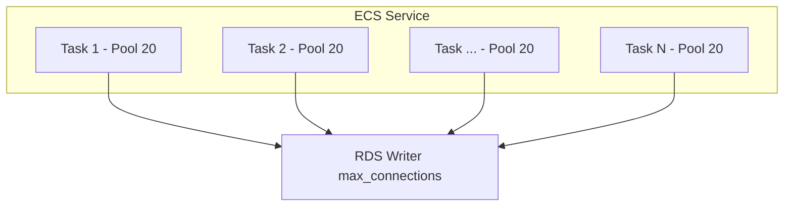
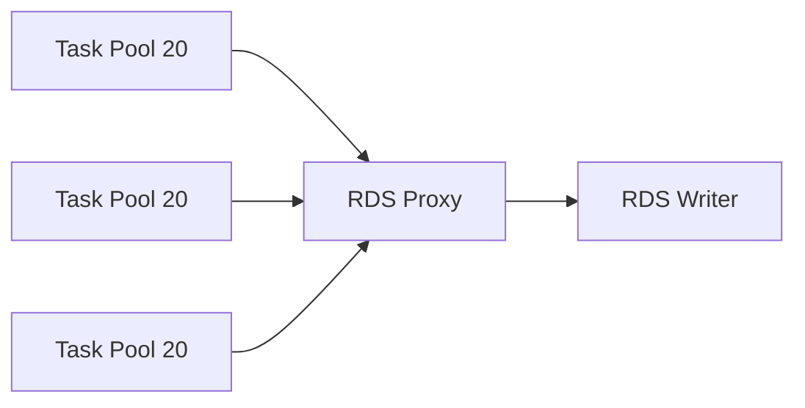

# ECS Task 스케일 아웃에 따른 DB 커넥션 풀 관리

[ECS_Task_Scale_Out_부작용.md](ECS_Task_Scale_Out_부작용.md)에서 스케일 아웃이 RDS를 가장 자주 죽인다는 얘기를 했다. 이 문서는 그 부분만 떼어내서 깊게 본다. Task 한 개가 늘어났을 때 DB 쪽에서 실제로 무슨 일이 벌어지는지, 풀 사이즈를 어떻게 정하는지, RDS Proxy를 끼웠을 때 동작이 어떻게 달라지는지, scale-in 직후에 트랜잭션이 어떻게 끊기는지를 정리한다.

핵심은 한 줄이다. 커넥션은 스케일 아웃에 자동으로 따라가지 않는다. 풀 설정은 Task 1개 기준으로 정해지고, RDS는 그 합계를 그대로 받는다. 이 비대칭이 모든 사고의 원인이다.

## Task 한 개의 풀이 RDS에 미치는 영향

awsvpc 모드의 Task 1개는 ENI 1개를 가지고, 그 안에서 애플리케이션 프로세스가 떠 있고, 그 프로세스는 자기만의 커넥션 풀을 들고 있다. Task 100개가 있으면 풀도 100개가 떠 있고, 각각 RDS와 TCP 연결을 따로 맺는다. RDS 입장에서 ECS 서비스 하나는 클라이언트 1개가 아니라 Task 수만큼의 클라이언트다.



Task당 풀 20, Task 100개면 RDS는 한순간에 2000개 커넥션을 들고 있어야 한다. 풀의 idle 커넥션도 실제 TCP 연결로 잡혀 있다는 점을 잊으면 안 된다. HikariCP의 `minimumIdle`을 0으로 해놓지 않는 한 풀의 최소 사이즈만큼은 항상 RDS에 커넥션이 떠 있다.

## 풀 사이즈 산정 공식

5년차 운영 입장에서 쓰는 식은 단순하다.

```
desired count × pool max + 운영자 직접 접속 + 마이그레이션 툴 + 외부 클라이언트 ≤ RDS max_connections × 0.8
```

0.8을 곱하는 이유는 RDS가 내부적으로 `rds_superuser`, `rdsadmin`, replication, monitoring 슬롯을 미리 잡고 있기 때문이다. db.r6g.xlarge에서 max_connections가 3000이면 실사용 가능한 건 2400 정도로 본다. 거기에 알람 임계치를 80%로 잡으려면 사용량을 1900~2000 안쪽으로 유지해야 마음이 편하다.

서비스 여러 개가 같은 RDS를 쓰는 경우엔 서비스별로 quota를 미리 나눠놓는다. 메인 API에 1500, 백오피스에 300, 배치에 200, 운영자 100 같은 식이다. 각 서비스의 max desired count를 그 quota를 넘지 않도록 ECS Service Auto Scaling의 `MaxCapacity`로 박아둔다. 서비스가 자기 한도를 넘어 스케일 아웃하면 다른 서비스가 RDS에 못 붙는 상황이 생기는데, 이걸 코드 레벨에서 막을 방법이 없으므로 인프라에서 강제한다.

배포 중 잠깐 두 배가 되는 구간도 계산에 넣어야 한다. ECS Service의 `deploymentConfiguration.maximumPercent`가 200%면 배포 동안 desired count의 2배가 일시적으로 떠 있다. 메인 API가 평소 100개로 풀 20을 쓰면 정상 시 2000 커넥션, 배포 중 일시적으로 4000 커넥션이다. RDS max_connections가 3000이라면 배포 자체가 RDS를 떨어뜨린다. `maximumPercent`를 150%로 낮추거나, 풀 사이즈를 그에 맞춰 줄이거나, 배포 직전에 RDS 인스턴스 클래스를 잠깐 키우는 식의 대응이 필요하다.

## Aurora writer/reader 분배

Aurora Cluster를 쓰면 writer 1개와 reader N개가 있고, 각 노드마다 max_connections가 따로 적용된다. 그런데 애플리케이션의 풀은 writer endpoint와 reader endpoint를 별도로 잡는 경우가 많아서, Task 1개당 풀이 두 개가 된다.

```
Task 1 = writer pool 20 + reader pool 20 = RDS 측 40 커넥션
```

Task 100개면 writer에 2000, reader 클러스터(노드 3개라면 분산되어 노드별 ~666)에 2000이 잡힌다. reader 노드가 적을 때는 reader 쪽이 먼저 한계에 부딪힌다. db.r6g.xlarge reader 한 개에 666 커넥션이 박히면 다른 클라이언트가 못 붙는다.

reader endpoint는 DNS 라운드로빈으로 각 reader 노드 IP를 돌려준다. JDBC 드라이버가 connection 단위로만 reader를 골라잡는 경우 풀 안에서 한 번 결정된 reader가 그 커넥션이 닫힐 때까지 고정된다. 풀 사이즈가 작으면 특정 reader에 커넥션이 쏠릴 수 있다. Aurora cluster endpoint나 reader endpoint를 쓰는 대신, 직접 노드별 endpoint를 풀에 등록해서 균일하게 분산시키는 방법도 있다.

리더 자동 페일오버 후 풀이 stale 커넥션을 들고 있는 문제도 있다. 리더가 writer로 승격되거나 새 리더로 교체되면 기존 풀의 커넥션은 더 이상 유효하지 않은 노드를 가리킨다. HikariCP의 `keepaliveTime`을 30초~1분으로 잡거나 `validationTimeout` 안쪽에서 `SELECT 1` 같은 검증 쿼리가 도는지 확인해야 stale 커넥션이 빨리 빠진다.

## RDS Proxy를 끼웠을 때 풀 동작

RDS Proxy는 ECS와 RDS 사이에 들어가서 커넥션을 multiplex한다. 그림으로 보면 단순하다.



Task가 RDS Proxy에 100개 × 20 = 2000 커넥션을 맺어도, RDS Proxy는 RDS Writer에 max_connections의 일정 비율(`MaxConnectionsPercent`, 기본 100%)까지만 실제 커넥션을 만든다. Task가 늘어도 RDS 쪽 커넥션은 거의 일정하다.

다만 동작 차이를 알고 써야 한다. RDS Proxy는 트랜잭션 모드로 pinning이 발생하면 multiplexing을 못 한다. 다음 경우에 핀이 박힌다.

- `SET` 명령으로 세션 변수 변경 (`SET LOCAL`은 pinning 안 됨)
- prepared statement (MySQL의 일부 케이스)
- LOCK TABLES, GET_LOCK 같은 세션 락
- temporary table 생성
- 트랜잭션 안에서 명시적 잠금

ORM이 자동으로 prepared statement를 쓰는 경우(JPA + PostgreSQL의 prepareThreshold>0), 거의 모든 커넥션이 pinning되어서 RDS Proxy의 multiplexing 효과가 사라진다. PostgreSQL JDBC URL에 `prepareThreshold=0`을 박거나, MySQL이면 `useServerPrepStmts=false`를 박는다.

CloudWatch에서 RDS Proxy의 `DatabaseConnectionsCurrentlyInTransaction`, `DatabaseConnectionsCurrentlySessionPinned` 메트릭을 본다. session pinned 비율이 높으면 multiplexing이 안 되고 있다는 뜻이다.

비용도 따져야 한다. RDS Proxy는 vCPU당 시간 요금이 따로 붙는다. db.r6g.xlarge(4 vCPU)에 RDS Proxy를 붙이면 시간당 약 $0.060, 월 $43 정도가 추가된다. multiplexing 효과가 작은데 굳이 붙이면 비용만 늘어난다. Task 수가 많지 않거나 풀 크기가 작은 서비스는 RDS Proxy 없이 풀 튜닝만으로 충분한 경우가 많다.

## 풀 워밍업과 cold start

새로 뜬 Task가 ALB로 등록된 직후 첫 수십~수백 요청이 느린 이유 중 하나가 풀 워밍업이다. HikariCP 기준 `minimumIdle`이 0이면 첫 요청 시 풀이 0에서 시작해서 매번 신규 커넥션을 만든다. TCP handshake + TLS handshake + DB authentication까지 합치면 RDS 기준 50~150ms가 든다. 동기 프레임워크에서 첫 요청이 그만큼 늦어지면 ALB 헬스체크가 먼저 통과하고 트래픽이 들어오기 시작한 뒤에 풀이 채워지므로, 처음 들어온 사용자 요청이 직격탄을 맞는다.

해결은 두 가지다. 첫째, `minimumIdle`을 `maximumPoolSize`와 같게 맞춘다. Task 시작 시 풀이 미리 다 차므로 첫 요청부터 평소 속도가 나온다. 단점은 idle 커넥션이 RDS에 부담이라는 점이다. 둘째, 기동 시 self-call로 더미 요청을 보내서 풀을 데우고 ALB 헬스체크를 그 뒤에 통과시킨다. ECS Task의 `containerDefinitions[].healthCheck`에 풀 워밍업 후 OK를 반환하는 자체 헬스 엔드포인트를 걸어두는 방식이다.

```yaml
{
  "healthCheck": {
    "command": ["CMD-SHELL", "curl -f http://localhost:8080/internal/ready || exit 1"],
    "interval": 10,
    "timeout": 5,
    "retries": 3,
    "startPeriod": 60
  }
}
```

`startPeriod` 60초는 풀 워밍업과 JIT 컴파일이 끝나기 전까지 헬스체크 실패를 무시하는 grace 구간이다. ALB Target Group의 `HealthCheckGracePeriodSeconds`도 같이 맞춘다.

## idle timeout과 RDS wait_timeout 충돌

이게 운영 중에 가장 자주 헷갈리는 부분이다. 풀의 `idleTimeout`(HikariCP), `idle_in_transaction_session_timeout`(Postgres), `wait_timeout`(MySQL)이 서로 다른 시간을 들고 있으면 풀이 가지고 있는 커넥션이 RDS 쪽에서 먼저 끊겨 있는 상태가 된다.

전형적인 패턴이다. MySQL `wait_timeout`이 기본 28800초(8시간), `interactive_timeout`도 8시간. 그런데 RDS의 ECS와 RDS 사이에 NAT Gateway가 끼어 있고, NAT의 idle connection timeout은 350초로 고정이다. 풀이 5분 이상 idle 상태로 두면 NAT이 먼저 커넥션을 끊는다. 그 다음에 풀에서 그 커넥션을 꺼내서 쿼리를 날리면 `Connection reset by peer` 또는 `EOFException`이 뜬다.

대응은 풀의 `keepaliveTime` 또는 `idleTimeout`을 NAT timeout보다 짧게 잡는다. HikariCP면 `keepaliveTime=30000`(30초)으로 잡으면 idle 커넥션에 주기적으로 keepalive 쿼리를 날려서 NAT이 끊지 못하게 한다. 또는 `idleTimeout=300000`(5분)으로 잡고 NAT timeout 도달 전에 풀이 먼저 커넥션을 회수한다.

PostgreSQL은 추가로 `idle_in_transaction_session_timeout`을 봐야 한다. 트랜잭션을 BEGIN하고 commit/rollback 안 하면 커넥션이 idle in transaction 상태로 남는데, 이게 길어지면 vacuum이 막혀서 테이블 bloat이 생긴다. RDS 파라미터 그룹에서 `idle_in_transaction_session_timeout=60000`(1분) 정도로 잡으면 코드 버그로 트랜잭션을 안 닫는 경우 RDS가 알아서 끊어준다. 풀 입장에선 invalid 커넥션이 되므로 풀의 validation이 제대로 도는지도 같이 확인한다.

## 풀 고갈과 acquireTimeout 에러 패턴

풀의 max를 넘는 동시 요청이 들어오면 그 이상은 풀에서 커넥션을 받을 때까지 대기한다. 이 대기 시간이 `connectionTimeout`(HikariCP, 기본 30초)을 넘기면 acquire 실패 예외가 뜬다.

HikariCP에서는 `HikariPool-1 - Connection is not available, request timed out after 30000ms`. node-mysql2의 `pool.getConnection()`은 콜백/Promise reject로 timeout error를 돌려준다. pgx는 `context.DeadlineExceeded`로 빠진다.

이 에러가 보이는 시점에는 풀 자체가 비어있는 게 아니라 풀이 꽉 찬 상태로 더 이상 빌릴 데가 없다는 뜻이다. 진단 우선순위는 다음과 같다.

첫째, 풀에 들고 있는 커넥션이 실제로 쿼리를 처리 중인지, 아니면 트랜잭션을 안 닫고 hold 중인지 본다. PostgreSQL이면 `pg_stat_activity`의 `state` 컬럼이 `idle in transaction`인 커넥션이 많으면 코드 버그다.

```sql
SELECT pid, state, wait_event_type, wait_event,
       now() - state_change AS idle_for, query
FROM pg_stat_activity
WHERE state = 'idle in transaction'
ORDER BY idle_for DESC
LIMIT 20;
```

둘째, slow query가 풀을 점유하고 있는지 본다. 평소 50ms 끝나던 쿼리가 5초씩 걸리고 있으면 풀 회전율이 떨어져서 acquire 대기가 발생한다. RDS Performance Insights에서 top SQL과 Average Active Sessions(AAS)를 본다.

셋째, 외부 호출(Redis, 외부 API)에 막혀서 트랜잭션을 못 끝내는 패턴이 있는지 본다. 트랜잭션 안에서 외부 API를 호출하는 코드는 거의 항상 풀 고갈의 원인이다. 외부 호출은 트랜잭션 밖으로 빼는 게 원칙이다.

acquireTimeout 자체를 늘리는 건 마지막 수단이다. 60초로 늘리면 사용자는 60초 동안 응답을 못 받고 ALB의 `idle_timeout`(기본 60초)에 걸려서 504 Gateway Timeout이 떨어진다. acquireTimeout은 5~10초 안쪽으로 잡아서 빨리 실패하게 두고, 그 위 레벨에서 backpressure를 주거나 circuit breaker를 거는 게 낫다.

## scale-in 시 graceful drain과 트랜잭션 끊김

scale-in이 일어나면 ECS는 Task에 `SIGTERM`을 보내고 `stopTimeout`(기본 30초, 최대 120초) 동안 종료를 기다린다. 그 사이에 ALB는 deregistration delay 동안 새 트래픽을 끊는다. 문제는 이 두 타이머가 어긋나거나, 애플리케이션이 SIGTERM을 받아 풀을 즉시 닫아버리면 진행 중인 트랜잭션이 깨진다는 점이다.

HikariCP는 `pool.close()`를 호출하면 idle 커넥션을 즉시 닫고, in-use 커넥션은 반납될 때까지 기다린다. 다만 `shutdownTimeout`을 짧게 잡으면 in-use 커넥션도 강제로 끊는다. Spring Boot의 graceful shutdown(`server.shutdown=graceful`, `spring.lifecycle.timeout-per-shutdown-phase=30s`)을 쓰면 인입 요청이 끝날 때까지 기다린 다음 풀을 닫는다.

순서가 중요하다.

```
1. ALB가 deregister 시작 → 새 요청은 다른 Task로
2. 진행 중 요청이 처리 완료
3. 풀 종료 (커밋/롤백 끝난 커넥션부터 close)
4. 컨테이너 종료
```

이 순서가 깨지면 트랜잭션 도중에 커넥션이 끊겨서 PostgreSQL 측에 `idle in transaction (aborted)` 상태가 남는다. 다음 vacuum까지 그 트랜잭션이 잡고 있던 row lock이 해제되지 않을 수도 있다.

deregistration delay(기본 300초), `stopTimeout`(권장 60~120초), 애플리케이션 graceful shutdown timeout(30~60초)을 다음 관계로 맞춘다.

```
deregistration delay > stopTimeout > graceful shutdown timeout > 풀 close timeout
```

스케일 인이 자주 일어나는 환경(시간대별 트래픽 차이가 큰 서비스)에서는 이 설정이 어긋나면 시간당 수백 건씩 트랜잭션 끊김이 누적된다. 사용자에게는 결제 중복, 주문 누락 같은 형태로 나타난다.

## 헬스체크 SELECT 1이 풀을 점유하는 문제

ALB가 30초마다 `/health` 엔드포인트를 친다. 그 안에서 DB 검증으로 `SELECT 1`을 풀에서 커넥션을 빌려서 날리는 코드가 흔하다.

Task 100개에 ALB Target이 100개. 각 Target에 대해 ALB는 자기 헬스체크를 30초마다 한 번 보낸다. 거기에 NLB나 Route 53 health check, 외부 모니터링(Datadog Synthetics)까지 붙어 있으면 Task 1개에 초당 1~2회의 헬스체크가 들어오고, 그때마다 커넥션 풀에서 1개를 빌린다.

평소엔 `SELECT 1`이 1ms 이내라 문제가 안 보이는데, RDS가 부하를 받기 시작하면 헬스체크 응답도 느려지고 풀이 헬스체크에 잡혀서 실제 비즈니스 요청이 acquireTimeout으로 죽는 역설이 생긴다. 그리고 이 acquireTimeout이 헬스체크 자체를 실패시켜서 ALB가 Task를 unhealthy로 표시하고 트래픽을 끊는다. 이 사이클이 한번 시작되면 서비스 전체가 동시에 unhealthy로 빠진다.

대응은 두 가지다. 첫째, 헬스체크에서는 풀에서 커넥션을 빌리지 않는다. 풀 통계만 확인해서 minIdle 이상이면 OK를 반환한다. Spring Boot Actuator의 db indicator는 풀에서 커넥션을 빌리므로 `management.health.db.enabled=false`로 끄거나, 별도 readiness probe로 분리한다. 둘째, 헬스체크 전용 풀을 따로 둔다. 메인 풀이 꽉 차도 헬스체크 풀은 살아 있어서 ALB가 Task를 cascade로 죽이는 걸 막는다.

## Lambda ENI/Fargate burst와의 IP·커넥션 동시 경합

Lambda를 VPC에 붙이면 Hyperplane ENI를 통해 동일 서브넷의 IP를 쓴다. ECS Fargate Task와 같은 서브넷에 있으면 IP 풀을 같이 쓰므로 둘 다 늘어나는 시점이 겹치면 [ECS_Task_Scale_Out_부작용.md](ECS_Task_Scale_Out_부작용.md)에서 다룬 IP 고갈이 먼저 터진다.

DB 커넥션 측면에서도 Lambda는 Task와 다른 패턴이다. Lambda는 동시 실행 수만큼 컨테이너가 생기고, 각 컨테이너가 자기 풀(또는 단일 커넥션)을 들고 있다. 비율 기반 스케일이라 트래픽이 튀면 Lambda 동시 실행이 1000으로 점프하고, 각 Lambda가 RDS에 1개씩 커넥션을 꽂아도 1000 커넥션이 일순간에 들어온다. ECS의 점진적 스케일과 달리 spike가 심하다.

Lambda가 RDS에 직접 붙는 경우엔 RDS Proxy를 거의 강제로 써야 한다. ECS와 Lambda가 같은 RDS를 쓰는 경우 Proxy의 `MaxConnectionsPercent`를 적절히 나눠서 Lambda가 ECS의 quota를 침범하지 못하게 한다. Proxy에 인증 정책을 걸어서 Lambda 전용 endpoint와 ECS 전용 endpoint를 분리하는 방식도 쓴다.

## node-mysql2, HikariCP, PgBouncer 설정 비교

세 가지를 자주 보는데 동작과 권장 설정이 다르다.

**node-mysql2 (`mysql2/promise`)**

```javascript
const pool = mysql.createPool({
  host: 'rds-endpoint',
  user: 'app',
  database: 'main',
  connectionLimit: 5,
  queueLimit: 100,
  waitForConnections: true,
  enableKeepAlive: true,
  keepAliveInitialDelay: 10000,
  idleTimeout: 60000,
});
```

Node.js는 비동기 I/O라서 풀 사이즈가 작아도 처리량이 잘 나온다. 5~10이면 충분한 경우가 많다. `connectionLimit`을 키우면 RDS 부담만 늘고 Node.js 처리량은 별로 안 늘어난다. event loop가 single threaded라 동시에 활발히 쓰는 커넥션 수는 제한적이다. `queueLimit`을 0(무제한)으로 두면 풀이 막혔을 때 큐가 끝없이 쌓여서 OOM이 날 수 있으므로 명시적으로 잡는다. `enableKeepAlive`는 NAT/방화벽 idle drop 대응으로 켠다.

**HikariCP (Java)**

```properties
spring.datasource.hikari.maximum-pool-size=10
spring.datasource.hikari.minimum-idle=10
spring.datasource.hikari.connection-timeout=5000
spring.datasource.hikari.idle-timeout=300000
spring.datasource.hikari.keepalive-time=60000
spring.datasource.hikari.max-lifetime=1740000
spring.datasource.hikari.validation-timeout=2000
```

Spring MVC + Tomcat은 동기 처리라 thread 수와 풀 사이즈가 같이 가야 한다. Tomcat `server.tomcat.threads.max`가 200인데 풀이 10이면 thread 190개가 풀 대기에 갇힌다. 보통 풀 = max thread × 0.5 정도로 잡고, RDS 한도가 빡빡하면 `max-thread`를 줄여서 풀과 맞춘다. `max-lifetime`을 RDS의 `wait_timeout`보다 작게 잡는다(예: 29분 → max-lifetime 29분). MySQL 기본 wait_timeout 8시간이면 max-lifetime을 7시간 30분 정도로 둔다.

**PgBouncer (앞단 풀러)**

```ini
[databases]
main = host=aurora-writer.example dbname=main pool_size=50

[pgbouncer]
pool_mode = transaction
max_client_conn = 5000
default_pool_size = 50
reserve_pool_size = 5
server_idle_timeout = 600
```

PgBouncer는 ECS Task 앞단에 별도 사이드카로 띄우거나 EC2/ECS 별도 서비스로 운영한다. `pool_mode=transaction`이면 트랜잭션 단위로 백엔드 커넥션을 multiplex해서 Task 100개가 풀 50을 써도 실제 RDS 커넥션은 50개로 유지된다. 단점은 prepared statement, advisory lock, `SET SESSION`을 못 쓰는 것. PostgreSQL 14 이후의 protocol-level prepared statement는 PgBouncer 1.21부터 transaction 모드에서도 지원되지만 라이브러리에 따라 호환성을 검증해야 한다.

RDS Proxy와 PgBouncer를 비교하면 PgBouncer가 비용이 거의 0(컴퓨트만 쓰면 됨)이고 튜닝 폭이 넓지만 직접 운영해야 한다. 트래픽이 크지 않으면 RDS Proxy가 운영 부담 면에서 낫고, 풀 multiplexing 비율을 극단적으로 압축해야 하면 PgBouncer가 낫다.

## max_connections 모니터링 쿼리

operate-side에서 매일 보는 쿼리들이다.

**PostgreSQL: 현재 사용량과 한도**

```sql
SELECT
  current_setting('max_connections')::int AS max_conn,
  count(*) AS used,
  round(count(*)::numeric / current_setting('max_connections')::int * 100, 2) AS pct
FROM pg_stat_activity;
```

**PostgreSQL: 클라이언트 IP별 분포**

```sql
SELECT client_addr, application_name, count(*)
FROM pg_stat_activity
WHERE client_addr IS NOT NULL
GROUP BY client_addr, application_name
ORDER BY count(*) DESC;
```

ECS Task의 IP는 ENI Private IP라서 한 IP당 커넥션 수가 거의 풀 사이즈와 같아야 정상이다. 한 IP가 풀 사이즈의 두 배 넘게 잡고 있으면 그 Task가 풀을 잘못 닫고 있거나, leak이 발생한 것이다.

**MySQL: performance_schema로 사용 추이**

```sql
SELECT
  @@global.max_connections AS max_conn,
  VARIABLE_VALUE AS current_conn
FROM performance_schema.global_status
WHERE VARIABLE_NAME = 'Threads_connected';
```

```sql
SELECT USER, HOST, COUNT(*) AS conn
FROM information_schema.PROCESSLIST
GROUP BY USER, HOST
ORDER BY conn DESC;
```

**MySQL: 누적 연결 수와 거부된 연결**

```sql
SHOW GLOBAL STATUS LIKE 'Connections';
SHOW GLOBAL STATUS LIKE 'Aborted_connects';
SHOW GLOBAL STATUS LIKE 'Max_used_connections';
```

`Max_used_connections`가 `max_connections`에 가까이 가본 적이 있다는 건 한 번이라도 한도에 닿았다는 뜻이다. `Aborted_connects`가 늘면 인증 실패나 timeout으로 끊긴 커넥션이 누적되고 있다는 의미라서 풀 설정이 어긋나거나 네트워크가 불안정한 신호다.

## CloudWatch DatabaseConnections 알람 임계치

CloudWatch에서 `DatabaseConnections` 메트릭은 RDS/Aurora가 1분마다 publish한다. 알람 설계할 때 보는 기준이다.

임계치는 max_connections의 70%를 Warning, 85%를 Critical로 잡는다. db.r6g.xlarge에서 max_connections=3000이면 Warning 2100, Critical 2550이다. Critical에서는 자동 조치(예: ECS Service의 desired count 잠시 동결)나 호출이 필요하다.

알람을 단일 데이터포인트로 잡으면 spike에 노이즈가 많다. `EvaluationPeriods=3, DatapointsToAlarm=2`(3분 중 2분이 임계치 초과 시 발화) 정도로 잡으면 일시적 스파이크는 무시하고 지속적 증가만 잡는다. Aurora에서는 writer 인스턴스와 reader 인스턴스가 다른 한도를 쓰므로 노드별로 알람을 따로 만든다.

추가로 같이 보면 좋은 메트릭은 `CPUUtilization`, `FreeableMemory`, Aurora의 `Deadlocks`, `BufferCacheHitRatio`다. 커넥션이 늘어남에 따라 CPU와 메모리가 같이 튄다면 풀 사이즈가 과한 것이고, 커넥션은 일정한데 CPU만 튀면 쿼리 패턴 문제다.

```bash
aws cloudwatch put-metric-alarm \
  --alarm-name rds-prod-connections-warn \
  --metric-name DatabaseConnections \
  --namespace AWS/RDS \
  --statistic Average \
  --period 60 \
  --evaluation-periods 3 \
  --datapoints-to-alarm 2 \
  --threshold 2100 \
  --comparison-operator GreaterThanThreshold \
  --dimensions Name=DBInstanceIdentifier,Value=prod-writer \
  --alarm-actions arn:aws:sns:ap-northeast-2:111122223333:rds-warn
```

알람이 울렸을 때 가장 먼저 봐야 할 건 `pg_stat_activity` 또는 `information_schema.PROCESSLIST`다. 누가 잡고 있는지 확인하기 전에 풀 사이즈를 줄이거나 Task를 죽이면, leak 원인이 가려진 채로 같은 사고가 반복된다.

## 정리: 스케일 아웃 직전에 봐야 하는 숫자

이 문서에서 다룬 내용을 운영자 시각에서 한 번에 정리하면 다음 숫자들이 머릿속에 있어야 한다.

RDS max_connections의 80% 임계치, 현재 사용량, 서비스별 quota. 서비스의 max desired count × pool max + 배포 중 200% 가산. RDS Proxy/PgBouncer를 쓰는 경우 pinning 비율과 실제 backend 커넥션 수. 풀의 keepalive와 NAT idle timeout, RDS wait_timeout의 관계. graceful shutdown timeout과 ALB deregistration delay의 관계. 헬스체크가 풀에서 커넥션을 빌리는지 여부.

이 숫자들이 안 맞춰진 상태에서 desired count를 올리면, ECS는 정상이라고 보고하지만 RDS가 먼저 무릎을 꿇는다. 스케일 아웃의 가장 약한 고리는 거의 항상 DB이고, 그 한가운데에 커넥션 풀이 있다.
