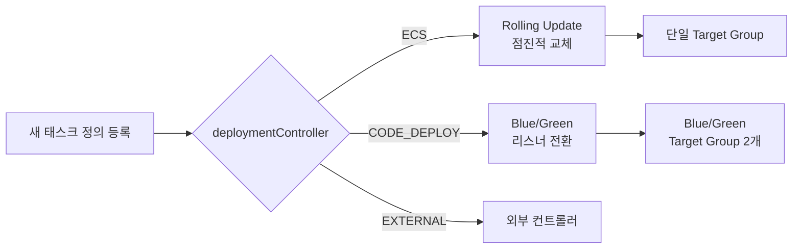
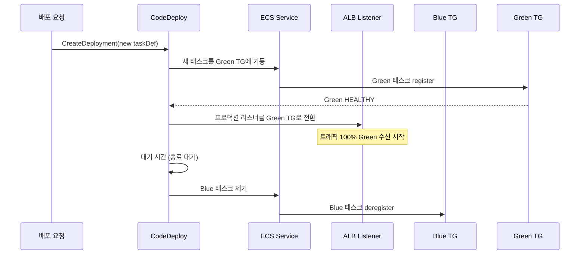
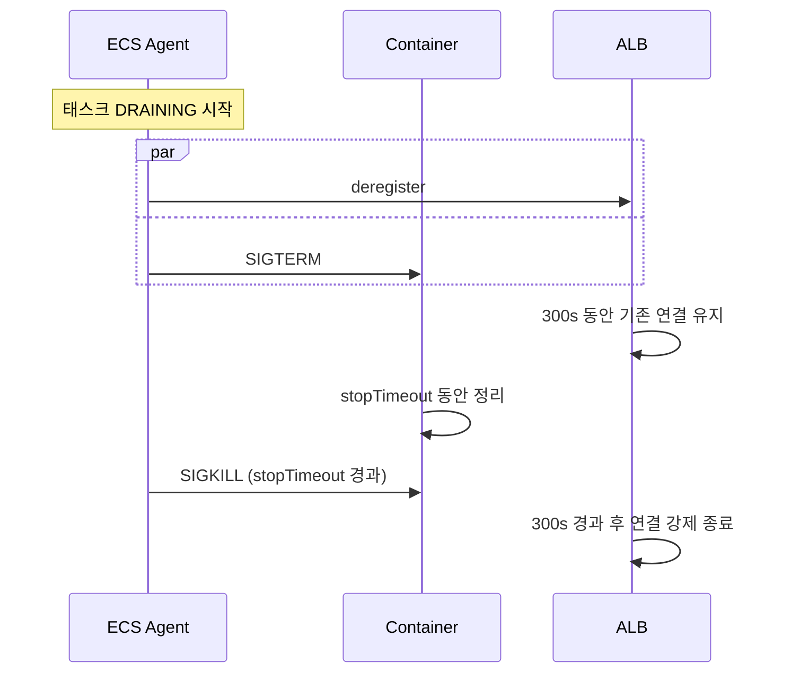

# ECS Deployment Strategies

## 개요

ECS에서 배포 전략을 선택한다는 건 두 가지를 결정하는 일이다. 첫째, 구버전과 신버전을 교체할 때 ALB 타깃 그룹과 태스크를 어떻게 맞바꿀 것인가. 둘째, 문제가 생겼을 때 언제 어떤 기준으로 되돌릴 것인가. ECS가 공식적으로 지원하는 배포 컨트롤러(deploymentController)는 세 가지다.

- **ECS** (Rolling Update): 기본값. ECS가 직접 태스크를 순차 교체한다.
- **CODE_DEPLOY** (Blue/Green): AWS CodeDeploy가 별도 태깃 그룹에 신버전을 띄운 뒤 리스너를 전환한다.
- **EXTERNAL**: 외부 컨트롤러(App Mesh, Spinnaker 등)가 배포를 제어한다. 실무에서는 거의 안 쓴다.

여기서 Rolling Update와 Blue/Green의 차이를 단순히 "점진적 vs 한 번에 전환"으로 외우면 안 된다. 진짜 차이는 **구버전 태스크와 신버전 태스크가 동시에 트래픽을 받는 창(window)이 얼마나 길고, 어떻게 끊기는가**에 있다. Rolling은 항상 그 창이 열려 있다가 자연스럽게 닫히고, Blue/Green은 리스너 전환 순간에 딱 끊어진다. 이 차이가 세션 처리, DB 스키마 마이그레이션, 캐시 무효화 시점을 모두 바꿔놓는다.



## Rolling Update 동작 원리

### minimumHealthyPercent / maximumPercent

이 두 값은 "배포 중에 허용되는 RUNNING 태스크 개수의 하한과 상한"을 desiredCount 대비 퍼센트로 정의한다. 기본값은 각각 100, 200이다. 즉 desiredCount가 4일 때 기본 설정으로 배포하면 **최소 4개는 유지, 최대 8개까지 띄울 수 있다**.

계산은 반올림이 아니라 **floor(minimum)과 floor(maximum)** 방식이다. desiredCount=3, minimumHealthyPercent=50이면 `floor(3 * 0.5) = 1`이라 최소 1개만 유지해도 된다. 이 지점에서 종종 헷갈린다. 50%라고 해서 "절반만 살아있으면 된다"는 게 아니라 "소수점 내림이라 한 개만 살아있어도 통과한다".

두 값의 조합이 배포 속도를 결정한다.

| minimumHealthy | maximum | 동작 | 용도 |
|----------------|---------|------|------|
| 100% | 200% | 신버전 먼저 전부 띄운 뒤 구버전 제거 | 가장 안전, 리소스 2배 필요 |
| 100% | 150% | 50%씩 교체 | 일반적 서비스 기본값 |
| 50% | 100% | 구버전 일부 내리고 신버전 띄움 | 리소스 절약, 용량 절반으로 운영 |
| 0% | 100% | 전부 죽이고 전부 띄움 | 개발 환경, 절대 프로덕션에서 쓰지 말 것 |

프로덕션 기준으로 쓸 만한 조합은 `minimumHealthyPercent=100, maximumPercent=200`이다. 리소스 비용이 두 배로 일시 증가하는 대신 배포 중에도 원래 용량이 그대로 유지된다. Fargate는 인스턴스 관리가 없으니 이 전략을 쓰기 쉽고, EC2 Launch Type에서는 ASG 용량이 200%를 감당할 수 있는지 먼저 확인해야 한다. Capacity Provider의 managed scaling이 배포 중 용량 부족을 감지하고 인스턴스를 늘리긴 하지만, EC2 기동 시간이 1~2분 걸리기 때문에 그 사이에 `PROVISIONING` 상태로 태스크가 멈춘다.

### 실제 배포 진행 순서

Rolling Update 한 사이클의 흐름은 이렇다.

1. ECS가 새 태스크 정의(revision)로 신규 태스크를 생성한다. `maximumPercent` 한도 내에서 한 번에 몇 개를 띄울지는 내부 알고리즘이 결정한다.
2. 새 태스크가 `RUNNING` 상태가 되고, ALB Target Group의 Health Check를 통과하면 `HEALTHY`로 승격된다.
3. 신규 태스크가 HEALTHY가 될 때마다 ECS가 구버전 태스크를 하나씩 `DRAINING` 상태로 전환하면서 타깃 그룹에서 deregister한다.
4. Connection Draining(기본 300초) 대기 → 태스크에 SIGTERM → `stopTimeout`(기본 30초) 대기 → SIGKILL.
5. desiredCount만큼 신버전으로 채워질 때까지 1~4 반복.

이 과정에서 `minimumHealthyPercent`는 "3번 단계에서 한꺼번에 몇 개를 내릴 수 있는가"를 결정하고, `maximumPercent`는 "1번 단계에서 한꺼번에 몇 개를 띄울 수 있는가"를 결정한다.

```json
{
  "deploymentConfiguration": {
    "minimumHealthyPercent": 100,
    "maximumPercent": 200,
    "deploymentCircuitBreaker": {
      "enable": true,
      "rollback": true
    }
  }
}
```

### Rolling Update에서 주의할 점

- **DB 마이그레이션과 동시 실행하면 안 된다.** 구버전과 신버전이 같은 DB 스키마를 서로 다른 기대로 접근하는 시간이 생긴다. 스키마 변경은 항상 **backward-compatible**로 두 번에 나눠라. 컬럼 추가는 먼저 배포하고, 컬럼 삭제는 신버전 완전 배포 후 다음 릴리즈에서 한다.
- **캐시 키에 버전이 포함되지 않으면** 구버전이 신버전 포맷의 캐시 데이터를 읽고 역직렬화 실패가 터진다. Spring Session이나 Redis 캐시 모두 해당된다.
- **ALB Health Check 경로가 깊으면** 배포 중에 일시적으로 실패한 걸 HEALTHY로 오판할 수 있다. 예를 들어 Health Check가 DB 연결 검사까지 하는데 DB가 순간 느려지면 구버전 태스크가 대량으로 UNHEALTHY 처리되고, ECS가 그 빈자리를 신버전으로 채우느라 배포가 이상하게 빨라진다. Health Check 엔드포인트는 액추에이터의 liveness 수준(프로세스 기동 여부)만 확인하고, 의존성은 readiness 쪽으로 분리하는 게 안전하다.

## Blue/Green 배포 (CodeDeploy 연동)

### 구성 요소

Blue/Green을 쓰려면 ECS 바깥에서 준비해야 할 게 여럿이다.

- **ALB 1개, 리스너 1개** (프로덕션 트래픽 리스너, 보통 443)
- **테스트 리스너 1개** (선택, 보통 8443). 배포 도중 새 버전만 볼 수 있는 URL을 만들 때 쓴다.
- **Target Group 2개**. 하나는 Blue(현재 운영), 하나는 Green(배포 대상). 초기에는 둘 다 등록해두고 리스너가 Blue만 바라본다.
- **CodeDeploy Application** (Compute Platform: `ECS`)
- **CodeDeploy Deployment Group**. 클러스터/서비스, 두 Target Group, 두 리스너 ARN, Deployment Config를 묶어둔다.
- **IAM Role**: CodeDeploy가 ECS와 ELB를 조작할 권한(`AWSCodeDeployRoleForECS`).

ECS 서비스의 `deploymentController.type`을 `CODE_DEPLOY`로 지정하면 그 순간부터 ECS는 `UpdateService`로 태스크 정의를 바꿀 수 없게 된다. 배포는 반드시 CodeDeploy의 `CreateDeployment` API를 통해야 한다. 이 제약을 모르고 기존 CI/CD 파이프라인에서 `aws ecs update-service --task-definition ...`을 호출하면 `InvalidParameterException: Unable to update task definition on services with a CODE_DEPLOY deployment controller` 에러가 뜬다.

### 배포 진행 단계



내부적으로는 `INSTALL → ALLOW_TRAFFIC → BEFORE_BLOCK_TRAFFIC → TERMINATE`의 라이프사이클을 가진다. 여기에 훅(Hook)을 걸면 Lambda를 호출해서 커스텀 검증을 수행할 수 있다. 훅 지점은 다음과 같다.

- `BeforeInstall`: Green 태스크 기동 전
- `AfterInstall`: Green 태스크 기동 후, 트래픽 전환 전 (smoke test를 여기서 실행)
- `AfterAllowTestTraffic`: 테스트 리스너로 먼저 트래픽이 흐른 직후
- `BeforeAllowTraffic`: 프로덕션 리스너 전환 직전
- `AfterAllowTraffic`: 프로덕션 리스너 전환 직후

실무에서 가장 많이 쓰는 훅은 `AfterAllowTestTraffic`이다. 새 버전이 실제 트래픽을 받기 전에 테스트 리스너로 통합 테스트를 돌려보는 용도다. Lambda가 실패 상태를 반환하면 CodeDeploy가 자동으로 롤백한다.

### 리스너 전환 방식 3종

CodeDeploy의 Deployment Configuration으로 제어한다.

- `CodeDeployDefault.ECSAllAtOnce`: 즉시 100% 전환. Blue/Green의 기본형.
- `CodeDeployDefault.ECSLinear10PercentEvery1Minutes`: 1분마다 10%씩, 10분에 걸쳐 전환.
- `CodeDeployDefault.ECSLinear10PercentEvery3Minutes`: 3분마다 10%씩, 30분에 걸쳐 전환.
- `CodeDeployDefault.ECSCanary10Percent5Minutes`: 처음 10%를 보낸 뒤 5분 대기, 이상 없으면 나머지 90% 전환.
- `CodeDeployDefault.ECSCanary10Percent15Minutes`: Canary 10%로 15분 관찰 후 일괄 전환.

Linear는 일정 비율로 쭉 늘리는 방식이고, Canary는 "소량을 먼저 보낸 뒤 관찰"하는 방식이다. 두 가지는 성격이 다르다.

- **Canary**가 맞는 경우: 버그가 터져도 초기 10% 구간에서 드러날 가능성이 높은 서비스. 예를 들어 로그인이나 결제처럼 사용자가 금방 재시도하는 기능.
- **Linear**가 맞는 경우: 낮은 트래픽에서는 잘 드러나지 않고 부하가 점진적으로 올라야 보이는 이슈가 있는 서비스. 예를 들어 커넥션 풀 고갈, 메모리 릭.

### CLI로 Blue/Green 구성

```bash
# 1. Deployment Group 생성 (TerraForm이나 CloudFormation 권장, 여기서는 CLI로 예시)
aws deploy create-deployment-group \
  --application-name my-app \
  --deployment-group-name my-app-dg \
  --deployment-config-name CodeDeployDefault.ECSCanary10Percent5Minutes \
  --service-role-arn arn:aws:iam::123456789012:role/CodeDeployRoleForECS \
  --ecs-services clusterName=prod,serviceName=api \
  --load-balancer-info "targetGroupPairInfoList=[{
      targetGroups=[{name=api-blue-tg},{name=api-green-tg}],
      prodTrafficRoute={listenerArns=[arn:aws:...:listener/prod]},
      testTrafficRoute={listenerArns=[arn:aws:...:listener/test]}
    }]" \
  --blue-green-deployment-configuration "{
    \"terminateBlueInstancesOnDeploymentSuccess\": {
      \"action\": \"TERMINATE\",
      \"terminationWaitTimeInMinutes\": 5
    },
    \"deploymentReadyOption\": {
      \"actionOnTimeout\": \"CONTINUE_DEPLOYMENT\"
    }
  }"

# 2. 새 태스크 정의 등록 후 배포 트리거
aws deploy create-deployment \
  --application-name my-app \
  --deployment-group-name my-app-dg \
  --revision '{
    "revisionType": "AppSpecContent",
    "appSpecContent": {
      "content": "version: 0.0\nResources:\n  - TargetService:\n      Type: AWS::ECS::Service\n      Properties:\n        TaskDefinition: arn:aws:ecs:...:task-definition/api:42\n        LoadBalancerInfo:\n          ContainerName: app\n          ContainerPort: 8080"
    }
  }'
```

`terminationWaitTimeInMinutes`는 배포 성공 후 Blue 태스크를 얼마나 더 유지할지를 정한다. 기본 0으로 두면 전환 즉시 Blue가 죽는데, 이러면 수동 롤백 여지가 사라진다. 보통 5분 정도 주고, 그 사이에 지표가 이상하면 CodeDeploy 콘솔에서 "Stop and rollback deployment"를 눌러 Blue로 되돌릴 수 있다. 5분이 지나 Blue가 terminate되면 그 이후 롤백은 "신버전을 다시 구버전으로 배포"하는 새 배포여야 한다.

## Deployment Circuit Breaker

### 동작 방식

Rolling Update에서 자동 롤백을 거는 메커니즘이다. 설정은 단순하다.

```json
"deploymentCircuitBreaker": {
  "enable": true,
  "rollback": true
}
```

ECS가 배포 중에 **연속으로 실패한 태스크 개수**를 카운트하다가 임계치를 넘으면 배포를 실패 처리한다. 임계치는 고정값이 아니라 desiredCount에 따라 내부적으로 조정된다.

- desiredCount 1: 실패 1회로도 임계치 도달
- desiredCount 2~3: 약 2회
- desiredCount 4~9: 약 3회
- desiredCount 10 이상: 약 10회 또는 desiredCount의 200%

실패로 카운트되는 조건은 "새 태스크가 SteadyState에 도달하지 못하고 STOPPED되는 것"이다. 구체적으로는 다음 경우다.

- 컨테이너 exit code가 0이 아님
- ALB Target Group Health Check 실패
- 이미지 pull 실패
- `essential: true` 컨테이너가 예상치 못하게 종료

`rollback: true`면 실패 감지 시 직전 성공 배포의 태스크 정의로 자동 롤백된다. `rollback: false`면 배포만 실패 처리되고 현 상태에서 멈춘다(운영 중인 구버전은 그대로). Circuit Breaker는 **Rolling Update 전용**이다. Blue/Green은 CodeDeploy가 독자적인 알람 기반 롤백을 가진다.

### Circuit Breaker가 못 잡는 상황

- 기동은 성공했지만 비즈니스 로직이 망가진 경우. 예: /health는 200 주는데 POST /order가 500.
- Health Check Grace Period 안에 터지는 오류. Grace Period(보통 60~120초) 동안은 Health Check 실패가 Task Fail로 집계되지 않는다.
- 메모리 릭처럼 시간이 지나야 터지는 문제.

이 빈 구멍을 메우려면 **CloudWatch Alarm 기반 롤백**을 Blue/Green에 걸거나, 배포 후 자체 모니터링 Lambda를 훅으로 돌려야 한다.

## 배포 실패 시 디버깅 순서

배포가 멈추거나 실패했을 때 보는 순서가 있다. 이걸 엉망으로 보면 엉뚱한 곳을 수십 분씩 파게 된다.

1. **ECS 서비스 이벤트 탭**. 콘솔의 Events 또는 `aws ecs describe-services`의 `events` 필드. "(service xxx) was unable to place a task because no container instance met all of its requirements" 같은 메시지가 여기 찍힌다. 대부분의 원인이 여기서 드러난다.
2. **STOPPED 태스크의 stoppedReason**. `aws ecs describe-tasks --tasks <arn>`으로 확인. 메시지 종류:
    - `Essential container in task exited` → 컨테이너 크래시. CloudWatch Logs로 이동.
    - `Task failed ELB health checks in (target-group ...)` → Health Check 실패.
    - `CannotPullContainerError` → ECR 권한, VPC 엔드포인트, 이미지 태그 오류.
    - `ResourceInitializationError` → Secrets Manager, EFS, CloudWatch Logs 권한 문제.
3. **CloudWatch Logs**. 태스크 정의의 `awslogs-group`으로 가서 실패한 컨테이너의 마지막 로그 확인. Spring Boot라면 `ApplicationContext` 초기화 로그가 어디까지 찍혔는지 본다.
4. **ALB Target Group Health Check**. Target Group 콘솔의 Targets 탭에서 "unhealthy" 상태 코드와 이유를 확인한다. `Health checks failed with these codes: [502]`면 포트는 맞는데 앱이 아직 기동 중. `Request timed out`이면 보안 그룹이 ALB → Task 포트를 허용하지 않음.
5. **CodeDeploy 콘솔의 Deployments 탭** (Blue/Green). Lifecycle Event 섹션에서 어느 단계에서 멈췄는지 확인한다. `AfterAllowTestTraffic`에서 실패했다면 훅 Lambda 로그를 본다.
6. **Application Auto Scaling Activities**. 배포 중 스케일 이벤트가 끼어들었는지 확인. 드물지만 desiredCount가 배포 중 바뀌면 혼란스럽다.

### 흔한 증상과 원인

- **배포가 시작은 됐는데 한참 안 끝남** → 새 태스크가 STARTING에서 멈춰 있음. 이미지 pull 중이거나(1GB 넘으면 2분 이상 걸림), Secrets/SSM Parameter 조회 지연, ENI 할당 대기.
- **새 태스크가 계속 기동과 종료를 반복** → Circuit Breaker가 작동 중이지만 원인을 못 찾는 상태. stoppedReason을 반드시 확인.
- **Rolling Update에서 교체가 안 됨** → ALB Target Group Health Check Grace Period가 너무 짧거나, maximumPercent가 100이라 신규 태스크를 띄울 공간이 없음.
- **Blue/Green에서 트래픽 전환이 안 일어남** → Green TG가 HEALTHY 상태가 안 됨. 주로 ALB → Task 보안 그룹 문제.

## Task Draining 타임아웃 이슈

### Draining 흐름

태스크가 Target Group에서 deregister되면 ALB는 해당 태스크로 이미 들어온 연결을 끊지 않고 **Connection Draining** 시간(기본 300초) 동안 유지한다. 그 뒤 ECS 에이전트는 태스크 컨테이너에 `SIGTERM`을 보내고 `stopTimeout`(기본 30초) 동안 기다린 뒤 `SIGKILL`한다.

문제는 이 두 타이머가 **완전히 독립적**이라는 점이다. Connection Draining은 ALB 쪽 타이머고, stopTimeout은 ECS 에이전트 쪽 타이머다. ECS 에이전트는 deregister와 거의 동시에 SIGTERM을 보낸다. 그래서 실제로는 다음이 병렬로 일어난다.



여기서 장애가 생기는 전형적인 패턴은 이렇다. stopTimeout이 30초라 앱이 30초 만에 죽는다. 그런데 ALB는 아직도 기존 연결을 이 태스크로 보내고 있어서 30초 이후 요청은 전부 실패한다. 로그에는 502 Bad Gateway나 Connection refused가 쏟아진다.

### 해결 방법

stopTimeout을 Connection Draining과 맞춰라. Connection Draining이 300초면 stopTimeout도 최소 120~180초는 줘야 한다. 단 Fargate는 stopTimeout의 최댓값이 **120초**로 고정이라 그 이상 못 준다. EC2 Launch Type은 에이전트 설정(`ECS_CONTAINER_STOP_TIMEOUT`)을 통해 기본값을 늘릴 수 있다.

앱 쪽에서도 SIGTERM을 받았을 때 해야 할 일이 있다.

1. 더 이상 새 요청을 받지 않겠다고 선언 (readiness를 UNHEALTHY로 바꾸는 건 아님. 이미 deregister됐다).
2. 진행 중인 요청 완료 대기.
3. DB 커넥션 풀, Redis 커넥션 등 graceful close.
4. 로그 flush.

Spring Boot 2.3+는 `server.shutdown=graceful`과 `spring.lifecycle.timeout-per-shutdown-phase=60s`로 이걸 자동화한다. Node.js Express는 직접 `process.on('SIGTERM', ...)`로 `server.close()`를 호출하고 끝날 때까지 대기하는 코드를 넣어야 한다. 이게 없으면 SIGTERM을 무시하고 30초 뒤 SIGKILL로 끊기기 때문에 진행 중이던 요청이 전부 깨진다.

### ALB Deregistration Delay 줄이기

역으로, "draining이 너무 오래 걸려서 배포가 5분씩 걸린다"는 불만도 많다. Target Group 속성 `deregistration_delay.timeout_seconds`를 30~60초로 줄이면 배포 속도는 빨라진다. 단 그 시간 안에 끝나지 않는 장기 요청(파일 업로드, 리포트 생성)이 있다면 502가 난다. 이런 서비스는 아예 별도 서비스로 분리하고 배포 전략도 다르게 가져가는 게 낫다.

### WebSocket과 HTTP/2 Keep-Alive

WebSocket 연결은 deregister 후에도 끊기지 않는다. ALB가 연결을 유지하는 동안 클라이언트가 해당 태스크에 붙어 있게 된다. 태스크가 SIGKILL로 죽으면 WebSocket은 강제 종료되어 클라이언트 쪽에서 재연결 폭풍이 생긴다. WebSocket을 쓰는 서비스는 stopTimeout을 최대로 잡고(Fargate 120초), 앱에서 SIGTERM 수신 시 기존 WebSocket에 graceful close 프레임을 보내 클라이언트가 다른 태스크로 붙게 유도해야 한다.

## Production 배포 전략 선택 기준

경험상 아래 질문에 답해보면 답이 나온다.

**1. 데이터 정합성이 깨지면 안 되는 서비스인가?**

결제, 주문, 회계처럼 "두 버전이 섞여 돌면 안 되는" 서비스는 Blue/Green이다. Rolling은 본질적으로 구/신 동시 실행 창이 존재한다. Blue/Green도 리스너 전환 직전 순간에는 양쪽이 다 HEALTHY지만, 실제 트래픽은 딱 한쪽에만 간다.

**2. 인프라 비용 2배 여력이 있는가?**

Blue/Green은 배포 기간 동안 Blue와 Green이 공존한다. desiredCount가 100인 서비스를 Blue/Green으로 배포하면 잠시 200 태스크 분의 비용이 나간다. Rolling도 `maximumPercent=200`이면 비슷하지만, Rolling은 태스크 단위 교체라 최대치에 도달하는 시간이 짧다. Blue/Green Linear 30분짜리는 대부분 시간이 100~200 사이에 머문다.

**3. 트래픽이 얼마나 큰가?**

초당 수천 건 이상 트래픽이면 Blue/Green의 리스너 전환 순간에도 "찰나의 이상 증상"이 지표에 찍힌다. p99 latency가 순간 튀거나 503이 잠깐 섞인다. 대형 트래픽 서비스는 Linear나 Canary로 점진 전환해야 지표가 안정적이다.

**4. 롤백 속도가 얼마나 중요한가?**

Blue/Green은 리스너만 되돌리면 되니 **초 단위 롤백**이 가능하다. Rolling은 반대 방향으로 또 한 번 Rolling 하는 꼴이라 배포 시간만큼 롤백 시간도 걸린다. 외부 고객 영향이 큰 서비스는 Blue/Green을 쓰는 이유가 대부분 이 롤백 속도다.

**5. 팀의 CodeDeploy 운영 능력은?**

Blue/Green은 CodeDeploy, 이중 타깃 그룹, 리스너 규칙, Lambda 훅까지 설정할 요소가 많다. 팀에서 이걸 IaC로 관리하고 장애 대응까지 할 수 있는 수준이 안 되면 차라리 잘 튜닝된 Rolling Update(Circuit Breaker + 모니터링 알람)가 더 안정적이다. "기능은 좋은데 다룰 줄 몰라서 사고난다"가 Blue/Green 운영 실패의 주 원인이다.

### 현실적인 선택 가이드

- **내부 관리자 서비스, 백오피스**: Rolling Update. `minimumHealthyPercent=100, maximumPercent=200`, Circuit Breaker 활성화.
- **일반 외부 API 서비스 (트래픽 중간)**: Rolling Update + 알람 기반 수동 롤백 절차. 팀이 익숙해지면 Blue/Green으로 승급.
- **결제, 주문 등 정합성 민감 서비스**: Blue/Green AllAtOnce + `terminationWaitTimeInMinutes=10`. 훅에서 smoke test 강제.
- **대용량 트래픽 서비스**: Blue/Green Canary 10% → 1시간 관찰 → 100% 전환. CloudWatch 알람으로 자동 롤백 걸기.
- **Stateful / WebSocket 서비스**: Rolling Update를 한 태스크씩 교체하되(`maximumPercent=110` 정도), stopTimeout을 Fargate 최대인 120초로 설정. 재연결 로직 먼저 검증.

## 참고

- [Amazon ECS deployment types](https://docs.aws.amazon.com/AmazonECS/latest/developerguide/deployment-types.html)
- [Deployment circuit breaker](https://docs.aws.amazon.com/AmazonECS/latest/developerguide/deployment-circuit-breaker.html)
- [AWS CodeDeploy — Tutorial: Amazon ECS](https://docs.aws.amazon.com/codedeploy/latest/userguide/tutorial-ecs-deployment.html)
- [ALB Target Group — Deregistration delay](https://docs.aws.amazon.com/elasticloadbalancing/latest/application/load-balancer-target-groups.html#deregistration-delay)
