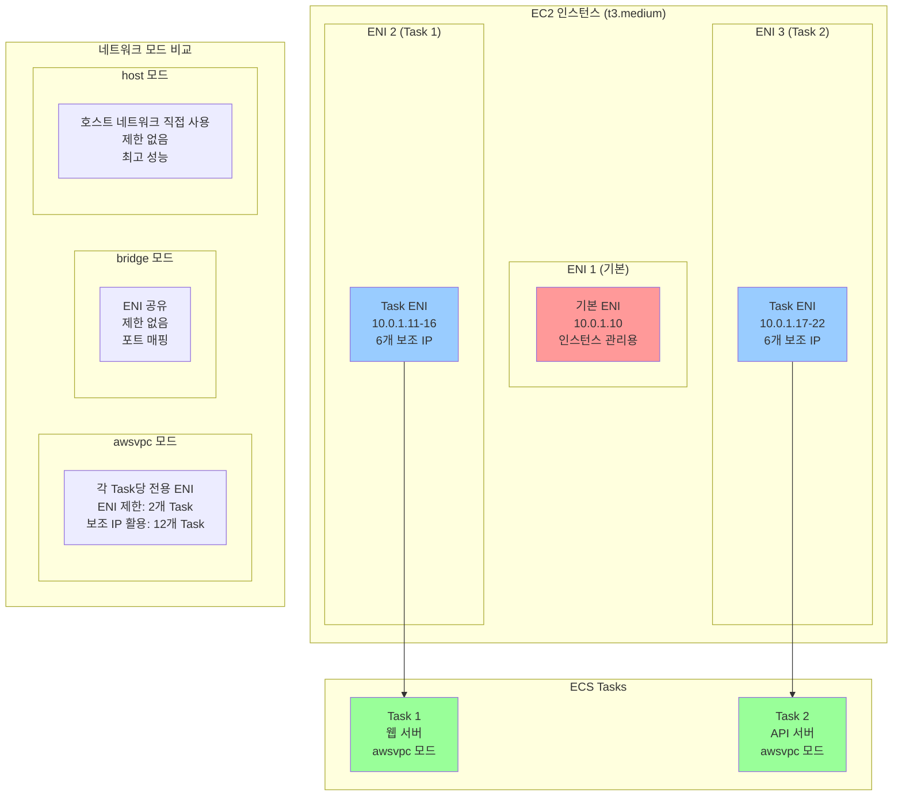

# AWS ENI 구조와 ECS Task 한계 (awsvpc / bridge / host 네트워크 모드 비교)

## 개요

AWS ECS(Elastic Container Service)에서 컨테이너를 실행할 때, 네트워크 모드에 따라 ENI(Elastic Network Interface) 사용 방식이 달라지고, 이는 ECS Task의 최대 실행 개수에 직접적인 영향을 미칩니다. 특히 awsvpc 네트워크 모드에서는 각 Task마다 전용 ENI가 할당되어, EC2 인스턴스의 ENI 제한이 Task 실행 개수의 핵심 제약 요소가 됩니다.

### ENI 제한의 중요성

ECS 환경에서 ENI 제한을 이해하는 것은 다음과 같은 이유로 중요합니다:

- **리소스 계획**: 인스턴스 타입 선택 시 Task 밀도 고려
- **비용 최적화**: ENI 제한을 고려한 효율적인 인스턴스 구성
- **성능 최적화**: 네트워크 모드별 특성에 맞는 아키텍처 설계
- **확장성 계획**: 대규모 배포 시 인프라 설계 가이드라인

## ENI의 개념과 역할

### ENI(Elastic Network Interface)란?

ENI는 AWS VPC 내에서 네트워크 연결을 제공하는 가상 네트워크 인터페이스입니다. 각 ENI는 고유한 프라이빗 IP 주소, 보안 그룹, 서브넷을 가질 수 있으며, EC2 인스턴스에 연결되어 네트워크 통신을 담당합니다.

**ENI의 핵심 특징**:
- **고유한 네트워크 식별자**: 각 ENI는 고유한 MAC 주소와 프라이빗 IP를 가짐
- **보안 그룹 적용**: ENI별로 독립적인 보안 그룹 설정 가능
- **서브넷 연결**: 특정 서브넷에 바인딩되어 네트워크 격리 제공
- **다중 IP 지원**: 하나의 ENI에 여러 보조 IP 할당 가능

### ENI의 역할과 중요성

**네트워크 격리**: 각 ENI는 독립적인 네트워크 경계를 제공하여 보안과 격리를 실현합니다.

**리소스 할당**: ENI는 네트워크 리소스의 기본 단위로, 각 ENI마다 네트워크 대역폭과 성능이 할당됩니다.

**확장성 제약**: EC2 인스턴스 타입별로 ENI 개수 제한이 있어, 이는 컨테이너 밀도에 직접적인 영향을 미칩니다.

### ECS ENI 구조 다이어그램



## EC2 인스턴스 타입별 ENI 최대 개수

### ENI 제한 구조

AWS는 EC2 인스턴스 타입별로 ENI 개수와 각 ENI당 IP 주소 수를 제한하고 있습니다. 이 제한은 하드웨어 리소스와 네트워크 성능을 보장하기 위한 것입니다.

### 주요 인스턴스 타입별 ENI 제한

| **인스턴스 타입** | **최대 ENI 수** | **ENI당 최대 IP** | **총 IP 주소** | **네트워크 성능** |
|------------------|----------------|------------------|---------------|------------------|
| t3.nano | 2 | 2 | 4 | 최대 5 Gbps |
| t3.micro | 2 | 2 | 4 | 최대 5 Gbps |
| t3.small | 3 | 4 | 12 | 최대 5 Gbps |
| t3.medium | 3 | 6 | 18 | 최대 5 Gbps |
| t3.large | 3 | 10 | 30 | 최대 5 Gbps |
| t3.xlarge | 4 | 15 | 60 | 최대 5 Gbps |
| t3.2xlarge | 4 | 15 | 60 | 최대 5 Gbps |
| m5.large | 3 | 10 | 30 | 최대 10 Gbps |
| m5.xlarge | 4 | 15 | 60 | 최대 10 Gbps |
| m5.2xlarge | 4 | 15 | 60 | 최대 10 Gbps |
| m5.4xlarge | 8 | 30 | 240 | 최대 10 Gbps |
| c5.large | 3 | 10 | 30 | 최대 10 Gbps |
| c5.xlarge | 4 | 15 | 60 | 최대 10 Gbps |
| c5.2xlarge | 4 | 15 | 60 | 최대 10 Gbps |
| c5.4xlarge | 8 | 30 | 240 | 최대 10 Gbps |

### ENI 제한의 실제 영향

**awsvpc 네트워크 모드에서의 제약**:
- 각 Task마다 전용 ENI가 필요
- ENI 개수 = 최대 동시 실행 가능한 Task 수
- t3.medium 인스턴스: 최대 3개 Task 동시 실행

**IP 주소 제한의 영향**:
- 각 ENI당 IP 주소 수 제한
- 보조 IP를 통한 추가 Task 실행 가능
- t3.medium: ENI당 6개 IP → 최대 18개 Task 실행 가능

## ECS 네트워크 모드별 ENI 사용 방식 차이

### 1. awsvpc 네트워크 모드

**ENI 사용 방식**:
- 각 Task마다 전용 ENI 할당
- Task별로 독립적인 네트워크 격리
- 보안 그룹을 Task 레벨에서 적용 가능

**장점**:
- **완전한 네트워크 격리**: 각 Task가 독립적인 네트워크 환경을 가짐
- **세밀한 보안 제어**: Task별로 다른 보안 그룹 적용 가능
- **VPC 네이티브 통합**: AWS VPC 기능을 완전히 활용 가능
- **서비스 디스커버리**: AWS Cloud Map과 완벽 통합

**단점**:
- **ENI 제한**: 인스턴스의 ENI 개수 제한으로 Task 밀도 제약
- **시작 지연**: ENI 할당으로 인한 Task 시작 시간 증가
- **비용**: ENI 할당에 따른 추가 비용 발생

### 2. bridge 네트워크 모드

**ENI 사용 방식**:
- 호스트의 ENI를 공유 사용
- Docker의 기본 브리지 네트워크 활용
- 포트 매핑을 통한 네트워크 접근

**장점**:
- **높은 Task 밀도**: ENI 제한 없이 많은 Task 실행 가능
- **빠른 시작**: ENI 할당 없이 빠른 Task 시작
- **비용 효율**: ENI 할당 비용 없음

**단점**:
- **네트워크 격리 제한**: 호스트 네트워크 공유로 격리 수준 낮음
- **포트 충돌**: 동일 포트 사용 시 충돌 가능
- **보안 제어 제한**: Task별 보안 그룹 적용 불가

### 3. host 네트워크 모드

**ENI 사용 방식**:
- 호스트의 네트워크 스택을 직접 사용
- 컨테이너가 호스트의 네트워크 인터페이스 공유

**장점**:
- **최고 성능**: 네트워크 오버헤드 최소화
- **ENI 제한 없음**: 호스트 네트워크 직접 사용
- **단순한 구성**: 복잡한 네트워크 설정 불필요

**단점**:
- **보안 위험**: 호스트 네트워크 직접 노출
- **포트 충돌**: 호스트 포트 직접 사용으로 충돌 가능
- **격리 부족**: 컨테이너 간 네트워크 격리 없음

## ENI 제한이 ECS Task 실행 개수에 미치는 영향

### awsvpc 모드에서의 Task 제한

**기본 제한 공식**:
```
최대 Task 수 = 인스턴스 ENI 제한 - 1 (기본 ENI)
```

**t3.medium 인스턴스 예시**:
- ENI 제한: 3개
- 기본 ENI: 1개 (인스턴스 기본 네트워크)
- 사용 가능 ENI: 2개
- 최대 Task 수: 2개

### 보조 IP를 활용한 확장

**보조 IP 활용 공식**:
```
최대 Task 수 = (ENI 수 - 1) × ENI당 IP 수
```

**t3.medium 인스턴스 확장 예시**:
- 사용 가능 ENI: 2개
- ENI당 IP 수: 6개
- 최대 Task 수: 2 × 6 = 12개

### 실제 운영에서의 고려사항

**ENI 할당 시간**:
- 새 ENI 할당: 10-30초 소요
- Task 시작 지연의 주요 원인
- Auto Scaling 시 응답성 저하

**IP 주소 관리**:
- 보조 IP 할당/해제 시간
- IP 주소 고갈 가능성
- 서브넷 IP 범위 고려 필요

## 실제 예시 (t3.medium 기준)

### 시나리오 1: 기본 awsvpc 모드

**환경 설정**:
- 인스턴스: t3.medium
- 네트워크 모드: awsvpc
- 서브넷: 10.0.1.0/24

**Task 배치 결과**:
```
인스턴스 ENI 구성:
├── 기본 ENI (10.0.1.10) - 인스턴스 관리용
├── Task 1 ENI (10.0.1.11) - 웹 서버 컨테이너
└── Task 2 ENI (10.0.1.12) - API 서버 컨테이너

최대 동시 실행 Task: 2개
```

**비용 분석**:
- 인스턴스 비용: 월 $30
- Task당 비용: $15
- ENI 할당 비용: 추가 없음

### 시나리오 2: 보조 IP 활용 확장

**환경 설정**:
- 인스턴스: t3.medium
- 네트워크 모드: awsvpc
- 보조 IP 활용: 활성화

**Task 배치 결과**:
```
인스턴스 ENI 구성:
├── 기본 ENI (10.0.1.10)
├── Task ENI 1 (10.0.1.11-16) - 6개 보조 IP
└── Task ENI 2 (10.0.1.17-22) - 6개 보조 IP

최대 동시 실행 Task: 12개
```

**성능 고려사항**:
- 네트워크 대역폭 공유
- ENI당 네트워크 성능 제한
- 메모리/CPU 리소스 경합

### 시나리오 3: bridge 모드 비교

**환경 설정**:
- 인스턴스: t3.medium
- 네트워크 모드: bridge
- 포트 매핑: 8080-8090

**Task 배치 결과**:
```
인스턴스 네트워크 구성:
├── 기본 ENI (10.0.1.10) - 모든 Task 공유
├── Task 1: 10.0.1.10:8080
├── Task 2: 10.0.1.10:8081
├── Task 3: 10.0.1.10:8082
└── ... (포트 제한까지)

최대 동시 실행 Task: 포트 수 제한 (약 65,000개)
```

**장단점 비교**:
- **장점**: 높은 Task 밀도, 빠른 시작
- **단점**: 네트워크 격리 부족, 보안 제어 제한

## Fargate 환경에서의 차이점

### Fargate의 ENI 관리

**자동 ENI 관리**:
- AWS가 ENI 할당/해제 자동 처리
- 사용자가 ENI 제한을 직접 관리할 필요 없음
- 백그라운드에서 ENI 풀 관리

**확장성 제약**:
- Fargate 자체의 리소스 제한
- vCPU/메모리 제한이 주요 제약 요소
- ENI 제한은 Fargate 내부에서 처리

### Fargate vs EC2 모드 비교

| **구분** | **EC2 모드** | **Fargate 모드** |
|----------|-------------|-----------------|
| ENI 관리 | 수동 관리 필요 | AWS 자동 관리 |
| Task 밀도 | ENI 제한 영향 | Fargate 리소스 제한 |
| 비용 구조 | 인스턴스 + ENI 비용 | Task 리소스 비용만 |
| 확장성 | ENI 제한 고려 필요 | AWS가 자동 처리 |
| 제어권 | 높음 | 제한적 |

### Fargate에서의 최적화 전략

**리소스 최적화**:
- Task당 최소 리소스 할당
- CPU/메모리 사용률 모니터링
- 자동 스케일링 정책 최적화

**비용 최적화**:
- Fargate Spot 활용 (최대 70% 할인)
- Task 크기 최적화
- 사용하지 않는 Task 자동 종료

## 핵심 요약 표

### 네트워크 모드별 ENI 사용 비교

| **네트워크 모드** | **ENI 사용** | **Task 밀도** | **보안 격리** | **성능** | **관리 복잡도** |
|------------------|-------------|--------------|--------------|----------|----------------|
| awsvpc | Task당 전용 ENI | 낮음 (ENI 제한) | 높음 | 높음 | 중간 |
| bridge | ENI 공유 | 높음 (제한 없음) | 낮음 | 중간 | 낮음 |
| host | 호스트 네트워크 | 높음 (제한 없음) | 낮음 | 최고 | 낮음 |

### 인스턴스 타입별 Task 밀도 (awsvpc 모드)

| **인스턴스 타입** | **ENI 제한** | **기본 Task 수** | **보조 IP 활용** | **월 비용** |
|------------------|-------------|-----------------|-----------------|------------|
| t3.medium | 3개 | 2개 | 12개 | $30 |
| t3.large | 3개 | 2개 | 30개 | $60 |
| m5.large | 3개 | 2개 | 30개 | $70 |
| m5.xlarge | 4개 | 3개 | 60개 | $140 |

### 선택 가이드라인

**awsvpc 모드 선택 시기**:
- 보안 격리가 중요한 경우
- 마이크로서비스 아키텍처
- AWS VPC 기능 활용 필요
- ENI 제한을 감수할 수 있는 경우

**bridge 모드 선택 시기**:
- 높은 Task 밀도가 필요한 경우
- 간단한 웹 애플리케이션
- 개발/테스트 환경
- 빠른 배포가 중요한 경우

**host 모드 선택 시기**:
- 최고 성능이 필요한 경우
- 네트워크 오버헤드 최소화 필요
- 단순한 구성 선호
- 보안 격리보다 성능 우선

## 결론

AWS ECS에서 ENI 제한은 특히 awsvpc 네트워크 모드에서 Task 실행 개수의 핵심 제약 요소입니다. 인스턴스 타입별 ENI 제한을 정확히 이해하고, 애플리케이션의 요구사항에 맞는 네트워크 모드를 선택하는 것이 중요합니다.

**핵심 고려사항**:
- **보안 vs 밀도**: awsvpc는 보안이 우수하지만 Task 밀도가 낮음
- **성능 vs 관리**: host 모드는 성능이 우수하지만 관리가 복잡
- **비용 vs 기능**: Fargate는 관리가 간단하지만 제어권이 제한적

**최적화 전략**:
- 워크로드 특성에 맞는 네트워크 모드 선택
- 인스턴스 타입별 ENI 제한 고려한 아키텍처 설계
- 보조 IP 활용을 통한 Task 밀도 향상
- Fargate 활용을 통한 ENI 관리 복잡성 제거

## 참조

- [AWS ECS 네트워크 모드 가이드](https://docs.aws.amazon.com/AmazonECS/latest/developerguide/task-networking.html)
- [AWS ENI 제한 사항](https://docs.aws.amazon.com/AWSEC2/latest/UserGuide/using-eni.html#AvailableIpPerENI)
- [AWS Fargate 네트워킹](https://docs.aws.amazon.com/AmazonECS/latest/developerguide/AWS_Fargate.html#fargate-networking)
- [AWS ECS 모범 사례](https://docs.aws.amazon.com/AmazonECS/latest/bestpracticesguide/)
- [AWS VPC ENI 가이드](https://docs.aws.amazon.com/AWSEC2/latest/UserGuide/using-eni.html)
