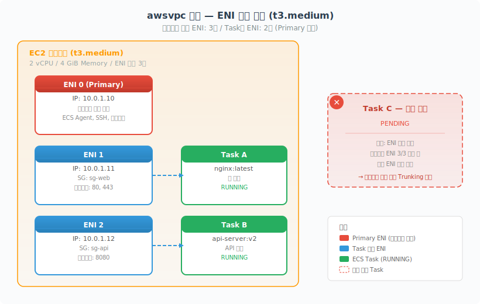
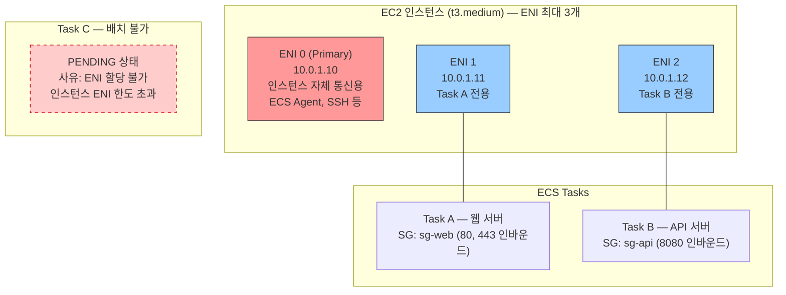
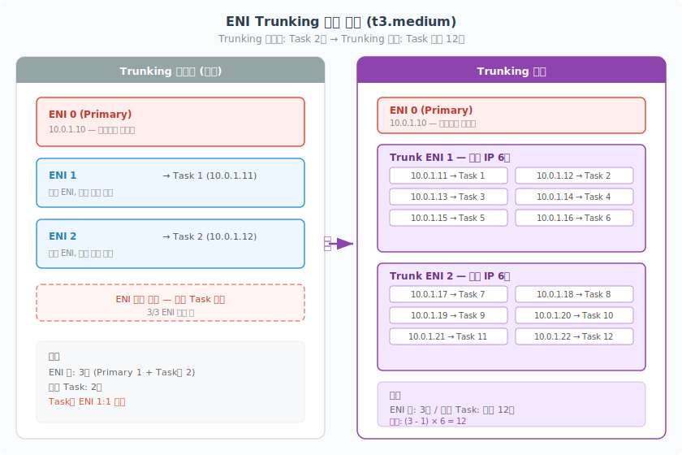
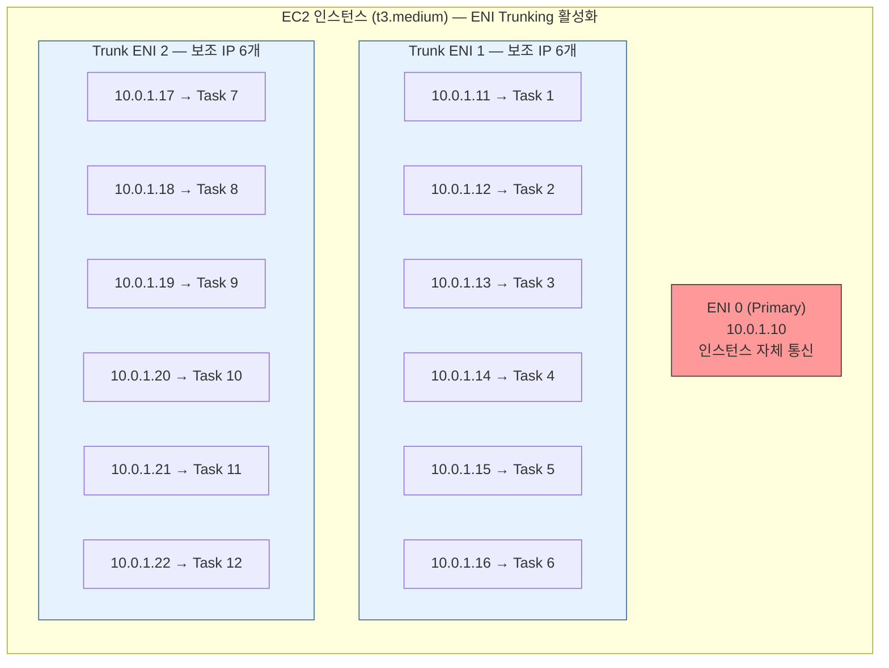
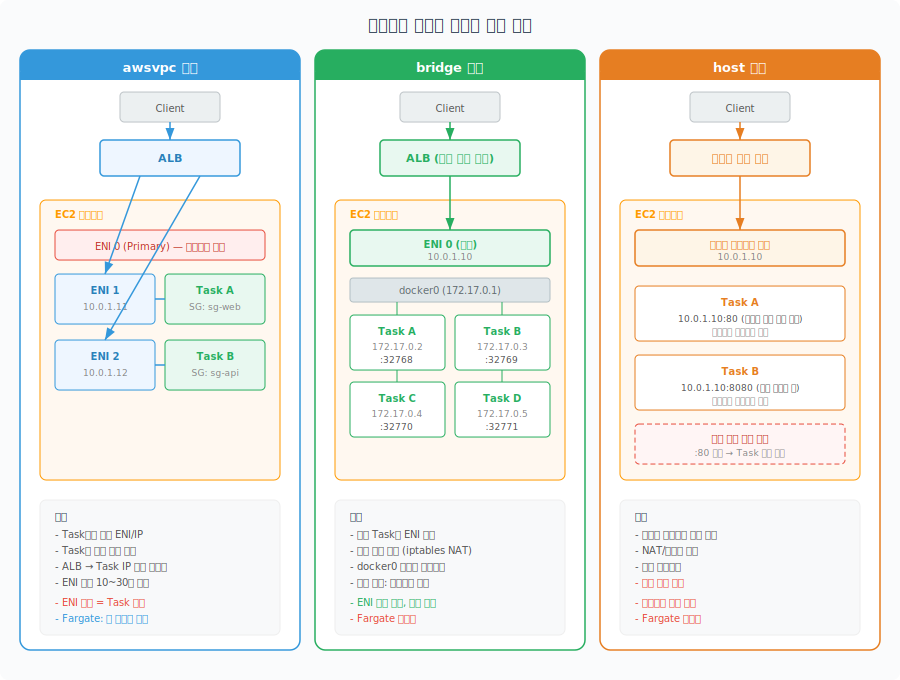
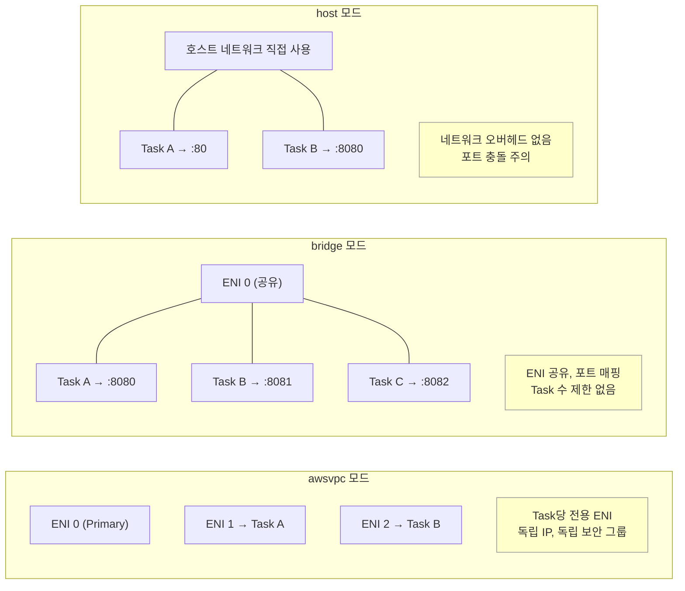
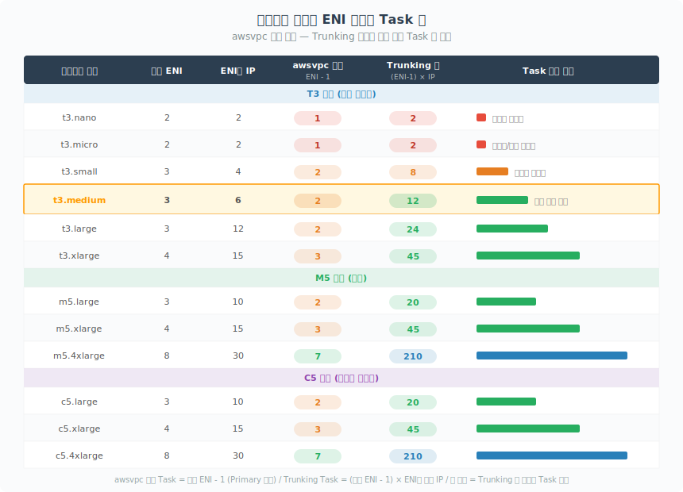

# ECS ENI 제한과 Task 한계

## 왜 ENI 제한을 알아야 하는가

ECS에서 컨테이너를 실행할 때, 네트워크 모드에 따라 ENI(Elastic Network Interface) 사용 방식이 달라진다. 특히 awsvpc 모드를 쓰면 Task마다 ENI가 하나씩 붙는데, EC2 인스턴스 타입별로 ENI 개수에 하드 리밋이 있다.

이걸 모르고 서비스를 운영하면 이런 일이 생긴다:

- t3.medium에 awsvpc 모드로 서비스를 올렸는데, Task가 3개 이상 안 뜬다
- Auto Scaling이 트리거됐는데 Task가 PENDING 상태에서 멈춰 있다
- 같은 인스턴스 타입인데 bridge 모드일 때보다 Task 밀도가 현저히 낮다

결국 인스턴스 타입 선택, 비용 계산, 스케일링 계획 모두 ENI 제한을 먼저 파악해야 제대로 할 수 있다.

## ENI 기본 개념

### ENI(Elastic Network Interface)란

ENI는 VPC 안에서 네트워크 연결을 담당하는 가상 네트워크 인터페이스다. 물리 서버의 네트워크 카드(NIC)에 대응하는 개념이라고 생각하면 된다.

ENI 하나가 가지는 것들:

- 프라이빗 IP 주소 (기본 1개 + 보조 IP)
- MAC 주소
- 보안 그룹 (ENI 단위로 적용)
- 서브넷 바인딩

EC2 인스턴스에는 기본적으로 ENI가 하나 붙어 있고, 인스턴스 타입에 따라 추가 ENI를 붙일 수 있다. 이 추가 가능한 ENI 수가 인스턴스 타입마다 다르다.

### ECS에서 ENI가 중요한 이유

awsvpc 네트워크 모드를 쓰면 ECS Task 하나당 ENI 하나가 할당된다. Task별로 독립된 IP와 보안 그룹을 가지게 되는데, 이건 보안 격리 측면에서 좋지만 ENI 수 제한에 직접 걸린다.

## ENI 할당 구조 — awsvpc 모드

아래 다이어그램은 t3.medium 인스턴스에서 awsvpc 모드로 Task를 배치했을 때의 ENI 할당 구조다.

<figure markdown="span">
  
  <figcaption>t3.medium에서 awsvpc 모드로 Task 배치 시 ENI 할당 — Primary ENI를 제외하면 Task 2개가 한계다</figcaption>
</figure>


```mermaid
graph TB
    subgraph EC2["EC2 인스턴스 (t3.medium) — ENI 최대 3개"]
        direction TB
        ENI0["ENI 0 (Primary)<br/>10.0.1.10<br/>인스턴스 자체 통신용<br/>ECS Agent, SSH 등"]
        ENI1["ENI 1<br/>10.0.1.11<br/>Task A 전용"]
        ENI2["ENI 2<br/>10.0.1.12<br/>Task B 전용"]
    end

    subgraph Tasks["ECS Tasks"]
        TA["Task A — 웹 서버<br/>SG: sg-web (80, 443 인바운드)"]
        TB_["Task B — API 서버<br/>SG: sg-api (8080 인바운드)"]
    end

    ENI1 --- TA
    ENI2 --- TB_

    subgraph Blocked["Task C — 배치 불가"]
        TC["PENDING 상태<br/>사유: ENI 할당 불가<br/>인스턴스 ENI 한도 초과"]
    end

    style ENI0 fill:#ff9999,stroke:#333
    style ENI1 fill:#99ccff,stroke:#333
    style ENI2 fill:#99ccff,stroke:#333
    style TC fill:#ffcccc,stroke:#cc0000,stroke-dasharray: 5 5
```

핵심: ENI 0은 인스턴스 자체가 쓰므로, Task에 할당 가능한 ENI는 `최대 ENI 수 - 1`개다. t3.medium은 ENI 최대 3개이므로 Task는 2개까지만 동시 실행된다.

### ENI Trunking (보조 IP 활용)

ENI 제한을 우회하는 방법이 있다. AWS는 `awsvpcTrunking` 기능을 제공하는데, 하나의 ENI에 여러 보조 IP를 할당해서 Task 밀도를 높인다.

<figure markdown="span">
  
  <figcaption>Trunking 비활성(Task 2개)과 활성(Task 12개) 비교 — 같은 t3.medium에서 밀도가 6배 차이난다</figcaption>
</figure>


```mermaid
graph TB
    subgraph EC2_Trunk["EC2 인스턴스 (t3.medium) — ENI Trunking 활성화"]
        direction TB
        ENI0_T["ENI 0 (Primary)<br/>10.0.1.10<br/>인스턴스 자체 통신"]
        subgraph Trunk1["Trunk ENI 1 — 보조 IP 6개"]
            IP1["10.0.1.11 → Task 1"]
            IP2["10.0.1.12 → Task 2"]
            IP3["10.0.1.13 → Task 3"]
            IP4["10.0.1.14 → Task 4"]
            IP5["10.0.1.15 → Task 5"]
            IP6["10.0.1.16 → Task 6"]
        end
        subgraph Trunk2["Trunk ENI 2 — 보조 IP 6개"]
            IP7["10.0.1.17 → Task 7"]
            IP8["10.0.1.18 → Task 8"]
            IP9["10.0.1.19 → Task 9"]
            IP10["10.0.1.20 → Task 10"]
            IP11["10.0.1.21 → Task 11"]
            IP12["10.0.1.22 → Task 12"]
        end
    end

    style ENI0_T fill:#ff9999,stroke:#333
    style Trunk1 fill:#e6f3ff,stroke:#336699
    style Trunk2 fill:#e6f3ff,stroke:#336699
```

Trunking을 쓰면 t3.medium에서 최대 12개 Task까지 올릴 수 있다. 다만 실제로는 CPU/메모리 리소스가 먼저 바닥나는 경우가 많다.

### 네트워크 모드별 ENI 사용 비교

<figure markdown="span">
  
  <figcaption>awsvpc / bridge / host 모드별 트래픽 흐름 — ENI 사용 방식과 보안 격리 수준이 다르다</figcaption>
</figure>


```mermaid
graph LR
    subgraph awsvpc["awsvpc 모드"]
        direction TB
        A_ENI0["ENI 0 (Primary)"]
        A_ENI1["ENI 1 → Task A"]
        A_ENI2["ENI 2 → Task B"]
        A_NOTE["Task당 전용 ENI<br/>독립 IP, 독립 보안 그룹"]
    end

    subgraph bridge["bridge 모드"]
        direction TB
        B_ENI0["ENI 0 (공유)"]
        B_T1["Task A → :8080"]
        B_T2["Task B → :8081"]
        B_T3["Task C → :8082"]
        B_NOTE["ENI 공유, 포트 매핑<br/>Task 수 제한 없음"]
        B_ENI0 --- B_T1
        B_ENI0 --- B_T2
        B_ENI0 --- B_T3
    end

    subgraph host["host 모드"]
        direction TB
        H_ENI0["호스트 네트워크 직접 사용"]
        H_T1["Task A → :80"]
        H_T2["Task B → :8080"]
        H_NOTE["네트워크 오버헤드 없음<br/>포트 충돌 주의"]
        H_ENI0 --- H_T1
        H_ENI0 --- H_T2
    end

    style A_NOTE fill:#ffffcc,stroke:#999
    style B_NOTE fill:#ffffcc,stroke:#999
    style H_NOTE fill:#ffffcc,stroke:#999
```

## 인스턴스 타입별 ENI 제한

### 주요 인스턴스 타입 ENI 스펙

<figure markdown="span">
  
  <figcaption>인스턴스 타입별 ENI 제한과 Task 수 — Trunking 활성화 시 Task 밀도가 크게 달라진다</figcaption>
</figure>

| 인스턴스 타입 | 최대 ENI 수 | ENI당 최대 IP | 총 IP | awsvpc 기본 Task 수 | Trunking 시 Task 수 |
|--------------|------------|--------------|-------|--------------------|--------------------|
| t3.nano | 2 | 2 | 4 | 1 | 2 |
| t3.micro | 2 | 2 | 4 | 1 | 2 |
| t3.small | 3 | 4 | 12 | 2 | 8 |
| t3.medium | 3 | 6 | 18 | 2 | 12 |
| t3.large | 3 | 12 | 36 | 2 | 24 |
| t3.xlarge | 4 | 15 | 60 | 3 | 45 |
| m5.large | 3 | 10 | 30 | 2 | 20 |
| m5.xlarge | 4 | 15 | 60 | 3 | 45 |
| m5.4xlarge | 8 | 30 | 240 | 7 | 210 |
| c5.large | 3 | 10 | 30 | 2 | 20 |
| c5.xlarge | 4 | 15 | 60 | 3 | 45 |
| c5.4xlarge | 8 | 30 | 240 | 7 | 210 |

**awsvpc 기본 Task 수** = 최대 ENI 수 - 1 (Primary ENI 제외)
**Trunking 시 Task 수** = (최대 ENI 수 - 1) × ENI당 최대 IP

### 실제로 자주 걸리는 상황

t3.medium을 예로 들면:

```
awsvpc 기본: 3 ENI - 1 (Primary) = Task 2개
Trunking:    (3 - 1) × 6 = Task 12개
bridge:      사실상 무제한 (포트 범위 내)
```

서비스 3개를 하나의 t3.medium에 올리려고 하면, awsvpc 기본 모드에서는 불가능하다. Trunking을 켜거나 bridge 모드로 바꾸거나 인스턴스를 추가해야 한다.

## 네트워크 모드 상세 비교

### awsvpc 모드

각 Task에 전용 ENI가 할당된다. Fargate에서는 이 모드만 지원한다.

**쓰는 이유**:

- Task별로 보안 그룹을 분리할 수 있다. 웹 서버 Task는 80/443만, API Task는 8080만 여는 식
- Task가 VPC 내에서 고유한 프라이빗 IP를 가진다. 서비스 디스커버리(Cloud Map)와 잘 맞는다
- ALB 없이도 Task IP로 직접 통신할 수 있다

**주의할 점**:

- ENI 할당에 10~30초 걸린다. Task 시작이 bridge 모드보다 느리다
- Auto Scaling 시 ENI 할당 대기로 응답이 늦어질 수 있다
- 서브넷의 가용 IP가 부족하면 Task가 PENDING 상태에 빠진다. `/24` 서브넷은 약 250개 IP인데, Task가 많으면 부족해진다

### bridge 모드

Docker의 기본 브리지 네트워크를 사용한다. 호스트의 ENI를 모든 Task가 공유하고, 포트 매핑으로 외부에 노출한다.

**쓰는 이유**:

- ENI 제한이 없어서 Task 밀도가 높다
- Task 시작이 빠르다 (ENI 할당 대기 없음)
- 개발/테스트 환경에서 간단하게 쓸 수 있다

**주의할 점**:

- 같은 포트를 쓰는 Task는 하나의 인스턴스에 하나만 올라간다 (동적 포트 매핑을 쓰면 우회 가능)
- Task별 보안 그룹 적용이 안 된다. 보안 격리가 인스턴스 레벨에서만 된다
- VPC 기능(Flow Logs에서 Task 구분 등)을 Task 단위로 쓸 수 없다

### host 모드

컨테이너가 호스트의 네트워크 스택을 그대로 쓴다. 네트워크 오버헤드가 거의 없다.

**쓰는 이유**:

- 네트워크 레이턴시가 민감한 워크로드 (실시간 처리, 고빈도 트레이딩 등)
- 네트워크 처리량이 많은 워크로드

**주의할 점**:

- 같은 포트를 쓰는 Task를 하나의 인스턴스에 여러 개 못 올린다
- 컨테이너가 호스트 네트워크에 직접 노출되므로 보안에 신경 써야 한다
- 컨테이너 간 네트워크 격리가 전혀 없다

### 모드별 비교표

| 항목 | awsvpc | bridge | host |
|------|--------|--------|------|
| ENI 사용 | Task당 전용 ENI | 호스트 ENI 공유 | 호스트 네트워크 직접 사용 |
| Task 밀도 | 낮음 (ENI 한도) | 높음 | 높음 |
| 보안 격리 | Task별 보안 그룹 | 인스턴스 레벨만 | 없음 |
| Task 시작 시간 | 느림 (ENI 할당 10~30초) | 빠름 | 빠름 |
| Fargate 지원 | 지원 (유일) | 미지원 | 미지원 |
| 포트 충돌 | 없음 | 동적 포트 매핑으로 회피 | 있음 |
| 서비스 디스커버리 | Cloud Map 연동 | ALB 필요 | ALB 필요 |

## 실제 운영 시나리오

### 시나리오 1: t3.medium + awsvpc 기본

```
인스턴스: t3.medium (ENI 최대 3개)
네트워크 모드: awsvpc
서브넷: 10.0.1.0/24

ENI 배치:
├── ENI 0 (10.0.1.10) — Primary, 인스턴스 관리
├── ENI 1 (10.0.1.11) — Task A (웹 서버, SG: 80/443)
└── ENI 2 (10.0.1.12) — Task B (API 서버, SG: 8080)

Task C를 올리려고 하면 → PENDING (ENI 할당 불가)
```

Task 2개만으로 충분한 경우에 적합하다. 인스턴스당 월 $30 정도, Task당 $15 수준.

### 시나리오 2: t3.medium + awsvpc + Trunking

```
인스턴스: t3.medium (ENI Trunking 활성화)
네트워크 모드: awsvpc

ENI 배치:
├── ENI 0 (10.0.1.10) — Primary
├── Trunk ENI 1 — 보조 IP 6개 → Task 1~6
└── Trunk ENI 2 — 보조 IP 6개 → Task 7~12

이론상 Task 12개까지 가능
실제로는 CPU/메모리가 먼저 부족해진다
```

Trunking을 활성화하려면 ECS 계정 설정에서 `awsvpcTrunking`을 켜야 한다:

```bash
aws ecs put-account-setting-default \
  --name awsvpcTrunking \
  --value enabled
```

주의: 모든 인스턴스 타입이 Trunking을 지원하지는 않는다. t3, m5, c5 계열은 지원하지만, t2 계열은 지원하지 않는다.

### 시나리오 3: bridge 모드로 밀도 확보

```
인스턴스: t3.medium
네트워크 모드: bridge

네트워크 구성:
├── ENI 0 (10.0.1.10) — 모든 Task가 공유
├── Task A: 10.0.1.10:32768 (동적 포트)
├── Task B: 10.0.1.10:32769
├── Task C: 10.0.1.10:32770
├── Task D: 10.0.1.10:32771
└── ... (CPU/메모리 한도까지)

ALB가 동적 포트를 자동으로 잡아준다
```

보안 격리가 덜 중요한 내부 서비스, 개발/스테이징 환경에서 비용 대비 밀도가 좋다.

## Fargate에서의 ENI 관리

Fargate를 쓰면 ENI 관리를 신경 쓸 필요가 없다. AWS가 Task마다 ENI를 자동 할당/해제한다.

### EC2 모드와 Fargate 차이

| 항목 | EC2 모드 | Fargate |
|------|---------|---------|
| ENI 관리 | 인스턴스 타입별 한도 직접 관리 | AWS가 자동 처리 |
| Task 밀도 제약 | ENI 한도, CPU/메모리 | vCPU/메모리만 |
| 비용 구조 | 인스턴스 단위 과금 | Task의 vCPU + 메모리 과금 |
| 확장 속도 | ENI 할당 + 인스턴스 스케일링 | Task 단위로 바로 확장 |
| 제어 수준 | 높음 (인스턴스 직접 접근 가능) | 제한적 (서버 접근 불가) |

### Fargate를 쓰면 좋은 경우

- ENI 한도 계산이 귀찮거나, 인스턴스 타입 선정에 시간을 쓰고 싶지 않을 때
- Task 수가 자주 변하는 워크로드 (이벤트성 트래픽 등)
- 팀에 인프라 관리 인력이 부족할 때

### Fargate 비용 줄이는 방법

- Fargate Spot: 중단 허용 워크로드에 쓰면 최대 70% 할인. 배치 작업이나 개발 환경에 적합
- Task 리소스를 실사용량에 맞게 줄인다. 모니터링 없이 vCPU 1, 메모리 2GB로 잡아놓으면 낭비가 크다
- 안 쓰는 Task는 0으로 스케일 다운한다

## 네트워크 모드 선택 기준

상황별로 어떤 모드를 쓸지 정리하면:

**awsvpc를 쓰는 경우**:
Task별 보안 그룹이 필요하다 / Fargate를 쓴다 / Cloud Map 서비스 디스커버리를 쓴다 / Task별 IP가 필요하다

**bridge를 쓰는 경우**:
하나의 인스턴스에 Task를 많이 올려야 한다 / 보안 격리보다 밀도가 중요하다 / 개발/테스트 환경이다

**host를 쓰는 경우**:
네트워크 레이턴시가 수 마이크로초 단위로 중요하다 / 네트워크 처리량이 매우 크다

대부분의 프로덕션 워크로드는 awsvpc 모드 + Fargate 조합으로 시작하는 게 무난하다. ENI 관리 부담이 없고 보안 격리도 된다. EC2 모드가 필요한 상황(GPU, 특수 인스턴스, 비용 절감)이 생기면 그때 전환을 고려한다.

## 참조

- [AWS ECS Task Networking](https://docs.aws.amazon.com/AmazonECS/latest/developerguide/task-networking.html)
- [EC2 인스턴스별 ENI 제한](https://docs.aws.amazon.com/AWSEC2/latest/UserGuide/using-eni.html#AvailableIpPerENI)
- [Fargate 네트워킹](https://docs.aws.amazon.com/AmazonECS/latest/developerguide/AWS_Fargate.html#fargate-networking)
- [awsvpcTrunking 설정](https://docs.aws.amazon.com/AmazonECS/latest/developerguide/container-instance-eni.html)
- [VPC ENI 문서](https://docs.aws.amazon.com/AWSEC2/latest/UserGuide/using-eni.html)
