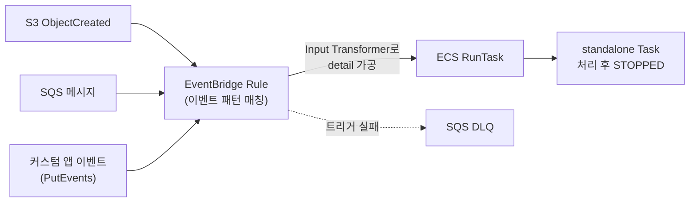
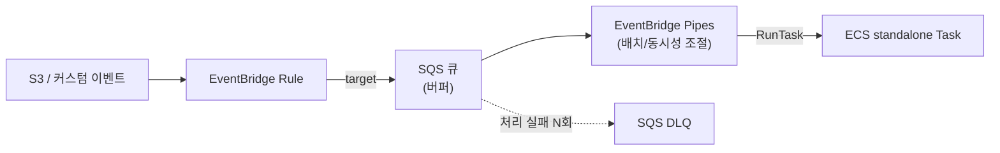

# ECS Event-Driven RunTask

[ECS Scheduled Tasks](ECS_Scheduled_Tasks.md)는 "정해진 시각·주기"에 Task를 띄우는 이야기였다. 여기는 시각이 아니라 **무언가가 일어났을 때** Task를 띄우는 쪽이다. S3에 파일이 올라오면 그 파일을 처리하는 Task, SQS에 메시지가 쌓이면 꺼내서 처리하는 Task, 애플리케이션이 "주문 정산해줘" 같은 커스텀 이벤트를 던지면 받아서 도는 Task. 트리거가 cron 표현식이 아니라 EventBridge **이벤트 패턴**이라는 점만 다르고, 결국 ECS RunTask로 standalone task를 띄운다는 건 똑같다.

스케줄 기반은 "언제 몇 개를 띄울지"를 내가 정한다. 이벤트 기반은 그 통제권이 없다. 이벤트가 1초에 한 개 올 수도, 0개 올 수도, 갑자기 800개가 몰려올 수도 있다. 이 차이 하나가 운영 난이도의 대부분을 만든다. 스케줄은 "정해진 한 번"이 보장돼서 중복·폭증이 잘 안 나는데, 이벤트는 중복도 나고 폭증도 나고 누락도 난다.

여기서는 이벤트 패턴으로 RunTask를 거는 구성, 이벤트 detail을 컨테이너 인자로 주입하는 Input Transformer, 이벤트가 몰릴 때 Task가 수십 개씩 떠서 쿼터·스로틀·DB 커넥션이 터지는 문제와 SQS·EventBridge Pipes로 완충하는 방법, at-least-once 때문에 생기는 중복 처리, 그리고 트리거 실패(DLQ)와 배치 로직 실패(exit 1)를 구분해 감지하는 부분을 정리한다.

---

## 스케줄 기반과 뭐가 다른가

같은 RunTask를 호출하지만 트리거 모양이 다르다.

| 구분 | 스케줄 기반 ([Scheduled Tasks](ECS_Scheduled_Tasks.md)) | 이벤트 기반 (이 문서) |
|------|------|------|
| 트리거 | cron / rate / at 표현식 | 이벤트 패턴(`source`, `detail-type`, `detail`) |
| 실행 시점 | 내가 정한 시각 | 이벤트가 발생한 시점 |
| 동시 실행 수 | 보통 1개(스케줄당 1회) | 이벤트 수만큼, 통제 불가 |
| Task에 넘기는 값 | 고정(스케줄에 박힌 값) | 이벤트 내용(S3 키, 메시지 본문 등) |
| 주요 함정 | 중복 실행, UTC 타임존 | 이벤트 폭증, at-least-once 중복, 누락 |

스케줄은 "매일 3시에 한 번"이라 다음 실행이 오기 전에 이전 게 끝날 거라 기대할 수 있다. 이벤트는 그런 보장이 전혀 없다. S3 버킷에 누가 파일 500개를 한꺼번에 올리면 EventBridge는 이벤트 500개를 만들고, target이 ECS RunTask면 Task 500개를 띄우려 든다. 이 차이를 모르고 스케줄 배치 짜듯이 만들면 첫 트래픽 스파이크에서 클러스터가 휘청한다.



---

## 이벤트 패턴으로 Rule 만들기

이벤트 기반은 schedule 표현식 대신 **이벤트 패턴**으로 Rule을 만든다. 패턴은 들어오는 이벤트 JSON의 일부 필드와 매칭되는 필터다. 매칭되면 target(여기서는 ECS Task)이 트리거된다.

### S3 객체 업로드

S3 이벤트를 EventBridge로 받으려면 버킷에서 "EventBridge로 알림 보내기"를 먼저 켜야 한다(S3 → 속성 → 이벤트 알림 → Amazon EventBridge ON). 이걸 안 켜면 패턴을 아무리 잘 짜도 이벤트가 안 온다. 처음에 거의 다 여기서 막힌다.

```json
{
  "source": ["aws.s3"],
  "detail-type": ["Object Created"],
  "detail": {
    "bucket": { "name": ["incoming-uploads"] },
    "object": { "key": [{ "prefix": "raw/" }] }
  }
}
```

`prefix` 같은 콘텐츠 필터로 `raw/` 아래 올라온 것만 잡는다. 이 필터를 안 걸면 버킷에 떨어지는 모든 객체에 반응하는데, 처리 결과를 같은 버킷의 다른 prefix에 다시 쓰는 구조라면 자기가 만든 객체가 또 이벤트를 일으켜 무한 루프가 된다. 입력 prefix와 출력 prefix를 분리하고 패턴에서 입력만 매칭하는 게 안전하다.

### SQS 메시지

SQS 메시지를 RunTask로 직접 연결하는 건 EventBridge Rule만으로는 안 된다. SQS는 EventBridge의 이벤트 소스가 아니라서 Rule의 이벤트 패턴으로 SQS 큐를 구독할 수 없다. 이 조합은 뒤의 EventBridge Pipes로 푼다. 일단 여기서는 "SQS → RunTask는 Rule 직결이 안 된다"만 기억하면 된다.

### 커스텀 애플리케이션 이벤트

애플리케이션이 직접 이벤트를 던질 수 있다. `PutEvents`로 커스텀 이벤트를 EventBridge 버스에 넣는다.

```python
import boto3, json

events = boto3.client("events")
events.put_events(Entries=[{
    "Source": "myapp.orders",
    "DetailType": "SettlementRequested",
    "Detail": json.dumps({
        "orderId": "ord-20260612-0001",
        "amount": 48000,
        "region": "KR"
    }),
    "EventBusName": "default"
}])
```

받는 쪽 패턴은 이렇게 잡는다.

```json
{
  "source": ["myapp.orders"],
  "detail-type": ["SettlementRequested"]
}
```

커스텀 이벤트는 스키마를 내가 정하니까 detail에 무엇을 넣을지 통제할 수 있다는 장점이 있다. S3·SQS 이벤트는 AWS가 정한 구조를 그대로 받아야 한다.

---

## Input Transformer로 이벤트 detail을 컨테이너에 주입

이벤트 기반의 핵심은 "어떤 이벤트였는지"를 Task가 알아야 한다는 점이다. S3 업로드로 떴으면 어느 버킷 어느 키인지, 정산 요청으로 떴으면 어떤 주문인지를 컨테이너에 넘겨줘야 한다. 이걸 **Input Transformer**로 한다.

Input Transformer는 두 부분이다. `InputPathsMap`으로 이벤트 JSON에서 필요한 값을 JSONPath로 뽑아 변수에 담고, `InputTemplate`으로 그 변수를 끼워 넣은 최종 JSON을 만든다. 이 최종 JSON이 RunTask의 `overrides`로 들어간다.

```json
{
  "InputPathsMap": {
    "bucket": "$.detail.bucket.name",
    "key": "$.detail.object.key"
  },
  "InputTemplate": "{\"containerOverrides\":[{\"name\":\"processor\",\"command\":[\"python\",\"process.py\",\"--bucket\",\"<bucket>\",\"--key\",\"<key>\"],\"environment\":[{\"name\":\"S3_BUCKET\",\"value\":\"<bucket>\"},{\"name\":\"S3_KEY\",\"value\":\"<key>\"}]}]}"
}
```

`<bucket>`, `<key>`는 `InputPathsMap`에서 뽑은 값으로 치환된다. 결과적으로 RunTask가 받는 override는 이렇게 풀린다.

```json
{
  "containerOverrides": [
    {
      "name": "processor",
      "command": ["python", "process.py", "--bucket", "incoming-uploads", "--key", "raw/2026/06/data.csv"],
      "environment": [
        { "name": "S3_BUCKET", "value": "incoming-uploads" },
        { "name": "S3_KEY", "value": "raw/2026/06/data.csv" }
      ]
    }
  ]
}
```

여기서 `name`은 Task Definition에 정의된 컨테이너 이름과 정확히 같아야 한다. 오타가 나면 RunTask가 "그런 컨테이너 없다"며 override를 무시하거나 거부한다. 콘솔에서 만들 땐 이 이름이 자동으로 안 채워지니 직접 맞춰야 한다.

`command`로 넘길지 `environment`로 넘길지는 컨테이너가 인자를 읽는 방식에 맞춘다. 짧은 값 몇 개면 env가 편하고, 진입점 동작 자체를 바꿔야 하면 command를 덮어쓴다. 위 예시는 둘 다 넣었지만 보통 하나만 쓴다.

주의할 점이 하나 있다. Input Transformer로 넘기는 값은 **이벤트가 주는 만큼만** 신뢰해야 한다. S3 키는 URL 인코딩돼서 올 수 있고(공백이 `+`나 `%20`로), 한글 파일명이면 더 헷갈린다. 컨테이너 안에서 키를 받아 다시 S3에 접근할 때 디코딩을 빠뜨리면 "분명 있는 파일인데 NoSuchKey"가 뜬다. 이건 이벤트 기반에서 단골로 겪는다.

---

## 이벤트 폭증: Task가 수십 개씩 뜰 때

이벤트 기반에서 가장 크게 데는 부분이다. RunTask를 Rule의 target으로 직접 걸어두면, 이벤트 하나당 Task 하나가 즉시 뜬다. 평소엔 문제없다가 어느 날 배치 업로드나 대량 메시지가 들어오면 동시에 수십~수백 개가 뜨려 한다. 여기서 세 가지가 거의 동시에 터진다.

**ECS 서비스 쿼터.** standalone task도 클러스터 동시 실행 한도와 무관하지 않다. Fargate 동시 Task 수, 계정의 vCPU 쿼터([ECS ENI 제한과 Task 한계](ECS_ENI_제한과_Task_한계.md) 참고), awsvpc면 서브넷 IP까지 한꺼번에 당겨 쓴다. 한도에 닿으면 일부 Task는 PROVISIONING에서 못 넘어가고 실패한다.

**RunTask 스로틀링.** EventBridge가 RunTask API를 너무 빠르게 호출하면 ECS가 스로틀링한다(`ThrottlingException`, `RequestLimitExceeded`). 직결 구성에서는 EventBridge가 호출 속도를 조절해주지 않기 때문에, 이벤트가 몰리면 호출도 몰려서 일부가 거부된다. Rule에 DLQ를 안 걸었으면 이렇게 거부된 트리거는 흔적도 없이 사라진다.

**RDS 커넥션 풀.** 가장 조용히 터진다. Task 80개가 동시에 떠서 각자 DB 풀에서 커넥션을 5개씩 잡으면 400개다. RDS `max_connections`를 가볍게 넘긴다. 그 순간 그 DB를 쓰는 다른 서비스까지 `too many connections`로 같이 죽는다. 배치만 죽는 게 아니라 옆 서비스를 끌고 들어간다. 이 관점은 [ECS DB Connection Pool 관리](ECS_DB_Connection_Pool_관리.md)와 [ECS Task Scale Out 부작용](ECS_Task_Scale_Out_부작용.md)에 더 자세히 있다.

핵심은 **이벤트 발생 속도와 Task 기동 속도를 분리**하는 것이다. 이벤트는 몰려와도 Task는 천천히 뜨게 만들어야 한다. 그 완충 장치가 SQS다.

---

## SQS 버퍼링과 EventBridge Pipes

직결(EventBridge Rule → RunTask) 대신 중간에 SQS를 끼운다. 이벤트는 일단 SQS에 쌓이고, 거기서 정해진 속도로 꺼내 Task를 띄운다. 큐가 댐 역할을 해서 스파이크를 흡수한다.

문제는 "SQS에서 꺼내 RunTask를 호출하는" 그 연결을 뭘로 하느냐다. 여기서 **EventBridge Pipes**가 들어온다. Pipes는 소스(SQS 등)에서 메시지를 폴링해 타깃(ECS RunTask 등)으로 흘려보내는 전용 서비스다. 소스가 SQS면 배치 크기와 동시성을 Pipes가 조절해주기 때문에, 큐에 1000개가 쌓여도 Task가 한꺼번에 1000개 뜨지 않는다.



구성은 두 단으로 나뉜다. 앞단은 이벤트를 SQS에 넣는 Rule이다(target이 RunTask가 아니라 SQS 큐). 뒷단은 그 큐를 소스로 하는 Pipe다.

```bash
aws pipes create-pipe \
  --name "upload-to-runtask" \
  --source "arn:aws:sqs:ap-northeast-2:123456789012:upload-buffer" \
  --source-parameters '{
    "SqsQueueParameters": { "BatchSize": 1 }
  }' \
  --target "arn:aws:ecs:ap-northeast-2:123456789012:cluster/prod" \
  --target-parameters '{
    "EcsTaskParameters": {
      "TaskDefinitionArn": "arn:aws:ecs:ap-northeast-2:123456789012:task-definition/processor",
      "LaunchType": "FARGATE",
      "TaskCount": 1,
      "NetworkConfiguration": {
        "awsvpcConfiguration": {
          "Subnets": ["subnet-aaa", "subnet-bbb"],
          "SecurityGroups": ["sg-batch"],
          "AssignPublicIp": "DISABLED"
        }
      },
      "Overrides": {
        "ContainerOverrides": [{
          "Name": "processor",
          "Environment": [
            { "Name": "PAYLOAD", "Value": "$.body" }
          ]
        }]
      }
    }
  }' \
  --role-arn "arn:aws:iam::123456789012:role/pipes-ecs-role"
```

`BatchSize`를 1로 두면 메시지 하나당 Task 하나다. 동시에 뜨는 Task 수는 큐에 쌓인 양이 아니라 Pipes가 폴링하는 속도와 SQS의 in-flight 메시지 수로 정해진다. SQS 가시성 타임아웃(visibility timeout)을 Task 최대 실행 시간보다 넉넉히 잡아야, Task가 도는 동안 같은 메시지가 다시 안 꺼내진다. 이걸 짧게 잡으면 처리 중인 메시지가 또 나와서 같은 일을 두 번 한다.

이렇게 해도 동시 Task 수의 상한을 더 단단히 걸고 싶으면, Pipes 앞에서 큐를 여러 개로 쪼개거나 RDS 쪽에 RDS Proxy를 둬서 커넥션을 통합하는 식으로 보강한다. 폭증을 완전히 막진 못해도 댐이 있으면 "한 번에 800개" 대신 "초당 N개"로 펴진다.

Pipes 자체가 부담이면, 더 단순하게 SQS를 Lambda로 받아 Lambda가 RunTask를 호출하면서 동시성을 제어하는 방법도 있다. 어느 쪽이든 "이벤트 발생 속도 ≠ Task 기동 속도"를 만드는 게 목적이다.

---

## at-least-once와 멱등 처리

EventBridge도 SQS(표준 큐)도 **at-least-once** 전달이다. 같은 이벤트가 두 번 이상 올 수 있다는 뜻이다. S3가 ObjectCreated를 두 번 쏠 수도 있고, SQS 메시지가 가시성 타임아웃 안에 처리가 안 끝나 재배달될 수도 있고, Pipes/Lambda가 재시도하면서 같은 걸 또 보낼 수도 있다. 정확히 한 번(exactly-once)은 기대하면 안 된다.

그래서 Task 안의 처리 로직은 **같은 이벤트를 두 번 처리해도 결과가 같아야** 한다. 스케줄 기반에서도 동시 실행 중복을 막느라 분산 락을 쓰는데, 이벤트 기반은 거기에 더해 "같은 이벤트의 재전달"까지 막아야 한다.

현실적으로 쓰는 방법은 이벤트마다 고유 키를 잡고, 처리 시작 전에 그 키를 조건부로 기록하는 것이다. 이미 있으면 처리된 것으로 보고 그냥 빠진다.

```python
import boto3
from botocore.exceptions import ClientError

ddb = boto3.client("dynamodb")

def already_processed(event_key: str) -> bool:
    try:
        ddb.put_item(
            TableName="processed-events",
            Item={"eventKey": {"S": event_key}, "ttl": {"N": str(ttl_epoch())}},
            ConditionExpression="attribute_not_exists(eventKey)",
        )
        return False  # 처음 보는 이벤트
    except ClientError as e:
        if e.response["Error"]["Code"] == "ConditionalCheckFailedException":
            return True  # 이미 처리됨
        raise
```

키로 뭘 쓸지가 관건이다. S3면 `bucket/key/eTag`나 버전 ID가 안정적이다. 단순 `bucket/key`만 쓰면 같은 경로에 다른 내용이 다시 올라왔을 때(덮어쓰기) 두 번째를 중복으로 오판해 버린다. 커스텀 이벤트면 애플리케이션이 발급한 멱등 키(주문 ID + 작업 종류 등)를 `PutEvents`의 detail에 같이 실어 보내는 게 깔끔하다. EventBridge 이벤트의 `id` 필드는 재전달 때 같은 값이 유지되지 않을 수 있어 멱등 키로는 부적합하다.

DynamoDB 조건부 쓰기 대신 처리 결과 테이블에 유니크 제약을 거는 방식도 같은 효과다. 핵심은 "이미 했는지"를 처리 전에 원자적으로 판정하는 것이다.

---

## 트리거 실패(DLQ)와 로직 실패(exit 1) 구분

[Scheduled Tasks](ECS_Scheduled_Tasks.md)에서도 짚은 구분인데, 이벤트 기반에서는 더 자주 부딪힌다. 실패가 두 층위라는 걸 모르면 "분명 실패했는데 알림이 안 와요"로 헤맨다.

**1층: EventBridge가 ECS를 못 깨운 경우.** 이벤트 패턴은 매칭됐는데 RunTask 호출이 실패한 경우다. 스로틀링, 쿼터 초과, IAM 권한 부족, 잘못된 NetworkConfiguration 등이다. 이건 Rule(또는 Pipes/SQS)에 건 **DLQ**가 잡는다. Rule의 target마다 DLQ를 따로 걸 수 있다. DLQ를 안 걸면 이렇게 실패한 트리거는 그냥 사라지고, 이벤트가 분명 왔는데 Task가 안 뜬 상태가 된다.

```bash
aws events put-targets \
  --rule "s3-upload-runtask" \
  --targets '[{
    "Id": "ecs-processor",
    "Arn": "arn:aws:ecs:ap-northeast-2:123456789012:cluster/prod",
    "RoleArn": "arn:aws:iam::123456789012:role/ecsEventsRole",
    "EcsParameters": { "...": "..." },
    "DeadLetterConfig": {
      "Arn": "arn:aws:sqs:ap-northeast-2:123456789012:runtask-dlq"
    }
  }]'
```

**2층: Task는 떴는데 컨테이너 로직이 실패(exit 1)한 경우.** RunTask 호출은 성공했고 Task도 정상적으로 떴다. EventBridge 입장에서는 할 일을 다 한 거라 DLQ에 아무것도 안 들어간다. 컨테이너가 처리 중 예외로 exit 1을 뱉어도 트리거 쪽은 모른다. 이건 **ECS Task State Change** 이벤트로 따로 잡는다.

```json
{
  "source": ["aws.ecs"],
  "detail-type": ["ECS Task State Change"],
  "detail": {
    "lastStatus": ["STOPPED"],
    "clusterArn": ["arn:aws:ecs:ap-northeast-2:123456789012:cluster/prod"]
  }
}
```

이 Rule의 target을 Lambda로 잡고, `detail.containers[].exitCode`가 0이 아니거나 `stoppedReason`이 비정상(`OutOfMemory`, `CannotPullContainerError` 등)이면 알림을 보낸다. stoppedReason별 의미와 exitCode 확인 방법은 [Scheduled Tasks](ECS_Scheduled_Tasks.md)의 종료 코드 모니터링 절에 정리돼 있으니 그대로 적용된다.

두 층을 표로 다시 정리하면 이렇다.

| 실패 위치 | 예시 | 감지 수단 |
|-----------|------|-----------|
| EventBridge → RunTask | 스로틀, 쿼터, PassRole 누락 | target/Pipe의 DLQ + CloudWatch 알람 |
| 컨테이너 로직 | 처리 중 예외 exit 1, OOM | Task State Change → Lambda 알림 |
| 이벤트 자체 미발생 | S3 EventBridge 알림 OFF | 마지막 처리 시각 모니터링 |

세 번째 줄이 이벤트 기반 특유의 함정이다. 트리거도 안 깨지고 로직도 안 깨졌는데 그냥 이벤트가 안 온 경우다. S3 알림을 안 켰거나, prefix 필터가 잘못돼 매칭이 안 되거나, 커스텀 이벤트의 `source`/`detail-type` 철자가 패턴과 안 맞으면 조용히 아무 일도 안 일어난다. 이건 DLQ로도 안 잡힌다. "최근 N시간 동안 처리 0건이면 알림"처럼 부재(absence)를 감시해야 잡힌다.

DLQ는 만들어만 두고 안 보면 의미가 없다. `ApproximateNumberOfMessagesVisible > 0` CloudWatch 알람을 반드시 같이 건다.

---

## IAM 역할은 따로 정리하지 않는다

이벤트 기반에서 EventBridge(또는 Pipes)가 RunTask를 호출하려면 그 역할에 `ecs:RunTask`와 Task 역할들에 대한 `iam:PassRole`이 필요하다. PassRole이 빠지면 첫 트리거에서 `is not authorized to perform: iam:PassRole`로 Task가 안 뜬다. 이 권한 구성, 신뢰 정책(Rule이면 `events.amazonaws.com`, Pipes면 `pipes.amazonaws.com`, Scheduler면 `scheduler.amazonaws.com`)은 트리거 종류만 다를 뿐 [Scheduled Tasks](ECS_Scheduled_Tasks.md)의 `ecsEventsRole` 절과 내용이 같다.

Task Execution Role / Task Role 자체는 [ECS IAM Role 설정](ECS_IAM_Role_설정.md)에 정리돼 있다. 여기서 한 가지만 덧붙이면, 이벤트 기반은 Task Role에 들어갈 권한이 이벤트 출처에 따라 달라진다. S3 이벤트로 떴으면 그 객체를 읽을 `s3:GetObject`, SQS 버퍼를 쓰면 `sqs:DeleteMessage`까지 컨테이너 쪽 Task Role에 있어야 처리를 끝낼 수 있다. 트리거 역할(RunTask 호출)과 컨테이너 역할(실제 작업)을 헷갈리면 "Task는 떴는데 S3 접근이 거부"되는 식으로 엉뚱한 데서 막힌다.

---

## 마무리

이벤트 기반 RunTask는 스케줄 기반과 API는 같지만 운영 성격이 정반대다. 스케줄은 통제된 한 번이고, 이벤트는 통제 안 되는 N번이다. 그래서 신경 쓸 게 더 많다.

- 트리거는 cron이 아니라 이벤트 패턴. S3는 버킷에서 EventBridge 알림을 먼저 켜야 한다.
- 이벤트 detail은 Input Transformer로 뽑아 `containerOverrides`의 command/env에 주입한다. 컨테이너 이름은 Task Definition과 정확히 맞춘다.
- 이벤트가 몰리면 Task가 동시에 수십 개 떠서 쿼터·RunTask 스로틀·RDS 커넥션이 같이 터진다. RunTask 직결 대신 SQS + EventBridge Pipes로 발생 속도와 기동 속도를 분리한다.
- 전달은 at-least-once다. 같은 이벤트가 두 번 와도 결과가 같게 멱등 키로 막는다.
- 실패는 두 층. 트리거 실패는 DLQ, 로직 실패(exit 1)는 Task State Change로 따로 잡는다. 이벤트가 아예 안 온 경우는 둘 다 못 잡으니 처리 부재를 감시한다.
