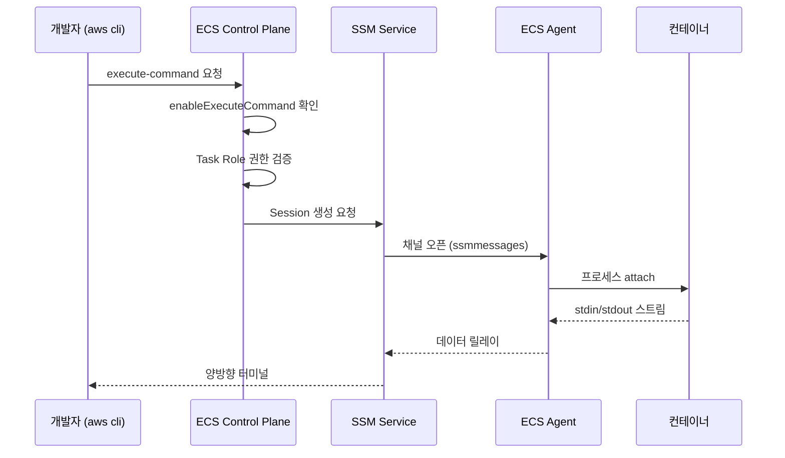

# ECS Exec

ECS에서 운영하다 보면 결국 한 번은 "지금 떠 있는 컨테이너 내부를 직접 보고 싶다"는 순간이 온다. 로그로 안 잡히는 파일 시스템 상태, 환경 변수 주입이 제대로 됐는지 확인, OOM 직전 힙 덤프 수집 같은 작업이다. Fargate에는 SSH가 없고 EC2 launch type도 호스트로 들어간 뒤 `docker exec`을 쓰는 건 보안상 점점 막히는 추세다. 이때 쓰는 게 ECS Exec이다.

내부적으로는 SSM Session Manager 채널을 통해 ECS Agent가 컨테이너 안의 프로세스에 들어가는 구조다. 그래서 SSH 키 관리, 보안 그룹 22번 포트 개방, Bastion Host 같은 게 전부 필요 없다. 대신 IAM, SSM Agent, VPC 엔드포인트라는 다른 차원의 문제들이 생긴다.

---

## 전체 흐름

ECS Exec이 동작할 때 어떤 컴포넌트가 어떤 순서로 엮이는지를 먼저 봐야 트러블슈팅이 편하다.



핵심은 두 가지다. 첫째, 개발자 → ECS → SSM → Agent → 컨테이너 순으로 권한 체크가 일어난다. 어느 한 단계에서 막히면 에러 메시지가 모호하다. 둘째, Agent가 SSM 서비스로 outbound 연결을 만들 수 있어야 한다. 이게 안 되는 환경(인터넷 차단 VPC, 프라이빗 서브넷에 엔드포인트 없음)이 흔한 함정이다.

---

## 활성화 조건 세 가지

ECS Exec을 쓰려면 동시에 만족해야 하는 조건이 세 개 있다. 하나라도 빠지면 안 된다.

### 1. Service / Task에서 enableExecuteCommand 켜기

Task Definition에 옵션이 있는 게 아니라, **Service 또는 RunTask 호출 시점**에 켜는 옵션이다. 기존 서비스에 적용하려면 `update-service`로 다시 배포해야 한다.

```bash
aws ecs update-service \
  --cluster prod-cluster \
  --service api-service \
  --enable-execute-command \
  --force-new-deployment
```

`--force-new-deployment`를 빼먹으면 옵션은 저장되지만 이미 떠 있는 Task에는 적용 안 된다. 새 Task가 떠야 비로소 들어갈 수 있다. 운영하면서 "왜 안 되지?" 싶을 때 80%는 여기서 막힌다.

새로 Task를 띄울 때는 `run-task`에 플래그를 붙인다.

```bash
aws ecs run-task \
  --cluster prod-cluster \
  --task-definition api:42 \
  --enable-execute-command \
  --launch-type FARGATE \
  --network-configuration "awsvpcConfiguration={subnets=[subnet-xxx],securityGroups=[sg-xxx]}"
```

### 2. Task Role에 ssmmessages 권한

여기서 헷갈리는 게 Execution Role이 아니라 **Task Role**이라는 점이다. ECS Exec은 컨테이너 내부에서 SSM Agent 역할을 하는 프로세스가 동작하는데, 이 프로세스는 Task Role의 자격증명을 쓴다.

```json
{
  "Version": "2012-10-17",
  "Statement": [
    {
      "Effect": "Allow",
      "Action": [
        "ssmmessages:CreateControlChannel",
        "ssmmessages:CreateDataChannel",
        "ssmmessages:OpenControlChannel",
        "ssmmessages:OpenDataChannel"
      ],
      "Resource": "*"
    }
  ]
}
```

`ssm:*`가 아니라 `ssmmessages:*` 네 개라는 점이 헷갈린다. 둘은 다른 서비스다. SSM Session Manager의 데이터 채널 API가 `ssmmessages` 네임스페이스에 있다.

만약 감사 로그를 S3/CloudWatch로 보낸다면 Task Role에 그쪽 write 권한도 추가해야 한다. 뒤에서 다시 다룬다.

### 3. SSM Agent가 컨테이너 안에서 살아 있어야 함 (Fargate는 자동)

Fargate Platform Version 1.4 이상이면 컨테이너 사이드카로 SSM Agent가 자동 주입된다. 1.3 이하면 아예 안 된다. Service 정의에 `platformVersion: "1.4.0"` 또는 `LATEST`로 지정하면 된다.

EC2 launch type이면 컨테이너 이미지 안에 SSM Agent가 있어야 한다고 오해하기 쉬운데 아니다. ECS Agent가 alongside로 띄워준다. 다만 EC2 인스턴스의 ECS Agent 버전이 `1.50.2` 이상이어야 한다. 오래된 AMI를 쓰는 경우 ECS Agent 업데이트가 먼저다.

---

## 접속 명령어

세팅이 끝나면 접속 자체는 단순하다.

```bash
aws ecs execute-command \
  --cluster prod-cluster \
  --task 1234567890abcdef0 \
  --container app \
  --interactive \
  --command "/bin/sh"
```

`--task`에 넣는 건 Task ARN이거나 마지막 ID 부분이다. Service 단위로 들어갈 수 없고 항상 Task 단위로 들어간다. 그래서 여러 Task가 떠 있는 서비스의 경우 어느 Task에 들어갈지 먼저 골라야 한다.

```bash
aws ecs list-tasks --cluster prod-cluster --service-name api-service \
  --query 'taskArns[*]' --output text
```

`--container`는 Task Definition에 컨테이너가 여러 개일 때(사이드카 패턴) 어디로 들어갈지 지정한다. 단일 컨테이너 Task면 생략 가능하다.

`--command`에 `/bin/sh`를 가장 많이 쓴다. Alpine 기반 이미지는 `bash`가 없는 경우가 흔하다. `distroless` 같은 미니멀 이미지면 shell 자체가 없어서 ECS Exec으로 들어가도 할 게 거의 없다. 이건 뒤에서 우회법을 다룬다.

### 로컬에 필요한 것

`aws cli`에 더해 **Session Manager Plugin**을 별도로 설치해야 한다. 이게 없으면 명령은 성공해도 터미널이 안 뜬다.

```bash
# macOS
brew install --cask session-manager-plugin

# Linux
curl "https://s3.amazonaws.com/session-manager-downloads/plugin/latest/ubuntu_64bit/session-manager-plugin.deb" -o "session-manager-plugin.deb"
sudo dpkg -i session-manager-plugin.deb
```

설치 확인.

```bash
session-manager-plugin --version
```

---

## 사전 점검: check-attributes

설정이 다 됐는지 확인하는 공식 도구가 있다. `amazon-ecs-exec-checker`라는 스크립트로, 클러스터/Task ARN을 넣으면 IAM, VPC, Agent 상태를 다 점검해준다.

```bash
git clone https://github.com/aws-containers/amazon-ecs-exec-checker
cd amazon-ecs-exec-checker
./check-ecs-exec.sh prod-cluster <task-arn>
```

직접 호출 API로도 확인 가능하다.

```bash
aws ecs describe-tasks \
  --cluster prod-cluster \
  --tasks <task-arn> \
  --query 'tasks[0].enableExecuteCommand'
```

`true`가 나와야 하고, 컨테이너의 `managedAgents`에 `ExecuteCommandAgent`가 `RUNNING` 상태여야 한다.

```bash
aws ecs describe-tasks \
  --cluster prod-cluster \
  --tasks <task-arn> \
  --query 'tasks[0].containers[*].managedAgents'
```

이 출력이 비어 있거나 `PENDING`에서 멈춰 있으면 SSM Agent가 못 떴다는 신호다. 다음 섹션의 트러블슈팅을 봐야 한다.

---

## 트러블슈팅

ECS Exec이 안 될 때 에러 메시지가 도움 안 되는 경우가 많다. 대표적인 케이스 네 가지가 있다.

### 케이스 1: TargetNotConnected 에러

```
An error occurred (TargetNotConnectedException) when calling the ExecuteCommand operation:
The execute command failed due to an internal error.
```

가장 흔한 패턴이다. 원인은 보통 SSM Agent가 컨테이너 안에서 안 뜬 경우다.

확인 순서.
1. `describe-tasks`로 `managedAgents` 상태 확인. `RUNNING`이 아니면 여기서 문제다.
2. Task Definition의 `readonlyRootFilesystem: true` 여부 확인. 이게 켜져 있으면 SSM Agent가 `/var/lib/amazon/ssm` 같은 경로에 못 써서 죽는다. 보안상 read-only 컨테이너를 운영하면 별도 볼륨을 마운트해야 한다.

```json
{
  "readonlyRootFilesystem": true,
  "mountPoints": [
    {
      "sourceVolume": "ssm-volume",
      "containerPath": "/var/lib/amazon/ssm"
    },
    {
      "sourceVolume": "ssm-volume",
      "containerPath": "/var/log/amazon/ssm"
    }
  ]
}
```

이렇게 우회 가능하지만, 실제로 운영해보면 read-only를 잠깐 끄고 디버깅한 뒤 다시 켜는 쪽이 운영 비용이 낮다.

### 케이스 2: 네트워크 — awsvpc 모드에서 NAT/엔드포인트 부재

프라이빗 서브넷에 Task를 띄우는데 NAT Gateway도 없고 VPC 엔드포인트도 없으면 SSM Agent가 SSM 서비스에 도달 못 한다. 이 경우 `managedAgents` 상태가 `PENDING`에서 멈추거나 `STOPPED` reason에 connection 관련 메시지가 뜬다.

해결책은 두 가지다.

VPC 엔드포인트 세 개를 만든다. 비용은 NAT보다 저렴하고, 트래픽이 AWS 백본으로 빠진다.
- `com.amazonaws.<region>.ssm`
- `com.amazonaws.<region>.ssmmessages`
- `com.amazonaws.<region>.ec2messages`

엔드포인트 보안 그룹에서 Task의 보안 그룹으로부터 443 포트 inbound를 허용해야 한다. 이걸 빼먹으면 엔드포인트는 만들었는데 통신이 안 된다.

NAT Gateway가 이미 있다면 별도 작업 없이 된다. 다만 NAT 비용이 ECS Exec 트래픽만으로도 의외로 나간다. 운영 환경에서 자주 들어간다면 엔드포인트로 가는 게 합리적이다.

### 케이스 3: IAM 권한 불일치

`AccessDeniedException`이 떴다면 두 군데 중 하나다.

호출자(개발자) IAM에 `ecs:ExecuteCommand`가 없는 경우. 의외로 빠뜨리는 권한이다.

```json
{
  "Effect": "Allow",
  "Action": "ecs:ExecuteCommand",
  "Resource": "arn:aws:ecs:ap-northeast-2:123456789012:task/prod-cluster/*"
}
```

또는 Task Role에 `ssmmessages` 네 개가 빠진 경우. 앞에서 다룬 정책이다. 둘 중 어느 쪽인지 에러 메시지로는 잘 구분이 안 된다. 양쪽 다 확인해야 한다.

KMS 키로 Task 데이터를 암호화한 클러스터라면 호출자가 그 KMS 키에 `kms:Decrypt` 권한이 있어야 한다. 클러스터 설정에서 `executeCommandConfiguration.kmsKeyId`를 지정한 경우에만 해당된다.

### 케이스 4: Fargate Platform Version

Service를 `LATEST`로 두지 않고 `1.3.0`으로 명시해놓은 케이스를 가끔 본다. 마이그레이션할 때 안전하게 고정해둔 게 그대로 남은 경우다.

```bash
aws ecs describe-services \
  --cluster prod-cluster \
  --services api-service \
  --query 'services[0].platformVersion'
```

`1.4.0` 이상이 아니면 ECS Exec 자체가 동작 안 한다. Service 업데이트로 올려야 하는데, Platform Version을 올리면 Task가 재시작되니까 일반 배포처럼 다뤄야 한다.

```bash
aws ecs update-service \
  --cluster prod-cluster \
  --service api-service \
  --platform-version LATEST \
  --force-new-deployment
```

### 케이스 5: distroless / shell 없는 이미지

shell이 없는 이미지면 `/bin/sh` 자체가 실패한다. 이 경우는 ECS Exec의 한계라기보다 이미지 설계 문제다. 우회법은 두 가지다.

디버그용 사이드카를 띄운다. `nicolaka/netshoot` 같은 이미지를 같은 Task에 사이드카로 추가하면 네임스페이스를 공유해서 디버깅할 수 있다.

또는 빌드 시 `debug` 타깃을 별도로 만들어둔다. distroless에는 `:debug` 태그가 있어서 `busybox`가 들어가 있다. 운영은 distroless로 가고 디버그가 필요하면 이미지 태그만 바꿔 새 Task를 띄우는 방식이다.

---

## 감사 로그 — 운영에서는 필수

운영 환경에서 ECS Exec을 허용하려면 **누가 언제 어느 컨테이너에 들어가서 무슨 명령을 쳤는지** 남겨야 한다. 안 그러면 컴플라이언스 측면에서 SSH보다 더 위험하다. 키가 없으니 추적이 더 어려워진다는 오해 때문이다.

클러스터 단위로 로깅 설정을 한다.

```bash
aws ecs update-cluster \
  --cluster prod-cluster \
  --configuration '{
    "executeCommandConfiguration": {
      "kmsKeyId": "arn:aws:kms:ap-northeast-2:123456789012:key/...",
      "logging": "OVERRIDE",
      "logConfiguration": {
        "cloudWatchLogGroupName": "/ecs/exec-audit/prod",
        "cloudWatchEncryptionEnabled": true,
        "s3BucketName": "company-ecs-exec-audit",
        "s3KeyPrefix": "prod-cluster/",
        "s3EncryptionEnabled": true
      }
    }
  }'
```

`logging`은 세 가지 값이 있다. `NONE`은 로그 안 남김(운영에서 절대 쓰면 안 됨). `DEFAULT`는 Task의 awslogs 드라이버로 들어감(추적 어렵다). `OVERRIDE`는 별도 CloudWatch Logs / S3로 분리해서 보낸다. 운영은 무조건 `OVERRIDE`다.

Task Role에는 그쪽 write 권한이 추가로 필요하다.

```json
{
  "Effect": "Allow",
  "Action": [
    "logs:DescribeLogGroups",
    "logs:CreateLogStream",
    "logs:DescribeLogStreams",
    "logs:PutLogEvents"
  ],
  "Resource": "arn:aws:logs:ap-northeast-2:*:log-group:/ecs/exec-audit/*"
},
{
  "Effect": "Allow",
  "Action": [
    "s3:PutObject",
    "s3:GetEncryptionConfiguration"
  ],
  "Resource": "arn:aws:s3:::company-ecs-exec-audit/*"
}
```

이렇게 해두면 세션의 모든 입출력이 로그로 남는다. CloudWatch Logs Insights로 쿼리 가능하고, S3 쪽은 장기 보관용이다. 감사팀이 분기마다 들고 가는 그 데이터다.

```sql
fields @timestamp, @message
| filter @logStream like /ecs-exec/
| sort @timestamp desc
| limit 100
```

세션 단위로 로그 스트림이 생기니까 누가 어떤 명령을 어느 순서로 쳤는지가 시간순으로 다 보인다.

---

## 운영 보안 가드레일

prod 환경에서 ECS Exec을 무제한 풀어두면 디버깅용으로 쓰다가 운영 데이터를 건드리는 사고가 난다. 몇 가지 제약을 IAM 정책으로 강제해야 한다.

### 클러스터 단위 제한

특정 클러스터만 가능하게 한다. 개발자 IAM에서 prod 클러스터를 빼면 staging까지만 들어갈 수 있다.

```json
{
  "Effect": "Allow",
  "Action": "ecs:ExecuteCommand",
  "Resource": "arn:aws:ecs:ap-northeast-2:*:task/staging-cluster/*"
}
```

### 태그 기반 제한

Task에 환경 태그를 박아두고 IAM 조건으로 거른다. prod Task는 `aws:ResourceTag/Environment=prod`로 막는 식이다.

```json
{
  "Effect": "Deny",
  "Action": "ecs:ExecuteCommand",
  "Resource": "*",
  "Condition": {
    "StringEquals": {
      "aws:ResourceTag/Environment": "prod"
    }
  }
}
```

prod 접근이 필요하면 별도 break-glass 역할을 만들고, AssumeRole 시점에 Slack 알림이 뜨도록 EventBridge 룰을 걸어둔다. 누가 prod에 들어갔다는 사실 자체가 팀 전체에 가시화되도록 만든다.

### 컨테이너 권한 자체를 줄이기

ECS Exec으로 들어간 셸은 컨테이너의 PID 1과 같은 권한을 갖는다. 컨테이너가 root로 떠 있으면 셸도 root다. 운영 이미지를 non-root 유저로 실행하는 게 가장 단단한 가드레일이다.

```dockerfile
USER 1000
```

이렇게 해두면 ECS Exec으로 들어가도 `/etc/shadow` 못 읽고, `apt-get install` 못 한다. 디버깅 범위가 줄어드는 대신 사고 범위도 줄어든다.

---

## 실전 디버깅 시나리오

여기까지가 셋업 이야기였고, 실제로 들어가서 뭘 하는지가 결국 중요하다.

### 시나리오 1: 파일이 정말 거기 있는지 확인

CI에서 빌드한 이미지에 설정 파일이 빠진 것 같은 의심이 들 때. 로컬에서 같은 이미지를 받아서 보면 되긴 하지만, 환경 변수 치환이 들어간 설정이라면 실제 떠 있는 컨테이너를 봐야 한다.

```bash
aws ecs execute-command \
  --cluster prod-cluster \
  --task <task-arn> \
  --container app \
  --interactive \
  --command "/bin/sh"

# 안에서
ls -la /app/config/
cat /app/config/application.yml
md5sum /app/bin/server
```

특히 `md5sum` 같은 걸로 ECR에 올라간 이미지와 실제 떠 있는 컨테이너의 바이너리가 같은지 검증하는 게 의외로 도움 된다. 캐시된 이미지가 도는 경우를 가끔 잡는다.

### 시나리오 2: 환경 변수 점검

Secrets Manager에서 주입되는 환경 변수가 진짜 들어왔는지 확인. 로그에 환경 변수를 찍는 건 보안상 안 좋으니 직접 확인하는 쪽이 안전하다.

```bash
# 컨테이너 안에서
env | grep -v "AWS_" | sort
echo "DB_HOST=$DB_HOST"
echo "DB_USER 길이: ${#DB_USER}"
```

값 자체를 출력하지 말고 길이만 찍거나 prefix만 찍는 습관을 들이면 세션 로그에 시크릿이 남는 사고를 막을 수 있다. ECS Exec 세션 로그도 결국 누군가 볼 수 있는 곳에 남는다.

### 시나리오 3: OOM 직전 JVM 덤프 수집

가장 자주 쓰는 시나리오다. Java 애플리케이션이 OOM으로 재시작을 반복하는데, 컨테이너가 죽으면 그 안의 상태가 사라진다. 메모리 사용량이 임계치 근처일 때 들어가서 덤프를 떠야 한다.

```bash
aws ecs execute-command \
  --cluster prod-cluster \
  --task <task-arn> \
  --container app \
  --interactive \
  --command "/bin/sh"

# 안에서
jps -l
# 1 com.example.App

jstat -gcutil 1 1000 10
# GC 상태 1초 간격 10번

jstack 1 > /tmp/threads.txt
jmap -dump:live,format=b,file=/tmp/heap.hprof 1
```

여기서 끝이 아니다. 컨테이너 안의 `/tmp/heap.hprof`는 컨테이너가 죽으면 같이 사라진다. 밖으로 빼야 한다.

S3로 직접 업로드하는 게 가장 단순하다. Task Role에 `s3:PutObject` 권한이 있다는 전제로.

```bash
# 컨테이너 안에서 (aws cli가 이미지에 있어야 함)
aws s3 cp /tmp/heap.hprof s3://debug-bucket/heap-$(hostname)-$(date +%s).hprof
```

이미지에 aws cli가 없으면 `curl`로 presigned URL을 쳐서 올린다. 운영 이미지에 aws cli 넣는 건 이미지가 커져서 보통 안 한다. 그래서 prod 디버깅 전에 미리 presigned URL을 만들어두고 들어가는 패턴이 자주 쓰인다.

```bash
# 로컬에서 미리
aws s3 presign s3://debug-bucket/heap.hprof --expires-in 3600 > /tmp/url

# 컨테이너 안에서
curl -X PUT -T /tmp/heap.hprof "$(cat /tmp/presigned-url)"
```

### 시나리오 4: 디스크 사용량 추적

컨테이너 디스크가 가득 차서 로그 쓰기가 실패하는 경우. 보통 어디가 차는지 모른다.

```bash
df -h
du -sh /tmp /var/log /app/logs 2>/dev/null
find / -size +100M 2>/dev/null
```

`find`로 큰 파일 찾는 게 의외로 자주 도움 된다. 라이브러리가 임시 파일을 안 지우고 쌓는 케이스, 로그 로테이션이 안 도는 케이스 같은 게 잡힌다.

### 시나리오 5: 네트워크 연결 확인

DB나 외부 API 호출이 간헐적으로 실패할 때. 보안 그룹 / NACL / DNS / 라우팅 중 어디 문제인지 좁혀야 한다.

```bash
# 안에서
nslookup db.internal.example.com
nc -zv db.internal.example.com 5432
curl -v https://api.external.com/health
```

`nc`, `curl`, `nslookup`이 이미지에 없는 경우가 많다. `nicolaka/netshoot` 사이드카가 진가를 발휘하는 지점이다. 운영 이미지를 부풀리지 않으면서 같은 네트워크 네임스페이스에서 디버깅 도구를 다 쓸 수 있다.

---

## 마무리

ECS Exec은 SSH를 안 쓰면서도 운영 컨테이너에 들어갈 수 있다는 점에서 분명한 가치가 있다. 다만 셋업 단계의 함정이 많다. 세 가지 조건(enableExecuteCommand, ssmmessages 권한, Platform Version 1.4+)을 항상 같이 본다는 감각을 만들어두면 트러블슈팅 시간이 줄어든다.

운영에서는 감사 로그를 반드시 OVERRIDE로 분리해서 남기고, prod 접근은 IAM 조건으로 막은 뒤 별도 break-glass 절차를 거치게 만든다. 디버깅 도구는 운영 이미지가 아니라 사이드카 또는 별도 debug 이미지로 분리하는 패턴이 장기적으로 깔끔하다.
