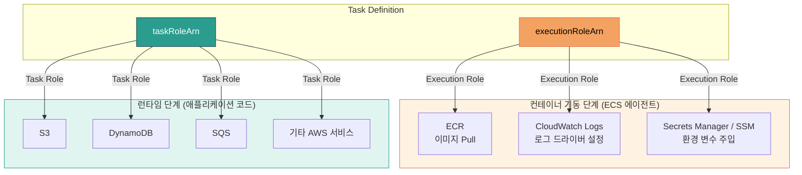
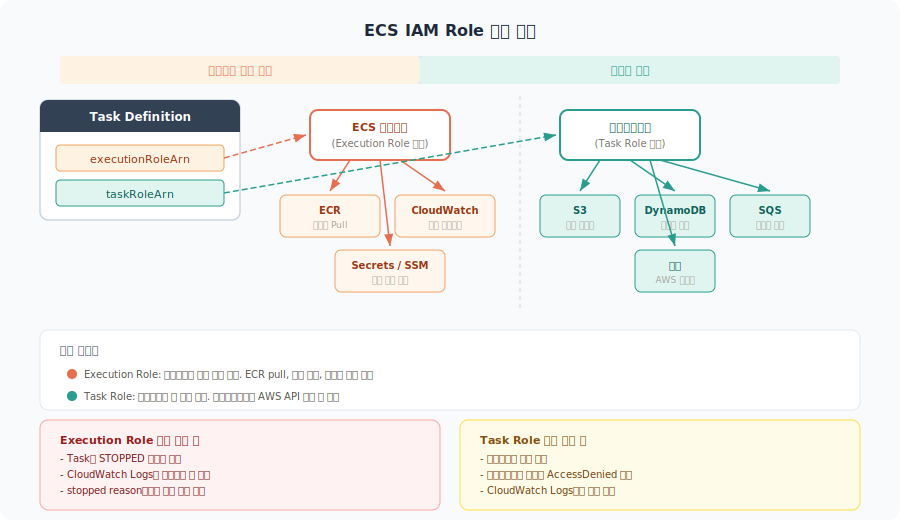
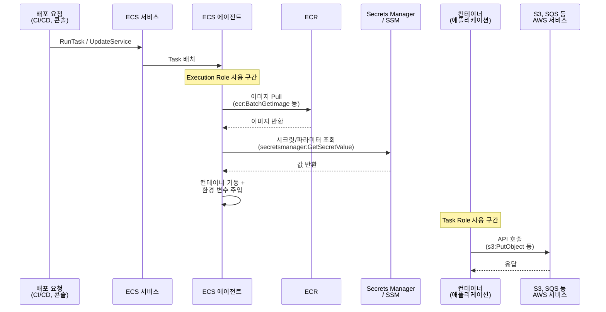
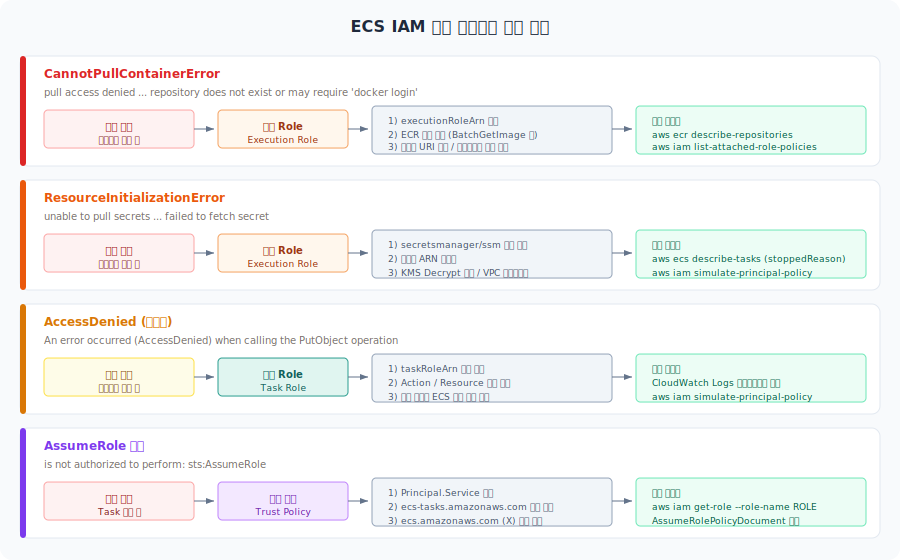
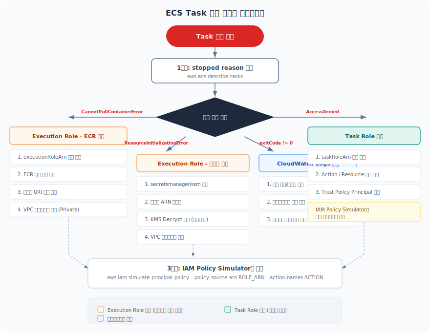
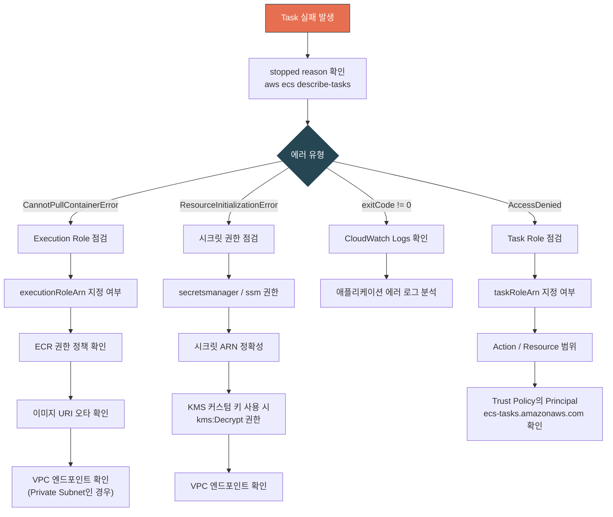

# ECS IAM Role 설정

ECS에서 컨테이너를 띄우려면 IAM Role 두 개를 구분해야 한다. Task Role과 Execution Role이다. 이 두 역할의 범위가 다른데, 처음 설정할 때 혼동하면 배포 시점에 권한 에러가 난다.

---

## 전체 구조

아래 다이어그램은 ECS Task에서 두 IAM Role이 각각 어디에서, 누구에 의해 사용되는지를 보여준다.



아래 아키텍처 이미지는 두 Role의 사용 시점과 대상 서비스를 한눈에 보여준다.



핵심은 **시점**이 다르다는 것이다. Execution Role은 컨테이너가 뜨기 전에 쓰이고, Task Role은 컨테이너가 뜬 후에 쓰인다.

---

## Task Role vs Execution Role

### Execution Role

ECS **에이전트**가 컨테이너를 실행하기 위해 사용하는 역할이다. 컨테이너 자체가 아니라, 컨테이너를 띄우는 과정에서 필요한 권한을 담당한다.

담당 범위:
- ECR에서 이미지 pull
- CloudWatch Logs에 로그 전송
- Secrets Manager, SSM Parameter Store에서 환경 변수 주입

Task Definition의 `executionRoleArn`에 지정한다.

```json
{
  "executionRoleArn": "arn:aws:iam::123456789012:role/ecsTaskExecutionRole",
  "containerDefinitions": [
    {
      "name": "app",
      "image": "123456789012.dkr.ecr.ap-northeast-2.amazonaws.com/my-app:latest"
    }
  ]
}
```

### Task Role

컨테이너 **안에서 실행되는 애플리케이션**이 AWS 서비스에 접근할 때 사용하는 역할이다. 예를 들어 애플리케이션 코드에서 S3에 파일을 업로드하거나, DynamoDB를 조회하는 경우에 이 역할의 권한을 탄다.

Task Definition의 `taskRoleArn`에 지정한다.

```json
{
  "taskRoleArn": "arn:aws:iam::123456789012:role/myAppTaskRole",
  "executionRoleArn": "arn:aws:iam::123456789012:role/ecsTaskExecutionRole",
  "containerDefinitions": [...]
}
```

### 한 줄 요약

| 역할 | 누가 사용하는가 | 언제 사용하는가 |
|------|-----------------|-----------------|
| Execution Role | ECS 에이전트 | 컨테이너를 띄울 때 (이미지 pull, 로그 설정, 시크릿 주입) |
| Task Role | 컨테이너 안의 애플리케이션 | 런타임에 AWS API를 호출할 때 |

두 역할을 분리하지 않으면 애플리케이션에 과도한 권한이 부여되거나, 반대로 이미지 pull조차 실패할 수 있다.

---

## IAM 권한 흐름

ECS Task가 시작되어 실행되기까지 IAM 권한이 어떤 순서로 적용되는지 정리하면 아래와 같다.



Execution Role 구간에서 권한이 없으면 Task는 `STOPPED` 상태로 빠지고 CloudWatch Logs에 아무것도 남지 않는다. Task Role 구간에서 권한이 없으면 컨테이너는 떠 있지만 애플리케이션 로그에 `AccessDenied` 에러가 찍힌다. 에러가 발생한 시점을 보면 어느 Role의 문제인지 바로 구분할 수 있다.

---

## ECR 이미지 Pull 권한 설정

ECR에서 이미지를 가져오려면 Execution Role에 ECR 관련 권한이 필요하다.

### 관리형 정책 사용

AWS에서 제공하는 `AmazonECSTaskExecutionRolePolicy`를 붙이면 기본적인 ECR pull과 CloudWatch Logs 권한이 포함된다.

```bash
aws iam attach-role-policy \
  --role-name ecsTaskExecutionRole \
  --policy-arn arn:aws:iam::aws:policy/service-role/AmazonECSTaskExecutionRolePolicy
```

이 정책에 포함된 주요 권한:

```json
{
  "Effect": "Allow",
  "Action": [
    "ecr:GetAuthorizationToken",
    "ecr:BatchCheckLayerAvailability",
    "ecr:GetDownloadUrlForLayer",
    "ecr:BatchGetImage"
  ],
  "Resource": "*"
}
```

`ecr:GetAuthorizationToken`은 리소스를 `*`로 지정해야 한다. 특정 리포지토리 ARN으로 제한하면 인증 토큰 발급 자체가 안 된다.

### 크로스 계정 ECR Pull

다른 AWS 계정의 ECR에서 이미지를 가져오는 경우가 있다. 예를 들어 공통 베이스 이미지를 중앙 계정에서 관리하는 구조다.

이 경우 두 가지를 설정해야 한다:

**1. 이미지를 가진 계정(소스)의 ECR Repository Policy:**

```json
{
  "Version": "2012-10-17",
  "Statement": [
    {
      "Sid": "AllowCrossAccountPull",
      "Effect": "Allow",
      "Principal": {
        "AWS": "arn:aws:iam::111111111111:root"
      },
      "Action": [
        "ecr:BatchCheckLayerAvailability",
        "ecr:GetDownloadUrlForLayer",
        "ecr:BatchGetImage"
      ]
    }
  ]
}
```

**2. 이미지를 사용하는 계정(대상)의 Execution Role:**

기존 ECR 권한에 더해 소스 계정 리포지토리에 대한 접근 권한이 Execution Role에 있어야 한다. 관리형 정책의 `Resource: *`가 이미 커버하지만, 커스텀 정책으로 리소스를 제한했다면 소스 계정 리포지토리 ARN을 추가해야 한다.

---

## Execution Role에 시크릿 주입 권한 추가

Task Definition에서 `secrets` 필드로 Secrets Manager나 SSM Parameter Store 값을 환경 변수에 주입하는 경우, Execution Role에 해당 권한이 필요하다.

```json
{
  "containerDefinitions": [
    {
      "name": "app",
      "secrets": [
        {
          "name": "DB_PASSWORD",
          "valueFrom": "arn:aws:secretsmanager:ap-northeast-2:123456789012:secret:prod/db-password-AbCdEf"
        },
        {
          "name": "API_KEY",
          "valueFrom": "arn:aws:ssm:ap-northeast-2:123456789012:parameter/prod/api-key"
        }
      ]
    }
  ]
}
```

Execution Role에 추가할 인라인 정책:

```json
{
  "Version": "2012-10-17",
  "Statement": [
    {
      "Effect": "Allow",
      "Action": [
        "secretsmanager:GetSecretValue"
      ],
      "Resource": "arn:aws:secretsmanager:ap-northeast-2:123456789012:secret:prod/*"
    },
    {
      "Effect": "Allow",
      "Action": [
        "ssm:GetParameters"
      ],
      "Resource": "arn:aws:ssm:ap-northeast-2:123456789012:parameter/prod/*"
    }
  ]
}
```

시크릿이 KMS 커스텀 키로 암호화되어 있으면 `kms:Decrypt` 권한도 필요하다. AWS 관리형 키(aws/secretsmanager)를 사용하면 별도 KMS 권한은 필요 없다.

---

## Task Role 정책 작성

Task Role은 애플리케이션이 실제로 호출하는 AWS API에 맞춰 작성한다.

### 예시: S3 업로드 + SQS 메시지 전송이 필요한 서비스

```json
{
  "Version": "2012-10-17",
  "Statement": [
    {
      "Effect": "Allow",
      "Action": [
        "s3:PutObject",
        "s3:GetObject"
      ],
      "Resource": "arn:aws:s3:::my-app-bucket/*"
    },
    {
      "Effect": "Allow",
      "Action": [
        "sqs:SendMessage",
        "sqs:GetQueueUrl"
      ],
      "Resource": "arn:aws:sqs:ap-northeast-2:123456789012:my-app-queue"
    }
  ]
}
```

주의할 점:

- `Resource`를 `*`로 열어두지 않는다. 필요한 리소스 ARN만 지정한다.
- Action도 실제로 사용하는 것만 넣는다. `s3:*` 같은 와일드카드는 쓰지 않는다.
- 여러 서비스가 하나의 Task Role을 공유하면 권한이 불필요하게 넓어진다. 서비스별로 Task Role을 분리하는 게 맞다.

### Trust Policy

Task Role과 Execution Role 모두 ECS에서 assume할 수 있도록 Trust Policy를 설정해야 한다.

```json
{
  "Version": "2012-10-17",
  "Statement": [
    {
      "Effect": "Allow",
      "Principal": {
        "Service": "ecs-tasks.amazonaws.com"
      },
      "Action": "sts:AssumeRole"
    }
  ]
}
```

`Principal`을 `ecs-tasks.amazonaws.com`으로 지정한다. `ecs.amazonaws.com`이 아니다. 이 부분을 잘못 넣으면 Task가 Role을 assume하지 못한다.

---

## Terraform으로 구성하기

실무에서는 콘솔에서 하나하나 설정하기보다 Terraform으로 관리하는 경우가 많다.

```hcl
# Execution Role
resource "aws_iam_role" "ecs_execution" {
  name = "ecs-execution-role"

  assume_role_policy = jsonencode({
    Version = "2012-10-17"
    Statement = [
      {
        Effect = "Allow"
        Principal = {
          Service = "ecs-tasks.amazonaws.com"
        }
        Action = "sts:AssumeRole"
      }
    ]
  })
}

resource "aws_iam_role_policy_attachment" "ecs_execution_policy" {
  role       = aws_iam_role.ecs_execution.name
  policy_arn = "arn:aws:iam::aws:policy/service-role/AmazonECSTaskExecutionRolePolicy"
}

# 시크릿 접근 권한 (필요한 경우)
resource "aws_iam_role_policy" "ecs_execution_secrets" {
  name = "secrets-access"
  role = aws_iam_role.ecs_execution.id

  policy = jsonencode({
    Version = "2012-10-17"
    Statement = [
      {
        Effect = "Allow"
        Action = ["secretsmanager:GetSecretValue"]
        Resource = "arn:aws:secretsmanager:ap-northeast-2:*:secret:prod/*"
      }
    ]
  })
}

# Task Role
resource "aws_iam_role" "app_task" {
  name = "my-app-task-role"

  assume_role_policy = jsonencode({
    Version = "2012-10-17"
    Statement = [
      {
        Effect = "Allow"
        Principal = {
          Service = "ecs-tasks.amazonaws.com"
        }
        Action = "sts:AssumeRole"
      }
    ]
  })
}

resource "aws_iam_role_policy" "app_task_policy" {
  name = "app-permissions"
  role = aws_iam_role.app_task.id

  policy = jsonencode({
    Version = "2012-10-17"
    Statement = [
      {
        Effect   = "Allow"
        Action   = ["s3:PutObject", "s3:GetObject"]
        Resource = "arn:aws:s3:::my-app-bucket/*"
      }
    ]
  })
}

# Task Definition에서 사용
resource "aws_ecs_task_definition" "app" {
  family                   = "my-app"
  execution_role_arn       = aws_iam_role.ecs_execution.arn
  task_role_arn            = aws_iam_role.app_task.arn
  network_mode             = "awsvpc"
  requires_compatibilities = ["FARGATE"]
  cpu                      = "256"
  memory                   = "512"

  container_definitions = jsonencode([
    {
      name  = "app"
      image = "123456789012.dkr.ecr.ap-northeast-2.amazonaws.com/my-app:latest"
      portMappings = [
        {
          containerPort = 8080
          protocol      = "tcp"
        }
      ]
    }
  ])
}
```

---

## 권한 부족 시 에러와 해결

각 에러 메시지가 발생했을 때 어떤 Role을 점검해야 하는지, 어떤 순서로 확인하는지를 아래 이미지로 정리했다.



### 1. ECR 이미지 Pull 실패

**에러 메시지:**
```
CannotPullContainerError: Error response from daemon: pull access denied for 123456789012.dkr.ecr.ap-northeast-2.amazonaws.com/my-app, repository does not exist or may require 'docker login'
```

원인이 여러 가지일 수 있다:

- Execution Role에 ECR 권한이 없다
- Execution Role 자체가 Task Definition에 지정되지 않았다
- ECR 리포지토리 이름이 틀렸다
- 크로스 계정인데 Repository Policy가 설정되지 않았다

확인 순서:
1. Task Definition에 `executionRoleArn`이 들어있는지 확인
2. 해당 Role에 `AmazonECSTaskExecutionRolePolicy`가 붙어있는지 확인
3. ECR 리포지토리 URI가 정확한지 확인
4. VPC 엔드포인트를 쓰는 환경이면 ECR 관련 엔드포인트가 있는지 확인

### 2. Secrets Manager / SSM 접근 실패

**에러 메시지:**
```
ResourceInitializationError: unable to pull secrets or registry auth: execution resource retrieval failed: unable to retrieve secret from asm: service call has been retried 5 time(s): failed to fetch secret
```

원인:
- Execution Role에 `secretsmanager:GetSecretValue` 또는 `ssm:GetParameters` 권한이 없다
- 시크릿 ARN이 틀렸다
- KMS 커스텀 키를 쓰는데 `kms:Decrypt` 권한이 없다
- VPC 내부에서 실행 중인데 Secrets Manager VPC 엔드포인트가 없다

이 에러는 태스크가 시작도 하지 못하고 STOPPED 상태로 빠진다. CloudWatch Logs에도 아무것도 안 남는다. 태스크의 stopped reason에서만 확인할 수 있다.

```bash
aws ecs describe-tasks \
  --cluster my-cluster \
  --tasks arn:aws:ecs:ap-northeast-2:123456789012:task/my-cluster/abc123 \
  --query 'tasks[0].stoppedReason'
```

### 3. Task Role 권한 부족

**에러 메시지 (애플리케이션 로그):**
```
An error occurred (AccessDenied) when calling the PutObject operation: Access Denied
```

이 경우는 컨테이너는 정상 실행됐지만, 애플리케이션에서 AWS API 호출 시 권한이 없어서 실패한 것이다.

확인할 것:
- Task Definition에 `taskRoleArn`이 지정되어 있는지
- Task Role에 필요한 Action과 Resource가 있는지
- 로컬 개발 환경에서는 AWS 프로파일 권한으로 되던 게 ECS에서는 Task Role 권한으로 바뀐다는 점을 놓치는 경우가 많다

### 4. Trust Policy 오류

**에러 메시지:**
```
An error occurred (AccessDeniedException) when calling the AssumeRole operation: User: arn:aws:sts::123456789012:assumed-role/... is not authorized to perform: sts:AssumeRole
```

Trust Policy의 `Principal.Service`가 `ecs-tasks.amazonaws.com`인지 확인한다. EC2용 Role을 그대로 가져다 쓰면 `ec2.amazonaws.com`으로 되어 있어서 ECS Task에서 assume이 안 된다.

---

## 디버깅 흐름 정리

ECS Task가 실패했을 때 확인하는 순서를 다이어그램으로 정리했다. 아래 이미지에서 에러 유형별 점검 순서를 한눈에 확인할 수 있다.





**1단계: Task stopped reason 확인**
```bash
aws ecs describe-tasks --cluster CLUSTER --tasks TASK_ARN \
  --query 'tasks[0].{status:lastStatus, reason:stoppedReason, containers:containers[*].{name:name,reason:reason,exitCode:exitCode}}'
```

**2단계: 에러 유형에 따라 분기**

- `CannotPullContainerError` → Execution Role의 ECR 권한, 이미지 URI, 네트워크 확인
- `ResourceInitializationError` → Execution Role의 시크릿 권한, VPC 엔드포인트 확인
- 컨테이너 exitCode가 0이 아닌 값 → 애플리케이션 로그 확인 (CloudWatch Logs)
- AccessDenied 관련 → Task Role 권한, Trust Policy 확인

**3단계: IAM Policy Simulator 활용**

특정 Role이 특정 Action을 수행할 수 있는지 시뮬레이션할 수 있다.

```bash
aws iam simulate-principal-policy \
  --policy-source-arn arn:aws:iam::123456789012:role/myAppTaskRole \
  --action-names s3:PutObject \
  --resource-arns arn:aws:s3:::my-app-bucket/test.txt \
  --query 'EvaluationResults[*].{Action:EvalActionName,Decision:EvalDecision}'
```

---

## 실무에서 자주 하는 실수

**Execution Role 없이 배포 시도**

Fargate를 쓰면 Execution Role이 필수다. EC2 launch type에서는 EC2 인스턴스의 Instance Profile로 대체되는 경우가 있어서, EC2에서 Fargate로 전환할 때 Execution Role을 빠뜨리는 경우가 있다.

**Task Role과 Execution Role을 같은 Role로 설정**

동작은 하지만, 이러면 애플리케이션에 ECR pull 권한이나 시크릿 접근 권한까지 부여된다. 컨테이너가 탈취되었을 때 피해 범위가 넓어진다. 반드시 분리한다.

**`Resource: *`로 퉁치기**

개발 환경에서 빠르게 테스트하려고 `*`를 쓰고 그대로 프로덕션에 올리는 경우가 있다. IAM Access Analyzer를 돌려서 실제로 사용되는 권한만 남기는 작업을 주기적으로 해야 한다.

**Private Subnet에서 VPC 엔드포인트 누락**

ECS Task가 Private Subnet에서 실행되는데 NAT Gateway나 VPC 엔드포인트가 없으면 ECR, CloudWatch Logs, Secrets Manager 등에 접근이 안 된다. 필요한 VPC 엔드포인트:

- `com.amazonaws.{region}.ecr.dkr`
- `com.amazonaws.{region}.ecr.api`
- `com.amazonaws.{region}.s3` (Gateway 타입 — ECR이 S3에 이미지를 저장하기 때문)
- `com.amazonaws.{region}.logs`
- `com.amazonaws.{region}.secretsmanager` (시크릿을 쓰는 경우)
