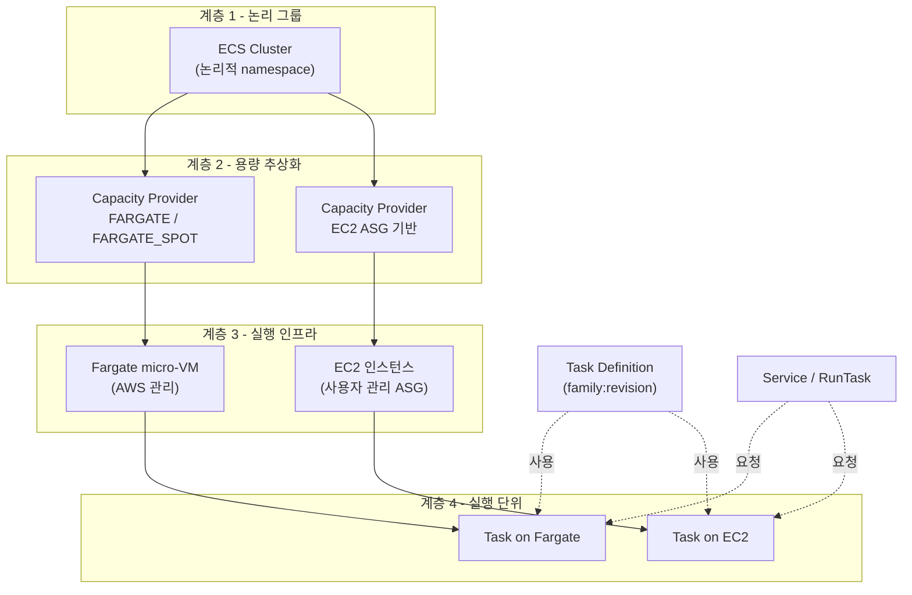
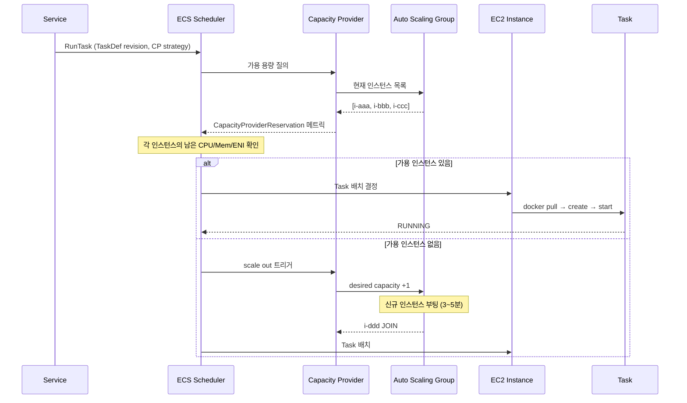
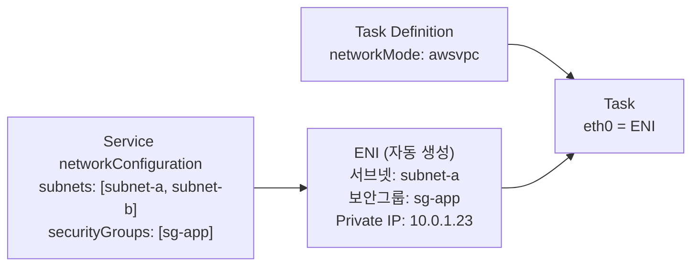
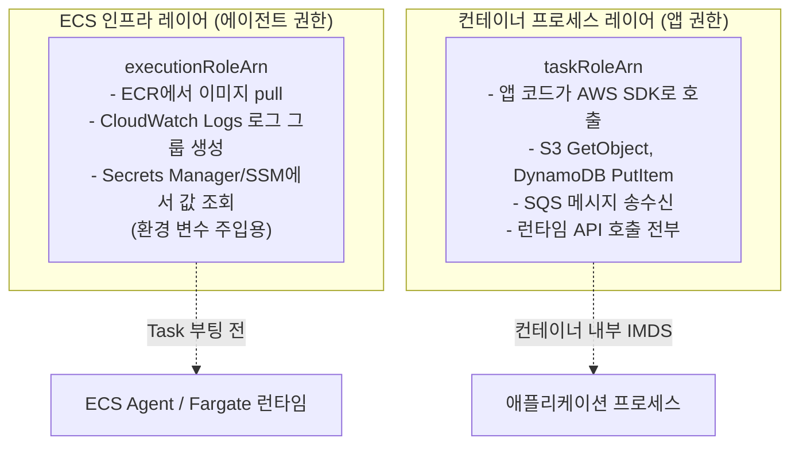
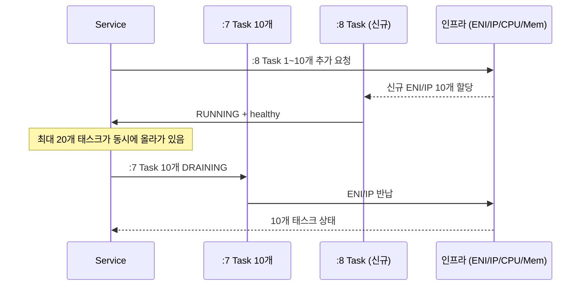

# ECS 인프라와 Task Definition의 관계

## 개요

ECS 문서를 따로따로 보면 Cluster, Capacity Provider, Task Definition, Service가 각각 다른 개념처럼 보이지만, 실제로 장애를 겪어보면 이들은 하나의 체인으로 연결돼 있다는 게 금방 드러난다. 예를 들어 Task Definition에 `cpu: 2048`을 썼는데 태스크가 `PROVISIONING`에서 멈춰 있다면 문제는 Task Definition이 아니라 그 뒤의 Capacity Provider가 가진 EC2 인스턴스 용량이거나 서브넷의 가용 IP다. 반대로 ENI 부족이 떠도 원인이 인스턴스 타입일 수도 있고, awsvpc 모드 때문일 수도 있고, Trunking 설정일 수도 있다.

이 문서는 "Task Definition을 하나 등록하면 실제로 어떤 인프라 자원이 어떤 순서로 소비되는가"를 관계 중심으로 정리한다. 파라미터 의미는 [ECS Task Definition 심화](ECS_Task_Definition.md)에, Capacity Provider 내부 동작은 [ECS Capacity Providers](ECS_Capacity_Providers.md)에 따로 있으니 중복은 최소화한다.

## ECS 계층 구조

ECS의 인프라는 위에서 아래로 네 개 층이 있다.



여기서 중요한 건 Task Definition이 어느 계층에도 직접 속하지 않는다는 점이다. Task Definition은 "요구사항 명세서"일 뿐, 스스로 자원을 점유하지 않는다. 실제 자원을 쓰는 건 Task이고, 이 Task가 어떤 인프라 위에 뜨는가는 Service 또는 RunTask 호출 시점의 **launch type 또는 capacity provider strategy**가 결정한다.

이 구조 때문에 같은 Task Definition을 두 Service가 공유해도, 한쪽은 Fargate 위에서, 다른 쪽은 EC2 위에서 실행되는 상황이 가능하다. Task Definition의 `requiresCompatibilities`에 `["FARGATE", "EC2"]`를 둘 다 넣어야 하지만, 원리적으로는 문제없다.

### Cluster의 실체

Cluster는 "컴퓨팅 자원과 서비스의 집합"이라고 흔히 설명되지만, 내부적으로는 **논리적인 namespace**에 가깝다. Cluster를 생성한다고 해서 EC2 인스턴스가 뜨지는 않는다. Cluster에 Capacity Provider를 연결하고, 그 CP가 ASG나 Fargate 용량을 가리켜야 비로소 인프라가 생긴다.

클러스터가 실제로 갖고 있는 정보는 이 정도다.

- 연결된 Capacity Provider 목록과 기본 Strategy
- Container Insights 활성화 여부
- Service Connect 네임스페이스
- Execute Command 설정(SSM 기반 접속)

즉 Cluster 자체는 거의 태그 같은 존재고, 실제 인프라는 한 계층 아래에서 만들어진다. 이 사실을 알고 나면 "Cluster를 지워도 EC2 인스턴스가 남아 있다"는 당연한 결과가 이해된다. 인스턴스는 ASG가 소유하고, Cluster가 소유하는 게 아니다.

### Capacity Provider가 중간에 있는 이유

2019년 이전에는 Task를 띄울 때 `launchType`에 `FARGATE` 또는 `EC2`를 직접 지정했다. 이 방식은 "섞어 쓰기"가 안 됐다. 한 Service가 Fargate 70% + Spot 30%로 뜨는 걸 구현하려면 Service를 두 개 만들어야 했다.

Capacity Provider는 이 문제를 풀기 위해 들어간 중간 계층이다. Service는 "이 CP Strategy로 띄워줘"라고만 말하고, 실제 인스턴스 타입·ASG 매니지드 스케일링·Spot 비율은 CP가 처리한다. 덕분에 Task Definition은 CP가 어떤 인프라를 가리키는지 몰라도 된다. 이 분리 덕분에 같은 Task Definition이 dev는 FARGATE_SPOT, prod는 FARGATE + EC2 혼합으로 뜰 수 있다.

## Task Definition이 요구하는 인프라 리소스

Task Definition은 스케줄러 입장에서 보면 **자원 요청 명세(resource request spec)**다. 스케줄러가 Task를 배치할 때 확인하는 요구사항은 크게 네 가지다.

1. **CPU/메모리 용량**: `cpu`, `memory` (태스크 레벨과 컨테이너 레벨 모두)
2. **네트워크 인터페이스**: `networkMode`가 `awsvpc`면 ENI 1개 필요
3. **포트 충돌**: `bridge` 또는 `host` 모드일 때 호스트 포트 가용 여부
4. **배치 제약**: `placementConstraints`, `requiresCompatibilities`, `runtimePlatform`

스케줄러는 이 요구사항을 Capacity Provider가 제공하는 **가용 리소스 풀**과 대조한다. Fargate는 풀이 거의 무한이라 이 매칭이 거의 항상 성공하지만, EC2는 인스턴스별 남은 CPU·메모리·ENI·포트까지 따져야 해서 실패 시나리오가 훨씬 많다.

### 스케줄러의 배치 결정 흐름

EC2 launch type에서 Task 하나를 띄우는 흐름을 단계별로 보면 다음과 같다.



이 흐름에서 병목은 거의 항상 "가용 인스턴스 찾기" 단계다. 인스턴스가 CPU는 남아도 ENI가 없으면 배치 실패, ENI는 있어도 포트가 쓰여 있으면 배치 실패. 이 둘은 별개로 검사되기 때문에 `PROVISIONING` 실패 원인이 "RESOURCE:ENI"인지 "RESOURCE:PORTS"인지 이벤트 메시지로 정확히 뜬다. 이 이벤트를 읽는 게 ECS 트러블슈팅의 기본이다.

### CPU와 메모리의 요청 모델

Task Definition에서 CPU/메모리는 **태스크 레벨**과 **컨테이너 레벨** 두 곳에서 지정할 수 있다. Fargate와 EC2가 이 값을 다르게 해석한다는 게 핵심 포인트다.

Fargate에서는 태스크 레벨 `cpu`, `memory`가 필수이고 이 값이 micro-VM의 크기를 그대로 결정한다. 정해진 조합만 허용된다 — 예를 들어 `cpu: 1024`(1 vCPU)에서는 `memory`가 2048, 3072, 4096, 5120, 6144, 7168, 8192 중 하나만 가능하다. 컨테이너 레벨 `cpu`, `memory`는 Fargate에서는 선택적이고, 사이드카가 있을 때 내부 분배용으로만 쓴다.

EC2에서는 반대로 태스크 레벨 값은 선택이고, 컨테이너 레벨에서 실제 리소스 제한이 걸린다. 컨테이너 레벨에서 `memory`(hard limit)와 `memoryReservation`(soft limit) 중 적어도 하나는 있어야 한다. 이 값이 없으면 컨테이너가 인스턴스 메모리를 전부 먹을 수도 있다. 스케줄러가 인스턴스의 남은 메모리에서 빼는 값은 `memoryReservation`(있을 때) 또는 `memory`이기 때문에, 두 값을 다르게 쓰면 **오버커밋**이 가능해진다.

오버커밋은 실무에서 종종 쓰는 패턴이다. 예를 들어 평균적으로 512MB를 쓰지만 피크에 1GB까지 올라가는 워커가 있다면 `memoryReservation: 512`, `memory: 1024`로 잡는다. 스케줄러는 512MB 기준으로 배치하니 인스턴스당 태스크를 더 많이 띄울 수 있고, 실제 피크에서만 1GB까지 허용된다. 단 모든 태스크가 동시에 피크를 치면 인스턴스 OOM이 발생한다. 이건 Kubernetes의 request/limit와 정확히 같은 개념이다.

## Fargate와 EC2 launch type의 차이

같은 Task Definition이라도 Fargate로 뜨면 인프라-Task 관계가 크게 달라진다. 핵심 차이를 정리하면 이렇다.

| 항목 | Fargate | EC2 |
| --- | --- | --- |
| 실행 호스트 | micro-VM (Firecracker, 태스크 1개 전용) | EC2 인스턴스 (여러 태스크 공유) |
| 호스트 수명 | 태스크 수명과 동일 | ASG 수명 (태스크와 무관) |
| networkMode | awsvpc만 지원 | awsvpc / bridge / host / none |
| ENI | 태스크당 1개 자동 | 인스턴스 ENI 한도 공유 |
| OS/런타임 관리 | AWS가 담당 | 사용자가 AMI·ECS Agent 관리 |
| 빈 호스트 요금 | 없음 | 인스턴스 켜져 있는 동안 과금 |
| 배치 실패 원인 | 서브넷 IP, Quota | CPU/Mem/ENI/Port/인스턴스 수 |

Fargate에서 Task 하나는 하나의 전용 micro-VM을 갖는다. 이 micro-VM은 AWS가 Firecracker 위에 띄우고, Task가 종료되면 같이 사라진다. 그래서 "Task를 띄운다 = 인프라를 띄운다"가 된다. 호스트 레벨 문제(예: 커널 튜닝, 인스턴스 타입 선택)가 사라지는 대신, 호스트 내부에 붙는 사이드카(예: CloudWatch Agent, SSM Agent)를 사용자가 직접 추가할 수 없다.

EC2에서는 인스턴스가 먼저 있고, 그 위에 Task가 얹힌다. 하나의 인스턴스가 여러 Task를 호스팅하니 "이 인스턴스가 어느 Task를 갖고 있는지"를 ECS Agent가 추적한다. 인스턴스를 내릴 때 Task를 먼저 draining 처리해야 하고, 이 과정을 관리하는 게 앞서 말한 **managed termination protection**이다.

둘의 경계를 모호하게 만드는 게 `ECS Anywhere`와 `ECS on EKS`지만, 여기서는 다루지 않는다.

## networkMode와 ENI 바인딩 경로

networkMode는 Task가 네트워크 자원을 어떻게 쓰는지 결정하고, 이게 인프라 제약의 가장 큰 원인이다. 네 가지 모드별로 ENI와 서브넷·보안그룹이 어떻게 바인딩되는지 보자.

### awsvpc

Task마다 전용 ENI가 할당된다. ENI는 Task가 떠 있는 동안 해당 Task에 바인딩되고, Task가 종료되면 반납된다. ENI에는 Task Definition이 아니라 Service 또는 RunTask의 `networkConfiguration`에 지정한 **서브넷과 보안그룹**이 붙는다.



여기서 헷갈리기 쉬운 점은 Task Definition에는 서브넷/보안그룹 정보가 들어가지 않는다는 것이다. Task Definition은 "awsvpc를 쓰겠다"만 말하고, 실제 네트워크 바인딩은 Service가 한다. 그래서 같은 Task Definition을 여러 Service가 쓰면 각 Service가 다른 서브넷·보안그룹을 쓸 수 있다.

EC2 launch type에서 awsvpc를 쓰면 인스턴스당 ENI 한도 문제가 바로 생긴다. `t3.medium`은 ENI 3개 제한이고 그중 하나는 primary ENI라 Task용은 2개뿐이다. ENI Trunking(`awsvpcTrunking` account setting)을 켜면 인스턴스당 ENI 수가 인스턴스 타입별로 확장된다 — `t3.medium`은 10개, `c5.large`는 10개, `m5.xlarge`는 58개까지 늘어난다. 단 Trunking은 `Nitro` 기반 인스턴스만 지원하고 ECS Agent 1.28.1 이상이 필요하다. 자세한 제약은 [ECS ENI 제한과 Task 한계](ECS_ENI_제한과_Task_한계.md)에 정리돼 있다.

### bridge

컨테이너가 Docker의 docker0 브리지에 붙는다. 외부에서 접근하려면 `portMappings`에서 `hostPort`를 열어야 한다. `hostPort: 0`으로 두면 ECS가 32768~60999 범위에서 동적으로 포트를 할당하고, ALB Target Group이 동적 포트를 추적한다.

bridge 모드에서는 ENI 제한이 없는 대신 **포트 충돌**이 배치 실패의 주원인이 된다. 같은 인스턴스에 같은 정적 포트를 쓰는 Task 두 개는 못 올라간다. 그래서 ALB를 앞에 세우는 Service는 대부분 동적 포트를 쓴다.

bridge의 숨은 비용은 Docker NAT를 거치는 네트워크 오버헤드다. 지연이 수백 마이크로초 늘어나고, 연결 수가 많으면 conntrack 테이블이 차서 `nf_conntrack: table full` 에러가 난다. 고트래픽 워크로드는 awsvpc로 옮기는 게 낫다.

### host

컨테이너가 호스트의 네트워크 네임스페이스를 그대로 쓴다. 포트는 컨테이너 포트 = 호스트 포트가 되고 충돌이 바로 생긴다. 같은 인스턴스에 같은 포트의 Task를 두 개 띄울 수 없다.

host 모드는 거의 쓰지 않는다. 레거시 앱이 특정 포트에 고정되어 있거나, DPDK 같은 커널 수준 네트워킹이 필요한 경우에만 예외적으로 쓴다.

### none

네트워크가 완전히 격리된다. 외부 통신이 필요 없는 배치 작업(예: 로컬 파일 변환)에 쓴다. 보안 관점에서 유용하지만 현업에서 만날 일은 드물다.

## IAM 권한 경계: executionRole vs taskRole

Task Definition의 IAM 관련 필드는 두 개다. 이름이 비슷해서 계속 헷갈리는 부분이니 경계를 명확히 정리하자.



`executionRoleArn`은 **ECS가 Task를 준비하는 데 필요한 권한**이다. 컨테이너가 실행되기 전에, 즉 ECS Agent(EC2) 또는 Fargate 런타임이 이미지를 pull하고 로그 그룹을 만들고 Secrets Manager에서 값을 읽어 환경 변수로 주입하는 단계에서 쓰인다. 컨테이너 안의 코드는 이 권한에 접근하지 못한다.

`taskRoleArn`은 **컨테이너 안에서 실행되는 애플리케이션 프로세스의 권한**이다. AWS SDK가 Task Metadata 엔드포인트(`169.254.170.2/v2/credentials/...`)에서 임시 자격 증명을 받아오는데, 이 자격 증명이 taskRoleArn에 해당한다.

이 경계가 모호해지는 순간 실수가 시작된다. 대표적인 케이스 몇 가지.

- **executionRole에 S3 권한 넣기**: 앱이 S3에 못 붙는다고 executionRole에 `s3:GetObject`를 추가하는 실수를 자주 본다. 앱 프로세스는 executionRole을 쓰지 않으므로 아무 효과가 없다. taskRole에 넣어야 한다.
- **taskRole에 ECR 권한 넣기**: 반대로 taskRole에 `ecr:GetAuthorizationToken`을 넣는 경우가 있다. 이미지 pull은 taskRole이 아니라 executionRole이 한다. Task가 `CannotPullContainerError`를 내면 executionRole을 확인해야 한다.
- **Secrets Manager 권한 분리 실패**: Task Definition의 `secrets` 필드로 환경 변수를 주입하는 경우, 값을 읽는 주체는 ECS Agent이지 앱이 아니다. 따라서 executionRole에 `secretsmanager:GetSecretValue`가 필요하다. 앱이 런타임에 SDK로 직접 읽는다면 taskRole에도 필요하다. 둘 다 필요한 경우가 흔하다.

Fargate와 EC2에서 이 권한 경계의 물리적 위치가 약간 다르다. EC2에서는 executionRole이 **ECS Agent**에 위임되고, Agent는 인스턴스 프로파일과 executionRole 중 어느 쪽을 쓸지 선택한다. Fargate에서는 Agent가 없고 Fargate 런타임이 executionRole을 직접 assume한다. 결과는 같지만 디버깅할 때 다른 곳을 봐야 한다.

### 인스턴스 프로파일과의 관계

EC2 launch type에는 한 개 더 있는 권한이 있다. **인스턴스 프로파일(Instance Profile)** — ECS Agent가 클러스터에 등록하고 CloudWatch로 메트릭을 보낼 때 쓰는 권한이다. `AmazonEC2ContainerServiceforEC2Role` 관리형 정책이 여기 붙는다.

셋의 관계를 정리하면 이렇다.

| 권한 주체 | 역할 | 누가 쓰는가 |
| --- | --- | --- |
| Instance Profile | ECS Agent가 클러스터 등록·하트비트 | Agent (EC2만) |
| executionRole | Task 부팅 준비 (pull, logs, secrets 주입) | Agent 또는 Fargate 런타임 |
| taskRole | 앱 코드의 AWS API 호출 | 컨테이너 프로세스 |

Fargate는 Instance Profile이 없다. executionRole과 taskRole만 있다.

## 서비스 디스커버리: Cloud Map과 Service Connect

ECS Task는 Auto Scaling으로 인해 IP가 자주 바뀐다. 그래서 Service-to-Service 통신을 IP로 박아두면 곧바로 깨진다. ECS는 두 가지 디스커버리 메커니즘을 제공한다 — **AWS Cloud Map(서비스 디스커버리)**과 **Service Connect**다. 둘 다 같은 문제를 풀지만 동작 방식이 다르다.

### Cloud Map 기반 서비스 디스커버리

Cloud Map은 Route 53 Private Hosted Zone을 백엔드로 쓰는 디스커버리다. ECS Service가 Task를 띄울 때마다 Task의 ENI IP를 A 레코드로 등록하고, Task가 죽으면 레코드를 제거한다. 클라이언트는 `api.internal.example.local` 같은 도메인을 DNS 조회해서 IP 목록을 받는다.

```bash
aws servicediscovery create-private-dns-namespace \
  --name internal.example.local \
  --vpc vpc-0abc1234

aws servicediscovery create-service \
  --name api \
  --dns-config "NamespaceId=ns-xxxx,DnsRecords=[{Type=A,TTL=10}],RoutingPolicy=MULTIVALUE" \
  --health-check-custom-config FailureThreshold=1
```

Service 생성 시 `serviceRegistries`에 위 Cloud Map Service를 연결한다.

```json
{
  "serviceName": "api-service",
  "taskDefinition": "api:42",
  "desiredCount": 4,
  "launchType": "FARGATE",
  "networkConfiguration": {
    "awsvpcConfiguration": {
      "subnets": ["subnet-aaa", "subnet-bbb"],
      "securityGroups": ["sg-app"],
      "assignPublicIp": "DISABLED"
    }
  },
  "serviceRegistries": [
    {
      "registryArn": "arn:aws:servicediscovery:ap-northeast-2:111122223333:service/srv-xxxx"
    }
  ]
}
```

이 방식의 약점은 **DNS 캐싱**이다. Task가 죽어도 클라이언트의 DNS 리졸버나 JVM 같은 플랫폼이 IP를 캐싱해두면 죽은 Task로 계속 요청을 보낸다. Java는 기본 `networkaddress.cache.ttl`이 무한대(`-1`)에 가까운 적도 있어서, ECS 환경에서는 반드시 30초 이하로 낮춰야 한다.

```java
// JVM 시작 옵션 또는 java.security 파일
networkaddress.cache.ttl=10
networkaddress.cache.negative.ttl=0
```

또 하나, MULTIVALUE 라우팅은 한 번에 최대 8개 IP만 반환한다. desiredCount가 50인 Service라도 클라이언트는 8개 후보만 받고 그 안에서 분산한다. 클라이언트 측 로드밸런싱 라이브러리(예: gRPC `round_robin`)와 잘 맞춰야 한다.

### Service Connect (2022 이후)

Service Connect는 Cloud Map의 한계를 보완하기 위해 나왔다. 각 Task에 **Envoy 프록시 사이드카**를 자동으로 끼워넣고, 클라이언트가 짧은 도메인(`api`)으로 호출하면 프록시가 헬시한 인스턴스로 라우팅한다. DNS 캐싱이 끼어들 자리가 없고 L7 메트릭(요청 수, 지연, 5xx)이 자동으로 CloudWatch에 찍힌다.

```json
{
  "serviceName": "api-service",
  "taskDefinition": "api:42",
  "serviceConnectConfiguration": {
    "enabled": true,
    "namespace": "prod",
    "services": [
      {
        "portName": "http",
        "discoveryName": "api",
        "clientAliases": [
          { "port": 8080, "dnsName": "api" }
        ]
      }
    ]
  }
}
```

Task Definition 쪽에는 `portMappings`에 `name`을 추가해야 한다.

```json
"portMappings": [
  { "name": "http", "containerPort": 8080, "protocol": "tcp" }
]
```

Service Connect의 비용은 Envoy 사이드카가 Task당 약 64MB 메모리와 약간의 CPU를 더 먹는다는 점이다. 메모리가 빠듯한 Task Definition이면 `memory`를 올려야 한다. 그리고 namespace는 클러스터 단위가 아니라 **Cloud Map namespace 단위**라서, 여러 클러스터의 Service가 같은 namespace를 공유할 수 있다. 이 점이 Cloud Map과 Service Connect의 경계가 모호한 이유다 — Service Connect도 내부적으로는 Cloud Map을 쓴다.

실무에서는 신규 마이크로서비스 통신은 Service Connect로 깔고, 외부 접근(인터넷, 다른 VPC)은 ALB로 분리하는 패턴이 흔하다. 자세한 비교는 [ECS Service Connect](ECS_Service_Connect.md)에 따로 있다.

## ALB와 ECS Service 연동

외부 트래픽을 받는 Service는 보통 ALB 뒤에 둔다. ALB와 ECS의 연결 지점은 **Target Group**이고, 이 Target Group의 종류가 launch type과 networkMode에 따라 달라진다.

### Target Group의 두 가지 모드

ALB Target Group의 `targetType`은 ECS에서 두 값 중 하나를 쓴다.

| targetType | 사용 케이스 | 등록되는 대상 |
| --- | --- | --- |
| `ip` | awsvpc 모드 (Fargate 또는 EC2) | Task의 ENI IP |
| `instance` | bridge 또는 host 모드 | EC2 인스턴스 ID + 호스트 포트 |

awsvpc Task는 Task마다 고유 IP가 있어서 Target Group이 IP를 직접 추적한다. bridge 모드는 같은 인스턴스에서 여러 Task가 다른 호스트 포트(동적 포트)로 떠 있으니 인스턴스 ID + 포트 조합으로 추적해야 한다.

### awsvpc + IP 타입 Target Group

```bash
aws elbv2 create-target-group \
  --name api-tg \
  --protocol HTTP \
  --port 8080 \
  --vpc-id vpc-0abc1234 \
  --target-type ip \
  --health-check-path /health \
  --health-check-interval-seconds 15 \
  --healthy-threshold-count 2 \
  --unhealthy-threshold-count 3 \
  --deregistration-delay.timeout_seconds 30
```

Service 정의에서 `loadBalancers`로 Target Group을 묶는다.

```json
{
  "serviceName": "api-service",
  "taskDefinition": "api:42",
  "desiredCount": 4,
  "launchType": "FARGATE",
  "loadBalancers": [
    {
      "targetGroupArn": "arn:aws:elasticloadbalancing:...:targetgroup/api-tg/abc",
      "containerName": "api",
      "containerPort": 8080
    }
  ],
  "healthCheckGracePeriodSeconds": 60,
  "networkConfiguration": {
    "awsvpcConfiguration": {
      "subnets": ["subnet-aaa", "subnet-bbb"],
      "securityGroups": ["sg-app"]
    }
  }
}
```

`healthCheckGracePeriodSeconds`는 Task가 RUNNING이 된 직후 일정 시간 동안 ALB 헬스체크 실패를 무시하는 옵션이다. JVM처럼 부팅 시간이 긴 앱은 이 값을 60~120으로 둬야 첫 헬스체크 한두 번 실패로 Task가 재시작되는 사고가 안 난다.

### bridge 모드 + Instance 타입 + 동적 포트

```json
{
  "family": "legacy-api",
  "networkMode": "bridge",
  "containerDefinitions": [
    {
      "name": "api",
      "image": "111122223333.dkr.ecr.ap-northeast-2.amazonaws.com/legacy-api:1.0",
      "memory": 1024,
      "portMappings": [
        { "containerPort": 8080, "hostPort": 0, "protocol": "tcp" }
      ]
    }
  ]
}
```

`hostPort: 0`이 핵심이다. ECS Agent가 32768~60999 범위에서 포트를 동적 할당하고, ALB Target Group이 해당 인스턴스 + 포트를 자동 등록한다. 정적 포트로 두면 같은 인스턴스에 같은 Service의 Task 두 개가 못 올라간다 — 이 한계가 동적 포트의 존재 이유다.

### ALB와 ECS의 묵계: 보안그룹 체인

ALB → ECS Task 통신에서 가장 자주 막히는 게 보안그룹 설정이다. 정석은 이렇다.

```
ALB SG (sg-alb)
  Inbound:  0.0.0.0/0 :443
  Outbound: 전체 허용

Task SG (sg-app)
  Inbound:  sg-alb (소스 SG 참조) :8080
  Outbound: 전체 허용 (또는 RDS/외부 API SG로 제한)
```

Task SG의 인바운드는 IP 대역이 아니라 **ALB SG를 소스로 참조**해야 한다. ALB의 ENI IP는 가용영역마다 여러 개고 가끔 바뀌기 때문에 IP로 박으면 끊긴다. SG ID로 참조하면 ALB가 어떤 ENI를 쓰든 자동으로 반영된다.

### 경로 기반 라우팅과 Listener Rule

한 ALB에 여러 ECS Service를 연결하는 게 흔하다. Listener Rule로 경로별 분기한다.

```bash
aws elbv2 create-rule \
  --listener-arn arn:aws:elasticloadbalancing:...:listener/app/main/abc \
  --priority 100 \
  --conditions Field=path-pattern,Values='/api/*' \
  --actions Type=forward,TargetGroupArn=arn:aws:.../targetgroup/api-tg/abc

aws elbv2 create-rule \
  --listener-arn arn:aws:elasticloadbalancing:...:listener/app/main/abc \
  --priority 200 \
  --conditions Field=path-pattern,Values='/admin/*' \
  --actions Type=forward,TargetGroupArn=arn:aws:.../targetgroup/admin-tg/abc
```

Listener Rule은 우선순위 숫자가 낮을수록 먼저 평가된다. 새 Service를 붙일 때 `priority` 충돌을 피하려고 100단위로 띄워두는 관행이 있다. Rule 개수는 Listener당 100개 한도라 마이크로서비스가 많아지면 ALB 분리나 Service Connect로 옮겨야 한다.

## Service Auto Scaling

ECS Service의 desiredCount는 사람이 손으로 바꾸는 게 아니라 **Application Auto Scaling**이 메트릭을 보고 조정한다. 정책은 세 종류다.

### Target Tracking (가장 많이 쓴다)

CPU 50%, 메모리 70% 같은 목표값을 정하면 Auto Scaling이 그 값을 유지하려고 desiredCount를 자동 조절한다. CloudWatch 알람 두 개(스케일 아웃용, 스케일 인용)가 자동으로 만들어진다.

```bash
aws application-autoscaling register-scalable-target \
  --service-namespace ecs \
  --resource-id service/prod-cluster/api-service \
  --scalable-dimension ecs:service:DesiredCount \
  --min-capacity 4 \
  --max-capacity 40

aws application-autoscaling put-scaling-policy \
  --policy-name api-cpu-target \
  --service-namespace ecs \
  --resource-id service/prod-cluster/api-service \
  --scalable-dimension ecs:service:DesiredCount \
  --policy-type TargetTrackingScaling \
  --target-tracking-scaling-policy-configuration '{
    "TargetValue": 50.0,
    "PredefinedMetricSpecification": {
      "PredefinedMetricType": "ECSServiceAverageCPUUtilization"
    },
    "ScaleInCooldown": 300,
    "ScaleOutCooldown": 60
  }'
```

`ScaleOutCooldown`은 짧게(60초), `ScaleInCooldown`은 길게(300초) 두는 게 보통이다. 트래픽 폭주에는 빨리 대응하고, 가라앉을 때는 천천히 줄여야 진동이 안 생긴다.

Target Tracking의 함정 하나 — CPU 평균을 메트릭으로 쓰면 짧은 스파이크에는 둔감하다. 5분 평균이라 30초짜리 스파이크는 잡히지 않는다. P99 latency나 ALB의 `RequestCountPerTarget`을 쓰는 게 더 정확하다.

```bash
aws application-autoscaling put-scaling-policy \
  --policy-name api-rcpt \
  --policy-type TargetTrackingScaling \
  --target-tracking-scaling-policy-configuration '{
    "TargetValue": 1000.0,
    "PredefinedMetricSpecification": {
      "PredefinedMetricType": "ALBRequestCountPerTarget",
      "ResourceLabel": "app/main-alb/abc/targetgroup/api-tg/def"
    }
  }'
```

`RequestCountPerTarget`은 1분 단위라 반응이 빠르다. Task당 처리 가능한 RPS를 미리 측정해서 그 80% 정도를 목표값으로 잡는다.

### Step Scaling (세밀한 제어)

CPU 70% 넘으면 +2개, 90% 넘으면 +5개처럼 단계별 스케일링이 필요하면 Step Scaling을 쓴다. CloudWatch 알람을 직접 만들고 단계별 조정량을 정의한다.

```bash
aws application-autoscaling put-scaling-policy \
  --policy-name api-step-out \
  --service-namespace ecs \
  --resource-id service/prod-cluster/api-service \
  --scalable-dimension ecs:service:DesiredCount \
  --policy-type StepScaling \
  --step-scaling-policy-configuration '{
    "AdjustmentType": "ChangeInCapacity",
    "MetricAggregationType": "Average",
    "Cooldown": 60,
    "StepAdjustments": [
      { "MetricIntervalLowerBound": 0,  "MetricIntervalUpperBound": 20, "ScalingAdjustment": 2 },
      { "MetricIntervalLowerBound": 20, "ScalingAdjustment": 5 }
    ]
  }'
```

Target Tracking이 알아서 잘 해주니 Step Scaling은 점점 덜 쓰이지만, 비대칭 스케일링(스케일 아웃은 공격적, 스케일 인은 보수적)이 필요할 때 여전히 유효하다.

### Scheduled Scaling (예측 가능한 트래픽)

광고 캠페인이 매일 9시에 시작되거나, 주말이 평일보다 트래픽이 많은 패턴이 있으면 시간 기반 스케일링이 가장 정확하다.

```bash
aws application-autoscaling put-scheduled-action \
  --service-namespace ecs \
  --resource-id service/prod-cluster/api-service \
  --scalable-dimension ecs:service:DesiredCount \
  --scheduled-action-name morning-rush \
  --schedule "cron(50 8 * * ? *)" \
  --timezone "Asia/Seoul" \
  --scalable-target-action MinCapacity=20,MaxCapacity=80
```

이 스케줄은 매일 8시 50분에 minCapacity를 20으로 올린다. 9시 정각 트래픽이 들이닥치기 전에 워밍업이 끝나도록 10분 앞당겼다. Target Tracking과 Scheduled를 함께 걸어두면 시간 기반으로 바닥선을 올리고, 그 위에서 Target Tracking이 돌면서 미세 조정한다.

### 스케일 아웃이 빨리 안 되는 진짜 이유

"Auto Scaling을 켰는데도 트래픽 급증에 못 따라온다"는 호소는 흔하다. 원인은 거의 단일하지 않다. 체인을 따라가면 다음 지연이 누적된다.

1. CloudWatch 메트릭 발행 지연 (ECS 메트릭은 보통 1분 단위)
2. 알람 평가 주기 (기본 1분, 평가 기간 3개)
3. Step/Target Tracking 결정
4. ECS가 Task 추가 요청
5. (EC2면) Capacity Provider가 ASG에 desired +N
6. EC2 인스턴스 부팅(3~5분) 또는 Fargate ENI 할당(30초~1분)
7. Task의 컨테이너 부팅 + 헬스체크 통과

총합 5~10분이 흔하다. 그래서 트래픽 패턴을 미리 알 수 있다면 Scheduled Scaling으로 바닥을 깔아두는 게 가장 확실하다. 자세한 정책 튜닝은 [ECS Service Auto Scaling](ECS_Service_Auto_Scaling.md)에 있다.

## 실무 트러블슈팅

현업에서 "Task가 안 뜬다"는 보고를 받으면 대부분 아래 네 가지 중 하나다. ECS Service 이벤트(`describe-services` → `events[]`)에 원인이 직접 찍히므로 가장 먼저 이걸 읽어야 한다.

### RESOURCE:MEMORY / RESOURCE:CPU

EC2 launch type에서 스케줄러가 태스크 요청을 받았는데 어떤 인스턴스에도 충분한 메모리 또는 CPU가 없을 때 뜬다. 이벤트 메시지는 이렇다.

```
service api-service was unable to place a task because no container instance
met all of its requirements. The closest matching container-instance i-0abc...
has insufficient memory available. For more information, see the Troubleshooting
section.
```

원인 후보는 세 가지다.

첫 번째, ASG의 desired capacity가 너무 낮다. managed scaling이 켜져 있다면 Capacity Provider Reservation 메트릭이 제대로 동작하는지 확인한다. CW 알람이 멈춰 있거나 `instanceWarmupPeriod`가 너무 길어서 스케일 아웃이 지연될 수 있다.

두 번째, 인스턴스 타입이 Task Definition의 요구사항보다 작다. Task가 `memory: 4096`을 요구하는데 인스턴스가 `t3.small`(메모리 2GB)면 영원히 배치되지 않는다. managed scaling은 인스턴스를 더 많이 띄울 뿐, 타입을 바꾸지 않는다.

세 번째, 다른 Task들이 이미 자리를 차지하고 있다. `describe-container-instances`로 각 인스턴스의 `remainingResources`를 확인한다. 오버커밋을 너무 공격적으로 잡아서 `memoryReservation`은 남아도 실제 메모리가 부족한 경우도 있다.

### RESOURCE:ENI

awsvpc 모드에서 ENI 슬롯이 고갈됐을 때 뜬다.

```
service api-service was unable to place a task. Reason: RESOURCE:ENI.
```

인스턴스 타입별 ENI 한도를 확인한다. `t3.medium`이면 Task용 ENI가 2개뿐이고, ENI Trunking을 켜야 10개로 늘어난다. Trunking을 켰는데도 안 늘어나면 account setting과 IAM 서비스 연결 역할(`AWSServiceRoleForECS`)에 `ec2:AssignPrivateIpAddresses`, `ec2:UnassignPrivateIpAddresses`가 있는지 확인한다.

Fargate에서는 이 에러가 뜨지 않는다. Fargate의 ENI 공급은 계정 수준 Quota로 제한되며, 이건 다음 케이스로 이어진다.

### Fargate ENI/서브넷 IP 고갈

Fargate Task는 서브넷 IP를 하나씩 소비한다. `/24` 서브넷(256개 IP 중 예약 제외하면 약 251개)에 Task를 300개 띄우려 하면 절대 안 뜬다. 이벤트 메시지는 이렇게 나온다.

```
RESOURCE:ENI / CannotCreateNetworkInterface: Subnet has insufficient free
addresses to create the ENI.
```

해결책은 Service `networkConfiguration.subnets`에 서브넷을 여러 개 넣어서 분산하거나, 더 큰 서브넷(예: `/22`)을 새로 만들어 쓰는 것이다. 실무에서 이미 쓰는 서브넷의 IP가 바닥나면 새 서브넷을 추가로 매핑하는 쪽이 현실적이다. VPC의 CIDR 블록 추가가 필요할 수도 있다.

한 가지 더 주의할 점: Task가 종료되면 ENI가 즉시 반납되지 않는다. Fargate가 평균 1~5분 정도 딜레이를 두고 ENI를 삭제한다. 그래서 Spot 대량 회수 + 재배치가 동시에 일어나면 "서브넷 IP는 표면적으로 남지만 실제로는 ENI가 아직 살아 있어서 신규 Task가 못 뜨는" 현상이 생긴다. `describe-network-interfaces`로 `status: available`이 비정상적으로 많은지 확인하면 된다.

### RESOURCE:PORTS

bridge 또는 host 모드에서 `hostPort`가 충돌할 때 뜬다. 동적 포트를 쓰면 거의 안 나오지만, 정적 포트로 고정해놓은 구형 설정에서 보인다. 같은 인스턴스에 이미 같은 포트를 쓰는 Task가 있거나, 호스트의 다른 프로세스(예: CloudWatch Agent)가 포트를 쓰고 있다. 해결은 `hostPort: 0`으로 바꾸거나 다른 정적 포트로 옮기는 것이다.

### Task가 RUNNING인데 ALB에서 unhealthy

배치는 됐지만 타겟 그룹 헬스체크가 실패하는 케이스. 이건 인프라-Task 관계의 경계에서 자주 생긴다. 확인 순서는 이렇다.

1. Task의 ENI에 붙은 **보안그룹**이 ALB 보안그룹으로부터 컨테이너 포트 인바운드를 허용하는가.
2. 서브넷의 **NACL**이 차단하지 않는가.
3. Task Definition의 `portMappings.containerPort`와 ALB Target Group의 포트가 일치하는가 (awsvpc는 containerPort = hostPort).
4. 헬스체크 경로가 앱이 실제로 200을 돌려주는 경로인가.
5. Task의 `healthCheck`가 실패해서 ECS가 자체적으로 UNHEALTHY로 판단했는가 (Task 이벤트 확인).

1번과 2번은 Task Definition이 아니라 Service의 `networkConfiguration`과 VPC 설정 문제다. 그런데 증상은 "Task가 계속 죽고 뜬다"로 나타나니 Task Definition을 먼저 의심하게 된다. 경계를 기억하고 있으면 시간을 아낀다.

## Task Definition revision 변경이 인프라에 미치는 영향

Task Definition revision을 올리는 건 단순히 JSON 버전을 바꾸는 게 아니다. Service가 새 revision을 참조하는 순간 인프라 레이어에서 일어나는 일은 많다.

### Rolling Update의 단계별 자원 점유

`minimumHealthyPercent: 100`, `maximumPercent: 200`, `desiredCount: 10` 상태에서 Service가 revision을 `:7`에서 `:8`로 올리면 다음이 순차 발생한다.



이 과정에서 인프라는 **최대 20개 분량의 자원을 동시에 점유**한다. 서브넷 IP가 빠듯하면 여기서 터진다. `/24` 서브넷에 desiredCount 200을 돌리는 Service를 배포하면, 배포 순간 400개 IP를 요구하니 서브넷이 감당하지 못한다. 배포 때만 터지고 평상시에는 멀쩡하게 돌아가는 이유가 이것이다.

deploymentConfiguration은 Service 정의에서 다음처럼 잡는다.

```json
{
  "serviceName": "api-service",
  "taskDefinition": "api:42",
  "desiredCount": 10,
  "deploymentController": { "type": "ECS" },
  "deploymentConfiguration": {
    "minimumHealthyPercent": 100,
    "maximumPercent": 200,
    "deploymentCircuitBreaker": {
      "enable": true,
      "rollback": true
    }
  }
}
```

`deploymentCircuitBreaker`는 새 revision의 Task가 일정 횟수 연속 실패하면 자동으로 이전 revision으로 되돌린다. 임계값은 desiredCount에 따라 자동 계산된다(대략 10% 또는 최소 10회). 이 옵션은 무조건 켜두는 게 좋다 — 새벽 배포에서 Task가 무한 재시작 루프를 도는 사고를 한 번이라도 겪었다면 안 켤 이유가 없다.

대책은 세 가지다.

첫째, `maximumPercent`를 100~125로 낮춘다. 대신 배포 중 가용 용량이 줄어서 트래픽 급증에 취약해진다.

둘째, `minimumHealthyPercent`를 50으로 낮춘다. 기존 Task를 먼저 절반 죽이고 새 Task를 띄우는 방식이라 자원 피크가 낮아지지만, 순간 가용 용량이 50%로 줄어든다.

셋째, 서브넷을 더 크게 만들거나 추가 서브넷을 Service에 엮는다. 가장 근본적인 해결이다.

### Draining의 진짜 의미

`:7` Task가 `DRAINING`에 들어가면 다음이 일어난다. 이 순서를 오해하면 서비스 중단을 겪는다.

1. ECS가 ALB Target Group에 deregister 요청을 보낸다.
2. ALB는 해당 타겟을 `draining` 상태로 바꾸고 새 요청을 더는 보내지 않는다. 단 **진행 중인 요청은 계속 처리**된다.
3. `deregistration_delay.timeout_seconds`(기본 300초)가 지나면 ALB가 타겟을 완전히 제거한다.
4. ECS가 컨테이너에 SIGTERM을 보낸다. 컨테이너는 `stopTimeout`(기본 30초) 안에 종료해야 한다.
5. `stopTimeout`이 지나면 SIGKILL로 강제 종료.
6. ENI가 분리되고 반납된다(Fargate면 micro-VM 자체가 사라진다).

여기서 `deregistration_delay`와 `stopTimeout`이 따로 놀면 문제가 생긴다. `deregistration_delay: 300`인데 `stopTimeout: 30`이면, ALB는 아직 draining 중인데 컨테이너가 이미 죽어서 막바지 요청이 502로 떨어진다.

실무에서는 앱에 graceful shutdown 훅을 걸어서 `SIGTERM`을 받으면 곧바로 종료하지 않고 in-flight 요청을 마무리하도록 한다. 그리고 `stopTimeout`을 `deregistration_delay`보다 약간 크게 잡는다 — `stopTimeout: 60`, `deregistration_delay: 30` 같은 조합. Fargate의 `stopTimeout` 최댓값은 120초다.

### Draining 중인 EC2 인스턴스의 보호

EC2 launch type에서 Capacity Provider managed termination protection을 켜면, Task가 draining 중인 인스턴스는 ASG가 자동으로 종료하지 못한다. ECS Agent가 인스턴스에 `scale-in protection` 플래그를 걸고, Task가 모두 빠진 뒤에만 해제한다.

이 플래그가 없으면 스케일 인 이벤트 때 ASG가 "남은 인스턴스 중 아무거나"를 골라 죽이고, 그 인스턴스 위에 있던 Task들이 예고 없이 SIGKILL당한다. managed termination protection은 대부분의 프로덕션 환경에서 켜야 하는 기본 옵션이다.

### Blue/Green 배포: CodeDeploy 연동

Rolling Update는 새 Task와 기존 Task가 같은 Target Group에 섞여 들어간다. 배포 중 사용자가 두 버전을 동시에 만난다는 뜻이다. 인터페이스 호환성이 보장되면 문제없지만, DB 스키마 변경이나 응답 포맷 변경이 끼면 깨진다. Blue/Green은 새 버전을 **별도 Target Group**에 띄워두고, 헬스체크를 통과한 뒤 ALB Listener 한 번에 트래픽을 전환한다.

Service 정의에 `deploymentController.type`을 `CODE_DEPLOY`로 바꾸면 ECS가 직접 배포를 끝내지 않고 CodeDeploy로 위임한다.

```json
{
  "serviceName": "api-service",
  "taskDefinition": "api:42",
  "desiredCount": 10,
  "deploymentController": { "type": "CODE_DEPLOY" },
  "loadBalancers": [
    {
      "targetGroupArn": "arn:aws:.../targetgroup/api-blue/abc",
      "containerName": "api",
      "containerPort": 8080
    }
  ]
}
```

Service 정의에는 Blue Target Group 하나만 들어간다. Green Target Group은 CodeDeploy DeploymentGroup에서 따로 지정한다.

```bash
aws deploy create-deployment-group \
  --application-name api-app \
  --deployment-group-name api-bg \
  --service-role-arn arn:aws:iam::111122223333:role/CodeDeployECSRole \
  --deployment-config-name CodeDeployDefault.ECSAllAtOnce \
  --ecs-services serviceName=api-service,clusterName=prod-cluster \
  --load-balancer-info '{
    "targetGroupPairInfoList": [{
      "targetGroups": [
        { "name": "api-blue" },
        { "name": "api-green" }
      ],
      "prodTrafficRoute": { "listenerArns": ["arn:aws:.../listener/abc"] },
      "testTrafficRoute": { "listenerArns": ["arn:aws:.../listener/test/def"] }
    }]
  }' \
  --blue-green-deployment-configuration '{
    "terminateBlueInstancesOnDeploymentSuccess": {
      "action": "TERMINATE",
      "terminationWaitTimeInMinutes": 30
    },
    "deploymentReadyOption": {
      "actionOnTimeout": "STOP_DEPLOYMENT",
      "waitTimeInMinutes": 60
    }
  }'
```

`prodTrafficRoute`는 실사용자 트래픽이 흐르는 ALB Listener다. `testTrafficRoute`는 별도 포트(예: 8443)에서 운영자만 접근하는 검증용 Listener다. Green Task가 떠 있는 동안 운영자가 testTrafficRoute로 사전 검증하고, 통과하면 prodTrafficRoute의 forward 대상을 Blue → Green으로 swap한다.

배포 단위는 `appspec.yaml`로 정의한다.

```yaml
version: 0.0
Resources:
  - TargetService:
      Type: AWS::ECS::Service
      Properties:
        TaskDefinition: arn:aws:ecs:ap-northeast-2:111122223333:task-definition/api:43
        LoadBalancerInfo:
          ContainerName: api
          ContainerPort: 8080
        PlatformVersion: LATEST
Hooks:
  - BeforeInstall:       arn:aws:lambda:ap-northeast-2:...:function:db-migrate
  - AfterAllowTestTraffic: arn:aws:lambda:ap-northeast-2:...:function:smoke-test
  - BeforeAllowTraffic:  arn:aws:lambda:ap-northeast-2:...:function:final-check
  - AfterAllowTraffic:   arn:aws:lambda:ap-northeast-2:...:function:notify-slack
```

각 Hook은 Lambda 함수이고, `Failed` 결과를 반환하면 CodeDeploy가 자동으로 롤백한다(prodTrafficRoute를 Blue로 되돌린다). `AfterAllowTestTraffic`에서 smoke test가 실패하면 Green Task는 그대로 남고 사용자에게는 영향이 없다 — 이게 Blue/Green의 본질적 가치다.

`terminationWaitTimeInMinutes: 30`은 트래픽 전환 후 30분 동안 Blue를 살려두는 옵션이다. 배포 후 30분 내에 문제가 발견되면 CLI 한 번으로 즉시 Blue로 되돌릴 수 있다. 30분이 지나면 Blue Task가 정리되고 다음 배포 때까지는 Rolling 수준의 롤백 비용을 다시 부담해야 한다.

Blue/Green의 인프라 비용은 명확하다 — **배포 윈도우 동안 desiredCount의 2배** 자원이 점유된다. desiredCount 100인 Service면 배포 중 200개 분량의 ENI/IP/CPU가 동시에 산다. Fargate는 빈 호스트 요금이 없어서 부담이 적지만, EC2 launch type에서 ASG 인스턴스가 부족하면 그대로 배포 실패다. 배포 정책을 Blue/Green으로 바꾸기 전에 ASG 최대 용량을 확인하는 게 순서다.

CodeDeploy의 사전 정의된 트래픽 전환 정책은 세 가지다.

| Deployment Config | 동작 |
| --- | --- |
| `ECSAllAtOnce` | 100% 트래픽 한 번에 전환 |
| `ECSLinear10PercentEvery1Minutes` | 1분마다 10%씩 점진 전환(10분 소요) |
| `ECSCanary10Percent5Minutes` | 10% 전환 후 5분 관찰 → 통과 시 90% 전환 |

`ECSCanary*`는 카나리 분량에서 5xx 메트릭이나 latency 알람이 트리거되면 자동 롤백된다. 운영 중인 마이크로서비스는 보통 `ECSLinear` 또는 `ECSCanary`를 쓰고, dev/staging은 시간 절약을 위해 `ECSAllAtOnce`를 쓴다.

자세한 배포 전략 비교는 [ECS Deployment Strategies](ECS_Deployment_Strategies.md)에 있다.

### 롤백의 인프라 비용

revision `:8`에서 장애가 나서 `:7`로 롤백하면 방금 겪은 rolling update를 역방향으로 한 번 더 한다. 즉 인프라 자원을 다시 한 번 최대 2배까지 점유한다. 배포 직후 곧바로 롤백하는 상황에서 서브넷 IP가 바닥나는 게 흔한 이유다. 배포가 실패하면 `:7`이 아직 살아 있는 상태라 `:8`만 제거되니 영향이 적지만, 배포가 성공한 뒤 `:7`이 이미 사라진 상태에서 롤백하는 건 전체 재배포와 같다.

이런 이유로 CI/CD에서 `AppSpec`의 hook을 써서 프로덕션 트래픽을 받기 전에 smoke test를 돌리고, 실패 시 즉시 이전 revision으로 전환하는 게 롤백 비용을 크게 줄인다. CodeDeploy의 blue/green 배포는 이걸 강제해주는 대신 순간 인프라를 2배로 쓴다는 트레이드오프가 있다. 자세한 배포 전략은 [ECS Deployment Strategies](ECS_Deployment_Strategies.md)에 따로 정리돼 있다.

## 정리

ECS에서 Task Definition은 선언이고, 실제 자원을 점유하는 건 Task이며, 그 Task를 얹을 인프라를 결정하는 건 Capacity Provider다. 이 삼각 관계가 흐려지면 장애 원인을 엉뚱한 곳에서 찾게 된다. 디버깅 순서는 항상 "이벤트 메시지 → 인프라 가용성 → Task Definition 설정 → IAM 권한" 순서가 정답에 가깝다. Task Definition부터 뜯어보면 대부분 시간이 더 걸린다.

관련 문서:

- [ECS 개요](ECS.md)
- [ECS Task Definition 심화](ECS_Task_Definition.md)
- [ECS Capacity Providers](ECS_Capacity_Providers.md)
- [ECS Networking Modes](ECS_Networking_Modes.md)
- [ECS ENI 제한과 Task 한계](ECS_ENI_제한과_Task_한계.md)
- [ECS IAM Role 설정](ECS_IAM_Role_설정.md)
- [ECS Service Connect](ECS_Service_Connect.md)
- [ECS Service Auto Scaling](ECS_Service_Auto_Scaling.md)
- [ECS Deployment Strategies](ECS_Deployment_Strategies.md)
