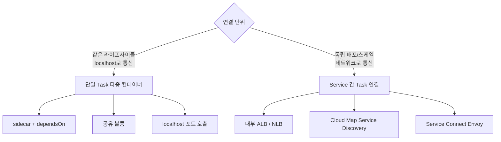
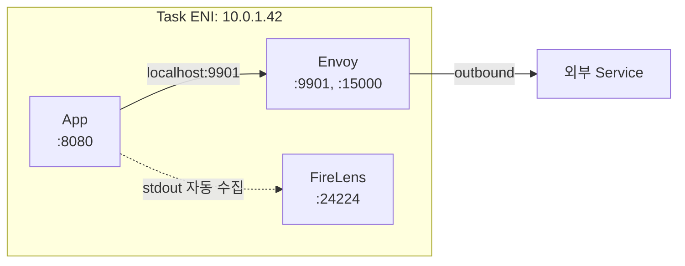
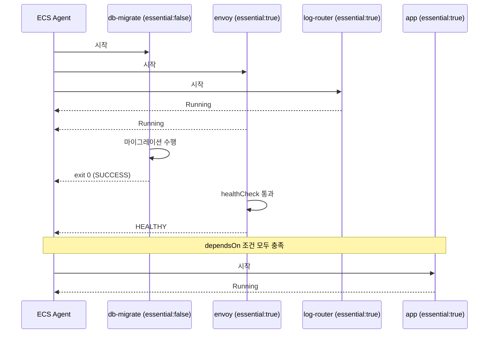
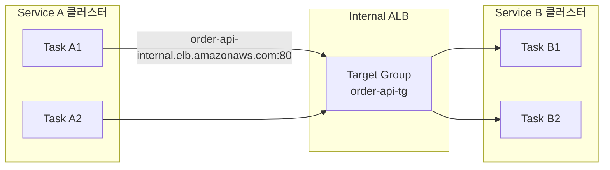
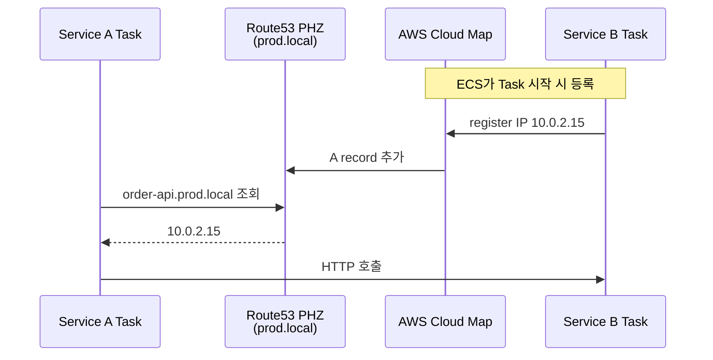
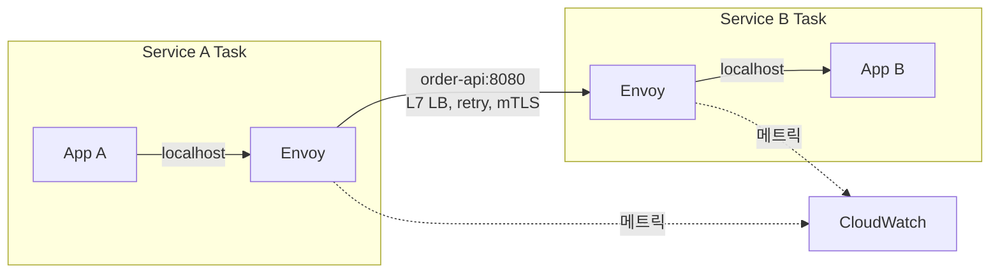
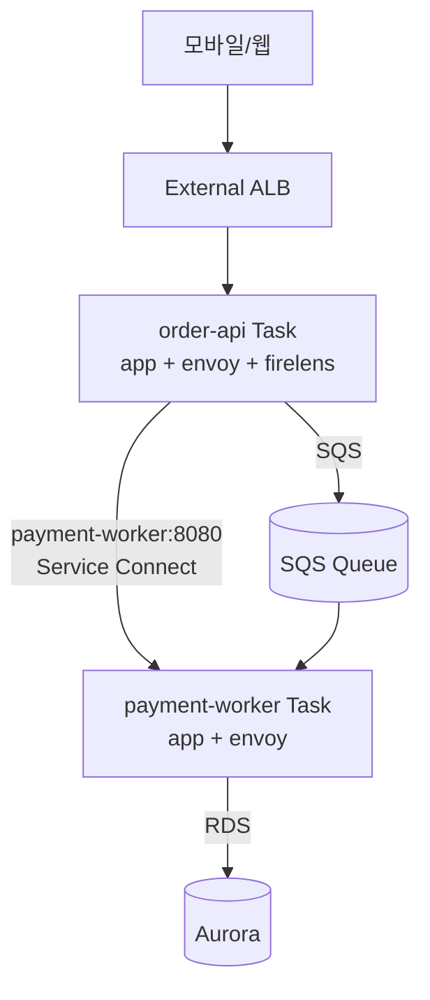

# ECS Multi Task Connection

## 개요

ECS에서 "Task를 여러 개 띄워서 서로 연결한다"는 말은 두 가지 다른 상황을 동시에 가리킨다. 하나는 **하나의 Task 안에 컨테이너 여러 개**를 묶어서 같은 네트워크 네임스페이스를 공유하는 sidecar 패턴이고, 다른 하나는 **서로 다른 Service에 속한 Task끼리** 네트워크로 호출하는 마이크로서비스 패턴이다. 둘은 격리 단위, IP 할당, 보안 그룹, 디스커버리 메커니즘이 모두 다르다.

실무에서 이 두 가지를 구분 못 하고 시작하면 이상한 구조가 나온다. 같이 죽고 같이 사는 컨테이너를 굳이 다른 Service로 분리해서 ALB로 호출하거나, 독립 배포가 필요한 모듈을 sidecar로 묶어서 한쪽 OOM이 전체를 끌어내리는 경우다. 이 문서는 "어떤 연결 방식이 어떤 상황에 맞는지"부터 정리하고, 패턴별 Task Definition / Service 설정, 보안 그룹 구성, 트러블슈팅을 다룬다.



## 단일 Task 다중 컨테이너 패턴

### 같은 Task에 묶는 기준

여러 컨테이너를 한 Task로 묶는 결정은 "같이 살고 같이 죽어도 되는가"로 갈린다. 한 Task 안의 컨테이너는 같은 호스트(EC2면 같은 인스턴스, Fargate면 같은 micro-VM)에서 같은 네트워크/IPC 네임스페이스를 공유한다. 하나가 OOM으로 죽으면 `essential: true`인 다른 컨테이너도 같이 종료되고 Task 전체가 재시작된다. 스케일도 같이 된다. 앱을 2개 띄우면 sidecar도 2개 뜬다.

이 특성이 맞는 워크로드가 sidecar의 정의다.

- **로그 수집 sidecar (FireLens, Fluent Bit)**: 앱이 죽으면 로그 수집기도 같이 죽는 게 맞다. 앱 없이 수집기만 돌아갈 이유가 없다.
- **프록시 sidecar (Envoy, AWS App Mesh, Service Connect proxy)**: 앱과 1:1로 트래픽을 처리한다.
- **인증/시크릿 갱신 sidecar (Secrets Store CSI 비슷한 역할)**: 앱이 떠 있는 동안 토큰을 주기적으로 갱신.
- **Init 컨테이너 (DB 마이그레이션, 디렉토리 준비)**: Task가 뜰 때 한 번 실행되고 종료.

반대로 다음은 **분리해야 할 신호**다. 컨테이너를 같은 Task에 넣지 마라.

- 독립적으로 스케일을 다르게 가져가야 한다 (앱 10개, 큐 워커 3개).
- 배포 주기가 다르다 (백엔드 API와 정적 파일 빌드).
- 한쪽 장애가 다른 쪽으로 번지면 안 된다 (결제와 알림 서비스).
- 리소스 프로파일이 너무 다르다 (CPU 집약 vs 메모리 집약).

### 컨테이너 간 통신 — localhost와 공유 볼륨

같은 Task 안의 컨테이너는 다음 세 가지 채널로 통신한다.

**1. localhost 포트 호출.** awsvpc 모드에서 모든 컨테이너가 같은 ENI를 공유하므로, 컨테이너 A가 8080을 listen 하면 컨테이너 B에서 `curl http://localhost:8080`으로 호출된다. bridge/host 모드에서도 같은 docker bridge나 host network를 공유하니 동일하게 동작한다. Envoy 같은 프록시가 이 방식으로 앱 트래픽을 가로챈다.



awsvpc 모드라 같은 Task 안 컨테이너끼리는 **포트 충돌**에 주의해야 한다. 앱이 8080, 사이드카가 8080을 둘 다 잡으면 둘 중 하나가 bind 실패로 죽는다. Service Connect의 Envoy는 기본적으로 9901(admin), 15000번대(listener)를 쓴다. 사내 표준 포트와 sidecar 포트가 겹치는지 처음에 한 번 확인하는 게 좋다.

**2. 공유 볼륨 (bind mount).** Task 레벨 `volumes`에 `host: {}`로 bind mount 하나를 정의하고, 두 컨테이너가 각자 다른 경로에 mount 하면 파일을 공유할 수 있다. 클래식한 사용처는 앱이 `/var/log`에 파일 로그를 쓰고 사이드카가 같은 디렉토리를 읽어 외부로 전송하는 패턴이다.

```json
{
  "volumes": [
    { "name": "shared-logs", "host": {} }
  ],
  "containerDefinitions": [
    {
      "name": "app",
      "mountPoints": [
        { "sourceVolume": "shared-logs", "containerPath": "/var/log/app" }
      ]
    },
    {
      "name": "log-shipper",
      "mountPoints": [
        { "sourceVolume": "shared-logs", "containerPath": "/logs", "readOnly": true }
      ]
    }
  ]
}
```

이 볼륨은 Task가 종료되면 사라진다. 영속성이 필요하면 EFS를 써야 한다. 요즘은 stdout 로깅 + FireLens 조합이 표준이라, 공유 볼륨으로 로그 파일을 주고받는 패턴은 레거시 앱 마이그레이션이 아니면 잘 안 쓴다.

**3. volumesFrom으로 다른 컨테이너 볼륨 통째로 빌리기.** `volumesFrom`은 명시적인 `volumes` 정의 없이도 다른 컨테이너의 볼륨 마운트를 그대로 복사한다. 짧지만 의도가 잘 안 보여서 신규 코드에는 잘 쓰지 않는 편이다.

> **links 필드는 사실상 폐기됐다.** 예전 Docker `--link` 매커니즘인데 awsvpc 모드에서는 동작하지 않고, bridge 모드에서만 의미가 있다. 더구나 Docker 자체가 이 기능을 deprecate 했다. 신규 Task Definition에서는 쓰지 마라. 같은 Task 컨테이너끼리 호출은 localhost로 충분하다.

### dependsOn으로 기동 순서 제어

같은 Task 안에서 컨테이너를 순서대로 띄워야 하는 경우가 많다. DB 마이그레이션 init이 먼저 끝나야 앱이 뜨고, Envoy가 ready여야 mesh 트래픽을 받을 수 있고, FireLens가 떠 있어야 앱 로그가 안 샌다. ECS는 `dependsOn`으로 이 순서를 보장한다.

```json
{
  "name": "app",
  "essential": true,
  "dependsOn": [
    { "containerName": "db-migrate",  "condition": "SUCCESS" },
    { "containerName": "envoy",       "condition": "HEALTHY" },
    { "containerName": "log-router",  "condition": "START" }
  ]
}
```

condition 종류와 실제 의미는 다음과 같다.

- **START**: 대상 컨테이너가 `Running` 상태가 되면 다음을 진행한다. 헬스체크 결과는 보지 않는다. 가장 약한 조건.
- **HEALTHY**: 대상 컨테이너의 `healthCheck`가 healthy 판정이 나야 한다. 프록시 사이드카 앞단으로 트래픽을 흘리려면 이 조건이 필수다.
- **COMPLETE**: 대상 컨테이너가 종료되어야 한다 (exit code 무관). init 컨테이너의 작업을 기다릴 때.
- **SUCCESS**: 대상 컨테이너가 exit code 0으로 종료되어야 한다. 마이그레이션이 실패하면 앱도 안 뜬다.

`SUCCESS`/`COMPLETE`로 의존하는 init 컨테이너는 반드시 `essential: false`로 두어야 한다. essential인 컨테이너가 종료되면 ECS는 그것을 "Task 실패"로 해석해서 전체를 재기동한다. init이 essential이면 정상 종료된 순간 무한 재시작 루프에 빠진다.



### 단일 Task 다중 컨테이너 — 실전 예제

API 서버 + Envoy 사이드카 + FireLens 로그 라우터 + DB 마이그레이션 init으로 구성된 Fargate Task. Task 자원 1024 vCPU / 2048 MiB를 컨테이너 간에 나눈다.

```json
{
  "family": "order-api",
  "networkMode": "awsvpc",
  "requiresCompatibilities": ["FARGATE"],
  "cpu": "1024",
  "memory": "2048",
  "executionRoleArn": "arn:aws:iam::123456789012:role/ecsTaskExecutionRole",
  "taskRoleArn": "arn:aws:iam::123456789012:role/order-api-role",
  "volumes": [
    { "name": "envoy-config", "host": {} }
  ],
  "containerDefinitions": [
    {
      "name": "db-migrate",
      "image": "123456789012.dkr.ecr.ap-northeast-2.amazonaws.com/order:v1.4.2",
      "essential": false,
      "command": ["./bin/migrate"],
      "secrets": [
        { "name": "DATABASE_URL", "valueFrom": "arn:aws:secretsmanager:...:secret:prod/order-db:url::" }
      ]
    },
    {
      "name": "log-router",
      "image": "public.ecr.aws/aws-observability/aws-for-fluent-bit:stable",
      "essential": true,
      "firelensConfiguration": { "type": "fluentbit" },
      "memoryReservation": 128
    },
    {
      "name": "envoy",
      "image": "public.ecr.aws/appmesh/aws-appmesh-envoy:v1.29.x-prod",
      "essential": true,
      "user": "1337",
      "portMappings": [{ "containerPort": 9901, "protocol": "tcp" }],
      "healthCheck": {
        "command": ["CMD-SHELL", "curl -s http://localhost:9901/server_info | grep -q LIVE"],
        "interval": 5, "timeout": 2, "retries": 3, "startPeriod": 10
      },
      "logConfiguration": {
        "logDriver": "awsfirelens",
        "options": { "Name": "cloudwatch_logs", "log_group_name": "/ecs/order-api", "log_stream_prefix": "envoy-" }
      }
    },
    {
      "name": "app",
      "image": "123456789012.dkr.ecr.ap-northeast-2.amazonaws.com/order:v1.4.2",
      "essential": true,
      "cpu": 768,
      "memory": 1536,
      "portMappings": [{ "containerPort": 8080, "protocol": "tcp" }],
      "dependsOn": [
        { "containerName": "db-migrate", "condition": "SUCCESS" },
        { "containerName": "envoy",      "condition": "HEALTHY" },
        { "containerName": "log-router", "condition": "START" }
      ],
      "stopTimeout": 90,
      "environment": [
        { "name": "ENVOY_ADMIN", "value": "http://localhost:9901" }
      ],
      "healthCheck": {
        "command": ["CMD-SHELL", "curl -f http://localhost:8080/health || exit 1"],
        "interval": 30, "timeout": 5, "retries": 3, "startPeriod": 120
      },
      "logConfiguration": {
        "logDriver": "awsfirelens",
        "options": { "Name": "cloudwatch_logs", "log_group_name": "/ecs/order-api", "log_stream_prefix": "app-" }
      }
    }
  ]
}
```

이 구성에서 주의할 점.

- 앱은 `localhost:9901`로 Envoy admin을 접근하고, outbound 트래픽은 Envoy listener 포트(통상 15000번대)로 흘려보낸다.
- 모든 essential 컨테이너의 합산 메모리 사용량이 Task memory 2048MiB를 넘지 않도록 컨테이너 레벨 hard limit을 설정한다. 앱 1536, Envoy ~256, log-router ~128을 잡고 약간 여유를 둔다.
- Fargate에서 `awsfirelens` 드라이버를 쓰려면 `log-router` 컨테이너가 `firelensConfiguration`을 가지고 있어야 한다. 이 컨테이너가 떠 있어야 다른 컨테이너의 로그가 라우팅된다. dependsOn에서 `START`만 걸어두는 이유는, Fluent Bit는 startup이 거의 즉시라 추가 healthCheck를 안 걸어도 되기 때문이다.

## Service 간 Task 연결 패턴

여기서부터는 다른 Service에 속한 Task끼리 호출하는 이야기다. 각 Service는 독립적으로 배포되고 스케일된다. Task 한 개가 죽어도 다른 Service에 영향이 없어야 한다. 같은 Task 안 컨테이너처럼 localhost로 부를 수 없으니 네트워크 디스커버리가 필요해진다.

선택지는 크게 셋이다.

| 방식 | 디스커버리 | 로드밸런싱 | 추가 비용 | 적합한 경우 |
|------|-----------|-----------|---------|-----------|
| 내부 ALB / NLB | DNS (LB 엔드포인트) | LB가 처리 | LB 시간당 + LCU | 안정적·검증된 구조, L7 라우팅, WAF 필요 |
| Cloud Map Service Discovery | Route 53 PHZ DNS | 클라이언트 DNS 라운드로빈 | Cloud Map 등록 비용(소액) | 단순한 내부 호출, LB 없이 가볍게 |
| Service Connect | Envoy proxy + 내부 DNS | Envoy L7 (least-request 등) | Envoy sidecar 리소스 | 신규 마이크로서비스, 메트릭/재시도/mTLS 필요 |

### 내부 ALB / NLB 패턴

가장 보수적이고 가장 흔한 선택이다. Service에 내부 ALB(`Scheme: internal`)를 붙이고 다른 Service는 ALB DNS 이름으로 호출한다.



**장점.**
- L7 라우팅(host/path), HTTP 헤더 기반 라우팅, 가중치 기반 카나리 배포가 가능하다.
- ALB가 헬스체크와 deregistration delay를 알아서 처리해준다. Task가 종료될 때 in-flight 요청을 끝까지 처리할 시간을 준다.
- WAF, AWS Shield 같은 보안 서비스 연동이 자연스럽다.
- 다른 AWS 서비스(API Gateway, AppMesh 등)와 통합하기 쉽다.

**단점.**
- LB 자체 비용. ALB는 시간당 $0.0225 + LCU 단위 과금. 내부 호출에도 그대로 붙는다.
- 트래픽이 LB를 한 번 거쳐서 레이턴시가 1~2ms 추가된다. p99에 민감한 서비스는 의식해야 한다.
- 매 Service마다 ALB를 따로 둘 거냐, 하나의 ALB에 host/path-based로 합칠 거냐 결정이 필요하다. 후자는 비용은 절약되지만 Service 팀 간 ALB 설정 충돌이 생긴다.

NLB(L4)는 ALB 대신 쓰는 경우가 있다. gRPC를 정통으로 굴리거나(예전엔 ALB가 gRPC를 잘 못 다뤘는데 지금은 지원), TCP 프로토콜 그대로 통과시키거나, 정적 IP가 필요할 때다. 일반 HTTP 마이크로서비스는 ALB가 답이다.

**Service 정의에서 ALB 연결.**

```json
{
  "serviceName": "order-api",
  "taskDefinition": "order-api:23",
  "desiredCount": 4,
  "launchType": "FARGATE",
  "loadBalancers": [
    {
      "targetGroupArn": "arn:aws:elasticloadbalancing:ap-northeast-2:...:targetgroup/order-api-tg/abc123",
      "containerName": "app",
      "containerPort": 8080
    }
  ],
  "networkConfiguration": {
    "awsvpcConfiguration": {
      "subnets": ["subnet-priv-a", "subnet-priv-b"],
      "securityGroups": ["sg-order-api-task"],
      "assignPublicIp": "DISABLED"
    }
  },
  "healthCheckGracePeriodSeconds": 120,
  "deploymentConfiguration": {
    "minimumHealthyPercent": 100,
    "maximumPercent": 200,
    "deploymentCircuitBreaker": { "enable": true, "rollback": true }
  }
}
```

awsvpc 모드라 Target Group은 IP 타입이어야 한다. instance 타입은 트래픽이 인스턴스 ENI로 가서 awsvpc Task에 도달하지 못한다. `healthCheckGracePeriodSeconds`는 새 Task가 ALB 헬스체크를 통과할 시간을 벌어준다. Spring Boot처럼 부팅이 긴 앱은 120초 이상 권장.

### Cloud Map Service Discovery 패턴

Cloud Map은 Route 53 Private Hosted Zone과 DNS API를 결합한 서비스 디스커버리 시스템이다. ECS Service에 등록하면 Task가 뜰 때마다 Cloud Map에 IP가 자동 등록되고, 클라이언트는 `service-name.namespace.local` 같은 DNS로 호출한다.



**Service 정의.**

```json
{
  "serviceName": "order-api",
  "serviceRegistries": [
    {
      "registryArn": "arn:aws:servicediscovery:ap-northeast-2:...:service/srv-orderapi",
      "containerName": "app",
      "containerPort": 8080
    }
  ]
}
```

`servicediscovery:service` 리소스를 만들 때 namespace(예: `prod.local`)를 지정하고, 해당 namespace 안에서 `order-api`라는 이름을 잡는다. 클라이언트에서는 `http://order-api.prod.local:8080`으로 호출한다.

**현실에서 부딪히는 한계.**

- **DNS TTL 문제**가 가장 크다. Cloud Map의 기본 A record TTL이 60초인데, Task가 죽고 새로 뜨는 순간에 클라이언트가 옛 IP를 60초 동안 캐싱한다. 이 동안 요청이 죽은 IP로 가서 타임아웃 난다. 클라이언트 DNS 캐시 TTL을 줄이거나(JVM은 `networkaddress.cache.ttl=10` 같은 설정), 애플리케이션 재시도 로직이 필수다.
- **DNS 라운드로빈은 부하 분산이 균등하지 않다.** Java의 `InetAddress.getAllByName()`이 첫 번째 IP만 잡아서 쓰는 경우가 많다. 클라이언트 측 로드밸런서가 없으면 한쪽 Task로 트래픽이 쏠린다.
- **bridge 모드에서는 SRV record가 필요한데** 대부분의 HTTP 클라이언트가 SRV를 지원하지 않는다. 사실상 awsvpc 전용으로 봐야 한다.

쓸 만한 곳은 "내부적으로 1~2개 Task만 띄우는 백오피스 서비스" 같은 단순한 케이스다. 본격적인 트래픽이 흐르는 마이크로서비스는 Service Connect나 ALB로 가는 게 안전하다.

### Service Connect 패턴 (Envoy 기반)

2022년 말에 나온 ECS Service Connect는 Cloud Map의 디스커버리 + Envoy 사이드카 자동 주입을 합친 매니지드 service mesh다. ECS가 알아서 Envoy를 모든 Task에 사이드카로 붙이고, Envoy가 L7 로드밸런싱과 메트릭 수집을 처리한다.



**Cloud Map 대비 강점.**
- Envoy가 **least-request 기반 L7 로드밸런싱**을 하므로 DNS 라운드로빈보다 분산이 균등하다.
- DNS TTL 문제가 없다. Envoy가 control plane을 통해 endpoint 변경을 즉시 반영한다.
- **자동 재시도**, **outlier detection**, **circuit breaker**가 내장이다.
- Task 종료 시 Envoy가 in-flight 요청을 graceful하게 마무리한다.
- RequestCount, HTTPCode, TargetResponseTime 메트릭이 자동으로 CloudWatch로 간다.

**Service 정의.**

```json
{
  "serviceName": "order-api",
  "serviceConnectConfiguration": {
    "enabled": true,
    "namespace": "prod",
    "services": [
      {
        "portName": "api",
        "discoveryName": "order-api",
        "clientAliases": [
          { "port": 8080, "dnsName": "order-api" }
        ]
      }
    ],
    "logConfiguration": {
      "logDriver": "awslogs",
      "options": {
        "awslogs-group": "/ecs/service-connect/order-api",
        "awslogs-region": "ap-northeast-2",
        "awslogs-stream-prefix": "envoy"
      }
    }
  }
}
```

이 Service의 Task Definition에 있는 `portMappings`에 `name: "api"`와 `appProtocol: "http"`가 있어야 `portName: "api"`가 매칭된다.

```json
"portMappings": [
  { "containerPort": 8080, "name": "api", "appProtocol": "http", "protocol": "tcp" }
]
```

이렇게 하면 같은 namespace(`prod`)에 속한 다른 Service의 Task에서 단순히 `http://order-api:8080`으로 호출할 수 있다. ECS가 알아서 Envoy를 사이드카로 붙이고 라우팅을 잡아준다.

**비용.** Envoy 사이드카는 Task당 CPU 약 256, 메모리 약 64MiB를 잡아먹는다. Task 수백 개 운영하면 추가 부담이 작지 않다. Fargate는 vCPU/메모리 단위로 과금되므로 직접 비용으로 환산된다.

**제약.** Service Connect는 awsvpc 모드에서만 정상 동작한다고 봐야 한다. bridge에서도 설정은 되지만 포트 매핑 때문에 복잡해지고, awsvpc에서 얻을 수 있는 mTLS, 개별 SG 같은 이점을 잃는다.

### 패턴별 선택 가이드

| 상황 | 권장 패턴 | 이유 |
|------|---------|------|
| 외부 노출 + 내부 호출 둘 다 | 외부 ALB (퍼블릭) + Service Connect | 외부는 ALB가 정통, 내부는 LB 비용 절감 |
| 내부 호출 위주의 마이크로서비스 (10개 이상) | Service Connect | Envoy 메트릭/재시도/LB가 압도적으로 편함 |
| 레거시 서비스 + WAF/Path 라우팅 필요 | 내부 ALB | 검증된 구조, L7 기능 풍부 |
| TCP/gRPC 또는 정적 IP 필요 | 내부 NLB | L4, IP 고정 |
| 1~2개 Task만 띄우는 단순 백엔드 | Cloud Map | LB 비용 없이 디스커버리만 |
| 신규 프로젝트 | awsvpc + Service Connect | 장기적으로 가장 덜 꼬임 |

## 보안 그룹 구성

ECS에서 통신이 안 될 때 70%는 보안 그룹 문제다. 패턴별로 정확한 SG 구성이 중요하다.

### 같은 Task 내 컨테이너 통신

같은 Task 안 컨테이너는 같은 ENI를 공유한다. localhost 통신은 SG가 관여하지 않는다. SG 설정은 외부에서 들어오는 트래픽만 신경 쓰면 된다.

### 다른 Service Task 간 호출 (ALB 경유)

```
[Service A Task SG] ──────┐
                          ▼
                   [ALB SG] ── inbound: A의 SG, port 80/443
                          │
                          ▼
                   [Service B Task SG] ── inbound: ALB SG, port 8080
```

세 개의 SG가 사슬로 연결된다. 각 단계에서 **이전 단계의 SG ID를 source로** 허용해야 한다. CIDR 대역으로 열어두면 잡다한 트래픽까지 들어온다. SG ID로 거는 게 깔끔하다.

```bash
# ALB SG: Service A Task SG에서 들어오는 것만 허용
aws ec2 authorize-security-group-ingress \
  --group-id sg-internal-alb \
  --protocol tcp --port 80 \
  --source-group sg-service-a-task

# Service B Task SG: ALB SG에서 들어오는 것만 허용
aws ec2 authorize-security-group-ingress \
  --group-id sg-service-b-task \
  --protocol tcp --port 8080 \
  --source-group sg-internal-alb
```

### Service Connect / Cloud Map 직접 통신

Service Connect나 Cloud Map은 LB를 거치지 않고 Task ENI 간 직접 통신이다.

```
[Service A Task SG] ──────────────► [Service B Task SG]
                                    inbound: A의 SG, port 8080
```

Service B의 Task SG에서 Service A의 Task SG를 source로 허용한다. Service Connect를 쓰면 Envoy 사이드카가 같은 Task의 Envoy로 호출하므로 destination port는 Task Definition의 `portMappings.containerPort`다.

awsvpc 모드의 핵심 장점이 여기서 빛난다. Task별로 SG가 다르니, "Service A → Service B만 허용, Service C → Service B는 차단" 같은 세밀한 제어가 가능하다.

### bridge 모드의 SG 한계

bridge 모드에서는 SG가 인스턴스 단위다. 같은 EC2에 떠 있는 모든 Task가 같은 SG를 공유한다. Service A의 Task와 Service B의 Task가 같은 인스턴스에 떠 있으면 둘이 같은 SG를 쓰니 SG로 격리가 안 된다. 보안이 중요하다면 awsvpc로 가야 한다.

## 헬스체크, 재시도, 타임아웃 매칭

Task 간 호출에서 장애가 안 나려면 여러 단계의 타임아웃 값이 맞아떨어져야 한다. 한 군데만 잘못 잡으면 카나리 배포 중에 5xx가 튀거나, 종료되는 Task로 요청이 가서 connection reset이 난다.

### 타임아웃 계층

```
[Client App 호출 타임아웃]
        ▼
[Service Connect Envoy idle/route 타임아웃]
        ▼
[ALB Idle Timeout (default 60초)]
        ▼
[Target Container 처리 시간]
        ▼
[ALB Deregistration Delay (default 300초)]
```

가장 흔한 함정 두 가지.

**1. ALB Idle Timeout이 백엔드 keep-alive 보다 짧을 때.** ALB가 60초 후 연결을 끊는데, Java HTTP 클라이언트는 그 연결이 살아있다고 생각하고 재사용하다가 `Connection reset by peer`로 실패한다. 백엔드 keep-alive를 ALB 타임아웃보다 짧게(예: 55초) 설정하거나, 클라이언트에서 connection eviction을 켠다.

**2. Deregistration Delay가 너무 길거나 짧다.** Task가 Service에서 빠지면 ALB가 Target Group에서 deregister 하는데, 이 delay 동안에는 새 요청은 안 보내지만 기존 연결은 유지된다. 너무 짧으면 (예: 30초) graceful shutdown이 끝나기 전에 연결이 끊기고, 너무 길면 (예: 600초) 배포가 한참 동안 안 끝난다. 일반 HTTP API는 60~120초가 적당하다. WebSocket이나 long polling 쓰는 서비스는 600초까지 늘리기도 한다.

### Container stopTimeout과 Service Connect

Service Connect의 Envoy는 SIGTERM을 받으면 새 연결은 거부하고 기존 in-flight만 처리한다. 앱도 마찬가지로 SIGTERM 처리해야 한다. Task Definition `stopTimeout`은 SIGTERM 후 SIGKILL까지 기다리는 시간이다. 기본 30초인데 graceful shutdown이 긴 워커는 90~120초로 늘려야 한다. Fargate 최대 120초.

```json
{
  "name": "app",
  "stopTimeout": 90
}
```

Spring Boot라면 `server.shutdown=graceful`과 `spring.lifecycle.timeout-per-shutdown-phase=60s`를 같이 잡는다. `stopTimeout > Spring shutdown phase`가 되어야 정상 종료된다.

### healthCheck — 컨테이너와 LB 두 층

ALB 타겟 그룹 헬스체크와 Task Definition 컨테이너 헬스체크는 별개다.

- **ALB 헬스체크**: 외부에서 본 가용성. unhealthy면 Target Group에서 빠진다.
- **컨테이너 헬스체크**: ECS가 본 가용성. unhealthy면 ECS가 Task를 종료하고 새로 띄운다.

둘이 같은 엔드포인트(`/health`)를 보면 일관성이 있다. 다르게 잡으면 ALB는 healthy인데 ECS가 컨테이너를 자꾸 죽이는 식의 모순이 생긴다. 일반적인 권장은 ALB 헬스체크 하나로 충분하다는 것이다. 컨테이너 헬스체크는 sidecar 의존성(`dependsOn: HEALTHY`)을 정의할 때만 추가한다.

`healthCheckGracePeriodSeconds`(Service 레벨)를 부팅 시간보다 충분히 크게 잡아야 한다. Spring Boot는 120초 이상, 일반 Node.js/Go는 30~60초 정도가 무난하다.

## 트러블슈팅

### "Service A에서 Service B를 호출하는데 연결 안 됨"

순서대로 확인한다.

**1. 디스커버리가 정상인지.** Service Connect라면 같은 namespace인지, Cloud Map이면 PHZ가 VPC에 연결됐는지. ALB라면 DNS 이름이 맞는지.

```bash
# Service A Task에 들어가서
nslookup order-api.prod.local
nslookup order-api          # Service Connect dnsName
dig order-api-internal.elb.ap-northeast-2.amazonaws.com
```

DNS 응답이 안 오면 디스커버리 문제, 응답이 오는데 연결이 안 되면 SG/네트워크 문제다.

**2. 보안 그룹.** Service B의 Task SG inbound에 Service A의 Task SG가 source로 들어가 있는지, 포트가 맞는지. ALB 경유라면 ALB SG도 사슬에 포함된다.

**3. 라우팅과 NAT/Endpoint.** 다른 VPC면 Peering이나 Transit Gateway가 필요하다. 같은 VPC라도 서브넷 라우팅 테이블이 잘못된 경우가 있다.

**4. 애플리케이션 listening.** Task 안에 들어가서(또는 ECS Exec) `netstat -tnlp` 또는 `ss -tnlp`로 컨테이너가 실제로 0.0.0.0이나 와일드카드 인터페이스로 listen하고 있는지 본다. `127.0.0.1:8080`만 잡고 있으면 외부에서 못 들어온다.

```bash
aws ecs execute-command \
  --cluster prod \
  --task <task-id> \
  --container app \
  --interactive \
  --command "/bin/sh"
```

ECS Exec를 쓰려면 Service에 `enableExecuteCommand: true` + Task Role에 `ssmmessages:*` 권한이 있어야 한다. 사전에 안 켜두면 장애 순간에 못 켠다. 프로덕션 Service는 처음부터 켜두는 게 좋다.

### "DNS 해석이 가끔 실패함 / NXDOMAIN"

Cloud Map과 Service Connect는 모두 Route 53 PHZ를 쓰고, PHZ는 **VPC 단위로 연결**된다. PHZ가 호출 측 Task가 있는 VPC에 연결됐는지 확인한다.

VPC가 다른 경우(Peering, Transit Gateway 환경)에는 PHZ를 양쪽 VPC에 모두 연결해야 한다. 한쪽에만 연결돼 있으면 NXDOMAIN이 난다.

```bash
aws route53 list-hosted-zones-by-vpc --vpc-id vpc-xxxxx --vpc-region ap-northeast-2
```

또 하나, **VPC의 `enableDnsHostnames`와 `enableDnsSupport`가 true**여야 PHZ가 동작한다. 둘 다 default true지만 IaC로 만든 VPC에서 깜빡 false인 경우가 있다.

### "ALB가 5xx 를 자주 뱉음 (502 Bad Gateway, 504 Gateway Timeout)"

- **502**: ALB가 백엔드와 연결 끊김. 가장 흔한 원인은 백엔드 keep-alive가 ALB Idle Timeout 보다 짧을 때, 또는 백엔드가 connection reset을 보낼 때. 그리고 Task 종료 중 deregistration delay가 짧아서 끊긴 연결로 요청이 갈 때.
- **504**: 백엔드 응답이 ALB Idle Timeout(기본 60초) 안에 안 옴. 처리 시간이 긴 API라면 Idle Timeout을 늘리거나 비동기로 바꿔야 한다.
- **503**: Target Group에 healthy 타겟이 없음. 헬스체크 실패 또는 Auto Scaling 중인 순간.

CloudWatch에서 ALB의 `HTTPCode_Target_5XX_Count`(백엔드 발생)와 `HTTPCode_ELB_5XX_Count`(ALB 발생)를 구분해서 봐야 원인이 갈린다.

### "Task가 PENDING에서 안 넘어감 / RESOURCE:PORTS, RESOURCE:ENI"

**RESOURCE:PORTS** (bridge 모드): 같은 hostPort를 쓰는 Task가 이미 떠 있어서 새 Task가 못 뜬다. `hostPort: 0`으로 동적 매핑을 쓰거나, Service desiredCount를 인스턴스 수 이하로 조정.

**RESOURCE:ENI** (awsvpc 모드, EC2 Launch Type): EC2 인스턴스의 ENI 한도에 도달. ENI Trunking을 활성화하거나, 인스턴스 타입을 ENI 수가 더 많은 것으로 키운다. ENI Trunking은 nitro 기반(m5/c5 이상)에서만 지원되고 계정 단위로 켜야 한다.

```bash
aws ecs put-account-setting --name awsvpcTrunking --value enabled
```

**ENI 부족이 자주 나는 클러스터**는 인스턴스 타입을 키우는 것이 가장 확실하다. ENI Trunking은 trunk ENI 한 개에 branch ENI 여러 개를 매다는 구조라 약간의 네트워크 오버헤드가 있다.

자세한 ENI 계산은 [ECS ENI 제한과 Task 한계](ECS_ENI_제한과_Task_한계.md) 참고.

### "Service Connect Envoy가 OOM으로 죽음"

Envoy 사이드카가 Task 메모리를 야금야금 쓴다. 기본적으로 Service Connect Envoy는 Task에 등록된 메모리에서 자기 몫을 가져가는데, Task가 작으면(예: 512MiB) 앱이 갑자기 메모리 폭증할 때 Envoy까지 OOM 위험이 있다.

해결: Task 메모리를 1024MiB 이상으로 잡고, 앱 컨테이너의 hard memory limit을 Task 메모리에서 Envoy + log-router 몫(약 256MiB)을 뺀 값으로 명시한다. 그러면 앱이 폭증해도 자기 한계에서 멈추고 Envoy가 살아남는다.

### "포트 충돌 — 같은 Task 내 컨테이너가 같은 포트를 잡음"

awsvpc 모드에서 같은 Task의 컨테이너는 같은 ENI를 공유한다. 컨테이너 A와 B가 둘 다 8080을 잡으려고 하면 두 번째가 `bind: address already in use`로 실패한다.

특히 사이드카 도입 시 자주 부딪힌다. Envoy admin은 9901, OpenTelemetry collector는 4317/4318, Service Connect proxy listener는 15000번대를 쓴다. 앱이 우연히 같은 포트를 쓰면 충돌난다. 사이드카 도입 전에 사용 포트 리스트를 확인하라.

### "배포 직후 잠시 5xx가 튐"

Service Connect 또는 ALB에서 새 Task가 healthy로 전환되는 순간, 옛 Task가 deregister 되는 순간에 트래픽이 잠시 죽은 endpoint로 갈 수 있다.

체크 포인트.
- **ALB**: Target Group의 Deregistration Delay가 앱 graceful shutdown 시간보다 길게.
- **Service Connect**: Task `stopTimeout`이 충분한지(90~120초). Envoy가 in-flight 요청을 마무리할 시간을 줘야 한다.
- **Service deployment**: `minimumHealthyPercent: 100`으로 새 Task가 healthy가 된 후 옛 Task를 내리도록.
- **Application graceful shutdown**: SIGTERM 받으면 새 요청 거부하고 기존 요청 완료 후 종료. 이게 안 되어 있으면 어떤 설정도 의미 없다.

## 마이크로서비스 구성 시나리오

실제로 자주 만나는 구성을 두 가지 보자.

### 시나리오 1: 외부 API + 내부 워커 분리

주문 API(외부 트래픽)와 결제 워커(SQS consumer)를 분리한다. API는 sidecar로 Envoy + FireLens, 워커는 단독.



- `order-api` Service: External ALB에 연결. `serviceConnectConfiguration`으로 namespace `prod` 등록. `clientAliases.dnsName: "order-api"`로 노출.
- `payment-worker` Service: ALB 없음. `serviceConnectConfiguration`으로 같은 namespace `prod`에 등록. `dnsName: "payment-worker"`.
- order-api Task 안의 앱은 `http://payment-worker:8080`으로 호출. Envoy 사이드카가 라우팅.
- 워커는 SQS 큐를 polling하고 처리. API에서 push로 호출도 가능 (Service Connect 경유).

이 구성의 장점.
- API와 워커가 독립 배포/스케일.
- 트래픽 폭증 시 워커는 SQS 큐 길이 기반으로 별도 Auto Scaling.
- 내부 호출은 Service Connect로 메트릭/재시도 자동.
- 외부 ALB 하나만 비용 발생.

### 시나리오 2: 레거시 + 신규 점진 마이그레이션

기존 모놀리스(EC2 bridge 모드, 내부 ALB)를 새 마이크로서비스(Fargate awsvpc, Service Connect)로 점진적으로 옮기는 중간 단계.

```mermaid
flowchart LR
    Client --> ExtALB[External ALB<br/>Path Routing]
    ExtALB -->|/legacy/*| LegacyTG[Legacy TG<br/>instance type]
    ExtALB -->|/api/v2/*| NewTG[New API TG<br/>ip type]
    LegacyTG --> Legacy[Monolith Tasks<br/>bridge mode]
    NewTG --> NewAPI[New API Tasks<br/>awsvpc + Service Connect]

    NewAPI -.|legacy-internal-alb<br/>DNS 호출| InternalALB[Internal ALB]
    InternalALB --> Legacy
    NewAPI -->|order-api:8080<br/>Service Connect| OrderAPI[Order API Task]
```

- 새 API는 Service Connect로 다른 새 서비스를 부른다.
- 새 API에서 레거시를 호출할 때는 레거시의 내부 ALB DNS를 그대로 쓴다. 레거시는 Service Connect를 못 들여놓으니까.
- 같은 외부 ALB 뒤에 Path Routing으로 레거시와 신규를 공존시킨다.
- 마이그레이션이 끝나면 레거시 Task와 내부 ALB를 같이 정리.

이런 혼합 구성에서 자주 사고나는 부분이 SG 사슬이다. 레거시가 신규 호출, 신규가 레거시 호출, 양방향이 다 열려야 한다. SG 정리표를 따로 만들어두지 않으면 한 달 후엔 누구도 이해 못 한다.

## 정리

ECS에서 Task를 연결하는 방법은 결국 두 가지 결정으로 좁혀진다.

**1. 같은 Task에 묶을지, 다른 Service로 분리할지.** 같이 살고 같이 죽어도 되면 sidecar로, 독립 배포·스케일이 필요하면 분리. 분리할지 말지 의심스러우면 분리하는 게 안전하다. 합치는 건 나중에 어렵지만, 분리된 걸 합치는 건 비교적 쉽다.

**2. Service 간 호출을 어떻게 디스커버리할지.** 신규 마이크로서비스는 awsvpc + Service Connect가 장기적으로 가장 덜 꼬인다. 외부 노출은 ALB가 정통이다. 단순한 백엔드 1~2개라면 Cloud Map만으로 충분하다.

장애의 70%는 보안 그룹과 디스커버리(DNS/PHZ) 설정에서 나온다. 시작할 때 SG 사슬을 그림으로 그려두고, PHZ가 양쪽 VPC에 연결됐는지 확인하면 대부분의 "연결 안 됨" 사고를 피할 수 있다. 그리고 ECS Exec를 처음부터 켜두는 습관 — 장애 순간에는 못 켠다.
