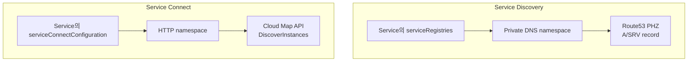

# ECS 네임스페이스 (Cloud Map Namespace)

## 개요

ECS에서 서비스 간 통신을 붙이다 보면 namespace라는 단어가 Service Discovery 설명에도 나오고 Service Connect 설명에도 나온다. 둘 다 "namespace"라고 부르는데 실제로는 타입이 다른 Cloud Map 리소스고, 동작도 다르다. 이걸 같은 거라고 생각하고 시작하면 "Service Discovery 쓰던 namespace를 Service Connect에 그대로 붙였는데 등록이 안 된다"거나 "dig로 조회가 안 된다" 같은 증상에서 한참 헤맨다.

namespace는 AWS Cloud Map(정식 명칭 AWS Cloud Map, 옛 Route 53 Auto Naming)의 최상위 그룹 단위다. ECS Service는 이 namespace 안에 자기 자신을 service로 등록하고, 같은 namespace에 등록된 다른 service를 이름으로 찾아 호출한다. ECS 입장에서 namespace는 "서로를 발견할 수 있는 서비스들의 경계선"이다.

이 문서는 namespace 자체에 집중한다. Service Connect의 필드별 설정은 [ECS Service Connect 설정](ECS_Service_Connect.md)에, 서비스 간 호출 방식 전반은 [ECS Multi Task Connection](ECS_Multi_Task_Connection.md)에 정리돼 있다. 여기서는 그 두 문서가 공통으로 깔고 가는 namespace의 종류와 격리 모델, 그리고 namespace를 만들고 지울 때 실제로 터지는 문제를 다룬다.

## namespace 3종

Cloud Map namespace는 만들 때 타입을 정한다. 한 번 정하면 바꿀 수 없다. 타입에 따라 뒤에서 만들어지는 리소스(Route 53 PHZ 생성 여부)와 ECS에서 쓸 수 있는 디스커버리 방식이 갈린다.

| 타입 | CLI 명령 | Route 53 PHZ | ECS에서 쓰는 곳 | 조회 방식 |
|------|----------|--------------|-----------------|-----------|
| HTTP | `create-http-namespace` | 안 만듦 | Service Connect | API (DiscoverInstances) |
| Private DNS | `create-private-dns-namespace` | VPC 연결 PHZ 생성 | Service Discovery | DNS (VPC 내부) |
| Public DNS | `create-public-dns-namespace` | 퍼블릭 호스팅 영역 생성 | (ECS 내부 통신엔 거의 안 씀) | DNS (인터넷) |

핵심 구분부터 외운다. **Service Discovery는 Private DNS namespace를 쓰고, Service Connect는 HTTP namespace를 쓴다.** 이 한 줄이 namespace에서 생기는 혼란의 절반을 막아준다.

### HTTP namespace

DNS 레코드를 일절 만들지 않는다. Route 53에 호스팅 영역도 안 생긴다. 인스턴스 정보는 Cloud Map API(`DiscoverInstances`)로만 조회된다. Service Connect의 Envoy 사이드카가 이 API를 주기적으로 호출해서 endpoint 목록을 받아오고, 앱은 Envoy가 잡고 있는 short name으로 호출한다.

```bash
aws servicediscovery create-http-namespace \
  --name prod \
  --description "Service Connect namespace for prod"
```

이름에 점(`.`)을 넣을 수도 있지만 HTTP namespace에서는 의미가 없다. DNS 계층이 아니라 그냥 식별자 문자열이다. `prod`, `staging` 같은 단순한 이름을 쓴다.

### Private DNS namespace

VPC에 연결된 Route 53 private hosted zone(PHZ)을 만든다. 등록된 service는 이 PHZ 안에 A/SRV 레코드로 올라가고, 같은 VPC 안의 모든 리소스가 일반 DNS 질의로 조회할 수 있다. ECS의 옛 Service Discovery(`serviceRegistries`)가 이 방식이다.

```bash
aws servicediscovery create-private-dns-namespace \
  --name prod.local \
  --vpc vpc-0abc1234 \
  --description "Service Discovery namespace for prod"
```

이름이 곧 DNS suffix가 된다. `prod.local`로 만들면 등록된 서비스는 `order-api.prod.local`로 조회된다. Envoy 없이 앱이 직접 DNS를 질의해서 Task IP 목록을 받고 그중 하나로 붙는다. 로드밸런싱은 클라이언트 DNS 라운드로빈에 의존한다.

### Public DNS namespace

인터넷에서 조회 가능한 퍼블릭 호스팅 영역을 만든다. 외부에 등록 가능한 도메인이 있어야 의미가 있다. ECS 내부 서비스 간 통신에는 거의 쓸 일이 없다. 내부 Task를 퍼블릭 DNS에 IP로 노출하는 건 보안상 위험하고, 외부 노출은 ALB가 담당하는 게 맞다. namespace 타입이 3종이라는 사실만 알아두고, ECS 통신 맥락에서는 HTTP와 Private DNS 둘만 신경 쓰면 된다.

## 디스커버리 방식과 namespace의 짝

ECS Service가 자기를 namespace에 등록하는 통로는 두 개다.



- `serviceRegistries` (Service Discovery): Private DNS namespace 안의 Cloud Map service를 가리킨다. Task가 뜨면 그 Task의 ENI IP가 PHZ에 A record로 등록된다.
- `serviceConnectConfiguration` (Service Connect): HTTP namespace를 가리킨다. Task가 뜨면 Envoy 사이드카가 자동으로 붙고 HTTP namespace에 endpoint가 등록된다.

타입을 잘못 짝지으면 등록 단계에서 막힌다. `serviceConnectConfiguration.namespace`에 Private DNS namespace ARN을 넣으면 Service 생성이 실패한다. 반대로 Service Discovery용 `serviceRegistries`에 HTTP namespace 안의 service를 물리면 DNS 레코드가 안 생겨서 조회가 안 된다. 에러 메시지가 항상 친절하진 않으니, "조회가 안 된다"가 보이면 namespace 타입부터 확인한다.

## 클러스터 default namespace와 Service override

클러스터를 만들 때 default namespace를 하나 지정할 수 있다. Service Connect를 쓰는 Service가 namespace를 명시하지 않으면 이 default를 따라간다.

```bash
aws ecs create-cluster \
  --cluster-name prod-cluster \
  --service-connect-defaults namespace=prod
```

기존 클러스터에 나중에 붙이거나 바꿀 수도 있다.

```bash
aws ecs update-cluster \
  --cluster prod-cluster \
  --service-connect-defaults namespace=prod
```

여기서 `namespace=prod`는 이름 또는 ARN을 받는다. 이름만 넣으면 같은 region·계정 안에서 그 이름의 HTTP namespace를 찾는다. 동명의 namespace가 region을 달리해 여러 개 있거나, 클러스터와 다른 region을 보고 있으면 "Namespace not found"가 난다. 이 모호함을 피하려면 ARN을 넣는 게 안전하다.

Service 쪽에서 `serviceConnectConfiguration.namespace`를 명시하면 클러스터 default를 무시하고 Service 값이 이긴다. 우선순위는 단순하다.

1. Service에 namespace가 있으면 그걸 쓴다.
2. 없으면 클러스터 default를 쓴다.
3. 둘 다 없으면 Service Connect를 켤 수 없다(생성 실패).

운영에서는 클러스터 default에만 기대지 말고 **Service마다 namespace를 명시**하는 쪽을 권한다. default를 바꾸면 그 클러스터에서 namespace를 안 박은 모든 Service가 다음 배포 때 조용히 새 namespace로 옮겨가는데, 이게 의도치 않은 격리 변경으로 이어진다. 명시해 두면 Service 정의만 보고도 어느 namespace에 속하는지 바로 안다.

## namespace 단위 격리 모델

namespace는 디스커버리의 경계다. **같은 namespace에 등록된 service끼리만 서로를 이름으로 찾을 수 있다.** 다른 namespace에 있는 service는 보이지 않는다. 이게 namespace를 격리 단위로 쓰는 이유다. prod와 staging을 다른 namespace에 두면 staging 클라이언트가 실수로 prod service 이름을 불러도 해석되지 않는다.

Service Connect에서 이 격리가 강하게 걸리는 이유는 클라이언트 측 Envoy 때문이다. Envoy는 자기 Service가 속한 namespace의 endpoint만 Cloud Map에서 받아온다. 그래서 같은 namespace 안에서는 short name으로 호출하면 된다.

```
http://order-api:8080
```

다른 namespace의 service를 부르려면 FQDN을 써야 한다. 형식은 `service.namespace:port`다.

```
http://order-api.prod:8080
```

단, 이건 호출하는 쪽 Envoy가 그 namespace를 해석할 수 있을 때만 동작한다. Service Connect는 한 Service가 여러 namespace에 동시에 속하는 걸 지원하지 않는다. 한 Service = 한 namespace다. 그래서 진짜로 namespace를 넘는 호출이 필요하면, FQDN에 기대기보다 namespace 경계에 내부 ALB를 두고 그쪽으로 돌리는 구성이 더 안정적이다.

이 제약은 namespace 전략을 처음에 정해야 하는 이유이기도 하다. namespace를 환경 단위(prod/staging/dev)로 끊으면 환경 내 서비스는 다 보이고 환경 간은 막힌다. 팀 단위로 잘게 쪼개면 같은 환경인데도 팀 경계에서 호출이 막혀서, 결국 cross-namespace 통신을 ALB로 우회하는 코드가 늘어난다. 대부분은 환경 단위 namespace 하나로 시작하는 게 덜 꼬인다.

## PHZ 생성 차이와 dig로 안 잡히는 현상

Private DNS와 HTTP namespace의 가장 눈에 띄는 차이는 Route 53 PHZ 존재 여부다.

Private DNS namespace를 만들면 Cloud Map이 VPC에 연결된 PHZ를 자동으로 만든다. 그래서 등록된 서비스는 일반 DNS 도구로 조회된다.

```bash
# Private DNS namespace (prod.local)에 등록된 서비스
dig +short order-api.prod.local
# 10.0.12.34
# 10.0.13.56
```

VPC 안의 EC2나 Task에서 이 명령을 치면 Task IP가 그대로 돌아온다. 디버깅할 때 편하다.

HTTP namespace는 PHZ를 만들지 않는다. DNS 레코드 자체가 없으니 dig로 조회하면 아무것도 안 나온다.

```bash
# Service Connect HTTP namespace (prod)에 등록된 서비스
dig +short order-api.prod
# (빈 결과)
dig +short order-api
# (빈 결과)
```

이걸 보고 "Service Connect가 안 붙었나" 의심하는 경우가 많은데, **HTTP namespace에서 dig가 안 잡히는 건 정상이다.** Service Connect의 이름 해석은 Task 안의 Envoy가 localhost에서 처리하고, endpoint 목록은 Cloud Map API로 받는다. PHZ를 거치지 않으니 외부 DNS 도구로는 보일 수가 없다.

HTTP namespace에 뭐가 등록돼 있는지 확인하려면 dig 대신 Cloud Map API를 쓴다.

```bash
# namespace 안의 service 목록
aws servicediscovery list-services \
  --filters Name=NAMESPACE_ID,Values=ns-xxxxxxxxxxxx,Condition=EQ

# 특정 service의 실제 endpoint
aws servicediscovery discover-instances \
  --namespace-name prod \
  --service-name order-api
```

`discover-instances`가 반환하는 인스턴스 목록이 Envoy가 보는 endpoint와 같다. Service Connect 디버깅에서 "Envoy가 도대체 어떤 IP들을 알고 있나"를 볼 때 이 명령이 가장 직접적이다.

## 트러블슈팅

### namespace 삭제가 멈춘다

가장 자주 겪는다. namespace를 지우려는데 `ResourceInUse` 또는 삭제가 진행되다 멈춘다. namespace는 그 안에 등록된 service가 하나도 없어야 지워진다. 그리고 service는 등록된 인스턴스가 없어야 지워진다. 의존 순서를 따라 안쪽부터 비워야 한다.

```bash
# 1. namespace 안의 service 확인
aws servicediscovery list-services \
  --filters Name=NAMESPACE_ID,Values=ns-xxxxxxxxxxxx,Condition=EQ

# 2. 각 service에 남은 인스턴스 확인
aws servicediscovery list-instances --service-id srv-xxxxxxxxxxxx

# 3. 인스턴스 해제
aws servicediscovery deregister-instance \
  --service-id srv-xxxxxxxxxxxx \
  --instance-id <instance-id>

# 4. service 삭제
aws servicediscovery delete-service --id srv-xxxxxxxxxxxx

# 5. namespace 삭제
aws servicediscovery delete-namespace --id ns-xxxxxxxxxxxx
```

문제는 ECS가 살아 있으면 인스턴스를 수동으로 해제해도 Task가 다시 등록한다는 점이다. namespace에 묶인 ECS Service를 먼저 지우거나 `desiredCount`를 0으로 내려야 인스턴스가 빠진다. 순서를 거꾸로 하면 "지워도 다시 생기는" 무한 루프에 빠진다. ECS Service 삭제 → Task 전부 종료 확인 → Cloud Map service 삭제 → namespace 삭제가 맞는 순서다.

CloudFormation/Terraform으로 묶어 만든 경우, 스택 삭제가 namespace 단계에서 멈추는 일이 흔하다. 대개 같은 스택 밖에서 그 namespace에 뭔가 등록됐거나, ECS Service 삭제와 namespace 삭제가 동시에 일어나면서 race가 난 거다. ECS Service에 `DependsOn`으로 namespace를 명시해서 삭제 순서를 강제하면 줄어든다.

### namespace 이름 중복·재활용 시 배포 실패

같은 region·계정 안에서 같은 이름의 HTTP namespace를 두 번 만들 수 없다. 이전 namespace를 지웠다고 생각하고 같은 이름으로 다시 만들면, 위처럼 삭제가 안 끝나 있던 경우 `NamespaceAlreadyExists`가 난다. 삭제는 비동기라 `delete-namespace`가 성공으로 돌아와도 실제 제거까지 몇십 초 걸린다. 지우고 바로 같은 이름으로 만들면 충돌한다. `get-operation`으로 삭제 완료를 확인한 뒤 다시 만든다.

클러스터 default를 이름으로 지정해 둔 상태에서 namespace를 지웠다 같은 이름으로 다시 만들면, namespace ID가 바뀐다. 이름은 같아도 클러스터 default가 가리키던 옛 namespace는 사라졌으니, 다음 배포에서 Service가 "Namespace not found"로 죽거나 새 namespace에 다시 등록되면서 기존 endpoint와 격리된다. default는 이름이 아니라 ID로 묶인다는 점을 기억해야 한다.

### Service Discovery ↔ Service Connect 마이그레이션 중 두 namespace 병행

Service Discovery에서 Service Connect로 옮기는 동안에는 Private DNS namespace와 HTTP namespace가 한동안 같이 존재한다. 이름은 같게(`prod.local`과 `prod`처럼 다르게 두는 경우도 있다) 둘 수 있지만 타입이 달라 별개 리소스다. 어느 쪽도 먼저 지우면 안 된다.

서버 쪽 Service에 `serviceRegistries`(Private DNS)와 `serviceConnectConfiguration`(HTTP)을 동시에 설정하면, Task 하나가 두 namespace에 모두 등록된다. 기존 클라이언트는 `order-api.prod.local`로, 신규 클라이언트는 `order-api`로 같은 Task에 도달한다. 클라이언트를 하나씩 Service Connect로 옮기고, 다 옮긴 뒤에 서버에서 `serviceRegistries`를 떼고 Private DNS namespace를 정리한다.

순서가 중요하다. 서버의 Private DNS 등록을 먼저 끊으면 아직 안 옮긴 클라이언트가 NXDOMAIN을 받는다. 마이그레이션의 구체적 단계와 SG·메트릭 기준선 변화는 [ECS Service Connect 설정](ECS_Service_Connect.md)의 마이그레이션 절에 더 있다.

### dnsName 중복 충돌

Service Connect에서 `clientAliases.dnsName`은 namespace 안에서 유일해야 한다. 두 Service가 같은 namespace에서 같은 `dnsName`(예: `order-api`)을 쓰면 나중에 배포한 쪽이 실패한다. 멀티 계정·멀티 팀 환경에서 서로 같은 이름을 쓰다가 부딪히는 경우가 있다.

```json
"serviceConnectConfiguration": {
  "namespace": "prod",
  "services": [
    {
      "portName": "order-api-http",
      "discoveryName": "order-api",
      "clientAliases": [
        { "port": 8080, "dnsName": "order-api" }
      ]
    }
  ]
}
```

`discoveryName`(Cloud Map에 등록되는 식별자)과 `dnsName`(클라이언트가 부르는 이름)을 헷갈리면 충돌 원인을 못 찾는다. 같은 namespace에 같은 `discoveryName`을 또 등록해도 충돌한다. 이름 충돌이 의심되면 namespace 안 service 목록과 각 service의 alias를 먼저 뽑아 비교한다.

```bash
aws servicediscovery list-services \
  --filters Name=NAMESPACE_ID,Values=ns-xxxxxxxxxxxx,Condition=EQ \
  --query "Services[].Name"
```

이름 충돌을 피하려면 namespace를 환경/팀 단위로 갈라 같은 이름 공간을 줄이거나, `dnsName`에 도메인 접두를 붙이는 규칙(`order-api`, `order-api-internal`처럼)을 팀 간에 정해 둔다.

## 정리

namespace는 ECS 서비스 간 디스커버리의 경계이자 격리 단위다. Service Connect는 HTTP namespace, Service Discovery는 Private DNS namespace를 쓴다는 짝만 정확히 잡으면 대부분의 등록 실패는 피한다. HTTP namespace는 PHZ를 안 만들어서 dig로 안 잡히는 게 정상이고, 확인은 Cloud Map API로 한다. 한 Service는 한 namespace에만 속하고 같은 namespace 안에서만 short name으로 호출되며, 경계를 넘으려면 FQDN이나 ALB가 필요하다. namespace를 지울 때는 인스턴스 → service → namespace 순서로 안쪽부터 비워야 하고, ECS Service가 살아 있으면 인스턴스가 다시 등록되니 ECS부터 내린다. 설정 필드 단위 내용은 [ECS Service Connect 설정](ECS_Service_Connect.md), 호출 패턴 전반은 [ECS Multi Task Connection](ECS_Multi_Task_Connection.md)을 본다.
