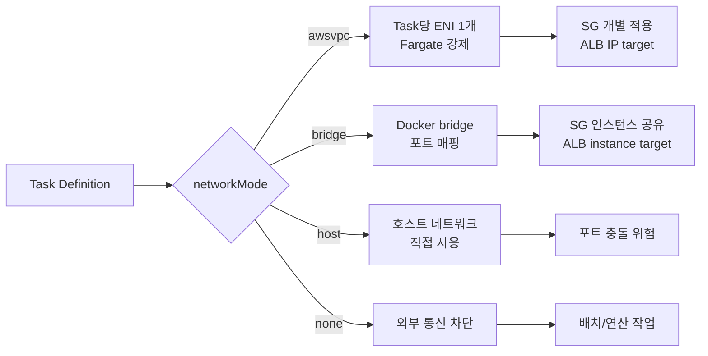
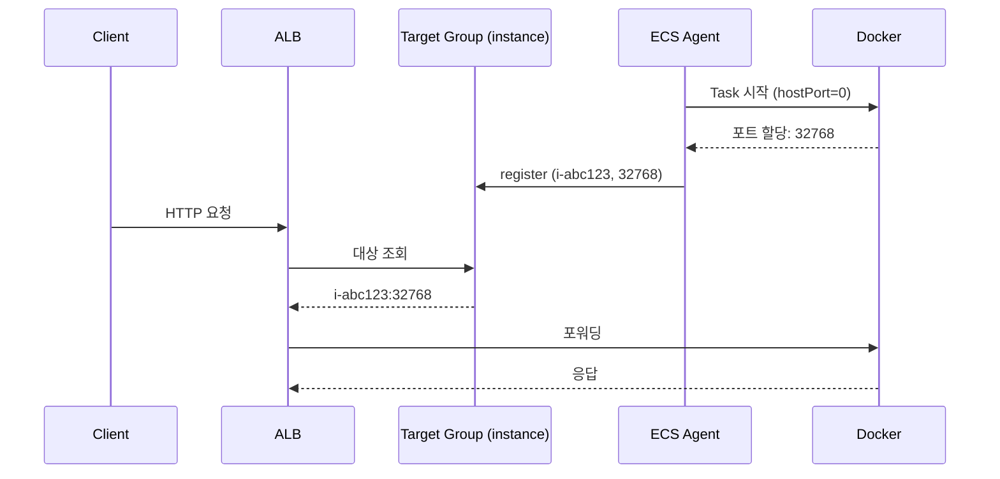
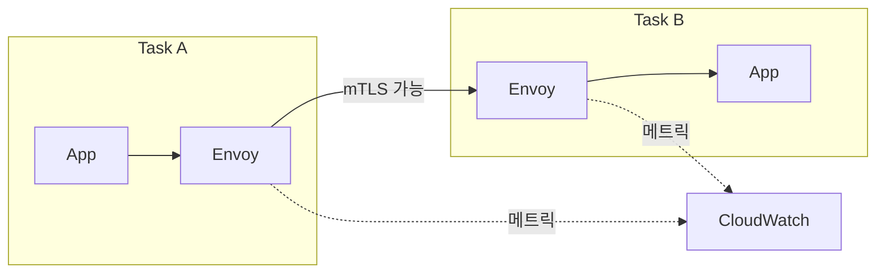
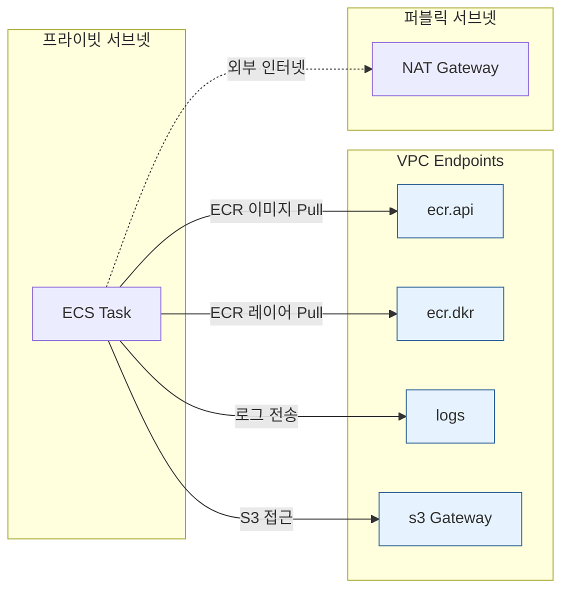

# ECS Networking Modes

## 개요

ECS에서 네트워크 모드를 고른다는 건 단순히 "컨테이너가 어떻게 IP를 받을지"의 문제가 아니다. Task에 보안 그룹을 붙일 수 있는지, ALB 타깃 그룹을 IP 타입으로 쓸지 인스턴스 타입으로 쓸지, Service Connect/Cloud Map과 어떻게 맞물리는지, Fargate로 갈 수 있는지, VPC Endpoint 비용을 얼마나 줄일 수 있는지가 모두 이 선택 하나에서 갈린다.

네트워크 모드는 Task Definition에서 `networkMode` 필드로 지정한다. 값은 넷 중 하나다.

- `awsvpc` — Task당 ENI 하나. Fargate는 무조건 이 모드.
- `bridge` — Docker bridge 네트워크. 호스트의 ENI를 공유하고 포트 매핑으로 노출.
- `host` — 호스트 네트워크 스택을 그대로 사용. 포트 충돌 주의.
- `none` — 외부 네트워크 없음. 네트워크가 필요 없는 배치 작업용.

ENI 개수 제한과 Task 밀도 계산은 [ECS ENI 제한과 Task 한계](ECS_ENI_제한과_Task_한계.md) 문서에서 다뤘고, 여기서는 모드별 동작 원리와 실무에서 부딪히는 포트 매핑, 서비스 디스커버리, VPC Endpoint 구성에 집중한다.



## awsvpc 모드 — Task당 ENI 할당 구조

### 동작 원리

awsvpc 모드에서 Task가 뜨면 ECS Agent가 다음 순서를 밟는다.

1. Task 배치가 결정되면 ECS가 먼저 **ENI를 생성**한다 (이 단계에서 VPC API 호출 발생).
2. ENI가 지정된 서브넷에 할당되고, Task에 지정한 **보안 그룹이 ENI에 attach** 된다.
3. ENI가 EC2 인스턴스 또는 Fargate 호스트에 hot-attach 된다.
4. ENI 내부에 네임스페이스가 만들어지고, 컨테이너가 그 네임스페이스에서 기동한다.

이 과정은 보통 10~30초가 걸린다. Service 배포 중 Task 시작이 느리게 느껴지는 가장 큰 이유가 이 ENI 프로비저닝이다. Auto Scaling 이벤트가 터졌을 때 bridge 모드는 몇 초 내로 Task가 RUNNING 되는데, awsvpc는 `PROVISIONING` → `ACTIVATING` 상태를 길게 거친다.

### Task별 보안 그룹의 실제 효과

awsvpc 모드의 가장 큰 장점은 **보안 그룹이 Task 단위로 적용된다**는 점이다. 같은 EC2 인스턴스에 웹 서버 Task와 배치 워커 Task가 같이 떠 있어도, 각각 다른 SG를 붙일 수 있다. 웹은 ALB에서만 8080을 받고, 배치는 SQS와 RDS로만 아웃바운드가 열려 있는 식.

bridge/host 모드에서는 보안 그룹이 **인스턴스 ENI에 붙어 있어서** 같은 인스턴스에 뜬 모든 컨테이너가 같은 SG를 공유한다. 컨테이너 A만 외부 포트를 열고 컨테이너 B는 막고 싶어도, SG 레벨에서는 분리가 안 된다.

실무에서 특히 자주 걸리는 상황이 있다. 같은 Service 내에서 여러 컨테이너를 하나의 Task로 묶어 띄울 때, awsvpc 모드에서는 **컨테이너들이 같은 ENI를 공유**한다는 점이다. Task 안의 컨테이너들은 `localhost`로 서로를 부르지만, Task 외부에서는 ENI에 붙은 SG를 공유한다. Task 내부 격리는 불가능하다.

### ALB Target Type 선택

awsvpc 모드에서는 ALB Target Group의 타겟 타입을 반드시 **IP**로 설정해야 한다. `instance` 타입으로 설정하면 등록 자체는 되지만 트래픽이 엉뚱한 곳으로 간다.

```json
{
  "TargetType": "ip",
  "VpcId": "vpc-xxxx",
  "Port": 8080,
  "Protocol": "HTTP"
}
```

instance 타입은 EC2 인스턴스의 프라이머리 ENI로 트래픽을 보내는 구조라서, Task 전용 ENI를 거치지 않는다. bridge/host 모드에서만 instance 타입을 쓴다.

### 서브넷 IP 고갈 문제

awsvpc는 Task마다 IP를 하나씩 쓴다. `/24` 서브넷이 약 250개 IP인데, 배포 중에는 구버전 + 신버전 Task가 동시에 떠서 평소보다 2배의 IP를 쓴다. `minimumHealthyPercent=100, maximumPercent=200`으로 배포하면 순간적으로 Task 수가 두 배가 되는데, 여기에 EC2 인스턴스 자체 IP와 다른 리소스(RDS, ElastiCache, NAT 등)까지 합치면 생각보다 금방 바닥난다.

IP 고갈이 나면 Task가 `PENDING` 상태에서 안 넘어가고, `RESOURCE:ENI` 에러가 CloudTrail에 찍힌다. 처음부터 `/22`(약 1,000개 IP) 이상으로 서브넷을 잡거나, awsvpc용 서브넷을 따로 분리해서 구성하는 게 안전하다.

## bridge 모드 — 동적 포트 매핑과 ALB 연동

### Docker bridge 네트워크

bridge 모드는 Docker의 기본 네트워크 드라이버를 쓴다. 컨테이너는 `docker0` 브리지 인터페이스를 통해 외부와 통신하고, 호스트의 ENI는 모든 컨테이너가 공유한다. 컨테이너의 포트를 외부로 노출하려면 `hostPort`를 지정해서 포트 매핑을 해야 한다.

### 정적 포트 매핑의 한계

Task Definition에 `hostPort: 8080`을 하드코딩하면, 같은 포트를 쓰는 Task는 **하나의 인스턴스에 하나만** 올라간다. Service의 desiredCount를 인스턴스 수보다 많게 올릴 수 없다.

```json
{
  "containerDefinitions": [
    {
      "name": "api",
      "portMappings": [
        { "containerPort": 8080, "hostPort": 8080, "protocol": "tcp" }
      ]
    }
  ],
  "networkMode": "bridge"
}
```

이 설정으로 t3.medium 10대 클러스터에 띄우면, Task는 최대 10개다. 11번째 Task는 `RESOURCE:PORTS` 에러로 PENDING 상태에 빠진다.

### 동적 포트 매핑

`hostPort`를 `0`으로 두면 Docker가 32768~60999 범위에서 랜덤 포트를 할당한다. 같은 인스턴스에 동일 서비스 Task를 여러 개 띄울 수 있고, ALB가 동적 포트를 자동으로 타깃 그룹에 등록한다.

```json
{
  "containerDefinitions": [
    {
      "name": "api",
      "portMappings": [
        { "containerPort": 8080, "hostPort": 0, "protocol": "tcp" }
      ]
    }
  ],
  "networkMode": "bridge"
}
```

이때 ALB Target Group은 `instance` 타입으로 설정한다. ECS Service가 Task를 띄울 때 `{인스턴스ID, 동적할당포트}` 쌍을 Target Group에 register 하고, 죽을 때 deregister 한다.



bridge 모드에서 동적 포트를 쓰면 ENI 제한이 없어서 Task 밀도를 높이기 쉽다. 다만 보안 그룹이 인스턴스 단위로 적용된다는 한계는 그대로다. 인스턴스 SG에서 `32768-60999`를 ALB SG에만 열어두는 식으로 우회한다.

### bridge 모드에서 자주 겪는 트러블

- **SG가 32768-60999를 안 열어뒀을 때**: ALB Health Check가 계속 `Connection timeout` 난다. 타깃이 unhealthy 상태로 깜빡거리며 Task가 계속 교체된다.
- **Task 재시작 시 포트가 바뀌는데 Health Check가 먼저 등록 해제를 못 따라가는 경우**: 드물지만 ECS Agent가 죽어있으면 deregister가 늦어지고, ALB가 죽은 포트로 계속 요청을 보낸다. Agent 모니터링 필수.
- **Docker 0.x 브리지를 거치는 네트워크 오버헤드**: awsvpc 대비 레이턴시가 수백 마이크로초 더 든다. 대부분은 무시 가능한 수준이지만, 지연에 민감한 서비스라면 host 모드를 고려한다.

## host 모드 — 호스트 네트워크 직통

### 동작 원리

host 모드는 컨테이너가 호스트의 네트워크 네임스페이스를 **그대로 공유**한다. 컨테이너 안에서 `curl http://localhost:8080`을 하면 호스트의 8080을 호출하는 것과 같다. 포트 매핑도 없고, 브리지도 없다.

가장 빠르다. 네트워크 스택을 한 번도 안 거치기 때문에 bridge 모드보다 레이턴시가 낮고, 처리량 한계도 호스트의 물리 한계에 가깝다.

### 포트 충돌 문제

host 모드에서 `containerPort: 80`을 쓰는 Task는 인스턴스 하나에 딱 하나만 올라간다. 동적 포트 같은 개념이 없다. 두 번째 Task는 포트 바인딩 에러로 기동 실패한다.

그래서 host 모드는 다음 경우에만 쓴다.

- **데몬셋 패턴**: 인스턴스마다 정확히 하나만 떠야 하는 Task. DaemonSet 스타일로 로그 수집기, 모니터링 에이전트, Service Mesh sidecar proxy 등.
- **네트워크 성능 극단 최적화**: 초저지연 게임 서버, 실시간 스트리밍, 고빈도 트레이딩 시스템.
- **대역폭이 전부인 워크로드**: 10Gbps 이상 처리하는 프록시나 파일 전송 서버.

Service의 `schedulingStrategy`를 `DAEMON`으로 설정하면 ECS가 인스턴스마다 Task를 하나씩만 배치하도록 강제한다. host 모드와 DAEMON 조합이 일반적이다.

### 보안 측면의 주의

host 모드는 컨테이너가 호스트 네트워크에 직접 노출된다. 컨테이너에서 열린 포트는 인스턴스의 포트이기도 하다. 실수로 디버그 포트(5005 같은)를 열어두면 보안 그룹만이 최종 방어선이 된다. 프로덕션에서는 호스트 포트 범위를 최소화하고, 인스턴스 SG를 타이트하게 유지해야 한다.

## none 모드

컨테이너에 외부 네트워크를 붙이지 않는다. `lo` 인터페이스만 있다. 외부 API 호출도 안 되고 다른 Task와도 통신할 수 없다.

쓰는 경우는 한정적이다. 순수 연산만 하는 배치 작업, S3나 EFS만 건드리는 데이터 처리 Job 정도. 실무에서는 거의 볼 일이 없지만, 보안 격리가 극단적으로 필요한 워크로드에서는 고려할 만하다.

주의할 점은 `none` 모드라도 **IAM Task Role은 동작한다**. Task Role은 메타데이터 엔드포인트를 통해 credentials를 받는데, 이 엔드포인트는 로컬 링크다. 다만 실제로 S3 같은 API를 호출하려면 VPC Endpoint가 EC2 호스트에 연결되어 있어야 하고, 이건 Task가 아니라 호스트 ENI가 담당한다.

## Service Connect와 Cloud Map 서비스 디스커버리

### 문제: Task IP는 휘발성이다

ECS Task가 재시작되면 IP가 바뀐다. 서비스 간 호출에서 IP를 하드코딩하거나 매번 API로 조회하는 건 현실적이지 않다. 해결책은 두 가지다.

1. **ALB/NLB 경유** — 비용이 들고 내부 트래픽에도 로드밸런서 홉이 추가된다.
2. **Service Discovery** — Cloud Map 또는 Service Connect로 이름 기반 호출.

### AWS Cloud Map + Service Discovery

전통적인 방식이다. ECS Service가 Cloud Map에 자신의 Task들을 등록하고, DNS(Route 53 Private Hosted Zone) 또는 API로 조회한다.

```json
{
  "serviceRegistries": [
    {
      "registryArn": "arn:aws:servicediscovery:ap-northeast-2:...:service/srv-xxx",
      "containerName": "api",
      "containerPort": 8080
    }
  ]
}
```

DNS로 `api.internal` 같은 이름을 만들고, Task가 뜨면 A 레코드로 IP가 등록된다. 다른 Task에서 `curl http://api.internal:8080`으로 호출한다.

DNS 기반이라 **TTL 문제**가 있다. 기본 TTL 60초인데, Task가 죽고 새로 뜨는 사이에 클라이언트가 옛 IP를 캐싱하면 1분 동안 실패 요청이 간다. 클라이언트에서 DNS 캐시 TTL을 줄이거나, 애플리케이션 레벨에서 재시도를 넣어야 한다.

awsvpc 모드에서만 깔끔하게 동작한다. bridge 모드는 호스트 IP와 포트를 조합해야 해서 SRV 레코드를 써야 하는데, 대부분의 HTTP 클라이언트가 SRV를 지원하지 않는다.

### Service Connect

2022년에 나온 신형 방식이다. Cloud Map을 내부적으로 사용하지만, Task 사이드카로 **Envoy proxy**가 자동으로 주입되어 L7 로드밸런싱, 재시도, 타임아웃, 메트릭을 처리한다.



클라이언트는 `http://api:8080`처럼 단순 이름으로 호출하고, 같은 Task 안의 Envoy가 대상 Task로 부하를 분산한다. DNS TTL 문제가 사라지고, 배포 중에도 끊김 없이 트래픽이 흐른다.

```json
{
  "serviceConnectConfiguration": {
    "enabled": true,
    "namespace": "prod.local",
    "services": [
      {
        "portName": "api",
        "discoveryName": "api",
        "clientAliases": [
          { "port": 8080, "dnsName": "api" }
        ]
      }
    ]
  }
}
```

Cloud Map과 비교했을 때 Service Connect의 장점은 세 가지다.

- **L7 로드밸런싱**: DNS 기반 round-robin이 아니라 Envoy가 최소 연결 기반으로 분산.
- **메트릭 자동 수집**: Envoy가 RequestCount, HTTPCode, TargetResponseTime을 CloudWatch로 내보낸다.
- **Graceful 연결 종료**: Task 종료 시 Envoy가 in-flight 요청을 끝까지 처리하고 나간다.

단점은 Envoy 사이드카의 **리소스 오버헤드**다. Task당 CPU ~128, Memory ~64MB 정도 추가로 쓴다. 수백 개 Task를 돌리면 꽤 쌓인다.

## Fargate가 awsvpc만 지원하는 이유

Fargate는 사용자가 관리하는 EC2 인스턴스가 없다. AWS가 내부적으로 공유 호스트(Firecracker microVM 또는 전용 호스트)에서 Task를 돌리는데, 여러 고객의 Task가 같은 물리 호스트에 섞여 있을 수 있다.

bridge/host 모드는 **호스트 네트워크를 공유**하는 모델이다. 같은 호스트에 여러 고객의 Task가 있으면 네트워크 격리가 깨진다. 호스트 ENI의 SG를 공유한다는 건 고객 A의 Task가 고객 B의 트래픽에 SG 정책을 걸 수 있다는 뜻이기도 하다. 멀티테넌트 환경에서는 불가능한 모델이다.

awsvpc는 Task마다 전용 ENI를 할당하기 때문에 네트워크 레벨에서 완전히 격리된다. Fargate가 이 모드만 지원하는 이유다.

그 외에도 Fargate는 다음과 같은 awsvpc 특성에 의존한다.

- **Task별 독립 IP**가 있어야 VPC 라우팅 테이블이 격리 가능.
- **Task별 SG**가 있어야 멀티테넌트에서 안전.
- **ENI hot-attach**가 VPC 수준에서 과금/관리 추적 가능.

Fargate에서 `networkMode: bridge`로 Task Definition을 등록하려고 하면 API 자체가 에러를 뱉는다.

## VPC Endpoint로 NAT 비용 줄이기

### 문제: NAT Gateway 데이터 처리 비용

프라이빗 서브넷에서 awsvpc Task가 ECR에서 이미지를 받거나 CloudWatch로 로그를 보낼 때, 기본 경로는 NAT Gateway를 거쳐 AWS 퍼블릭 엔드포인트로 나간다. NAT Gateway는 **처리 데이터 GB당 $0.045** (서울 리전 기준)가 붙는다.

대규모 서비스에서 이게 꽤 크다. ECR 이미지가 500MB이고 Task가 하루에 1,000번 pull 된다면 그것만으로 500GB × $0.045 = $22.5/day, 월 $675가 나간다. CloudWatch Logs 트래픽까지 합치면 수천 달러 규모가 금방 된다.

### VPC Endpoint 구성

VPC Endpoint를 만들면 VPC 내부에서 AWS 서비스로 **프라이빗 경로**가 열린다. NAT Gateway를 안 거치므로 데이터 처리 요금이 없어진다.

ECS awsvpc Task에 필요한 최소 Endpoint 목록.

```
com.amazonaws.ap-northeast-2.ecr.api         (Interface)
com.amazonaws.ap-northeast-2.ecr.dkr         (Interface)
com.amazonaws.ap-northeast-2.s3              (Gateway, ECR 레이어 저장소)
com.amazonaws.ap-northeast-2.logs            (Interface, CloudWatch Logs)
com.amazonaws.ap-northeast-2.secretsmanager  (Interface, Secrets Manager 사용 시)
com.amazonaws.ap-northeast-2.ssm             (Interface, SSM Parameter Store 사용 시)
com.amazonaws.ap-northeast-2.ecs-agent       (Interface, ECS Agent 통신)
com.amazonaws.ap-northeast-2.ecs-telemetry   (Interface, ECS 메트릭)
com.amazonaws.ap-northeast-2.ecs             (Interface, ECS API)
```

S3는 Gateway Endpoint고 나머지는 Interface Endpoint다. Interface Endpoint는 서브넷마다 ENI를 만들고 **시간당 $0.01 × ENI 수**와 **처리 데이터 GB당 $0.01**이 붙는다. AZ 3개에 9개 Endpoint면 27개 ENI × $0.01 × 730시간 = 월 $197 정도가 고정비로 나간다.

손익 분기점은 NAT을 거쳐 나가는 데이터가 월 ~2TB 이상일 때다. 소규모 서비스는 NAT만 쓰는 게 이득이고, 프로덕션 규모에서는 VPC Endpoint가 압도적으로 싸다.

### Endpoint 적용 후 주의사항

- **Security Group**: Interface Endpoint의 ENI에 붙는 SG를 만들어서, VPC CIDR에서 443 인바운드만 열어야 한다.
- **DNS 설정**: Interface Endpoint의 Private DNS를 활성화해야 SDK가 퍼블릭 URL을 알아서 프라이빗 IP로 풀어준다. 안 켜면 여전히 NAT으로 나간다.
- **S3 Gateway Endpoint 라우팅**: 프라이빗 서브넷의 라우팅 테이블에 Endpoint를 추가해야 한다. 추가 안 하면 S3 트래픽이 그대로 NAT으로 간다.
- **ECS Fargate PV 1.4.0 이상 필수**: 이전 버전은 일부 Endpoint를 인식 못 해서 NAT을 탄다. 플랫폼 버전을 `LATEST`로 두는 것보다 `1.4.0` 명시가 안전하다.



AWS 내부 서비스는 Endpoint로, 외부 API 호출(예: Slack webhook, 외부 결제 API)만 NAT으로 보내는 구조로 분리한다.

## 네트워크 모드 종합 비교

| 항목 | awsvpc | bridge | host | none |
|------|--------|--------|------|------|
| Task당 IP | 전용 (ENI 1개) | 공유 (호스트 ENI) | 공유 (호스트) | 없음 |
| Task별 SG | 가능 | 인스턴스 공유 | 인스턴스 공유 | 무의미 |
| ALB Target Type | IP | instance | instance | 불가 |
| Task 시작 속도 | 느림 (ENI 할당 10~30초) | 빠름 | 빠름 | 빠름 |
| Task 밀도 | ENI 제한에 묶임 | 높음 | 포트 수 만큼 | 이론상 무제한 |
| 네트워크 레이턴시 | 보통 | 오버헤드 소폭 | 최저 | 외부 통신 불가 |
| Fargate 지원 | 지원 | 미지원 | 미지원 | 미지원 |
| Service Connect | 지원 | 제한적 | 제한적 | 미지원 |
| Cloud Map DNS | 완전 지원 | SRV 레코드 필요 | SRV 레코드 필요 | 미지원 |
| VPC Flow Logs 구분 | Task 단위 | 인스턴스 단위 | 인스턴스 단위 | 해당 없음 |
| 주 용도 | 프로덕션 기본값 | EC2 밀도 중요한 내부 서비스 | 데몬셋, 초저지연 | 격리된 배치 작업 |

## 실무 선택 기준

awsvpc를 기본값으로 두고, 특별한 이유가 있을 때만 다른 모드를 고려한다는 원칙이 지금 AWS 권장 방향이다. 실제로 부딪히는 케이스를 정리하면 이렇다.

**Fargate를 쓰려는 순간**: 고민 끝. awsvpc 외에는 선택지가 없다.

**EC2 Launch Type + 고밀도 서비스**: bridge 모드 + 동적 포트 매핑이 여전히 의미 있다. 예를 들어 마이크로서비스 20개를 m5.large 5대에 압축해서 돌리고 싶을 때, awsvpc는 ENI 제한(대당 9개)으로 45개까지 한정되는데 bridge는 수백 개까지 가능하다. 대신 Task별 SG를 포기해야 한다.

**초저지연 요구 워크로드**: host 모드 + DAEMON 스케줄링. 게임 서버, 실시간 스트리밍 쪽에서 쓴다. 그러나 요즘은 Fargate의 awsvpc 성능이 대부분의 레이턴시 요구를 커버하므로, host 모드까지 갈 일이 점점 줄어든다.

**레거시에서 마이그레이션 중**: bridge → awsvpc 전환은 Target Group 타입(instance → ip) 변경과 SG 재설계가 함께 따라붙는다. 한 번에 바꾸면 트래픽이 끊긴다. 새 Service를 awsvpc로 띄우고 가중치 라우팅으로 점진 전환하는 패턴을 쓴다.

Service Connect는 awsvpc 모드와 조합했을 때 가장 효과가 크다. bridge 모드에서도 쓸 수는 있지만 포트 매핑 때문에 설정이 복잡해지고, awsvpc에서 얻을 수 있는 mTLS, 개별 SG 같은 이점을 포기해야 한다. 새 프로젝트라면 awsvpc + Service Connect 조합으로 가는 게 장기적으로 가장 덜 꼬인다.
