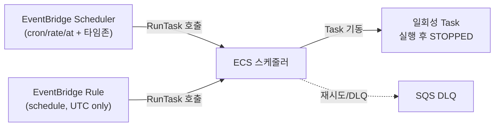
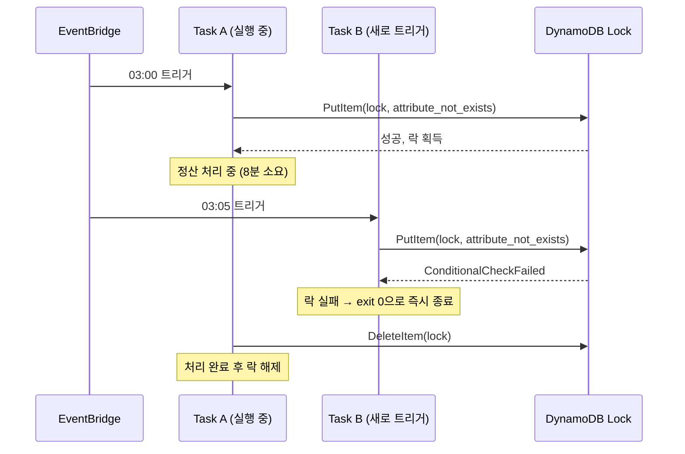

# ECS Scheduled Tasks

ECS Service는 "항상 떠 있어야 하는" 컨테이너를 다룬다. 그런데 배치 작업은 다르다. 매일 새벽 3시에 정산 한 번, 매시간 통계 집계 한 번, 5분마다 외부 API 동기화 한 번. 이런 건 평소에 떠 있을 필요가 없고 정해진 시각이나 주기에 한 번 실행되고 끝나야 한다. 이걸 ECS에서 처리하는 방식이 EventBridge로 RunTask를 예약 호출하는 것이다.

예전에는 cron 돌리는 EC2 한 대를 따로 두고 거기서 `aws ecs run-task`를 때리는 식으로 많이 했는데, 그 EC2 자체가 SPOF가 되고 cron이 죽었는지 살았는지 아무도 모르는 상황이 생긴다. EventBridge를 쓰면 스케줄 트리거를 AWS가 관리해주니까 그 한 대를 들고 있을 이유가 없어진다.

여기서는 EventBridge Scheduler와 구형 EventBridge Rule 두 방식의 차이, cron/rate 표현식, 실행에 필요한 IAM 역할, 그리고 운영하면서 반드시 밟게 되는 함정들(중복 실행, 실패 처리, 종료 코드 모니터링, Fargate 비용)을 정리한다.

---

## 두 가지 방식: EventBridge Rule vs EventBridge Scheduler

이름이 비슷해서 처음엔 헷갈리는데, AWS에는 ECS Task를 예약하는 경로가 두 개 있다.

- **EventBridge Rule (구 CloudWatch Events)**: `schedule` 표현식을 가진 Rule을 만들고 target으로 ECS Task를 지정한다. 오래된 방식이고 콘솔의 ECS 클러스터 화면에 있는 "예약된 작업(Scheduled Tasks)" 탭이 내부적으로 이걸 만든다.
- **EventBridge Scheduler**: 2022년 말에 나온 별도 서비스. 스케줄 전용으로 설계됐고 타임존 지정, 일회성 실행(at 표현식), 유연한 시간 윈도우, 내장 재시도/DLQ를 직접 지원한다.

신규로 만든다면 Scheduler를 쓰는 게 맞다. Rule 방식은 Rule 하나당 schedule 하나라서 스케줄이 많아지면 Rule이 계정 한도(리전당 기본 300개)를 잡아먹고, 타임존 지정이 안 돼서 UTC 기준으로만 돌아간다. 한국 시간 새벽 3시를 맞추려면 UTC 18시로 직접 환산해야 하고 서머타임 있는 리전이면 더 골치 아프다. Scheduler는 `Asia/Seoul` 같은 타임존을 그냥 넣으면 된다.

다만 기존에 Rule 방식으로 깔린 게 많다면 굳이 다 갈아엎을 필요는 없다. 동작 자체는 양쪽 다 결국 ECS RunTask API를 호출하는 거라 같다.



---

## cron / rate / at 표현식

스케줄 표현식은 세 종류다.

### rate 표현식

단순 주기 반복이다. `rate(값 단위)` 형식이고 단위는 `minute(s)`, `hour(s)`, `day(s)`만 된다.

```
rate(5 minutes)
rate(1 hour)
rate(1 day)
```

값이 1일 때는 단수형(`minute`), 2 이상이면 복수형(`minutes`)을 써야 한다. `rate(1 minutes)` 같은 건 거부당한다. rate는 등록된 시점 또는 직전 실행 완료 시점을 기준으로 다음 실행을 잡기 때문에 "매시 정각" 같은 절대 시각 정렬이 안 된다. 정각에 딱 맞추고 싶으면 cron을 써야 한다.

### cron 표현식

AWS cron은 필드가 6개다. 표준 유닉스 cron(5필드)과 다르다.

```
cron(분 시 일 월 요일 연)
```

| 필드 | 값 범위 | 와일드카드 |
|------|---------|-----------|
| 분 | 0–59 | `, - * /` |
| 시 | 0–23 | `, - * /` |
| 일(월 기준) | 1–31 | `, - * / ? L W` |
| 월 | 1–12 또는 JAN–DEC | `, - * /` |
| 요일 | 1–7 또는 SUN–SAT | `, - * / ? L #` |
| 연 | 1970–2199 | `, - * /` |

가장 자주 막히는 부분: **일 필드와 요일 필드를 동시에 `*`로 두면 안 된다.** 하나는 반드시 `?`여야 한다. 둘 다 값으로 지정하는 것도 안 된다. 유닉스 cron만 쓰던 사람이 여기서 거의 100% 한 번 막힌다.

```
cron(0 18 * * ? *)      매일 18:00 (UTC)
cron(0/15 * * * ? *)    15분마다
cron(0 0 1 * ? *)       매월 1일 0시
cron(0 9 ? * MON *)     매주 월요일 9시
cron(0 0 L * ? *)       매월 말일 0시
```

EventBridge Rule 방식에서는 cron이 **UTC 고정**이라는 점을 잊으면 안 된다. KST 새벽 3시 정산이면 UTC 기준 전날 18시이므로 `cron(0 18 * * ? *)`로 써야 한다. Scheduler에서는 `ScheduleExpressionTimezone`에 `Asia/Seoul`을 넣고 `cron(0 3 * * ? *)`로 쓰면 된다.

### at 표현식 (일회성)

EventBridge Scheduler에서만 된다. 특정 시각에 딱 한 번 실행하고 끝난다.

```
at(2026-06-01T03:00:00)
```

마이그레이션 작업을 특정 점검 시각에 한 번만 돌린다거나, 예약 발송을 거는 데 쓴다. 일회성 스케줄은 실행 후 자동으로 삭제하도록 `ActionAfterCompletion`을 `DELETE`로 두면 찌꺼기가 안 남는다.

---

## 일회성 Task vs Service의 차이

이 구분을 명확히 하고 넘어가야 한다. 예약 실행으로 띄우는 Task는 **Service에 속하지 않는 standalone task**다.

| 구분 | Service Task | 예약 실행(Standalone) Task |
|------|--------------|---------------------------|
| 수명 | 죽으면 desired count 맞춰 재기동 | 한 번 실행 후 STOPPED로 끝 |
| 헬스체크 | ALB/Service 헬스체크 연동 | 없음 |
| 종료 동작 | 종료 코드 무관, 계속 재기동 | 종료 코드가 결과 그 자체 |
| 용도 | 웹 서버, API, 워커 | 배치, 마이그레이션, 정산 |

Service는 "계속 살아 있어야 하는" 워크로드라 컨테이너가 exit하면 ECS가 다시 띄운다. 배치 작업을 실수로 Service로 등록하면 작업이 끝나고 컨테이너가 정상 종료(exit 0)해도 ECS가 "어, 죽었네" 하고 무한 재기동한다. 정산 배치가 5분마다 돌게 만들려던 게 1분에 수십 번 도는 참사가 난다.

배치는 반드시 RunTask로 띄우는 standalone task여야 한다. Task Definition은 Service용과 똑같은 걸 쓸 수도 있지만, 보통 배치 전용 Task Definition을 따로 만든다(`command`나 진입점이 다르기 때문).

---

## 실행 IAM 역할: ecsEventsRole와 그 외

여기가 IAM 때문에 처음 세팅할 때 가장 헷갈리는 지점이다. 예약 실행에 관여하는 역할이 최소 두 개, 보통 세 개다.

1. **EventBridge가 RunTask를 호출할 때 쓰는 역할** — Rule 방식에서는 관례적으로 `ecsEventsRole`이라고 부른다. Scheduler 방식에서는 그냥 Scheduler용 역할을 직접 만든다. 이 역할이 `ecs:RunTask` 권한을 가져야 EventBridge가 ECS를 깨울 수 있다.
2. **Task Execution Role** — ECR 이미지 pull, CloudWatch Logs 기록 등 ECS 에이전트가 Task를 띄우기 위해 쓰는 역할. 예약이든 Service든 항상 필요하다.
3. **Task Role** — 컨테이너 안의 애플리케이션이 S3·DynamoDB·SQS 같은 걸 호출할 때 쓰는 역할.

2번, 3번은 [ECS IAM Role 설정](ECS_IAM_Role_설정.md) 문서에 정리돼 있고, 여기서 추가로 신경 써야 하는 건 1번이다.

### ecsEventsRole에 필요한 권한

EventBridge Rule이 ECS Task를 띄우려면 `ecs:RunTask`가 있어야 한다. 그런데 함정이 하나 더 있다. RunTask로 띄우는 Task가 Task Role / Execution Role을 갖고 있으면, EventBridge 역할이 그 역할들을 **PassRole** 할 수 있어야 한다. 이게 빠지면 콘솔에서는 잘 만들어지는데 실제 트리거 시점에 `is not authorized to perform: iam:PassRole` 에러가 나면서 Task가 안 뜬다.

```json
{
  "Version": "2012-10-17",
  "Statement": [
    {
      "Effect": "Allow",
      "Action": "ecs:RunTask",
      "Resource": "arn:aws:ecs:ap-northeast-2:123456789012:task-definition/batch-job:*",
      "Condition": {
        "ArnLike": {
          "ecs:cluster": "arn:aws:ecs:ap-northeast-2:123456789012:cluster/prod"
        }
      }
    },
    {
      "Effect": "Allow",
      "Action": "iam:PassRole",
      "Resource": [
        "arn:aws:iam::123456789012:role/batch-task-role",
        "arn:aws:iam::123456789012:role/ecsTaskExecutionRole"
      ],
      "Condition": {
        "StringLike": {
          "iam:PassedToService": "ecs-tasks.amazonaws.com"
        }
      }
    }
  ]
}
```

신뢰 정책(trust policy)의 주체는 방식에 따라 다르다. Rule 방식이면 `events.amazonaws.com`, Scheduler 방식이면 `scheduler.amazonaws.com`을 신뢰하게 해야 한다. 이걸 잘못 넣으면 역할 자체를 EventBridge가 떠맡지(assume) 못한다.

```json
{
  "Version": "2012-10-17",
  "Statement": [
    {
      "Effect": "Allow",
      "Principal": { "Service": "scheduler.amazonaws.com" },
      "Action": "sts:AssumeRole"
    }
  ]
}
```

PassRole 리소스를 `*`로 열어두는 경우를 종종 보는데, 그러면 EventBridge 역할이 계정의 아무 역할이나 Task에 붙여서 띄울 수 있게 된다. `iam:PassedToService` 조건과 리소스 ARN을 반드시 좁혀야 한다.

---

## EventBridge Scheduler로 거는 실제 예시

CLI로 매일 KST 03:00 정산 배치를 거는 예시다. Fargate 기준.

```bash
aws scheduler create-schedule \
  --name "daily-settlement" \
  --schedule-expression "cron(0 3 * * ? *)" \
  --schedule-expression-timezone "Asia/Seoul" \
  --flexible-time-window '{"Mode":"OFF"}' \
  --target '{
    "Arn": "arn:aws:ecs:ap-northeast-2:123456789012:cluster/prod",
    "RoleArn": "arn:aws:iam::123456789012:role/scheduler-ecs-role",
    "EcsParameters": {
      "TaskDefinitionArn": "arn:aws:ecs:ap-northeast-2:123456789012:task-definition/batch-settlement",
      "TaskCount": 1,
      "LaunchType": "FARGATE",
      "PlatformVersion": "LATEST",
      "NetworkConfiguration": {
        "awsvpcConfiguration": {
          "Subnets": ["subnet-aaa", "subnet-bbb"],
          "SecurityGroups": ["sg-batch"],
          "AssignPublicIp": "DISABLED"
        }
      }
    },
    "RetryPolicy": {
      "MaximumRetryAttempts": 3,
      "MaximumEventAgeInSeconds": 3600
    },
    "DeadLetterConfig": {
      "Arn": "arn:aws:sqs:ap-northeast-2:123456789012:scheduler-dlq"
    }
  }'
```

`NetworkConfiguration`은 awsvpc 모드라 반드시 들어가야 한다(Fargate는 awsvpc 강제). 빠뜨리면 `NetworkConfiguration is not valid` 에러로 RunTask가 거부된다. `AssignPublicIp`를 `DISABLED`로 두면 NAT나 VPC 엔드포인트로 ECR·CloudWatch에 나가야 하므로, 사설 서브넷이라면 엔드포인트 구성을 미리 확인해야 한다. 이미지 pull이 안 되면 Task가 PROVISIONING에서 멈췄다가 실패한다.

컨테이너에 다른 인자를 넘기고 싶으면 `EcsParameters` 안에 넣지 말고 RunTask overrides가 필요한데, Scheduler에서는 `Input` 필드로 container override JSON을 넣을 수 있다. 같은 Task Definition으로 파라미터만 바꿔 여러 스케줄을 돌릴 때 쓴다.

---

## 동시 실행 중복 방지

배치에서 가장 조용히 사고 나는 부분이다. 5분마다 도는 배치가 있는데 어쩌다 한 번 처리가 8분 걸리면, 이전 실행이 안 끝났는데 다음 실행이 또 떠서 같은 데이터를 두 번 처리한다. 정산이라면 금액이 두 배로 찍힌다.

EventBridge에는 "이전 실행이 끝날 때까지 기다림" 같은 옵션이 없다. 스케줄이 되면 무조건 새 Task를 띄운다. 그래서 중복 방지는 애플리케이션이나 인프라 쪽에서 직접 막아야 한다.

현실적으로 쓰는 방법:

- **분산 락**: 배치 시작 시 DynamoDB나 Redis에 조건부 쓰기로 락을 잡고, 못 잡으면 즉시 exit 0으로 빠진다. DynamoDB `PutItem` + `attribute_not_exists` 조건 + TTL 조합이 흔하다. TTL은 배치 최대 실행 시간보다 넉넉히 잡되, 무한정 잡혀서 다음 실행까지 막는 일이 없도록 한다.
- **실행 시간 모니터링**: 락만으로는 "왜 자꾸 락을 못 잡지?"의 원인이 안 보인다. 배치 실행 시간이 스케줄 주기에 근접하면 알림이 오게 해두고, 주기를 늘리거나 배치를 쪼개야 한다.

ECS Service Auto Scaling처럼 ECS가 동시성을 관리해주지 않는다. standalone task는 서로의 존재를 모른다. 락은 반드시 직접 구현해야 한다.



---

## Task 실패 시 재시도와 DLQ

여기서 "재시도"가 두 층위로 나뉜다는 걸 알아야 혼란이 없다.

**1층: EventBridge → RunTask API 호출 실패에 대한 재시도.** Scheduler의 `RetryPolicy`는 *RunTask API 호출 자체가 실패했을 때* 다시 호출하는 것이다. 예를 들어 ECS가 일시적으로 스로틀링하거나 용량이 없어서 RunTask가 거부된 경우다. `MaximumRetryAttempts`만큼 재시도하고, `MaximumEventAgeInSeconds`를 넘기면 포기한다. 모두 실패하면 `DeadLetterConfig`로 지정한 SQS 큐에 이벤트가 들어간다.

**2층: 컨테이너 안에서 배치 로직이 실패(exit 1)한 경우.** 이건 EventBridge의 RetryPolicy가 잡아주지 않는다. RunTask 호출은 성공했고 Task도 정상적으로 떴기 때문이다. 컨테이너가 exit 1로 끝나든 exit 0으로 끝나든 EventBridge 입장에서는 "RunTask 호출 성공"으로 끝난 거다. 즉 DLQ에는 안 들어간다.

이 구분을 모르면 "DLQ를 걸어놨는데 배치가 실패해도 아무것도 안 들어오네?"라고 헤맨다. DLQ는 ECS를 못 깨운 경우만 잡는다. 배치 로직 실패는 별도로 감지해야 한다.

2층 실패를 잡는 방법:
- 배치 안에서 실패 시 SNS/Slack으로 직접 알림을 쏜다(가장 단순하고 확실하다).
- ECS Task 상태 변화 이벤트(`ECS Task State Change`)를 다시 EventBridge Rule로 받아서, `stoppedReason`이나 container의 `exitCode`가 0이 아니면 알림으로 보낸다.

DLQ 큐는 만들어만 두고 아무도 안 보는 경우가 많다. DLQ에 메시지 들어오면 알림이 오게 CloudWatch 알람(`ApproximateNumberOfMessagesVisible > 0`)을 반드시 걸어야 한다. 안 그러면 트리거가 며칠째 실패하고 있는데 배치가 안 돌고 있다는 사실조차 모른다.

---

## 배치 종료 코드 모니터링

standalone task는 종료 코드가 곧 작업 결과다. 그런데 이걸 챙겨 보는 게 의외로 번거롭다. Task는 끝나면 STOPPED 상태로 남았다가 시간이 지나면 ECS에서 사라진다. 그 전에 종료 코드를 어딘가에 남겨야 한다.

`describe-tasks`로 STOPPED된 Task의 컨테이너 종료 코드를 확인할 수 있다.

```bash
aws ecs describe-tasks \
  --cluster prod \
  --tasks <task-id> \
  --query 'tasks[0].containers[0].exitCode'
```

운영에서는 이걸 사람이 매번 칠 수 없으니, ECS Task State Change 이벤트를 EventBridge로 받아 자동 처리한다. Task가 STOPPED로 바뀔 때 이벤트가 오고, 그 안에 `containers[].exitCode`와 `stoppedReason`이 들어 있다.

```json
{
  "source": ["aws.ecs"],
  "detail-type": ["ECS Task State Change"],
  "detail": {
    "lastStatus": ["STOPPED"],
    "clusterArn": ["arn:aws:ecs:ap-northeast-2:123456789012:cluster/prod"]
  }
}
```

이 Rule의 target을 Lambda로 잡고, exitCode가 0이 아니거나 stoppedReason이 정상 종료가 아니면(예: `Essential container in task exited`인데 코드가 비정상, 또는 OOM으로 `OutOfMemory`) 알림을 보낸다.

자주 만나는 stoppedReason:

- `Essential container in task exited` — 컨테이너가 종료됨. exitCode를 같이 봐야 정상인지 판단된다. 배치가 exit 0이면 정상 완료다.
- `OutOfMemory` — 메모리 초과. Task Definition의 메모리를 올리거나 배치 처리량을 줄여야 한다. 데이터가 늘면서 어느 날 갑자기 터지는 전형적인 케이스다.
- `Task failed ELB health checks` — 배치인데 이게 뜬다면 Service로 잘못 등록했다는 신호다.
- `CannotPullContainerError` — 이미지 pull 실패. ECR 권한이나 사설 서브넷 NAT/엔드포인트 문제다.

배치는 "조용히 안 도는" 게 제일 위험하다. 실패하면 시끄럽게 알리는 것보다, **성공했을 때도 가끔 확인할 수 있는 흔적**을 남기는 게 낫다. 마지막 성공 시각을 DynamoDB나 파라미터 스토어에 찍고, "마지막 성공이 N시간 이상 전"이면 알람이 오게 해두면 트리거 자체가 깨진 경우(스케줄 비활성화, IAM 만료 등)까지 잡힌다.

---

## Fargate 예약 작업 비용 주의사항

Fargate는 Task가 떠 있는 동안 vCPU·메모리에 초 단위로 과금된다(최소 1분). 예약 배치에서 비용이 새는 지점이 몇 군데 있다.

**과대 산정.** 배치는 한 번에 큰 리소스가 필요해서 4 vCPU / 8GB 같은 큰 사이즈를 잡는 경우가 많은데, 실제로는 대부분 시간을 I/O 대기로 보내면서 CPU를 거의 안 쓰는 일이 흔하다. CloudWatch에서 실제 사용량을 보고 사이즈를 내리면 그대로 비용이 준다. 배치는 Service와 달리 빨리 끝나기만 하면 되니까 CPU를 무작정 줄이면 실행 시간이 길어져 오히려 손해일 수도 있어, 둘을 같이 봐야 한다.

**Fargate Spot.** 예약 배치는 중간에 죽어도 재시도하거나 다음 주기에 다시 돌면 되는 성격이 많아서 Fargate Spot이 잘 맞는다. On-Demand 대비 상당히 싸다. 단, Spot은 2분 전 통보 후 회수될 수 있으니 배치가 중간에 끊겨도 데이터가 깨지지 않게 멱등(idempotent)하게 짜야 한다. 정산처럼 중복/중단에 민감한 건 On-Demand로 두는 게 안전하다. Capacity Provider 구성은 [ECS Capacity Providers](ECS_Capacity_Providers.md)를 참고.

**안 끝나고 매달려 있는 Task.** 가장 무서운 비용 누수다. 배치가 무한 루프에 빠지거나 외부 API 응답을 무한 대기하면 Task가 끝나지 않고 계속 과금된다. 5분짜리 배치인 줄 알았는데 며칠째 떠 있는 걸 청구서 보고 발견하는 일이 실제로 일어난다. Task Definition이나 애플리케이션 레벨에서 최대 실행 시간(timeout)을 두고, 그 시간을 넘으면 스스로 exit하게 만들어야 한다. EventBridge Scheduler에는 Task를 강제로 죽이는 기능이 없으므로 이건 직접 구현해야 한다.

**Task 폭증.** 동시 실행 방지가 안 된 상태에서 스케줄이 짧으면, 처리 지연이 누적되면서 Task가 계속 쌓여 동시에 수십 개가 뜨는 경우가 있다. 비용도 비용이고 RDS 커넥션 풀이 터진다. 이건 위의 분산 락으로 막는다. DB 커넥션 관점은 [ECS DB Connection Pool 관리](ECS_DB_Connection_Pool_관리.md)에 더 자세히 있다.

---

## 정리하며 챙길 점

- 신규면 EventBridge Scheduler를 쓴다. 타임존·일회성·재시도·DLQ가 내장이라 Rule보다 손이 덜 간다.
- cron은 6필드, 일/요일 중 하나는 반드시 `?`, Rule 방식은 UTC 고정.
- 배치는 Service가 아니라 standalone task로. Service로 등록하면 무한 재기동된다.
- EventBridge 역할에 `ecs:RunTask`와 Task 역할들에 대한 `iam:PassRole`을 같이 넣는다. PassRole 누락이 첫 트리거 실패의 단골 원인이다.
- 중복 실행은 ECS가 안 막아준다. 분산 락을 직접 짠다.
- DLQ는 RunTask 호출 실패만 잡는다. 배치 로직 실패(exit 1)는 Task State Change 이벤트로 별도 감지한다.
- Fargate는 안 끝나는 Task가 곧 돈이다. timeout을 반드시 건다.
