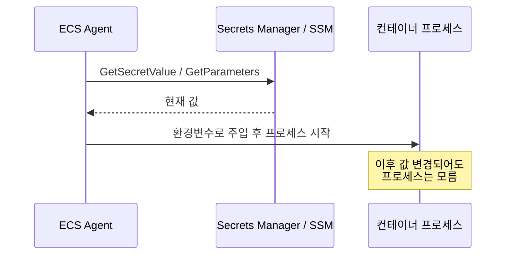

# ECS Secrets 관리

ECS Task에 DB 비밀번호나 API 키 같은 민감한 값을 넘기는 방법은 두 가지다. Task Definition의 `environment`에 평문으로 박는 방법과 `secrets`에 `valueFrom`으로 참조를 거는 방법이다. 평문으로 박으면 Task Definition을 볼 수 있는 사람은 누구나 그 값을 그대로 본다. `aws ecs describe-task-definition` 한 번이면 끝이다. 그래서 비밀번호류는 `secrets`로 Secrets Manager나 SSM Parameter Store에서 끌어오는 게 정석이다.

문제는 이게 동작 원리를 모르고 쓰면 task가 `PROVISIONING`에서 멈춰버리거나, 로테이션을 돌렸는데 컨테이너는 옛날 값을 계속 쓰는 일이 생긴다는 거다. 실무에서 겪은 함정 위주로 정리한다.

---

## environment vs secrets

둘 다 컨테이너 안에서는 똑같은 환경변수로 보인다. 컨테이너 코드 입장에서 `process.env.DB_PASSWORD`나 `os.environ['DB_PASSWORD']`로 읽는 건 차이가 없다. 차이는 값이 어디에 저장되고 누가 볼 수 있느냐다.

```json
{
  "containerDefinitions": [
    {
      "name": "api",
      "image": "123456789012.dkr.ecr.ap-northeast-2.amazonaws.com/api:latest",
      "environment": [
        { "name": "NODE_ENV", "value": "production" },
        { "name": "PORT", "value": "8080" }
      ],
      "secrets": [
        {
          "name": "DB_PASSWORD",
          "valueFrom": "arn:aws:secretsmanager:ap-northeast-2:123456789012:secret:prod/db-AbCdEf"
        },
        {
          "name": "API_KEY",
          "valueFrom": "arn:aws:ssm:ap-northeast-2:123456789012:parameter/prod/api-key"
        }
      ]
    }
  ]
}
```

`environment`에 들어간 `NODE_ENV`, `PORT`는 Task Definition JSON에 그대로 노출된다. `secrets`에 들어간 `DB_PASSWORD`는 ARN만 보이고 실제 값은 Task Definition에 남지 않는다. 값 해석은 ECS 에이전트가 컨테이너를 띄우기 직전에 한다.

`environment`와 `secrets`에 같은 이름을 동시에 쓰면 안 된다. 같은 변수명을 양쪽에 넣으면 등록 자체가 거부된다. 평문 기본값을 주고 싶으면 이름을 다르게 쓰거나 한쪽만 써야 한다.

---

## 주입 시점 — 한 번만 평가된다

이게 가장 많이 깨지는 부분이다. `secrets`의 `valueFrom`은 **컨테이너가 시작할 때 단 한 번** 평가된다. ECS 에이전트가 Secrets Manager / SSM을 호출해서 값을 받아오고, 그 값을 컨테이너 환경변수로 박은 뒤 프로세스를 띄운다. 그 다음부터는 끝이다. 컨테이너가 살아있는 동안 ECS가 다시 secret을 읽어오는 일은 없다.



그래서 Secrets Manager의 로테이션 기능을 켜서 DB 비밀번호를 자동으로 바꿔도, 이미 떠 있는 task는 옛날 비밀번호를 환경변수에 들고 있다. 로테이션 직후 새 비밀번호로 DB 접속을 시도하면 인증 실패가 난다. 새 값을 반영하려면 task를 새로 띄워야 한다. 보통 서비스를 강제로 새 배포하거나 task를 교체한다.

```bash
# secret 로테이션 후 새 값 반영 — task를 새로 돌려야 한다
aws ecs update-service \
  --cluster prod \
  --service api \
  --force-new-deployment
```

로테이션을 쓸 거면 이 점을 처음부터 설계에 넣어야 한다. 로테이션 람다가 secret을 바꾸고 나서 ECS 서비스에 `force-new-deployment`를 걸어주는 식으로 묶어두는 경우가 있다. 그냥 로테이션만 켜두고 "AWS가 알아서 반영하겠지" 하면 어느 날 갑자기 인증 에러로 장애가 난다.

애플리케이션이 로테이션을 자체적으로 감당해야 하는 상황이면, 환경변수 주입 대신 코드에서 SDK로 직접 Secrets Manager를 주기적으로 읽는 방식을 써야 한다. 이건 ECS의 `secrets` 기능 영역 밖이고, Task Role(executionRole이 아니라)에 권한을 줘야 한다.

---

## executionRole 권한

`secrets` 주입은 컨테이너 기동 단계에서 ECS 에이전트가 하는 일이다. 그래서 권한은 Task Role이 아니라 **executionRole**에 붙어야 한다. 여기서 헷갈려서 Task Role에 권한을 주고 "왜 안 되지" 하는 경우가 많다. 애플리케이션 코드가 런타임에 쓰는 권한이 Task Role, 컨테이너를 띄우는 ECS 에이전트가 쓰는 권한이 executionRole이다. secret 주입은 후자다.

Secrets Manager에서 끌어올 때 필요한 권한:

```json
{
  "Version": "2012-10-17",
  "Statement": [
    {
      "Effect": "Allow",
      "Action": ["secretsmanager:GetSecretValue"],
      "Resource": "arn:aws:secretsmanager:ap-northeast-2:123456789012:secret:prod/db-*"
    },
    {
      "Effect": "Allow",
      "Action": ["kms:Decrypt"],
      "Resource": "arn:aws:kms:ap-northeast-2:123456789012:key/xxxxxxxx-xxxx-xxxx-xxxx-xxxxxxxxxxxx",
      "Condition": {
        "StringEquals": {
          "kms:ViaService": "secretsmanager.ap-northeast-2.amazonaws.com"
        }
      }
    }
  ]
}
```

`kms:Decrypt`가 빠지는 실수를 자주 한다. Secrets Manager에서 secret을 만들 때 기본 키(`aws/secretsmanager`)가 아니라 직접 만든 CMK로 암호화했다면, executionRole에 그 키에 대한 `kms:Decrypt` 권한이 있어야 한다. 기본 키를 썼으면 KMS 권한이 따로 없어도 동작하는데, CMK로 바꾸는 순간 권한이 모자라서 주입이 실패한다. 이게 평소엔 멀쩡하다가 secret을 CMK로 옮긴 다음 task가 안 뜨는 형태로 나타난다.

SSM Parameter Store에서 끌어올 때는 액션이 다르다:

```json
{
  "Effect": "Allow",
  "Action": ["ssm:GetParameters"],
  "Resource": "arn:aws:ssm:ap-northeast-2:123456789012:parameter/prod/*"
}
```

SSM SecureString을 CMK로 암호화했다면 여기에도 `kms:Decrypt`가 필요하다. `kms:ViaService` 조건을 쓸 경우 값은 `ssm.ap-northeast-2.amazonaws.com`이 된다.

액션 이름에 주의할 게 있다. SSM은 `ssm:GetParameters`(복수형)다. `ssm:GetParameter`(단수)만 주면 ECS가 내부적으로 `GetParameters`를 호출하기 때문에 권한이 모자라다. Secrets Manager 쪽도 `secretsmanager:GetSecretValue`이지 `DescribeSecret`이 아니다. 정책 짤 때 이 이름을 정확히 안 쓰면 권한은 있는 것 같은데 주입이 실패한다.

---

## JSON 키 개별 주입

Secrets Manager에 JSON 한 덩어리로 값을 저장해두고 그중 특정 키만 환경변수로 꺼내 쓸 수 있다. RDS가 만들어주는 secret이 보통 이런 형태다.

```json
{
  "username": "admin",
  "password": "s3cr3t",
  "host": "prod-db.cluster-xxxx.ap-northeast-2.rds.amazonaws.com",
  "port": 5432
}
```

이 secret에서 `password`만 `DB_PASSWORD` 환경변수로 주입하려면 ARN 뒤에 JSON 키를 붙인다.

```json
{
  "name": "DB_PASSWORD",
  "valueFrom": "arn:aws:secretsmanager:ap-northeast-2:123456789012:secret:prod/db-AbCdEf:password::"
}
```

형식은 `secret-arn:json-key:version-stage:version-id`다. 보통 버전 부분은 비워두므로 `:password::`처럼 콜론 두 개로 끝낸다. 마지막 콜론 두 개를 빼먹는 실수가 잦은데, `...:password`로만 끝내면 형식 오류로 task가 안 뜬다.

이 방식의 장점은 secret을 하나만 만들어두고 host, port, password를 각각 다른 환경변수로 흩어서 주입할 수 있다는 거다. RDS secret 하나에서 여러 값을 뽑아 쓸 때 편하다.

```json
"secrets": [
  { "name": "DB_HOST",     "valueFrom": "arn:...:secret:prod/db-AbCdEf:host::" },
  { "name": "DB_PORT",     "valueFrom": "arn:...:secret:prod/db-AbCdEf:port::" },
  { "name": "DB_USER",     "valueFrom": "arn:...:secret:prod/db-AbCdEf:username::" },
  { "name": "DB_PASSWORD", "valueFrom": "arn:...:secret:prod/db-AbCdEf:password::" }
]
```

JSON 키 개별 주입은 Secrets Manager에서만 된다. SSM Parameter Store는 값이 JSON이어도 키 단위로 못 뽑는다. SSM은 파라미터 통째로 들어오므로, JSON을 통으로 환경변수에 넣고 애플리케이션에서 파싱하든가 키별로 파라미터를 따로 만들어야 한다.

ARN 끝의 `-AbCdEf` 6자리는 Secrets Manager가 secret마다 붙이는 랜덤 접미사다. JSON 키를 붙일 때 이 접미사를 빼먹고 `secret:prod/db:password::`라고 쓰면 secret을 못 찾는다. 정확한 ARN은 `aws secretsmanager describe-secret`으로 확인하는 게 안전하다.

---

## task가 PROVISIONING에서 멈출 때

secret 주입이 실패하면 task는 실행 단계로 못 넘어간다. `RUNNING`이 안 되고 `PROVISIONING`이나 `PENDING`에서 멈췄다가 `STOPPED`로 떨어진다. 컨테이너 로그(CloudWatch Logs)에는 아무것도 안 남는다. 컨테이너가 아예 시작을 못 했기 때문이다. 그래서 로그만 보면 원인을 못 찾는다.

원인은 stopped task의 상세에서 봐야 한다.

```bash
aws ecs describe-tasks \
  --cluster prod \
  --tasks <task-id> \
  --query 'tasks[0].{stopCode:stopCode, reason:stoppedReason, containers:containers[].reason}'
```

여기 `stoppedReason`에 실제 원인이 찍힌다. 자주 보는 메시지들:

- `ResourceInitializationError: unable to pull secrets or registry auth ... AccessDeniedException` — executionRole에 `GetSecretValue` 또는 `GetParameters` 권한이 없다. KMS CMK를 썼는데 `kms:Decrypt`가 없을 때도 이걸로 나온다.
- `ResourceInitializationError: ... ParameterNotFound` 또는 `Secrets Manager can't find the specified secret` — ARN이 틀렸다. 리전이 다르거나, 랜덤 접미사가 빠졌거나, JSON 키 이름이 secret에 없는 경우다.
- `... asm fetching secret ... ValidationException` — JSON 키 문법이 틀렸다. 콜론 개수가 안 맞거나 `:key::` 형식이 깨진 경우다.

이게 PROVISIONING에서 멈추는 게 까다로운 이유는, Task Definition을 등록할 때는 검증이 안 되기 때문이다. ARN이 틀렸든 권한이 없든 `register-task-definition`은 그냥 성공한다. 실제로 task를 띄우는 순간에야 터진다. 그래서 배포 파이프라인에서 Task Definition 등록만 보고 "성공"으로 판단하면, 실제 task는 안 뜨는데 배포는 초록불로 보이는 상황이 생긴다.

executionRole 권한을 빠르게 검증하려면 secret ARN을 박아서 직접 호출해본다.

```bash
# executionRole로 secret을 실제로 읽을 수 있는지 확인
aws secretsmanager get-secret-value \
  --secret-id arn:aws:secretsmanager:ap-northeast-2:123456789012:secret:prod/db-AbCdEf
```

ARN이 맞는지, 리전이 맞는지부터 확인하는 게 먼저다. 의외로 ARN을 다른 리전 걸로 복사해온 경우가 많다.

---

## scale-out 시 SSM throttling

SSM Parameter Store를 secret 소스로 쓸 때 대규모 scale-out에서 터지는 사례가 있다. SSM의 `GetParameters` API에는 계정·리전 단위 호출 한도가 있다. 평소엔 넉넉한데, 트래픽이 튀어서 task를 한꺼번에 수십~수백 개 띄우면 task마다 ECS 에이전트가 `GetParameters`를 호출한다. 이게 동시에 몰리면 SSM이 `ThrottlingException`을 뱉고, 그 task들이 secret 주입에 실패해서 안 뜬다.

증상이 헷갈리는 게, 평소 배포에선 멀쩡하고 트래픽 급증으로 auto scaling이 한꺼번에 task를 늘릴 때만 일부 task가 `PROVISIONING`에서 죽는다. `stoppedReason`에는 `ResourceInitializationError: ... ThrottlingException` 또는 `Rate exceeded`가 찍힌다. 한도가 부족해서 스케일 아웃이 정작 필요한 순간에 절반만 뜨는 식이다.

대응 방법:

- secret이 여러 개면 SSM 대신 Secrets Manager로 옮기는 걸 고려한다. Secrets Manager의 `GetSecretValue` 한도가 SSM `GetParameters`보다 여유 있는 편이다.
- 한 task가 여러 SSM 파라미터를 끌어오면 `GetParameters`는 파라미터 10개까지 한 번에 묶어 호출하므로, 파라미터를 잘게 쪼개기보다 묶어두는 게 호출 수를 줄인다. 다만 ECS가 secret 정의별로 호출을 어떻게 묶는지는 보장되지 않으므로, secret 개수 자체를 줄이는 게 확실하다.
- scale-out 속도(step scaling의 step 크기, target tracking의 변화량)를 조절해서 한꺼번에 너무 많은 task가 동시에 뜨지 않게 한다.
- SSM API 한도 상향이 필요하면 Service Quotas로 요청한다. 다만 한도를 올려도 폭증 패턴에선 또 걸릴 수 있으므로, 근본적으로는 Secrets Manager로 옮기거나 secret 호출 자체를 줄이는 방향이 낫다.

이 문제는 [ECS Task Scale Out 부작용](ECS_Task_Scale_Out_부작용.md)에서 다루는 다른 외부 의존성(NAT, 커넥션 풀 등)과 같은 맥락이다. task 한 개를 띄울 때는 안 보이던 외부 API 의존성이 수백 개를 동시에 띄울 때 한도에 걸려 터진다.

---

## 정리하며 다시 확인할 것

secret 주입은 Task Definition에 박는 순간이 아니라 task가 뜨는 순간 평가된다. 그래서 등록 성공이 동작 보장이 아니다. 권한은 Task Role이 아니라 executionRole에 준다. CMK를 쓰면 `kms:Decrypt`를 잊지 마라. 로테이션은 자동 반영이 안 되니 task 교체를 묶어야 한다. SSM은 대규모 scale-out에서 throttling에 걸릴 수 있으니 secret이 많으면 Secrets Manager를 먼저 고려한다.

관련 문서:

- [ECS IAM Role 설정](ECS_IAM_Role_설정.md) — Task Role / Execution Role 구분
- [ECS Task Definition](ECS_Task_Definition.md) — Task Definition 전체 구조
- [ECS Task Scale Out 부작용](ECS_Task_Scale_Out_부작용.md) — scale-out 시 외부 의존성 한계
