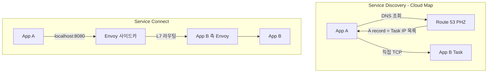
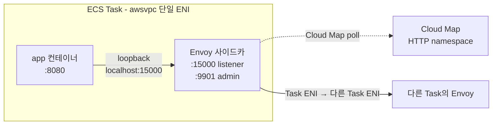
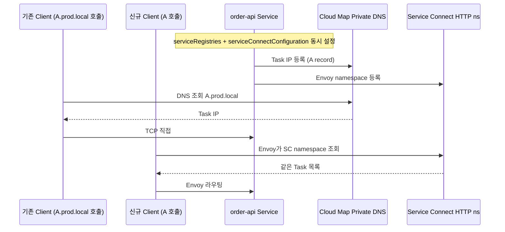

# ECS Service Connect 설정

## 개요

ECS Service Connect는 2022년 말에 나온 매니지드 service mesh다. Envoy 사이드카를 Task마다 자동으로 붙여주고, namespace 단위의 내부 DNS와 L7 로드밸런싱, 재시도, 메트릭, mTLS를 한 번에 처리한다. 설정은 Service 정의에 `serviceConnectConfiguration` 블록 하나를 추가하는 걸로 끝나고, 앱 코드는 `http://order-api:8080` 같은 짧은 DNS 이름으로 다른 서비스를 호출하면 된다.

처음 써보면 "이게 왜 진작에 없었지" 싶을 만큼 편하지만, 기존 Service Discovery(Cloud Map 기반)에서 넘어가는 경우 두 가지 방식이 한동안 섞여서 돌아가야 하기 때문에 개념과 데이터 플로우를 제대로 이해하지 않으면 "DNS가 가끔 이상한 IP로 돌아온다" 같은 증상이 나온다. 이 문서는 Service Connect 설정의 각 필드가 실제로 어떤 일을 하는지, 그리고 Cloud Map 방식과 어떻게 다른지 실무 관점에서 정리한다.

서비스 간 호출 패턴 전반은 [ECS Multi Task Connection](ECS_Multi_Task_Connection.md)에, 네트워킹 모드별 차이는 [ECS Networking Modes](ECS_Networking_Modes.md)에 더 자세히 있다. 이 문서는 그중 Service Connect에만 집중한다.

## Service Discovery vs Service Connect

이름이 비슷해서 헷갈리는데 동작 방식이 근본적으로 다르다.



Service Discovery는 Cloud Map에 Task의 IP를 A record로 등록하고, 클라이언트가 DNS를 직접 질의해서 IP 중 하나로 붙는 방식이다. 부하 분산은 클라이언트 측 DNS 라운드로빈에 의존한다. 이게 균등하게 동작하지 않는 경우가 많다. Java의 `InetAddress.getAllByName()`이 첫 IP만 캐싱해서 쓰거나, DNS TTL이 길어서 Task가 교체됐는데도 옛 IP로 한참 간다.

Service Connect는 Envoy를 Task마다 강제로 사이드카로 붙인다. 앱은 항상 같은 Task 안의 localhost Envoy로 요청을 보내고, Envoy가 namespace 내 다른 Task들의 Envoy로 L7 라우팅한다. least-request, 자동 재시도, 요청/응답 타임아웃, per-endpoint 메트릭이 Envoy 레벨에서 나온다. DNS는 여전히 쓰이지만 앱이 보는 건 "short name"이고 Envoy가 실제 endpoint 선택을 책임진다.

| 항목 | Service Discovery | Service Connect |
|------|-------------------|-----------------|
| 디스커버리 | Route 53 PHZ A record | Envoy 사이드카 + 내부 DNS |
| 로드밸런싱 | 클라이언트 DNS | Envoy L7 (least-request 등) |
| 메트릭 | CloudWatch Container Insights 정도 | 서비스별/엔드포인트별 요청·에러·지연 (ECS 콘솔) |
| 재시도 | 앱에서 직접 구현 | Envoy가 자동 |
| mTLS | 직접 구성 | Envoy 자동 (2024년 GA) |
| 리소스 추가 비용 | 없음 | Task당 CPU 약 256 / 메모리 약 64MiB |
| 설정 위치 | Service의 `serviceRegistries` | Service의 `serviceConnectConfiguration` |

두 방식은 같은 Service에 둘 다 설정할 수도 있다. 마이그레이션 기간에 일시적으로 병행할 때 쓴다.

## 사전 준비: Cloud Map namespace

Service Connect는 Cloud Map의 HTTP namespace를 기반으로 동작한다. 기존 Service Discovery가 쓰던 Private DNS namespace와는 타입이 다르다는 점이 첫 번째 함정이다.

```bash
aws servicediscovery create-http-namespace \
  --name prod \
  --description "Service Connect namespace for prod"
```

HTTP namespace는 Route 53 PHZ를 만들지 않는다. Service Connect가 자체적으로 VPC 내부 DNS resolver를 통해 이름을 해석한다. 그래서 이 namespace에 등록된 서비스는 `dig prod`로 외부에서 조회해도 안 나온다. 이건 정상이다.

기존 Service Discovery용 Private DNS namespace에 `prod.local` 같은 게 있어도 Service Connect에서 재활용하면 안 된다. 굳이 같이 쓰려면 HTTP namespace를 별도로 만들어야 한다. 클러스터 생성할 때 "default namespace"로 하나 지정할 수 있는데, Service별로 override가 가능하니 꼭 default에 맞출 필요는 없다.

```bash
aws ecs create-cluster \
  --cluster-name prod-cluster \
  --service-connect-defaults namespace=prod
```

## Task Definition: portMappings 설정

Service Connect가 동작하려면 Task Definition의 `portMappings`에 `name`과 `appProtocol`을 지정해야 한다. 이 두 필드가 빠지면 Service Connect가 "어떤 포트를 어떤 이름으로 노출할지" 알 수 없어서 등록 자체가 안 된다.

```json
{
  "family": "order-api",
  "networkMode": "awsvpc",
  "containerDefinitions": [
    {
      "name": "app",
      "image": "123456789012.dkr.ecr.ap-northeast-2.amazonaws.com/order-api:1.2.3",
      "portMappings": [
        {
          "name": "order-api-http",
          "containerPort": 8080,
          "protocol": "tcp",
          "appProtocol": "http"
        }
      ]
    }
  ]
}
```

`name`은 Task Definition 안에서 유일해야 하고, Service Connect가 이 이름을 키로 써서 `services` 배열과 매핑한다. 보통 "서비스이름-포트용도" 식으로 짓는다. `order-api-http`, `order-api-grpc`, `order-api-metrics` 같은 식이다.

`appProtocol`은 `http`, `http2`, `grpc` 중 하나다. 지정한 값에 따라 Envoy의 동작이 달라진다.

- `http`: HTTP/1.1 기준 라우팅. Keep-alive 관리, 요청 헤더 기반 트레이싱.
- `http2`: HTTP/2. 단일 connection에서 multiplexing.
- `grpc`: HTTP/2 + gRPC 특화 처리. `grpc-status` 헤더 기반 재시도, gRPC 전용 메트릭(메서드별 QPS, 에러 코드 분포).

지정하지 않으면 Envoy는 L4(TCP) passthrough로 동작한다. 이 경우 메트릭이 거의 안 나온다(요청 수, 에러율을 못 뽑음). WebSocket이나 raw TCP만 쓰면 몰라도, HTTP 서비스에서 `appProtocol`을 안 넣는 실수가 의외로 많다. 메트릭 탭이 비어있다면 가장 먼저 이걸 확인한다.

awsvpc 모드 기준이다. bridge 모드에서도 설정은 되지만 포트 매핑이 꼬이기 쉬워 실질적으로 awsvpc 전용이라고 봐야 한다.

## Service 정의: serviceConnectConfiguration

Service 쪽에서는 `serviceConnectConfiguration` 블록을 추가한다. 이 블록이 있으면 ECS가 Task를 띄울 때 Envoy 사이드카를 자동으로 주입한다.

```json
{
  "serviceName": "order-api",
  "cluster": "prod-cluster",
  "taskDefinition": "order-api:42",
  "desiredCount": 4,
  "launchType": "FARGATE",
  "networkConfiguration": {
    "awsvpcConfiguration": {
      "subnets": ["subnet-aaa", "subnet-bbb"],
      "securityGroups": ["sg-order-api"]
    }
  },
  "serviceConnectConfiguration": {
    "enabled": true,
    "namespace": "prod",
    "services": [
      {
        "portName": "order-api-http",
        "discoveryName": "order-api",
        "clientAliases": [
          {
            "port": 8080,
            "dnsName": "order-api"
          }
        ]
      }
    ],
    "logConfiguration": {
      "logDriver": "awslogs",
      "options": {
        "awslogs-group": "/ecs/serviceconnect/prod",
        "awslogs-region": "ap-northeast-2",
        "awslogs-stream-prefix": "envoy"
      }
    }
  }
}
```

각 필드의 의미를 하나씩 뜯어보자.

### namespace

이 Service가 속할 Cloud Map HTTP namespace. 같은 namespace 안의 서비스끼리만 서로 디스커버리 된다. "같은 환경(prod, staging, dev)끼리만 보이게" 격리하는 용도로 쓴다. 격리 수준이 더 세밀하게 필요하면 namespace를 여러 개 나눠도 되는데, 한 Task에서 여러 namespace로 걸쳐 호출은 못 한다. 클라이언트 측 Envoy가 자기 namespace의 서비스만 해석하기 때문이다.

### services 배열

이 Service가 "서버로서" 제공하는 엔드포인트 목록이다. 배열 하나하나가 하나의 external-facing 이름에 해당한다. 대부분은 원소 하나로 끝나지만, gRPC + HTTP를 같이 제공하는 경우엔 두 개가 될 수 있다.

- `portName`: Task Definition의 `portMappings.name`과 일치해야 한다. 오타 하나면 Service가 배포는 되는데 다른 서비스가 호출을 못 하는 상태가 된다.
- `discoveryName`: Cloud Map에 등록될 때 쓰는 내부 식별자. 생략하면 `portName`을 쓴다. 대부분 서비스 이름 그대로 쓴다.
- `clientAliases`: 이 서비스를 부르는 **클라이언트**가 쓸 DNS 이름과 포트 매핑. 여기가 핵심이다.

### clientAliases

클라이언트 입장에서 "뭐라고 부르면 너한테 도달하냐"를 정의한다. 여러 개 등록할 수 있다.

```json
"clientAliases": [
  { "port": 8080, "dnsName": "order-api" },
  { "port": 80,   "dnsName": "order-api" }
]
```

위 설정은 "다른 서비스가 `http://order-api:8080` 또는 `http://order-api:80`으로 부르면 이 Service의 Task로 라우팅"한다는 뜻이다. 앱이 80포트에서 하드코딩돼 있는 레거시 클라이언트가 있으면 그 클라이언트는 `:80`으로 호출하고, 신규 클라이언트는 `:8080`을 쓴다. 내부적으로 둘 다 Task Definition의 `containerPort: 8080`으로 꽂힌다.

`dnsName`은 namespace 안에서 유일해야 한다. 같은 namespace에 `order-api`라는 이름을 두 서비스가 쓰면 나중에 만든 쪽이 배포 실패한다.

## DNS 기반 서비스 간 호출

설정이 끝나면 클라이언트 Task에서는 이렇게 호출한다.

```java
// order-api 호출 (짧은 이름)
HttpResponse res = httpClient.send(
    HttpRequest.newBuilder()
        .uri(URI.create("http://order-api:8080/orders/123"))
        .GET()
        .build(),
    BodyHandlers.ofString()
);
```

`order-api`는 Envoy가 localhost에서 잡고 있는 내부 이름이다. Envoy가 Cloud Map을 주기적으로 poll하면서 `order-api`에 속한 Task들의 IP 목록을 관리하고, 실제 요청을 받으면 그중 하나로 L7 로드밸런싱한다.

Task 간 호출이 같은 namespace 내부로 한정되면 위처럼 `service-name:port`만 쓰면 된다. 다른 namespace에 있는 서비스를 호출해야 하면 FQDN 형식 `service.namespace:port`를 써야 한다.

```
http://order-api.prod:8080
```

다만 이 방식은 namespace 설정이 겹쳐 있을 때만 먹힌다. Service Connect 자체는 한 Service가 여러 namespace에 걸쳐 있는 것을 지원하지 않는다. 진짜 격리가 필요하면 namespace를 넘어가는 호출은 내부 ALB로 돌리는 게 낫다.

앱 코드 관점에서는 기존에 `http://prod-internal-alb.abc.elb.amazonaws.com:8080`으로 부르던 걸 `http://order-api:8080`으로 바꾸는 정도의 변경이다. 환경별로 DNS가 다를 이유도 사라진다. dev/staging/prod 모두 같은 코드가 같은 이름을 부른다.

## Envoy 사이드카 자동 주입

`serviceConnectConfiguration.enabled = true`로 켜면 ECS가 Task를 띄울 때 Envoy 컨테이너를 자동으로 Task에 붙인다. Task Definition에 명시적으로 추가할 필요가 없다. `ecs describe-tasks`로 보면 원래 정의한 컨테이너 외에 `ecs-service-connect-<uuid>` 이름의 컨테이너가 하나 더 떠 있는 걸 확인할 수 있다.



Envoy가 Task 안에서 잡는 주요 포트.

- `9901`: admin. 디버깅용 엔드포인트. `/clusters`, `/config_dump`로 Envoy 상태 확인.
- `15000번대`: inbound/outbound listener. 앱이 localhost로 꽂히는 지점.

앱 컨테이너에서 우연히 같은 포트를 쓰면 Task 기동이 실패한다. awsvpc 모드에서 Task 안 컨테이너들은 같은 ENI를 공유하기 때문에 컨테이너별 포트 충돌이 바로 에러로 터진다. 앱에서 Prometheus exporter를 9901에 띄우거나, gRPC health check를 15000에 매핑해 둔 경우가 제일 자주 겪는 사례다.

Envoy 사이드카의 리소스는 Task CPU/메모리에서 나눠 쓴다. 경험상 Task에 CPU 256 / 메모리 512MiB로 잡아두면 앱이 메모리 피크 때 Envoy까지 같이 OOM 난다. Service Connect를 쓸 거면 **Task 메모리는 최소 1024MiB 이상**, 앱 컨테이너 `memory` hard limit은 Task 메모리에서 Envoy 몫(CPU 256, 메모리 64MiB 정도) + log router 몫을 뺀 값으로 명시하는 게 안전하다. 그러면 앱이 폭증해도 자기 한계에서 OOM으로 멈추고 Envoy는 살아남는다.

Envoy 로그는 `logConfiguration`을 따로 지정하지 않으면 나오지 않는다. 위 예시처럼 `/ecs/serviceconnect/<namespace>` 같은 로그 그룹을 하나 두고 namespace 단위로 모으는 구성이 관리하기 편하다.

## 트래픽 메트릭

Service Connect의 가장 큰 실용적 이득이 메트릭이다. ECS 콘솔에서 Service를 선택하면 "Service Connect" 탭이 있고, 거기서 서비스별·엔드포인트별 RPS, 에러율(%), p50/p90/p99 지연을 시계열로 볼 수 있다. CloudWatch에도 `AWS/ECS/ServiceConnect` 네임스페이스로 같은 지표가 올라간다.

예전에는 이런 지표를 뽑으려면 앱에 Prometheus 클라이언트를 붙이고 exporter를 띄우고 CloudWatch agent나 AMP를 붙여야 했다. Service Connect가 있으면 Envoy 레벨에서 기본 HTTP/gRPC 지표가 그냥 나온다. 앱 코드 변경 없이 "어느 upstream으로 가는 호출의 p99가 튀었다"를 찾을 수 있다.

단, 이게 나오려면 `appProtocol`이 제대로 지정돼 있어야 한다. TCP passthrough로 떨어지면 메트릭 탭이 비어 보인다. 메트릭 탭이 안 뜰 때 체크 순서.

1. Task Definition `portMappings`에 `appProtocol` 있는지.
2. Service의 `serviceConnectConfiguration.services[].portName`이 `portMappings.name`과 일치하는지.
3. Task가 실제로 `ecs-service-connect-*` 컨테이너를 붙이고 있는지 (`describe-tasks`로 확인).
4. Envoy admin 엔드포인트에서 `/stats`를 확인. 직접 들어가기 어렵다면 CloudWatch `AWS/ECS/ServiceConnect` 지표 자체가 올라오는지 본다.

메트릭은 Service 단위가 아니라 "어느 서비스가 어느 서비스를 부르는가"의 pair 단위로 집계된다. `order-api`에서 보면 아웃바운드로 `payment-worker`, `inventory-svc` 각각의 메트릭이 따로 잡힌다. 마이크로서비스 간 의존성 시각화에 쓸 만하다.

## mTLS

2024년 GA된 기능이다. `serviceConnectConfiguration`에 mTLS 블록을 추가하면 같은 namespace 안의 Task 간 통신이 자동으로 mTLS로 암호화·인증된다. 인증서 발급·갱신은 AWS Private CA에 맡긴다.

```json
"serviceConnectConfiguration": {
  "enabled": true,
  "namespace": "prod",
  "services": [ ... ],
  "tls": {
    "kmsKey": "alias/aws/ecs",
    "roleArn": "arn:aws:iam::123456789012:role/ECSServiceConnectTLSRole",
    "issuerCertificateAuthority": {
      "awsPcaAuthorityArn": "arn:aws:acm-pca:ap-northeast-2:123456789012:certificate-authority/abc-def"
    }
  }
}
```

동작 원리는 양쪽 Envoy 사이드카가 Private CA에서 인증서를 받아 서로 검증한다. 앱 코드는 여전히 plain HTTP로 localhost:15000에 꽂고, Envoy가 outbound 구간을 TLS로 감싼다. 앱은 TLS를 전혀 몰라도 된다.

주의할 부분.

- Private CA 운영비가 별도로 든다. CA 월 요금 + 발급 인증서 요금이다. 작은 환경에선 의외로 비용이 눈에 띈다.
- mTLS를 켠 namespace와 안 켠 namespace가 섞이면 안 된다. 같은 namespace 안은 전부 켜거나 전부 끄거나 둘 중 하나.
- Private CA 권한이 있는 IAM role이 Service Connect에 위임돼야 한다. 위 예시의 `roleArn`이 그것. role trust policy에 `ecs.amazonaws.com`이 포함돼야 한다.
- mTLS를 켜면 Envoy의 CPU 사용량이 15~30% 정도 늘어난다. QPS가 높은 서비스에선 Task CPU 예약량을 조금 올려야 할 수 있다.

내부 트래픽을 암호화해야 하는 규정(PCI, 금융권 내부 감사 등)이 있을 때 가장 싸게 맞추는 방법이다. 앱마다 TLS 붙이고 인증서 갱신하는 것보다 훨씬 편하다.

## Service Discovery에서 마이그레이션

기존에 Service Discovery(Cloud Map Private DNS namespace)로 돌아가던 클러스터에서 Service Connect로 옮길 때 가장 흔한 실수를 먼저 정리한다.

**1. namespace 타입이 다르다.** 기존 `prod.local` 같은 Private DNS namespace는 Service Connect에서 못 쓴다. HTTP namespace를 별도로 만들어야 한다. 이름은 같아도 되고 달라도 되지만, 두 namespace가 같이 존재하게 된다. 마이그레이션 완료 전까지 지우면 안 된다.

**2. 앱 DNS 호출이 바뀐다.** Service Discovery 시절에는 `http://order-api.prod.local:8080` 같은 FQDN을 썼다. Service Connect에서는 short name `http://order-api:8080`이다. 앱 설정을 바꿔야 한다. 환경변수로 빼둔 경우가 많아 보통은 간단하지만, 코드에 하드코딩된 경우가 있다.

**3. 보안 그룹이 바뀔 수 있다.** Service Discovery는 A record로 Task IP를 바로 물려줬기 때문에 클라이언트 SG에서 서버 Task SG로 직접 꽂혔다. Service Connect도 물리적으로는 Task ENI 대 Task ENI이지만, Envoy가 중간에 들어가면서 포트가 달라질 수 있다. `containerPort`가 그대로면 대부분 SG 그대로 쓸 수 있는데, 전환 과정에서 "갑자기 연결 거부"가 나면 SG 쪽을 먼저 본다.

**4. 병행 운영 기간을 두는 게 안전하다.** Service에 `serviceRegistries`(Service Discovery)와 `serviceConnectConfiguration`(Service Connect)을 같이 설정할 수 있다. 서버 쪽 Service를 먼저 둘 다 켠다. Task가 Cloud Map Private DNS에도 등록되고 Service Connect namespace에도 등록된다.



이 상태에서 클라이언트들을 하나씩 Service Connect 쪽으로 옮기고, 마지막으로 서버 Service에서 `serviceRegistries`를 떼면 마이그레이션이 끝난다. 이 순서가 중요하다. 서버 쪽 등록을 먼저 끊으면 아직 옮기지 않은 클라이언트가 NXDOMAIN을 받는다.

**5. 메트릭 기준선이 달라진다.** Service Discovery 시절에는 CloudWatch나 앱 메트릭으로 잡던 에러율·지연 지표가 Service Connect로 옮기면 Envoy 레벨에서 나오는 값과 미묘하게 다르다. Envoy가 재시도를 수행하는 만큼 앱 로그에는 안 보이던 "성공한 재시도"가 포함된다. 평균 지연이 내려가고 5xx 지표가 줄어드는 경향이 있는데, 실제 성능이 좋아진 게 아니라 측정 지점이 바뀐 거다. 마이그레이션 직후 Alarm 임계값을 재조정해야 한다.

**6. 클라이언트가 레거시 라이브러리일 때.** Service Discovery는 일반 DNS A record라 어떤 HTTP 클라이언트든 그냥 된다. Service Connect도 DNS 자체는 일반적이지만, 앱의 DNS 캐시 TTL이 길면 Envoy가 들어가 있는 endpoint 목록 변경을 못 따라잡는다. JVM 기반 앱이면 `networkaddress.cache.ttl=30` 정도로 낮춰두는 게 안전하다. 이 부분은 Service Discovery 시절에도 이슈였지만, Envoy가 들어오면서 endpoint 교체 빈도가 더 잦아진다.

## 배포 순서와 Task 기동 실패

Service Connect를 처음 켤 때 자주 터지는 에러들.

**"Unable to find port in task definition"**. `serviceConnectConfiguration.services[].portName`이 Task Definition `portMappings.name`과 정확히 일치하지 않는다. 오타나 환경별로 하나는 업데이트됐는데 하나는 옛 리비전을 쓰는 경우. Task Definition 리비전을 업데이트하면서 Service도 같이 리비전 바꿔줘야 한다.

**"Namespace not found"**. 클러스터 default namespace에만 기대고 Service 쪽에 namespace를 명시하지 않았는데, 클러스터 default가 비어 있거나 다른 region을 가리킨다. `serviceConnectConfiguration.namespace`는 되도록 Service에서 명시해 두는 게 안전하다.

**Task는 뜨는데 호출이 안 됨**. 양쪽 Service 모두 `serviceConnectConfiguration`이 켜져 있어야 한다. 서버만 켜고 클라이언트 쪽을 안 켠 경우, 클라이언트 Task에는 Envoy가 안 붙어서 `http://order-api:8080` 이름을 해석할 리가 없다. "Service Connect는 서버와 클라이언트 양쪽에 모두 켜야 한다"가 핵심 규칙이다.

**배포 중 503이 잠깐 뜸**. Envoy가 새 Task를 `HEALTHY`로 인식하는 데 몇 초 걸린다. `minimumHealthyPercent: 100`에 Task `stopTimeout: 90` 이상이면 거의 대부분 매끄럽게 넘어간다. Deployment 설정은 [ECS Deployment Strategies](ECS_Deployment_Strategies.md), 컨테이너 의존성은 [ECS Container Dependencies](ECS_Container_Dependencies.md)에 정리돼 있다.

## 운영에서 본 Service Connect의 한계

실전에서 Service Connect가 맞지 않거나 조심해야 하는 경우도 있다.

- **외부 클라이언트(모바일, 웹)에서의 호출은 절대 못 한다.** VPC 내부 Task 간 통신 전용이다. 외부 노출은 여전히 ALB가 담당한다.
- **HTTP/1.1 keep-alive를 강하게 쓰는 앱의 connection pool 관리가 바뀐다.** Envoy가 중간에 들어가면서 앱 → Envoy, Envoy → 원격 Envoy 두 구간의 connection이 따로 관리된다. 앱 쪽 connection pool을 크게 잡아둔 설정이 원격 Task 교체에 예민하지 않게 바뀐다. 일반적으로는 좋은 방향인데, 튜닝된 앱에선 동작이 달라 보일 수 있다.
- **L4 전용 프로토콜(전통 TCP, 커스텀 binary)은 이득이 적다.** Envoy가 TCP passthrough로만 동작해서 메트릭, 재시도 같은 L7 이점을 못 본다. 이 경우 그냥 Cloud Map이나 NLB를 쓰는 게 낫다.
- **네임스페이스를 넘는 호출이 안 된다.** 조직이 namespace를 환경 단위가 아니라 팀 단위로 잘게 쪼갠 경우 서비스 간 호출이 막힌다. 시작 시점에 namespace 전략을 확실히 정해야 한다.
- **Envoy가 블랙박스다.** Envoy 버전은 AWS가 관리하고, 커스텀 필터를 끼우거나 세부 튜닝을 할 수 없다. 아주 정교한 트래픽 관리가 필요하면 App Mesh(관리형) 또는 직접 Istio를 올리는 쪽으로 간다. 다만 App Mesh는 2026년에 EOL 예정이라 신규 도입은 Service Connect 쪽이 맞다.

기본 사용처는 단순하다. 신규 마이크로서비스는 awsvpc + Service Connect로 시작하는 게 장기적으로 가장 덜 꼬인다. 레거시 Service Discovery가 있으면 위 순서대로 병행 운영 → 클라이언트 이관 → 서버 정리로 옮긴다. 트래픽 메트릭과 mTLS를 공짜로 얻는 게 가장 큰 이득이고, 대신 Task 리소스에 Envoy 몫을 빼먹지 않는 게 유일한 운영상 주의점이다.
