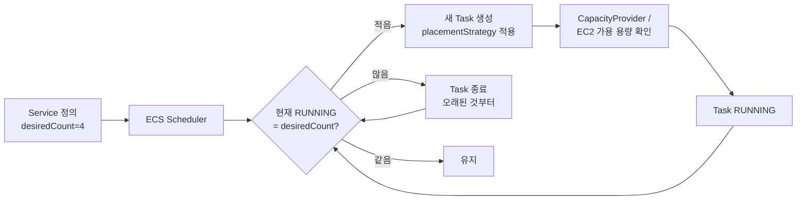
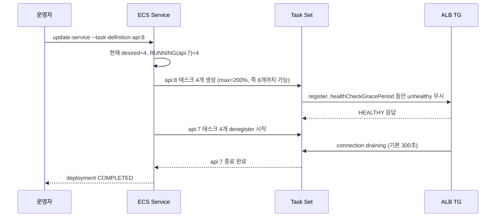
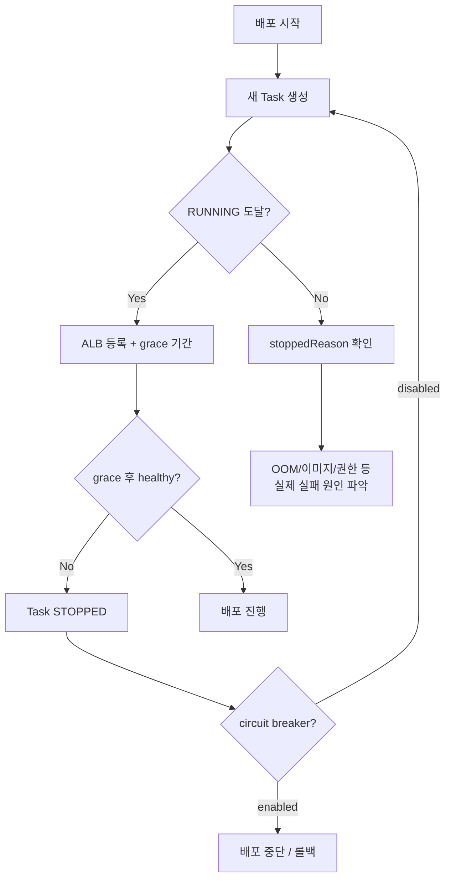

# ECS Service 설정 심화

## 개요

ECS에서 Service는 "Task Definition으로 정의한 태스크를 몇 개, 어디에, 어떻게 띄우고 유지할지"를 책임지는 컨트롤 플레인 객체다. Task Definition이 **무엇을 띄울지(what)**를 정의한다면 Service는 **얼마나, 어디에, 어떻게 운영할지(how many / where / how)**를 결정한다. 둘을 분리해 둔 덕분에 같은 Task Definition을 dev/staging/prod에서 다른 desiredCount, 다른 서브넷, 다른 ALB로 돌릴 수 있다.

Service를 한 번이라도 운영해본 사람은 안다. desiredCount만 정해두면 알아서 굴러갈 것 같지만, 실제로는 deploymentConfiguration의 퍼센트, ALB 헬스체크 grace period, capacity provider strategy, placementStrategy 같은 파라미터가 서로 얽혀서 한 곳을 잘못 건드리면 배포가 무한 롤링하거나 태스크가 STOPPED → PENDING → STOPPED를 반복한다. 이 문서는 Service 정의의 주요 필드를 실제 운영 관점에서 풀어 본다.

## Service의 본질: Desired State Reconciliation

Service의 핵심 책임은 단 하나다. **현재 RUNNING 태스크 수를 desiredCount와 일치시키는 것.** 쿠버네티스의 Deployment/ReplicaSet과 같은 패턴이다. ECS Scheduler가 1초 단위에 가까운 주기로 클러스터 상태를 확인하면서 차이를 메운다.



이 reconciliation 루프 때문에 발생하는 현상이 몇 가지 있다.

- 태스크를 수동으로 `aws ecs stop-task`로 죽이면 Service가 즉시 새 태스크를 띄운다. 디버깅 목적으로 죽였는데 다시 살아나서 당황하는 경우가 흔하다. 정말 하나만 죽이고 싶으면 desiredCount를 줄여야 한다.
- 태스크가 자체 종료(exit code != 0)되면 Service가 새 태스크로 교체한다. 컨테이너 안에서 SIGTERM 처리를 잘못해서 종료 코드가 0이 안 나오면 무한 재시작 루프에 빠진다.
- EC2 인스턴스 장애로 태스크가 사라지면 Capacity Provider가 인스턴스를 띄울 때까지 PROVISIONING 상태로 대기한다. 이 사이에 desiredCount 미달이 길어진다.

Task Definition은 "스펙 시트"고 Service는 "운영자"라고 생각하면 둘의 역할 구분이 명확해진다. Task Definition 리비전을 새로 만들어도 Service에서 update-service로 그 리비전을 가리키지 않으면 운영 중인 태스크는 그대로다.

## desiredCount

가장 단순해 보이지만 의외로 신경 쓸 게 많은 필드.

```bash
aws ecs update-service \
  --cluster prod-cluster \
  --service api-service \
  --desired-count 6
```

명시적으로 `update-service --desired-count`를 호출하기 전까지 Service의 desiredCount는 변하지 않는다. 그런데 Application Auto Scaling을 붙여 놓으면 외부에서 desiredCount가 자동으로 바뀐다. 이 때문에 IaC(Terraform, CloudFormation)로 Service를 관리하면서 Auto Scaling을 같이 쓰면 desiredCount가 drift(실제 상태와 코드 정의 불일치)를 일으킨다.

Terraform에서는 `lifecycle { ignore_changes = [desired_count] }`로 처리하는 게 정석이다. CloudFormation은 Service Auto Scaling이 desiredCount를 수정해도 스택 업데이트 시 무시하도록 설계돼 있다. 이 동작을 모르고 매번 코드의 desiredCount=2로 강제로 되돌리면 트래픽 폭주 시간대에 용량이 죽는다.

desiredCount를 0으로 두면 Service는 살아있지만 태스크는 모두 종료된다. 일시 중단할 때 Service를 삭제하지 않고 desiredCount=0으로 두면 ALB 타겟 그룹 연결이나 Service ARN을 보존할 수 있어 유용하다.

## deploymentConfiguration

Rolling Update에서 가장 중요한 두 값이 여기에 있다. 자세한 동작 원리는 [ECS Deployment Strategies](ECS_Deployment_Strategies.md) 문서에 정리해 두었고, 여기서는 Service 설정 관점에서 다시 짚는다.

### minimumHealthyPercent

배포 중에 유지해야 하는 RUNNING & HEALTHY 태스크의 **하한선**이다. desiredCount 대비 퍼센트로 표현하고, 계산은 floor(소수점 내림). 기본값은 100.

- desiredCount=4, minimumHealthyPercent=100 → 항상 4개 이상 유지. 기존 4개 그대로 두고 새 태스크 4개를 추가로 띄운 뒤 기존 것을 내린다(maximumPercent=200 가정).
- desiredCount=4, minimumHealthyPercent=50 → floor(4*0.5)=2. 2개까지 동시에 내릴 수 있다. 신버전 2개 띄우고 구버전 2개 내리고를 반복.
- desiredCount=3, minimumHealthyPercent=50 → floor(3*0.5)=1. **1개만 살아있어도 통과한다.** 이 부분이 함정이다. 50%라고 해서 절반이 보장되는 게 아니다.

### maximumPercent

배포 중에 일시적으로 띄울 수 있는 태스크의 **상한선**. desiredCount 대비 퍼센트, 기본값 200. 이 값이 작으면 새 태스크를 띄울 여유가 없어 배포 자체가 시작되지 않는다.



운영 환경에서 자주 쓰는 조합:

- **100/200**: 가장 안전. 신버전 전부 띄우고 구버전 내림. 일시적으로 리소스가 두 배.
- **100/150**: 절반씩 교체. 리소스 1.5배. 큰 클러스터에서 쓸 만한 절충안.
- **50/100**: 리소스 여유가 없을 때. 배포 중 용량이 절반으로 떨어진다는 점 감안해야 한다.
- **0/100**: 절대 프로덕션에서 쓰지 말 것. 짧은 다운타임이 발생한다.

### deploymentCircuitBreaker

`deploymentConfiguration.deploymentCircuitBreaker.enable=true`로 켜면 배포가 실패할 때 자동으로 이전 리비전으로 롤백한다. `rollback=true`까지 켜야 자동 롤백이 동작하고, false면 실패 감지만 한다. 새 태스크가 연속으로 STOPPED 상태가 되거나 ALB 헬스체크를 일정 시간 동안 통과하지 못하면 ECS가 배포 실패로 판단한다.

이 기능을 켜지 않으면 잘못된 이미지를 배포했을 때 ECS가 끝없이 새 태스크를 띄우고 죽이고를 반복한다. 새 운영 Service라면 무조건 켜는 게 좋다.

## launchType vs capacityProviderStrategy

Service를 만들 때 둘 중 하나만 지정해야 한다. 같이 지정하면 API가 거부한다.

### launchType

`FARGATE`, `EC2`, `EXTERNAL` 중 하나를 직접 지정. 단순하고 명시적이지만 캐파시티가 없어도 그냥 PROVISIONING 상태로 대기만 한다. EC2 Launch Type일 때 ASG가 인스턴스를 띄우게 하려면 별도로 ASG의 desired capacity를 늘려야 한다. 즉 ECS가 EC2 용량을 자동으로 키워주지 않는다.

```json
{
  "launchType": "FARGATE",
  "platformVersion": "LATEST"
}
```

### capacityProviderStrategy

여러 Capacity Provider에 가중치(weight)와 base를 지정해 태스크를 분산한다. EC2 Capacity Provider라면 ECS Managed Scaling이 알아서 ASG 용량까지 조절한다.

```json
{
  "capacityProviderStrategy": [
    { "capacityProvider": "FARGATE", "weight": 1, "base": 2 },
    { "capacityProvider": "FARGATE_SPOT", "weight": 4, "base": 0 }
  ]
}
```

위 예시는 "최소 2개는 FARGATE에, 나머지는 FARGATE:FARGATE_SPOT = 1:4 비율로 분산"한다는 뜻이다. base는 절대 개수, weight는 비율이라 의미가 다르다. SPOT 인스턴스가 회수되면 ECS가 자동으로 새 태스크를 다른 Capacity Provider에 띄운다. 비용 최적화를 노린다면 이 패턴이 거의 유일한 답이다.

자세한 capacity provider 설정과 managed scaling 동작은 [ECS Capacity Providers](ECS_Capacity_Providers.md) 문서를 참고.

선택 기준은 단순하다. **새 Service라면 capacityProviderStrategy를 써라.** launchType은 레거시 호환과 단순한 케이스에만 남겨두는 게 좋다. 한 번 launchType으로 만든 Service를 capacityProviderStrategy로 바꾸려면 Service를 재생성해야 한다는 점도 미리 알아두자.

## platformVersion

Fargate 전용 필드. `LATEST`, `1.4.0`, `1.3.0` 같은 버전 문자열을 지정한다. 기본값은 `LATEST`인데, 이게 항상 좋은 건 아니다.

`LATEST`는 새 태스크가 생성될 때마다 그 시점의 최신 플랫폼 버전을 쓴다. 즉 배포가 일어나지 않아도 ECS 내부에서 패치가 발생하면 태스크가 다른 버전으로 교체될 수 있다. 1.4.0과 1.3.0은 EFS 지원 여부, ENI 트렁킹, 블록 스토리지 같은 기능 차이가 있다. EFS를 쓰는 Service인데 platformVersion을 명시하지 않았다가 어느 날 1.3.0 호환 태스크가 떠서 마운트 실패하는 사례가 있었다.

**프로덕션에서는 platformVersion을 명시적으로 고정하는 걸 권장한다.** 변경할 때는 의도적으로 update-service로 바꿔야 한다.

## loadBalancers (ALB 타겟 그룹 바인딩)

Service 생성 시점에 ALB 타겟 그룹을 연결하는 부분이다. 한 번 설정하면 **변경이 매우 제한적**이라는 점이 가장 중요하다.

```json
{
  "loadBalancers": [
    {
      "targetGroupArn": "arn:aws:elasticloadbalancing:...:targetgroup/api-tg/abc",
      "containerName": "api",
      "containerPort": 8080
    }
  ]
}
```

- `containerName`은 Task Definition의 containerDefinitions 안에 있는 이름과 정확히 일치해야 한다.
- `containerPort`는 Task Definition의 portMappings에 정의된 컨테이너 포트.
- awsvpc 네트워크 모드면 타겟 그룹 타입이 `ip`여야 하고, bridge 모드면 `instance`여야 한다.

ECS가 Service에 등록된 태스크가 RUNNING이 되면 자동으로 이 타겟 그룹에 register하고, 종료될 때 deregister한다. 운영자가 직접 타겟 그룹을 건드릴 일이 없다.

### 변경의 제약

- ECS Rolling Update 컨트롤러에서는 loadBalancers 배열 자체를 변경할 수 없다. 타겟 그룹을 바꾸려면 Service를 삭제하고 재생성해야 한다.
- CodeDeploy(Blue/Green) 컨트롤러를 쓰면 두 개의 타겟 그룹을 미리 등록해 두고 리스너 룰만 바꾼다.
- ECS 업데이트로 일부 ALB 관련 변경이 가능해졌지만(2022년 이후 일부 기능 제한적으로 풀림), 운영 중인 Service에서 함부로 시도하지 말 것.

새 Service를 만들 때 타겟 그룹을 빠뜨리는 실수도 흔하다. 처음에 internal 호출용으로 ALB 없이 만들었다가 나중에 ALB를 붙이려면 Service를 다시 만들어야 한다. 처음 설계할 때 ALB 연결 가능성이 조금이라도 있으면 빈 타겟 그룹이라도 만들어 붙여 두는 게 안전하다.

여러 타겟 그룹에 같은 컨테이너의 다른 포트를 묶는 것도 가능하다. 예를 들어 8080은 public ALB, 9090은 internal ALB에 노출하는 식이다.

## healthCheckGracePeriodSeconds

ALB 타겟 그룹의 헬스체크 결과를 ECS가 무시하는 grace 기간. 0~2147483647초 범위, 기본값 0. **JVM 애플리케이션이나 부팅이 느린 컨테이너에서 이 값을 안 잡으면 무한 롤링 배포 지옥에 빠진다.**

동작 시나리오:

1. 새 태스크가 RUNNING 상태가 됨
2. 타겟 그룹에 register
3. ALB가 헬스체크 시작 (예: 30초마다 호출)
4. 컨테이너가 아직 부팅 중이라 응답 못 함 → unhealthy
5. healthCheckGracePeriod 동안은 ECS가 이 unhealthy 상태를 무시
6. grace 기간 끝났는데 여전히 unhealthy → ECS가 태스크 STOPPED, 새 태스크 생성
7. 새 태스크도 같은 시간이 걸리니 또 5번으로 → **무한 루프**

부팅에 60초 걸리는 Spring Boot 애플리케이션이라면 healthCheckGracePeriodSeconds=120 정도는 줘야 한다. 신중하게 90~180초 사이에서 실측해 정한다. 너무 길게(예: 600초) 잡으면 진짜로 망가진 컨테이너도 10분간 살려두게 되니 적당한 값을 찾아야 한다.

이 값은 Service에 ALB가 붙어 있을 때만 의미가 있다. ALB 없는 Service라면 설정해도 동작하지 않는다.

## enableExecuteCommand

ECS Exec 기능을 켤지 말지 결정한다. true로 두면 운영 중인 태스크에 `aws ecs execute-command`로 SSM 세션을 열어 셸에 들어갈 수 있다. SSH 없이 컨테이너 내부에 접근하는 사실상 유일한 정상적인 방법이다.

```bash
aws ecs execute-command \
  --cluster prod-cluster \
  --task <task-arn> \
  --container api \
  --interactive \
  --command "/bin/sh"
```

활성화하려면 몇 가지 조건을 다 맞춰야 한다.

- Service에서 `enableExecuteCommand=true`
- Task Role(taskRoleArn)에 SSM Messages 권한(`ssmmessages:CreateControlChannel`, `CreateDataChannel`, `OpenControlChannel`, `OpenDataChannel`) 부여
- 컨테이너 이미지 안에 `/bin/sh` 또는 `/bin/bash`가 존재
- Fargate면 platformVersion 1.4.0 이상

설정을 enable에서 disable로(또는 그 반대로) 바꿔도 **이미 떠 있는 태스크에는 적용되지 않는다.** Service를 update하고 태스크를 재배포해야 새 설정이 반영된다. 이 점을 모르고 "켰는데 왜 안 되지" 하는 경우가 많다.

보안 측면에서는 prod에서 enableExecuteCommand를 항상 켜두는 게 위험할 수 있다는 의견과, 디버깅 도구로 항상 켜두는 게 운영 효율을 높인다는 의견이 갈린다. 실무에서는 켜두되 IAM 정책으로 execute-command 호출 권한을 엄격히 제한하는 방향으로 운영하는 곳이 많다. 모든 호출은 CloudTrail에 기록된다.

## propagateTags

태스크에 적용될 태그의 출처를 결정한다. `TASK_DEFINITION`, `SERVICE`, 또는 빈 값. 빈 값이면 태스크에 태그가 안 붙는다.

비용 분석을 Cost Allocation Tag로 하는 조직이라면 이 값을 반드시 설정해야 한다. Service 단위로 태그를 관리하고 싶으면 `SERVICE`, Task Definition에서 관리하고 싶으면 `TASK_DEFINITION`을 쓴다. 일반적으로는 환경(prod/dev), 팀, 서비스명 같은 메타데이터를 Service에 붙이고 propagateTags=SERVICE로 두는 게 관리하기 편하다.

태그 전파는 태스크 생성 시점에 일어난다. Service의 태그를 나중에 바꿔도 이미 떠 있는 태스크의 태그는 바뀌지 않는다.

## schedulingStrategy

`REPLICA`(기본값)와 `DAEMON` 두 가지가 있다.

### REPLICA

desiredCount만큼의 태스크를 클러스터 어딘가에 분산해서 띄운다. 일반적인 웹 서비스, API 서비스가 모두 여기에 해당한다. placementStrategy로 어디에 띄울지 제어한다.

### DAEMON

EC2 Launch Type 전용. **각 EC2 인스턴스마다 정확히 한 개의 태스크**를 띄운다. desiredCount는 무시되고, ECS가 클러스터에 등록된 인스턴스 수에 맞춰 자동으로 태스크 수를 조절한다.

```json
{
  "schedulingStrategy": "DAEMON",
  "launchType": "EC2"
}
```

쓰는 용도는 거의 정해져 있다.

- 로그 수집기(Fluent Bit, Datadog Agent 등을 노드별로 1개씩)
- 모니터링 에이전트(CloudWatch Agent, Prometheus node-exporter)
- 노드 레벨 보안 에이전트

DAEMON은 Fargate에서 못 쓴다. Fargate는 인스턴스 개념 자체가 없기 때문이다. Fargate에서 노드 레벨 에이전트를 돌리고 싶다면 사이드카 패턴으로 각 태스크에 같이 띄우는 수밖에 없다.

EC2 인스턴스가 클러스터에 등록되는 즉시 DAEMON 태스크가 띄워진다. 인스턴스 종료 시 함께 사라진다. 배포 정책은 자동으로 maximumPercent=100, minimumHealthyPercent=0으로 강제된다. 다른 값을 줘도 무시된다.

## placementStrategy / placementConstraints

EC2 Launch Type일 때 태스크를 어느 인스턴스에 배치할지 결정하는 규칙. Fargate는 인스턴스 선택 자체가 없으니 이 설정이 적용되지 않는다.

### placementStrategy

배치 우선순위를 정한다. 배열에 여러 개를 넣을 수 있고 순서대로 적용된다.

| 타입 | 의미 | 일반적 용도 |
|------|------|-------------|
| `binpack` | CPU 또는 메모리 사용량이 가장 많은 인스턴스부터 채운다 | 인스턴스 수 최소화, 비용 절감 |
| `spread` | 지정한 attribute 기준으로 균등 분산 | AZ 분산, 인스턴스 ID 분산 |
| `random` | 무작위 | 거의 안 씀 |

가장 흔한 조합은 `spread by attribute:ecs.availability-zone` + `spread by instanceId`다. AZ에 먼저 균등 분산하고, 그 안에서 인스턴스에 균등 분산한다.

```json
{
  "placementStrategy": [
    { "type": "spread", "field": "attribute:ecs.availability-zone" },
    { "type": "spread", "field": "instanceId" }
  ]
}
```

binpack은 비용 최적화 클러스터에서 유용하다. 단 binpack을 쓰면 한 인스턴스에 태스크가 몰리니 인스턴스 장애 시 영향이 커진다. AZ 분산이 깨질 수 있어 가용성과 비용 사이 트레이드오프를 의식해야 한다.

### placementConstraints

배치 제약. 두 가지 타입이 있다.

- `distinctInstance`: 같은 인스턴스에 같은 Service의 태스크가 두 개 이상 못 뜨게 한다. desiredCount > 인스턴스 수면 PROVISIONING 상태로 영원히 대기한다.
- `memberOf` + Cluster Query Language: `attribute:ecs.instance-type =~ m5.*` 같은 식으로 특정 인스턴스 타입에만 배치.

```json
{
  "placementConstraints": [
    { "type": "memberOf", "expression": "attribute:env == prod" }
  ]
}
```

distinctInstance를 잘못 쓰면 배포가 안 진행된다. desiredCount=4인데 인스턴스가 4대뿐이면 maximumPercent=200으로 8개를 띄우고 싶어도 distinctInstance 제약 때문에 못 띄운다. 배포 자체가 멈춘다. distinctInstance를 쓰려면 인스턴스 수가 desiredCount의 두 배 이상은 돼야 한다.

## networkConfiguration

awsvpc 네트워크 모드(Fargate면 무조건 awsvpc)일 때 필수. 서브넷, 보안그룹, public IP 할당 여부를 지정한다.

```json
{
  "networkConfiguration": {
    "awsvpcConfiguration": {
      "subnets": ["subnet-aaa", "subnet-bbb", "subnet-ccc"],
      "securityGroups": ["sg-xxx"],
      "assignPublicIp": "DISABLED"
    }
  }
}
```

### subnets

여러 AZ의 서브넷을 넣어두면 ECS가 알아서 AZ 분산해서 태스크를 띄운다. 주의할 점은 **반드시 프라이빗 서브넷을 쓸 것**. 퍼블릭 서브넷에 띄우면 NAT Gateway 비용이 절감되긴 하지만 보안 노출 면적이 커진다. 프라이빗 서브넷에 띄우고 NAT Gateway나 VPC Endpoint를 통해 외부 통신을 처리하는 게 정석이다.

서브넷의 IP 풀이 부족해지면 새 태스크가 PROVISIONING에서 멈춘다. /28 같은 작은 서브넷에 awsvpc 모드 태스크를 잔뜩 띄우면 금방 IP가 마른다. ENI 하나당 IP를 하나씩 잡아먹기 때문에 클러스터 규모를 미리 계산해 서브넷을 잡아야 한다. 최소 /24 권장.

### securityGroups

태스크 단위로 보안 그룹이 적용된다. 이게 awsvpc 모드의 가장 큰 장점이다. ALB의 보안 그룹에서 inbound로 80/443을 허용하고, 태스크 보안 그룹은 ALB 보안 그룹으로부터의 8080만 허용하는 식으로 다층 보안을 구성한다.

```
ALB SG: inbound 0.0.0.0/0:443
Task SG: inbound from ALB SG :8080
```

DB 보안 그룹에서는 Task SG로부터의 inbound만 허용하면 깔끔하게 정리된다. CIDR 기반으로만 보안 그룹을 짜면 EC2 IP가 바뀔 때마다 갱신해야 하는데, SG 참조를 쓰면 그럴 필요가 없다.

### assignPublicIp

`ENABLED` 또는 `DISABLED`. Fargate에서 ECR에서 이미지를 pull하려면 외부 인터넷 접근이 필요하다. 프라이빗 서브넷에 NAT Gateway나 VPC Endpoint(ECR, S3, CloudWatch Logs용)가 없는 상태에서 `assignPublicIp=DISABLED`로 두면 이미지 pull이 실패한다.

운영 권장사항: **VPC Endpoint를 만들어 두고 assignPublicIp=DISABLED로 운영한다.** 필요한 엔드포인트는 com.amazonaws.{region}.ecr.api, ecr.dkr, s3, logs, secretsmanager, ssmmessages 정도. NAT Gateway만 쓸 수도 있지만 트래픽 비용이 누적되므로 안정적인 대규모 환경이면 VPC Endpoint가 유리하다.

## ALB 헬스체크 실패로 인한 무한 재생성 트러블슈팅

ECS Service 운영하면서 가장 자주 만나는 사고 중 하나. 증상은 보통 이렇게 보인다.

- `aws ecs describe-services`로 보면 deployment가 IN_PROGRESS인 채로 끝나지 않음
- `aws ecs list-tasks`로 보면 RUNNING 태스크가 계속 바뀌고 있음
- CloudWatch에서 `EssentialContainerExited` 이벤트가 분당 한두 번씩 찍힘
- ALB Target Group에서 healthy host count가 0과 1을 오감

진단 순서:

### 1. healthCheckGracePeriodSeconds 확인

가장 흔한 원인. 컨테이너 부팅 시간이 grace period보다 길면 100% 이 패턴이 발생한다.

```bash
aws ecs describe-services --cluster <c> --services <s> \
  --query 'services[0].healthCheckGracePeriodSeconds'
```

값이 0 또는 너무 작으면 부팅 시간을 측정해서 충분히 늘린다. 임시로 디버깅하려면 ALB 헬스체크 자체를 잠깐 느슨하게(interval=30, threshold=5) 만들어 grace 기간 비슷한 효과를 낼 수도 있다.

### 2. ALB 헬스체크 경로와 응답 확인

태스크는 정상이지만 헬스체크 경로 응답이 잘못된 경우. ALB 타겟 그룹의 헬스체크 path(예: `/health`)가 실제로 200을 반환하는지 직접 확인한다.

```bash
# ECS Exec로 태스크에 들어가서 직접 호출
aws ecs execute-command --cluster <c> --task <t> --container <con> \
  --interactive --command "/bin/sh"

# 컨테이너 안에서
curl -v http://localhost:8080/health
```

종종 헬스체크 path가 인증을 요구하거나(401), 리다이렉트(301)를 반환하거나, content-type 문제로 실패하는 경우가 있다. ALB의 success code를 200,301,302 같은 식으로 넓게 잡거나 헬스체크 전용 경로를 인증 없이 200을 반환하도록 만든다.

### 3. 보안 그룹 inbound 확인

ALB가 태스크의 헬스체크 포트로 패킷을 못 보내면 헬스체크는 무조건 실패한다. Task SG의 inbound에 ALB SG로부터의 컨테이너 포트가 열려 있는지 확인한다. awsvpc 모드면 컨테이너 포트와 호스트 포트가 동일하니 그 포트 그대로, bridge 모드 동적 포트면 32768~65535 전체를 ALB SG에 열어줘야 한다.

### 4. Task Definition 헬스체크와 ALB 헬스체크 충돌

Task Definition의 containerDefinitions에 healthCheck가 정의돼 있고, 이 docker 헬스체크가 unhealthy를 반환하면 ECS가 태스크를 STOPPED 처리한다. ALB 헬스체크와 별개로 동작한다. 두 헬스체크가 서로 다른 경로를 쳐서 한쪽이 실패하는 패턴이 의외로 흔하다.

```bash
aws ecs describe-task-definition --task-definition <td> \
  --query 'taskDefinition.containerDefinitions[].healthCheck'
```

두 헬스체크는 같은 path를 쓰거나, 둘 중 하나로 통일하는 게 운영하기 편하다.

### 5. 메모리 부족으로 OOMKilled

`describe-tasks` 결과의 `stoppedReason`을 확인한다.

```bash
aws ecs describe-tasks --cluster <c> --tasks <t> \
  --query 'tasks[0].stoppedReason'
```

`OutOfMemoryError: Container killed due to memory usage` 같은 메시지가 나오면 Task Definition의 메모리 한도를 늘려야 한다. ALB 헬스체크와 무관하게 컨테이너가 죽고 있는데 헬스체크 실패처럼 보이는 케이스다.

### 6. deploymentCircuitBreaker로 자동 멈춤

`deploymentConfiguration.deploymentCircuitBreaker.enable=true`가 설정돼 있으면 ECS가 일정 횟수 실패 후 배포를 멈춘다. 이때는 사고 확산을 막는 효과가 있어 좋다. enable이 false면 무한 루프가 진짜로 무한이라 비용도 같이 폭발한다. 운영 Service라면 반드시 켜두자.



## 정리

Service 정의는 한 번 잘 만들어 두면 다시 손댈 일이 적지만, 처음 잘못 잡으면 반복적으로 사고를 부른다. 실무에서 신경 써야 할 핵심을 다시 정리한다.

- desiredCount는 Auto Scaling과 함께 쓸 때 IaC drift 처리를 잊지 말 것
- deploymentConfiguration의 minimumHealthyPercent/maximumPercent는 floor 계산임을 의식하고 클러스터 용량과 함께 검토할 것
- 새 Service는 capacityProviderStrategy + deploymentCircuitBreaker(rollback=true) 조합을 기본으로 가져갈 것
- platformVersion은 LATEST에 의존하지 말고 명시적으로 고정할 것
- ALB 타겟 그룹 바인딩은 변경이 어려우니 처음 만들 때 신중히, 미래 확장 가능성을 열어둘 것
- healthCheckGracePeriodSeconds는 컨테이너 부팅 시간을 실측해서 정할 것. 안 하면 무한 롤링 지옥
- networkConfiguration은 프라이빗 서브넷 + SG 참조 기반 + VPC Endpoint 조합이 정석
- placementConstraints의 distinctInstance는 인스턴스 수와 desiredCount 관계를 따져보고 쓸 것

Service는 결국 desired state reconciliation 루프 위에 올라간 옵션 다발이다. 옵션 하나하나의 의미를 알면 장애가 났을 때 어디부터 봐야 할지가 보인다.

## 참고

- [ECS Task Definition 심화](ECS_Task_Definition.md)
- [ECS Deployment Strategies](ECS_Deployment_Strategies.md)
- [ECS Capacity Providers](ECS_Capacity_Providers.md)
- [ECS Networking Modes](ECS_Networking_Modes.md)
- [ECS Service Auto Scaling](ECS_Service_Auto_Scaling.md)
