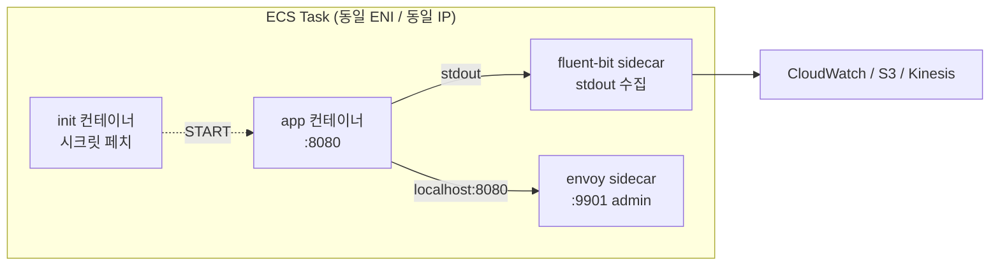

# ECS 다중 컨테이너 Sidecar 패턴

## 단일 Task 안에 여러 컨테이너를 넣는다는 것

ECS Task는 "함께 살고 함께 죽는 컨테이너 묶음"이다. 한 Task에 들어간 컨테이너들은 같은 ENI, 같은 IP, 같은 Docker 네트워크 네임스페이스를 공유하고, Task 단위로 스케줄링된다. 한 Task에 3개 컨테이너를 넣으면 3개가 한 덩어리로 같은 호스트(EC2면 동일 인스턴스, Fargate면 동일 micro-VM)에 뜬다. 이 성질이 sidecar 패턴의 전제다.

실무에서 sidecar를 쓰는 이유는 단순하다. 애플리케이션 컨테이너 이미지를 건드리지 않고 부가 기능(로그 수집, 프록시, 시크릿 주입, 설정 갱신)을 얹고 싶을 때 쓴다. 메인 앱은 Java/Node/Go 뭐든 간에 로그를 stdout으로만 뱉고, 로그 수집/가공/전송 같은 지저분한 일은 옆 컨테이너가 맡는 구조다.

문제는 이게 "편하다"로 끝나지 않는다는 점이다. 한 Task 안 컨테이너들은 라이프사이클이 얽혀 있어서, sidecar 하나가 OOM으로 죽으면 Task 전체가 재시작되기도 하고, 시작 순서를 잘못 걸어두면 메인 앱이 시크릿을 못 읽어 Boot 실패가 나기도 한다. 이 문서는 그런 실무 함정을 중심으로 다룬다.

### ECS에서의 "Pod 같은 것"

Kubernetes의 Pod를 아는 사람이라면 ECS Task를 거의 동일한 추상화라고 봐도 된다. 차이점은 다음과 같다.

- ECS Task는 `essential` 플래그로 컨테이너 중요도를 표시한다. Pod의 `restartPolicy`와는 결이 다르다.
- ECS는 `dependsOn`으로 컨테이너 간 시작/종료 순서를 제어한다. Pod의 `initContainers` + `postStart`를 한 번에 처리한다고 보면 된다.
- ECS Task는 Pod보다 "Task 단위 재시작"이 더 잦다. 컨테이너 하나만 죽여서 재생성하는 개념이 약하다 — 특히 Fargate.



---

## essential 플래그 — Task 재시작을 결정하는 스위치

Task Definition의 각 컨테이너에는 `essential: true|false`가 붙는다. 이 값 하나가 운영 중 "한 컨테이너만 죽었는데 왜 전체가 재시작되지?" 문제의 원인이 된다.

- `essential: true` 컨테이너가 종료되면 Task 전체를 중지시키고 ECS 서비스가 대체 Task를 스케줄한다.
- `essential: false` 컨테이너가 종료되면 해당 컨테이너만 Stopped 상태로 남고, 나머지 컨테이너는 계속 돈다. Task는 살아 있다.

기본값은 `true`다. 명시하지 않으면 전부 essential로 취급된다. 그래서 아무 생각 없이 sidecar를 넣으면, sidecar가 OOM으로 죽는 순간 정상 동작하던 앱까지 같이 재시작된다.

```json
{
  "family": "api-task",
  "containerDefinitions": [
    {
      "name": "app",
      "image": "123456789012.dkr.ecr.ap-northeast-2.amazonaws.com/api:1.4.0",
      "essential": true,
      "portMappings": [{ "containerPort": 8080 }]
    },
    {
      "name": "log-router",
      "image": "public.ecr.aws/aws-observability/aws-for-fluent-bit:stable",
      "essential": false,
      "firelensConfiguration": { "type": "fluentbit" }
    }
  ]
}
```

여기서 `log-router`를 `essential: false`로 둔다는 건 "로그 수집기가 죽어도 앱은 계속 서비스해라"라는 선언이다. 반대로 트래픽을 받는 프록시(Envoy/nginx)를 sidecar로 둔다면 그건 `essential: true`여야 한다. 프록시가 죽으면 어차피 요청을 받을 수 없으니 Task를 재시작하는 게 맞다.

### 흔한 실수: 모든 sidecar를 essential:true로 두기

로그 수집기, 메트릭 에이전트, 시크릿 갱신 sidecar까지 전부 essential로 두면 Task 안정성이 최저 수준으로 내려간다. 모든 컨테이너가 "하나라도 죽으면 같이 죽는다"는 관계가 되기 때문이다. 로그 수집기는 일시적 네트워크 이슈로 종종 죽는다는 걸 감안해야 한다. 메인 앱과 직접적인 트래픽 경로에 있는 컨테이너만 essential로 두는 게 맞다.

---

## dependsOn — 시작/종료 순서 제어

`dependsOn`은 컨테이너 간 라이프사이클 의존성을 선언한다. condition은 4가지다.

| condition | 의미 | 대표 사용처 |
|-----------|------|-------------|
| `START` | 의존 컨테이너가 시작되기만 하면 됨 | 경량 sidecar 기다리기 |
| `COMPLETE` | 의존 컨테이너가 성공/실패 관계없이 종료돼야 함 | init 컨테이너 |
| `SUCCESS` | 의존 컨테이너가 exit code 0으로 종료돼야 함 | 마이그레이션/시크릿 페치 init |
| `HEALTHY` | 의존 컨테이너의 healthcheck가 PASS여야 함 | DB 프록시, 설정 로더 |

`COMPLETE`와 `SUCCESS`는 "끝난 뒤에 시작한다"라서 init container 패턴에 쓴다. `START`와 `HEALTHY`는 "떠 있어야 시작한다"라서 함께 도는 sidecar에 쓴다.

```json
{
  "containerDefinitions": [
    {
      "name": "secret-fetcher",
      "image": "my-secret-fetcher:1.0.0",
      "essential": false,
      "mountPoints": [{ "sourceVolume": "secrets", "containerPath": "/secrets" }]
    },
    {
      "name": "config-sidecar",
      "image": "my-config-loader:2.1.0",
      "essential": true,
      "healthCheck": {
        "command": ["CMD-SHELL", "test -f /config/ready || exit 1"],
        "interval": 5,
        "retries": 3,
        "startPeriod": 10
      }
    },
    {
      "name": "app",
      "image": "my-app:3.2.1",
      "essential": true,
      "dependsOn": [
        { "containerName": "secret-fetcher", "condition": "SUCCESS" },
        { "containerName": "config-sidecar", "condition": "HEALTHY" }
      ],
      "mountPoints": [
        { "sourceVolume": "secrets", "containerPath": "/etc/secrets", "readOnly": true }
      ]
    }
  ],
  "volumes": [{ "name": "secrets" }]
}
```

이 정의에서 `app`은 `secret-fetcher`가 exit 0으로 끝나고, `config-sidecar`의 healthcheck가 PASS한 뒤에야 시작된다. 시크릿 파일이 아직 공유 볼륨에 떨어지지 않은 상태에서 앱이 부팅을 시작해 `FileNotFoundException`으로 죽는 사고를 막는 장치다.

### 종료 순서도 dependsOn 역순

Task가 중지될 때 컨테이너 종료 순서는 dependsOn의 역순이다. 즉 `app`이 먼저 SIGTERM을 받고, 그 다음 `config-sidecar`, 마지막에 `secret-fetcher`가 종료된다 — 단, `secret-fetcher`는 이미 종료된 init이라 해당 없음. 이 동작 덕분에 "앱이 종료되는 중에 프록시가 먼저 죽어서 graceful shutdown 중인 in-flight 요청이 잘리는" 문제를 완화할 수 있다. Envoy sidecar를 쓸 때 특히 중요하다.

### dependsOn 누락으로 인한 race condition

dependsOn을 빼먹으면 ECS는 컨테이너들을 동시에 시작한다. 이때 흔히 보이는 증상:

- 앱이 시작 시 `/etc/secrets/db.json`을 읽는데 sidecar가 아직 파일을 안 썼다 → 부팅 실패
- 앱이 localhost:9901로 Envoy admin API를 호출하는데 Envoy가 아직 listen 중이 아니다 → 초기화 중 간헐적 실패
- config-sidecar가 S3에서 설정을 받아오기 전에 앱이 빈 설정으로 부팅 → 잘못된 상태로 트래픽 수용

이런 문제는 "개발 환경에서는 잘 되는데 특정 AZ/노드에서만 종종 실패"라는 형태로 나타나서 재현이 어렵다. 해결은 무조건 dependsOn으로 명시하는 것이다. 타이밍에 의존하지 말고 조건으로 선언해라.

---

## 공유 볼륨과 localhost 통신

같은 Task 안 컨테이너들은 두 가지 방법으로 데이터를 주고받는다.

### 1) localhost

같은 Task 안 컨테이너들은 같은 네트워크 네임스페이스를 쓴다. 즉 `127.0.0.1:포트`로 서로 접근 가능하다. Pod의 localhost 통신과 동일하다.

```json
{
  "containerDefinitions": [
    {
      "name": "app",
      "image": "my-app:1.0.0",
      "portMappings": [{ "containerPort": 8080 }],
      "environment": [
        { "name": "OTEL_EXPORTER_OTLP_ENDPOINT", "value": "http://127.0.0.1:4318" }
      ]
    },
    {
      "name": "otel-collector",
      "image": "otel/opentelemetry-collector-contrib:0.95.0",
      "portMappings": [{ "containerPort": 4318 }]
    }
  ]
}
```

여기서 주의할 점은 `awsvpc` 네트워크 모드(Fargate는 무조건 이 모드)에서는 같은 Task의 컨테이너들이 같은 ENI/같은 IP를 공유하기 때문에, **같은 포트를 두 컨테이너가 LISTEN할 수 없다**는 것이다. 앱이 8080을 쓰면 sidecar는 다른 포트를 써야 한다. `bridge` 모드(EC2 launch type)는 컨테이너별로 내부 IP가 달라서 포트 충돌은 덜하지만, 그래도 sidecar 패턴에서는 awsvpc가 표준이라고 보면 된다.

### 2) 공유 볼륨

Task 수준 `volumes`에 정의한 볼륨을 여러 컨테이너가 `mountPoints`로 마운트해서 파일을 주고받는다. 가장 흔한 케이스가 시크릿 파일 전달, 로그 파일 전달, 소켓 공유다.

```json
{
  "volumes": [
    { "name": "shared-logs" },
    { "name": "envoy-socket" }
  ],
  "containerDefinitions": [
    {
      "name": "app",
      "mountPoints": [
        { "sourceVolume": "shared-logs", "containerPath": "/var/log/app" },
        { "sourceVolume": "envoy-socket", "containerPath": "/var/run/envoy" }
      ]
    },
    {
      "name": "log-tailer",
      "mountPoints": [
        { "sourceVolume": "shared-logs", "containerPath": "/logs", "readOnly": true }
      ]
    }
  ]
}
```

볼륨 이름에 타입을 명시하지 않으면 기본이 Docker 볼륨(Fargate는 ephemeral, EC2는 Docker 드라이버)이다. Fargate에서는 Task가 죽으면 볼륨도 같이 사라진다. 로그를 여기에 쌓고 Task 재시작되면 싹 날아간다는 걸 기억해야 한다. 그래서 로그 sidecar는 파일을 쌓기보다는 스트림으로 밖으로 내보낸다.

### 볼륨 공유의 permission 함정

한 컨테이너가 root로 파일을 쓰고, 다른 컨테이너가 non-root 유저로 읽으려고 하면 권한 오류가 난다. 같은 Task 안이라도 컨테이너 이미지의 USER가 다르면 UID/GID 매칭이 안 맞는다는 점에 주의해라. 해결은 두 컨테이너의 USER를 맞추거나, init 컨테이너에서 `chmod 0644`로 읽기 권한을 풀어주는 것이다.

---

## 로깅 sidecar — FireLens + Fluent Bit

가장 많이 쓰는 sidecar 패턴이다. awslogs 드라이버는 라인당 CloudWatch에 직송이라 필터링/가공이 안 된다. 운영 환경에서는 다음 요구가 거의 반드시 생긴다.

- JSON 파싱해서 `level=ERROR`만 별도 스트림으로 보내기
- 특정 필드(토큰, 이메일)를 마스킹
- CloudWatch + S3 + Kinesis에 동시에 보내기 (cross-destination)
- 서비스/환경 태그를 주입

이럴 때 FireLens라는 ECS 전용 드라이버를 쓴다. FireLens는 Fluent Bit/Fluentd sidecar를 로그 라우터로 만드는 메커니즘이다. 애플리케이션 컨테이너는 stdout으로만 뱉고, ECS 에이전트가 그 stdout을 Fluent Bit sidecar로 자동 연결해준다.

```json
{
  "family": "api-firelens",
  "taskRoleArn": "arn:aws:iam::123456789012:role/EcsApiTaskRole",
  "executionRoleArn": "arn:aws:iam::123456789012:role/EcsTaskExecutionRole",
  "networkMode": "awsvpc",
  "containerDefinitions": [
    {
      "name": "log-router",
      "image": "public.ecr.aws/aws-observability/aws-for-fluent-bit:stable",
      "essential": true,
      "firelensConfiguration": {
        "type": "fluentbit",
        "options": {
          "config-file-type": "file",
          "config-file-value": "/fluent-bit/configs/parse-json.conf"
        }
      },
      "logConfiguration": {
        "logDriver": "awslogs",
        "options": {
          "awslogs-group": "/ecs/api/firelens",
          "awslogs-region": "ap-northeast-2",
          "awslogs-stream-prefix": "router"
        }
      },
      "memoryReservation": 64
    },
    {
      "name": "app",
      "image": "123456789012.dkr.ecr.ap-northeast-2.amazonaws.com/api:2.0.0",
      "essential": true,
      "dependsOn": [
        { "containerName": "log-router", "condition": "START" }
      ],
      "logConfiguration": {
        "logDriver": "awsfirelens",
        "options": {
          "Name": "cloudwatch_logs",
          "region": "ap-northeast-2",
          "log_group_name": "/ecs/api/app",
          "log_stream_prefix": "app-",
          "auto_create_group": "false"
        }
      }
    }
  ]
}
```

여기서 몇 가지 실무 포인트:

- `log-router` 자체는 `awslogs` 드라이버로 CloudWatch에 보낸다. 라우터가 죽으면 라우터 로그도 어딘가로 보내야 하기 때문이다. 라우터가 라우터의 로그를 처리하는 닭-달걀 문제를 피한다.
- 앱 컨테이너의 `logConfiguration`은 `awsfirelens` 드라이버다. 이게 "이 컨테이너 stdout을 FireLens sidecar로 연결하라"는 의미다.
- `dependsOn: START`로 걸어두지 않으면 앱이 먼저 로그를 뱉기 시작할 때 라우터가 아직 준비 안 돼서 초반 로그가 유실된다.
- `essential: true`로 둔 건, 이 서비스가 "로그 없으면 운영 안 한다"는 정책 기반이다. 로그 소실보다 서비스 중단이 낫다는 판단이 있을 때만 이렇게 한다. 반대 정책이면 `essential: false`다.

### Fluent Bit 설정 파일은 어떻게 넣나

세 가지 방법이 있다.

1. **커스텀 이미지 빌드** — `FROM public.ecr.aws/aws-observability/aws-for-fluent-bit` 베이스에 `COPY parse-json.conf /fluent-bit/configs/`로 이미지 안에 박아넣기. 가장 단순하고 버전 관리가 명확해서 선호된다.
2. **S3에서 가져오기** — `firelensConfiguration.options`에 `config-file-type: s3`를 쓰고 taskRoleArn에 GetObject 권한을 부여. 설정 변경 시 이미지 재빌드가 필요 없지만 S3 접근 장애 시 라우터가 안 뜬다.
3. **환경변수로 옵션 주입** — 간단한 필터 몇 개면 충분할 때.

대부분의 조직에서는 1번으로 간다. 로그 파이프라인의 의존성을 단순화하는 게 중요하다.

### 로그 유실이 발생하는 지점

- Task 시작 직후 라우터 준비 전 뱉은 로그 → `dependsOn: START`로 완화 가능하지만, Fluent Bit이 PASS 상태가 되는 데 몇 초 걸리기 때문에 완벽하지는 않다. 앱에 `startup-delay`를 주거나 로그 버퍼링 라이브러리를 쓰기도 한다.
- Task 종료 시 메모리에 남아 있던 로그 → Fluent Bit이 flush 하기 전에 죽으면 날아간다. `stopTimeout`을 넉넉히(예: 30초) 주고 Fluent Bit 설정에서 `Grace` 옵션을 올려두는 것이 좋다.
- Task 강제 종료(SIGKILL) → `stopTimeout`이 지나면 ECS가 강제 종료한다. 이 시점에 flush 안 된 로그는 포기해야 한다.

---

## 프록시 sidecar — Envoy / nginx

Envoy/nginx sidecar는 다음과 같은 상황에서 쓴다.

- 서비스 메시(App Mesh, Istio)의 데이터 플레인
- mTLS 종료 — 앱은 평문 HTTP만 알고, sidecar가 cert/mTLS를 처리
- 라우팅/리트라이/서킷브레이커를 앱 밖에서 처리
- 내부 서비스 호출을 localhost 경유로 단순화(`http://localhost:15001/` → downstream 서비스)

```json
{
  "containerDefinitions": [
    {
      "name": "envoy",
      "image": "840364872350.dkr.ecr.ap-northeast-2.amazonaws.com/aws-appmesh-envoy:v1.29.4.0-prod",
      "essential": true,
      "user": "1337",
      "ulimits": [
        { "name": "nofile", "softLimit": 65535, "hardLimit": 65535 }
      ],
      "portMappings": [
        { "containerPort": 15000 },
        { "containerPort": 15001 }
      ],
      "healthCheck": {
        "command": [
          "CMD-SHELL",
          "curl -s http://localhost:9901/server_info | grep -q state..LIVE"
        ],
        "interval": 5,
        "retries": 3,
        "startPeriod": 10
      },
      "environment": [
        { "name": "APPMESH_VIRTUAL_NODE_NAME", "value": "mesh/my-mesh/virtualNode/api-vn" }
      ]
    },
    {
      "name": "app",
      "image": "my-app:1.0.0",
      "essential": true,
      "portMappings": [{ "containerPort": 8080 }],
      "dependsOn": [
        { "containerName": "envoy", "condition": "HEALTHY" }
      ]
    }
  ],
  "proxyConfiguration": {
    "type": "APPMESH",
    "containerName": "envoy",
    "properties": [
      { "name": "IgnoredUID", "value": "1337" },
      { "name": "ProxyIngressPort", "value": "15000" },
      { "name": "ProxyEgressPort", "value": "15001" },
      { "name": "AppPorts", "value": "8080" },
      { "name": "EgressIgnoredIPs", "value": "169.254.170.2,169.254.169.254" }
    ]
  }
}
```

### proxyConfiguration의 의미

`proxyConfiguration`은 ECS 에이전트가 컨테이너 시작 시 iptables 규칙을 자동으로 심어서, 앱 컨테이너의 inbound/outbound 트래픽을 Envoy의 포트로 리다이렉트하게 만든다. 앱 코드는 여전히 `0.0.0.0:8080`에서 받고 `downstream:8080`으로 호출하는데, 실제 트래픽은 Envoy를 거쳐 나간다. 앱 코드를 고치지 않아도 되는 이유가 이거다.

`IgnoredUID: 1337`은 "Envoy가 낸 트래픽은 다시 Envoy로 리다이렉트하지 말라"는 의미다. Envoy를 1337 유저로 돌리고 iptables가 그 UID를 무시하게 한다. 이걸 빼먹으면 무한 루프에 빠진다.

`EgressIgnoredIPs`의 `169.254.170.2`는 ECS task metadata endpoint(`ECS_CONTAINER_METADATA_URI`), `169.254.169.254`는 EC2 instance metadata다. 이 둘은 Envoy를 거치면 안 된다. 빠뜨리면 SDK가 자격증명을 못 받아와서 AWS API 호출이 전부 실패한다.

### Envoy sidecar의 graceful shutdown

실무에서 자주 겪는 문제: 앱이 SIGTERM을 받고 in-flight 요청을 처리하는 중인데 Envoy가 먼저 종료돼서 응답을 못 돌려주는 경우. ECS는 `dependsOn`의 역순으로 종료하므로 `app`이 먼저 SIGTERM을 받고 `envoy`가 나중에 받는다. 이 순서를 보장하려면 반드시 `app`에서 `envoy`로의 dependsOn을 선언해야 한다.

그리고 `stopTimeout`을 충분히(앱의 drain 시간 + 여유) 줘야 한다. 기본 30초, 최대 Fargate는 120초다. drain이 오래 걸리는 앱(긴 요청/WebSocket)이면 이 값을 반드시 올려야 한다.

---

## init container 패턴 — dependsOn COMPLETE/SUCCESS

ECS에는 Kubernetes의 `initContainers`라는 별도 필드가 없다. 대신 `dependsOn`의 `COMPLETE` 또는 `SUCCESS` condition으로 같은 효과를 낸다. "먼저 실행되어 종료된 후에 본 컨테이너를 시작"하는 패턴이다.

대표 사용처:

- DB 마이그레이션 실행
- 시크릿/설정을 공유 볼륨에 미리 떨어뜨리기
- 증명서(Certificate)를 fetch해서 볼륨에 배치
- 애플리케이션 캐시 warm-up

### 예시: 시크릿 페치 init

```json
{
  "family": "api-with-init",
  "containerDefinitions": [
    {
      "name": "init-secrets",
      "image": "amazon/aws-cli:2.13.0",
      "essential": false,
      "command": [
        "sh", "-c",
        "aws secretsmanager get-secret-value --secret-id prod/api/db --query SecretString --output text > /secrets/db.json && chmod 0400 /secrets/db.json"
      ],
      "mountPoints": [
        { "sourceVolume": "secrets", "containerPath": "/secrets" }
      ]
    },
    {
      "name": "app",
      "image": "my-app:1.0.0",
      "essential": true,
      "dependsOn": [
        { "containerName": "init-secrets", "condition": "SUCCESS" }
      ],
      "mountPoints": [
        { "sourceVolume": "secrets", "containerPath": "/etc/secrets", "readOnly": true }
      ]
    }
  ],
  "volumes": [{ "name": "secrets" }]
}
```

init 컨테이너는 exit 0으로 끝나야 한다. `SUCCESS` 대신 `COMPLETE`를 쓰면 실패(exit 1)도 통과시키는데, 이건 보통 원하는 동작이 아니다. 시크릿 페치가 실패했는데 앱을 그대로 부팅시키면 더 큰 문제를 만든다. `SUCCESS`가 기본이라고 기억해라.

### ECS에 "네이티브" init이 없는 이유와 주의점

ECS는 init 컨테이너도 Task 안 일반 컨테이너로 취급한다. 즉 init이 종료돼도 컨테이너 정의 상에서는 남아 있고, `describe-tasks`를 찍으면 `lastStatus: STOPPED`로 보인다. 이 때문에 다음을 주의해야 한다.

1. **리소스 할당** — init 컨테이너에도 메모리/CPU가 계산된다. Fargate는 Task 수준 총합 CPU/Memory로 요금이 산정되는데, init이 잠깐 쓰고 가는 메모리도 Task 전체 예약에 포함된다. 과도하게 큰 init 이미지를 쓰지 말아라.
2. **startPeriod 고려** — init 컨테이너가 30초 걸리면, app의 startPeriod는 그 뒤에 시작된다. 서비스 healthcheck grace period를 짧게 잡으면 init이 덜 끝났는데 unhealthy로 판정된다. 서비스의 `healthCheckGracePeriodSeconds`를 init 실행 시간 + 앱 부팅 시간으로 잡아라.
3. **Task 재시작 시 init도 다시 실행** — 앱이 OOM으로 죽어서 Task가 교체되면 init도 처음부터 다시 돈다. init이 부작용이 있는 작업(DB 마이그레이션)을 할 경우 멱등성을 꼭 보장해야 한다. 매번 실행돼도 같은 결과가 나오게 짜라.

---

## Config reload sidecar

설정 변경을 앱 재시작 없이 반영하고 싶을 때 쓰는 패턴이다. sidecar가 주기적으로 S3/Parameter Store/Consul 같은 소스를 폴링해 공유 볼륨에 파일을 갱신하고, 앱은 해당 파일을 watch하거나 SIGHUP 신호로 reload한다.

```json
{
  "containerDefinitions": [
    {
      "name": "config-reloader",
      "image": "my-org/config-reloader:1.2.0",
      "essential": false,
      "environment": [
        { "name": "S3_BUCKET", "value": "my-app-config" },
        { "name": "S3_KEY", "value": "prod/app.yaml" },
        { "name": "POLL_INTERVAL", "value": "30" },
        { "name": "TARGET_PATH", "value": "/config/app.yaml" },
        { "name": "SIGNAL_PID_FILE", "value": "/config/app.pid" }
      ],
      "mountPoints": [
        { "sourceVolume": "config", "containerPath": "/config" }
      ]
    },
    {
      "name": "app",
      "image": "my-app:1.0.0",
      "essential": true,
      "mountPoints": [
        { "sourceVolume": "config", "containerPath": "/etc/config" }
      ],
      "environment": [
        { "name": "PID_FILE", "value": "/etc/config/app.pid" }
      ]
    }
  ],
  "volumes": [{ "name": "config" }]
}
```

### 프로세스 시그널링 주의

config-reloader가 app 컨테이너의 프로세스에 SIGHUP을 직접 보내기는 어렵다. 같은 Task 안이라도 PID 네임스페이스가 기본적으로 분리돼 있어서 컨테이너 A가 컨테이너 B의 PID를 볼 수 없다. 두 가지 우회책이 있다.

1. **PID 네임스페이스 공유** — Task Definition의 `pidMode: "task"`로 설정. 같은 Task 안 모든 컨테이너가 PID 네임스페이스를 공유해서 서로 PID를 볼 수 있게 된다. 보안상 프로덕션에서는 신중히 써야 한다.
2. **앱이 자체적으로 파일 변경 감지** — fsnotify 류를 써서 config 파일 변경을 직접 감지하고 스스로 reload. 이게 일반적이고 안전하다.

대부분은 2번으로 간다. config-reloader는 파일만 갈아끼우고, 반영 책임은 앱이 진다.

### 부분 갱신 타이밍 문제

reloader가 큰 YAML 파일을 `write`로 덮어쓰는 동안 앱이 읽으면 파싱 깨짐이 날 수 있다. 해결은 항상 "임시 파일 쓰기 → rename"으로 atomic replace를 하는 것이다.

```sh
aws s3 cp s3://my-app-config/prod/app.yaml /config/app.yaml.tmp
mv /config/app.yaml.tmp /config/app.yaml
```

`mv`는 같은 파일시스템 내에서는 atomic해서 앱이 중간 상태를 볼 수 없다. reloader 구현에서 이걸 빼먹는 경우가 꽤 흔하다.

---

## 시크릿 페치 sidecar — 주기적 갱신형

위 init 패턴은 Task 시작 시 한 번만 시크릿을 가져온다. 시크릿이 짧은 TTL을 갖거나(예: Vault 동적 자격증명, IAM DB 인증의 토큰), 주기적 로테이션이 필요하면 sidecar가 계속 돌면서 갱신해야 한다.

```json
{
  "containerDefinitions": [
    {
      "name": "secrets-sidecar",
      "image": "my-org/vault-agent:1.15.0",
      "essential": false,
      "command": ["-config=/etc/vault-agent/config.hcl"],
      "mountPoints": [
        { "sourceVolume": "secrets", "containerPath": "/secrets" },
        { "sourceVolume": "vault-config", "containerPath": "/etc/vault-agent", "readOnly": true }
      ],
      "healthCheck": {
        "command": ["CMD-SHELL", "test -f /secrets/.ready || exit 1"],
        "interval": 5,
        "retries": 3,
        "startPeriod": 15
      }
    },
    {
      "name": "app",
      "image": "my-app:1.0.0",
      "essential": true,
      "dependsOn": [
        { "containerName": "secrets-sidecar", "condition": "HEALTHY" }
      ],
      "mountPoints": [
        { "sourceVolume": "secrets", "containerPath": "/etc/secrets", "readOnly": true }
      ]
    }
  ]
}
```

앱은 첫 파일이 준비될 때까지 기다리기 위해 `HEALTHY` 조건으로 묶는다. 이후에는 파일이 갱신되는 걸 앱이 polling 또는 fsnotify로 감지한다.

### AWS Secrets Manager는 그냥 secrets 필드 쓰면 되지 않나?

맞다. ECS Task Definition의 `secrets` 필드를 쓰면 executionRoleArn의 권한으로 Secrets Manager/SSM Parameter Store에서 값을 가져와 환경변수로 주입해준다. 이게 가장 단순하다.

```json
{
  "secrets": [
    { "name": "DB_PASSWORD", "valueFrom": "arn:aws:secretsmanager:ap-northeast-2:123456789012:secret:prod/api/db:password::" }
  ]
}
```

그런데 이 방식은 **Task 시작 시에만** 값을 주입한다. 시크릿이 로테이션돼도 Task를 재시작하지 않으면 반영 안 된다. 로테이션 주기마다 Task를 순환 재시작하면 되긴 하는데, 고트래픽 서비스에서는 그 비용이 부담된다. 이때 sidecar 방식이 쓰인다. 결정 기준은 단순하다.

- 정적 시크릿, 1년 1회 로테이션 → `secrets` 필드
- 짧은 TTL 동적 시크릿, 분 단위 로테이션 → sidecar 필요

---

## 리소스 제한 분배 — Task 총량과 컨테이너 할당

Fargate는 Task 수준 `cpu`와 `memory`를 필수로 지정한다. EC2 launch type은 선택이지만 설정하는 게 안전하다. 컨테이너 수준에서는 `cpu`, `memory`, `memoryReservation`을 추가로 지정할 수 있다.

### 두 계층의 예약

- **Task 수준 `cpu`/`memory`** — 이 Task가 호스트에서 차지할 총량. Fargate 요금은 이 값 기준.
- **컨테이너 수준 `cpu`** — 같은 Task 안 컨테이너들이 Task 총량을 어떻게 나눠 쓸지. cgroup cpu.shares로 번역된다. 상대 비중이다.
- **컨테이너 수준 `memory`** — hard limit. 초과 시 해당 컨테이너가 OOM kill 된다.
- **컨테이너 수준 `memoryReservation`** — soft limit. 여유 있을 때는 이 이상 쓸 수 있다.

```json
{
  "family": "api-task",
  "cpu": "1024",
  "memory": "2048",
  "containerDefinitions": [
    {
      "name": "app",
      "cpu": 768,
      "memory": 1536,
      "memoryReservation": 1024
    },
    {
      "name": "log-router",
      "cpu": 128,
      "memory": 256,
      "memoryReservation": 128
    },
    {
      "name": "envoy",
      "cpu": 128,
      "memory": 256,
      "memoryReservation": 128
    }
  ]
}
```

### 컨테이너 cpu 값의 의미

Fargate에서 컨테이너 cpu는 상대 비중(cpu.shares)이다. 위 예제에서 1024 유닛을 app 768 / router 128 / envoy 128로 나눈다고 해서 각각이 딱 그만큼만 쓴다는 뜻이 아니다. 호스트에 여유가 있으면 app이 900까지 튀어도 된다. 다만 경합이 일어나면 768:128:128 비율로 할당된다.

EC2 launch type에서는 컨테이너 cpu의 합이 Task cpu를 초과하면 안 된다. Fargate는 Task cpu를 컨테이너 cpu 합으로 자동 채워준다(지정 안 한 컨테이너는 나머지 공유).

### 메모리 제한은 반드시 명시해라

sidecar에 메모리 제한을 안 걸면 정말 큰 문제를 만든다.

- Fluent Bit이 로그 폭주 상황에서 내부 버퍼가 부풀어 오른다 → 메모리 제한 없으면 Task 전체 메모리를 먹는다 → app이 메모리 부족으로 OOM → Task 재시작 → 로그 폭주 → 반복.
- 이 루프는 "로그가 많다"는 원인 하나로 서비스 전체를 내린다.

반드시 sidecar마다 `memory` 값을 걸어둬라. OOM이 나도 sidecar만 죽게 만드는 게 맞다. 그리고 sidecar는 `essential: false`여야 혼자 죽어도 Task가 유지된다.

### Ephemeral storage

Fargate는 기본 20GB, 최대 200GB까지 ephemeral storage를 할당할 수 있다. 공유 볼륨(docker local volume)도 여기서 깎인다. 로그 파일을 잠깐 쌓는 패턴을 쓴다면 `ephemeralStorage.sizeInGiB`를 같이 잡아줘야 한다.

```json
{
  "family": "api-task",
  "cpu": "1024",
  "memory": "2048",
  "ephemeralStorage": { "sizeInGiB": 40 }
}
```

---

## 트러블슈팅 사례

### 사례 1. sidecar 하나 OOM으로 Task 전체 재시작

증상: 새벽에 log-router(Fluent Bit)가 OOM으로 죽으면서 app까지 같이 죽어 서비스 장애.

원인: `essential: true`였고 메모리 제한이 128MB로 너무 낮았다. 로그 폭주 시 Fluent Bit이 128MB를 넘겨 OOM → essential이라 Task 전체 STOPPED → ECS가 새 Task를 띄우면서 순단 발생.

해결:

1. `log-router`를 `essential: false`로 변경. 라우터가 죽어도 앱은 계속 돌게. 로그 약간 유실은 감수.
2. 라우터 메모리 limit을 256MB로 상향, `memoryReservation`은 128MB로.
3. Fluent Bit에 backpressure 옵션 추가: `storage.type filesystem`, `storage.backlog.mem_limit`.

교훈: sidecar를 essential로 둘 때는 정말로 그 컨테이너 없이는 서비스가 의미 없는 경우(프록시)에만 하고, 로깅/메트릭 같은 관찰성 sidecar는 기본적으로 non-essential로 둬라.

### 사례 2. dependsOn 누락 race condition

증상: 배포 때 간헐적으로 앱이 부팅 단계에서 죽는다. 로그엔 `javax.net.ssl.SSLHandshakeException`. 같은 이미지를 다시 배포하면 멀쩡히 뜬다.

원인: Envoy sidecar를 mTLS 종료용으로 쓰는데 dependsOn을 안 걸었다. 앱 컨테이너가 Envoy보다 먼저 부팅 시 localhost:15001로 downstream 호출 → Envoy가 아직 listen 중이 아님 → connection refused → 재시도 로직이 SSL로 잘못 해석해서 에러 던짐.

해결: `dependsOn: [{ containerName: "envoy", condition: "HEALTHY" }]` 추가. Envoy에 `/ready` healthcheck 설정. startPeriod 15초.

교훈: 컨테이너 시작 순서를 코드의 재시도 로직에 맡기지 마라. ECS 수준에서 선언적으로 막아라.

### 사례 3. sidecar가 메인보다 먼저 죽어 in-flight 요청 손실

증상: 배포 시마다 5xx 스파이크. ALB target group에서 draining이 돌고 있는데도 요청 실패.

원인: Envoy가 앱보다 먼저 SIGTERM을 받아 연결을 끊었다. 앱은 아직 graceful shutdown 중이었는데 프록시가 죽어버려 응답을 못 보냄.

ECS의 종료 순서는 dependsOn의 역순이다. `app`이 `envoy`를 의존하지 않으면 둘은 "의존 관계 없음"으로 간주돼서 동시에 SIGTERM을 받는다. Envoy가 먼저 소켓을 닫아버리는 케이스가 자주 발생.

해결:

1. `app`의 `dependsOn`에 `envoy`를 추가 (condition: HEALTHY). 그러면 종료 시 `app` → `envoy` 순으로 SIGTERM.
2. `app`의 `stopTimeout`을 60초로 상향 (기본 30초였음).
3. Envoy에 drain 로직 설정: `--drain-time-s 30`. SIGTERM 받은 뒤 30초 동안 in-flight 요청 처리 후 종료.

교훈: 트래픽 경로에 있는 sidecar는 반드시 dependsOn으로 종료 순서를 명시해라. stopTimeout도 앱 drain + sidecar drain을 충분히 커버하게 잡아라.

### 사례 4. init 컨테이너가 멱등이 아니라 재시작 시 마이그레이션 충돌

증상: Task가 OOM으로 한 번 재시작된 뒤로 DB 스키마가 깨졌다.

원인: init 컨테이너에서 Flyway로 migration을 돌리는데 `flyway repair`를 실패 시에만 도는 로직이 있었다. Task가 재시작되면서 init이 또 돌았고, 이번엔 migration 중간에 OOM으로 죽어서 schema history가 손상됨.

해결:

1. migration은 ECS RunTask 원샷 Task로 분리. 서비스 Task의 init에서 분리.
2. 서비스 Task는 "migration 완료 여부만 확인"하는 init으로 교체. 완료 안 됐으면 그냥 실패하게.
3. CI/CD에서 deploy 단계를 "migration RunTask 성공 후에만 서비스 업데이트"로 변경.

교훈: init 컨테이너는 Task 재시작마다 다시 돈다. side-effect가 있는 작업은 원샷 Task로 분리하거나, 정말 멱등하게 짜야 한다.

### 사례 5. awsvpc 모드에서 같은 포트 LISTEN

증상: Task Definition을 검증하는 단계에서 "port already in use" 같은 에러로 컨테이너가 시작 실패.

원인: awsvpc 네트워크 모드에서는 같은 Task의 모든 컨테이너가 같은 네트워크 네임스페이스(같은 IP)를 공유한다. app이 8080을 쓰고 sidecar도 8080을 쓰면 충돌.

해결: sidecar 포트를 다른 포트(예: 9090 admin, 15001 proxy)로 분리. ALB target group은 app의 8080으로 라우팅, sidecar의 관리 포트는 내부에서만 접근.

교훈: awsvpc 모드에서 포트 설계는 Task 단위로 해라. 컨테이너별 포트 분할이 아니라 "이 Task가 어떤 포트들을 LISTEN할 것인가"의 설계다.

### 사례 6. FireLens 설정 파일 경로 문제

증상: Fluent Bit sidecar가 자꾸 "config file not found"로 종료. Task가 계속 재시작.

원인: `firelensConfiguration.options.config-file-value`를 `/custom/parse.conf`로 줬는데 실제 이미지 안에는 `/fluent-bit/etc/parse.conf`에 있었다. ECS는 이 경로를 Fluent Bit의 `-c` 옵션으로 그대로 넘기는데, 파일이 없으니 실패.

해결: 이미지 빌드 시 파일 위치를 `firelensConfiguration`에서 가리키는 경로와 일치시키거나, 반대로 option 값을 이미지의 실제 경로에 맞춤. 디버깅은 `exec`로 컨테이너 안에 들어가서 파일 존재 확인.

교훈: sidecar 이미지 안 파일 경로와 Task Definition의 경로는 항상 일치해야 한다. "이미지 빌드 시점"과 "Task 배포 시점"이 분리되어 있어서 버전이 틀어지면 이런 불일치가 쉽게 난다. 이미지 태그를 semver로 고정하고, 설정 파일 경로 변경 시 이미지 메이저 버전을 올려라.

---

## sidecar 도입 전에 확인할 것

여러 sidecar를 한 Task에 몰아넣기 전에 결정해야 하는 것들이 있다.

- 이 sidecar가 죽어도 서비스가 돌아야 하는가 → `essential` 값 결정
- 시작 순서가 중요한가 → `dependsOn` + condition 결정
- 종료 순서가 중요한가 → dependsOn 역순 동작 이해, `stopTimeout` 상향
- 리소스 경합 시 어느 쪽에 우선순위를 줄 것인가 → 컨테이너 `cpu` 비중
- 한쪽이 메모리를 폭주시키면 어떻게 격리할 것인가 → 컨테이너 `memory` hard limit
- 파일 공유 / localhost 통신 / PID 공유 중 어느 걸 쓸 것인가 → `volumes`, `pidMode`, 포트 설계

sidecar는 "앱 이미지를 안 건드리고 부가 기능 추가"라는 점에서 매력적이지만, 라이프사이클 결합도가 높아진다는 비용을 치른다. 이 비용을 의식적으로 설계하지 않으면 앞서 본 트러블슈팅 사례들을 모두 내 손으로 다시 겪게 된다.
