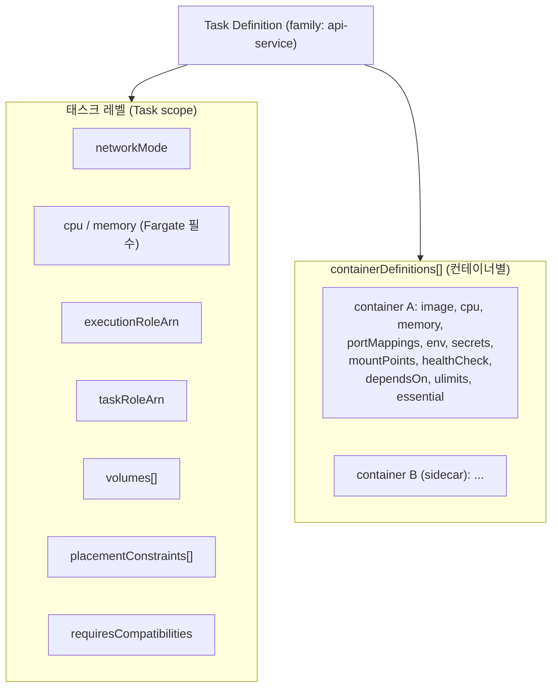

# ECS Task Definition 심화

## 개요

Task Definition은 ECS에서 "컨테이너를 어떻게 띄울지" 정의하는 JSON 문서다. 쿠버네티스의 Pod spec과 역할이 비슷하다. 이미지, CPU/메모리, 포트, 환경 변수, IAM 역할, 볼륨, 로그 설정까지 모두 여기 들어간다. Service가 "몇 개 띄울지"를 담당한다면 Task Definition은 "무엇을 어떻게 띄울지"를 담당한다.

현업에서 Task Definition을 만지다 보면 의외로 함정이 많다. networkMode 하나 잘못 고르면 ENI가 부족해서 태스크가 안 뜨고, executionRoleArn과 taskRoleArn을 헷갈리면 Secrets Manager에서 값을 못 읽어온다. 메모리 hard limit과 soft limit의 차이를 모르고 쓰면 production에서 OOMKilled 폭탄을 맞는다. 이 문서는 Task Definition 파라미터 하나하나를 실무 관점에서 정리한다.

## 전체 구조

Task Definition은 크게 **태스크 레벨 설정**과 **컨테이너 레벨 설정(containerDefinitions 배열)**로 나뉜다.



태스크 레벨 설정은 이 태스크 전체에 적용된다. 컨테이너 레벨 설정은 각 컨테이너 단위로 적용된다. 하나의 태스크 안에 여러 컨테이너가 있으면 모두 같은 호스트(EC2면 같은 인스턴스, Fargate면 같은 micro-VM)에서 같은 네트워크 네임스페이스를 공유한다. 사이드카 패턴(로그 수집, 프록시)이 이 원리로 동작한다.

## 태스크 레벨 설정

### family와 revision

`family`는 Task Definition의 이름이고, 같은 family에 새 버전을 등록할 때마다 `revision` 번호가 1씩 증가한다. 예를 들어 `api-service:7`은 api-service family의 7번째 리비전이다.

```bash
aws ecs register-task-definition --cli-input-json file://task-def.json
# 결과: api-service:8 생성
```

리비전은 **불변**이다. 한 번 등록한 리비전은 수정할 수 없고, 값을 바꾸려면 새 리비전을 등록해야 한다. Service의 Task Definition을 `api-service:8`로 업데이트하면 ECS가 새 태스크를 `:8`로 띄우고 기존 `:7` 태스크를 종료한다. 이 불변성이 롤백을 가능하게 한다. 장애가 나면 `:7`로 돌리면 된다.

### networkMode

네 가지 중 하나를 선택한다. Fargate는 `awsvpc`만 지원한다는 것이 가장 중요한 제약이다.

**awsvpc** — 각 태스크가 자체 ENI(Elastic Network Interface)를 받는다. 태스크마다 독립된 프라이빗 IP가 할당된다. 보안 그룹을 태스크 단위로 걸 수 있고, VPC Flow Logs에서도 개별 태스크 트래픽을 볼 수 있다. Fargate는 무조건 이 모드다. EC2에서도 기본으로 쓰는 게 좋다. 문제는 ENI 제한이다. EC2 인스턴스 타입마다 연결 가능한 ENI 수가 정해져 있어서 `t3.medium`이면 기본 3개(한 개는 primary라 태스크용은 2개)밖에 안 된다. ENI Trunking 기능을 켜야 인스턴스당 태스크 수를 늘릴 수 있다.

**bridge** — Docker 기본 브리지 네트워크를 쓴다. 컨테이너는 호스트의 docker0 브리지에 붙고 NAT를 거쳐 외부와 통신한다. 포트를 `hostPort: 0`으로 두면 동적 포트 매핑이 된다. ALB 타겟 그룹이 동적 포트를 자동으로 찾아간다. EC2 전용이고 Fargate에서는 못 쓴다.

**host** — 컨테이너가 호스트의 네트워크 네임스페이스를 그대로 쓴다. `containerPort 8080`이면 호스트 8080을 그대로 점유한다. 하나의 EC2에 같은 포트를 쓰는 태스크를 두 개 올릴 수 없어서 배치 유연성이 떨어진다. 성능이 살짝 더 좋긴 한데 awsvpc가 나온 이후로는 거의 쓰지 않는다.

**none** — 네트워크 인터페이스가 없다. 외부 통신이 필요 없는 배치 작업 정도에만 쓴다.

현업 결론: **awsvpc를 기본으로 쓰고 ENI 제한이 문제면 ENI Trunking을 활성화하거나 인스턴스 타입을 키워라.** bridge는 레거시라 피하는 게 좋다.

### requiresCompatibilities

`["FARGATE"]`, `["EC2"]`, 둘 다 지원하려면 `["FARGATE", "EC2"]`. Fargate만 지정하면 Fargate에서만 실행 가능한 제약(privileged 불가, docker 볼륨 불가 등)이 검증된다. 둘 다 지정하면 교집합 제약이 적용되므로 Fargate 제약에 맞춰야 한다.

### executionRoleArn vs taskRoleArn

둘을 헷갈리는 실수를 많이 한다. 역할이 완전히 다르다.

- **executionRoleArn**: ECS 에이전트(Fargate의 경우 Fargate 에이전트)가 태스크를 **띄우기 위해** 필요한 권한. ECR에서 이미지 pull, CloudWatch Logs에 로그 그룹 생성, Secrets Manager에서 환경 변수용 시크릿 읽기 등. 태스크가 시작되기 전에 쓰인다.
- **taskRoleArn**: 태스크 안의 **애플리케이션 코드가** AWS API를 호출할 때 쓰는 권한. S3 업로드, DynamoDB 읽기 등. 태스크가 실행되는 동안 쓰인다.

```json
{
  "executionRoleArn": "arn:aws:iam::123456789012:role/ecsTaskExecutionRole",
  "taskRoleArn": "arn:aws:iam::123456789012:role/api-app-role"
}
```

executionRole은 보통 AWS 관리형 정책 `AmazonECSTaskExecutionRolePolicy`로 시작하고, Secrets Manager나 KMS 복호화 권한을 추가로 붙인다. taskRole은 애플리케이션이 쓰는 서비스만 최소 권한으로 준다.

자주 만나는 장애: **Secrets Manager 시크릿을 env로 주입하는데 권한 에러가 난다면 100% executionRole 문제다.** taskRole에 아무리 권한을 줘도 안 된다. 시크릿 주입은 컨테이너가 뜨기 전에 ECS 에이전트가 하는 일이기 때문이다.

### 태스크 레벨 cpu와 memory

Fargate는 **태스크 레벨 cpu, memory 필수**다. EC2는 선택사항이다.

Fargate는 허용되는 조합이 정해져 있다. 아무 숫자나 넣을 수 없다.

| cpu (vCPU) | 허용 memory (MiB) |
|---|---|
| 256 (.25) | 512, 1024, 2048 |
| 512 (.5) | 1024~4096 (1GB 단위) |
| 1024 (1) | 2048~8192 (1GB 단위) |
| 2048 (2) | 4096~16384 (1GB 단위) |
| 4096 (4) | 8192~30720 (1GB 단위) |
| 8192 (8) | 16384~61440 (4GB 단위) |
| 16384 (16) | 32768~122880 (8GB 단위) |

`cpu: 768` 같은 값은 Fargate에서 거부된다. EC2에서는 자유롭지만 EC2 인스턴스 타입의 가용 리소스 안에서 배치된다.

숫자 표기는 "vCPU * 1024"다. `cpu: 512`는 0.5 vCPU다. 문서에 따라 `"0.5 vCPU"`라고 쓰기도 하지만 JSON에서는 `"512"`로 넣는다.

### volumes

태스크 레벨에서 볼륨을 정의하고, 각 컨테이너의 `mountPoints`에서 이를 참조한다.

```json
{
  "volumes": [
    {
      "name": "logs-volume",
      "host": {}
    },
    {
      "name": "efs-data",
      "efsVolumeConfiguration": {
        "fileSystemId": "fs-0abc123",
        "rootDirectory": "/app/data",
        "transitEncryption": "ENABLED",
        "authorizationConfig": {
          "accessPointId": "fsap-0xyz"
        }
      }
    }
  ]
}
```

볼륨 타입별 Fargate/EC2 지원:

- **bind mount** (`host: {}`): 두 모드 모두 지원. 태스크가 종료되면 사라진다. 컨테이너 간 공유 용도로만 쓴다.
- **EFS**: 두 모드 모두 지원. Fargate 1.4.0 이상이어야 한다. 영속 스토리지로 쓴다.
- **FSx for Windows**: Windows 태스크 전용. EC2만.
- **Docker volumes** (`dockerVolumeConfiguration`): EC2 전용. Fargate는 사용 불가.

Fargate에서 영속 데이터가 필요하면 EFS가 사실상 유일한 선택지다. S3에 넣을 수 있다면 애플리케이션 레벨에서 S3로 직접 쓰는 게 훨씬 편하다.

### placementConstraints

EC2 모드에서만 의미가 있다. Fargate는 인스턴스 선택의 개념이 없어서 무시된다.

```json
{
  "placementConstraints": [
    {
      "type": "memberOf",
      "expression": "attribute:ecs.instance-type == t3.large"
    }
  ]
}
```

`distinctInstance` 타입은 같은 태스크를 같은 EC2에 여러 개 올리지 못하게 한다. 고가용성 요구사항이 엄격할 때 쓴다. 다만 Service 레벨의 placementConstraints가 따로 있어서 보통 거기서 설정하는 게 일반적이다.

## 컨테이너 레벨 설정 (containerDefinitions)

### image

이미지 URI를 적는다. 태그 전략이 중요하다.

```json
"image": "123456789012.dkr.ecr.ap-northeast-2.amazonaws.com/api:v1.2.3"
```

현업에서 자주 하는 실수가 `:latest` 태그를 쓰는 것이다. 태그는 mutable이라 같은 태그가 다른 이미지를 가리킬 수 있다. Task Definition 리비전은 태그까지만 기록하고 이미지 digest는 기록하지 않는다. `:latest`로 `:5` 리비전을 만든 뒤 이미지를 바꿔치기하면, 다음 배포에서 `:5` 리비전인데도 새 이미지가 뜬다. 롤백이 깨진다.

해결책은 두 가지다. 첫째, 커밋 SHA나 semver로 고정 태그를 쓴다. 둘째, digest로 지정한다. `image: "123...dkr.ecr.../api@sha256:abcd1234..."` 형태면 digest가 같은 이상 같은 이미지가 보장된다. CI/CD에서 빌드 후 digest를 받아 Task Definition을 만드는 패턴을 추천한다.

### cpu, memory, memoryReservation

이 부분이 Task Definition에서 가장 사고가 많이 나는 영역이다.

- **cpu** (컨테이너 레벨): CPU shares. 상대적 가중치다. 2048 vCPU 태스크 안에 컨테이너 A가 1024, B가 512라면 A:B = 2:1 비율로 CPU를 쓴다. CPU가 남으면 burst 가능하다.
- **memory**: Hard limit. 이 값을 넘으면 **OOMKilled로 바로 죽는다.**
- **memoryReservation**: Soft limit. 이 값만큼 예약되고, 호스트에 여유가 있으면 이보다 더 쓸 수 있다. 자기 한계는 `memory` 값이다.

Fargate는 태스크 전체 메모리가 이미 고정이라 컨테이너 레벨 hard limit은 태스크 메모리와 같거나 작아야 한다. EC2는 memoryReservation만 쓰는 것도 가능하다.

실무에서 겪는 문제:

**JVM Xmx와 컨테이너 메모리 불일치.** 2GB 컨테이너에 `-Xmx2g`를 주면 JVM 힙 2GB + Metaspace + 스레드 스택 + 네이티브 메모리로 실제 사용량이 2.3~2.5GB가 된다. 컨테이너 hard limit이 2GB면 OOMKilled다. Java 17 기준 `-XX:MaxRAMPercentage=75.0` 같은 비율 지정을 쓰거나, 2GB 컨테이너에는 `-Xmx1400m` 정도로 잡아야 안전하다.

**memoryReservation만 설정하고 hard limit 안 주기.** EC2에서 한 컨테이너가 메모리를 폭식하면 같은 인스턴스의 다른 태스크까지 OOM으로 죽는다. EC2의 경우 memory(hard)를 반드시 설정해라.

**Fargate에서 CPU 과소 설정으로 GC 스톨.** 0.25 vCPU(256)짜리 Fargate 태스크에 Spring Boot를 띄우면 부팅만 2분 걸리고 G1GC가 계속 밀려서 레이턴시가 튄다. Spring Boot 기본값으로는 **최소 0.5 vCPU / 1GB**는 줘야 한다.

### portMappings

네트워크 모드에 따라 의미가 다르다.

```json
"portMappings": [
  { "containerPort": 8080, "hostPort": 8080, "protocol": "tcp" }
]
```

- **awsvpc**: `containerPort`만 의미 있다. `hostPort`는 같은 값이어야 하고 안 적어도 된다. 태스크가 ENI를 받으므로 host 개념이 없다.
- **bridge**: `hostPort: 0`으로 두면 동적 할당된다. ALB 타겟 그룹이 자동으로 찾아간다. 같은 인스턴스에 같은 태스크를 여러 개 올릴 때 필수.
- **host**: `containerPort == hostPort`로 강제된다.

Service Connect를 쓰면 `portMappings`에 `name`과 `appProtocol` 필드를 넣어서 서비스 디스커버리 이름을 지정한다.

### environment와 secrets

평문 환경 변수는 `environment`, 민감한 값은 `secrets`에 넣는다.

```json
"environment": [
  { "name": "LOG_LEVEL", "value": "INFO" },
  { "name": "SPRING_PROFILES_ACTIVE", "value": "prod" }
],
"secrets": [
  {
    "name": "DB_PASSWORD",
    "valueFrom": "arn:aws:secretsmanager:ap-northeast-2:123456789012:secret:prod/db-xyz"
  },
  {
    "name": "DB_HOST",
    "valueFrom": "arn:aws:ssm:ap-northeast-2:123456789012:parameter/prod/db/host"
  }
]
```

`secrets`는 ECS 에이전트가 태스크 시작 시점에 Secrets Manager나 Parameter Store에서 값을 읽어 컨테이너의 환경 변수로 주입한다. **한 번 주입되면 끝이다.** 시크릿 값이 변경돼도 실행 중인 컨테이너는 갱신되지 않는다. 로테이션이 필요하면 태스크를 재시작해야 한다.

#### Secrets Manager JSON 필드 추출

Secrets Manager는 JSON 형태의 시크릿을 지원한다. 특정 필드만 꺼내려면 ARN 뒤에 `:fieldname::` 형식을 붙인다.

시크릿 값이 `{"username":"admin","password":"xxx","host":"db.internal"}`일 때:

```json
"secrets": [
  { "name": "DB_USER", "valueFrom": "arn:aws:secretsmanager:...:secret:prod/db-xyz:username::" },
  { "name": "DB_PASS", "valueFrom": "arn:aws:secretsmanager:...:secret:prod/db-xyz:password::" },
  { "name": "DB_HOST", "valueFrom": "arn:aws:secretsmanager:...:secret:prod/db-xyz:host::" }
]
```

뒤의 `::`은 버전 단계(version stage)와 버전 ID 필드인데 비워둬도 된다. 형식은 `arn:...:secret:NAME:JSONKEY:VERSIONSTAGE:VERSIONID`다. 이 기능은 **ECS 플랫폼 버전 1.4.0 이상**에서만 동작한다. Fargate는 기본적으로 1.4.0 이상이지만 EC2에서는 ECS 에이전트 버전을 확인해야 한다.

#### executionRole에 필요한 권한

Secrets Manager / Parameter Store 연동에 필요한 최소 권한:

```json
{
  "Version": "2012-10-17",
  "Statement": [
    {
      "Effect": "Allow",
      "Action": "secretsmanager:GetSecretValue",
      "Resource": "arn:aws:secretsmanager:ap-northeast-2:123456789012:secret:prod/*"
    },
    {
      "Effect": "Allow",
      "Action": "ssm:GetParameters",
      "Resource": "arn:aws:ssm:ap-northeast-2:123456789012:parameter/prod/*"
    },
    {
      "Effect": "Allow",
      "Action": "kms:Decrypt",
      "Resource": "arn:aws:kms:ap-northeast-2:123456789012:key/KEY-ID"
    }
  ]
}
```

시크릿이 CMK로 암호화됐으면 `kms:Decrypt`도 필수다. AWS 관리 키(`aws/secretsmanager`, `aws/ssm`)만 쓴다면 KMS 권한은 자동으로 처리된다. CMK를 쓴다면 KMS 키 정책에도 executionRole을 신뢰하는 조항이 있어야 한다.

### mountPoints와 volumesFrom

태스크 레벨 `volumes`를 컨테이너에 연결한다.

```json
{
  "name": "app",
  "mountPoints": [
    { "sourceVolume": "efs-data", "containerPath": "/var/app/data", "readOnly": false }
  ]
}
```

`volumesFrom`은 다른 컨테이너의 볼륨을 그대로 빌려온다. 사이드카로 로그 포워더를 붙일 때 많이 쓴다.

```json
{
  "name": "log-forwarder",
  "volumesFrom": [
    { "sourceContainer": "app", "readOnly": true }
  ]
}
```

앱 컨테이너가 `/var/log`에 쓰고, 사이드카가 같은 경로를 읽어 외부로 전송하는 패턴이다. 단, stdout 기반 로깅이 주류가 된 지금은 FireLens 사이드카를 쓰는 게 더 깔끔하다.

### dependsOn

같은 태스크 내 컨테이너 간 기동 순서를 정의한다.

```json
{
  "name": "app",
  "dependsOn": [
    { "containerName": "db-init", "condition": "SUCCESS" },
    { "containerName": "envoy", "condition": "HEALTHY" }
  ]
}
```

condition 종류:

- **START**: 해당 컨테이너가 시작되면(반드시 healthy일 필요 없음) 다음으로 넘어간다.
- **COMPLETE**: 해당 컨테이너가 종료되어야 한다. 종료 코드는 상관없다. DB 마이그레이션 init 컨테이너에 쓴다.
- **SUCCESS**: 해당 컨테이너가 종료 코드 0으로 종료되어야 한다. 실패하면 앱도 안 뜬다.
- **HEALTHY**: 해당 컨테이너의 healthCheck가 healthy 상태여야 한다. Envoy 프록시를 띄우고 앱이 그 뒤에 뜨도록 할 때 쓴다.

init 컨테이너가 필요하다면 그 컨테이너의 `essential: false`를 반드시 세팅해야 한다. 안 그러면 init 컨테이너가 정상 종료된 것을 ECS가 "태스크 실패"로 해석해서 태스크 전체를 다시 띄운다.

### healthCheck

컨테이너 레벨 헬스체크다. ALB 타겟 그룹 헬스체크와는 별개다.

```json
"healthCheck": {
  "command": ["CMD-SHELL", "curl -f http://localhost:8080/actuator/health || exit 1"],
  "interval": 30,
  "timeout": 5,
  "retries": 3,
  "startPeriod": 60
}
```

`startPeriod`는 부팅 유예 기간이다. Spring Boot 초기화가 오래 걸리면 이 값을 넉넉히 잡아야 한다. 기본값이 0이라 첫 헬스체크가 부팅 중에 실패하고, retries만큼 연속 실패하면 태스크가 unhealthy로 죽는다. `startPeriod` 동안은 실패해도 retries 카운트에 포함되지 않는다.

ALB 헬스체크와 중복으로 둘 필요는 없다. 대체로 ALB 헬스체크 하나로 충분하다. 사이드카가 있는 복잡한 구성에서는 컨테이너 레벨도 추가로 쓴다.

### ulimits

Fargate에서는 `nofile`(파일 디스크립터)만 조정 가능하다. EC2는 거의 모든 ulimit을 건드릴 수 있다.

```json
"ulimits": [
  { "name": "nofile", "softLimit": 65536, "hardLimit": 65536 }
]
```

Netty, Tomcat 같은 서버가 커넥션이 많아지면 기본 `nofile: 1024`로 `Too many open files` 에러가 난다. 트래픽이 있는 서비스는 65536으로 올리는 게 안전하다. Fargate 기본값은 플랫폼 버전 1.4.0 이상에서 65535다.

### essential

`essential: true`인 컨테이너가 종료되면 **태스크 전체가 종료**된다. 기본값이 true다. init 컨테이너나 일회성 배치는 false로 둬야 한다.

### stopTimeout

컨테이너 종료 시 SIGTERM 후 SIGKILL까지 기다리는 시간. 기본값 30초. Graceful shutdown이 길면(예: 큐 워커) 120초까지 늘린다. Fargate 최대값은 120초다.

```json
"stopTimeout": 120
```

Task Definition의 `stopTimeout`과 함께 애플리케이션 쪽 shutdown hook도 같이 조정해야 한다. Spring Boot는 `server.shutdown=graceful`과 `spring.lifecycle.timeout-per-shutdown-phase=100s`를 함께 설정한다.

### linuxParameters

Linux 커널 파라미터를 건드린다. Fargate에서 사용 가능한 것이 제한적이다.

- **initProcessEnabled**: Fargate 지원. `tini`가 PID 1로 뜬다. 좀비 프로세스 정리 용도.
- **sharedMemorySize**: `/dev/shm` 크기. EC2만. Chrome, Playwright 쓰는 컨테이너에서 필요.
- **tmpfs**: 커스텀 tmpfs 마운트. EC2만.
- **capabilities**: 커널 capability 추가/제거. Fargate는 `SYS_PTRACE` 추가만 가능.
- **maxSwap, swappiness**: EC2만.

Playwright로 헤드리스 브라우저 테스트를 ECS에서 돌릴 때 Fargate에서는 `/dev/shm` 기본 64MB가 부족해서 브라우저가 죽는다. 이 경우는 EC2 모드로 빼거나, Playwright에 `--disable-dev-shm-usage` 플래그를 줘야 한다.

## Revision 관리와 배포

### 리비전 라이프사이클

Task Definition의 상태는 **ACTIVE** 또는 **INACTIVE**다. 등록 시점에는 ACTIVE로 만들어진다. `aws ecs deregister-task-definition`을 호출하면 INACTIVE가 되고 새 Service에서는 쓸 수 없다. 하지만 **이미 그 리비전으로 실행 중인 태스크에는 영향 없다.**

```bash
# 리비전 비활성화
aws ecs deregister-task-definition --task-definition api-service:3

# 이미 deregister된 리비전도 과거 데이터는 조회 가능
aws ecs describe-task-definition --task-definition api-service:3
```

2023년부터는 `delete-task-definitions` API로 완전 삭제도 가능해졌다. INACTIVE 상태를 최소 1시간 유지한 뒤에 삭제할 수 있다. 한 family당 최대 1만 개 리비전 제한이 있어서 오래된 것은 정리하는 게 좋다. 다만 롤백 가능성을 고려해 최근 20~50개 정도는 남겨두는 편이다.

### 배포 시 주의점

**Service Update 시 강제 새 배포 여부.** Task Definition만 바꿨을 때는 자동으로 새 배포가 트리거된다. 하지만 이미지가 `:latest` 같은 mutable 태그라 Task Definition 내용은 같은데 이미지만 바뀐 경우, 새 리비전을 만들어도 내용이 똑같아서 ECS가 "변경 없음"으로 판단한다. `--force-new-deployment` 플래그를 써야 한다.

```bash
aws ecs update-service --cluster prod --service api-service --force-new-deployment
```

**Deployment configuration의 minimumHealthyPercent와 maximumPercent.** 롤링 배포의 동작을 결정한다. `min=100, max=200`이면 기존 N개를 유지한 채로 새 N개를 띄우고 healthy가 된 뒤 기존 것을 내린다. 가용성이 중요한 서비스의 표준 설정이다. 비용이 민감하면 `min=50, max=100`으로 줄인다.

**CircuitBreaker 활성화.** 배포 중 태스크가 계속 실패하면 자동으로 롤백되는 기능이다. 표준으로 켜는 게 좋다.

```json
"deploymentConfiguration": {
  "deploymentCircuitBreaker": { "enable": true, "rollback": true },
  "minimumHealthyPercent": 100,
  "maximumPercent": 200
}
```

## Fargate vs EC2 제약 비교

| 항목 | Fargate | EC2 |
|---|---|---|
| networkMode | awsvpc만 | bridge, host, awsvpc, none |
| 태스크 레벨 cpu/memory | 필수, 정해진 조합만 | 선택, 자유로운 값 |
| privileged 모드 | 불가 | 가능 |
| docker socket 마운트 | 불가 | 가능 |
| docker volume 드라이버 | 불가 (bind, EFS만) | 가능 |
| GPU | 불가 (Fargate GPU는 별도 프리뷰) | 가능 (GPU 인스턴스) |
| ulimits | nofile만 | 모두 |
| linuxParameters.sharedMemorySize | 불가 | 가능 |
| linuxParameters.tmpfs | 불가 | 가능 |
| 최대 메모리 | 120GB | 인스턴스 타입 제한 내 |
| 최대 vCPU | 16 | 인스턴스 타입 제한 내 |
| 스토리지 (임시) | 20GB (최대 200GB) | 인스턴스 EBS |

EC2가 필요한 대표적 경우: GPU 워크로드, 큰 `/dev/shm` 필요(브라우저 자동화), privileged 컨테이너, Docker-in-Docker, 비용 최적화가 중요한 대규모 고정 워크로드(Spot 조합).

## 실무에서 자주 겪는 troubleshooting

### ResourceInitializationError: unable to pull secrets or registry auth

시크릿을 못 읽거나 ECR 인증을 못 받는 경우. 원인은 거의 항상 executionRole 권한이다.

```
ResourceInitializationError: unable to pull secrets or registry auth:
execution resource retrieval failed: unable to retrieve secret from asm:
AccessDeniedException: User: arn:aws:sts::...:assumed-role/ecsTaskExecutionRole/...
is not authorized to perform: secretsmanager:GetSecretValue
```

체크 순서: ① executionRoleArn이 Task Definition에 있는가 → ② 해당 역할에 `secretsmanager:GetSecretValue` 권한이 있는가 → ③ CMK로 암호화된 시크릿이면 `kms:Decrypt` 권한과 KMS 키 정책도 확인.

taskRoleArn에만 권한을 준 경우도 많다. 시크릿 주입은 executionRole의 일이다.

### CannotPullContainerError

이미지를 못 가져오는 경우.

```
CannotPullContainerError: inspect image has been retried 5 time(s):
failed to resolve ref ...: ... context deadline exceeded
```

원인 후보:

- **네트워크 문제**: Fargate 태스크가 Private Subnet에 있는데 NAT Gateway가 없거나, VPC Endpoint(ECR API, ECR DKR, S3)가 설정 안 됨. Public ECR 퍼블릭 레포면 인터넷 경로 필수.
- **ECR 리포 자체가 없음 또는 이미지 태그 틀림.** 생각보다 자주 발생.
- **ECR 권한 부족**: executionRole에 `AmazonECSTaskExecutionRolePolicy`가 붙어 있어야 ECR pull이 된다. Cross-account ECR이면 리포지토리 정책도 신경 써야 한다.

### EssentialContainerExited / OutOfMemoryError: Container killed due to memory usage

```
STOPPED (OutOfMemory: Container killed due to memory usage)
```

Hard memory limit을 넘어서 OOMKilled. CloudWatch Container Insights에서 메모리 사용 추이 확인하고 limit을 올리거나 애플리케이션 메모리 설정을 조정한다. JVM이면 `-XX:MaxRAMPercentage` 다시 점검.

호스트 쪽 OOM도 있다. EC2의 경우 전체 인스턴스가 swap 없이 OOM 나면 커널이 임의 프로세스를 죽이는데 ECS 에이전트까지 죽으면 노드가 사라진다. `dmesg`에서 `Out of memory: Killed process`를 확인한다.

### Task stopped with reason: Task failed ELB health checks

ALB 타겟 그룹 헬스체크 실패. 보통 세 가지 원인.

- **앱 부팅이 ALB healthy threshold보다 오래 걸림.** ALB 타겟 그룹 `HealthCheckGracePeriodSeconds`를 Service 레벨에서 늘린다(기본 30초, Spring Boot면 120초 이상 권장).
- **컨테이너 포트와 타겟 그룹 포트 불일치.**
- **보안 그룹이 ALB → 컨테이너 포트 허용 안 함.** awsvpc면 태스크 ENI의 SG를 확인한다.

### 태스크가 PENDING에서 넘어가지 않음 / RESOURCE:MEMORY 이벤트

EC2 모드에서 클러스터에 여유 리소스가 없는 경우.

```
service api-service was unable to place a task because no container instance met all of its requirements.
The closest matching container-instance has insufficient memory available.
```

Capacity Provider를 쓰고 있다면 Auto Scaling이 붙어서 인스턴스를 추가로 띄워야 하는데, Managed Scaling 설정이 잘못되면 멈춰 있다. `aws ecs describe-capacity-providers`로 상태를 확인하고 Auto Scaling Group의 Desired Capacity 동작을 본다.

Fargate에서 같은 증상은 거의 없지만, 아주 큰 태스크(vCPU 4+ / memory 30GB+)는 가끔 용량 부족으로 잠깐 대기할 수 있다. 이 경우는 리트라이하면 대개 해소된다.

### ENI attach 실패

awsvpc 모드에서 EC2 인스턴스가 ENI 한도에 도달한 경우.

```
RESOURCE:ENI
```

해결: ENI Trunking 활성화(계정 단위 설정), 인스턴스 타입 업그레이드, 또는 Service를 다른 클러스터로 분산. ENI Trunking은 nitro 기반 인스턴스(`m5`, `c5` 이상)에서 지원한다.

### awsvpc 모드에서 ENI 보안 그룹이 태스크에 적용 안 되는 것 같을 때

awsvpc 태스크는 자기 ENI의 SG를 쓴다. EC2 인스턴스 SG는 관련이 없다. Service 생성 시 지정한 `networkConfiguration.securityGroups`가 태스크의 실질적 SG다. 이걸 잊고 EC2 SG만 건드려서 "SG를 열었는데 통신 안 된다"는 경우가 자주 있다.

## Task Definition 실전 예제

### Sidecar 포함 Fargate 태스크 (앱 + Envoy + init)

```json
{
  "family": "order-service",
  "networkMode": "awsvpc",
  "requiresCompatibilities": ["FARGATE"],
  "cpu": "1024",
  "memory": "2048",
  "executionRoleArn": "arn:aws:iam::123456789012:role/ecsTaskExecutionRole",
  "taskRoleArn": "arn:aws:iam::123456789012:role/order-app-role",
  "containerDefinitions": [
    {
      "name": "db-migrate",
      "image": "123456789012.dkr.ecr.ap-northeast-2.amazonaws.com/order:v1.2.3",
      "essential": false,
      "command": ["./migrate.sh"],
      "secrets": [
        { "name": "DB_URL", "valueFrom": "arn:aws:secretsmanager:...:secret:prod/order-db:url::" }
      ],
      "logConfiguration": {
        "logDriver": "awslogs",
        "options": {
          "awslogs-group": "/ecs/order-service",
          "awslogs-region": "ap-northeast-2",
          "awslogs-stream-prefix": "migrate"
        }
      }
    },
    {
      "name": "envoy",
      "image": "public.ecr.aws/appmesh/aws-appmesh-envoy:v1.29.x-prod",
      "essential": true,
      "portMappings": [{ "containerPort": 9901, "protocol": "tcp" }],
      "healthCheck": {
        "command": ["CMD-SHELL", "curl -s http://localhost:9901/ready | grep -q LIVE"],
        "interval": 5,
        "timeout": 2,
        "retries": 3,
        "startPeriod": 10
      },
      "user": "1337",
      "logConfiguration": {
        "logDriver": "awslogs",
        "options": {
          "awslogs-group": "/ecs/order-service",
          "awslogs-region": "ap-northeast-2",
          "awslogs-stream-prefix": "envoy"
        }
      }
    },
    {
      "name": "app",
      "image": "123456789012.dkr.ecr.ap-northeast-2.amazonaws.com/order:v1.2.3",
      "essential": true,
      "portMappings": [{ "containerPort": 8080, "protocol": "tcp" }],
      "cpu": 768,
      "memory": 1536,
      "dependsOn": [
        { "containerName": "db-migrate", "condition": "SUCCESS" },
        { "containerName": "envoy", "condition": "HEALTHY" }
      ],
      "stopTimeout": 120,
      "ulimits": [
        { "name": "nofile", "softLimit": 65536, "hardLimit": 65536 }
      ],
      "environment": [
        { "name": "SPRING_PROFILES_ACTIVE", "value": "prod" },
        { "name": "JAVA_TOOL_OPTIONS", "value": "-XX:MaxRAMPercentage=75.0 -XX:+UseG1GC" }
      ],
      "secrets": [
        { "name": "DB_USER", "valueFrom": "arn:aws:secretsmanager:...:secret:prod/order-db:username::" },
        { "name": "DB_PASSWORD", "valueFrom": "arn:aws:secretsmanager:...:secret:prod/order-db:password::" }
      ],
      "healthCheck": {
        "command": ["CMD-SHELL", "curl -f http://localhost:8080/actuator/health/liveness || exit 1"],
        "interval": 30,
        "timeout": 5,
        "retries": 3,
        "startPeriod": 120
      },
      "linuxParameters": {
        "initProcessEnabled": true
      },
      "logConfiguration": {
        "logDriver": "awslogs",
        "options": {
          "awslogs-group": "/ecs/order-service",
          "awslogs-region": "ap-northeast-2",
          "awslogs-stream-prefix": "app"
        }
      }
    }
  ]
}
```

이 예제에 담긴 실무 관례:

- `db-migrate`는 `essential: false`로 두고 앱이 `dependsOn.SUCCESS`로 기다린다.
- Envoy 프록시는 `HEALTHY`가 된 후 앱이 떠야 mesh 트래픽이 안 샌다.
- 앱의 `startPeriod: 120`은 Spring Boot 부팅 유예. healthCheck 실패가 카운트되지 않는다.
- `JAVA_TOOL_OPTIONS`로 JVM 메모리를 컨테이너 크기에 맞춘다.
- 태스크 vCPU 1024 중 앱이 768을 소프트 할당, Envoy가 나머지를 가져간다.
- Secrets Manager JSON에서 `:username::`, `:password::`로 필드별 주입.

### CDK TypeScript로 동일한 패턴 정의

```typescript
import * as cdk from 'aws-cdk-lib';
import * as ecs from 'aws-cdk-lib/aws-ecs';
import * as secretsmanager from 'aws-cdk-lib/aws-secretsmanager';
import { Construct } from 'constructs';

export class OrderServiceTaskDef extends Construct {
  public readonly taskDefinition: ecs.FargateTaskDefinition;

  constructor(scope: Construct, id: string) {
    super(scope, id);

    this.taskDefinition = new ecs.FargateTaskDefinition(this, 'OrderTaskDef', {
      family: 'order-service',
      cpu: 1024,
      memoryLimitMiB: 2048,
    });

    const dbSecret = secretsmanager.Secret.fromSecretNameV2(
      this, 'DbSecret', 'prod/order-db'
    );

    const migrate = this.taskDefinition.addContainer('db-migrate', {
      image: ecs.ContainerImage.fromRegistry('.../order:v1.2.3'),
      essential: false,
      command: ['./migrate.sh'],
      secrets: {
        DB_URL: ecs.Secret.fromSecretsManager(dbSecret, 'url'),
      },
      logging: ecs.LogDrivers.awsLogs({ streamPrefix: 'migrate' }),
    });

    const envoy = this.taskDefinition.addContainer('envoy', {
      image: ecs.ContainerImage.fromRegistry(
        'public.ecr.aws/appmesh/aws-appmesh-envoy:v1.29.x-prod'
      ),
      user: '1337',
      healthCheck: {
        command: ['CMD-SHELL', 'curl -s http://localhost:9901/ready | grep -q LIVE'],
        interval: cdk.Duration.seconds(5),
        timeout: cdk.Duration.seconds(2),
        retries: 3,
        startPeriod: cdk.Duration.seconds(10),
      },
      logging: ecs.LogDrivers.awsLogs({ streamPrefix: 'envoy' }),
    });

    const app = this.taskDefinition.addContainer('app', {
      image: ecs.ContainerImage.fromRegistry('.../order:v1.2.3'),
      cpu: 768,
      memoryLimitMiB: 1536,
      portMappings: [{ containerPort: 8080 }],
      environment: {
        SPRING_PROFILES_ACTIVE: 'prod',
        JAVA_TOOL_OPTIONS: '-XX:MaxRAMPercentage=75.0 -XX:+UseG1GC',
      },
      secrets: {
        DB_USER: ecs.Secret.fromSecretsManager(dbSecret, 'username'),
        DB_PASSWORD: ecs.Secret.fromSecretsManager(dbSecret, 'password'),
      },
      healthCheck: {
        command: [
          'CMD-SHELL',
          'curl -f http://localhost:8080/actuator/health/liveness || exit 1',
        ],
        interval: cdk.Duration.seconds(30),
        timeout: cdk.Duration.seconds(5),
        retries: 3,
        startPeriod: cdk.Duration.seconds(120),
      },
      stopTimeout: cdk.Duration.seconds(120),
      linuxParameters: new ecs.LinuxParameters(this, 'AppLinuxParams', {
        initProcessEnabled: true,
      }),
      ulimits: [
        { name: ecs.UlimitName.NOFILE, softLimit: 65536, hardLimit: 65536 },
      ],
      logging: ecs.LogDrivers.awsLogs({ streamPrefix: 'app' }),
    });

    app.addContainerDependencies(
      { container: migrate, condition: ecs.ContainerDependencyCondition.SUCCESS },
      { container: envoy, condition: ecs.ContainerDependencyCondition.HEALTHY }
    );
  }
}
```

CDK가 대부분의 파라미터를 타입 안전하게 감싸준다. 시크릿 JSON 필드 지정도 `ecs.Secret.fromSecretsManager(secret, 'jsonField')`로 자연스럽다. raw JSON을 직접 관리하기 힘든 중대형 프로젝트는 CDK 또는 Terraform으로 넘어가는 게 낫다.

## 정리

Task Definition은 단순한 JSON처럼 보이지만 네트워크 모드, IAM 역할 분리, 시크릿 주입 메커니즘, 메모리 한계, 컨테이너 기동 순서까지 전부 여기서 결정된다. 장애가 났을 때 원인이 대체로 Task Definition 파라미터 어딘가에 있다. 특히 executionRole과 taskRole 구분, memory hard/soft limit, `:latest` 태그 회피, Fargate 전용 제약 인지만 확실히 해도 production 사고의 상당수가 줄어든다. 리비전은 공짜니까 작은 변경이라도 새 리비전을 등록하고 롤백 경로를 확보해두는 습관이 낫다.
